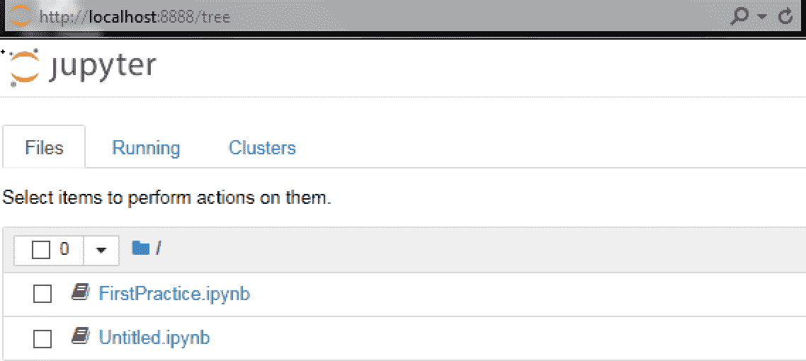
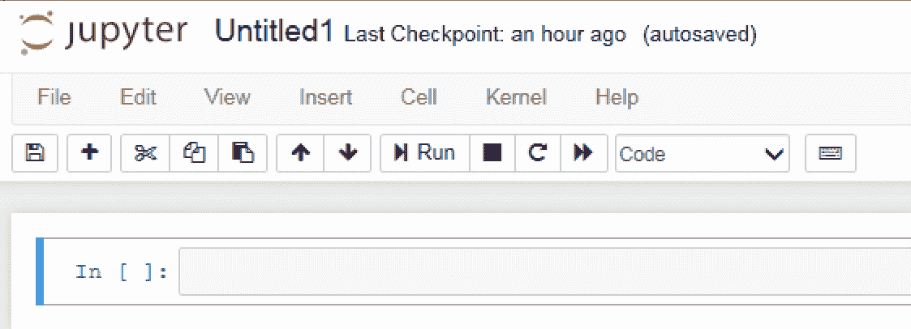
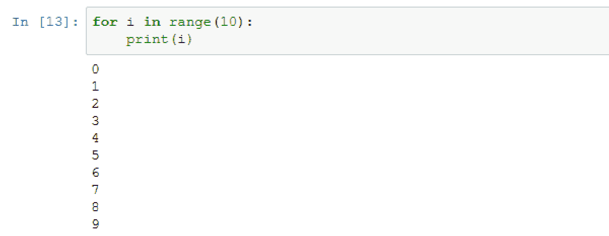
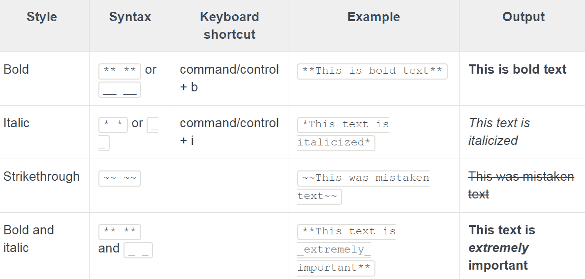
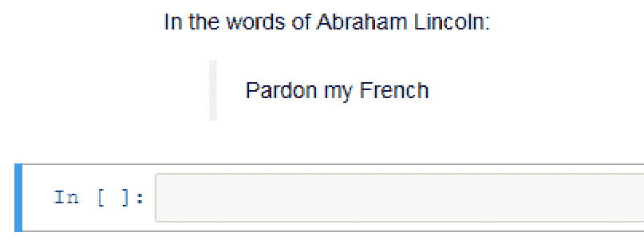

# 一、Python发行版和Jupyter笔记本

在本书中，您将学习使用 Python 进行数据分析的基本概念。在第一章中，我们将学习如何安装 Anaconda 发行版，其中包含了本书所需的所有软件。我们还将了解 Jupyter Notebook，这是我们将在其中完成所有工作的计算环境。这本书的优点是，我们采取了一种实际操作的方法，这将帮助您非常有效地掌握工具。

以下是本章将涉及的主要主题:

*   Python分布及其解决的问题
*   如何将它安装到我们的计算机中，并准备开始工作
*   Jupyter 笔记本，我们将在这里进行计算和分析
*   Jupyter 笔记本中使用的一些有用的命令和键盘快捷键

# Python分布

Anaconda 是一个免费的、易于安装的包管理和环境管理 Python 发行版，为开发人员和数据科学家创建，使科学计算、数据科学、统计分析和机器学习中的包管理和部署成为一项轻松的任务。这是由 Continuum Analytics 制作和分发的软件，可在[https://www.anaconda.com/download/](https://www.anaconda.com/download/)免费下载。

Anaconda 是一个工具箱，是用 Python 进行数据分析的相关工具的现成集合。单独的工具也可以免费下载，但是拿到整个工具箱肯定更方便。这是 Anaconda 解决的主要问题，为您节省了查找每个工具并将其安装到系统上所需的时间。此外，Anaconda 还会处理包依赖关系以及其他潜在的冲突和问题，这些都是单独安装 Python 包的结果。

# 安装Python

打开前面提到的网址，我们会看到每个操作系统的下载选项。因此，在这里，您必须为您的操作系统寻找合适的安装程序。您将看到两个安装程序:一个用于 Python 3.6，另一个用于 Python 2.7。在本书中，我们将使用 Python 3.6:


让我们下载最新版本的 Anaconda 软件并保存在我们的`Downloads`文件夹中。

Here, we choose the 64-bit installer of Anaconda 5.2 for Windows, since we will be working on a Windows environment in this book. Installation for macOS and Linux will also be similar.

安装 Anaconda 非常简单；它与您之前安装的任何其他软件没有什么不同。双击`.exe`文件，在系统上安装软件。这些步骤很简单，安装软件时您会看到正常的提示:

1.  在第一个安装程序对话框中单击下一步。
2.  然后，我们有了许可协议，在这里我们可以在浏览完软件的条款和条件后点击我同意。
3.  从选项中，选择“只有我”，然后单击“下一步”。
4.  选择默认安装目标文件夹，然后单击下一步。
5.  接下来，它会询问您环境变量以及是否要将 Anaconda 注册为默认 Python。选中这两个框，然后单击安装。
6.  安装完成后，单击安装程序对话框中的完成。

# Jupyter 笔记型电脑

Jupyter Notebook 是一个网络应用程序，允许您创建和共享包含实时代码、公式、可视化和解释文本的文档。这是我们将在本书中使用的应用程序。它的用途包括数据清理和转换、数值模拟、统计建模、机器学习等等。Jupyter Notebook 类似于画布或环境，允许您使用编程语言(在我们的例子中是 Python)来执行计算，并以非常方便的方式显示结果。

如果你正在做某种分析工作，这是非常方便的，因为你经常希望包含解释性文本、产生结果的代码和可视化，这些都显示在 Jupyter Notebook 中。因此，用任何编程语言，尤其是 Python，进行分析工作都是一种非常方便的方式。Jupyter 项目诞生于 2014 年的 IPython 项目。现在，它已经发展到支持跨许多其他编程语言的交互式数据科学和科学计算，因此您可以将 Jupyter Notebook 与许多其他编程语言(多达近 20 种语言)一起使用。Jupyter 这个名字来自 Julia、Python 和 R，这是最早支持的三种编程语言。

# 创建自己的木星笔记本

要启动 Anaconda 并打开 Jupyter 笔记本，我们从已安装程序列表中单击 Anaconda 提示符。Anaconda 提示符是一个终端，您可以在其中键入命令。但是首先，让我们在桌面上创建一个名为`PythonDataScience`的文件夹。这将是我们在 Jupyter Notebook 中为这本书编码和运行的所有 Python 代码的存储目录。

一旦终端打开，通过输入命令`cd Desktop/PythonDataScience`并按*进入*导航至`PythonDataScience`。要在该目录中启动 Jupyter Notebook 应用程序，请键入命令`jupyter notebook`并点击*进入*。这将启动应用程序，您将看到应用程序的主屏幕在浏览器的选项卡中打开:



这里有三个标签。一个是“文件”选项卡，您可以在其中看到启动应用程序的文件夹中的所有文件。在“运行”选项卡上，您将看到您正在运行的东西，终端或笔记本。“集群”选项卡显示了有关并行计算的详细信息，但我们不会在本书中使用此功能。

我们将在本书中使用的主要选项卡是“文件”选项卡。要创建新的 Jupyter 笔记本，请转到新建|Python 3 笔记本:



这将启动一个新文件，这是 Jupyter 笔记本，您可以在其中开始编码和运行您的 Python 代码。

# 笔记本用户界面

Jupyter Notebook 有一些非常有用的用户界面，可以在您使用笔记本时显示重要信息和通知。让我们转到“帮助”并单击第一个选项“用户界面之旅”，快速浏览并熟悉 Jupyter 笔记本的界面:


以下是您将在笔记本主页上找到的主要界面:

*   **标题(1)** :这是你的文件名，你也可以更改笔记本的文件名。
*   **菜单栏(2):** 与任何其他桌面应用程序类似，您有一个菜单栏，可以在其中找到与笔记本相关的不同操作。
*   **工具栏(3)** :位于菜单栏下方，包含一些小图标来执行一些常用的执行动作，如保存文件、剪切单元格、粘贴单元格、移动单元格等。
*   **模式指示灯(4)** :位于菜单栏的右侧。笔记本有两种模式，编辑模式和命令模式。命令模式有许多键盘快捷键可以使用。在这种模式下，指示器区域不显示图标，在这种模式下您可以执行的操作是与文件本身有关的操作，例如保存文件、复制和粘贴单元格等。如果您在单元格中，编辑模式允许您在单元格中编写代码或文本。当您处于编辑模式时，您会在指示器区域看到一支小铅笔。

A Jupyter Notebook is composed of two types of cells, code cells and text cells. The border of a selected cell will be green when you are in Edit mode. To go back to Command mode from Edit mode, you can press the *Esc*key or *Ctrl* + *M*. There are many keyboard shortcuts that you can use and there is a list in the Help menu.

*   **内核指示器(5)** :显示系统计算进度的状态。要中断正在进行的计算，可以使用工具栏上的停止按钮。
*   **通知区(6)** :这个区域会显示保存文件，或者中断内核等消息，你会看到你正在通知区执行的动作。

# 使用木星笔记本

让我们打开一个新的 Jupyter 笔记本，创建一个新的 Python 3 笔记本，然后将笔记本命名为`FirstPractice`。如前所述，笔记本是由单元格组成的，您有两种类型的单元格:默认的单元格类型，称为**代码**单元格，另一种类型的单元格是**文本**单元格。每次打开笔记本，我们都有一个代码单元，您可以在其中执行任何 Python 语句。

# 在代码单元中运行代码

我们将运行一些简单的代码语句，并学习如何运行这些语句，还将学习如何将单元格类型从代码更改为文本，反之亦然。让我们通过在第一个代码单元格中键入`1 + 1`来执行第一个代码，如果您使用“运行单元格”按钮运行该单元格的代码，您将在代码单元格下方的行中看到以下输出:


接下来，让我们创建一个变量`a`，将其值赋值为`10`，并运行代码。现在已经创建了这个变量，但是因为我们没有创建任何代码来计算这个变量，所以我们看不到任何输出。但是语句是运行的，现在，如果您使用这个变量，向其中添加`1`，并运行代码，您将看到以下结果:


现在，让我们看一个使用变量`i`的`for`语法的例子:



如果数值在 10 的范围内，代码会告诉笔记本打印`i`的数值，给出前面的结果。

# 在文本单元格中运行标记语法

如上所述，每个单元格的默认类型是代码单元格，我们在这里编写 Python 表达式。另一种类型的单元格是文本单元格，文本单元格用于实际书写文本。在输出下方的单元格中，让我们键入`This is regular text`。要告诉笔记本这不是 Python 代码，这实际上是一些文本，请转到单元格|单元格类型|标记。让我们现在运行它，您会发现您得到的输出只是文本，与我们输入的文本相同:


Jupyter 还允许我们使用 markdown 语法以多种方式格式化文本。如果你不熟悉 markdown，你可以去帮助|Markdown，在那里你会被带到 GitHub 的一个帮助页面。

你可以在 Jupyter 中使用的降价和你在 GitHub 中使用的降价是一样的。

有许多方法可以设置文本的样式和格式；你可以在以下网址找到所有信息:https://help . github . com/articles/basic-writing-and-formatting-syntax/。对于这一章，我们将只看非常重要的标题。

为了创建标题，我们在标题文本前添加一到六个`#`符号。`#`符号的数量决定了标题的大小，从 1 到 6 个`#`符号开始，从最大到最小的标题，如下所示:

```py
# The largest heading
## The second largest heading
###### The smallest heading
```

下面的屏幕截图显示了前面语法的输出:


如果你在一个代码单元格中运行它们，你会得到一堆 Python 命令，但是我们知道我们希望看到这些是格式化的文本，所以我们需要告诉 Notebook，这些实际上是文本，方法是将单元格类型标记为 markdown，当你运行该单元格时，你会得到前面的结果。

# 样式和格式

您可以引入其他格式，例如粗体、斜体、删除线以及粗体和斜体。下表显示了不同的样式及其对应的语法，每个样式都有一个示例:



您也可以引入引号，其语法由`>`符号表示。使用以下语法运行减价单元格:

```py
In the words of Abraham Lincoln:
> Pardon my French
```

这将产生以下结果:



我们发现文本的样式和格式保持不变，类似于`>`之前的文本行，但是引用的文本比正常缩进有一点缩进。

# 列表

您可以在一行或多行前使用`–`或`*`创建项目符号列表。您也可以使用`1`、`2`、`3`等创建编号列表或有序列表:

```py
- George Washington
- John Adams
- Thomas Jefferson

1\. James Madison
2\. James Monroe
3\. John Quincy Adams
```

在运行减价语法时，我们得到以下结果:


您将从网站上获得更多的样式和格式语法，可以在笔记本中使用。

# 有用的键盘快捷键

每次想要运行单元格或者将代码单元格转换为减价单元格时，都要使用鼠标，这非常烦人。为了简化这些任务，我们有很多键盘快捷键，你可以在 Jupyter 中使用。让我们看看一些最重要的。

比如运行一个单元格，如果要运行`1 + 2`的计算，可以点击 *Alt* + *进入*。该快捷方式将在单元格中运行代码，并在输出行下方创建一个新单元格。但如果只是想运行计算，会按 *Ctrl* + *进入*；这将使 Notebook 在该单元格中运行代码并向您显示输出，但不会创建新的单元格。如果要在当前单元格下方插入新单元格，可以按 *B* ，再按 *A* 会在当前单元格上方新建单元格。当您在笔记本中以交互方式工作，并且想要创建许多单元格以有更多的工作空间时，这非常有用。

If you find yourself using a command very often and you want to learn the shortcut key; you can go to Help|Keyboard Shortcuts. You will see a list of all the keyboard shortcuts that you can use in the Notebook.

另一件非常有用的事情是如何将单元格从代码单元格转换为减价单元格。如果要将代码单元格转换为文本单元格，按 *M* 键；这将使您从编辑模式进入命令模式。此外，如果您处于命令模式，并且想要将单元格转换为代码单元格或编辑模式，请按下 *Esc* 键。

# 摘要

在本章中，我们了解了 Anaconda 发行版。我们还安装了课程中将要使用的所有软件，这些软件包含在 Anaconda 发行版中，我们了解了 Jupyter Notebook 以及使用 Jupyter Notebook 的基本知识；关于代码单元格、标记单元格和最有用的键盘命令快捷方式，以便与 Jupyter 一起工作，并使我们的工作流程更加高效。

在下一章中，我们将了解 NumPy，它是进行数值计算的核心库，是 PythonX 系统中每个科学计算项目的核心。