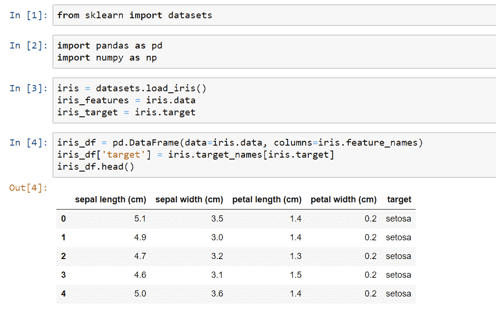
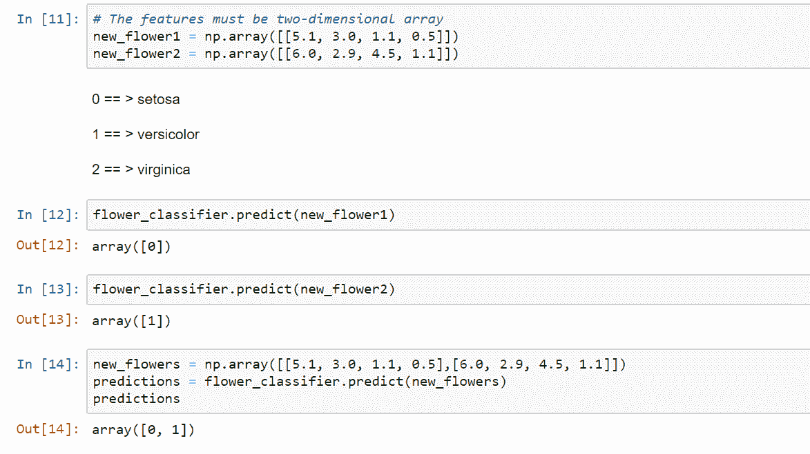
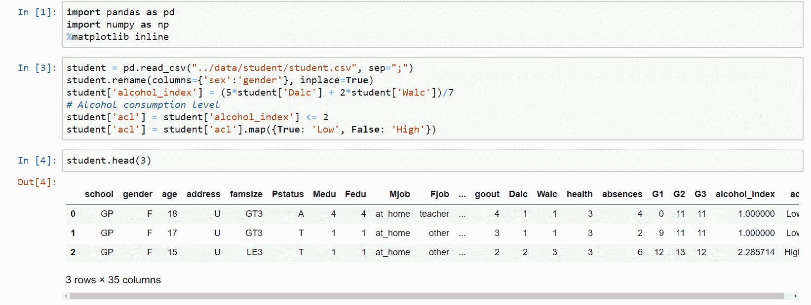
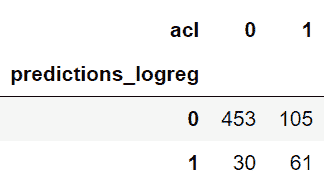
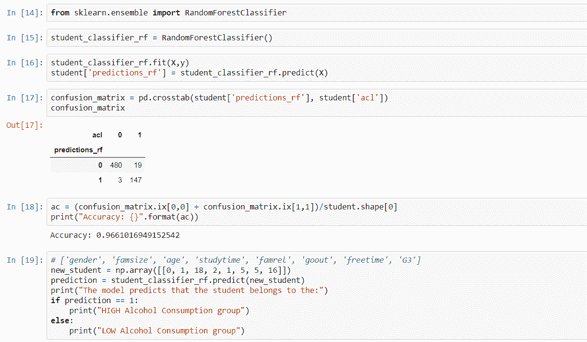
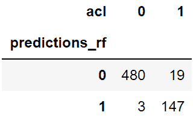
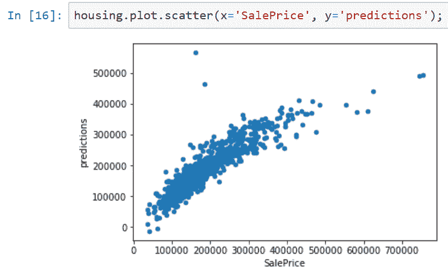
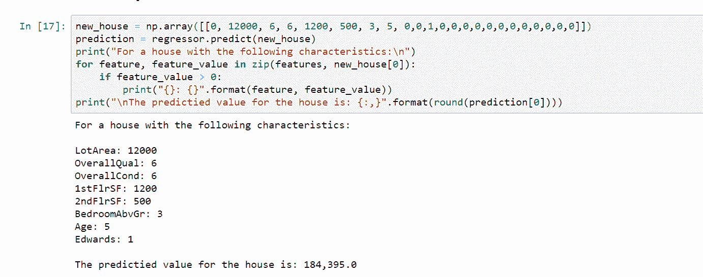
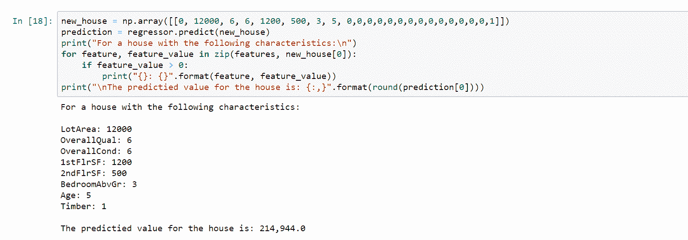

# 六、预测分析模型简介

在本章中，我们将更深入地了解以下主题:

*   预测分析
*   机器学习
*   科学知识文库
*   如何建立分类和回归模型

# 预测分析和机器学习

在本节中，我们将学习预测分析的基础知识。我们还将仔细研究预测分析的机器学习方法。然后我们将继续讨论各种类型的机器学习模型。最后，我们将看看监督学习模型的组成部分。

In this context, prediction does not necessarily refer to the future. It implies guessing something that is unknown or hasn't been observed yet. 

有很多方法可以预测某事。我们可以从询问大祭司或灵媒开始，这是人类几千年来一直在做的事情。另一种方法可以是利用你的直觉或者去问专家；这些都是比较传统的商业惯例。还有各种其他方法可以做到这一点，最近最成功的方法之一叫做**预测分析**。

近年来，预测分析的使用急剧增加。这有两个原因:

*   技术进步给了我们进行这种分析的手段
*   它非常有效、准确，而且效果很好

预测分析是将数据与数学、统计学和计算机科学的技术相结合，对未知事件进行预测。预测分析的目标是对未知事件可能发生的情况进行良好的评估。

*那么，我们如何进行预测分析*？执行预测分析的方法有很多，但进行预测分析最成功的工具之一是机器学习。为了理解这是如何工作的，我们需要理解机器学习。

机器学习是计算机科学的一个子领域。它可以简单地描述为赋予计算机学习的能力，而无需对其进行明确的编程。机器学习领域已经开发了许多方法来教计算机使用数据执行某些任务。这种方法在预测分析方面非常成功。机器学习也有一些缺点。理解使用机器学习时可能面临的问题是至关重要的。我们可以把这些学习问题分成几大类。为了简化这一点，我们将考虑两个组，称为**监督的**和**无监督的**学习。本节主要关注监督学习和创建监督学习模型所需的元素。

在考虑创建机器学习模型时，首先想到的问题是:*一个人如何知道自己应该使用监督学习*？理解这一点的关键在于理解需要预测的目标变量。监督学习有关于任何特定概念/主题的样本或观察。每个观察将有不同的特征，通常称为属性或目标变量。这些目标变量是需要预测的。

让我们考虑一个有几行学生的数据集的例子，它在[第 5 章](5.html)、*用 Python 进行统计计算*中使用。下表描述了性别、年龄、地址和各种其他特征:


如果我们将这些特征中的一个定义为需要预测的目标变量，那么我们将使用监督学习。

监督学习有两个主要关注点:回归和分类。两者的区别很简单。当目标变量本质上是分类的时，分类就发生了。这方面的一些例子包括饮酒量(低或高)或信用卡交易类型。另一方面，如果目标变量是数值变量，那么我们说的是回归问题。数字变量的例子包括房子或股票的价格，或者一个月卖出的单位数量。对于每一类问题，都有许多模型可以用来纠正它们。

我们可以从这一节中去掉两点。首先，我们将把本节中的模型视为一个黑盒。这意味着我不会解释任何关于他们如何在内部工作的细节。考虑到这是预测分析的高级介绍，我们将着眼于如何构建预测模型的大局。这同样适用于庞大的机器学习概念。

# 了解 scikit-learn 库

在本节中，我们将查看`scikit-learn`库，并使用它来实现一个简单的预测模型。为此，我们需要了解`scikit-learn`以及如何将`iris`数据集加载到 Jupyter 笔记本中。然后，我们将进一步了解如何使用`scikit-learn`构建有监督的机器学习模型，并使用该模型构建一个简单的预测模型。

# scikit-learn

`scikit-learn`是做机器学习最流行的 Python 库。它为数据建模和数据分析提供了一个简单高效的应用编程接口和工具。它建立在 NumPy、SciPy 和 Matplotlib 之上。以下是 Jupyter 笔记本的截图:



我们不导入整个库，而是导入真正需要的库。我们需要导入`datasets`对象。这允许我们加载`scikit-learn`提供的所有数据集。

为了更好地理解这个概念，我们将使用`iris`数据集的例子。这与任何机器学习数据集的*你好世界*示例并行运行。下表描述了`iris`数据集中的几行:


该数据集包含一组 150 个花卉观测值；每朵花有四个尺寸，分别是`sepal length`、`sepal width`、`petal length`和`petal width`。除此之外，我们还有花的种类，我们将用它作为目标变量。

整个数据集中提到的物种有`setosa`、`versicolor`和`virginica`。如果我们使用数据集中的测量值来预测花的种类，这是一个分类变量，我们正在执行分类任务。`scikit-learn`中实现的主要 API 是估计器的 API。估计器对象是一个包含模型的对象，我们可以使用该模型从数据中学习。

在笔记本中要做的第一件事是导入估计量，通常称为模型。以下代码用于导入分类器:

```py
from sklearn.neighbors import KNeighborsClassifier
```

这里使用的模型被称为 KNeighbors 模型，它是从`scikit-learn`导入的。然后我们继续创建这个对象的一个实例，它被称为`flower_classifier`。这是通过使用下面一行代码来完成的:

```py
flower_classifier = KNeighborsClassifier(n_neighbors=3)
```

这里，我们为对象提供超参数。如前所述，这些对象被视为黑盒，因此，我们不会深入探讨为什么使用特定的数字或变量。

在此之后，我们使用数据来训练估计器。为此，我们使用`flower_classifier`对象的`fit`方法。这有助于我们传递特征和目标。这意味着我们已经使用特征来识别目标。以下代码及其输出用于训练估计器:


该模型现已准备好进行评估。这是我们不会看到的。假设评估结果令人满意，我们可以用这个模型来制作`predictions`。用于预测花卉种类的特征如下:



The arrays used must be two-dimensional NumPy arrays.

当其为`0`时，数组的输出将该物种分类为一个`setosa`。数字 1 和 2 将物种分别归类为`versicolor`和`virginica`。

为了预测花的种类，我们使用分类器对象，然后通过`new_flower1`。其输出如下:


根据收到的输出，标记为`0`的物种是一个`setosa`。以类似的方式，我们可以预测第二朵花的种类。我们可以继续对各种测量进行同样的操作。

我们可以通过创建 n 个包含各种花的值的二维 NumPy 数组来看到一个累积预测。我们可以称之为`new_flowers`函数。创建名为`predictions`的函数，如下所示:


如所观察到的，第一个值对应于第一朵花并将其分类为`setosa`，而对应于第二朵花的第二个值将其分类为`versicolor`。

# 使用 scikit-learn 构建回归模型

上一节向我们展示了一个使用`scikit-learn`的分类模型的例子。在本节中，我们将训练一个随机森林模型，并使用它进行预测。在这个场景中，我们还将构建一个分类模型作为目标变量。这将是一个描述青少年饮酒习惯的分类值。

为此，我们首先加载上一章中的学生数据集。然后我们将训练一个逻辑回归模型，看看如何在一个非常基本的水平上评估分类模型。

首先，我们加载库，导入学生数据集，并对其进行一些转换，就像我们在上一节中所做的那样。我们的目标是利用学生的特征来预测酒精水平。这些特征是可以高或低的分类值。加载库和数据集的代码如下:



以下是我们希望用于分类模型的所有功能的列表:


The `scikit-learn` library only understands numbers. This makes it important to convert variables that are not numeric in nature into numeric values. To do this, you use dummy features that are more commonly known as one-hot encoding. 

为了对我们的变量进行一次性编码，雌性将对应`0`，雄性将对应`1`。我们将对家庭规模特征和酒精消费水平执行相同的转换；下限将被指定为 0，上限将被指定为 1。代码应该如下所示:


B11522_6_013

然后，我们使用以下代码将这些值保存到对象`X`和`Y`中:

```py
X = student[features].values
y = student[target].values
```

为了建立一个简单的模型，我们需要预测最常见的类别。在本例中，我们可以使用以下代码找到最常见的类别:


这清楚地表明，大约 74%的学生报告说饮酒量很低。因此，我们可以构建一个简单的模型，对 74%的未发现病例进行正确分类。这个数字很重要，因为它为我们提供了第一个基准，我们可以用它来比较我们构建的模型有多好。

我们现在开始建立一个预测模型，称为逻辑回归。我们将导入模型，创建这个对象的实例，然后用我们的数据训练模型。下面的代码块描述了如何做到这一点:


为了彻底评估这个模型，我们需要用交叉验证来评估这个模型。我们将在本节中进行的评估本质上是幼稚或基本的。这样做是为了让你对这个概念有一个大概的了解。总体思路如下:


我们从计算模型预测的单元格中的预测开始。然后，我们将这些预测与实际观测结果制成表格，并建立起一个叫做混淆矩阵的东西:



矩阵的对角线描述了分类器做出正确预测的情况数量。然后我们可以用这些数字来计算一个简单的评估矩阵`Accuracy`。这只是模型产生的正确预测的一小部分。因此，在所有这些预测中，左上角和右下角的值是正确的。

利用这一点，我们可以发现模型的准确性。下面的代码帮助我们做到这一点:


据观察，我们的模型的精度为 0.79 或 79%。我们将这个值与我们的简单模型的准确率进行了比较，准确率为 74%。从两个模型获得的值相差不大。原因可能是逻辑回归模型是一个相当简单的模型。

我们可以尝试使用更复杂的模型`RandomForestClassifier`。我们将使用这个模型作为一个黑盒，只是为了看到准确性的变化。我们首先导入一个对象，创建该对象的实例，用数据训练模型，然后生成预测。下面的代码块用于实现这一点:



在这里，我们构建了一个新的混淆矩阵，如下所示，并且观察到该模型的准确性很高:



在代码的最后，我们达到了 96%的准确率。究其原因，随机森林等复杂模型往往会进行过拟合。过度拟合是模型学习数据集中发生的事情的概念，但是这种知识不能概括看不见的数据。

这是为什么模型评估在本质上非常复杂并且需要交叉验证的主要原因之一。然而，准确度矩阵是一种经常与预测模型一起使用的矩阵。

我们现在可以继续使用这个模型来预测看不见的数据。假设我们有一个具有各种特征的新学生。在这种情况下，学生是一个大家庭的男性，年龄为 18 岁。他每周学习 2 小时，家庭关系不太好等等。我们可以用下面的代码找出他的饮酒量:


然后模型预测学生属于`HIGH Alcohol Consumption group`。

让我们假设另一个案例研究，其中学生是一名女性，她在学校表现非常好，期末成绩为 16。下面的截图描述了代码的输出:


该模型预测具有这些特征的学生将属于`LOW Alcohol Consumption`组。

# 预测房价的回归模型

在本节中，我们将使用前几节中的房屋数据集构建回归模型。我们首先加载房价数据集，并为建模做准备。然后，我们训练一个线性回归模型，并以简单但直观的方式评估这个模型。最后，我们将使用这个模型进行预测。

我们加载需要使用的库，并导入数据集。正如在前面几节中所观察到的，我们意识到这样一个事实，即在这个数据集中有许多包含很少观测值的邻域。为了消除这种情况，我们将只对具有超过 30 个观察值的邻域使用该模型。为此，我们需要使用以下代码块:

```py
counts = housing['Neighborhood'].value_counts()
more_than_30 = list(counts[counts>30].index)
housing = housing.loc[housing['Neighborhood'].isin(more_than_30)]
```

基于前面部分的探索性数据分析，我们将为我们的模型选择以下特性:

```py
features = ['CentralAir', 'LotArea', 'OverallQual', 'OverallCond', 
 '1stFlrSF', '2ndFlrSF', 'BedroomAbvGr', 'Age']
target = 'SalePrice'
```

据观察，目标变量将是一所房子的`SalePrice`，由于这是一个数值变量，我们正在处理一个回归问题。

众所周知，`Neighborhood`和`CentralAir`这两个特征本质上不是数值，因此需要转化为数值变量。为此，我们使用以下代码行:

```py
# Neighborhood
 dummies_nb = pd.get_dummies(housing['Neighborhood'], drop_first=True)
 housing = pd.concat([housing, dummies_nb], axis=1)
 # CentralAir
 housing['CentralAir'] = housing['CentralAir'].map({'N':0, 'Y':1}).astype(int)
```

这两行代码为每个邻域创建了一个新变量，称为虚拟变量。这实际上为每个邻域创建了一个新的向量，其值为`1`。如果房子属于那个街区，就是这种情况。如果房屋不属于该邻域，它会创建一个值为`0`的新向量。我们还将`0`分配给没有`CentralAir`的房子，`1`分配给有`CentralAir`的房子。

然后，我们将这些新特征添加到我们的特征列表中，并创建包含我们的特征、目标变量和观察次数的对象:


在我们训练我们的模型之前，我们需要确保它是简单的。对于回归模型，最简单的可能模型只是预测平均值。为了获得平均值，我们使用以下代码:


我们目标变量的平均值约为 180，000 美元。对于模型评估，我们将使用称为均方根误差的评估指标，通常称为 RMSE。公式如下:


它将观测值与预测值进行比较。观测值和预测值越接近，度量就越小。我们想要尽可能小的度量。

为了计算简单模型的均方根误差，我们将使用以下代码行:


我们注意到这个价值大约是 70，000 美元。

为了构建回归模型，我们首先导入一个对象，然后创建该对象的一个实例。我们训练模型并做出预测:


为了计算模型的均方根误差，我们需要实现以下代码行:


这个模型的输出约为 33，000 美元，与我们的简单模型相比，这个数字要低得多。为了可视化和比较我们拥有的`predictions`和房屋的真实`SalePrice`，我们可以使用以下函数创建散点图:



散点图清楚地描绘了预测非常接近房屋的实际`SalePrices`。这证明模型是准确的。

接下来，我们将预测具有各种特征的新房的价值。房子有 6 的`CentralAir`、`LotArea`、`OverallQual`，6 的`OverallCond`。预测这栋房子价值的代码如下:



该模型预测这来自`Edwards`邻域并且具有`188,455`值。

举个不同的例子，假设这个房子没有`CentralAir`，属于`Timber`小区，你可以换个小区。代码的输出如下:



然后模型预测房子的价值是`£214,944`。我们可以使用相同的代码对不同的房子进行预测。现在，请记住，我们在本节中构建的模型没有经过全面评估。虽然我们已经使用了流行的度量标准进行评估，但是机器学习建模的一个关键步骤是使用交叉验证。这对于模型性能的良好评估是绝对必要的。

# 摘要

在本章中，我们学习了预测分析和一些与监督机器学习相关的概念，并获得了如何使用 Python 执行机器学习的基本知识。我们还看了使用`scikit-learn`的预测分析的各种实际应用。我们仔细研究了如何训练分类模型，然后使用它进行预测。我们还建立了一个回归模型，并用它来做预测。