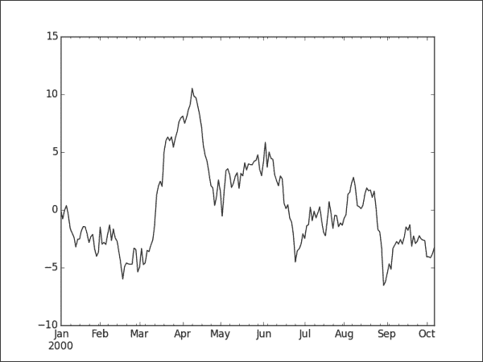
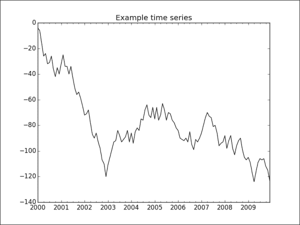
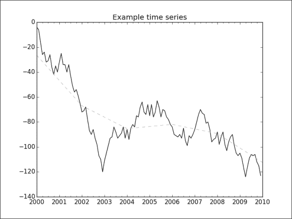

# 第五章。时间序列

时间序列通常由一系列数据点组成，这些数据点来自随时间进行的测量。这种数据非常常见，出现在许多领域。

企业高管对股票价格、商品和服务价格或月销售额感兴趣。气象学家一天测量几次温度，并记录下降雨量、湿度、风向和风力。神经科医生可以使用脑电图来测量大脑沿头皮的电活动。一个社会学家可以利用竞选捐款数据来了解政党及其支持者，并将这些见解作为论证的辅助手段。时间序列数据的更多例子几乎可以无穷无尽地列举出来。

# 时间序列引物

一般来说，时间序列有两个目的。首先，它们帮助我们了解生成数据的底层过程。另一方面，我们希望能够使用现有数据预测相同或相关系列的未来值。当我们测量温度、降水或风时，我们希望更多地了解更复杂的事情，例如天气或一个地区的气候，以及各种因素如何相互作用。同时，我们可能对天气预报感兴趣。

在这一章中，我们将探索Pandas的时间序列能力。除了强大的核心数据结构——系列和数据框架——Pandas还附带了处理时间相关数据的辅助功能。凭借其广泛的内置优化，Pandas 能够轻松处理包含数百万个数据点的大型时间序列。

我们将逐步接近时间序列，从日期和时间对象的基本构件开始。

# 处理日期和时间对象

Python 支持标准库中日期时间模块中的日期和时间处理:

```py
>>> import datetime
>>> datetime.datetime(2000, 1, 1)
datetime.datetime(2000, 1, 1, 0, 0)

```

有时，日期是作为字符串给出或预期的，因此从字符串到字符串的转换是必要的，这分别通过两个函数实现:`strptime`和`strftime`:

```py
>>> datetime.datetime.strptime("2000/1/1", "%Y/%m/%d")
datetime.datetime(2000, 1, 1, 0, 0)
>>> datetime.datetime(2000, 1, 1, 0, 0).strftime("%Y%m%d")
'20000101'

```

现实世界的数据通常有各种各样的形状，如果我们不需要记住解析时指定的确切日期格式，那就太好了。谢天谢地，Pandas在处理代表日期或时间的字符串时，消除了很多摩擦。这些辅助功能之一是`to_datetime`:

```py
>>> import pandas as pd
>>> import numpy as np
>>> pd.to_datetime("4th of July")
Timestamp('2015-07-04 
>>> pd.to_datetime("13.01.2000")
Timestamp('2000-01-13 00:00:00')
>>> pd.to_datetime("7/8/2000")
Timestamp('2000-07-08 00:00:00')

```

最后一个可以指 8 月 7 日或 7 月 8 日，视地区而定。为了消除这种情况的歧义，可以给`to_datetime`传递一个关键字参数`dayfirst`:

```py
>>> pd.to_datetime("7/8/2000", dayfirst=True)
Timestamp('2000-08-07 00:00:00')

```

时间戳对象可以被视为Pandas版本的`datetime`对象，事实上，`Timestamp`类是`datetime`的子类:

```py
>>> issubclass(pd.Timestamp, datetime.datetime)
True

```

这意味着它们在许多情况下可以互换使用:

```py
>>> ts = pd.to_datetime(946684800000000000)
>>> ts.year, ts.month, ts.day, ts.weekday()
(2000, 1, 1, 5)

```

时间戳对象是 Pandas 时间序列功能的重要组成部分，因为时间戳是`DateTimeIndex`对象的构造块:

```py
>>> index = [pd.Timestamp("2000-01-01"),
 pd.Timestamp("2000-01-02"),
 pd.Timestamp("2000-01-03")]
>>> ts = pd.Series(np.random.randn(len(index)), index=index)
>>> ts
2000-01-01    0.731897
2000-01-02    0.761540
2000-01-03   -1.316866
dtype: float64
>>> ts.indexDatetime
Index(['2000-01-01', '2000-01-02', '2000-01-03'],
dtype='datetime64[ns]', freq=None, tz=None)

```

这里有几点需要注意:我们创建一个时间戳对象列表，并将其作为索引传递给系列构造器。这个时间戳列表被动态转换成`DatetimeIndex`。如果我们只通过了日期字符串，我们就不会得到一个`DatetimeIndex`，只是一个`index`:

```py
>>> ts = pd.Series(np.random.randn(len(index)), index=[
 "2000-01-01", "2000-01-02", "2000-01-03"])
>>> ts.index
Index([u'2000-01-01', u'2000-01-02', u'2000-01-03'], dtype='object')

```

然而，`to_datetime`函数足够灵活，如果我们只有一个日期字符串列表，那么它会有所帮助:

```py
>>> index = pd.to_datetime(["2000-01-01", "2000-01-02", "2000-01-03"])
>>> ts = pd.Series(np.random.randn(len(index)), index=index)
>>> ts.index
DatetimeIndex(['2000-01-01', '2000-01-02', '2000-01-03'], dtype='datetime64[ns]', freq=None, tz=None))

```

另外需要注意的是，虽然我们有一个`DatetimeIndex`，但是`freq`和`tz`属性都是`None`。我们将在本章后面学习这两种属性的效用。

借助`to_datetime`我们能够将各种字符串甚至字符串列表转换成时间戳或`DatetimeIndex`对象。有时，我们没有明确地得到关于一个序列的所有信息，我们必须自己生成固定间隔的时间戳序列。

Pandas为这个任务提供了另一个巨大的实用功能:`date_range`。

`date_range`功能有助于在开始日期和结束日期之间生成固定频率的`datetime`索引。还可以指定开始或结束日期以及要生成的时间戳数量。

频率可由`freq`参数指定，该参数支持多个偏移。您可以使用典型的时间间隔，如小时、分钟和秒钟:

```py
>>> pd.date_range(start="2000-01-01", periods=3, freq='H')
DatetimeIndex(['2000-01-01 00:00:00', '2000-01-01 01:00:00', '2000-01-01 02:00:00'], dtype='datetime64[ns]', freq='H', tz=None)
>>> pd.date_range(start="2000-01-01", periods=3, freq='T')
DatetimeIndex(['2000-01-01 00:00:00', '2000-01-01 00:01:00', '2000-01-01 00:02:00'], dtype='datetime64[ns]', freq='T', tz=None)
>>> pd.date_range(start="2000-01-01", periods=3, freq='S')
DatetimeIndex(['2000-01-01 00:00:00', '2000-01-01 00:00:01', '2000-01-01 00:00:02'], dtype='datetime64[ns]', freq='S', tz=None)

```

`freq`属性允许我们指定多个选项。Pandas已经成功地应用于金融和经济领域，不仅仅是因为处理商务约会非常简单。例如，要获得千禧年前三个工作日的指数，可以使用`B`偏移别名:

```py
>>> pd.date_range(start="2000-01-01", periods=3, freq='B')
DatetimeIndex(['2000-01-03', '2000-01-04', '2000-01-05'], dtype='datetime64[ns]', freq='B', tz=None)

```

下表显示了可用的偏移别名，也可以在Pandas文档[下的时间序列](http://pandas.pydata.org/pandas-docs/stable/timeseries.html#offset-aliases)中查找:

<colgroup><col style="text-align: left"> <col style="text-align: left"></colgroup> 
| 

别名

 | 

描述

 |
| --- | --- |
| B | 工作日频率 |
| C | 自定义工作日频率 |
| D | 日历日频率 |
| W | 每周频率 |
| M | 月末频率 |
| 医学学士 | 营业月末频率 |
| 大陆弹道导弹(Continental Ballistic Missile) | 自定义业务月末频率 |
| 女士 | 月份开始频率 |
| BachelorofMarineScience 海洋科学学士 | 营业月开始频率 |
| CBMS | 自定义业务月开始频率 |
| Q | 四分之一结束频率 |
| 贝克勒尔 | 业务季度频率 |
| QS | 四分之一开始频率 |
| BQS | 业务季度开始频率 |
| A | 年终频率 |
| 钡 | 营业年度结束频率 |
| 如同 | 年度开始频率 |
| 停下 | 业务年度开始频率 |
| 钅波 | 营业时间频率 |
| H | 每小时频率 |
| T | 微小频率 |
| S | 其次是频率 |
| L | 毫秒 |
| U | 微秒 |
| 普通 | 纳秒 |

此外，偏移别名也可以组合使用。这里，我们生成一个`datetime`索引，包含五个元素，每一个相隔一天、一小时、一分钟和一秒钟:

```py
>>> pd.date_range(start="2000-01-01", periods=5, freq='1D1h1min10s')
DatetimeIndex(['2000-01-01 00:00:00', '2000-01-02 01:01:10', '2000-01-03 02:02:20', '2000-01-04 03:03:30', '2000-01-05 04:04:40'], dtype='datetime64[ns]', freq='90070S', tz=None)

```

如果我们想在每 12 个小时的工作时间内索引数据，默认情况下从上午 9 点开始，下午 5 点结束，我们只需在`BH`别名前加上前缀:

```py
>>> pd.date_range(start="2000-01-01", periods=5, freq='12BH')
DatetimeIndex(['2000-01-03 09:00:00', '2000-01-04 13:00:00', '2000-01-06 09:00:00', '2000-01-07 13:00:00', '2000-01-11 09:00:00'], dtype='datetime64[ns]', freq='12BH', tz=None)

```

业务时间的自定义定义也是可能的:

```py
>>> ts.index
DatetimeIndex(['2000-01-01', '2000-01-02', '2000-01-03'], dtype='datetime64[ns]', freq=None, tz=None)

```

我们也可以使用这个定制的工作时间来构建索引:

```py
>>> pd.date_range(start="2000-01-01", periods=5, freq=12 * bh)
DatetimeIndex(['2000-01-03 07:00:00', '2000-01-03 19:00:00', '2000-01-04 07:00:00', '2000-01-04 19:00:00', '2000-01-05 07:00:00', '2000-01-05 19:00:00', '2000-01-06 07:00:00'], dtype='datetime64[ns]', freq='12BH', tz=None)

```

一些频率允许我们指定锚定后缀，这允许我们表达间隔，例如每个星期五或每月的第二个星期二:

```py
>>> pd.date_range(start="2000-01-01", periods=5, freq='W-FRI')
DatetimeIndex(['2000-01-07', '2000-01-14', '2000-01-21', '2000-01-28', '2000-02-04'], dtype='datetime64[ns]', freq='W-FRI', tz=None)
>>> pd.date_range(start="2000-01-01", periods=5, freq='WOM-2TUE')
DatetimeIndex(['2000-01-11', '2000-02-08', '2000-03-14', '2000-04-11', '2000-05-09'], dtype='datetime64[ns]', freq='WOM-2TUE', tz=None)

```

最后，我们可以合并不同频率的各种指标。可能性是无穷的。我们仅举一个例子，其中我们结合了两个指数——每个指数都超过十年——一个指向一年中的每个第一个工作日，一个指向二月的最后一天:

```py
>>> s = pd.date_range(start="2000-01-01", periods=10, freq='BAS-JAN')
>>> t = pd.date_range(start="2000-01-01", periods=10, freq='A-FEB')
>>> s.union(t)
DatetimeIndex(['2000-01-03', '2000-02-29', '2001-01-01', '2001-02-28', '2002-01-01', '2002-02-28', '2003-01-01', '2003-02-28','2004-01-01', '2004-02-29', '2005-01-03', '2005-02-28', '2006-01-02', '2006-02-28', '2007-01-01', '2007-02-28','2008-01-01', '2008-02-29', '2009-01-01', '2009-02-28'], dtype='datetime64[ns]', freq=None, tz=None)

```

我们看到，2000 年和 2005 年不是从一个工作日开始的，2000 年、2004 年和 2008 年是闰年。

到目前为止，我们已经看到了两个强大的功能，`to_datetime`和`date_range`。现在，我们想深入时间序列，首先展示如何创建和绘制只有几行的时间序列数据。在本节的剩余部分，我们将展示访问和切片时间序列数据的各种方法。

Pandas的时间序列数据很容易上手。可以创建一个随机游走，并绘制成几行:

```py
>>> index = pd.date_range(start='2000-01-01', periods=200, freq='B')
>>> ts = pd.Series(np.random.randn(len(index)), index=index)
>>> walk = ts.cumsum()
>>> walk.plot()

```

下图显示了该图的可能输出:



与通常的系列对象一样，您可以选择零件并分割索引:

```py
>>> ts.head()
2000-01-03    1.464142
2000-01-04    0.103077
2000-01-05    0.762656
2000-01-06    1.157041
2000-01-07   -0.427284
Freq: B, dtype: float64
>>> ts[0]
1.4641415817112928
>>> ts[1:3]
2000-01-04    0.103077
2000-01-05    0.762656

```

我们可以使用日期字符串作为键，尽管我们的系列有一个`DatetimeIndex`:

```py
>>> ts['2000-01-03']
1.4641415817112928

```

即使`DatetimeIndex`是由时间戳对象组成的，我们也可以使用`datetime`对象作为密钥:

```py
>>> ts[datetime.datetime(2000, 1, 3)]
1.4641415817112928

```

访问类似于字典或列表中的查找，但功能更强大。例如，我们可以用字符串甚至混合对象进行切片:

```py
>>> ts['2000-01-03':'2000-01-05']
2000-01-03    1.464142
2000-01-04    0.103077
2000-01-05    0.762656
Freq: B, dtype: float64
>>> ts['2000-01-03':datetime.datetime(2000, 1, 5)]
2000-01-03    1.464142
2000-01-04    0.103077
2000-01-05    0.762656
Freq: B, dtype: float64
>>> ts['2000-01-03':datetime.date(2000, 1, 5)]
2000-01-03   -0.807669
2000-01-04    0.029802
2000-01-05   -0.434855
Freq: B, dtype: float64 

```

甚至可以使用部分字符串来选择条目组。如果我们只对二月感兴趣，我们可以简单地写道:

```py
>>> ts['2000-02']
2000-02-01    0.277544
2000-02-02   -0.844352
2000-02-03   -1.900688
2000-02-04   -0.120010
2000-02-07   -0.465916
2000-02-08   -0.575722
2000-02-09    0.426153
2000-02-10    0.720124
2000-02-11    0.213050
2000-02-14   -0.604096
2000-02-15   -1.275345
2000-02-16   -0.708486
2000-02-17   -0.262574
2000-02-18    1.898234
2000-02-21    0.772746
2000-02-22    1.142317
2000-02-23   -1.461767
2000-02-24   -2.746059
2000-02-25   -0.608201
2000-02-28    0.513832
2000-02-29   -0.132000

```

查看从 3 月到 5 月的所有条目，包括:

```py
>>> ts['2000-03':'2000-05']
2000-03-01    0.528070
2000-03-02    0.200661
 ...
2000-05-30    1.206963
2000-05-31    0.230351
Freq: B, dtype: float64 

```

时间序列可以在时间上向前或向后移动。索引保持不变，值移动:

```py
>>> small_ts = ts['2000-02-01':'2000-02-05']
>>> small_ts
2000-02-01    0.277544
2000-02-02   -0.844352
2000-02-03   -1.900688
2000-02-04   -0.120010
Freq: B, dtype: float64
>>> small_ts.shift(2)
2000-02-01         NaN
2000-02-02         NaN
2000-02-03    0.277544
2000-02-04   -0.844352
Freq: B, dtype: float64

```

为了在时间上向后移动，我们简单地使用负值:

```py
>>> small_ts.shift(-2)
2000-02-01   -1.900688
2000-02-02   -0.120010
2000-02-03         NaN
2000-02-04         NaN
Freq: B, dtype: float64

```

# 重新采样时间序列

重采样描述时间序列数据的频率转换过程。在各种情况下，这是一种有用的技术，因为它通过将数据分组和聚合来促进理解。有可能根据每日温度数据创建一个新的时间序列，显示每周或每月的平均温度。另一方面，现实世界的数据可能不是以统一的时间间隔获取的，需要将观测值映射到统一的时间间隔，或者填充某些时间点的缺失值。这是重采样的两个主要使用方向:宁滨和聚集，以及填充缺失的数据。下采样和上采样也发生在其他领域，例如数字信号处理。在那里，下采样的过程通常被称为抽取，并执行采样率的降低。逆过程称为 **插值**，采样速率增加。我们将从数据分析的角度来看两个方向。

# 下采样时间序列数据

下采样减少数据中的样本数量。在这个缩减过程中，我们能够在数据点上应用聚合。让我们想象一个繁忙的机场，每小时有成千上万的人经过。机场管理局在主要区域安装了一个访客柜台，以便准确了解他们的机场有多繁忙。

他们每分钟都在从计数器接收数据。以下是一天的假设测量值，从 08:00 开始，600 分钟后的 18:00 结束:

```py
>>> rng = pd.date_range('4/29/2015 8:00', periods=600, freq='T')
>>> ts = pd.Series(np.random.randint(0, 100, len(rng)), index=rng)
>>> ts.head()
2015-04-29 08:00:00     9
2015-04-29 08:01:00    60
2015-04-29 08:02:00    65
2015-04-29 08:03:00    25
2015-04-29 08:04:00    19

```

为了更好地了解一天的情况，我们可以将这个时间序列下采样到更大的间隔，例如 10 分钟。我们也可以选择聚合函数。默认聚合是取所有值并计算平均值:

```py
>>> ts.resample('10min').head()
2015-04-29 08:00:00    49.1
2015-04-29 08:10:00    56.0
2015-04-29 08:20:00    42.0
2015-04-29 08:30:00    51.9
2015-04-29 08:40:00    59.0
Freq: 10T, dtype: float64

```

在我们的机场示例中，我们还对值的总和感兴趣，即给定时间范围内的游客总数。我们可以通过向`how`参数传递一个函数或函数名来选择聚合函数:

```py
>>> ts.resample('10min', how='sum').head()
2015-04-29 08:00:00    442
2015-04-29 08:10:00    409
2015-04-29 08:20:00    532
2015-04-29 08:30:00    433
2015-04-29 08:40:00    470
Freq: 10T, dtype: int64

```

或者，我们可以通过重新采样到每小时一次的间隔来进一步缩短采样间隔:

```py
>>> ts.resample('1h', how='sum').head()
2015-04-29 08:00:00    2745
2015-04-29 09:00:00    2897
2015-04-29 10:00:00    3088
2015-04-29 11:00:00    2616
2015-04-29 12:00:00    2691
Freq: H, dtype: int64

```

我们也可以要求其他东西。例如，一小时内通过我们机场的最大人数是多少:

```py
>>> ts.resample('1h', how='max').head()
2015-04-29 08:00:00    97
2015-04-29 09:00:00    98
2015-04-29 10:00:00    99
2015-04-29 11:00:00    98
2015-04-29 12:00:00    99
Freq: H, dtype: int64

```

或者，如果我们对更不寻常的度量感兴趣，我们可以定义一个自定义函数。例如，我们可能有兴趣为每个小时选择一个随机样本:

```py
>>> import random
>>> ts.resample('1h', how=lambda m: random.choice(m)).head()
2015-04-29 08:00:00    28
2015-04-29 09:00:00    14
2015-04-29 10:00:00    68
2015-04-29 11:00:00    31
2015-04-29 12:00:00     5 

```

如果通过字符串指定函数，Pandas 会使用高度优化的版本。

可以作为`how`参数的内置函数有:`sum`、`mean`、`std, sem`、`max`、`min`、`median`、`first`、`last`、`ohlc`。`ohlc`指标在金融界很流行。它代表开-高-低-关。OHLC 图表是说明金融工具价格随时间变化的典型方法。

虽然在我们的机场，这个指标可能没有那么有价值，但我们仍然可以计算出来:

```py
>>> ts.resample('1h', how='ohlc').head()
 open  high  low  close
2015-04-29 08:00:00     9    97    0     14
2015-04-29 09:00:00    68    98    3     12
2015-04-29 10:00:00    71    99    1      1
2015-04-29 11:00:00    59    98    0      4
2015-04-29 12:00:00    56    99    3
 55

```

# 对时间序列数据进行上采样

在上采样中，时间序列的频率增加。因此，我们的样本点比数据点多。其中一个主要问题是如何解释我们没有度量的系列中的条目。

让我们从一天中每小时的数据开始:

```py
>>> rng = pd.date_range('4/29/2015 8:00', periods=10, freq='H')
>>> ts = pd.Series(np.random.randint(0, 100, len(rng)), index=rng)
>>> ts.head()
2015-04-29 08:00:00    30
2015-04-29 09:00:00    27
2015-04-29 10:00:00    54
2015-04-29 11:00:00     9
2015-04-29 12:00:00    48
Freq: H, dtype: int64

```

如果我们将向上采样到每 15 分钟采集一次的数据点，我们的时间序列将扩展为`NaN`值:

```py
>>> ts.resample('15min')
>>> ts.head()
2015-04-29 08:00:00    30
2015-04-29 08:15:00   NaN
2015-04-29 08:30:00   NaN
2015-04-29 08:45:00   NaN
2015-04-29 09:00:00    27

```

处理缺失值的方法有多种，可以通过`fill_method`关键字参数控制重新采样。值可以向前或向后填充:

```py
>>> ts.resample('15min', fill_method='ffill').head()
2015-04-29 08:00:00    30
2015-04-29 08:15:00    30
2015-04-29 08:30:00    30
2015-04-29 08:45:00    30
2015-04-29 09:00:00    27
Freq: 15T, dtype: int64
>>> ts.resample('15min', fill_method='bfill').head()
2015-04-29 08:00:00    30
2015-04-29 08:15:00    27
2015-04-29 08:30:00    27
2015-04-29 08:45:00    27
2015-04-29 09:00:00    27

```

使用`limit`参数，可以控制要填充的缺失值的数量:

```py
>>> ts.resample('15min', fill_method='ffill', limit=2).head()
2015-04-29 08:00:00    30
2015-04-29 08:15:00    30
2015-04-29 08:30:00    30
2015-04-29 08:45:00   NaN
2015-04-29 09:00:00    27
Freq: 15T, dtype: float64

```

如果要在重采样过程中调整标签，可以使用`loffset`关键字参数:

```py
>>> ts.resample('15min', fill_method='ffill', limit=2, loffset='5min').head()
2015-04-29 08:05:00    30
2015-04-29 08:20:00    30
2015-04-29 08:35:00    30
2015-04-29 08:50:00   NaN
2015-04-29 09:05:00    27
Freq: 15T, dtype: float64

```

还有另一种方式填写缺失值。我们可以使用一种算法来构建新的数据点，以某种方式适合现有的点，以某种方式定义。这个过程叫做插值。

我们可以让Pandas为我们插入一个时间序列:

```py
>>> tsx = ts.resample('15min')
>>> tsx.interpolate().head()
2015-04-29 08:00:00    30.00
2015-04-29 08:15:00    29.25
2015-04-29 08:30:00    28.50
2015-04-29 08:45:00    27.75
2015-04-29 09:00:00    27.00
Freq: 15T, dtype: float64

```

我们看到默认的`interpolate`方法——线性插值——正在运行。Pandas在两个现存点之间呈现线性关系。

Pandas支持十几个`interpolation`功能，其中一些需要安装`scipy`库。我们不会在本章介绍`interpolation`方法，但我们鼓励您自己探索各种方法。正确的`interpolation`方法将取决于您的应用要求。

# 时区处理

虽然默认情况下，Pandas对象不知道时区，但许多现实世界的应用程序会使用时区。和使用时间一样，时区也不是小事:你知道哪些国家有夏令时吗？你知道这些国家的时区是什么时候转换的吗？令人欣慰的是，Pandas 基于两个广受欢迎且经过验证的实用程序库的时区功能来处理时间和日期:`pytz`和`dateutil`:

```py
>>> t = pd.Timestamp('2000-01-01')
>>> t.tz is None
True

```

要提供时区信息，可以使用`tz`关键字参数:

```py
>>> t = pd.Timestamp('2000-01-01', tz='Europe/Berlin')
>>> t.tz
<DstTzInfo 'Europe/Berlin' CET+1:00:00 STD>

```

这同样适用于`ranges`:

```py
>>> rng = pd.date_range('1/1/2000 00:00', periods=10, freq='D', tz='Europe/London')
>>> rng
DatetimeIndex(['2000-01-01', '2000-01-02', '2000-01-03', '2000-01-04', '2000-01-05', '2000-01-06', '2000-01-07', '2000-01-08','2000-01-09', '2000-01-10'], dtype='datetime64[ns]', freq='D', tz='Europe/London')

```

时区对象也可以预先构建:

```py
>>> import pytz
>>> tz = pytz.timezone('Europe/London')
>>> rng = pd.date_range('1/1/2000 00:00', periods=10, freq='D', tz=tz)
>>> rng
DatetimeIndex(['2000-01-01', '2000-01-02', '2000-01-03', '2000-01-04', '2000-01-05', '2000-01-06', '2000-01-07', '2000-01-08', '2000-01-09', '2000-01-10'], dtype='datetime64[ns]', freq='D', tz='Europe/London')

```

有时，您已经有一个时区不知道的时间序列对象，您想让时区知道。`tz_localize`功能有助于在时区感知对象和时区不感知对象之间切换:

```py
>>> rng = pd.date_range('1/1/2000 00:00', periods=10, freq='D')
>>> ts = pd.Series(np.random.randn(len(rng)), rng)
>>> ts.index.tz is None
True
>>> ts_utc = ts.tz_localize('UTC')
>>> ts_utc.index.tz
<UTC>

```

要将时区感知对象移动到其他时区，可以使用`tz_convert`方法:

```py
>>> ts_utc.tz_convert('Europe/Berlin').index.tz
<DstTzInfo 'Europe/Berlin' LMT+0:53:00 STD>

```

最后，要从对象中分离任何时区信息，可以将`None`传递给`tz_convert`或`tz_localize`:

```py
>>> ts_utc.tz_convert(None).index.tz is None
True
>>> ts_utc.tz_localize(None).index.tz
 is None
True

```

# 超时

除了作为`DatetimeIndex`构建模块的强大的时间戳对象，Pandas 0.15 中还引入了另一个有用的数据结构——时间增量。时间增量也可以作为指数的基础，在本例中为`TimedeltaIndex`。

时间增量是以不同单位表示的时间差异。Pandas 中的`Timedelta`类是 Python 标准库中`datetime.timedelta`的子类。与其他Pandas数据结构一样，时间增量可以由多种输入构建:

```py
>>> pd.Timedelta('1 days')
Timedelta('1 days 00:00:00')
>>> pd.Timedelta('-1 days 2 min 10s 3us')
Timedelta('-2 days +23:57:49.999997')
>>> pd.Timedelta(days=1,seconds=1)
Timedelta('1 days 00:00:01')

```

如您所料，`Timedeltas`允许基本运算:

```py
>>> pd.Timedelta(days=1) + pd.Timedelta(seconds=1)
Timedelta('1 days 00:00:01')

```

与`to_datetime`类似，有一个`to_timedelta`函数可以将字符串或字符串列表解析成 Timedelta 结构或`TimedeltaIndices`:

```py
>>> pd.to_timedelta('20.1s')
Timedelta('0 days 00:00:20.100000')

```

我们可以创建一个`timedeltas`的索引来代替绝对日期。例如，想象一下从火山测量。我们可能想进行测量，但从给定的日期开始索引，例如最后一次喷发的日期。我们可以创建一个以过去七天为条目的`timedelta`索引:

```py
>>> pd.to_timedelta(np.arange(7), unit='D')
TimedeltaIndex(['0 days', '1 days', '2 days', '3 days', '4 days', '5 days', '6 days'], dtype='timedelta64[ns]', freq=None)

```

然后，我们可以使用从上次喷发开始编制索引的时间序列数据。如果我们有许多火山爆发的测量数据(可能来自多个火山)，我们将有一个指数，使这些数据的比较和分析更加容易。例如，我们可以问在火山爆发后的第三天到第五天之间是否有典型的模式。这个问题用`DatetimeIndex`来回答不是不可能的，但是`TimedeltaIndex`让这种探索变得方便多了。

# 时间序列标绘

Pandas对绘图有很大的支持，时间序列数据也是如此。

作为第一个示例，让我们获取一些月度数据并绘制出来:

```py
>>> rng = pd.date_range(start='2000', periods=120, freq='MS')
>>> ts = pd.Series(np.random.randint(-10, 10, size=len(rng)), rng).cumsum()
>>> ts.head()
2000-01-01    -4
2000-02-01    -6
2000-03-01   -16
2000-04-01   -26
2000-05-01   -24
Freq: MS, dtype: int64

```

由于 matplotlib 是在引擎盖下使用的，我们可以传递一个熟悉的参数来绘图，例如 c 表示颜色，或者 title 表示图表标题:

```py
>>> ts.plot(c='k', title='Example time series')
>>> plt.show()

```

下图显示了一个示例时间序列图:



我们可以在 2 年和 5 年内叠加一个总图:

```py
>>> ts.resample('2A').plot(c='0.75', ls='--')
>>> ts.resample('5A').plot(c='0.25', ls='-.')

```

下图显示了重新采样的 2 年图:



下图显示了 5 年的重采样图:


我们也可以将这种图表传递给`plot`方法。`plot`方法的返回值是一个`AxesSubplot`，可以让我们自定义剧情的很多方面。这里我们将`X`轴上的标签值设置为时间序列中的年份值:

```py
>>> plt.clf()
>>> tsx = ts.resample('1A')
>>> ax = tsx.plot(kind='bar', color='k')
>>> ax.set_xticklabels(tsx.index.year)

```


让我们想象一下我们有四个我们想同时绘制的时间序列。我们生成一个由 1000 × 4 个随机值组成的矩阵，并将每一列视为一个独立的时间序列:

```py
>>> plt.clf()
>>> ts = pd.Series(np.random.randn(1000), index=pd.date_range('1/1/2000', periods=1000))
>>> df = pd.DataFrame(np.random.randn(1000, 4), index=ts.index, columns=['A', 'B', 'C', 'D'])
>>> df = df.cumsum()>>> df.plot(color=['k', '0.75', '0.5', '0.25'], ls='--')

```


# 总结

在本章中，我们展示了如何在Pandas中处理时间序列。我们介绍了两种索引类型`DatetimeIndex`和`TimedeltaIndex`，并深入探讨了它们的构建模块。Pandas 自带多功能助手功能，可以消除解析各种格式的日期或生成固定频率序列的痛苦。对数据进行重采样有助于获得更为精简的数据，或者有助于将不同频率的各种数据集相互对齐。Pandas 的明确目标之一是使处理缺失数据变得容易，这也与上采样相关。

最后，我们展示了时间序列是如何可视化的。由于 matplotlib 和 Pandas 是天然的伙伴，我们发现我们也可以将之前关于 matplotlib 的知识重用到时间序列数据中。

在下一章中，我们将探索在文本文件和数据库中加载和存储数据的方法。

**练习练习**

**练习 1** :找到一两个数据集的真实例子，可以合理地分配给以下几组:

*   固定频率数据
*   可变频率数据
*   频率通常以秒为单位的数据
*   频率以纳秒为单位的数据
*   数据，其中`TimedeltaIndex`更可取

创建各种固定频率范围:

*   2000 年 1 月 1 日凌晨 1 时至 2 时每分钟
*   从 2000-01-01 开始，每周两小时
*   2000 年每周六和周日的条目
*   2000 年、2001 年和 2002 年，如果是工作日，每个月的每个星期一都有一个条目