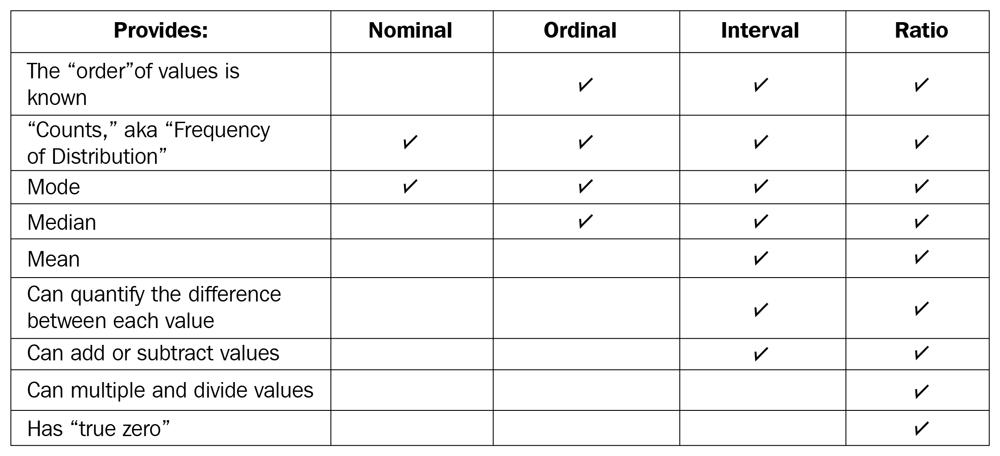
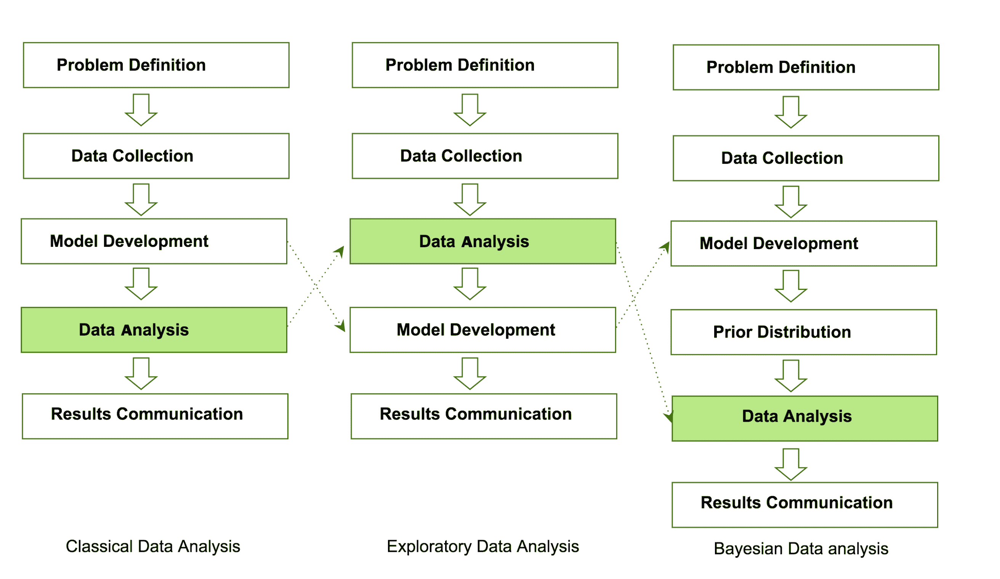
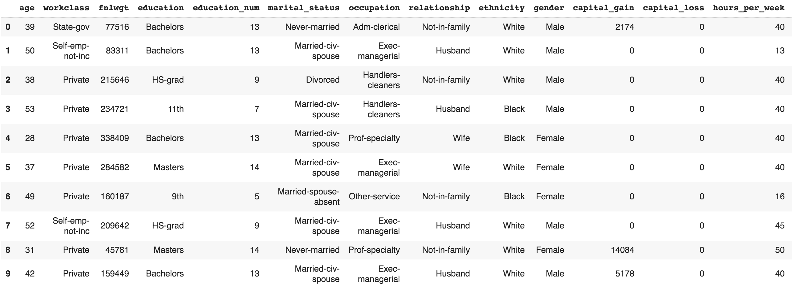
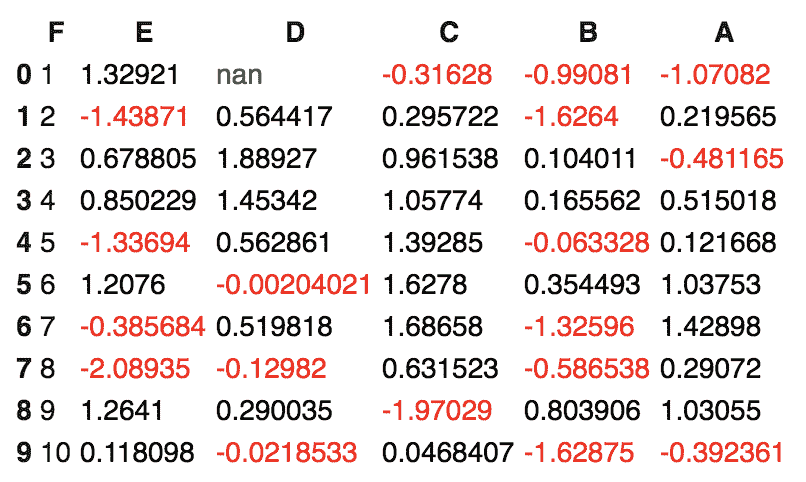

# 探索性数据分析基础

本章介绍的主要目的是修订**探索性数据分析** ( **EDA** )的基础知识，它是什么，概要分析和质量评估的关键概念，EDA 的主要维度，以及 EDA 中的主要挑战和机遇。

*数据*包含离散对象、数字、单词、事件、事实、测量、观察甚至事物描述的集合。这样的数据是由几个学科中发生的每一个事件或过程收集和存储的，包括生物学、经济学、工程学、市场营销和其他学科。处理这些数据会得到有用的*信息*，处理这些信息会产生有用的知识。但一个重要的问题是:我们如何从这些数据中产生有意义和有用的信息？这个问题的答案是 EDA。EDA 是一个检查可用数据集的过程，以发现模式、发现异常、测试假设并使用统计方法检查假设。在本章中，我们将讨论执行顶级探索性数据分析以及使用一些开源数据库弄脏我们的手所涉及的步骤。

正如这里和几项研究中提到的，EDA 的主要目的是在实际进行正式建模或假设制定之前，检查哪些数据可以告诉我们。约翰·塔克将电子设计自动化推广到统计学家，以检查和发现数据，并创建新的假设，用于开发新的数据收集和实验方法。

在本章中，我们将学习和修改以下主题:

*   理解数据科学
*   EDA 的意义
*   理解数据
*   EDA 与经典分析和贝叶斯分析的比较
*   EDA 可用的软件工具
*   EDA 入门

# 理解数据科学

让我们指出这一点，如果你没有听说过数据科学，那么你不应该读这本书。每个人现在都在以这样或那样的方式谈论数据科学。数据科学正处于炒作的巅峰，数据科学家的技能正在发生变化。现在，数据科学家不仅需要构建一个性能模型，而且他们必须解释所获得的结果，并将结果用于商业智能。在我的演讲、研讨会和演讲中，我发现有几个人试图问我:*要成为一名顶尖的数据科学家，我需要学习什么类型的技能？我需要获得数据科学博士学位吗？*嗯，有一件事我可以直接告诉你，你不需要博士就能成为数据科学专家。但人们普遍认同的一点是，数据科学涉及计算机科学、数据、统计和数学的跨学科知识。数据分析有几个阶段，包括数据需求、数据收集、数据处理、数据清理、探索性数据分析、建模和算法，以及数据产品和通信。这些阶段类似于数据挖掘中的**跨行业数据挖掘标准流程** ( **CRISP** )框架。

这里的主要内容是 EDA 阶段，因为它是数据分析和数据挖掘的一个重要方面。让我们简单了解一下这些阶段是什么:

*   **数据需求:**一个组织可以有多种数据来源。理解组织需要收集、管理和存储什么类型的数据非常重要。例如，跟踪患有痴呆症的患者的睡眠模式的应用程序需要几种类型的传感器数据存储，例如睡眠数据、患者的心率、皮肤电活动和用户活动模式。所有这些数据点都是正确诊断人的精神状态所必需的。因此，这些是应用程序的强制性要求。除此之外，还需要对数据进行分类，无论是数字的还是分类的，以及存储和传播的格式。
*   **数据收集:**从多个来源收集的数据必须以正确的格式存储，并传输给公司内部合适的信息技术人员。如前所述，可以使用不同类型的传感器和存储工具从几个事件的几个对象收集数据。
*   **数据处理:**预处理涉及实际分析前对数据集进行预策的过程。常见的任务包括正确导出数据集，将它们放在正确的表下，对它们进行结构化，并以正确的格式导出它们。

*   **数据清理:**预处理后的数据仍未做好详细分析的准备。它必须正确转换为不完整检查、重复检查、错误检查和缺失值检查。这些任务是在数据清理阶段执行的，这涉及到匹配正确的记录、查找数据集中的不准确性、了解整体数据质量、删除重复项以及填写缺失值等职责。然而，我们如何在任何数据集上识别这些异常呢？找到这样的数据问题需要我们执行一些分析技术。我们将在[第 4 章](04.html)、*数据转换*中学习几种这样的分析技术。简而言之，数据清理取决于所研究的数据类型。因此，对于数据科学家或电子设计自动化专家来说，理解不同类型的数据集是最重要的。数据清理的一个例子是使用异常值检测方法进行定量数据清理。
*   **EDA:** 探索性数据分析，如前所述，是我们实际开始理解数据中包含的信息的阶段。应当指出，在勘探过程中可能需要几种类型的数据转换技术。我们将在*第二节*、[第五章](05.html) 、*描述性统计*中深入讲解描述性统计，了解描述性统计背后的数学基础。这整本书致力于探索性数据分析中涉及的任务。
*   **建模与算法**:从数据科学的角度来看，广义模型或数学公式可以表示或展示不同变量之间的关系，如相关性或因果关系。这些模型或方程涉及一个或多个变量，这些变量依赖于导致事件的其他变量。比如买笔的时候，*笔的总价(合计)=一支笔的价格(单价)×买笔数(数量)*。因此，我们的模型将是*总量=单价*数量*。这里，总价取决于单价。因此，总价被称为因变量，单价被称为自变量。一般来说，模型总是描述自变量和因变量之间的关系。推理统计学处理特定变量之间的量化关系。
    用于描述数据、模型和误差之间关系的 Judd 模型仍然成立:*数据=模型+误差。*我们将在*第 3 节*、[第 10 章](10.html)、*模型评估*中详细讨论模型开发。推断统计的一个例子是回归分析。我们将在[第 9 章](09.html)、*回归*中讨论回归分析。

*   **数据产品:**任何以数据为输入，产生输出，并根据输出提供反馈来控制环境的计算机软件都被称为数据产品。数据产品通常基于在数据分析期间开发的模型，例如，输入用户购买历史并推荐用户很可能购买的相关项目的推荐模型。
*   **沟通:**此阶段处理向最终利益相关方传播结果，以便将结果用于*商业智能*。这一阶段最值得注意的步骤之一是数据可视化。可视化处理信息传递技术，如表格、图表、总结图和条形图，以显示分析结果。我们将在[第 2 章](02.html)、*中概述几种可视化技术，为 EDA* 提供不同类型的数据。

# EDA 的意义

科学、经济、工程和营销的不同领域主要在电子数据库中积累和存储数据。应该利用收集到的数据做出适当的既定决策。没有计算机程序的帮助，要理解包含大量数据点的数据集实际上是不可能的。为了确定收集的数据所提供的见解并做出进一步的决策，数据挖掘是在我们经历独特的分析过程时执行的。探索性数据分析是关键，通常是数据挖掘的第一步。它允许我们可视化数据来理解它，并为进一步的分析创建假设。探索性分析围绕着为数据挖掘项目的后续步骤创建数据或见解的概要。

EDA 实际上揭示了关于内容的基本事实，而没有做出任何潜在的假设。事实上，数据科学家使用这个过程来实际理解可以创建什么类型的建模和假设。探索性数据分析的关键组成部分包括汇总数据、统计分析和数据可视化。Python 提供专家工具进行探索性分析，用`pandas`进行总结；`scipy`，与其他一起，进行统计分析；可视化的还有`matplotlib`和`plotly`。

有道理，对吧？当然有。这是你看这本书的原因之一。了解了 EDA 的意义后，让我们在下一节中发现 EDA 中涉及的最通用的步骤是什么。

# EDA 中的步骤

了解了 EDA 是什么及其意义之后，让我们来了解一下数据分析中涉及的各个步骤。基本上，它包括四个不同的步骤。让我们逐一了解每一个步骤，以便对每个步骤有一个简单的了解:

*   **问题定义:**在尝试从数据中提取有用的洞察之前，定义要解决的业务问题至关重要。问题定义是数据分析计划执行的驱动力。问题定义中涉及的主要任务是定义分析的主要目标、定义主要可交付成果、概述主要角色和职责、获取数据的当前状态、定义时间表以及执行成本/收益分析。基于这样的问题定义，可以创建一个执行计划。
*   **数据准备**:这一步涉及到实际分析前准备数据集的方法。在这一步中，我们定义数据源，定义数据模式和表，了解数据的主要特征，清理数据集，删除不相关的数据集，转换数据，并将数据分成所需的块进行分析。
*   **数据分析:**这是处理数据的描述性统计和分析的最关键步骤之一。主要任务包括汇总数据、发现数据之间隐藏的相关性和关系、开发预测模型、评估模型和计算精度。用于数据汇总的一些技术是汇总表、图表、描述性统计、推理统计、相关统计、搜索、分组和数学模型。
*   **结果的开发和表示:**这一步包括以图形、汇总表、地图和图表的形式向目标受众呈现数据集。这也是一个必不可少的步骤，因为从数据集分析的结果应该可以被业务利益相关者解释，这是 EDA 的主要目标之一。大多数图形分析技术包括散点图、特征图、直方图、箱线图、残差图、均值图等。我们将在[第 2 章](02.html)、*EDA 视觉辅助工具*中探讨几种类型的图形表示。

# 理解数据

识别所分析数据的类型至关重要。在本节中，我们将了解您在分析过程中可能遇到的不同类型的数据。不同的学科为不同的目的存储不同种类的数据。例如，医学研究人员存储患者数据，大学存储学生和教师数据，房地产行业存储和构建数据集。数据集包含关于特定对象的许多观察结果。例如，一个关于医院病人的数据集可以包含许多观察结果。可以通过*患者标识符(ID)、姓名、地址、体重、出生日期、地址、电子邮件、*和*性别*来描述患者。这些描述病人的特征都是一个变量。对于这些变量中的每一个，每个观察值都可以有一个特定的值。例如，患者可能有以下情况:

```py
PATIENT_ID = 1001
Name = Yoshmi Mukhiya
Address = Mannsverk 61, 5094, Bergen, Norway
Date of birth = 10th July 2018
Email = yoshmimukhiya@gmail.com
Weight = 10 
Gender = Female
```

这些数据集存储在医院中，并提交进行分析。这些数据大部分存储在表/模式中的某种数据库管理系统中。此处显示了一个用于存储患者信息的表格示例:

| **患者号** | **名称** | **地址** | **DOB** | **电子邮件** | **性别** | **重量** |
| 001 | 苏雷什·库马尔·穆西亚 | 曼思韦克，61 岁 | 30.12.1989 | skmu@hvl 不要 | 男性的 | sixty-eight |
| 002 | 约瑟夫·穆希亚 | 曼斯维尔克 61， 5094， 卑尔根 | 10.07.2018 | yoshmimukhiya@gmail . com | 女性的 | one |
| 003 | 安朱·穆希亚 | 曼斯维尔克 61， 5094， 卑尔根 | 10.12.1997 | 昂儒瓦内@gmail.com | 女性的 | Twenty-four |
| 004 | Asha Gaire | 尼泊尔布特瓦尔 | 30.11.1990 | aasha.gaire@gmail.com | 女性的 | Twenty-three |
| 005 | 约翰·史密斯 - 维基百科，自由的百科全书 | 瑞典丹马克 | 12.12.1789 | hello @ Gmail . com | 男性的 | Seventy-five |

总结上表，有四个观察值(001，002，003，004，005)。每个观察描述变量(`PatientID`、`name`、`address`、`dob`、`email`、`gender`和`weight`)。大部分数据集大致分为两组——数字数据和分类数据。

# 数据

这些数据有一种测量的感觉；例如，一个人的年龄、身高、体重、血压、心率、体温、牙齿数量、骨骼数量和家庭成员数量。这个数据在统计学中常被称为**量化数据**。数字数据集可以是离散或连续类型。

# 离散数据

这是可计数的数据，其值可以列出来。例如，如果我们掷硬币，200 次硬币掷中的头数可以取 0 到 200(有限)的值。表示离散数据集的变量称为离散变量。离散变量采用固定数量的不同值。例如，`Country`变量可以有尼泊尔、印度、挪威和日本等值。它是固定的。教室中学生的`Rank`变量可以取 1、2、3、4、5 等数值。

# 连续数据

在特定范围内可以有无限多个数值的变量被归类为连续数据。描述连续数据的变量是连续变量。例如，你所在城市今天的温度是多少？我们能有限吗？同样，上一节的`weight`变量是连续变量。我们将使用[第 5 章](05.html)、*描述性统计*中的汽车数据集来执行 EDA。

下表显示了该表的一部分:


检查上表，确定哪些变量是离散的，哪些变量是连续的。你能证明你的主张是正确的吗？连续数据可以遵循标度的区间度量或标度的比率度量。我们将在本章的*测量刻度*部分详细讨论。

# 分类数据

这种类型的数据代表一个对象的特征；例如性别、婚姻状况、地址类型或电影类别。该数据在统计学中常被称为**定性数据集**。为了清楚地理解，以下是您可以在数据中找到的一些最常见的分类数据类型:

*   性别(男性、女性、其他或未知)
*   婚姻状况(无效、离婚、中间、合法分居、已婚、一夫多妻、从未结婚、家庭伴侣、未婚、丧偶或未知)
*   电影类型(动作、冒险、喜剧、犯罪、戏剧、奇幻、历史、恐怖、神秘、哲学、政治、浪漫、传奇、讽刺、科幻、社交、惊悚、都市或西部)

*   血型(甲、乙、AB 或 O)
*   药物类型(兴奋剂、镇静剂、致幻剂、解离剂、阿片类药物、吸入剂或大麻)

描述分类数据的变量称为**分类变量**。这些类型的变量可以有有限数量的值之一。计算机科学专业的学生更容易将分类值理解为变量的枚举类型或枚举。有不同类型的分类变量:

*   一个二进制分类变量可以正好取两个值，也称为**二分变量**。例如，当你创建一个实验时，结果不是成功就是失败。因此，结果可以理解为一个**二元分类变量**。
*   **多态变量**是可以取两个以上可能值的分类变量。例如，婚姻状况可以有几种值，如无效、离婚、中间、合法分居、已婚、一夫多妻、从未结婚、家庭伴侣、未婚、丧偶、家庭伴侣和未知。因为婚姻状况可以有两个以上的可能值，所以它是一个**多变量。**

大多数分类数据集遵循名义或顺序测量尺度。让我们在下一节了解什么是名义或序数尺度。

# 测量标尺

统计学中描述了四种不同类型的测量尺度:名义尺度、序数尺度、区间尺度和比率尺度。这些量表多用于学术行业。让我们用一些例子来理解它们。

# 名义上的

这些是用来标注没有任何数量值的变量的。刻度一般称为**标签**。这些尺度是相互排斥的，没有任何数值上的重要性。让我们看一些例子:

*   你的性别是什么？
*   男性的
*   女性的
*   第三性别/非二元
*   我不想回答
*   其他的
*   其他例子包括:
*   特定国家所说的语言
*   生物学种
*   语法中的词类(名词、代词、形容词等)
*   生物学中的分类等级(太古宙、细菌和真核生物)

标称标度被视为定性标度，使用定性标度进行的测量被视为**定性数据**。然而，定性研究的进展造成了混乱，不能肯定地认为是定性的。例如，如果有人使用数字作为名义测量意义上的标签，它们就没有具体的数值或意义。对名义上的度量不能进行任何形式的算术计算。

你可能会想*为什么要关心数据是名义的还是序数的？我们不应该开始加载数据并开始分析吗？*嗯，我们可以。但是想想看:你有一个数据集，你想分析它。你将如何决定你是否可以做一个饼图、条形图或直方图？你明白我的意思了吗？

例如，在名义数据集的情况下，您当然可以知道以下内容:

*   **频率**是数据集内一段时间内标签出现的速率。
*   **比例**可以通过频率除以事件总数来计算。
*   然后，你可以计算每个比例的**百分比**。
*   为了使标称数据集可视化，可以使用饼图或条形图。

如果你知道你的数据遵循名义比例，你可以使用饼图或条形图。那就少了一件要担心的事，对吗？我的观点是，理解数据类型与理解您可以执行什么类型的计算、您应该在数据集上适合什么类型的模型以及您可以生成什么类型的可视化相关。

# 序数

序数标度和名义标度的主要区别在于顺序。在序数尺度中，值的顺序是一个重要因素。记住序数音阶的一个简单提示是，它听起来像是*命令*。你听说过**李克特量表**吗，它使用序数量表的变体？让我们用李克特量表来检查序数量表的一个例子: *WordPress 正在让内容管理者的生活变得更容易。你对这个说法有什么看法？*下图为李克特量表:


如上图所示， *WordPress 问题的答案是让内容管理人员的生活更轻松*缩小到五个不同的序数值，**强烈同意**、**同意**、**中立**、**不同意**和**强烈不同意**。像这样的量表被称为李克特量表。同样，下图显示了李克特量表的更多示例:


为了使它更容易，考虑将序数标度作为排名的顺序(第 1、第 2、第 3、第 4，等等)。允许将**中值**项作为中心趋势的度量；但是，**平均**是不允许的。

# 间隔

在区间尺度中，值之间的顺序和精确差异都是显著的。区间尺度在统计学中被广泛使用，例如，在中心趋势的*度量中——平均值、中值、模式和标准偏差。*示例包括笛卡尔坐标中的位置和从磁北以度为单位测量的方向。区间数据允许使用平均值、中值和模式。

# 比例

比率等级包含顺序、精确值和绝对零，这使得它可以用于描述性和推断性统计。这些尺度为统计分析提供了许多可能性。数学运算、中心趋势的度量以及离散度的**度量**和变量的**系数** n 也可以从这样的标度中计算出来。

示例包括能量、质量、长度、持续时间、电能、平面角度和体积的度量。下表总结了数据类型和比例度量:



在下一节中，我们将比较 EDA 与经典和贝叶斯分析。

# EDA 与经典分析和贝叶斯分析的比较

数据分析有几种方法。与本书相关的最受欢迎的有:

*   **经典数据分析:**对于经典数据分析方法，问题定义和数据收集步骤之后是模型开发，之后是分析和结果交流。
*   **探索性数据分析方法**:对于 EDA 方法，除了模型拼版和数据分析步骤互换之外，遵循与经典数据分析相同的方法。主要关注的是数据、数据结构、异常值、模型和可视化。通常，在 EDA 中，我们不会对数据强加任何确定性或概率性模型。
*   **贝叶斯数据分析方法:**贝叶斯方法将先验概率分布知识融入分析步骤，如下图所示。简而言之，任何量的先验概率分布都是在考虑某些证据之前表达了对特定量的信念。你还在纠结先验概率分布这个术语吗？安德鲁·盖尔曼有一篇关于*先验概率分布*的描述性很强的论文。下图显示了三种不同的数据分析方法，说明了它们执行步骤的差异:



数据分析师和数据科学家可以自由地混合前面提到的步骤，从数据中获得有意义的见解。除此之外，基本上很难判断或估计哪个模型最适合数据分析。它们都有各自的范式，适用于不同类型的数据分析。

# EDA 可用的软件工具

有几种软件工具可用于促进 EDA。在这里，我们将概述一些开源工具:

*   **Python** :这是一种开源编程语言，广泛应用于数据分析、数据挖掘和数据科学([https://www.python.org/](https://www.python.org/))。对于这本书，我们将使用 Python。
*   **R 编程语言** : R 是一种开源编程语言，广泛应用于统计计算和图形数据分析([https://www.r-project.org](https://www.r-project.org/))。
*   **Weka** :这是一个开源的数据挖掘包，涉及多个 EDA 工具和算法([https://www.cs.waikato.ac.nz/ml/weka/](https://www.cs.waikato.ac.nz/ml/weka/))。
*   **KNIME** :这是一个开源的数据分析工具，基于 Eclipse([https://www.knime.com/](https://www.knime.com/))。

# EDA 入门

如前所述，我们将使用 Python 作为数据分析的主要工具。耶！好吧，如果你问我为什么，Python 一直在十大编程语言中排名靠前，并被数据科学专家广泛用于数据分析和数据挖掘。在这本书里，我们假设你有 Python 的工作知识。如果你不熟悉 Python，现在开始数据分析可能还为时过早。我假设您熟悉以下 Python 工具和包:

| Python 编程 | 变量、字符串和数据类型的基本概念条件和函数序列、集合和迭代使用文件面向对象编程 |
| NumPy | 使用 NumPy 创建数组、复制数组和划分数组对 NumPy 数组执行不同的操作了解数组选择、高级索引和扩展使用多维数组线性代数函数和内置 NumPy 函数 |
| Pandas | 理解并创建`DataFrame`对象子集数据和索引数据算术函数和Pandas映射管理指数视觉分析的建筑风格 |
| Matplotlib | 加载线性数据集调整轴、网格、标签、标题和图例保存地块 |
| 我的天啊 | 正在导入包使用 SciPy 的统计软件包执行描述性统计推理和数据分析 |

在深入分析细节之前，我们需要确保我们的观点一致。让我们仔细检查清单，验证您是否满足了充分利用本书的所有先决条件:

| 设置虚拟环境 | 

```py
> pip install virtualenv
> virtualenv Local_Version_Directory -p Python_System_Directory
```

 |
| 读取/写入文件 | 

```py
filename = "datamining.txt" 
file = open(filename, mode="r", encoding='utf-8')
for line in file: 
 lines = file.readlines()
print(lines)
file.close()
```

 |
| 错误处理 | 

```py
try:
  Value = int(input("Type a number between 47 and 100:"))
except ValueError:
   print("You must type a number between 47 and 100!")
else:
   if (Value > 47) and (Value <= 100):
       print("You typed: ", Value)
   else:
       print("The value you typed is incorrect!")
```

 |
| 面向对象的概念 | 

```py
class Disease:
  def __init__(self, disease = 'Depression'):
    self.type = disease

  def getName(self):
    print("Mental Health Diseases: {0}".format(self.type))

d1 = Disease('Social Anxiety Disorder')
d1.getName()
```

 |

接下来，让我们看看使用 NumPy 库的 EDA 的基本操作。

# NumPy

在本节中，我们将使用`NumPy`库修改 EDA 的基本操作。如果您熟悉这些操作，请随意跳到下一节。当仔细阅读代码时，可能会感觉很明显，但是在深入研究 EDA 操作之前，确保您理解这些概念是至关重要的。当我开始学习数据科学方法时，我关注了许多博客，他们只是重新塑造了一个数组或矩阵。当我运行他们的代码时，它工作得很好，但是我从来不明白我是如何添加两个不同维度的矩阵的。在本节中，我试图明确指出一些基本的`numpy`操作:

*   对于导入`numpy`，我们将使用以下代码:

```py
import numpy as np
```

*   为了创建不同类型的`numpy`数组，我们将使用以下代码:

```py
# importing numpy
import numpy as np

# Defining 1D array
my1DArray = np.array([1, 8, 27, 64])
print(my1DArray)

# Defining and printing 2D array
my2DArray = np.array([[1, 2, 3, 4], [2, 4, 9, 16], [4, 8, 18, 32]])
print(my2DArray)

#Defining and printing 3D array
my3Darray = np.array([[[ 1, 2 , 3 , 4],[ 5 , 6 , 7 ,8]], [[ 1, 2, 3, 4],[ 9, 10, 11, 12]]])
print(my3Darray)
```

*   为了显示基本信息，例如 NumPy 数组的数据类型、形状、大小和步长，我们将使用以下代码:

```py
# Print out memory address
print(my2DArray.data)

# Print the shape of array
print(my2DArray.shape)

# Print out the data type of the array
print(my2DArray.dtype)

# Print the stride of the array.
print(my2DArray.strides)
```

*   为了使用内置的 NumPy 函数创建数组，我们将使用以下代码:

```py
# Array of ones
ones = np.ones((3,4))
print(ones)

# Array of zeros
zeros = np.zeros((2,3,4),dtype=np.int16)
print(zeros)

# Array with random values
np.random.random((2,2))

# Empty array
emptyArray = np.empty((3,2))
print(emptyArray)

# Full array
fullArray = np.full((2,2),7)
print(fullArray)

# Array of evenly-spaced values
evenSpacedArray = np.arange(10,25,5)
print(evenSpacedArray)

# Array of evenly-spaced values
evenSpacedArray2 = np.linspace(0,2,9)
print(evenSpacedArray2)
```

*   对于 NumPy 数组和文件操作，我们将使用以下代码:

```py
# Save a numpy array into file
x = np.arange(0.0,50.0,1.0)
np.savetxt('data.out', x, delimiter=',')

# Loading numpy array from text
z = np.loadtxt('data.out', unpack=True)
print(z)

# Loading numpy array using genfromtxt method
my_array2 = np.genfromtxt('data.out',
                      skip_header=1,
                      filling_values=-999)
print(my_array2)
```

*   为了检查 NumPy 数组，我们将使用以下代码:

```py
# Print the number of `my2DArray`'s dimensions
print(my2DArray.ndim)

# Print the number of `my2DArray`'s elements
print(my2DArray.size)

# Print information about `my2DArray`'s memory layout
print(my2DArray.flags)

# Print the length of one array element in bytes
print(my2DArray.itemsize)

# Print the total consumed bytes by `my2DArray`'s elements
print(my2DArray.nbytes)
```

*   广播是一种机制，允许 NumPy 在执行算术运算时对不同形状的数组进行操作:

```py
# Rule 1: Two dimensions are operatable if they are equal
# Create an array of two dimension
A =np.ones((6, 8))

# Shape of A
print(A.shape)

# Create another array
B = np.random.random((6,8))

# Shape of B
print(B.shape)

# Sum of A and B, here the shape of both the matrix is same.
print(A + B)
```

其次，当数组的一个维度为 1 时，两个维度也是兼容的。检查这里给出的例子:

```py
# Rule 2: Two dimensions are also compatible when one of them is 1
# Initialize `x`
x = np.ones((3,4))
print(x)

# Check shape of `x`
print(x.shape)

# Initialize `y`
y = np.arange(4)
print(y)

# Check shape of `y`
print(y.shape)

# Subtract `x` and `y`
print(x - y)
```

最后，还有第三条规则，如果两个数组在所有维度上都兼容，那么它们可以一起广播。检查这里给出的例子:

```py
# Rule 3: Arrays can be broadcast together if they are compatible in all dimensions
x = np.ones((6,8))
y = np.random.random((10, 1, 8))
print(x + y)
```

*x(6，8)* 和 *y(10，1，8)* 的尺寸不同。但是，可以添加它们。为什么会这样？另外，更改 *y(10，2，8)* 或 *y(10，1，4)* 会给出`ValueError`。你能找出原因吗？(**提示**:检查规则 1)。

*   为了了解 NumPy 数学的工作原理，我们将使用以下示例:

```py
# Basic operations (+, -, *, /, %)
x = np.array([[1, 2, 3], [2, 3, 4]])
y = np.array([[1, 4, 9], [2, 3, -2]])

# Add two array
add = np.add(x, y)
print(add)

# Subtract two array
sub = np.subtract(x, y)
print(sub)

# Multiply two array
mul = np.multiply(x, y)
print(mul)

# Divide x, y
div = np.divide(x,y)
print(div)

# Calculated the remainder of x and y
rem = np.remainder(x, y)
print(rem)
```

*   现在让我们看看如何使用索引来创建子集和分割数组:

```py
x = np.array([10, 20, 30, 40, 50])

# Select items at index 0 and 1
print(x[0:2])

# Select item at row 0 and 1 and column 1 from 2D array
y = np.array([[ 1, 2, 3, 4], [ 9, 10, 11 ,12]])
print(y[0:2, 1])

# Specifying conditions
biggerThan2 = (y >= 2)
print(y[biggerThan2])
```

接下来，我们将使用`pandas`库从数据中获得见解。

# Pandas

韦斯·麦金尼开源了在数据科学中广泛使用的`pandas`库([https://github.com/wesm](https://github.com/wesm))。我们将利用这个库从数据中获得有意义的见解。在详细研究这一部分之前，我们将重温一些你应该熟悉的Pandas最基本的技术，以便能够跟随即将到来的章节。如果这些东西对你来说是新的，请随意查看其中一个进一步的阅读部分，获取更多资源。请执行以下步骤:

1.  使用以下设置默认参数:

```py
import numpy as np
import pandas as pd
print("Pandas Version:", pd.__version__)

pd.set_option('display.max_columns', 500)
pd.set_option('display.max_rows', 500)
```

2.  在Pandas中，我们可以通过两种方式创建数据结构:系列和数据框架。查看下面的代码片段，了解我们如何从序列、字典和 n 维数组创建数据帧。

下面的代码片段显示了我们如何从一系列数据中创建数据帧:

```py
series = pd.Series([2, 3, 7, 11, 13, 17, 19, 23])
print(series)

# Creating dataframe from Series
series_df = pd.DataFrame({
    'A': range(1, 5),
    'B': pd.Timestamp('20190526'),
    'C': pd.Series(5, index=list(range(4)), dtype='float64'),
    'D': np.array([3] * 4, dtype='int64'),
    'E': pd.Categorical(["Depression", "Social Anxiety", "Bipolar Disorder", "Eating Disorder"]),
    'F': 'Mental health',
    'G': 'is challenging'
})
print(series_df)
```

下面的代码片段显示了如何为字典创建数据框:

```py
# Creating dataframe from Dictionary
dict_df = [{'A': 'Apple', 'B': 'Ball'},{'A': 'Aeroplane', 'B': 'Bat', 'C': 'Cat'}]
dict_df = pd.DataFrame(dict_df)
print(dict_df)
```

下面的代码片段显示了如何从 n 维数组创建数据帧:

```py
# Creating a dataframe from ndarrays
sdf = {
    'County':['Østfold', 'Hordaland', 'Oslo', 'Hedmark', 'Oppland', 'Buskerud'],
    'ISO-Code':[1,2,3,4,5,6],
    'Area': [4180.69, 4917.94, 454.07, 27397.76, 25192.10, 14910.94],
    'Administrative centre': ["Sarpsborg", "Oslo", "City of Oslo", "Hamar", "Lillehammer", "Drammen"]
    }
sdf = pd.DataFrame(sdf)
print(sdf)
```

3.  现在，让我们从外部源加载一个数据集到Pandas`DataFrame`中。之后，让我们看看前 10 个条目:

```py
columns = ['age', 'workclass', 'fnlwgt', 'education', 'education_num',
    'marital_status', 'occupation', 'relationship', 'ethnicity', 'gender','capital_gain','capital_loss','hours_per_week','country_of_origin','income']
df = pd.read_csv('http://archive.ics.uci.edu/ml/machine-learning-databases/adult/adult.data',names=columns)
df.head(10)
```

如果运行前面的单元格，您应该会得到类似于下面截图的输出:



4.  下面的代码显示了 dataframe 使用的行、列、数据类型和内存:

```py
df.info()
```

前面代码片段的输出应该类似于以下内容:

```py
# Output:
<class 'pandas.core.frame.DataFrame'>
RangeIndex: 32561 entries, 0 to 32560
Data columns (total 15 columns):
age 32561 non-null int64
workclass 32561 non-null object
fnlwgt 32561 non-null int64
education 32561 non-null object
education_num 32561 non-null int64
marital_status 32561 non-null object
occupation 32561 non-null object
relationship 32561 non-null object
ethnicity 32561 non-null object
gender 32561 non-null object
capital_gain 32561 non-null int64
capital_loss 32561 non-null int64
hours_per_week 32561 non-null int64
country_of_origin 32561 non-null object
income 32561 non-null object
dtypes: int64(6), object(9)
memory usage: 3.7+ MB
```

5.  现在让我们看看如何在任何数据框中选择行和列:

```py
# Selects a row
df.iloc[10] 

# Selects 10 rows 
df.iloc[0:10]

# Selects a range of rows 
df.iloc[10:15] 

 # Selects the last 2 rows
df.iloc[-2:] 

# Selects every other row in columns 3-5
df.iloc[::2, 3:5].head() 
```

6.  让我们结合 NumPy 和 pandas 来创建一个数据帧，如下所示:

```py
import pandas as pd
import numpy as np

np.random.seed(24)
dFrame = pd.DataFrame({'F': np.linspace(1, 10, 10)})
dFrame = pd.concat([df, pd.DataFrame(np.random.randn(10, 5), columns=list('EDCBA'))],
               axis=1)
dFrame.iloc[0, 2] = np.nan
dFrame
```

它应该生成一个类似于下面截图的数据帧表:


7.  让我们用一个自定义规则来设计这个表格。如果值大于零，我们将颜色更改为黑色(默认颜色)；如果该值小于零，我们将颜色更改为红色；最后，其他所有的东西都会被染成绿色。让我们定义一个 Python 函数来实现这一点:

```py
# Define a function that should color the values that are less than 0 
def colorNegativeValueToRed(value):
  if value < 0:
    color = 'red'
  elif value > 0:
    color = 'black'
  else:
    color = 'green'

  return 'color: %s' % color
```

8.  现在，让我们将这个函数传递给 dataframe。我们可以通过使用数据框内Pandas提供的`style`方法来做到这一点:

```py
s = df.style.applymap(colorNegativeValueToRed, subset=['A','B','C','D','E'])
s
```

它应该显示一个彩色数据帧，如下图所示:



应该注意的是`applymap`和`apply`方法计算量很大，因为它们适用于数据帧内的每个值。因此，执行起来需要一些时间。耐心等待执行。

9.  现在，让我们再深入一步。我们希望扫描每一列，并突出显示该列中的最大值和最小值:

```py
def highlightMax(s):
    isMax = s == s.max()
    return ['background-color: orange' if v else '' for v in isMax]

def highlightMin(s):
    isMin = s == s.min()
    return ['background-color: green' if v else '' for v in isMin] 
```

我们将这两个函数应用于数据帧，如下所示:

```py
df.style.apply(highlightMax).apply(highlightMin).highlight_null(null_color='red')
```

输出应该类似于下面的截图:


10.  你仍然不满意你的形象化吗？让我们尝试使用另一个名为`seaborn`的 Python 库，并为表格提供一个渐变:

```py
import seaborn as sns

colorMap = sns.light_palette("pink", as_cmap=True)

styled = df.style.background_gradient(cmap=colorMap)
styled
```

数据框应该应用橙色渐变:


可能性无穷无尽。你如何呈现你的结果取决于你自己。请记住，当您向最终利益相关者(您的经理、老板或非技术人员)展示您的结果时，无论您的代码写得多么聪明，如果他们不能理解您的程序，对他们来说都是毫无价值的。人们普遍认为，更直观的结果很容易销售。

# 我的天啊

SciPy 是 Python 的科学库，是开源的。我们将在接下来的章节中使用这个库。这个库依赖于 NumPy 库，它提供了一个高效的 n 维数组操作函数。我们将在接下来的章节中了解更多关于这些库的信息。我在这里的意图只是通知你，准备面对除了 NumPy 和Pandas之外的其他图书馆。如果你想早点开始，可以从 SciPy 库中查询`scipy.stats`。

# Matplotlib

Matplotlib 提供了一个巨大的可定制地块库，以及一组全面的后端。它可以用来创建专业的报告应用程序、交互式分析应用程序、复杂的仪表板应用程序、web/GUI 应用程序、嵌入式视图等等。我们将在[第 2 章](02.html)中详细探讨 Matplotlib，V *是 EDA 的辅助工具*。

# 摘要

在这一章中，我们回顾了数据分析和探索性数据分析背后最基本的理论。EDA 是数据分析中最突出的步骤之一，涉及数据需求、数据收集、数据处理、数据清理、探索性数据分析、建模和算法、数据生产和通信等步骤。识别所分析数据的类型至关重要。不同的学科为不同的目的存储不同种类的数据。例如，医学研究人员存储患者的数据，大学存储学生和教师的数据，房地产行业存储房屋和建筑数据集，等等。数据集包含关于特定对象的许多观察结果。大部分数据集可以分为数值数据集和分类数据集。有四种类型的数据测量尺度:名义、顺序、区间和比率。

在本书中，我们将使用几个 Python 库来执行从简单到复杂的探索性数据分析，包括 NumPy、pandas、SciPy 和 Matplotlib。在下一章中，我们将学习用于探索性数据分析的各种类型的可视化辅助工具。

# 进一步阅读

*   格伦·米亚特(2006 年)。*让数据有意义:探索性数据分析和数据挖掘实用指南*。打印 ISBN:9780470074718 |在线 ISBN:9780470101025 | DOI:10.1002/0470101024
*   查特菲尔德特区(1995 年)。*解决问题:统计员指南*(第 2 版。).查普曼和霍尔。ISBN 978-0412606304。
*   *先验分布*，Andrew Gelman 第 3 卷，第 1634-1637 页，[http://www . stat . Columbia . edu/~ Gelman/research/published/p039-_ o . pdf](http://www.stat.columbia.edu/~gelman/research/published/p039-_o.pdf)
*   希勒(2000 年)。*CRISP-DM 模型:数据挖掘新蓝图*。数据仓库；5:13—22.
*   贾德，查尔斯和麦克莱伦，加里(1989 年)。*数据分析*。哈科特·布雷斯·约万诺维奇。ISBN 0-15-516765-0。
*   詹姆斯和佩拉，罗科·j .(2007 年)。*关于李克特量表和李克特反应格式及其解药的十大常见误解、误解、持续神话和都市传说*。*社会科学杂志*。3 (3): 106–116.DOI:10.3844/jssp.2007.106.116