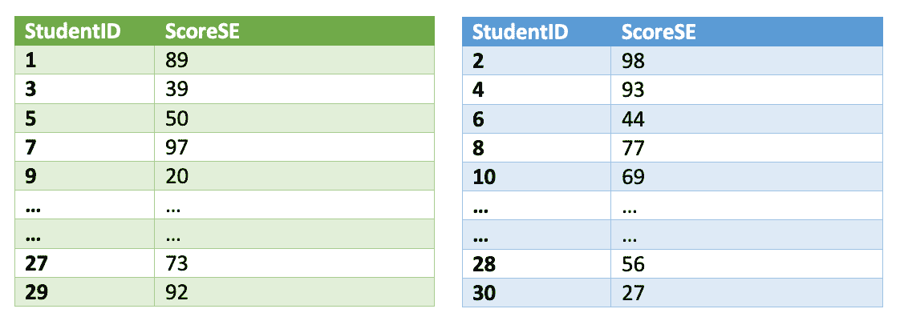
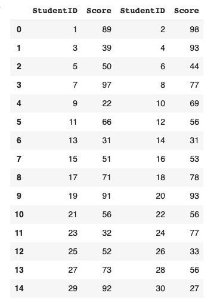
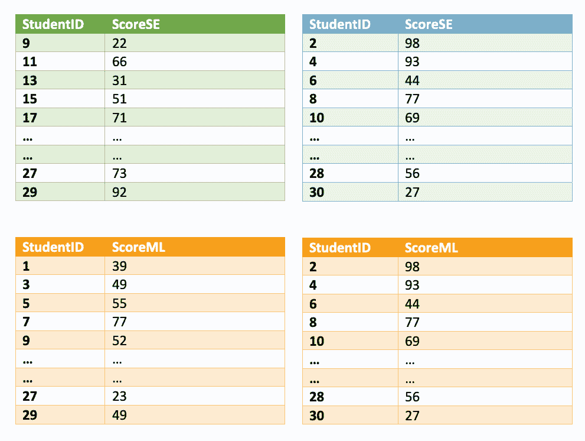

# 数据转换

**探索性数据分析** ( **EDA** )的一个基本步骤就是数据角力。在本章中，我们将学习如何合并数据库样式的数据帧，在索引上合并，沿着轴连接，将数据与重叠相结合，使用分层索引进行整形，以及将长格式旋转到宽格式。我们将开始了解在传输我们的信息进行进一步检查之前必须完成的工作，包括删除重复项、替换值、重命名轴索引、离散化和宁滨以及检测和过滤异常值。我们将致力于使用函数、映射、排列和随机采样来转换数据，并计算指标/虚拟变量。

本章将涵盖以下主题:

*   背景
*   合并数据库样式的数据帧
*   转化技术
*   数据转换的好处

# 技术要求

本章的代码可以在`Chapter 4`、[内的 GitHub repo 中找到。](https://github.com/PacktPublishing/hands-on-exploratory-data-analysis-with-python)

我们将使用以下 Python 库:

*   Pandas
*   NumPy
*   希伯恩
*   Matplotlib

# 背景

数据转换是一组用于将数据从一种格式或结构转换为另一种格式或结构的技术。以下是一些转型活动的示例:

*   *重复数据删除*涉及重复数据的识别和删除。
*   *键重组*包括将任何具有内置含义的键转换为通用键。
*   *数据清理*涉及从源语言中提取单词，删除过时、不准确、不完整的信息，而不提取意义或信息，以提高源数据的准确性。
*   *数据验证*是制定规则或算法的过程，有助于针对一些已知问题验证不同类型的数据。
*   *格式修改*包括从一种格式转换到另一种格式。
*   *数据推导*包括创建一组规则，以从数据源生成更多信息。
*   *数据聚合*涉及在不同类型的报告系统中搜索、提取、汇总和保存重要信息。
*   *数据集成*涉及转换不同的数据类型，并将它们合并成一个通用的结构或模式。
*   *数据过滤*包括识别与任何特定用户相关的信息。
*   *数据连接*包括在两个或多个表之间建立关系。

转换数据的主要原因是为了获得更好的表示，以便转换后的数据与其他数据兼容。除此之外，系统中的互操作性可以通过遵循通用的数据结构和格式来实现。

说到这里，让我们在下一节开始研究数据集成的数据转换技术。

# 合并数据库样式的数据帧

许多初级开发人员在使用Pandas数据框时会感到困惑，尤其是关于何时使用`append`、`concat`、`merge`或`join`。在本节中，我们将检查其中每一个的单独用例。

假设你在一所大学做教授，教一门*软件工程*课程和一门*机器学习入门*课程，有足够的学生分成两个班。每个班级的考试在两个独立的建筑中进行，由两个不同的教授评分。他们给了你两个不同的数据帧。在第一个例子中，让我们只考虑一个主题——软件工程*课程。*

查看以下截图:



在前面的数据集中，第一列包含关于学生标识符的信息，第二列包含他们各自在任何科目中的分数。在这两种情况下，数据帧的结构是相同的。在这种情况下，我们需要将它们连接起来。

我们可以通过Pandas`concat()`方法做到这一点:

```py
dataframe = pd.concat([dataFrame1, dataFrame2], ignore_index=True)
dataframe
```

前面代码的输出是组合两个表的单个数据帧。这些表将被合并成一个单独的表，如下图所示:


`ignore_index`参数创建一个新的索引；如果没有它，我们会保留原始指数。请注意，我们沿着`axis=0`组合数据帧，也就是说，我们在同一个方向上将它们组合在一起。如果我们想把它们并排组合在一起呢？然后我们必须指定`axis=1`。

使用以下代码查看差异:

```py
pd.concat([dataFrame1, dataFrame2], axis=1)
```

下面的屏幕截图显示了前面代码的输出:



注意输出的差异。当我们指定`axis=1`时，连接是并排进行的。

让我们继续使用我们在前面代码中讨论的相同案例。在第一个示例中，您收到了同一主题的两个数据帧文件。现在，考虑另一个使用案例，您正在教授两门课程:*软件工程*和*机器学习入门*。您将从每个主题中获得两个数据帧:

*   两个用于*软件工程*课程
*   机器学习入门课程还有两门

检查以下数据帧:



如果您错过了，您需要在前面的数据帧中注意一些重要的细节:

*   有一些学生没有参加软件工程考试。
*   有一些学生没有参加机器学习考试。
*   这两门课都有学生出现。

现在，假设你的部门主管走到你的办公桌前，开始用一系列问题来轰炸你:

*   总共有多少学生参加了考试？
*   有多少学生只出现在*软件工程*课程？
*   有多少学生只为了*机器学习*课程而出现？

有几种方法可以回答这些问题。使用电子设计自动化技术就是其中之一。在本节中，我们将使用`pandas`库来回答前面的问题。

让我们检查两个主题的数据帧:

```py
import pandas as pd

df1SE = pd.DataFrame({ 'StudentID': [9, 11, 13, 15, 17, 19, 21, 23, 25, 27, 29], 'ScoreSE' : [22, 66, 31, 51, 71, 91, 56, 32, 52, 73, 92]})
df2SE = pd.DataFrame({'StudentID': [2, 4, 6, 8, 10, 12, 14, 16, 18, 20, 22, 24, 26, 28, 30], 'ScoreSE': [98, 93, 44, 77, 69, 56, 31, 53, 78, 93, 56, 77, 33, 56, 27]})

df1ML = pd.DataFrame({ 'StudentID': [1, 3, 5, 7, 9, 11, 13, 15, 17, 19, 21, 23, 25, 27, 29], 'ScoreML' : [39, 49, 55, 77, 52, 86, 41, 77, 73, 51, 86, 82, 92, 23, 49]})
df2ML = pd.DataFrame({'StudentID': [2, 4, 6, 8, 10, 12, 14, 16, 18, 20], 'ScoreML': [93, 44, 78, 97, 87, 89, 39, 43, 88, 78]})`
```

如您在前面的数据集中所见，每个主题有两个数据框。所以，第一个任务是将这两个主题连接成一个。其次，这些学生参加了*机器学习入门*课程以及*软件工程*课程。因此，我们需要将这些分数合并到相同的数据帧中。有几种方法可以做到这一点。让我们探索一些选择。

# 沿着轴连接

这是第一种选择。我们将使用`pandas`库中的`pd.concat()`方法。

合并数据帧的代码如下:

```py
# Option 1
dfSE = pd.concat([df1SE, df2SE], ignore_index=True)
dfML = pd.concat([df1ML, df2ML], ignore_index=True)

df = pd.concat([dfML, dfSE], axis=1)
df
```

代码现在应该是不言自明的了。我们首先将*软件工程*课程和*机器学习*课程的数据框串联起来。然后，我们将数据帧与`axis=1`连接起来，将它们并排放置。

前面代码的输出如下:


你可能注意到`StudentID`字段被重复了。之后可以做的一个方法是删除重复的字段。然而，让我们看看其他的选择。

# 使用带有内部联接的 df.merge

这是第二种选择。现在我们使用`pandas`库中的`df.merge()`方法。想法很简单。首先，我们连接来自每个对象的单个数据帧，然后我们使用`df.merge()`方法。

检查以下代码:

```py
dfSE = pd.concat([df1SE, df2SE], ignore_index=True)
dfML = pd.concat([df1ML, df2ML], ignore_index=True)

df = dfSE.merge(dfML, how='inner')
df
```

在这里，您对每个数据帧执行了内部连接。也就是说，如果一个项目存在于两个数据帧中，它将包含在新的数据帧中。这意味着我们将获得一份出现在这两门课程中的学生名单。

下面的屏幕截图显示了前面代码的输出:


请注意，这应该回答了前面提到的一个问题:我们现在知道有 21 名学生选修了这两门课程。

# 使用带有左连接的 pd.merge()方法

第三种选择是使用`pd.merge()`方法和左连接技术。现在，您应该已经理解了合并的概念。`pd.merge()`方法的参数允许我们使用不同类型的连接。

以下是连接的类型:

*   `inner`连接从两个或多个数据帧中获取交集。对应**结构化查询语言** ( **SQL** )中的`INNER JOIN`。
*   `outer`连接从两个或多个数据帧中获取联合。对应于 SQL 中的`FULL OUTER JOIN`。
*   `left`连接仅使用左侧数据框中的键。对应于 SQL 中的`LEFT OUTER JOIN`。
*   `right`连接仅使用右侧数据框中的键。对应于 SQL 中的`RIGHT OUTER JOIN`。

让我们看看如何使用左外连接:

```py
dfSE = pd.concat([df1SE, df2SE], ignore_index=True)
dfML = pd.concat([df1ML, df2ML], ignore_index=True)

df = dfSE.merge(dfML, how='left')
df
```

前面代码的输出如下:


如果你看了前面的截图，你可以正确回答有多少学生只出现在*软件工程*课程中。总数将是 26。请注意，这些学生没有参加*机器学习*考试，因此他们的分数被标记为`NaN`。

# 使用带右连接的 pd.merge()方法

这是第四种选择。与我们已经看到的选项类似，我们可以使用`right`连接来获得出现在*机器学习*课程中的所有学生的列表。

这样做的代码如下:

```py
dfSE = pd.concat([df1SE, df2SE], ignore_index=True)
dfML = pd.concat([df1ML, df2ML], ignore_index=True)

df = dfSE.merge(dfML, how='right')
df
```

这个片段的输出作为练习的一部分留给您来完成。检查哪些列具有`NaN`值。

# 将 pd.merge()方法用于外部联接

这是第五种选择。最后，我们想知道至少有一门课的学生总数。这可以通过使用`outer`连接来完成:

```py
dfSE = pd.concat([df1SE, df2SE], ignore_index=True)
dfML = pd.concat([df1ML, df2ML], ignore_index=True)

df = dfSE.merge(dfML, how='outer')
df
```

检查输出，并将差异与之前的输出进行比较。

# 索引合并

有时，合并数据帧的键位于数据帧索引中。在这种情况下，我们可以通过`left_index=True`或`right_index=True`来指示应该接受索引作为合并键。

索引合并按以下步骤完成:

1.  考虑以下两个数据帧:

```py
left1 = pd.DataFrame({'key': ['apple','ball','apple', 'apple', 'ball', 'cat'], 'value': range(6)})
right1 = pd.DataFrame({'group_val': [33.4, 5]}, index=['apple', 'ball'])
```

如果打印这两个数据帧，输出如下图所示:


请注意，第一个数据框中的键是 apple *、ball* 和 cat。在第二个数据框中，我们有 apple 和 ball 键的组值。

2.  现在，让我们考虑两种不同的情况。首先，让我们尝试使用内部连接进行合并，这是默认的合并类型。在这种情况下，默认合并是键的交集。检查以下示例代码:

```py
df = pd.merge(left1, right1, left_on='key', right_index=True)
df
```

前面代码的输出如下:


输出是来自这些数据帧的键的交集。由于第二个数据帧中没有 cat 关键字，因此它不包含在最终的表中。

3.  其次，让我们尝试使用`outer`连接进行合并，如下所示:

```py
df = pd.merge(left1, right1, left_on='key', right_index=True, how='outer')
df
```

前面代码的输出如下:


注意最后一行包括**猫**键。这是因为`outer`的加入。

# 整形和旋转

在 EDA 过程中，我们经常需要以某种一致的方式重新排列数据框架中的数据。这可以通过使用两个动作的分级索引来完成:

*   **堆叠** : `Stack`从数据中的任何特定列旋转到行。
*   **拆垛**:从行旋转到列。

我们将看下面的例子:

1.  让我们创建一个数据框架，记录挪威五个不同县的降雨量、湿度和风力情况:

```py
data = np.arange(15).reshape((3,5))
indexers = ['Rainfall', 'Humidity', 'Wind']
dframe1 = pd.DataFrame(data, index=indexers, columns=['Bergen', 'Oslo', 'Trondheim', 'Stavanger', 'Kristiansand'])
dframe1
```

前面片段的输出如下:


2.  现在，使用前面的`dframe1`上的`stack()`方法，我们可以将列旋转成行以产生一个系列:

```py
stacked = dframe1.stack()
stacked
```

这种堆叠的输出如下:


3.  可以使用`unstack()`方法将变量中存储的前一系列未堆叠的数据重新排列成数据帧:

```py
stacked.unstack()
```

这应该会将该系列恢复为原始数据帧。请注意，如果每个子组中不存在所有的值，拆堆将有可能产生丢失的数据。迷茫？好了，我们来看两个系列，`series1`和`series2`，然后串联起来。到目前为止，一切都有道理。

4.  现在，让我们解开连接的帧:

```py
series1 = pd.Series([000, 111, 222, 333], index=['zeros','ones', 'twos', 'threes'])
series2 = pd.Series([444, 555, 666], index=['fours', 'fives', 'sixes'])

frame2 = pd.concat([series1, series2], keys=['Number1', 'Number2'])
frame2.unstack()
```

下面的屏幕截图显示了前面拆垛的输出:


由于在`series1`中没有`fours`*`fives`和`sixes`，它们的值在拆垛过程中存储为 NaN。同样的，`series2`中也没有`ones`、`twos`、`zeros`，所以对应的值都存储为 NaN。现在有道理了，对吧？很好。*

 *# 转化技术

在*合并数据库风格的数据帧*部分，我们看到了如何合并不同类型的序列和数据帧。现在，让我们深入了解如何执行其他类型的数据转换，包括清理、过滤、重复数据消除等。

# 执行重复数据消除

您的数据框很可能包含重复的行。删除它们对于提高数据集的质量至关重要。这可以通过以下步骤完成:

1.  让我们考虑一个简单的数据帧，如下所示:

```py
frame3 = pd.DataFrame({'column 1': ['Looping'] * 3 + ['Functions'] * 4, 'column 2': [10, 10, 22, 23, 23, 24, 24]})
frame3
```

前面的代码创建了一个包含两列的简单数据框。您可以从下面的截图中清楚地看到，在这两列中，都有一些重复的条目:


2.  `pandas`数据框附带一个`duplicated()`方法，该方法返回一个布尔序列，说明哪些行是重复的:

```py
frame3.duplicated()
```

前面代码的输出很容易解释:


表示`True`的行是包含重复数据的行。

3.  现在，我们可以使用`drop_duplicates()`方法删除这些副本:

```py
frame4 = frame3.drop_duplicates()
frame4
```

前面代码的输出如下:


请注意，第 1、4 和 6 行已被删除。基本上，`duplicated()`和`drop_duplicates()`方法都会考虑所有的列进行比较。我们可以指定列的任何子集来检测重复的项目，而不是所有的列。

4.  让我们添加一个新列，并尝试基于第二列查找重复的项目:

```py
frame3['column 3'] = range(7)
frame5 = frame3.drop_duplicates(['column 2'])
frame5
```

前面片段的输出如下:


请注意，`duplicated`和`drop_duplicates`方法在复制删除过程中都保持第一个观察值。如果我们通过`take_last=True`参数，方法返回最后一个。

# 替换值

通常，在数据框中查找和替换一些值是很重要的。这可以通过以下步骤完成:

1.  在这种情况下，我们可以使用`replace`方法:

```py
import numpy as np
replaceFrame = pd.DataFrame({'column 1': [200., 3000., -786., 3000., 234., 444., -786., 332., 3332\. ], 'column 2': range(9)})
replaceFrame.replace(to_replace =-786, value= np.nan)
```

前面代码的输出如下:


请注意，我们刚刚用其他值替换了一个值。我们也可以一次替换多个值。

2.  为此，我们使用列表显示它们:

```py
replaceFrame = pd.DataFrame({'column 1': [200., 3000., -786., 3000., 234., 444., -786., 332., 3332\. ], 'column 2': range(9)})
replaceFrame.replace(to_replace =[-786, 0], value= [np.nan, 2])
```

在前面的代码中，有两个替换。所有`-786`值将被`NaN`代替，所有`0`值将被`2`代替。这很简单，对吧？

# 处理丢失的数据

每当有缺失值时，使用`NaN`值，这表示没有为该特定索引指定值。一个值成为`NaN`可能有几个原因:

*   当从外部源检索数据并且数据集中有一些不完整的值时，就会发生这种情况。
*   当我们连接两个不同的数据集并且某些值不匹配时，也会发生这种情况。
*   由于数据收集错误，缺少值。
*   当数据的形状改变时，会有新的额外的行或列未被确定。
*   数据的重新索引可能会导致数据不完整。

让我们看看如何处理缺失的数据:

1.  假设我们有一个数据帧，如下所示:

```py
data = np.arange(15, 30).reshape(5, 3)
dfx = pd.DataFrame(data, index=['apple', 'banana', 'kiwi', 'grapes', 'mango'], columns=['store1', 'store2', 'store3'])
dfx
```

前面代码的输出如下:


假设我们在镇上有一个水果连锁店。目前，数据框显示了不同商店不同水果的销售情况。没有一家商店报告缺少值。

2.  让我们在数据框中添加一些缺失的值:

```py
dfx['store4'] = np.nan
dfx.loc['watermelon'] = np.arange(15, 19)
dfx.loc['oranges'] = np.nan
dfx['store5'] = np.nan
dfx['store4']['apple'] = 20.
dfx
```

现在输出将如下图所示:


注意，我们又增加了两个商店，`store4`和`store5`，以及两种水果，`watermelon`和`oranges`。假设我们知道从`store4`卖了多少公斤苹果和西瓜，但是我们没有从`store5`收集任何数据。此外，没有一家商店报告销售橙子。我们是一个巨大的水果经销商，不是吗？

请注意前面数据框中缺失值的以下特征:

*   一整行可以包含`NaN`值。
*   一整列可以包含`NaN`值。
*   行和列中的一些(但不一定是全部)值可以是`NaN`。

基于这些特征，让我们在下一节考察`NaN`值。

# Pandas对象中的 NaN 值

我们可以使用`pandas`库中的`isnull()`功能来识别`NaN`值:

1.  检查以下示例:

```py
dfx.isnull()
```

前面代码的输出如下:


请注意，真值表示`NaN`值。很明显，对吧？或者，我们也可以使用`notnull()`方法来做同样的事情。唯一的区别是函数将为非空值指示`True`。

2.  行动起来看看吧:

```py
dfx.notnull()
```

其输出如下:


比较这两张表。这两个功能`notnull()`和`isnull()`是相辅相成的。

3.  我们可以使用`sum()`方法来统计每个商店中 NaN 值的数量。你问，这是怎么工作的？检查以下代码:

```py
dfx.isnull().sum()
```

前面代码的输出如下:

```py
store1 1
store2 1
store3 1
store4 5
store5 7
dtype: int64
```

*真*为`1`*假*为`0`这一事实是求和的主要逻辑。前面的结果显示，`store1`、`store2`和`store3`没有报告一个值。`store4`未报 5 个值，`store5`未报 7 个值。

4.  我们可以更深入地寻找缺失值的总数:

```py
dfx.isnull().sum().sum()
```

前面代码的输出如下:

```py
15
```

这表明`15`在我们的商店中缺少值。我们可以用另一种方法来找出实际报告了多少值。

5.  因此，我们可以计算报告值的数量，而不是计算缺失值的数量:

```py
dfx.count()
```

前面代码的输出如下:

```py
store1 6
store2 6
store3 6
store4 2
store5 0
dtype: int64
```

很优雅，对吧？我们现在知道了两种不同的查找缺失值的方法，以及如何计算缺失值。

# 删除丢失的值

处理缺失值的方法之一是简单地将它们从我们的数据集中移除。我们已经看到，我们可以使用`pandas`库中的`isnull()`和`notnull()`函数来确定空值:

```py
dfx.store4[dfx.store4.notnull()]
```

前面代码的输出如下:

```py
apple 20.0
watermelon 18.0
Name: store4, dtype: float64
```

输出显示`store4`只报了两项数据。现在，我们可以使用`dropna()`方法删除行:

```py
dfx.store4.dropna()
```

前面代码的输出如下:

```py
apple 20.0
watermelon 18.0
Name: store4, dtype: float64
```

请注意，`dropna()`方法只是通过删除带有 NaN 的行来返回数据帧的副本。原始数据帧不变。

如果`dropna()`应用于整个数据帧，那么它将删除数据帧中的所有行，因为在我们的数据帧中至少有一个 NaN 值:

```py
dfx.dropna()
```

前面代码的输出是一个空的数据帧。

# 逐行删除

我们还可以删除具有 NaN 值的行。为此，我们可以使用`how=all`参数仅删除那些整数值完全为 NaN 的行:

```py
dfx.dropna(how='all')
```

前面代码的输出如下:


请注意，只有橙色行被删除，因为这些整行都包含 NaN 值。

# 按列拖放

此外，我们还可以通过`axis=1`来指示按列检查 NaN。

检查以下示例:

```py
dfx.dropna(how='all', axis=1)
```

前面代码的输出如下:


注意`store5`从数据框中删除。通过传入`axis=1`，我们指示Pandas如果列中的所有值都是`NaN`，则丢弃列。此外，我们还可以通过另一个参数`thresh`，来指定在删除列之前必须存在的最小数量的 nan:

```py
dfx.dropna(thresh=5, axis=1)
```

前面代码的输出如下:


与前面的相比，请注意，现在连`store4`列都被删除了，因为它有五个以上的`NaN`值。

# 用 NaN 进行数学运算

对于数学运算，`pandas`和`numpy`库处理 NaN 值的方式不同。

考虑以下示例:

```py
ar1 = np.array([100, 200, np.nan, 300])
ser1 = pd.Series(ar1)

ar1.mean(), ser1.mean()
```

前面代码的输出如下:

```py
(nan, 200.0)
```

请注意以下事项:

*   当 NumPy 函数遇到`NaN`值时，它返回`NaN`。
*   另一方面，Pandas忽略`NaN`值，继续处理。执行求和操作时，`NaN`被视为 0。如果所有数值都是`NaN`，结果也是`NaN`。

我们来计算一下`store4`卖出的水果总量:

```py
ser2 = dfx.store4
ser2.sum()
```

前面代码的输出如下:

```py
38.0
```

注意`store4`有五个 NaN 值。但是，在求和过程中，这些值被视为`0`，结果为`38.0`。

同样，我们可以计算平均值，如下所示:

```py
ser2.mean()
```

代码的输出如下:

```py
19.0
```

请注意，NaNs 被视为 0。累积求和也是如此:

```py
ser2.cumsum()
```

前面代码的输出如下:

```py
apple 20.0
banana NaN
kiwi NaN
grapes NaN
mango NaN
watermelon 38.0
oranges NaN
Name: store4, dtype: float64
```

请注意，在计算累计总和时，只有实际值会受到影响。

# 填充缺失值

我们可以使用`fillna()`方法将 NaN 值替换为任何特定的值。

检查以下示例:

```py
filledDf = dfx.fillna(0)
filledDf
```

下面的屏幕截图显示了前面代码的输出:


注意，在前面的数据帧中，所有的`NaN`值都被`0`代替。将数值替换为`0`将影响几个统计数据，包括平均值、总和和中位数。

检查以下两个示例中的差异:

```py
dfx.mean()
```

前面代码的输出如下:

```py
store1 20.0
store2 21.0
store3 22.0
store4 19.0
store5 NaN
dtype: float64
```

现在，让我们使用以下命令根据填充的数据帧计算平均值:

```py
filledDf.mean()
```

我们得到的输出如下:

```py
store1 17.142857
store2 18.000000
store3 18.857143
store4 5.428571
store5 0.000000
dtype: float64
```

请注意，值略有不同。因此，用`0`填充可能不是最佳解决方案。

# 向后和向前填充

可以根据最后已知的值来填充 NaN 值。为了理解这一点，让我们考虑以我们的商店数据框架为例。

我们希望使用正向填充技术来填充`store4`:

```py
dfx.store4.fillna(method='ffill')
```

前面代码的输出如下:

```py
apple 20.0
banana 20.0
kiwi 20.0
grapes 20.0
mango 20.0
watermelon 18.0
oranges 18.0
Name: store4, dtype: float64
```

这里，从正向填充技术来看，最后一个已知的值是`20`，因此剩余的 NaN 值被它代替。

填充的方向可以通过改变`method='bfill'`来改变。检查以下示例:

```py
dfx.store4.fillna(method='bfill')
```

前面代码的输出如下:

```py
apple 20.0
banana 18.0
kiwi 18.0
grapes 18.0
mango 18.0
watermelon 18.0
oranges NaN
Name: store4, dtype: float64
```

注意这里的 NaN 值被`18.0`代替。

# 插值缺失值

Pandas库为系列和数据帧提供`interpolate()`功能。默认情况下，它会对缺失值进行线性插值。检查以下示例:

```py
ser3 = pd.Series([100, np.nan, np.nan, np.nan, 292])
ser3.interpolate()
```

前面代码的输出如下:

```py
0 100.0
1 148.0
2 196.0
3 244.0
4 292.0
dtype: float64
```

你想知道这些值是如何计算的吗？这是通过在 NaN 值的任何序列之前和之后取第一个值来完成的。在前面的系列`ser3`中，第一个和最后一个值分别是`100`和`292`。因此，它计算下一个值为 *(292-100)/(5-1) = 48* 。所以`100`之后的下一个值是 *100 + 48 = 148* 。

We can perform more complex interpolation techniques, especially with time series data. An example of this interpolation is shown in the notebook provided with this chapter. 

接下来，我们将了解如何重命名轴索引。

# 重命名轴索引

考虑*整形和旋转*部分的例子。假设您想要将索引术语转换为大写字母:

```py
dframe1.index = dframe1.index.map(str.upper)
dframe1
```

前面代码的输出如下:


请注意，索引已大写。如果我们想要创建数据帧的转换版本，那么我们可以使用`rename()`方法。当我们不想修改原始数据时，这种方法很方便。检查以下示例:

```py
dframe1.rename(index=str.title, columns=str.upper)
```

代码的输出如下:


`rename`方法不复制数据帧。

# 离散化与宁滨

通常在处理连续数据集时，我们需要将它们转换成离散或区间形式。每一个区间都被称为一个仓位，因此名字*宁滨*开始发挥作用:

1.  假设我们有一组学生的身高数据如下:

```py
height = [120, 122, 125, 127, 121, 123, 137, 131, 161, 145, 141, 132]
```

我们希望将该数据集转换为 118 到 125、126 到 135、136 到 160，最后是 160 或更高的间隔。

2.  要将前面的数据集转换成区间，我们可以使用`pandas`库提供的`cut()`方法:

```py
bins = [118, 125, 135, 160, 200]
category = pd.cut(height, bins)
category
```

前面代码的输出如下:

```py
[(118, 125], (118, 125], (118, 125], (125, 135], (118, 125], ..., (125, 135], (160, 200], (135, 160], (135, 160], (125, 135]] Length: 12 Categories (4, interval[int64]): [(118, 125] < (125, 135] < (135, 160] < (160, 200]]
```

如果你仔细观察输出，你会发现区间有数学符号。你还记得你小学数学课上的这些括号是什么意思吗？如果没有，这里简单回顾一下:

*   括号表示侧面是敞开的。
*   方括号表示它是封闭的或包含的。

从前面的代码块来看，`(118, 125]`表示左侧打开，右侧关闭。这在数学上表示如下:


因此，`118`不包括在内，但大于`118`的都包括在内，而`125`包括在区间内。

3.  我们可以设置一个`right=False`参数来改变区间的形式:

```py
category2 = pd.cut(height, [118, 126, 136, 161, 200], right=False)
category2
```

前面代码的输出如下:

```py
[[118, 126), [118, 126), [118, 126), [126, 136), [118, 126), ..., [126, 136), [161, 200), [136, 161), [136, 161), [126, 136)] Length: 12 Categories (4, interval[int64]): [[118, 126) < [126, 136) < [136, 161) < [161, 200)]
```

注意，封闭性的输出形式已经改变。现在的结果是*右闭，左开*的形式。

4.  我们可以使用`pd.value_counts()`方法检查每个箱中的数值数量:

```py
pd.value_counts(category)
```

输出如下:

```py
(118, 125] 5
(135, 160] 3
(125, 135] 3
(160, 200] 1
dtype: int64
```

输出显示区间`[118-125)`有五个值。

5.  我们还可以通过传递标签列表来指示 bin 名称:

```py
bin_names = ['Short Height', 'Average height', 'Good Height', 'Taller']
pd.cut(height, bins, labels=bin_names)
```

输出如下:

```py
[Short Height, Short Height, Short Height, Average height, Short Height, ..., Average height, Taller, Good Height, Good Height, Average height]
Length: 12
Categories (4, object): [Short Height < Average height < Good Height < Taller]
```

请注意，我们至少传递了两个参数，即需要离散化的数据和所需的箱数。此外，我们使用了`right=False`参数来改变区间的形式。

6.  现在，需要注意的是，如果我们只传递一个整数，它将根据数据中的最小值和最大值计算等长的容器。好吧，让我们验证一下我们在这里提到的:

```py
import numpy as np
pd.cut(np.random.rand(40), 5, precision=2)
```

在前面的代码中，我们刚刚通过`5`作为所需的箱数，前面代码的输出如下:

```py
[(0.81, 0.99], (0.094, 0.27], (0.81, 0.99], (0.45, 0.63], (0.63, 0.81], ..., (0.81, 0.99], (0.45, 0.63], (0.45, 0.63], (0.81, 0.99], (0.81, 0.99]] Length: 40
Categories (5, interval[float64]): [(0.094, 0.27] < (0.27, 0.45] < (0.45, 0.63] < (0.63, 0.81] < (0.81, 0.99]]
```

我们可以看到，根据垃圾箱的数量，它创建了五个类别。这里没有什么你不明白的，对吗？到目前为止干得不错。现在，让我们更进一步。数学中我们感兴趣的另一个术语是*分位数*。还记得这个概念吗？如果没有，不要担心，因为我们将在[第 5 章](05.html) *描述性统计中了解分位数和其他度量。*现在，理解分位数将概率分布的范围划分为具有相似概率的连续区间就足够了。

Pandas 提供了一种`qcut`方法，该方法基于样本分位数形成箱。让我们用一个例子来验证这一点:

```py
randomNumbers = np.random.rand(2000)
category3 = pd.qcut(randomNumbers, 4) # cut into quartiles
category3
```

前面代码的输出如下:

```py
[(0.77, 0.999], (0.261, 0.52], (0.261, 0.52], (-0.000565, 0.261], (-0.000565, 0.261], ..., (0.77, 0.999], (0.77, 0.999], (0.261, 0.52], (-0.000565, 0.261], (0.261, 0.52]]
Length: 2000
Categories (4, interval[float64]): [(-0.000565, 0.261] < (0.261, 0.52] < (0.52, 0.77] < (0.77, 0.999]]
```

请注意，根据我们设置为`4`的箱数，它将我们的数据转换为四个不同的类别。如果我们计算每个类别中的值的数量，我们应该根据我们的定义得到相等大小的箱。让我们使用以下命令来验证这一点:

```py
pd.value_counts(category3)
```

该命令的输出如下:

```py
(0.77, 0.999] 500
(0.52, 0.77] 500
(0.261, 0.52] 500
(-0.000565, 0.261] 500
dtype: int64
```

我们的索赔因此得到核实。每个类别包含相同大小的`500`值。注意，与`cut`类似，我们也可以通过自己的垃圾箱:

```py
pd.qcut(randomNumbers, [0, 0.3, 0.5, 0.7, 1.0])
```

前面代码的输出如下:

```py
[(0.722, 0.999], (-0.000565, 0.309], (0.309, 0.52], (-0.000565, 0.309], (-0.000565, 0.309], ..., (0.722, 0.999], (0.722, 0.999], (0.309, 0.52], (-0.000565, 0.309], (0.309, 0.52]] Length: 2000
Categories (4, interval[float64]): [(-0.000565, 0.309] < (0.309, 0.52] < (0.52, 0.722] < (0.722, 0.999]]
```

请注意，它基于我们的代码创建了四个不同的类别。恭喜你！我们成功地学习了如何将连续数据集转换为离散数据集。

# 离群点检测和过滤

异常值是由于几个原因而与其他观测值有差异的数据点。在 EDA 阶段，我们的常见任务之一是检测和过滤这些异常值。这种异常值检测和过滤的主要原因是这种异常值的存在会在统计分析中引起严重的问题。在本节中，我们将执行简单的异常值检测和过滤。让我们开始吧:

1.  按如下方式加载可从 GitHub 链接获得的数据集:

```py
df = pd.read_csv('https://raw.githubusercontent.com/PacktPublishing/hands-on-exploratory-data-analysis-with-python/master/Chapter%204/sales.csv')
df.head(10)
```

数据集是通过创建脚本手动合成的。如果您有兴趣了解我们是如何创建数据集的，可以在与本书共享的 GitHub 存储库中名为`Chapter 4`的文件夹中找到该脚本。

前面`df.head(10)`命令的输出如下截图所示:


2.  现在，假设我们想根据销售数量和单价计算总价。我们可以简单地添加一个新列，如下所示:

```py
df['TotalPrice'] = df['UnitPrice'] * df['Quantity']
df
```

这应该会添加一个名为`TotalPrice`的新列，如下图所示:


现在，让我们根据前面的表格回答一些问题。

让我们找到超过 3，000，000 的交易:

```py
TotalTransaction = df["TotalPrice"]
TotalTransaction[np.abs(TotalTransaction) > 3000000]
```

前面代码的输出如下:

```py
2 3711433
7 3965328
13 4758900
15 5189372
17 3989325
         ... 
9977 3475824
9984 5251134
9987 5670420
9991 5735513
9996 3018490
Name: TotalPrice, Length: 2094, dtype: int64
```

请注意，在前面的示例中，我们假设任何大于 3，000，000 的价格都是异常值。

如果`TotalPrice`大于`6741112`，显示上表中的所有列和行，如下所示:

```py
df[np.abs(TotalTransaction) > 6741112]
```

前面代码的输出如下:


注意，在输出中，所有的`TotalPrice`值都大于`6741112`。我们可以使用任何类型的条件，行方式或列方式，来检测和过滤异常值。

# 排列和随机抽样

好了，现在我们有更多的数学术语需要学习:*排列*和*随机抽样*。让我们看看如何使用`pandas`库执行排列和随机采样:

1.  利用 NumPy 的`numpy.random.permutation()`功能，我们可以随机选择或置换数据帧中的一系列行。让我们用一个例子来理解这一点:

```py
dat = np.arange(80).reshape(10,8)
df = pd.DataFrame(dat)
df
```

前面代码的输出如下:


2.  接下来，我们称之为`np.random.permutation()`法。这个方法接受一个参数——我们需要被置换的轴的长度——并给出一个整数数组来指示新的顺序:

```py
sampler = np.random.permutation(10)
sampler
```

前面代码的输出如下:

```py
array([1, 5, 3, 6, 2, 4, 9, 0, 7, 8])
```

3.  前面的输出数组用于`pandas`库中`take()`函数的基于 ix 的索引。查看以下示例以获得澄清:

```py
df.take(sampler)
```

前面代码的输出如下:


理解输出是很重要的。请注意，我们的采样器数组包含`array([1, 5, 3, 6, 2, 4, 9, 0, 7, 8])`。这些数组项目中的每一个都代表原始数据帧的行。因此，从原始数据帧中，它提取第一行，然后是第五行，然后是第三行，依此类推。将此与原始数据帧输出进行比较，会更有意义。

# 无替换随机抽样

要在不替换的情况下计算随机抽样，请执行以下步骤:

1.  为了在不替换的情况下执行随机采样，我们首先创建一个`permutation`数组。
2.  接下来，我们切掉数组的第一个 *n* 元素，其中 *n* 是您想要采样的子集的期望大小。
3.  然后我们使用`df.take()`方法获取实际样本:

```py
df.take(np.random.permutation(len(df))[:3])
```

前面代码的输出如下:


请注意，在前面的代码中，我们只指定了大小为`3`的样本。因此，我们在随机样本中只得到三行。

# 替换随机抽样

要通过替换生成随机采样，请遵循给定的步骤:

1.  我们可以使用`numpy.random.randint()`方法生成一个替换的随机样本，并绘制随机整数:

```py
sack = np.array([4, 8, -2, 7, 5])
sampler = np.random.randint(0, len(sack), size = 10)
sampler
```

我们使用`np.random.randint()`方法创建了采样器。前面代码的输出如下:

```py
array([3, 3, 0, 4, 0, 0, 1, 2, 1, 4])
```

2.  现在，我们可以`draw`所需的样本:

```py
draw = sack.take(sampler)
draw
```

前面代码的输出如下:

```py
array([ 7,  7,  4,  5,  4,  4,  8, -2,  8,  5])
```

比较采样器的索引，然后将其与原始数据帧进行比较。在这种情况下，结果非常明显。

# 计算指标/虚拟变量

通常，我们需要将一个分类变量转换成一些虚拟矩阵。特别是对于统计建模或机器学习模型开发，创建虚拟变量至关重要。让我们开始吧:

1.  假设我们有一个包含性别和投票数据的数据框架，如下所示:

```py
df = pd.DataFrame({'gender': ['female', 'female', 'male', 'unknown', 'male', 'female'], 'votes': range(6, 12, 1)})
df
```

前面代码的输出如下:


到目前为止，没有什么太复杂的。然而，有时我们需要用`1`和`0`值以矩阵形式编码这些值。

2.  我们可以使用`pd.get_dummies()`功能来实现:

```py
pd.get_dummies(df['gender'])
```

前面代码的输出如下:


注意模式。原始数据框中有五个值，有三个唯一的值`male`、`female`和`unknown`。每个唯一值被转换为一列，每个原始值被转换为一行。例如，在原始数据帧中，第一个值是`female`，因此它与`female`值中的`1`一起作为一行添加，其余的是`0`值，以此类推。

3.  有时，我们想给列添加一个前缀。我们可以通过添加前缀参数来实现，如下所示:

```py
dummies = pd.get_dummies(df['gender'], prefix='gender')
dummies
```

前面代码的输出如下:


注意添加到每个列名的`gender`前缀。没那么难，对吧？到目前为止做得很好。

让我们在下一节研究另一种类型的转换。

# 字处理

网上发现的很多数据都是以文本的形式出现的，操纵这些字符串是数据转换的一个基本部分。检查字符串操作的各个方面超出了本书的范围。但是，我们已经在*附录*中总结了主要的管柱操作。我们强烈建议查看*附录*，以便理解字符串函数。

# 数据转换的好处

到目前为止，我们已经看到了几个有用的数据转换用例。

让我们试着列出这些好处:

*   数据转换促进了几个应用程序之间的互操作性。在数据集中创建类似格式和结构的主要原因是它与其他系统兼容。
*   与更混乱的数据相比，当使用组织更好的数据时，人类和计算机的可理解性都得到提高。
*   数据转换确保更高程度的数据质量，并保护应用程序免受一些计算挑战，如空值、意外重复、不正确的索引以及不兼容的结构或格式。
*   数据转换确保了现代分析数据库和数据框架的更高性能和可扩展性。

在下一节中，我们将概述在数据转换工作中遇到的一些挑战。

# 挑战

讨论了数据转换的好处后，值得讨论一些值得注意的挑战。数据转换过程可能具有挑战性，原因有几个:

*   它需要一个合格的专家团队和最先进的基础设施。获得这些专家和基础设施的成本会增加运营的成本。
*   数据转换需要在数据转换和数据迁移之前进行数据清理。这个清洗过程可能是昂贵的**耗时的**。
*   通常，数据转换的活动涉及批处理。这意味着有时，我们可能需要等待一天，才能准备好下一批数据进行清理。这可能非常**慢**。

# 摘要

在这一章中，我们讨论了几种数据争论技术，包括数据库风格的帧合并、沿着轴的连接、组合不同的帧、整形、去除重复、重命名轴索引、离散化和宁滨、检测和过滤异常值以及变换函数。我们使用了不同的数据集来理解不同的数据转换技术。

在下一章中，我们将详细讨论不同的描述性统计度量，包括中心趋势的度量和离差的度量。此外，我们将使用 Python 3 和不同的库，包括 SciPy、Pandas 和 NumPy，来理解这样的描述性度量。

# 进一步阅读

*   *Pandas食谱:使用 Python 进行科学计算、时间序列分析和数据可视化的食谱，第一版*，作者: *Theodore Petrou，Packt，2017*
*   *掌握Pandas，第二版*，作者:*阿希什·库马尔，帕克特，*2019 年 10 月 25 日
*   *学习Pandas，第二版*，作者*迈克尔·海德特，帕克特，*2017 年 6 月 29 日
*   *Petr Aubrecht，Zdenek 考巴* : *元数据驱动的数据转换*；检索自[http://labe.felk.cvut.cz/~aubrech/bin/Sumatra.pdf](http://labe.felk.cvut.cz/~aubrech/bin/Sumatra.pdf)*