# 六、分组数据集

在数据分析过程中，根据某些标准将数据聚集或分组通常是很重要的。例如，电子商务商店可能希望对圣诞节期间完成的所有销售或黑色星期五收到的订单进行分组。这些分组概念出现在数据分析的几个部分。在本章中，我们将介绍分组技术的基础，以及这样做如何改进数据分析。我们将讨论不同的`groupby()`机制，这些机制将我们的数据集累积到我们可以对其执行聚合的各种类中。我们还将弄清楚如何利用数据透视表和交叉列表来可视化地剖析这些分类数据。

在本章中，我们将涵盖以下主题:

*   了解 groupby()
*   Groupby 力学
*   数据聚合
*   数据透视表和交叉列表

# 技术要求

本章的代码可以在本书的 GitHub 资源库中的`Chapter 6`文件夹中找到。

我们将在本章中使用的数据集可以通过 Kaggle 在开放访问下获得。可以从[https://www.kaggle.com/toramky/automobile-dataset](https://www.kaggle.com/toramky/automobile-dataset)下载。

在本章中，我们将使用`pandas`库，所以请确保您已经安装了它。

# 了解 groupby()

在数据分析阶段，将数据集分为多个类别或组通常是至关重要的。我们可以使用`pandas`库进行这样的分类。Pandas`groupby`功能是这样做最有效、最节省时间的功能之一。`Groupby`提供的功能允许我们在整个数据框中拆分-应用-合并；也就是说，该函数可用于拆分、应用和组合数据帧。

类似于**结构化查询语言** ( **SQL** )，我们可以使用Pandas和 Python 通过使用任何接受`pandas`对象或`numpy`数组的内置函数来执行更复杂的组操作。

在下一节中，我们将使用`pandas`库来研究机械组。

# Groupby 力学

在处理`pandas`数据帧时，我们的分析可能要求我们按照一定的标准分割数据。Groupby mechanics 将我们的数据集聚集到不同的类中，在这些类中我们可以执行练习和进行更改，例如:

*   按特征分组，分级
*   按组聚合数据集
*   将自定义聚合函数应用于组
*   分组转换数据集

Pandas`groupby`方法执行两个基本功能:

*   它根据一些标准将数据分成组。
*   它对每个组独立应用一个函数。

为了使用`groupby`功能，我们需要一个数据集，其中有多个数字和分类记录，这样我们就可以根据不同的类别和范围进行分组。

让我们来看一个汽车数据集，它收集了汽车的不同特征和属性，如`symbolling`、`normalized-losses`、`make`、`aspiration`、`body-style`、`drive-wheels`、`engine-location`等。让我们开始吧:

1.  让我们从导入所需的 Python 库和数据集开始:

```py
import pandas as pd
df = pd.read_csv("/content/automobileEDA.csv")
df.head()

```

这里，我们假设数据库存储在当前驱动器中。如果没有，您可以将路径更改到正确的位置。到目前为止，您应该已经熟悉了实现这一点的适当的数据加载技术，所以我们在这里不再赘述。

前面代码的输出如下:


如您所见，有多列带有分类变量。

2.  使用`groupby()`函数，我们可以根据`body-style`列对该数据集进行分组:

```py
df.groupby('body-style').groups.keys()
```

前面代码的输出如下:

```py
dict_keys(['convertible', 'hardtop', 'hatchback', 'sedan', 'wagon'])
```

从前面的输出中，我们知道`body-style`列有五个唯一的值，包括`convertible`、`hardtop`、`hatchback`、`sedan`和`wagon`。

3.  现在，我们可以根据`body-style`列对数据进行分组。接下来，让我们打印包含在具有`convertible`的`body-style`值的组中的值。这可以使用以下代码来完成:

```py
# Group the dataset by the column body-style
style = df.groupby('body-style')

# Get values items from group with value convertible 
style.get_group("convertible")
```

前面代码的输出如下:


在前面的例子中，我们使用单个`body-style`列进行分组。我们还可以选择列的子集。我们将在下一节学习如何做到这一点。

# 选择列的子集

为了基于多个类别形成组，我们可以简单地在`groupby()`函数中指定列名。分组将与第一个类别、第二个类别同时进行，依此类推。

让我们使用两个类别`body-style`和`drive wheels`，如下所示:

```py
double_grouping = df.groupby(["body-style","drive-wheels"])
double_grouping.first()
```

前面代码的输出如下:


我们不仅可以用特定的标准对数据集进行分组，还可以同时对整个组直接执行算术运算，并将输出打印为系列或数据帧。有`max()`、`min()`、`mean()`、`first()`、`last()`等功能可以直接应用于`GroupBy`对象，以获取各组的汇总统计数据。

在下一节中，我们将逐一讨论这些函数。

# 最大和最小

让我们计算每个组的最大和最小条目。在这里，我们将找到`normalized-losses`列的最大值和最小值:

```py
# max() will print the maximum entry of each group 
style['normalized-losses'].max()

# min() will print the minimum entry of each group 
style['normalized-losses'].min()
```

前面代码的输出如下:

```py
body-style
convertible 122
hardtop 93
hatchback 65
sedan 65
wagon 74
Name: normalized-losses, dtype: int64
```

如前面的输出所示，给出了每个类别的最小值。

# 均值

我们可以找到每组中数值列的平均值。这可以使用`df.mean()`方法来完成。

求平均值的代码如下:

```py
# mean() will print mean of numerical column in each group
style.mean()
```

前面代码的输出如下:


请注意，我们可以通过指定一个列来获得每个列的平均值，如下所示:

```py
# get mean of each column of specific group
style.get_group("convertible").mean()
```

前面代码的输出如下:

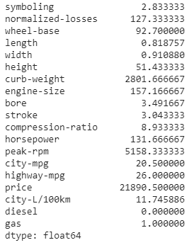

接下来，我们还可以统计每组`symboling/records`的个数。为此，请使用以下代码:

```py
# get the number of symboling/records in each group
style['symboling'].count()
```

前面代码的输出如下:

```py
body-style
convertible 6
hardtop 8
hatchback 68
sedan 94
wagon 25
Name: symboling, dtype: int64
```

了解了计数部分后，在下一节中，我们将讨论不同类型的数据聚合技术。

# 数据聚合

聚合是对数据集或其子集实施任何数学运算的过程。聚合是Pandas中用于操纵数据框中的数据进行数据分析的众多技术之一。

`Dataframe.aggregate()`函数用于在一列或多列之间应用聚合。一些最常用的聚合如下:

*   `sum`:返回请求轴的值的总和
*   `min`:返回请求轴的最小值
*   `max`:返回请求轴的最大值

我们可以在`DataFrame`、`df`中应用聚合，如`df.aggregate()`或`df.agg()`。

由于聚合仅适用于数值类型的列，因此让我们从数据集中提取一些数值列，并对它们应用一些聚合函数:

```py
# new dataframe that consist length,width,height,curb-weight and price
new_dataset = df.filter(["length","width","height","curb-weight","price"],axis=1)
new_dataset
```

前面代码片段的输出如下:

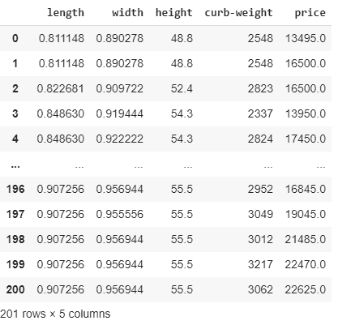

接下来，让我们应用单个聚合来获取列的平均值。为此，我们可以使用`agg()`方法，如下代码所示:

```py
# applying single aggregation for mean over the columns
new_dataset.agg("mean", axis="rows")
```

前面代码的输出如下:

```py
length 0.837102
width 0.915126
height 53.766667
curb-weight 2555.666667
price 13207.129353
dtype: float64
```

我们可以将多个函数聚合在一起。例如，我们可以通过使用以下代码一次找到所有列的总和和最小值:

```py
# applying aggregation sum and minimum across all the columns 
new_dataset.agg(['sum', 'min']) 
```

前面代码的输出如下:


输出是一个数据帧，其中的行包含应用于列的各个聚合的结果。要跨不同的列应用聚合函数，可以传递一个字典，该字典包含列名和值，这些列名和值包含任何特定列的聚合函数列表:

```py
# find aggregation for these columns 
new_dataset.aggregate({"length":['sum', 'min'], 
              "width":['max', 'min'], 
              "height":['min', 'sum'], 
              "curb-weight":['sum']}) 
# if any specific aggregation is not applied on a column
# then it has NaN value corresponding to it
```

前面代码的输出如下:

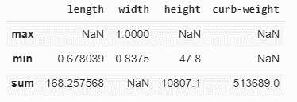

检查前面的输出。行的最大值、最小值和总和代表每一列的值。请注意，有些值是基于其列值的`NaN`。

# 分组操作

最重要的操作`groupBy`工具是聚合、过滤、转换和应用。在数据集中实现聚合函数的一种有效方法是在对所需的列进行分组后进行。聚合函数将为每个组返回一个聚合值。一旦创建了这些组，我们就可以对分组的数据应用一些聚合操作。

让我们通过传递一个聚合函数字典将`DataFrame`、`df`、`body-style`和`drive-wheels`以及`extract stats from each group`分组:

```py
# Group the data frame df by body-style and drive-wheels and extract stats from each group
df.groupby(
   ["body-style","drive-wheels"]
).agg(
    {
         'height':min, # minimum height of car in each group
         'length': max, # maximum length of car in each group
         'price': 'mean', # average price of car in each group

    }
)
```

前面代码的输出如下:

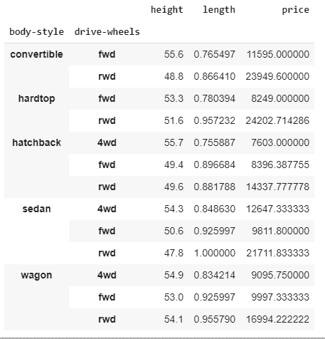

前面的代码根据`body-style`和`driver-wheels`对数据帧进行分组。然后，聚合函数应用于`height`、`length`和`price`列，这些列返回各自组中的最小高度、最大长度和平均价格。

我们可以为要分组执行的功能创建一个聚合字典，然后在以后使用它:

```py
# create dictionary of aggregations
aggregations=(
    {
         'height':min, # minimum height of car in each group
         'length': max, # maximum length of car in each group
         'price': 'mean', # average price of car in each group

    }
)
# implementing aggregations in groups
df.groupby(
   ["body-style","drive-wheels"]
).agg(aggregations) 
```

前面代码的输出如下:

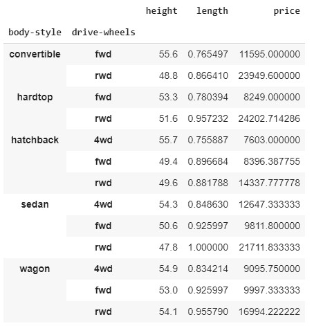

我们也可以在聚合中使用`numpy`函数:

```py
# import the numpy library as np
import numpy as np
# using numpy libraries for operations
df.groupby(
   ["body-style","drive-wheels"])["price"].agg([np.sum, np.mean, np.std])
```

前面代码的输出如下:

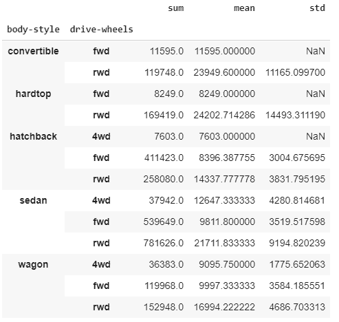

如前面截图所示，我们选择了两个类别，`body-style`和`drive-wheels`。这里可以看到每行的总和、平均值和标准差。很简单，对吧？现在，让我们学习如何重命名分组聚合列。

# 重命名分组聚合列

如果我们可以用在该列或组中执行的操作来重命名列名，您不认为输出数据帧会更有信息吗？

我们可以在每个组中执行聚合，并根据执行的操作重命名列。这对于理解输出数据集非常有用:

```py
df.groupby(
   ["body-style","drive-wheels"]).agg(
    # Get max of the price column for each group
    max_price=('price', max),
    # Get min of the price column for each group
    min_price=('price', min),
    # Get sum of the price column for each group
    total_price=('price', 'mean') 
)
```

前面代码的输出如下:

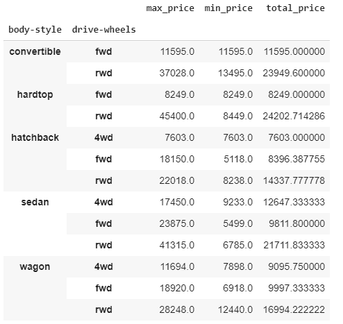

如上图截图所示，我们只选择了两类:`body-style`和`drive-wheels`。对于这些类别中的每一行，最高价、最低价和总价都是在连续的列中计算的。

# 分组转换

使用`groupby()`和聚合，你一定想过，*为什么我们不能将数据分组，应用聚合，并将结果直接追加到数据框中？* *这一切有可能一步到位吗？*是的，它是。

对组或列执行转换会返回一个对象，该对象按与其自身相同的轴长度进行索引。这是一个结合`groupby()`使用的操作。聚合操作必须返回数据的简化版本，而转换操作可以返回完整数据的转换版本。让我们来看看:

1.  让我们首先使用一个简单的转换函数，使用`lambda`函数将每辆车的价格提高 10%:

```py
df["price"]=df["price"].transform(lambda x:x + x/10)
df.loc[:,'price']
```

前面代码的输出如下:

```py
0 14844.5
1 18150.0
2 18150.0
3 15345.0
4 19195.0
        ... 
196 18529.5
197 20949.5
198 23633.5
199 24717.0
200 24887.5
Name: price, Length: 201, dtype: float64
```

2.  让我们通过`body-style`和`drive-wheels`来观察每个分组的汽车平均价格:

```py
df.groupby(["body-style","drive-wheels"])["price"].transform('mean')
```

前面代码的输出如下:

```py
0 26344.560000
1 26344.560000
2 15771.555556
3 10792.980000
4 13912.066667
           ... 
196 23883.016667
197 23883.016667
198 23883.016667
199 23883.016667
200 23883.016667
Name: price, Length: 201, dtype: float64
```

如果您查看前面的输出，您会注意到这是如何从我们正常的`groupby()`函数返回不同大小的数据集的。

3.  现在，为原始数据框中的平均价格创建一个新列:

```py
df["average-price"]=df.groupby(["body-style","drive-wheels"])["price"].transform('mean')

# selecting columns body-style,drive-wheels,price and average-price
df.loc[:,["body-style","drive-wheels","price","average-price"]]
```

前面代码的输出如下:


前面截图中显示的输出非常明显。我们计算了两个类别的价格和平均价格:`body-style`和`drive-wheels`。接下来，我们将讨论如何使用透视表和交叉制表技术。

# 数据透视表和交叉列表

Pandas为分组和汇总数据提供了几种选择。我们已经讨论了`groupby`、聚合和转换，但是还有其他选项可用，例如`pivot_table`和`crosstab`。首先，让我们了解透视表。

# 数据透视表

`pandas.pivot_table()`函数创建一个电子表格样式的数据透视表作为数据框。数据透视表中的级别将存储在结果数据框的索引和列上的多索引对象(分层索引)中。

最简单的数据透视表必须有一个数据框和一个索引/索引列表。让我们看看如何做到这一点:

1.  让我们制作一个由`body-style`、`drive-wheels`、`length`、`width`、`height`、`curb-weight`和`price`列组成的新数据框的透视表:

```py
new_dataset1 = df.filter(["body-style","drive-wheels",
                          "length","width","height","curb-weight","price"],axis=1)
#simplest pivot table with dataframe df and index body-style
table = pd.pivot_table(new_dataset1, index =["body-style"]) 
table
```

前面代码的输出如下:

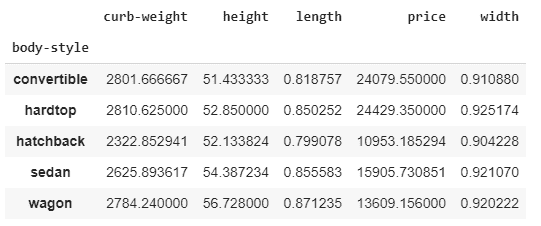

输出表类似于我们如何根据`body-style`对数据帧进行分组。上表中的值是相应类别中值的平均值。让我们制作一个更精确的透视表。

2.  现在，用`new_dataset1`数据框设计一个透视表，以`body-style`和`drive-wheels`为索引。请注意，提供多个索引将首先对数据帧进行分组，然后汇总数据:

```py
#pivot table with dataframe df and index body-style and drive-wheels
table = pd.pivot_table(new_dataset1, index =["body-style","drive-wheels"]) 
table
```

前面代码的输出如下:

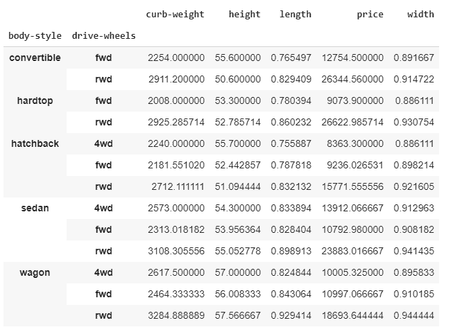

输出是按`body-style`和`drive-wheels`分组的透视表。它包含相应列数值的平均值。

数据透视表的语法包含一些参数，如 c、值、索引、列和聚合函数。我们可以同时将聚合函数应用于透视表。我们可以传递聚合函数、值和要应用聚合的列，以便创建数据框的汇总子集的数据透视表:

```py
# import numpy for aggregation function
import numpy as np

# new data set with few columns
new_dataset3 = df.filter(["body-style","drive-wheels","price"],axis=1)

table = pd.pivot_table(new_dataset3, values='price', index=["body-style"],
                       columns=["drive-wheels"],aggfunc=np.mean,fill_value=0)
table
```

就语法而言，前面的代码表示以下内容:

*   数据集名为`new_dataset3`的透视表。
*   这些值是要应用聚合函数的列。
*   索引是用于对数据进行分组的列。
*   用于指定数据类别的列。
*   `aggfunc`是要应用的聚合函数。
*   `fill_value`用于填写缺失值。

前面代码的输出如下:

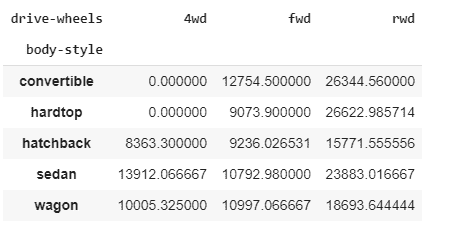

前面的数据透视表代表了那些`body-style`不同`body-style`和可用`drive-wheels`的汽车的平均价格。

3.  我们还可以对不同的列应用不同的聚合函数:

```py
table = pd.pivot_table(new_dataset1, values=['price','height','width'],
                       index =["body-style","drive-wheels"],
                       aggfunc={'price': np.mean,'height': [min, max],'width': [min, max]},
                       fill_value=0)
table
```

前面代码的输出如下:

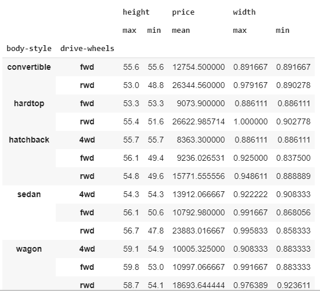

这个数据透视表代表了指数中提到的各个类别的汽车的高度、宽度和平均价格的最大值和最小值。

# 交叉列表

我们可以用另一种叫做交叉制表的技术定制`pandas`数据框。这使我们能够应对`groupby`和聚合，以进行更好的数据分析。Pandas有`crosstab`功能，这有助于建立交叉列表。交叉列表显示了某些数据组出现的频率。让我们来看看:

1.  我们用`pd.crosstab()`来看看不同厂家生产了多少不同车身风格的车:

```py
pd.crosstab(df["make"], df["body-style"])
```

前面代码的输出如下:

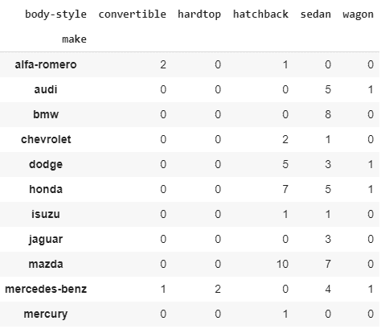

让我们应用边距和`margins_name`属性来显示交叉表的行和列总和，如以下代码所示:

```py
# apply margins and margins_name attribute to displays the row wise 
# and column wise sum of the cross table
pd.crosstab(df["make"], df["body-style"],margins=True,margins_name="Total Made")
```

前面代码的输出如下:

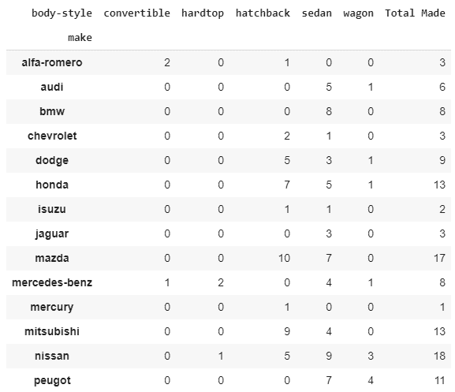

在行索引或列索引或两者的`crosstab`函数中应用多列将自动打印分组输出。

2.  让我们看看数据是如何在 T2 的汽车制造商和他们的门类型中按`body-type`和`drive_wheels`列分布的:

```py
pd.crosstab([df["make"],df["num-of-doors"]], [df["body-style"],df["drive-wheels"]],
            margins=True,margins_name="Total Made")

```

前面代码的输出如下:

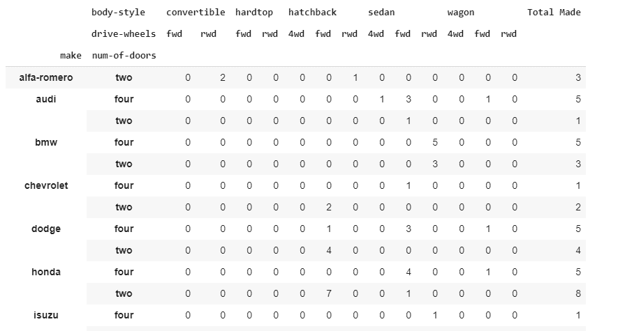

现在，让我们重命名列和行索引。重命名让我们更好地理解交叉列表，如下面的代码所示:

```py
# rename the columns and row index for better understanding of crosstab
pd.crosstab([df["make"],df["num-of-doors"]], [df["body-style"],df["drive-wheels"]],
            rownames=['Auto Manufacturer', "Doors"],
            colnames=['Body Style', "Drive Type"],
            margins=True,margins_name="Total Made").head()
```

前面代码的输出如下:


这些是一些交叉列表的例子，给了我们数据在各自类别中的频率分布。

`pd.crosstab`的透视表语法也接受一些参数，如 dataframe 列、值、normalize 和聚合函数。我们可以同时将聚合函数应用于交叉表。传递聚合函数和值(聚合将应用于这些列)会为我们提供一个数据框汇总子集的交叉表。

3.  首先，让我们通过对`crosstable`应用`mean()`聚合函数来查看不同制造商生产的汽车相对于其`body-style`的平均值`curb-weight`:

```py
# values are the column in which aggregation function is to be applied
# aggfunc is the aggregation function to be applied
# round() to round the output

pd.crosstab(df["make"], df["body-style"],values=df["curb-weight"],
            aggfunc='mean').round(0)
```

前面代码的输出如下:

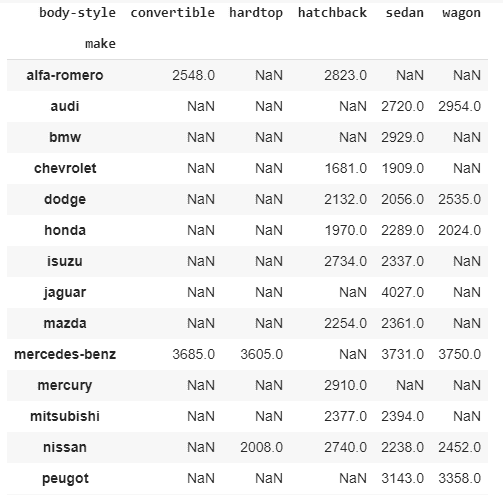

归一化的`crosstab`将显示每个组合出现的时间百分比。这可以使用`normalize`参数来完成，如下所示:

```py
pd.crosstab(df["make"], df["body-style"],normalize=True).head(10)
```

前面代码的输出如下:

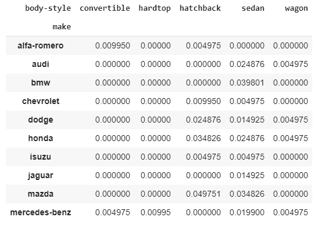

当我们试图分析两个或更多变量时，交叉列表技术会很方便。这有助于我们考察它们之间的关系。

# 摘要

将数据分组到相似的类别中是任何数据分析任务中必不可少的操作。在本章中，我们讨论了不同的分组技术，包括分组机制、重新排列、重塑数据结构、数据聚合方法和交叉制表方法。除此之外，我们还检查了每个案例的各种示例。

在下一章中，我们将学习相关性，它描述了两个或多个变量是如何相关的。除此之外，我们将通过合适的例子来看看不同类型的相关技术及其应用。

# 进一步阅读

*   *Pandas食谱:科学计算食谱*，*使用 Python 进行时间序列分析和数据可视化第一版*，作者:*Theodore petro*， *PACKT 出版物*，2017
*   *掌握Pandas-第二版*，作者:*阿希什·库马尔*， *PACKT 出版，*2019 年 10 月 25 日
*   *学习Pandas-第二版*，作者:*迈克尔·海特*， *PACKT 出版，*2017 年 6 月 29 日