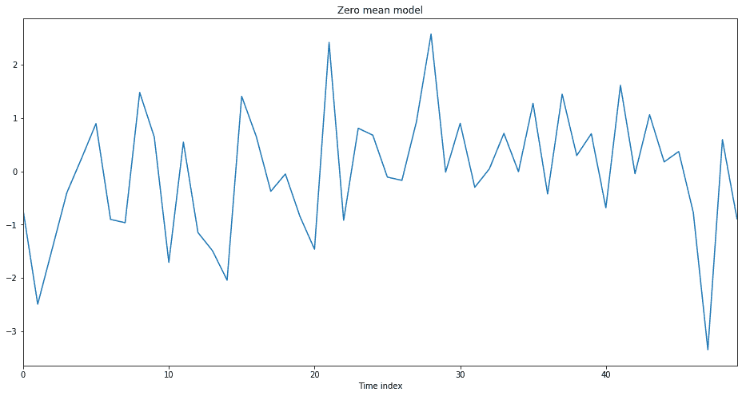
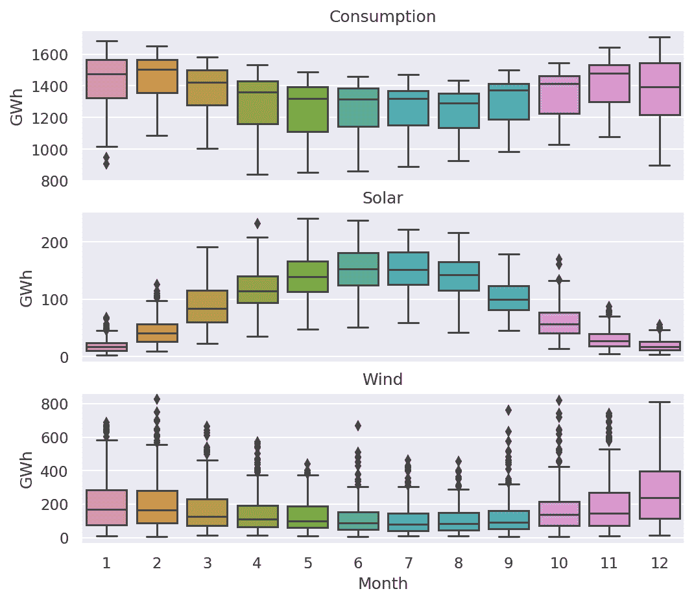
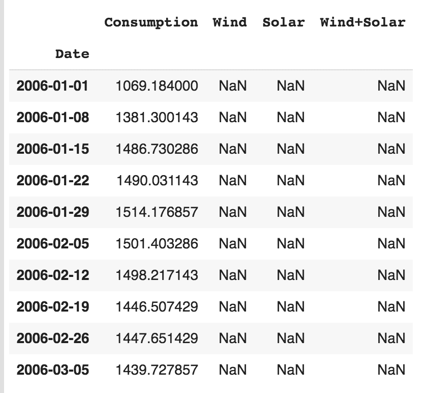

# 时间序列分析

时间序列数据包括时间戳，通常是在监控工业过程或跟踪任何业务指标时生成的。等间隔的时间戳值的有序序列被称为*时间序列*。对这种时间序列的分析被用于许多应用，例如销售预测、效用研究、预算分析、经济预测、库存研究等等。有太多的方法可以用来建模和预测时间序列。

在本章中，我们将使用 Python 库来探索**时间序列分析** ( **TSA** )。时间序列数据是关于一个系统或过程的一系列定量观察的形式，是在连续的时间点上产生的。

在本章中，我们将涵盖以下主题:

*   了解时间序列数据集
*   开放电力系统数据的美国运输安全管理局

# 技术要求

本章使用的所有代码和数据集都可以在 GitHub 存储库中找到([https://GitHub . com/PacktPublishing/用 python 动手探索数据分析](https://github.com/PacktPublishing/hands-on-exploratory-data-analysis-with-python)):

*   **代码**:本章需要的代码可以在标有`Chapter 8/`的文件夹中找到。
*   **数据集**:我们将为美国运输安全管理局使用开放电力系统数据。可以从[https://open-power-system-data.org/](https://open-power-system-data.org/)下载。也可以在`Chapter 9/datasets`里面的 GitHub 资源库里面找到数据集。

# 了解时间序列数据集

最基本的问题是，*我们所说的时间序列数据是什么意思？*当然，我们已经听过好几次了。或许我们可以给它下定义？当然可以。本质上，时间序列是按时间顺序进行的观察的集合。请注意，这里有两个重要的关键短语— **一组观察数据**和**按时间顺序排列**。因为它是一个系列，它必须是一个观察的集合，因为它处理时间，它必须以顺序的方式处理它。

让我们以时间序列数据为例:


上图为 2016 年前六个月的太阳能产量(单位为**千兆瓦** **小时** ( **千兆瓦**)。它还显示了每日和每周的用电量。

# 运输安全协议基础

为了理解时间序列数据集，让我们随机生成一个规范化的数据集:

1.  我们可以使用`numpy`库生成数据集:

```py
import os
import numpy as np
%matplotlib inline
from matplotlib import pyplot as plt
import seaborn as sns

zero_mean_series = np.random.normal(loc=0.0, scale=1., size=50)
zero_mean_series
```

我们使用了 NumPy 库来生成随机数据集。因此，这里给出的输出对您来说会有所不同。这里给出了前面代码的输出:

```py
array([-0.73140395, -2.4944216 , -1.44929237, -0.40077112,  0.23713083, 0.89632516, -0.90228469, -0.96464949, 1.48135275,  0.64530002, -1.70897785,  0.54863901, -1.14941457, -1.49177657, -2.04298133, 1.40936481,  0.65621356, -0.37571958, -0.04877503, -0.84619236, -1.46231312,  2.42031845, -0.91949491,  0.80903063,  0.67885337, -0.1082256 , -0.16953567,  0.93628661,  2.57639376, -0.01489153, 0.9011697 , -0.29900988,  0.04519547,  0.71230853, -0.00626227, 1.27565662, -0.42432848,  1.44748288,  0.29585819,  0.70547011, -0.6838063 ,  1.61502839, -0.04388889,  1.06261716,  0.17708138, 0.3723592 , -0.77185183, -3.3487284 ,  0.59464475, -0.89005505])
```

2.  接下来，我们将使用`seaborn`库绘制时间序列数据。检查这里给出的代码片段:

```py
plt.figure(figsize=(16, 8))
g = sns.lineplot(data=zero_mean_series)
g.set_title('Zero mean model')
g.set_xlabel('Time index')
plt.show()
```

我们使用`seaborn`库提供的内置方法`seaborn.lineplot()`函数绘制了时间序列图。这里给出了前面代码的输出:



3.  我们可以对列表执行累计求和，然后使用时间序列图绘制数据。剧情给出了更有趣的结果。检查以下代码片段:

```py
random_walk = np.cumsum(zero_mean_series)
random_walk
```

它生成一个累积和的数组，如下所示:

```py
array([ -0.73140395,  -3.22582556,  -4.67511792,  -5.07588904,-4.83875821,  -3.94243305,  -4.84471774,  -5.80936723,-4.32801448,  -3.68271446,  -5.39169231,  -4.8430533 ,-5.99246787,  -7.48424444,  -9.52722576,  -8.11786095,-7.46164739,  -7.83736697,  -7.886142  ,  -8.73233436, -10.19464748,  -7.77432903,  -8.69382394,  -7.88479331,-7.20593994,  -7.31416554,  -7.4837012 ,  -6.5474146 ,-3.97102084,  -3.98591237,  -3.08474267,  -3.38375255,-3.33855708,  -2.62624855,  -2.63251082,  -1.35685419,-1.78118268,  -0.3336998 ,  -0.03784161,   0.66762849,-0.01617781,   1.59885058,   1.55496169,   2.61757885, 2.79466023,   3.16701943,   2.3951676 ,  -0.9535608 ,-0.35891606,  -1.2489711 ])
```

请注意，对于任何特定值，下一个值是以前值的总和。

4.  现在，如果我们使用这里所示的时间序列图绘制列表，我们会得到一个有趣的图表，显示值随时间的变化:

```py
plt.figure(figsize=(16, 8))
g = sns.lineplot(data=random_walk)
g.set_title('Random Walk')
g.set_xlabel('Time index')
plt.show()
```

这里给出了前面代码的输出:


请注意上图中显示的图表。它显示了值随时间的变化。太好了——到目前为止，我们已经生成了不同的时间序列数据，并使用内置的`seaborn.tsplot()`方法绘制出来。

# 单变量时间序列

当我们捕捉到同一变量在特定持续时间内的一系列观测值时，该序列被称为**单变量时间序列。**一般来说，在单变量时间序列中，观测是在规则的时间段内进行的，例如一天中温度随时间的变化。

# 时间序列数据的特征

使用时间序列数据时，可以观察到几个独特的特征。一般来说，时间序列往往表现出以下特征:

*   看时间序列数据的时候，看有没有**趋势**是必不可少的。观察趋势意味着平均测量值似乎随着时间的推移而减少或增加。
*   时间序列数据可能包含大量**异常值**。当绘制在图表上时，可以注意到这些异常值。
*   时间序列中的一些数据往往会在一定的时间间隔内以某种模式重复出现。我们称这样的重复模式为**季节性**。
*   有时，时间序列数据会出现不均匀的变化。我们把这种不均匀的变化称为**突变**。观察时间序列中的突变是至关重要的，因为它揭示了基本的潜在现象。
*   随着时间的推移，一些序列趋向于遵循**恒定方差**。因此，有必要查看时间序列数据，看看数据是否随时间呈现恒定的变化。

前面列出的特征有助于我们对运输安全管理局进行更好的分析。既然我们知道了在时间序列数据中应该看到什么和期望什么，那么看到一些实际的例子将会很有用。接下来，让我们导入一个真实的数据库，并对其执行各种 TSA 方法。

# 开放电力系统数据的美国运输安全管理局

在本节中，我们将使用开放电力系统数据来了解 TSA。我们将研究时间序列数据结构、基于时间的索引以及可视化时间序列数据的几种方法。

我们将从导入数据集开始。看看这里给出的代码片段:

```py
# load time series dataset
df_power = pd.read_csv("https://raw.githubusercontent.com/jenfly/opsd/master/opsd_germany_daily.csv")
df_power.columns
```

这里给出了前面代码的输出:

```py
Index(['Consumption', 'Wind', 'Solar', 'Wind+Solar'], dtype='object')
```

这里描述了数据框的列:

*   **日期**:日期格式为`yyyy-mm-dd`。
*   **消耗**:表示`GWh`用电量。
*   **太阳能**:表示`GWh`太阳能发电。
*   **风能+太阳能**:这代表`GWh`的太阳能和风能发电量之和。

请注意日期列，它包含时间序列数据集。我们可以使用这个数据集来发现德国的电力消费和生产是如何随着时间的推移而变化的。

# 数据清理

现在让我们清除数据集的异常值:

1.  我们可以从检查数据集的形状开始:

```py
df_power.shape
```

这里给出了前面代码的输出:

```py
(4383, 5)
```

dataframe 包含 4，283 行和 5 列。

2.  我们还可以检查数据框中的一些条目。让我们检查最后 10 个条目:

```py
df_power.tail(10)
```

这里给出了前面代码的输出:


3.  接下来，让我们回顾一下`df_power`数据框中每一列的数据类型:

```py
df_power.dtypes
```

这里给出了前面代码的输出:

```py
Date object
Consumption float64
Wind float64
Solar float64
Wind+Solar float64
dtype: object
```

4.  注意`Date`列的数据类型为`object`。这是不正确的。所以，下一步是修正`Date`一栏，如下图所示:

```py
#convert object to datetime format
df_power['Date'] = pd.to_datetime(df_power['Date'])
```

5.  它应该将`Date`列转换为`Datetime`格式。我们可以再次验证这一点:

```py
df_power.dtypes
```

这里给出了前面代码的输出:

```py
Date datetime64[ns]
Consumption float64
Wind float64
Solar float64
Wind+Solar float64
dtype: object
```

请注意，`Date`列已更改为正确的数据类型。

6.  接下来，让我们将数据框的索引更改为`Date`列:

```py
df_power = df_power.set_index('Date')
df_power.tail(3)
```

这里给出了前面代码的输出:


从前面的截图中注意到`Date`列已经被设置为`DatetimeIndex`。

7.  我们可以使用下面给出的代码片段来验证这一点:

```py
df_power.index
```

这里给出了前面代码的输出:

```py
DatetimeIndex(['2006-01-01', '2006-01-02', '2006-01-03', '2006-01-04', '2006-01-05', '2006-01-06', '2006-01-07', '2006-01-08', '2006-01-09', '2006-01-10', ... '2017-12-22', '2017-12-23', '2017-12-24', '2017-12-25', '2017-12-26', '2017-12-27', '2017-12-28', '2017-12-29', '2017-12-30', '2017-12-31'],dtype='datetime64[ns]', name='Date', length=4383, freq=None)
```

8.  由于我们的索引是`DatetimeIndex`对象，现在我们可以使用它来分析数据帧。让我们在数据框架中添加更多的列，让我们的生活更轻松。让我们添加`Year`、`Month`和`Weekday Name`:

```py
# Add columns with year, month, and weekday name
df_power['Year'] = df_power.index.year
df_power['Month'] = df_power.index.month
df_power['Weekday Name'] = df_power.index.weekday_name
```

9.  让我们显示数据框中的五个随机行:

```py
# Display a random sampling of 5 rows
df_power.sample(5, random_state=0)
```

此代码的输出如下所示:


请注意，我们又添加了三列— `Year`、`Month`和`Weekday Name`。添加这些列有助于简化数据分析。

# 基于时间的索引

对于时间序列数据，基于时间的索引是`pandas`库非常强大的方法。具有基于时间的索引允许使用格式化的字符串来选择数据。例如，请参见下面的代码:

```py
df_power.loc['2015-10-02']
```

这里给出了前面代码的输出:

```py
Consumption 1391.05
Wind 81.229
Solar 160.641
Wind+Solar 241.87
Year 2015
Month 10
Weekday Name Friday
Name: 2015-10-02 00:00:00, dtype: object
```

请注意，我们使用了Pandas数据框`loc`访问器。在前面的示例中，我们使用日期作为字符串来选择一行。我们可以使用各种技术来访问行，就像我们可以使用普通的 dataframe 索引一样。

# 可视化时间序列

让我们可视化时间序列数据集。我们将继续使用相同的`df_power`数据帧:

1.  第一步是导入`seaborn`和`matplotlib`库:

```py
import matplotlib.pyplot as plt
import seaborn as sns
sns.set(rc={'figure.figsize':(11, 4)})
plt.rcParams['figure.figsize'] = (8,5)
plt.rcParams['figure.dpi'] = 150
```

2.  接下来，让我们生成德国每日用电量的完整时间序列的线图:

```py
df_power['Consumption'].plot(linewidth=0.5)
```

这里给出了前面代码的输出:


如前一张截图所示，y 轴显示的是用电量，x 轴显示的是年份。然而，数据集太多，无法涵盖所有年份。

3.  让我们用点来绘制所有其他列的数据:

```py
cols_to_plot = ['Consumption', 'Solar', 'Wind']
axes = df_power[cols_to_plot].plot(marker='.', alpha=0.5, linestyle='None',figsize=(14, 6), subplots=True)
for ax in axes:
    ax.set_ylabel('Daily Totals (GWh)')
```

这里给出了前面代码的输出:


输出显示，电力消耗可以分为两种不同的模式:

*   一个大约 1400 千兆瓦时及以上的集群
*   另一个大约低于 1400 千兆瓦时的星团

此外，太阳能产量夏季较高，冬季较低。这些年来，风力发电的产量似乎有一个强劲的增长趋势。

4.  我们可以进一步调查一年，以便更仔细地观察。检查此处给出的代码:

```py
ax = df_power.loc['2016', 'Consumption'].plot()
ax.set_ylabel('Daily Consumption (GWh)');
```

这里给出了前面代码的输出:


从前面的截图中，我们可以清楚地看到 2016 年的用电量。该图显示了年底(12 月)和 8 月期间的用电量大幅下降。我们可以在任何特定的月份寻找进一步的细节。让我们用下面的代码块来检查 2016 年 12 月:

```py
ax = df_power.loc['2016-12', 'Consumption'].plot(marker='o', linestyle='-')
ax.set_ylabel('Daily Consumption (GWh)');
```

这里给出了前面代码的输出:


如上图所示，工作日用电量较高，周末最低。我们可以看到一个月中每天的消耗量。我们可以进一步放大观察 12 月最后一周的消费情况。

为了指示 12 月的特定一周，我们可以提供如下所示的特定日期范围:

```py
ax = df_power.loc['2016-12-23':'2016-12-30', 'Consumption'].plot(marker='o', linestyle='-')
ax.set_ylabel('Daily Consumption (GWh)');
```

如前面的代码所示，我们希望看到`2016-12-23`和`2016-12-30`之间的用电量。这里给出了前面代码的输出:


如前一张截图所示，圣诞节当天用电量最低，可能是因为人们忙于聚会。圣诞节后，消费增加。

# 将时间序列数据分组

我们可以按不同的时间段对数据进行分组，并以方框图的形式呈现出来:

1.  我们可以先将数据按月分组，然后使用箱线图来可视化数据:

```py
fig, axes = plt.subplots(3, 1, figsize=(8, 7), sharex=True)
for name, ax in zip(['Consumption', 'Solar', 'Wind'], axes):
  sns.boxplot(data=df_power, x='Month', y=name, ax=ax)
  ax.set_ylabel('GWh')
  ax.set_title(name)
  if ax != axes[-1]:
    ax.set_xlabel('') 
```

这里给出了前面代码的输出:



上图说明了用电量一般冬季较高，夏季较低。夏季风力较高。此外，还有许多与电力消耗、风力发电和太阳能发电相关的异常值。

2.  接下来，我们可以按一周中的某一天对耗电量进行分组，并以方框图的形式呈现出来:

```py
sns.boxplot(data=df_power, x='Weekday Name', y='Consumption');
```

这里给出了前面代码的输出:


上图截图显示工作日用电量高于周末。有趣的是，工作日的异常值更多。

# 重新采样时间序列数据

通常需要以较低或较高的频率对数据集进行重新采样。这种重采样是基于聚合或分组操作完成的。例如，我们可以基于周平均时间序列对数据进行重新采样，如下所示:

1.  我们可以使用这里给出的代码对数据进行重新采样:

```py
columns = ['Consumption', 'Wind', 'Solar', 'Wind+Solar']

power_weekly_mean = df_power[columns].resample('W').mean()
power_weekly_mean
```

这里给出了前面代码的输出:



如前一张截图所示，第一行标记为`2006-01-01`，包含所有数据的平均值。我们可以绘制每日和每周的时间序列，以比较六个月期间的数据集。

2.  让我们看看 2016 年的最后六个月。让我们从初始化变量开始:

```py
start, end = '2016-01', '2016-06'
```

3.  接下来，让我们使用这里给出的代码绘制图表:

```py
fig, ax = plt.subplots()

ax.plot(df_power.loc[start:end, 'Solar'],
marker='.', linestyle='-', linewidth=0.5, label='Daily')
ax.plot(power_weekly_mean.loc[start:end, 'Solar'],
marker='o', markersize=8, linestyle='-', label='Weekly Mean Resample')
ax.set_ylabel('Solar Production in (GWh)')
ax.legend();
```

这里给出了前面代码的输出:


前面的截图显示，每周平均时间序列随着时间的推移而增加，并且比每日时间序列平滑得多。

# 摘要

在本章中，我们讨论了如何使用 pandas 库导入、清理、分析和可视化时间序列数据集。此外，我们使用`matplotlib`和`seaborn`库可视化了时间序列数据集。最后，我们使用 Python 来加载和检查开放电力系统数据数据集，并执行了几项与 TSA 相关的技术。

在下一章中，我们将学习使用经典机器学习技术和三种不同类型的机器学习进行模型开发的不同方法，即监督学习、无监督机器学习和强化学习。

# 进一步阅读

*   *P* *实用时间序列分析*，作者:*阿维石·帕尔博士*和*PKS·普拉卡什博士**帕克特出版*
*   *Python 机器学习-第三版*，作者:*塞巴斯蒂安·拉什卡*和*瓦希德·米尔贾利利**帕克特出版*
*   *Python 数据分析**大卫·泰伯**帕克特出版*
*   *Python 回归分析*，作者:*卢卡·马萨龙*和*阿尔贝托·博切蒂**帕克特出版*
*   *机器学习统计*，作者:*普拉塔·丹盖提*、*T5】帕克特出版*
*   *数据科学统计*，作者:*詹姆斯·米勒*，*帕克特出版*
*   *一周内的数据科学算法-第二版*，作者:*达维德·纳廷加*，*帕克特出版*
*   *sci kit 机器学习-学习快速入门指南*，作者:*凯文·乔利*，*帕克特出版*