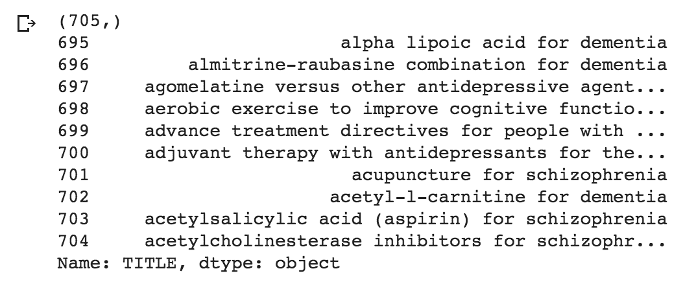
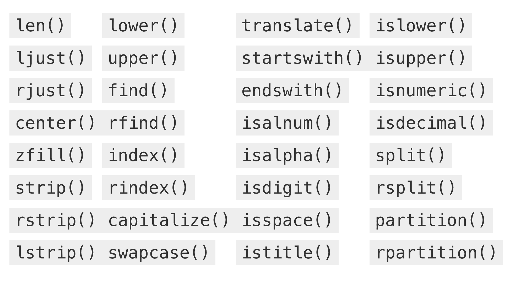

# 附录

如前所述，数据预处理和数据转换是数据挖掘和其他数据科学方法中最重要的两个过程。在数据处理阶段，我们的数据通常是字符串形式的。互联网上的大多数数据集都是基于字符串的。因此，管柱操纵技术是**探索性数据分析** ( **EDA** )的重要组成部分。

在本附录章节中，我们将了解以下主题:

*   字处理
*   使用Pandas向量化字符串函数
*   使用正则表达式

# 字处理

对于字符串操作，我们指的是如何创建字符串、访问这些字符串中的字符、分割字符串、删除或更新字符串中的字符以及其他字符串操作符。在接下来的部分中，我们将一个接一个地看到所有这些步骤。

# 创建字符串

我们可以用三种不同的方式在 Python 中创建字符串:

*   使用单引号
*   使用双引号
*   使用三重引号。

请看下面的例子:

```py
String1 = 'Creating a String with single Quotes.'
String2 = "Creating a String with double Quotes."
String3 = '''Creating a String with triple Quotes.'''
print(String1) 
print(String2) 
print(String3) 
```

所有三个`print`语句的输出都是相同的。他们按照预期创建了一个字符串。

# 在 Python 中访问字符

Python 提供了一种索引机制来访问任何字符串中的任何字符。任何字符串的索引都以 0 开头。我们还可以使用负索引值从任何字符串的后面访问任何字符。例如，-1 表示字符串的最后一个字符，-2 表示倒数第二个字符，依此类推。请注意，如果我们尝试访问任何不在字符串限制内的索引，Python 会以`TypeError`提醒我们。

下面是用于访问字符串字符的 Python 代码:

```py
# characters of String 
String = "Exploratory Data Analysis"

# Printing First character 
print("\nFirst character of String is: ") 
print(String[0]) 

# Printing Last character 
print("\nLast character of String is: ") 
print(String[-1])
```

每个代码块的输出都显示有一个内联注释，这样更容易理解。

# 字符串切片

要访问字符串中的一系列字符，可以使用切片方法。使用切片操作符(`:`)对字符串进行切片。这里有一个演示字符串切片的程序:

```py
# Creating a String 
String = "Exploratory Data Analysis"

# Outputs: Slicing characters from 3-12:loratory 
print("\nSlicing characters from 3-12: ") 
print(String[3:12]) 

# Outputs:Slicing characters between 3rd and 2nd last character: loratory Data Analys 
print("\nSlicing characters between " + "3rd and 2nd last character: ") 
print(String[3:-2]) 
```

每个代码块的输出都显示有一个内联注释，这样更容易理解。

# 从字符串中删除/更新

Python 不支持字符串变异。也就是说，它不允许删除或更新字符串中的任何字符。如果我们试图这样做，就会产生一个错误。但是，使用内置的`del`关键字可以删除整个字符串。在字符串更新的情况下出现错误的主要原因是字符串是不可变的。在下面的代码块中，让我们创建一个字符串，并尝试更新其中的一些字符，如下所示:

```py
# Updation of a character

String = "Exploratory Data Analysis"

String[2] = 'p'
print("\nUpdating character at 2nd Index: ") 
print(String) 
```

前面的代码应该会给你一个错误。

# Python 中的转义序列

一个字符串的语法中已经包含了单引号(`'`)和双引号(`''`)。因此，如果我们需要在一个字符串中打印一个单引号或一个双引号，就会产生一个`SyntaxError`。为了避免这种错误，必须对引号(无论是单引号还是双引号)进行转义。这种现象被称为逃逸序列。转义序列以反斜杠(`\`)开头，可以有不同的理解。如果我们打算使用单引号或双引号作为字符串，那么它必须通过在前面附加一个反斜杠来转义。让我们看看它在行动。

我们将针对所有三种情况(单引号、双引号和三引号)显示以下示例:

```py
String = '''I'm a "Data Scientist"'''

# Initial String 
print("Initial String with use of Triple Quotes: ") 
print(String) 

# Escaping Single Quote 
String = 'I\'m a "Data Scientist"'
print("\nEscaping Single Quote: ") 
print(String) 

# Escaping Double Quotes 
String = "I'm a \"Data Scientist\""
print("\nEscaping Double Quotes: ") 
print(String) 
```

在计算机科学中，我们经常需要在不同的场合提供一些文件或数据集的路径。处理数据科学时也是如此。第一步是加载数据集。为此，我们必须使用双斜线提供文件的链接或路径，以便转义双斜线。然后，我们用转义序列打印路径，如下例所示:

```py
String = "C:\\Python\\DataScience\\"
print("\nEscaping Backslashes: ") 
print(String)

```

上述代码生成以下输出:

```py
Escaping Backslashes: 
C:\Python\DataScience\
```

注意代码中双斜线的使用——这提供了单斜线作为输出。这就是为什么逃跑是一种非常有用的机制。

# 格式化字符串

我们可以使用`format()`方法在 Python 中格式化字符串。当以任何特定格式显示输出时，这种方法非常灵活和强大。`format()`方法将大括号`{}`作为占位符，可以根据特定的顺序被任何特定的参数替换。看看下面这些例子。

让我们首先看一个默认订单的例子:

```py
# Default order 
String1 = "{} {} {}".format('Exploratory ', 'Data ', 'Analysis') 
print("Print String in default order: ") 
print(String1)
```

前面代码的输出如下:

```py
Print String in default order:
Exploratory Data Analysis
```

除了这个默认顺序，我们还可以使用位置格式。比如你有一个`('Exploratory', 'Data', 'Analysis')`这样的字符串，我们要显示一个`('Data', 'Exploratory', 'Analysis')`字符串。我们可以通过使用位置格式来实现这一点，如下例所示:

```py
# Positional Formatting 
String1 = "{1} {0} {2}".format('Exploratory', 'Data', 'Analysis') 
print("\nPrint String in Positional order: ") 
print(String1) 
```

我们也可以通过使用关键字来格式化任何字符串。例如，看看下面的代码:

```py
# Keyword Formatting 
String1 = "{l} {f} {g}".format(g = 'Exploratory', f = 'Data', l = 'Analysis') 
print("\nPrint String in order of Keywords: ") 
print(String1) 
```

前面代码的输出如下:

```py
Print String in order of Keywords: 
Analysis Data Exploratory

```

接下来，我们将了解如何加载文本数据集并执行预处理操作。

# 使用Pandas向量化字符串函数

对于字符串格式，最好使用稍微混乱一点的数据集。我们将在撰写综述论文时使用我在博士研究期间收集的数据集。可以在这里找到:[https://raw . githubusercontent . com/sureshHARDIYA/PhD-resources/master/Data/Review % 20 paper/preferred . CSV](https://github.com/sureshHARDIYA/phd-resources/blob/master/Data/Review%20Paper/preprocessed.csv)。

1.  让我们加载这篇文本文章，然后显示前八个条目。让我们从加载数据并检查其结构和一些注释开始，如下所示:

```py
import numpy as np
import pandas as pd
import os
```

2.  接下来，让我们阅读文本文件并显示最后的`10`项，如下所示:

```py
text = pd.read_csv("https://raw.githubusercontent.com/sureshHARDIYA/phd-resources/master/Data/Review%20Paper/preprocessed.csv")
text = text["TITLE"] 
print (text.shape)
print( text.tail(10))
```

3.  前面代码的输出可以在下面的截图中看到:



Figure 1: This is the output of the preceding code

Pandas 扩展了操作整个字符串系列的内置功能。在下一节中，我们将对 pandas 字符串函数使用相同的数据集。

# 对Pandas数据框使用字符串函数

让我们使用Pandas数据框的内置函数。我们将继续使用上一节中导入的相同数据集。Python 中的大多数字符串操作函数都使用Pandas向量化字符串方法。

以下是Pandas字符串函数的列表，这些函数反映了 Python 字符串方法:



Figure 2 - List of vectorized string functions in pandas 

让我们练习以下用例:

1.  从数据框的`text`列中提取第一句，并将其转换为小写字符，如下所示:

```py
 text[0].lower() 
```

2.  将`text`列中的所有注释转换为小写，并显示前八个条目，如下所示:

```py
text.str.lower().head(8)
```

3.  提取第一句并将其转换为大写字符，如下所示:

```py
text[0].upper() 
```

4.  获取文本字段中每个注释的长度，并显示前八个条目，如下所示:

```py
text.str.len().head(8)
```

5.  将所有注释组合成一个字符串，并显示前 500 个字符，如下所示:

```py
text.str.cat()[0:500]  
```

明智的做法是验证所有的注释都连接在一起。你能想到我们可能需要将所有注释组合成一个字符串的用例吗？好吧，不如——比如说——我们希望看到所有用户在评论时最常选择的词语。

6.  将每个字符串分割成一个系列，并使用`series.str.slice()`以元素方式返回结果，如以下代码片段所示:

```py
text.str.slice(0, 10).head(8)  
```

7.  使用`str.replace()`将给定子串的出现替换为不同的子串，如以下代码片段所示:

```py
text.str.replace("Wolves", "Fox").head(8)
```

在前面的例子中，`Wolves`的所有情况将被替换为`Fox`。这充当了一个*搜索和替换*的功能，你可以在许多内容管理系统和编辑器中找到。

在处理文本数据时，我们经常测试字符串是否包含特定的子字符串或字符模式。让我们只搜索那些提到安德鲁·威金斯的评论。我们需要匹配所有提到他的帖子，避免匹配没有提到他的帖子。

使用`series.str.contains()`获取一系列真/假值，指示每个字符串是否包含给定的子字符串，如下所示:

```py
# Get first 10 comments about Andrew Wiggins
selected_comments = text.str.lower().str.contains("wigg|drew")

text[selected_comments].head(10) 
```

仅供参考，让我们计算一下提到安德鲁·威金斯的评论比例，如下所示:

```py
len(text[selected_comments])/len(text)
```

输出是 0.06649063850216035。可以看到，`6.6%`的评论都提到了安德鲁·威金斯。这是我们提供给`str.contains()`的字符串模式参数的输出。

关于安德鲁·威金斯的帖子可以用任何不同的名字来指代他——维金斯、安德鲁、维格、德鲁——所以我们需要比单个子字符串更灵活的东西来匹配我们感兴趣的所有帖子。我们提供的模式是正则表达式的一个简单示例。

# 使用正则表达式

正则表达式(regex)是一系列字符和特殊元字符，用于匹配一组字符串。正则表达式允许您在字符串匹配操作中比仅仅提供简单的子字符串更具表现力。你可以把它想象成一个*模式*，你想用不同长度的字符串进行匹配，由不同的字符组成。

在`str.contains()`方法中，我们提供了正则表达式`wigg|drew`。在这种情况下，竖线`|`是充当`OR`运算符的元字符，因此该正则表达式匹配包含子字符串`wigg`或`drew`的任何字符串。

元字符允许您更改匹配方式。当您提供不包含元字符的正则表达式时，它只匹配精确的子字符串。例如，`Wiggins`将只匹配包含精确子串`Wiggins`的字符串。

下面是基本元字符的列表，以及它们的作用:

*   `"."`:句点是匹配除换行符以外的任何字符的元字符，如下面的代码块所示:

```py
# Match any substring ending in ill
my_words = pd.Series(["abaa","cabb","Abaa","sabb","dcbb"])

my_words.str.contains(".abb")
```

*   `"[ ]"`:方括号指定一组要匹配的字符。查看以下示例片段，并将您的输出与本章中给出的笔记本进行比较:

```py
my_words.str.contains("[Aa]abb")
```

*   `"^"`:在方括号外，插入符号在字符串的开头搜索匹配项，如下面的代码块所示:

```py
Sentence_series= pd.Series(["Where did he go", "He went to the shop", "he is good"])

Sentence_series.str.contains("^(He|he)") 
```

*   `"( )"`:正则表达式中的括号用于分组和强制执行正确的操作顺序，就像它们用于数学和逻辑表达式一样。在前面的例子中，括号让我们对 OR 表达式进行分组，以便`"^"`和`"$"`符号对整个`OR`语句进行操作。
*   `"*"`:星号匹配前面字符的`0`个或多个副本。
*   `"?"`:问号匹配前面字符的`0`或`1`副本。
*   `"+"`:加号匹配前面字符的 1 个或多个副本。
*   `"{ }"`:花括号匹配指定重复次数的前一个字符:
*   `"{m}"`:前面的元素匹配`m`次。
*   `"{m,}"`:前面的元素匹配`m`次以上。
*   `"{m,n}"`:前一个元素在`m`和`n`时间之间匹配。

正则表达式包括几个特殊的字符集，允许我们快速指定某些常见的字符类型。它们包括以下内容:

*   [a-z]:匹配任何小写字母。
*   [A-Z]:匹配任何大写字母。
*   [0-9]:匹配任意数字。
*   [a-zA-Z0-9]:匹配任何字母或数字。
*   在方括号内添加`"^"`符号匹配集合中的任何字符*而不是*:
*   [^a-z]:匹配任何不是小写字母的字符。
*   [^A-Z]:匹配任何不是大写字母的字符。
*   [^0-9]:匹配任何不是数字的字符。
*   [^a-zA-Z0-9]:匹配任何不是字母或数字的字符。
*   Python 正则表达式还包括一个指定常见序列的简写:
*   \d:匹配任意数字。
*   \D:匹配任何非数字。
*   \w:匹配一个单词字符。
*   \W:匹配一个非单词字符。
*   \s:匹配空白(空格、制表符、换行符等。).
*   \S:匹配非空白。

请记住，我们确实在字符串格式化时逃脱了排序。同样，当您想要匹配元字符符号本身时，您必须在元字符中用`""`转义。

例如，如果你想匹配句点，你不能使用`"."`，因为它是一个匹配任何东西的元字符。相反，您可以使用`.`来转义句点的元字符行为，并匹配句点本身。下面的代码块说明了这一点:

```py
# Match a single period and then a space

Word_series3 = pd.Series(["Mr. SK","Dr. Deepak","Miss\Mrs Gaire."])

Word_series3.str.contains("\. ")
```

如果你想匹配转义字符`\`本身，你要么必须使用四个反斜杠`"\"`要么以`r"mystring"`的形式将字符串编码为原始字符串，然后使用双反斜杠。原始字符串是 Python 中的一种替代字符串表示形式，它简化了在普通字符串上执行正则表达式的一些奇怪之处，如下面的代码片段所示:

```py
# Match strings containing a backslash
Word_series3.str.contains(r"\\")
```

在处理正则表达式中的特殊字符串时，通常使用原始字符串，因为它避免了这些特殊字符可能出现的问题。

正则表达式通常用于匹配文本之间的电话号码、电子邮件地址和网址的模式。Pandas 有几个接受正则表达式模式并执行操作的字符串函数。我们现在熟悉这些功能:`series.str.contains()`和`series.str.replace()`。

现在，让我们在注释数据集中使用更多的函数。

使用`series.str.count()`统计每个字符串中模式的出现次数，如下所示:

```py
text.str.count(r"[Ww]olves").head(8)
```

使用`series.str.findall()`获取每个匹配的子串，并将结果作为列表返回，如下所示:

```py
text.str.findall(r"[Ww]olves").head(8)
```

操纵一根弦的方法有很多。我们选择了最基本的方法来说明，以便让您简单地理解。

# 进一步阅读

*   *用 NLTK 2.0 食谱处理 Python 文本*，*雅各布·帕金斯，Packt 出版*，*11 月 9 日*， *2010* *。*
*   *NLTK 精粹**尼廷哈登亚·帕克特出版**T52015 年 7 月 26 日* *。*
*   *Python 自然语言处理实操*， *Rajesh Arumugam，Rajalingappaa Shanmugamani，Packt Publishing* ，*7 月 17 日*， *2018* *。*
*   *用 Python 进行数据分析**David Taieb，Packt Publishing**T512 月 31 日**2018**。*