# 使用 Python 学习地理空间分析

地理空间技术目前正在影响我们的世界，因为它正在改变我们对人类历史的认识。在这本书里，我们将逐步了解地理空间分析的历史，它早于计算机甚至纸质地图。然后，我们将研究为什么您可能想要学习并使用一种编程语言作为地理空间分析师，而不是仅仅使用**地理信息系统** ( **地理信息系统**)应用程序。这将有助于我们理解让尽可能多的人能够访问地理空间分析的重要性。

在本章中，我们将涵盖以下主题:

*   地理空间分析和我们的世界
*   莎拉·帕尔卡博士与考古学
*   地理信息系统
*   遥感概念
*   高程数据
*   计算机辅助制图
*   地理空间分析和计算机编程
*   地理空间分析的重要性
*   地理信息系统概念
*   通用地理信息系统流程
*   常见的遥感过程
*   常见的栅格数据概念
*   创建尽可能简单的 Python 地理信息系统

是的，你没听错！我们将从一开始就使用 Python 从头开始构建最简单的地理信息系统。

# 技术要求

这本书假设你有一些 Python 编程语言的基本知识，基本的计算机知识，以及至少地理空间分析的意识。本章为地理空间分析提供了基础，这是研究遥感和地理信息系统领域的任何主题所必需的，包括本书所有其他章节中的材料。

本书中的例子基于 Python 3.4.3，可以在这里下载:[https://www.python.org/downloads/release/python-343/](https://www.python.org/downloads/release/python-343/)。

# 地理空间分析和我们的世界

19 世纪 80 年代，英国探险家开始运用科学的严谨性来挖掘古代文化遗址。考古领域是一个令人沮丧的、低成本的、通常也是危险的工作，需要耐心和好运。地球非常擅长保守秘密和抹去人类努力的故事。不断变化的河流、洪水、火山、沙尘暴、飓风、地震、火灾和其他事件将整个城市吞噬到周围的景观中，我们因时间的流逝而失去了它们。

我们对人类历史的了解是基于通过考古挖掘对古代文化的一瞥，以及对我们有幸通过有根据的猜测或反复试验偶然发现的遗址的研究。在过去，除非一个团队挖掘了一个遗址，发现了一些东西，并正确地识别了它，否则考古是不会成功的。关于去哪里寻找的预测是基于一些主要因素，如支持农业所需的水的接近度、以前发现的地点、早期探险者的描述以及其他广泛的线索。

2007 年，来自伯明翰阿拉巴马大学的考古学家萨拉·帕尔卡克博士开始劝说我们顽固的地球揭露人类去过哪里和做过什么的秘密。从那以后，她的方法彻底改变了考古学领域。

在短短的几年里，帕尔卡克博士和她的团队发现了 17 座金字塔、1000 多座坟墓的痕迹，以及埃及 3000 个古代定居点的脚印，包括著名的失落之城坦尼斯的城市网格。她确定了罗马尼亚、纳巴泰王国和突尼斯的重要考古遗址。她在挖掘得很好的古罗马港口葡萄牙找到了一个竞技场，以及它的灯塔和通往罗马的靠近台伯河的运河。

她是如何发现这么多隐藏了近两个世纪仍未被发现的宝藏的？她看着更大的画面。帕尔卡克博士完善了利用卫星图像在离地球近 400 英里的地方定位古代遗址的技术。她的职业生涯恰好与随时可用的高分辨率卫星图像的出现相吻合，该图像具有 10 英寸或更小的像素分辨率，从而提供了检测景观细微变化所需的细节，从而显示了古代遗址。

尽管她的发现数量巨大，意义重大，但从太空中寻找文化遗产需要大量的工作。太空考古学家首先研究旧地图和历史记录。然后，他们查看现有站点的现代数字地图。他们还研究数字地形模型，以确定古代人为了躲避洪水而建造的土地上的细微隆起。然后，他们使用多光谱图像，包括红外线，这可以暴露植被或土壤的变化，当处理时，由于进口的石头和其他材料埋在地下，气泡上升到表面。这种由假颜色表示的变色，让我们能够区分从地面上完全看不见的地方反射的阳光的带宽，甚至从空中反射到肉眼，它们突然以鲜明的对比脱颖而出，在卫星图像上显示出精确的位置。

古代文化遗址从地面上往往是肉眼看不见的。例如，下面的照片显示了美国伊利诺伊州刘易斯顿附近一个保存完好的美洲土著人墓地，由于它的位置，它已经存活了几千年，很容易被看到:

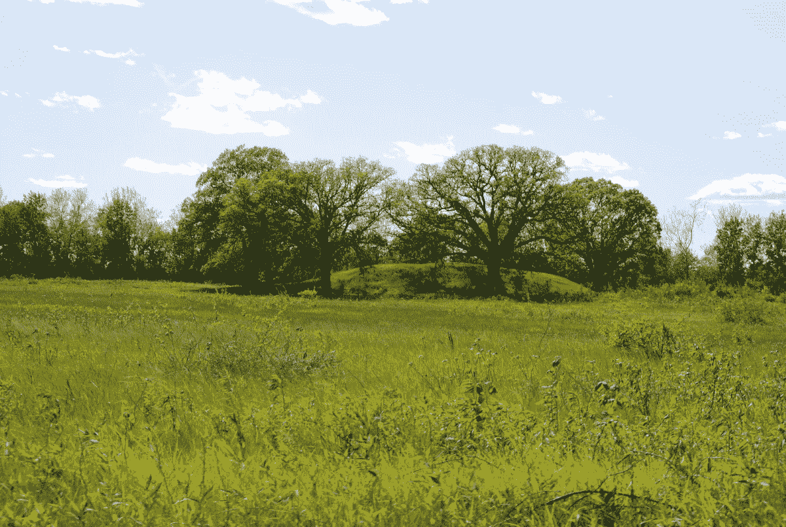

然而，在气候条件恶劣的地区，遗址可能会被部分破坏，因此很难找到。下面这张照片展示了路易斯安那州的一片沼泽地，这里遍布着古老的美洲土著人埋葬土墩，这些土墩已经被侵蚀了几个世纪，如果没有卫星图像，现在几乎无法探测到:


下面这张经过处理的卫星图像来自美国宇航局科学家马尔科·贾尔迪诺博士，它和上一张照片位于同一个沼泽地区，显示了从地面上看不到的四个不同埋葬土堆的遗迹。尽管这个地方已经有几百年的历史了，但与周围的沼泽相比，这里的植被种类和健康状况是不同的。虽然考古学家在该地区研究了几十个类似的遗址，但该项目首次确定土堆建造者经常使用一种将土堆放置在四个主要方向(北、南、西、东)的模式，这种模式在太空中高度可见，但在地面上很难实现:


尽管太空考古学家在寻找古代遗址方面速度很快，但他们现在发现自己面临的不仅仅是地质和气象因素。抢劫一直是考古界的一个威胁，但由于战争和黑市文物，这已经成为一个更大的问题。现代建筑也会破坏有价值的遗址。然而，坚定的考古学家正在使用他们用来发现上述遗址的相同技术来检测抢劫或建筑威胁。一旦他们发现威胁的证据，他们就会通知政府，这样他们就可以进行干预。下图显示了在叙利亚东部的罗马杜拉欧罗普斯遗址发生抢劫的证据。被圈起来的区域有盗墓者挖的洞:

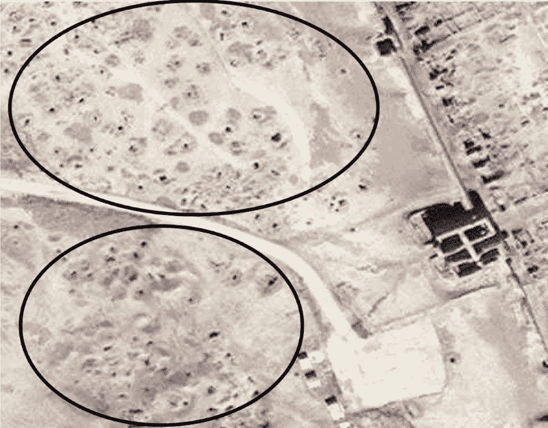

除了卫星图像处理和视觉解释，太空考古学家还使用地理信息系统制图技术来标记或数字化遗址，覆盖现代道路和城市足迹，创建标记地图，等等。令人兴奋的空间考古新领域是我们将在本书中介绍的地理空间分析的许多最新应用之一。

**Beyond archaeology: **Geospatial analysis can be found in almost every industry, including real estate, oil and gas, agriculture, defense, disaster management, health, transportation, and oceanography, to name a few. For a good overview of how geospatial analysis is used in dozens of different industries, go to [https://www.esri.com/what-is-gis/who-uses-gis](https://www.esri.com/what-is-gis/who-uses-gis).

# 地理空间分析的历史

地理空间分析可以追溯到 15000 年前，法国西南部的拉斯科洞穴。在这个洞穴里，旧石器时代的艺术家绘制了常见的狩猎动物和许多专家认为的天文星图，用于宗教仪式，甚至潜在的猎物迁移模式。虽然粗糙，这些画展示了一个古代的例子，人类创造了他们周围世界的抽象模型，并关联时空特征来寻找关系。下面的照片展示了其中一幅画，上面覆盖着星图:

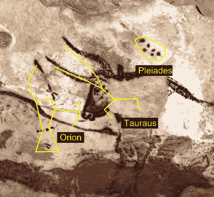

几个世纪以来，制图学艺术和土地测量科学得到了发展，但直到 19 世纪，地理分析才出现了重大进展。1830 年至 1860 年间欧洲致命的霍乱爆发导致巴黎和伦敦的地理学家使用地理分析进行流行病学研究。

1832 年，查尔斯·皮奎特(Charles Picquet)在一份关于霍乱爆发的报告中，使用不同的半色调灰色来代表巴黎 48 个区每千名公民的死亡人数。1854 年，约翰·斯诺博士进一步发展了这种方法，跟踪了伦敦爆发的霍乱。通过在每次确诊死亡病例时在城市地图上放置一个点，他能够分析霍乱病例的聚集情况。斯诺将这种疾病追溯到一个水泵，并阻止了进一步的病例。下面的地图有三层街道，每个水泵有一个 **X** ，每个霍乱死亡病例有圆点:

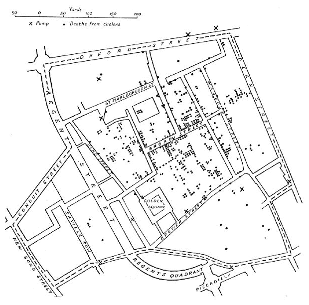

地理空间分析不仅仅用于疾病战争。几个世纪以来，将军和历史学家一直使用地图来理解人类战争。一位名叫查尔斯·米纳德的法国退休工程师绘制了一些 1850 年至 1870 年间绘制的最复杂的信息图。术语**信息图**太普通了，无法描述这些图纸，因为它们有很强的地理成分。这些地图的质量和细节使它们成为地理信息分析的绝佳范例，即使以今天的标准来看也是如此。米纳德在 1869 年发布了他的杰作:

"La carte figurative des pertes successives en hommes de l'Armée Française dans la campagne de Russie 1812-1813," which is translated as "Figurative map of the successive losses of men of the French army in the Russian Campaign 1812-13." 

这描绘了 1812 年俄国战役中拿破仑军队的大屠杀。这张地图显示了军队的规模和位置，以及当时的天气状况。下图包含单个主题的四个不同系列的信息。这是一个用笔和纸进行地理分析的极好例子。军队的规模由棕色和黑色条带的宽度代表，比例为每 10，000 人一毫米。数字也是沿着狭长地带写的。棕色的路径显示了进入俄罗斯的士兵，而黑色的路径代表了那些成功的士兵。地图比例显示在中央右侧，为一个法国联赛(2.75 英里或 4.4 公里)。底部的图表从右到左，描绘了士兵们在从俄罗斯回家的路上经历的严寒温度:

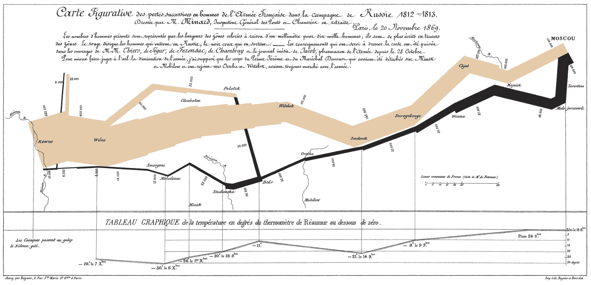

米纳尔德发布了另一张引人注目的地图，记录了从法国各地送往巴黎的牛的数量，尽管这远比一场战争更普通。米纳德在法国各地区使用不同大小的饼图来显示每个地区的牛的品种和出货量:


20 世纪初，大规模印刷推动了地图图层概念的发展——这是地理空间分析的一个关键特征。制图员在玻璃板上绘制不同的地图元素(植被、道路和高程轮廓)，然后将这些元素堆叠起来拍照，打印成一幅图像。如果制图员犯了一个错误，只需要更换一块玻璃，而不是整个地图。后来，塑料薄片的发展使得以这种方式创建、编辑和存储地图变得更加容易。然而，地图的分层概念作为分析的一种好处直到现代计算机时代才开始发挥作用。

# 地理信息系统

20 世纪 60 年代，计算机制图随着计算机本身而发展。然而，地理信息系统一词的起源始于加拿大林业和农村发展部。罗杰·汤姆林森博士领导了一个由 40 名开发人员组成的团队，他们与 IBM 达成协议，将建设加拿大地理信息系统(T1)(T2)CGIS(T3)。CGIS 跟踪了加拿大的自然资源，并允许对这些特征进行剖面分析，以供进一步分析。CGIS 将每种类型的土地覆盖储存为不同的层。

它还将数据存储在适用于整个国家的加拿大特定坐标系中，该坐标系是为优化面积计算而设计的。尽管以今天的标准来看，所使用的技术还很原始，但该系统在当时具有非凡的能力。CGIS 包括看起来相当现代的软件功能:

*   地图投影切换
*   扫描图像的橡胶薄片
*   地图比例变化
*   线平滑和泛化以减少要素中的点数
*   多边形的自动间隙闭合
*   面积测量
*   多边形的分解和合并
*   几何缓冲
*   新多边形的创建
*   扫描
*   参考数据中新特征的数字化

The National Film Board of Canada produced a documentary in 1967 on the CGIS, which can be viewed at the following URL: [https://youtu.be/3VLGvWEuZxI](https://youtu.be/3VLGvWEuZxI).

汤姆林森经常被称为地理信息系统之父。在发起 CGIS 之后，他凭借 1974 年的论文获得了伦敦大学的博士学位，该论文题为“电子计算方法和技术在地图数据存储、编辑和评估中的应用”，描述了地理信息系统和地理空间分析。汤姆林森现在经营着自己的全球咨询公司汤姆林森联合有限公司，他仍然是这个行业的积极参与者。他经常在地理空间会议上发表主旨演讲。

根据本书的定义，CGIS 是地理空间分析的起点。然而，如果不是霍华德·费舍尔和哈佛大学设计研究生院的哈佛计算机图形和空间分析实验室的工作，这本书就不会写成。他在 SYMAP 地理信息系统软件上的工作开创了实验室的发展时代，该软件产生了另外两个重要的包，并从整体上永久地定义了地理空间行业。SYMAP 带来了其他包，包括来自同一个实验室的 GRID 和奥德赛项目:

*   网格是一个基于栅格的地理信息系统，它使用像元来表示地理特征，而不是几何。《全球资源数据库》是卡尔·斯坦尼茨和大卫·辛顿写的。该系统后来成为 IMGRID。
*   《奥德赛》是由尼克·克里斯曼和丹尼斯·怀特领导的团队合作。这是一个程序系统，其中包括许多现代地理数据库系统典型的高级地理空间数据管理功能。哈佛试图将这些包装商业化，但成功有限。然而，它们的影响今天仍然可见。

事实上，每一个现有的商业和开源包都与这些代码库有关。

霍华德·费舍尔(Howard Fisher)制作了一部 1967 年的电影，利用 SYMAP 的输出，通过将几十年的房产信息手工编码到系统中，展示了密歇根州兰辛市从 1850 年到 1965 年的城市扩张。这种分析花了几个月的时间，但是现在由于现代工具和数据的原因，只需要几分钟就可以重建它们。

You can watch the film at [https://www.youtube.com/watch?v=xj8DQ7IQ8_o](https://www.youtube.com/watch?v=xj8DQ7IQ8_o).

现在有几十个**图形用户界面** ( **图形用户界面**)地理空间桌面应用程序，这些应用程序可以从包括 Esri、ERDAS、Intergraph、ENVI 等公司获得。Esri 是历史最悠久、持续运营的地理信息系统软件公司，始于 20 世纪 60 年代末。在开源领域，包括**量子地理信息系统** ( **QGIS** )和**地理资源分析支持系统** ( **GRASS** )在内的包被广泛使用。除了全面的桌面软件包，用于构建新软件的软件库有成千上万个。

地理信息系统可以提供关于地球的详细信息，但它仍然只是一个模型。有时，我们需要一个直接的代表，以便获得关于我们星球上当前或最近变化的知识。到那时，我们需要遥感。

# 遥感

**遥感**是指在不与某个物体发生物理接触的情况下，收集该物体的信息。在地理空间分析的背景下，该物体通常是地球。遥感还包括处理收集的信息。地理信息系统的潜力只受到现有地理数据的限制。土地测量的成本，即使使用现代全球定位系统来填充地理信息系统，也一直是资源密集型的。

遥感的出现不仅大大降低了地理空间分析的成本，而且将该领域带入了全新的方向。除了为地理信息系统提供强大的参考数据之外，遥感还通过从图像和地理数据中提取特征，使自动和半自动生成地理信息系统数据成为可能。1858 年，古怪的法国摄影师加斯帕德·菲丽克斯·图尔纳琼(又名纳达尔)在巴黎上空的热气球上拍摄了第一张航拍照片:

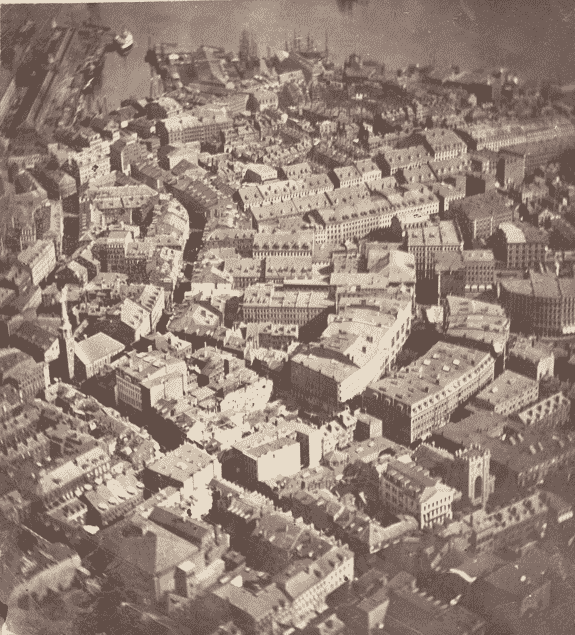

真正鸟瞰世界的价值是显而易见的。早在 1920 年，关于航拍判读的书籍就开始出现。

当美国在二战后与苏联进入冷战时，随着美国 U-2 侦察机的发明，监控军事能力的航空摄影变得多产。U-2 侦察机可以在 75，000 英尺的高度飞行，这使它超出了现有防空武器的设计范围，只能达到 50，000 英尺。当苏联最终击落一架 U-2 并俘获飞行员时，美国在俄罗斯上空的 U-2 飞行结束了。

然而，航空摄影对现代地理空间分析几乎没有影响。飞机只能捕捉一个区域的小脚印。照片被钉在墙上或放在光桌上检查，但不是在其他信息的背景下。尽管非常有用，航拍照片解释只是另一种视觉视角。

游戏规则的改变发生在 1957 年 10 月 4 日，当时苏联发射了人造卫星 1 号。由于制造上的困难，苏联已经废弃了一个更加复杂和精密的卫星原型。一旦被纠正，这个原型后来成为人造卫星 3 号。相反，他们选择了一个简单的金属球体，带有四根天线和一个简单的无线电发射器。包括美国在内的其他国家也在研究卫星。这些卫星计划并不完全是秘密。作为国际地球物理年的一部分，他们受到科学动机的驱使(T2 IGY T3)。

火箭技术的进步使人造卫星成为地球科学的自然进化。然而，几乎在每一个案例中，每个国家的国防机构都参与其中。与苏联类似，其他国家也在与装满科学仪器的复杂卫星设计作斗争。苏联人决定改用最简单的设备，唯一的原因是在美国人有效之前发射了一颗卫星。当人造卫星经过时，天空中可以看到它，业余无线电操作员可以听到它的无线电脉冲。尽管人造卫星很简单，但它提供了宝贵的科学信息，这些信息可以从它的轨道力学和射频物理中获得。

人造卫星计划最大的影响是对美国太空计划的影响。美国的主要对手在太空竞赛中获得了巨大的优势。美国最终以阿波罗登月作为回应。然而，在此之前，美国启动了一项直到 1995 年仍是国家机密的计划。分类电晕计划产生了第一批来自太空的照片。美国和苏联签署了一项终止间谍飞机飞行的协议，但卫星显然没有参与谈判。

下图显示了电晕过程。虚线是卫星的飞行路线，白色的长管是卫星，白色的小圆锥体是胶片罐，黑色的斑点是控制站，它们触发了胶片的弹出，这样飞机就可以在空中捕捉到它:

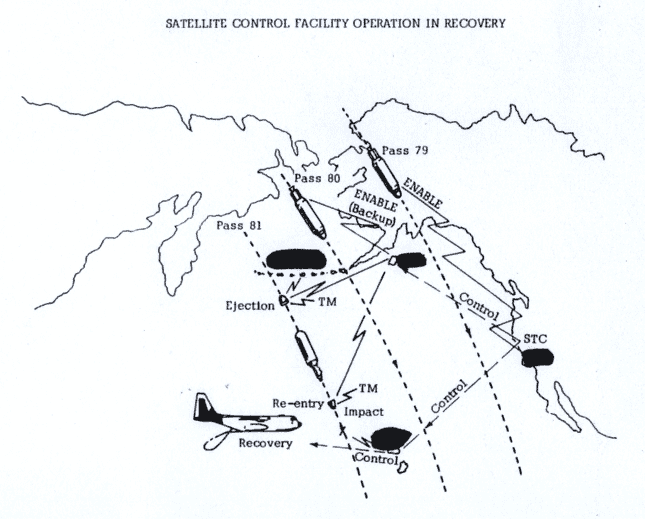

第一颗 CORONA 卫星是一项历时 4 年的努力，经历了许多挫折。然而，该计划最终成功了。即使在今天，卫星成像的困难在于从太空中获取图像。CORONA 卫星使用了黑白胶片罐，这些胶片一旦曝光就会从车辆中弹出。当一个胶片筒空降到地球上时，一架美国军用飞机会在半空中接住这个包裹。如果飞机错过了滤罐，它会在水中漂浮一小段时间，然后沉入海洋，以保护敏感信息。

美国继续开发 CORONA 卫星，直到它们与 U-2 侦察机照片的分辨率和摄影质量相匹配。CORONA 仪器的主要缺点是可重用性和及时性。一旦脱离胶片，卫星就不能再使用了。此外，电影的恢复是在一个固定的时间表，使该系统不适合监测实时情况。然而，CORONA 计划的全面成功为下一波卫星铺平了道路，从而开启了现代遥感时代。

由于 CORONA 计划的秘密地位，它对遥感的影响是间接的。美国载人航天任务中拍摄的地球照片激发了民用遥感卫星的想法。这种卫星的好处是显而易见的，但这个想法仍然有争议。政府官员质疑卫星是否像航空摄影一样划算。军方担心这颗公共卫星会危及科罗纳计划的保密性。其他官员担心未经许可对其他国家进行成像的政治后果。然而，内政部最终获得了美国宇航局制造一颗卫星来监测地球表面资源的许可。

1972 年 7 月 23 日，美国宇航局发射了**地球资源技术卫星** ( **ERTS** )。ERTS 号很快被重新命名为**陆地卫星 1 号**。该平台包含两个传感器。第一个是**返回光束摄像机** ( **RBV** )传感器，本质上是一个摄像机。它是由被称为美国无线电公司的广播电视巨头建造的。RBV 号立即出现了问题，包括关闭卫星的高度引导系统。对卫星的第二次尝试是高度实验性的**多光谱扫描仪** ( **MSS** )。MSS 表现完美，产生了比 RBV 更好的结果。MSS 捕获了从地球表面反射的四种不同波长的光的四幅独立图像。

这种传感器具有几项革命性的功能。第一个也是最重要的能力是第一次对行星进行全球成像，每 16 天扫描地球上的每个点。美国宇航局的下图展示了这种飞行和收集模式，这是传感器围绕地球运行时的一系列重叠条带，每次传感器对地球上的一个位置成像时都会捕获数据切片:

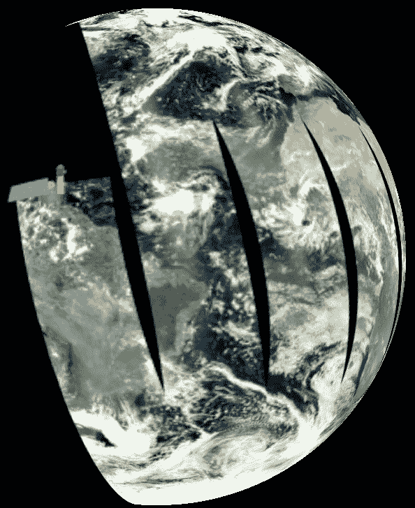

它还记录了可见光谱以外的光。虽然它确实捕获了人眼可见的绿光和红光，但它也扫描了人眼不可见的两种不同波长的近红外光。这些图像被存储并以数字方式传输到马里兰州、加利福尼亚州和阿拉斯加州的三个不同的地面站。它的多光谱能力和数字格式意味着陆地卫星提供的鸟瞰图不仅仅是另一张天空照片。它正在传送数据。计算机可以处理这些数据，输出关于地球的衍生信息，就像地理信息系统通过分析一个地理特征与另一个地理特征的关系来提供关于地球的衍生信息一样。美国国家航空航天局在全球范围内推广使用陆地卫星，并以非常实惠的价格向任何提出要求的人提供数据。

这种全球成像能力导致了许多科学突破，包括发现了以前未知的地理，这发生在 1976 年。例如，加拿大政府利用大地卫星图像找到了一个北极熊居住的未知小岛。他们给新的陆地命名为陆地卫星岛。

陆地卫星 1 号之后还有 6 个任务移交给了作为负责机构的国家海洋和大气管理局(T2)和美国国家海洋和大气管理局。由于歧管破裂，陆地卫星 6 号未能进入轨道，这使其机动发动机失效。在其中一些任务中，卫星由**地球观测卫星** ( **EOSAT** )公司管理，该公司现在被称为**空间成像**，但由 Landsat 7 任务归还给政府管理。美国国家航空航天局的以下图像是陆地卫星 7 号产品的样本:

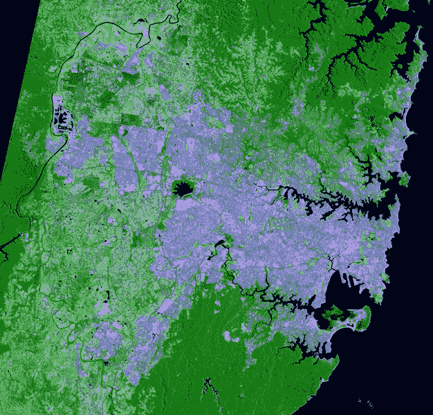

**陆地卫星数据连续性任务** ( **LDCM** )于 2013 年 2 月 13 日发射，并于 2013 年 4 月 27 日开始收集图像，作为其校准周期的一部分，成为陆地卫星 8 号。LDCM 号是美国宇航局和美国地质调查局(T4)的联合任务。

# 高程数据

遥感数据可以二维测量地球。但是我们也可以使用遥感技术，通过数字高程数据来测量地球的三维空间，这些数据包含在数字高程模型中。一个**数字高程模型** ( **数字高程模型**)是一个行星地形的三维表示。在这本书的上下文中，这个星球就是地球。数字高程模型的历史远没有遥感影像复杂，但意义同样重大。在计算机出现之前，高程数据的表示仅限于通过传统的土地测量创建的地形图。这项技术的存在是为了从立体图像中创建三维模型，或者从粘土或木材等材料中创建物理模型，但这些方法并没有广泛用于地理。

数字高程模型的概念产生于 1986 年，当时法国航天局国家空间研究中心(T1)(**【CNES】**)或**国家空间研究中心(T5)发射了其 SPOT-1 卫星，其中包括一个立体雷达。该系统创建了第一个可用的数字高程模型。其他几颗美国和欧洲卫星也以类似的任务遵循这一模式。**

2000 年 2 月，奋进号航天飞机执行了“T0”号航天飞机雷达地形任务“T1”(“T2”号“SRTM”号“T3”)，该任务使用允许一次通过的特殊雷达天线配置收集了地球表面 80%以上的高程数据。这个模型在 2009 年被美国和日本的联合任务超越，该任务使用了美国宇航局 Terra 卫星上的**高级星载热发射和反射辐射计** ( **ASTER** )传感器。该系统捕获了地球表面的 99%，但已被证明存在小的数据问题。由于航天飞机的轨道没有越过地球的两极，它没有捕获整个表面。SRTM 仍然是金本位制。下图来自美国地质勘探局([https://www . USGS . gov/media/img/national-elevation-dataset](https://www.usgs.gov/media/img/national-elevation-dataset))显示了一个被称为山体阴影的彩色 DEM。绿色区域是低海拔地区，而黄色和棕色区域是中高海拔地区:

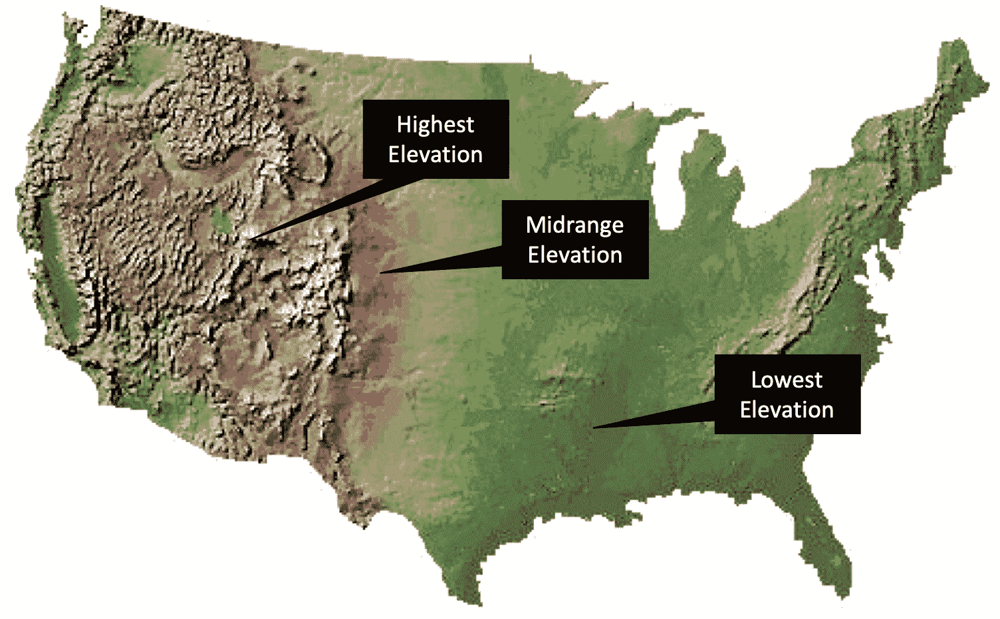

最近，德国分别于 2007 年和 2010 年发射的 TerraSAR-X 和 TanDen-X 卫星正在进行更雄心勃勃的全球高程数据集尝试。这两颗雷达高程卫星合作生成了一个名为世界数字高程模型的全球数字高程模型，该模型于 2014 年 4 月 15 日发布。该数据集的相对精度为 2 米，绝对精度为 4 米。

# 计算机辅助制图

**计算机辅助制图** ( **CAD** )值得一提，虽然与地理空间分析没有直接关系。计算机辅助设计系统的发展历史与地理空间分析的历史平行并交织在一起。计算机辅助设计是一种工程工具，用于建模二维和三维对象，通常用于工程和制造。地理空间模型和计算机辅助设计模型之间的主要区别在于地理空间模型是以地球为参考的，而计算机辅助设计模型可能存在于抽象空间中。

例如，计算机辅助设计系统中建筑物的三维蓝图没有纬度或经度，但在地理信息系统中，同一建筑物模型在地球上有一个位置。然而，多年来，计算机辅助设计系统具有地理信息系统的许多特点，通常用于较小的地理信息系统项目。同样，许多地理信息系统程序可以导入已经过地理参考的计算机辅助设计数据。传统上，计算机辅助设计工具主要用于设计非地理空间的数据。

然而，参与地理空间工程项目(如设计城市公用电力系统)的工程师会使用他们熟悉的计算机辅助设计工具来创建地图。随着时间的推移，地理信息系统软件不断发展，以导入工程师生成的面向地理空间的计算机辅助设计数据，计算机辅助设计工具也不断发展，以支持地理空间数据创建和与地理信息系统软件更好的兼容性。Autodesk 的 AutoCAD 和 Esri 的 ArcGIS 是开发此功能的领先商业软件包，OGR 库开发人员的**地理空间数据抽象库** ( **GDAL** )也增加了 CAD 支持。

# 地理空间分析和计算机编程

现代地理空间分析可以通过点击任何易于使用的商业或开源地理空间包中的按钮来进行。那么，为什么要用编程语言来学习这个领域呢？最重要的原因如下:

*   您希望完全控制底层算法、数据和执行
*   您希望从大型多用途地理空间框架中以最小的开销自动化特定的重复分析任务
*   你想创建一个易于共享的程序
*   你想学习地理空间分析，而不是在软件中按按钮

地理空间行业正在逐渐远离传统工作流程，在传统工作流程中，分析师团队使用昂贵的桌面软件来生产地理空间产品。地理空间分析正被推向位于云中的自动化流程。最终用户软件正在向特定任务工具发展，其中许多工具可以从移动设备访问。地理空间概念和数据的知识，以及构建自定义地理空间流程的能力，是地理空间工作在不久的将来的所在。

# 面向对象的地理空间分析编程

面向对象编程是一种软件开发范式，其中概念被建模为对象，对象的属性和行为分别表示为属性和方法。这个范例的目标是更加模块化的软件，其中一个对象可以从一个或多个其他对象继承，以鼓励软件重用。

Python 编程语言以其作为一种设计良好的面向对象语言、过程脚本语言，甚至是一种函数式编程语言来服务多个角色的能力而闻名。但是，您永远不会完全放弃 Python 中的面向对象编程，因为即使它的本机数据类型也是对象，所有 Python 库(称为模块)都遵循基本的对象结构和行为。

地理空间分析是面向对象编程的完美活动。在大多数面向对象的编程项目中，对象是抽象的概念，例如没有真实世界类比的数据库连接。然而，在地理空间分析中，建模的概念是真实世界的对象！地理空间分析的领域是地球和地球上的一切。树、建筑物、河流和人都是地理空间系统中对象的示例。

对于刚接触面向对象编程的人来说，文献中一个常见的例子是猫的具体类比。面向对象编程的书籍经常使用以下示例的某种形式。

想象你正在看一只猫。我们知道一些关于猫的信息，比如它的名字、年龄、颜色和大小。这些特征是猫的特性。猫还表现出进食、睡觉、跳跃和咕噜咕噜的行为。在面向对象编程中，对象也有属性和行为。您可以对现实世界的对象进行建模，例如我们示例中的猫，或者更抽象的对象，例如银行账户。

面向对象编程中的大多数概念远比简单的 cat 范例甚至银行账户更抽象。然而，在地理空间分析中，建模的对象仍然是具体的，例如简单的猫类比，并且在许多情况下是猫。地理空间分析允许你继续简单的猫类比，甚至可视化它。以下地图使用《澳大利亚生活地图集》 ( **ALA** )提供的数据表示澳大利亚的野猫种群:

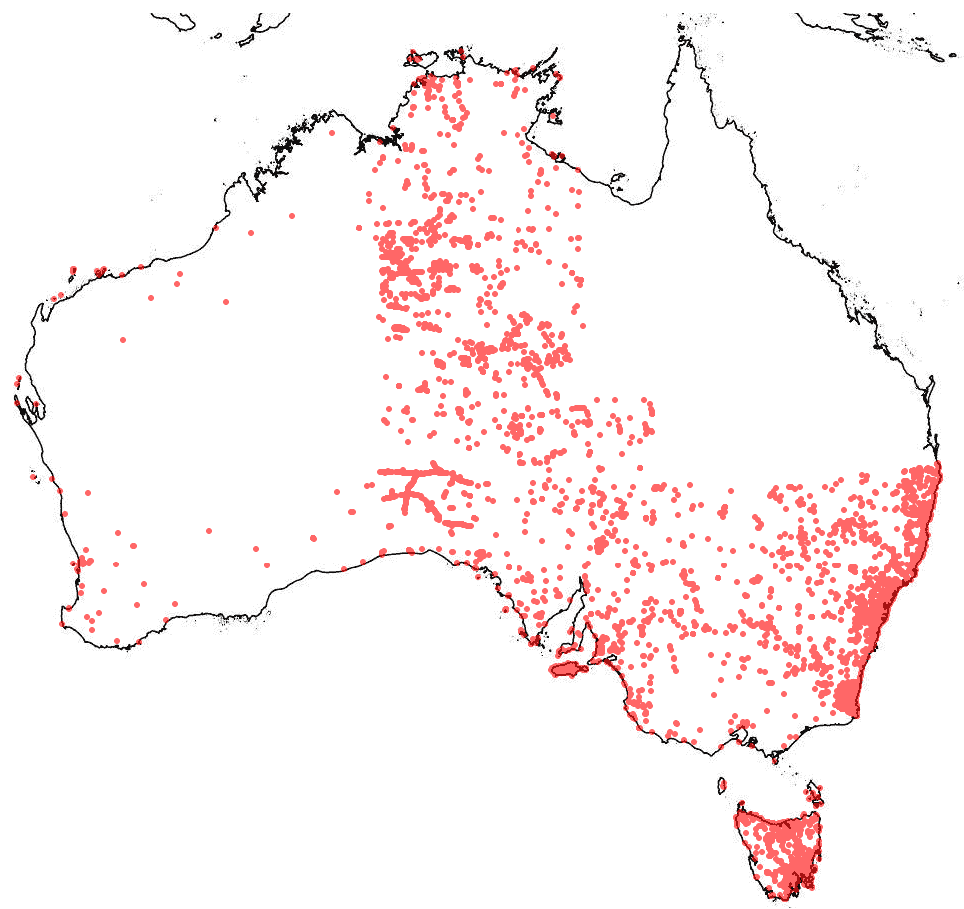

所以，我们可以用计算机来分析地球上各种特征之间的关系，但是为什么我们要这样做呢？在下一节中，我们将了解为什么地理空间分析是一项值得努力的工作。

# 地理空间分析的重要性

地理空间分析帮助人们做出更好的决策。它不会为你做出决定，但它可以回答关键问题，这些问题是要做出的选择的核心，通常无法用任何其他方式来回答。直到最近，地理空间技术和数据还是只有政府和资金充足的研究人员才能使用的工具。然而，在过去的十年里，数据变得更加广泛可用，软件变得更容易被任何人访问。

除了免费提供政府卫星图像外，许多地方政府现在还进行航空照片调查，并在网上提供数据。无处不在的谷歌地球提供了一个跨平台的旋转地球视图，包括卫星和航空数据、街道、兴趣点、照片等等。谷歌地球用户可以创建自定义**锁眼标记语言** ( **KML** )文件，这些文件是用于将数据加载到地球仪并为其设置样式的 XML 文件。这个程序和类似的工具通常被称为地理探索工具，因为它们是优秀的数据查看器，但提供的数据分析能力非常有限。

雄心勃勃的开放街道地图项目([https://www.openstreetmap.org/#map=5/51.500/-0.100](https://www.openstreetmap.org/#map=5/51.500/-0.100))是一个众包的全球地理底图，包含地理信息系统中常见的大多数图层。现在几乎每部手机都包含一个全球定位系统，以及以点、线或多边形形式收集全球定位系统轨迹的移动应用程序。大多数手机还会用全球定位系统坐标标记手机摄像头拍摄的照片。简而言之，任何人都可以成为地理空间分析师。

全球人口已达 70 亿。世界正在以前所未有的速度变化。地球正在经历有史以来从未见过的环境变化。更快的通信和交通增加了我们和我们生活的环境之间的互动。安全负责地管理人员和资源比以往任何时候都更具挑战性。地理空间分析是更有效、更深入地了解我们世界的最佳方法。利用地理空间分析力量的政治家、活动家、救援人员、家长、教师、急救人员、医疗专业人员和小企业越多，我们就越有潜力建设一个更美好、更健康、更安全、更公平的世界。

# 地理信息系统概念

为了开始地理空间分析，我们需要了解该领域特有的一些关键基础概念。这个列表并不长，但是几乎分析的每个方面都可以追溯到其中的一个想法。

# 专题地图

顾名思义，主题地图描绘的是一个特定的主题。通用参考地图直观地表示地理上与导航或规划相关的要素。主题地图超越了位置，为围绕中心思想的信息提供地理背景。通常，主题地图是为目标受众设计的，用于回答特定问题。专题地图的价值在于它们没有展示什么。主题地图将使用最少的地理特征，以避免分散读者对主题的注意力。大多数专题地图包括政治边界，如国家或邦的边界，但忽略了导航特征，如街道名称或主要地标之外的兴趣点，以引导读者。

约翰·斯诺博士在本章早些时候绘制的霍乱地图是专题地图的一个完美例子。专题地图的常见用途是可视化健康问题，如疾病、选举结果和环境现象，如降雨。这些地图也是地理空间分析最常见的输出。美国人口普查局的以下地图显示了各州的癌症死亡率:


主题地图讲述一个故事，非常有用。然而，重要的是要记住，虽然专题地图和任何其他地图一样是现实的模型，但它们也是信息的概括。两个不同的分析师使用相同的信息来源，往往会得出非常不同的专题地图，这取决于他们如何分析和总结数据。他们也可以选择关注数据集的不同方面。专题地图的技术性往往导致人们把它们当作科学证据。然而，地理空间分析通常是不确定的。虽然分析可能基于科学数据，但分析师并不总是遵循科学方法的严谨性。

芝加哥大学出版社的马克·蒙莫尼耶(Mark Monmonier)在他的经典著作《如何用地图说谎》中，详细展示了地图是如何容易被操纵的现实模型，而这种模型经常被滥用。这个事实并没有降低这些工具的价值。传奇统计学家乔治·博克斯在他 1987 年的著作《T2》中写道:经验模型的建立和响应面:

"Essentially, all models are wrong, but some are useful."

专题地图已经被用作开始(和结束)战争、阻止致命疾病、赢得选举、养活国家、消除贫困、保护濒危物种和营救受灾者的指南。专题地图可能是有史以来最有用的模型。

在最纯粹的形式中，数据库只是一个有组织的信息集合。一个**数据库管理系统** ( **数据库管理系统**)是一套可以与数据库交互的交互软件。人们经常使用数据库这个词来指代数据库管理系统和底层数据结构。数据库通常包含字母数字数据，在某些情况下，还包含二进制大对象或斑点，它们可以存储图像等二进制数据。大多数数据库还允许关系数据库结构，其中规范化表中的条目可以相互引用，以便在数据之间创建多对一和一对多的关系。

空间数据库，也称为地理数据库，使用专门的软件来扩展传统的**关系数据库管理系统** ( **关系数据库管理系统**)来存储和查询二维或三维空间中定义的数据。有些系统还会随着时间的推移解释一系列数据。在空间数据库中，地理要素的属性作为传统的关系数据库结构进行存储和查询。这些空间扩展允许您使用**结构化查询语言** ( **SQL** )以类似于传统数据库查询的方式查询几何图形。空间查询和属性查询也可以结合起来，根据位置和属性选择结果。

# 空间索引

空间索引是一个组织地理空间矢量数据以便更快检索的过程。这是一种为常见查询或呈现预过滤数据的方法。索引通常用于大型数据库，以加快查询的返回速度。空间数据也不例外。即使是中等大小的地理数据库也可能包含数百万个点或对象。如果执行空间查询，系统必须考虑数据库中的每个点，以便在结果中包括或消除它。空间索引对数据进行分组的方式是，在对剩余项进行详细且较慢的分析之前，通过执行计算上更简单的检查，将大部分数据集排除在考虑范围之外。

# [计]元数据

元数据被定义为关于数据的数据。因此，地理空间元数据是关于地理空间数据集的数据，为数据集的来源和历史提供可追溯性，以及技术细节的摘要。元数据还通过记录资产随时间的变化来长期保存数据。

地理空间元数据可以用几种可能的标准来表示。最突出的标准之一是国际标准 **ISO 19115-1** ，它包括数百个潜在字段来描述单个地理空间数据集。此外， **ISO 19115-2** 标准包括地理空间图像和网格数据的扩展。一些示例字段包括空间表示、时间范围和谱系。ISO 19115-3 是描述从国际标准化组织地理元数据生成 XML 模式的过程的标准。Dublin Core 是为数字数据开发的另一个国际标准，该标准已经扩展到地理空间数据，以及用于从单一来源构建数据目录的相关 DCAT 词汇。

元数据的主要用途是对数据集进行编目。现代元数据可以被地理搜索引擎所吸收，使其有可能被其他系统自动发现。如果您有疑问，它还会列出数据集的联系点。元数据是地理空间分析师的一个重要支持工具，它增加了工作的可信度和可访问性。**开放地理空间联盟** ( **OGC** )创建了**C**T7(**CSW**)用于管理元数据。`pycsw` Python 库实现了 CSW 标准。

Metadata is an important documentation tool that's used to manage geospatial data, while `pycsw` is an OGC-compliant CSW implementation. You can learn more about `pycsw` at [https://pycsw.org](http://pycsw.org).

# 地图投影

地图投影有整本书专门介绍它们，对新的分析师来说可能是一个挑战。如果您将任何 3D 对象放在平面上展平，例如屏幕或一张纸，该对象会变形。许多小学地理课通过让学生剥一个橘子，然后试图把橘子皮平放在他们的桌子上，以理解由此产生的扭曲来展示这一概念。当你把地球的圆形投影到电脑屏幕上时，也会出现同样的效果。

在地理空间分析中，您可以操纵此变形以保留常见属性，如面积、比例、方位角、距离或形状。地图投影没有放之四海而皆准的解决方案。投影的选择总是一种折衷，即在一个维度上获得精度，以换取另一个维度上的误差。投影通常被表示为一组超过 40 个参数，或者是 XML，或者是一种称为**的文本格式，即众所周知的文本**(**【WKT】**)，用于定义变换算法。

国际石油和天然气生产商协会(**【IOGP】**)保存着一份最知名预测的登记册。该组织的前身是**欧洲石油测量集团** ( **EPSG** )。注册表中的条目仍然被称为 EPSG 代码。EPSG 维持该登记册，将其作为石油和天然气行业的共同利益，该行业是能源勘探地理空间分析的多产用户。根据最近的统计，该注册表包含超过 5，000 个条目。

就在 10 年前，地图投影还是地理空间分析师最关心的问题。数据存储很贵，高速互联网很少，云计算也不存在。地理空间数据通常在不同兴趣领域的小组之间交换。当时的技术限制意味着地理空间分析高度本地化。分析师会对他们感兴趣的领域使用最佳预测。

不同投影中的数据不能显示在同一张地图上，因为它们代表了地球的两种不同模型。每当分析师收到来自第三方的数据时，必须对其进行重新预测，然后他们才能将其与现有数据一起使用。这个过程既繁琐又耗时。

大多数地理空间数据格式不提供存储投影信息的方法。这些信息存储在一个辅助文件中，通常是文本或 XML。由于分析师不经常交换数据，许多人不会费心定义预测信息。每个分析师的噩梦都是遇到一个极其有价值的数据集，它缺少投影信息。它使数据集变得无用。文件中的坐标只是数字，并没有提供任何关于投影的线索。有 5000 多个选择，几乎不可能猜测。

现在，由于现代软件和互联网使数据交换变得更容易和更普遍，几乎每种数据格式都添加了元数据格式，该格式定义了投影或将其放在文件头中(如果支持的话)。技术的进步也使得全球基础地图成为可能，这使得投影有了更常见的用途，比如谷歌地图中常见的谷歌墨卡托投影。该投影也称为网络墨卡托，使用代码 EPSG:3857(或不推荐使用的 EPSG:900913)。

地理空间门户项目，如开放街道地图([)https://www.openstreetmap.org/#map=5/51.500/-0.100](https://www.openstreetmap.org/#map=5/51.500/-0.100))和 NationalAtlas.gov，已经整合了世界大部分地区的公共预测数据集。现代地理空间软件还可以动态地重新投影数据，为分析师省去了在使用数据之前对其进行预处理的麻烦。大地基准与地图投影密切相关。一个**数据**是一个地球表面的模型，用于将地球上的特征位置与一个坐标系匹配。一个常见的数据被称为 WGS 84，由全球定位系统使用。

# 翻译

地理空间分析令人兴奋的部分是可视化。由于地理空间分析是一个基于计算机的过程，所以了解地理数据如何出现在计算机屏幕上是很好的。

包括点、线和多边形的地理数据以数字形式存储为一个或多个点，这些点以( *x，y* )对或( *x，y，z* )元组的形式出现。 *x* 代表图形上的横轴，而 *y* 代表纵轴。 *z* 代表地形高程。在计算机图形学中，计算机屏幕由 *x* 和 *y* 轴表示。不使用 *z* 轴，因为大多数图形软件 API 都将计算机屏幕视为二维平面。然而，由于桌面计算能力不断提高，三维地图开始变得更加普遍。

另一个重要因素是屏幕坐标与世界坐标的对比。地理数据存储在一个坐标系中，该坐标系表示覆盖在地球上的三维圆形网格。屏幕坐标，也称为像素坐标，表示平面二维计算机屏幕上的像素网格。将 *x* 和 *y* 世界坐标映射到像素坐标相当简单，并且涉及简单的缩放算法。然而，如果存在 *z* 坐标，则必须执行更复杂的变换来将坐标从三维空间映射到二维平面。如果处理不当，这些转换的计算成本会很高，因此速度会很慢。

就遥感数据而言，挑战通常在于文件大小。即使是一个中等大小的卫星图像，如果不是数百兆字节，也可能是几十兆字节。可以使用两种方法压缩图像:

*   **无损方法**:它们使用技巧来减少文件大小，而不丢弃任何数据
*   **有损压缩算法**:它们通过减少图像中的数据量来减少文件大小，同时避免图像外观的显著变化

在屏幕上渲染图像可能是计算密集型的。大多数遥感文件格式允许存储图像的多个低分辨率版本，称为**概视图**或**金字塔**，其唯一目的是在不同比例下更快地渲染。当从图像缩小到可以看到全分辨率图像细节的比例时，预处理后的低分辨率图像会快速无缝地显示出来。

# 遥感概念

我们描述的大多数地理信息系统概念也适用于栅格数据。然而，栅格数据也有一些独特的属性。在本章的前面，当我们回顾遥感的历史时，重点是从空中平台对地球成像。需要注意的是，栅格数据可以有多种形式，包括地基雷达、激光测距仪以及在地理环境中探测气体、辐射和其他形式能量的其他专用设备。

为了这本书的目的，我们将重点关注捕获大量地球数据的遥感平台。这些来源包括地球成像系统、某些类型的高程数据和一些天气系统(如适用)。

# 图像作为数据

栅格数据以数字方式捕获为方形切片。这意味着数据以行和列的数字数组的形式存储在计算机上。如果数据是多光谱的，数据集通常会包含多个相同大小的阵列，这些阵列在地理空间上相互参照，代表地球上的一个区域。这些不同的阵列被称为**带**。任何数字阵列都可以在计算机上表示为图像。事实上，所有的计算机数据最终都是数字。在地理空间分析中，将图像视为数字阵列非常重要，因为使用数学公式来处理它们。

在遥感图像中，每个像素既代表空间(地球上某个特定大小的位置)，也代表从地球上该位置反射到空间的反射率。因此，每个像素都有一个基本尺寸，并包含一个代表强度的数字。由于每个像素都是一个数字，我们可以对这些数据执行数学等式，以组合来自不同波段的数据，并突出显示图像中特定类别的对象。如果波长值超出可见光谱，我们可以突出人眼不可见的特征。植物中的叶绿素等物质可以通过一个叫做**归一化差异植被指数** ( **NDVI** )的特定公式进行对比。

通过处理遥感图像，我们可以将这些数据转化为视觉信息。利用 NDVI 公式，我们可以回答这个问题，*这个图像中的植物* *的相对健康程度是多少？*你还可以创建新类型的数字信息，这些信息可以作为计算机程序输出其他类型信息的输入。

# 遥感和颜色

计算机屏幕将图像显示为**红、绿、蓝** ( **RGB** )的组合，以匹配人眼的能力。卫星和其他遥感成像设备可以捕获超过这个可见光谱的光。在计算机上，可见光谱以外的波长被表示在可见光谱中，这样我们就可以看到它们。这些图像被称为**假彩色**图像。例如，在遥感中，红外光使水分高度可见。

这种现象有多种用途，例如在洪水期间监测地面饱和度或发现屋顶或堤坝中隐藏的漏洞。

# 通用矢量地理信息系统概念

在本节中，我们将讨论地理空间分析中常用的不同类型的地理信息系统过程。这份清单并非详尽无遗；但是，它为您提供了所有其他操作所基于的基本操作。如果你理解这些操作，你会很快理解更复杂的过程，因为它们要么是这些过程的衍生物，要么是它们的组合。

# 数据结构

地理信息系统矢量数据使用至少由一个 *x* 水平值和一个 *y* 垂直值组成的坐标来表示地球上的一个位置。在许多情况下，一个点也可能包含一个 *z* 值。其他辅助值也是可能的，包括测量值或时间戳。

这些坐标用于形成点、线和多边形，以对现实世界的对象进行建模。点本身可以是几何特征，也可以连接线段。由线段创建的闭合区域被视为多边形。多边形对建筑物、地形或政治边界等对象进行建模。

地理信息系统要素可以由单个点、线或面组成，也可以由多个形状组成。例如，在包含世界国家边界的地理信息系统多边形数据集中，由 7，107 个岛屿组成的菲律宾将被表示为由数千个多边形组成的单一国家。

矢量数据通常比栅格数据更能代表地形特征。矢量数据具有更高的精度潜力，并且更加精确。然而，大规模收集矢量数据在传统上也比栅格数据成本更高。

另外两个与向量数据结构相关的重要术语是包围盒和凸包。边界框或最小边界框是包含数据集中所有点的最小可能正方形。下图演示了点集合的边界框:


数据集的凸包类似于边界框，但它不是正方形，而是可能包含数据集的最小多边形。下图显示了与上一示例相同的点数据，凸包多边形显示为红色:

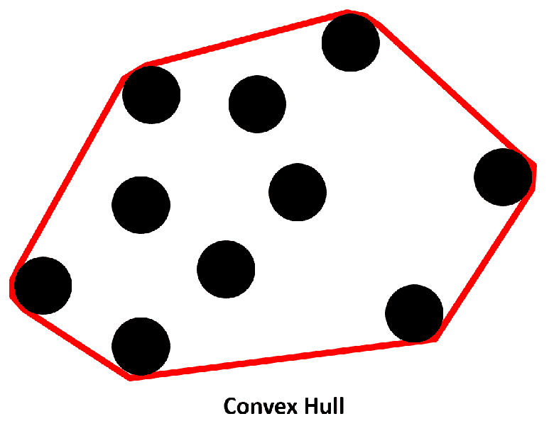

如您所见，数据集的边界框总是包含凸包。

# 关于多边形的地理空间规则

在地理空间分析中，关于多边形有几种不同于多边形数学描述的一般经验法则:

*   多边形必须至少有四个点，第一个点和最后一个点必须相同
*   多边形边界不应重叠
*   图层中的多边形不应该重叠
*   另一个多边形内的图层中的多边形被视为基础多边形中的一个洞

不同的地理空间软件包和库以不同的方式处理这些规则的异常，这可能会导致混乱的错误或软件行为。最安全的路线是确保你的多边形遵守这些规则。还有一条关于多边形的重要信息我们需要谈谈。

根据定义，多边形是封闭的形状，这意味着多边形的第一个和最后一个顶点是相同的。如果您没有将第一个点显式复制为面数据集中的最后一个点，某些地理空间软件会抛出错误。其他软件会自动关闭多边形而不会抱怨。用于存储地理空间数据的数据格式也可能决定多边形的定义方式。这个问题是一个灰色区域，所以它没有制定多边形规则，但是知道这个怪癖会在某一天当你遇到一个你无法轻易解释的错误时派上用场。

# 缓冲器

缓冲操作可以应用于空间对象，包括点、线或多边形。该操作在对象周围指定距离处创建一个多边形。缓冲操作用于邻近分析:例如，在危险区域周围建立安全区。让我们回顾一下这个图表:

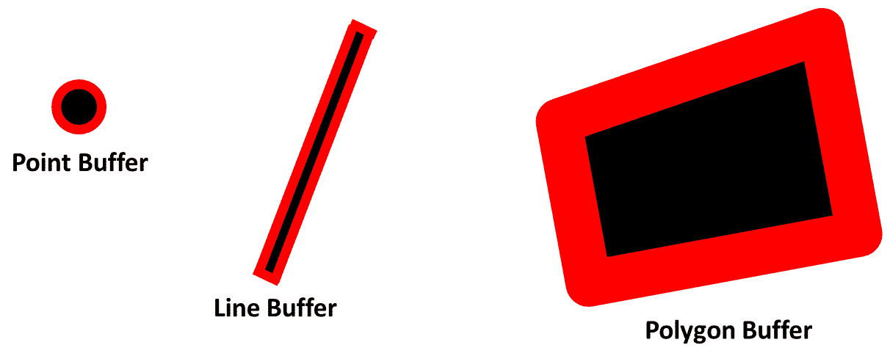

黑色形状表示原始几何图形，而红色轮廓表示从原始形状生成的较大缓冲多边形。

# 溶解

融合操作从相邻多边形中创建一个多边形。溶解还用于简化从遥感提取的数据，如下所示:


解散操作的一个常见用途是合并单一所有者购买的税务数据库中的两个相邻属性。

# 推广

具有超过地理空间模型所需的点的对象可以被一般化，以减少用于表示形状的点的数量。这种操作通常需要几次尝试才能在不影响整体形状的情况下获得最佳点数。这是一种数据优化技术，用于简化数据以提高计算效率或更好的可视化。这项技术在 web 地图应用程序中非常有用。

以下是多边形泛化的一个示例:

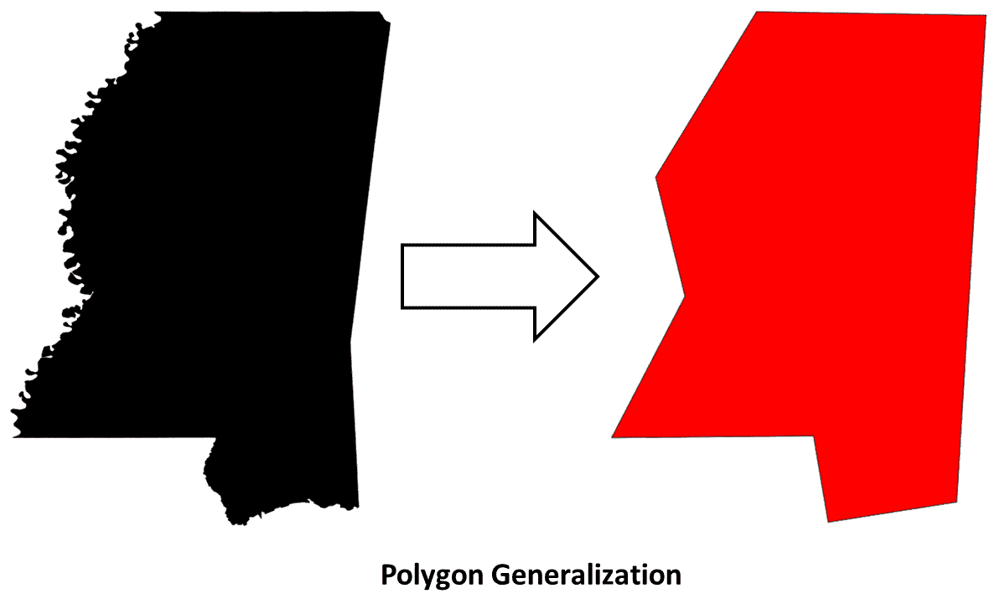

由于计算机屏幕的分辨率为每英寸 72 点(dpi)，因此可以减少不可见的高度详细的点数据，以便使用更少的带宽向用户发送视觉上等效的地图。

# 交集

相交操作用于查看要素的一部分是否与一个或多个要素相交。此操作用于邻近分析中的空间查询，通常是缓冲分析的后续操作:

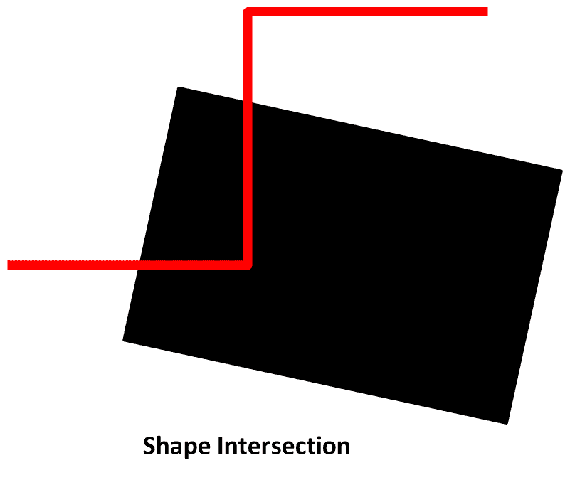

合并操作将两个或多个不重叠的形状合并到一个多形状对象中。多形状对象是保持独立几何的形状，但被 GIS 视为具有一组属性的单个要素:

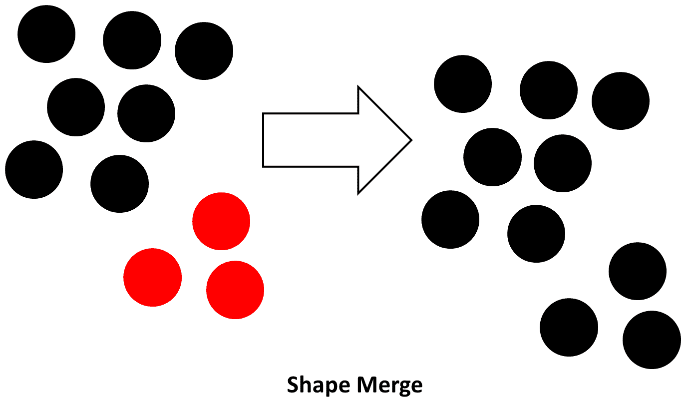

基本的地理空间操作是检查点是否在多边形内。这一个操作是许多不同类型空间查询的原子构建块。如果该点在多边形的边界上，则认为它在内部。很少有空间查询不以某种方式依赖这种计算。然而，在大量点上它可能非常慢。

检测一个点是否在多边形内的最常见和最有效的算法叫做**光线投射算法**。首先，执行测试以查看该点是否在多边形边界上。接下来，该算法从所讨论的点沿一个方向画一条线。程序计算直线穿过多边形边界的次数，直到它到达多边形的边界框，如下所示:

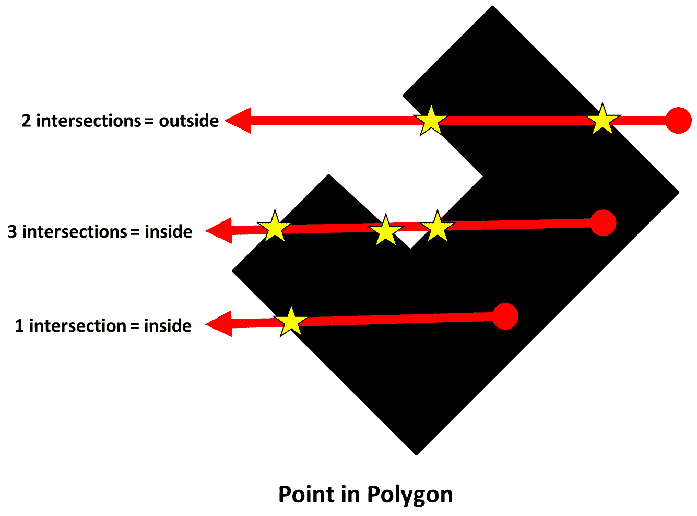

边界框是可以围绕整个多边形绘制的最小框。如果数字是奇数，那么点在里面。如果边界交点的数量为偶数，则该点位于外部。

# 联盟

联合操作不太常见，但当您希望将两个或多个重叠的多边形组合成一个形状时，它非常有用。它类似于溶解，但在这种情况下，多边形是重叠的，而不是相邻的:

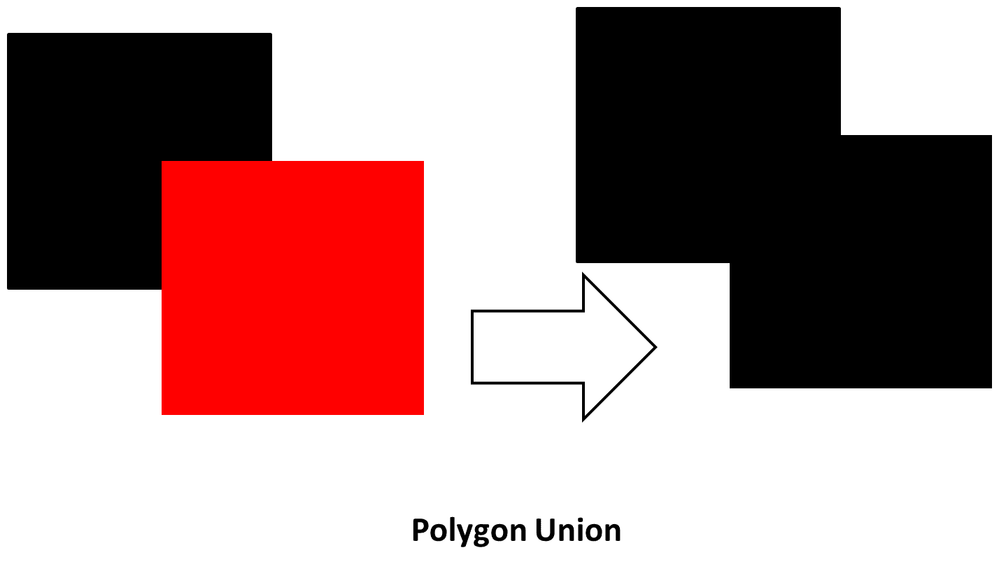

通常，此操作用于清理遥感操作自动生成的要素数据集。

# 加入

联接或 SQL 联接是一种数据库操作，用于组合两个或多个信息表。关系数据库旨在避免为一对多关系存储冗余信息。例如，美国的一个州可能包含许多城市。不是为每个州创建一个包含所有城市的表，而是创建一个带有数字标识的州表，而为每个州的所有城市创建一个带有州数字标识的表。

在地理信息系统中，还可以有空间连接，它们是数据库空间扩展软件的一部分。在空间连接中，您可以像在 SQL 连接中一样组合属性。然而，这种关系是基于两个特征的空间邻近性。

为了遵循前面的城市示例，我们可以使用空间连接添加每个城市所在的县名。城市图层可以加载到属性包含县名称的县多边形图层上。空间连接将确定哪个城市位于哪个县，并执行 SQL 连接，将县名称添加到每个城市的属性行中。

# 常见的栅格数据概念

正如我们前面提到的，遥感栅格数据是一个数字矩阵。遥感包含数千种可以对数据执行的操作。随着新卫星进入太空和计算机能力的提高，这个领域几乎每天都在变化。

尽管它有十年的历史，我们甚至没有触及这个领域能为人类提供的知识的表面。同样，与普通的地理信息系统过程类似，这个最小的操作列表允许您评估遥感中使用的任何技术。

# 乐队数学

波段数学是多维数组数学。在数组数学中，数组被视为单个单位，它们被相加、相减、相乘和相除。然而，在一个数组中，跨多个数组的每一行和每一列中的相应数字是同时计算的。这些数组被称为矩阵，涉及矩阵的计算是线性代数的重点。

# 变化检测

变化检测是在不同时间拍摄同一位置的两幅图像并突出显示这些变化的过程。变化可能是由于地面上增加了一些东西，如一座新建筑，或者是失去了一个特征，如海岸侵蚀。有许多算法可以检测图像之间的变化，还可以确定定性因素，例如变化发生在多长时间之前。

下图来自美国橡树岭国家实验室的一个研究项目，显示了 1984 年至 2000 年间巴西朗多尼亚州的雨林砍伐情况:

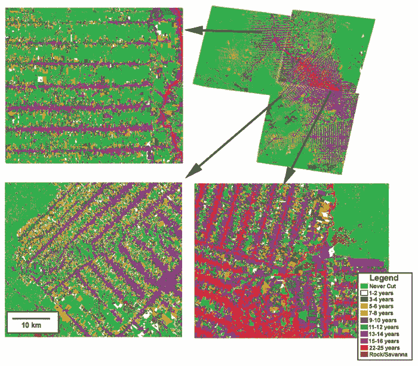

颜色用来显示森林最近被砍伐的程度。绿色代表原始雨林，白色代表日期范围结束后两年内砍伐的森林，红色代表 22 年内砍伐的森林，其他颜色介于两者之间，如传说中所述。

# 柱状图

直方图是数据集中值的统计分布。横轴表示数据集中的唯一值，纵轴表示栅格中该唯一值的频率。美国国家航空航天局的以下示例显示了卫星图像的直方图，该直方图被分为不同的类别，代表了下面的表面特征:

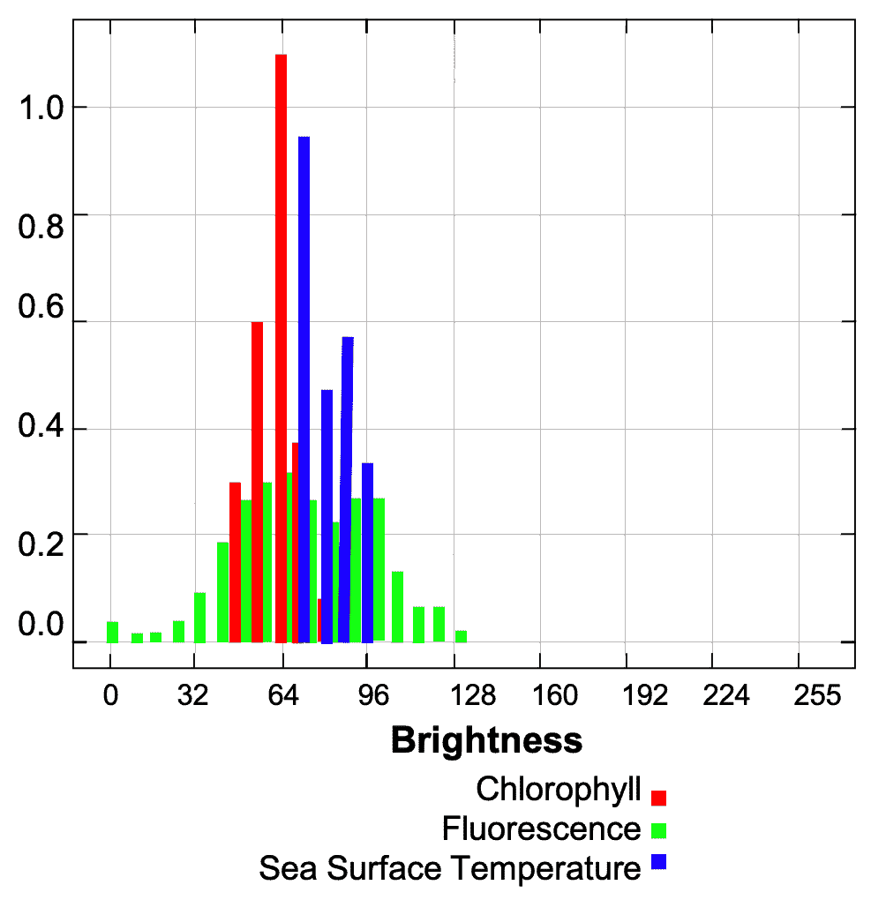

直方图是大多数栅格处理中的关键操作。它可以用于从增强图像对比度到作为对象分类和图像比较的基础的一切。

# 特征抽出

特征提取是将图像中的特征手动或自动数字化为点、线或多边形。该过程是将栅格转换为矢量数据集的图像矢量化的基础。特征提取的一个例子是从卫星图像中提取海岸线，并将其保存为矢量数据集。

如果这项提取工作持续几年，你可以监测海岸线的侵蚀或其他变化。

# 监督和非监督分类

地球上的物体反射不同波长的光，这取决于它们由什么材料制成。在遥感中，分析人员收集特定类型土地覆盖物(例如混凝土)的波长特征，并为特定区域建立一个图书馆。然后，计算机可以使用该库在同一区域的新图像中自动定位库中的类。

在无监督分类中，计算机对图像中具有相似反射率值的像素进行分组，除了图像的直方图之外，没有任何其他参考信息。

# 创建尽可能简单的 Python 地理信息系统

现在我们对地理空间分析有了更好的理解，下一步就是使用 Python 构建一个简单的被称为`SimpleGIS`的 GIS。这个小程序将是一个技术上完整的地理信息系统，具有地理数据模型，并能够将数据呈现为显示不同城市人口的可视化专题地图。

数据模型也将被结构化，以便您可以执行基本的查询。我们的`SimpleGIS`将包含科罗拉多州，三个城市，以及每个城市的人口数量。

最重要的是，我们将通过用纯 Python 构建这个小系统来展示 Python 编程的强大和简单。我们将只使用标准 Python 发行版中可用的模块，而不下载任何第三方库。

# Python 入门

正如我们前面所说的，这本书假设您对 Python 有一些基本的了解。以下示例中唯一使用的模块是`turtle`模块，它基于 Python 中包含的 Tkinter 库提供了一个非常简单的图形引擎。如果您使用的是 Windows 或 macOS 的安装程序，那么应该已经包含了 Tkinter 库。如果您自己编译了 Python 或者正在使用 Python.org([https://www.python.org](https://www.python.org))以外的发行版，那么请确保您可以通过在命令提示符下键入以下内容来导入`turtle`模块。这将运行`turtle`演示脚本:

```py
python –m turtle
```

前面的命令将启动一个实时绘图程序，该程序将演示类似于下面截图的海龟模块的功能:


现在我们已经看到了海龟图形模块可以做什么，让我们用它来构建一个实际的 GIS！

# 构建简单的地理信息系统

代码分为两个不同的部分:

*   数据模型部分
*   绘制数据的地图渲染器

对于数据模型，我们将使用简单的 Python 列表。Python 列表是一种本机数据类型，以指定的顺序作为其他 Python 对象的容器。Python 列表可以包含其他列表，非常适合简单的数据结构。如果您决定要进一步开发您的脚本，它们还可以很好地映射到更复杂的结构甚至数据库。

代码的第二部分将使用 Python 海龟图形引擎呈现地图。在地理信息系统中，我们只有一个功能可以将世界坐标(在本例中是经度和纬度)转换为像素坐标。所有图形引擎都有一个原点 **(0，0)** ，它通常在画布的左上角或左下角。

海龟图形旨在直观地教授编程。海龟图形画布在中间使用了 **(0，0)** 的原点，类似于图形计算器。下图说明了`turtle`模块使用的笛卡儿图的类型。一些点绘制在正空间和负空间中:


这也意味着海龟图形引擎可以有负像素坐标，这对于图形画布来说并不常见。然而，对于这个例子来说，`turtle`模块是渲染我们的地图的最快和最简单的方法。

# 建立数据模型

您可以在 Python 解释器中交互式运行该程序，也可以将整个程序保存为脚本并运行它。Python 解释器是一种非常强大的学习新概念的方法，因为它可以为您提供关于错误或意外程序行为的实时反馈。您可以轻松地从这些问题中恢复过来，尝试其他方法，直到获得您想要的结果:

1.  在 Python 中，通常在脚本的开头导入模块，所以我们先导入`turtle`模块。我们将使用 Python 的`import`功能为模块指定名称`t`，以便在键入`turtle`命令时节省空间和时间:

```py
import turtle as t
```

2.  接下来，我们将建立数据模型，从一些简单的变量开始，这些变量允许我们通过名称而不是数字来访问列表索引，以使代码更容易理解。Python 列出了包含的对象的索引，从数字`0`开始。因此，如果我们想访问名为`myList`的列表中的第一个项目，我们可以参考如下:

```py
myList[0]
```

3.  为了使代码更容易阅读，我们还可以使用分配给常用索引的变量名:

```py
firstItem = 0
myList[firstItem]
```

在计算机科学中，给一个容易记住的变量分配常用的数字是一种常见的做法。这些变量被称为常数。因此，对于我们的例子，我们将为所有城市使用的一些公共元素分配常数。所有城市都将有一个名称、一个或多个点和一个人口计数:

```py
NAME = 0
POINTS = 1
POP = 2
```

4.  现在，我们将科罗拉多州的数据设置为一个包含名称、多边形点和人口的列表。请注意，坐标是列表中的列表:

```py
state = ["COLORADO", [[-109, 37],[-109, 41],[-102, 41],[-102, 37]], 5187582]
```

5.  这些城市将被存储为嵌套列表。每个城市的位置由作为经度和纬度对的单个点组成。这些条目将完成我们的地理信息系统数据模型。我们将从一个名为`cities`的空列表开始，然后将每个城市的数据追加到这个列表中:

```py
cities = []
cities.append(["DENVER",[-104.98, 39.74], 634265])
cities.append(["BOULDER",[-105.27, 40.02], 98889])
cities.append(["DURANGO",[-107.88,37.28], 17069])
```

6.  现在，我们将通过首先定义地图大小来将地理信息系统数据渲染为地图。宽度和高度可以是您想要的任何值，具体取决于您的屏幕分辨率:

```py
map_width = 400
map_height = 300
```

7.  为了将地图缩放到图形画布，我们必须首先确定最大图层的边界框，也就是状态。我们会将地图的边界框设置为全局比例，并将其缩小到州的大小。为此，我们将遍历每个点的经度和纬度，并将其与当前的最小和最大`x`和`y`值进行比较。如果它大于当前最大值或小于当前最小值，我们将分别使该值成为新的最大值或最小值:

```py
minx = 180
maxx = -180
miny = 90
maxy = -90
forx,y in state[POINTS]:
if x < minx: 
    minx = x
elif x > maxx: 
    maxx = x
if y < miny: 
    miny = y
elif y > maxy: 
    maxy = y
```

8.  当涉及到缩放时，第二步是计算实际状态和我们将在其上渲染的微小画布之间的比率。该比率用于坐标到像素的转换。我们沿着状态的 *x* 和 *y* 轴得到尺寸，然后我们用这些数字划分地图的宽度和高度，得到我们的缩放比例:

```py
dist_x = maxx - minx
dist_y = maxy - miny
x_ratio = map_width / dist_x
y_ratio = map_height / dist_y
```

9.  下面的函数叫做`convert()`，是我们在`SimpleGIS`中唯一的函数。它使用前面的计算将地图坐标中的一个点从一个数据图层转换为像素坐标。你会注意到，最后，我们将地图的宽度和高度分成两半，并从最终的转换中减去它，以说明海龟图形画布不寻常的中心原点。每个地理空间程序都有某种形式的这种功能:

```py
def convert(point):
 lon = point[0]
 lat = point[1]
 x = map_width - ((maxx - lon) * x_ratio)
 y = map_height - ((maxy - lat) * y_ratio)
 # Python turtle graphics start in the
 # middle of the screen
 # so we must offset the points so they are centered
 x = x - (map_width/2)
 y = y - (map_height/2)
 return [x,y]
```

激动人心的部分来了！我们准备将地理信息系统渲染为专题地图。

# 渲染地图

`turtle`模块使用光标的概念，称为**笔**。在画布上移动光标与在纸上移动笔完全一样。当你移动光标时，它会画一条线。您会注意到，在整个代码中，当我们想要移动到新位置时，我们使用`t.up()`和`t.down()`命令来拿起笔，当我们准备好绘图时，将笔放下。在这一部分，我们有一些重要的步骤要遵循，所以让我们开始吧:

1.  由于科罗拉多州的边界是一个多边形，我们必须在最后一点和第一点之间画一条线来闭合多边形。我们也可以省略结束步骤，只需向科罗拉多数据集添加一个重复点。一旦我们绘制了状态，我们将使用`write()`方法来标记多边形:

```py
t.up()
first_pixel = None
for point in state[POINTS]:
 pixel = convert(point)
 if not first_pixel:
 first_pixel = pixel
 t.goto(pixel)
 t.down()
t.goto(first_pixel)
t.up()
t.goto([0,0])
t.write(state[NAME], align="center", font=("Arial",16,"bold"))
```

2.  如果我们在此时运行代码，我们会看到科罗拉多州的简化地图，如下图所示:

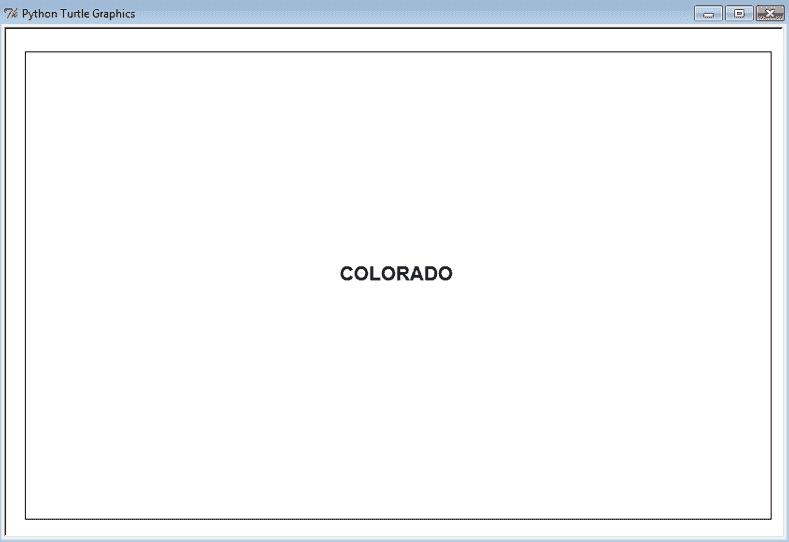

如果您确实尝试运行代码，您将需要在末尾临时添加以下行，否则 Tkinter 窗口将在完成绘制后立即关闭:`t.done()`。

3.  现在，我们将城市渲染为点位置，并用它们的名称和人口标记它们。由于城市是列表中的一组要素，我们将循环遍历它们来渲染它们。我们将使用龟`dot()`方法在`SimpleGISconvert()`函数返回的像素坐标处绘制一个小圆，而不是通过移动笔来绘制线条。然后我们用城市的名字来标记这个点，并添加人口。你会注意到，我们必须将种群数量转换成一个字符串，以便在海龟(T2)方法中使用。为此，我们将使用 Python 内置的`str()`功能:

```py
 for city in cities:
 pixel = convert(city[POINTS])
 t.up()
 t.goto(pixel)
 # Place a point for the city
 t.dot(10)
 # Label the city
 t.write(city[NAME] + ", Pop.: " + str(city[POP]), 
      align="left")
 t.up()
```

4.  现在，我们将执行最后一个操作来证明我们已经创建了一个真正的地理信息系统。我们将对数据执行属性查询，以确定哪个城市的人口最多。然后，我们将执行一个空间查询来查看哪个城市位于最西边。最后，我们将在主题地图页面上安全打印问题的答案，不在地图范围内。
5.  对于我们的查询引擎，我们将使用 Python 内置的`min()`和`max()`函数。这些函数将列表作为参数，并返回该列表的最小值和最大值。这些函数有一个特殊的特性，称为关键参数，允许您对复杂的对象进行排序。由于我们在数据模型中处理嵌套列表，我们将利用这些函数中的关键参数。key 参数接受一个函数，该函数在返回最终值之前临时更改列表进行计算。在这种情况下，我们想要隔离用于比较的总体值，然后是点。我们可以编写一个全新的函数来返回指定的值，但是我们可以使用 Python 的 lambda 关键字来代替。lambda 关键字定义了一个内联使用的匿名函数。其他 Python 函数可以内联使用，例如字符串函数，`str()`，但它们不是匿名的。这个临时函数将隔离我们感兴趣的价值。
6.  那么，我们的第一个问题是，*哪个城市人口最多？*

```py
biggest_city = max(cities, key=lambda city:city[POP])
t.goto(0,-200)
t.write("The biggest city is: " + biggest_city[NAME])
```

7.  下一个问题是，*哪个城市最西边？*

```py
western_city = min(cities, key=lambda city:city[POINTS])
t.goto(0,-220)
t.write("The western-most city is: " + western_city[NAME])
```

8.  在前面的查询中，我们使用 Python 内置的`min()`函数来选择最小的经度值。这是可行的，因为我们将我们的城市位置表示为经度和纬度对。可以对点使用不同的表示，包括代码需要修改才能正常工作的可能表示。然而，对于我们的`SimpleGIS`，我们正在使用一个共同的点表示，使其尽可能直观。
9.  最后两个命令只是为了清理。首先，我们隐藏光标。然后，我们调用海龟`done()`方法，它将保持海龟图形窗口打开，我们的地图在上面，直到我们选择使用窗口顶部的关闭手柄关闭它:

```py
t.pen(shown=False)
t.done()
```

10.  无论您是使用 Python 解释器还是将整个程序作为脚本运行，您都应该看到实时呈现的如下图:


恭喜你！您跟随旧石器时代猎人、地理信息系统之父罗杰·汤姆林森博士、地理空间先驱霍华德·费舍尔和改变游戏规则的人道主义程序员的脚步，创建了一个功能齐全、可扩展且技术上完整的地理信息系统。

只用了不到 60 行纯 Python 代码！您将很难找到一种编程语言，它可以在有限的可读代码中仅使用其核心库来创建一个完整的地理信息系统，例如 Python。即使你这样做了，这种语言也不太可能在本书剩余部分的地理空间 Python 之旅中幸存下来。

可以看到，谈到`SimpleGIS`，还有很大的扩张空间。以下是您可以使用本节开头链接的 Tkinter 和 Python 的参考资料来扩展这个简单工具的一些其他方法:

*   在右上角创建一个带有美国边界轮廓和科罗拉多州在美国的位置的概览地图
*   为视觉吸引力和进一步的清晰度添加颜色
*   为不同要素创建地图关键点
*   列出州和城市，并添加更多的州和城市
*   向地图添加标题
*   创建条形图，直观地比较人口数量

可能性是无穷的。`SimpleGIS`也可以作为一种快速测试和可视化你遇到的地理空间算法的方式。如果想要添加更多的数据层，可以创建更多的列表，但是这些列表将变得难以管理。在这种情况下，您可以使用标准发行版中包含的另一个 Python 模块。SQLite 模块用 Python 提供了一个类似于 SQL 的数据库，可以保存到磁盘或在内存中运行。

# 摘要

干得好！你现在是地理空间分析师。在本章中，您学习了地理空间分析的历史和支持它的技术。你看到了莎拉·帕尔卡博士的研究如何对历史产生了巨大的影响。您还熟悉了基础地理信息系统和遥感概念，这些概念将在本书的剩余部分为您服务。最后，您利用所有这些知识，构建了一个可扩展的工作 GIS，可以做任何您能想象的事情！

在下一章中，我们将讨论作为地理空间分析师会遇到的数据格式。地理空间分析师花在处理数据上的时间远远多于实际执行分析的时间。了解您正在处理的数据对于高效工作和享受乐趣至关重要。

# 进一步阅读

以下是您可以参考的参考列表:

*   如果您的 Python 发行版没有 Tkinter，您可以从以下页面找到安装信息:[https://tkdocs.com/tutorial/install.html](https://tkdocs.com/tutorial/install.html)
*   Tkinter 的官方 Python 维基页面可以在这里找到:[https://wiki.python.org/moin/TkInter](https://wiki.python.org/moin/TkInter)。
*   Tkinter 的文档在 Python 标准库文档中，可以在[https://docs.python.org/2/library/tkinter.html](https://docs.python.org/2/library/tkinter.html)找到。
*   如果你是 python 的新手，由 Apress 出版的马克·皮尔格林所著的*divinto Python*是一本免费的在线书籍，涵盖了 Python 的所有基础知识，将带你了解最新的速度。更多信息请参考[http://www . divintopy](http://www.diveintopython.net)[thon.net](http://www.diveintopython.net)[。](http://www.diveintopython.net)