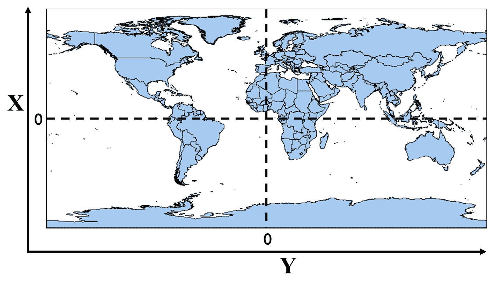
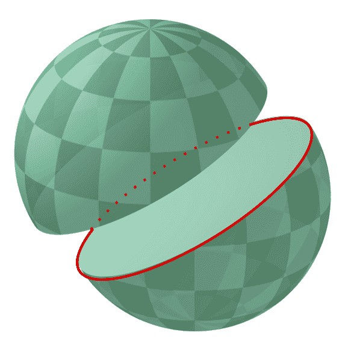
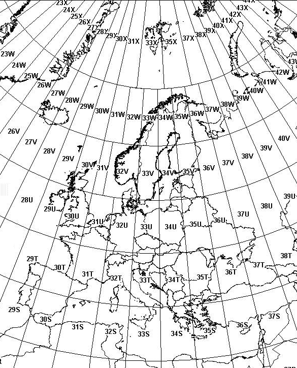
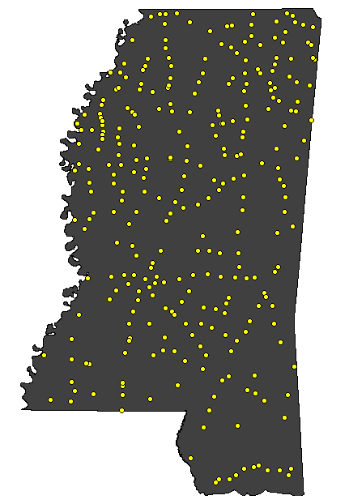
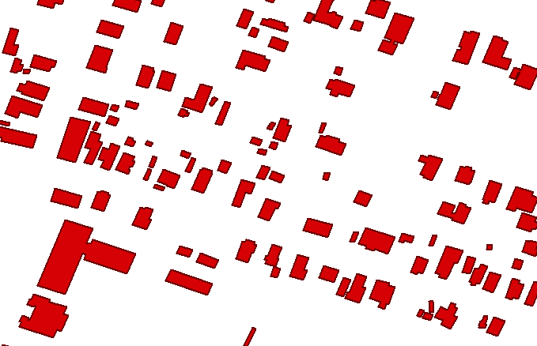
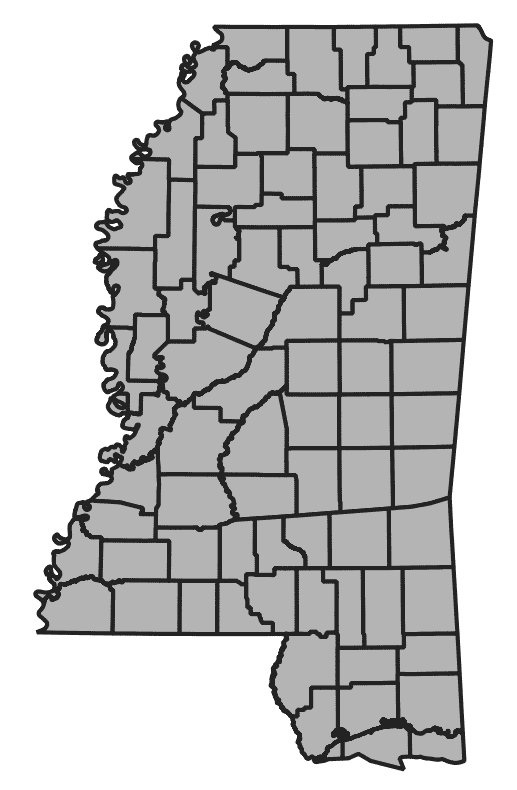
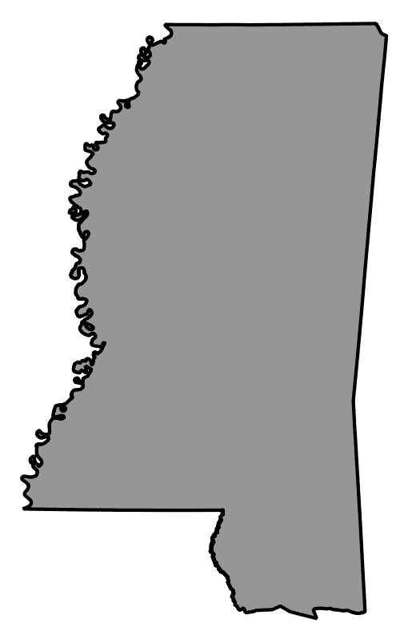
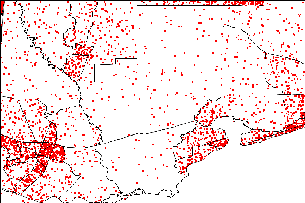
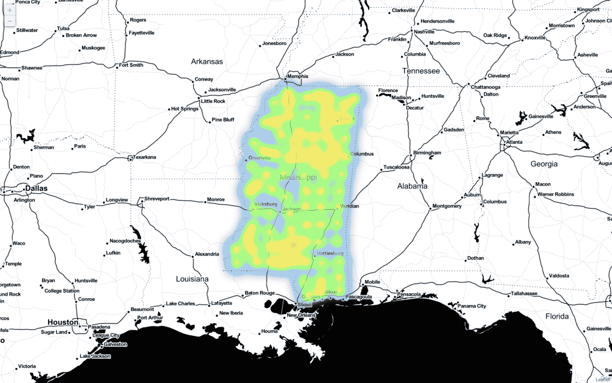

# Python 与地理信息系统

本章将重点介绍如何将 Python 应用于通常由**地理信息系统** ( **地理信息系统**)执行的功能，例如 QGIS 或 ArcGIS。这些功能是地理空间分析的核心和灵魂。我们将继续在 Python 本身之外使用尽可能少的外部依赖项，以便您拥有在不同环境中尽可能可重用的工具。在本书中，我们从编程的角度将地理信息系统分析和遥感分开，这意味着在本章中，我们将主要关注矢量数据。

与本书的其他章节一样，这里介绍的项目是核心功能，作为构建模块，您可以重新组合来解决您将在本书之外遇到的挑战。本章的主题包括以下内容:

*   测量距离
*   转换坐标
*   向量数据的重新投影
*   测量区域
*   编辑形状文件
*   从更大的数据集中选择数据
*   创建专题地图
*   使用电子表格
*   非地理信息系统数据类型转换
*   地理编码
*   多重处理

本章包含许多代码示例。除了文本之外，示例中还包含代码注释作为指南。这一章比这本书的任何一章都涉及更多的内容。它涵盖了从测量地球到编辑数据和创建地图，再到使用按比例放大的多处理技术进行更快的分析的所有内容。到本章结束时，您将成为一名地理空间分析师，准备好学习本书其余部分中更先进的技术。

# 技术要求

对于本章，您将需要以下内容:

*   Python 3.7
*   Python UTM 库
*   Python OGR 库
*   Python 形状文件库
*   Python 菲奥娜库
*   Python PNGCanvas 库
*   Python 枕头库(Python 图像库)
*   蟒蛇叶图书馆
*   Python Pymea 库
*   Python 地理编码器库
*   Python 地理库

# 测量距离

地理空间分析的本质是发现地球上物体之间的关系。距离较近的项目往往比距离较远的项目关系更紧密。这个概念被称为**托布勒地理第一定律**。因此，测量距离是地理空间分析的关键功能。

正如我们所知，每张地图都是地球的模型，它们在某种程度上都是错误的。因此，坐在电脑前测量地球上两点之间的精确距离是不可能的。即使是专业的土地测量员(他们带着传统的观测设备和非常精确的全球定位系统设备在野外工作)也无法解释 A 点和 b 点之间地球表面的每一个异常。因此，为了测量距离，我们必须考虑以下问题:

*   我们在测量什么？
*   我们测量多少？
*   我们需要多少精确度？

现在，为了计算距离，我们可以使用三种地球模型:

*   平面
*   球面的
*   椭圆体

在平面模型中，使用标准欧几里得几何。地球被认为是一个没有曲率的平面，如下图所示:



这个模型让数学变得非常简单，因为你用直线工作。地理空间坐标最常见的格式是十进制度。然而，十进制度坐标是球面上的参考测量值，取为经度和本初子午线之间以及纬度和赤道之间的角度。此外，经度线在两极向零会聚。每条纬度线的周长向两极也变小了。这些事实意味着十进制度对于使用无限平面的欧几里得几何来说不是一个有效的坐标系。

地图投影试图简化在 2D 平面上处理三维椭球体的问题，无论是在纸上还是在计算机屏幕上。正如我们在[第 1 章](01.html)*中所讨论的，使用 Python* 学习地理空间分析，地图投影将地球的圆形模型展平为平面，并引入扭曲来换取地图的便利。一旦这个投影到位，十进制度被交换成一个笛卡尔坐标系，具有 *x* 和 *y* 坐标，我们就可以使用欧几里得几何最简单的形式——也就是毕达哥拉斯定理。

在足够大的尺度下，像地球这样的球体或椭球体看起来更像平面而不是球体。事实上，几个世纪以来，每个人都认为地球是平的！如果经度度数的差异足够小，您通常可以使用欧几里德几何，然后将测量值转换为米、公里或英里。通常不建议使用这种方法，但最终的决定取决于您和您作为分析师对准确性的要求。

球形模型方法试图通过避免将地球砸到一个平面上而产生的问题来更好地逼近现实。顾名思义，这个模型使用一个完美的球体来表示地球(类似于物理地球仪)，这使得我们可以直接使用度来工作。这个模型忽略了一个事实，即地球实际上更像是一个鸡蛋形的椭球体，其地壳厚度各不相同。但是通过研究球体表面的距离，我们可以开始更精确地测量更长的距离。下面的截图说明了这个概念:


利用地球的椭球模型，分析人员努力寻找地球表面的最佳模型。有几种椭球模型，称为基准。一个**基准**是一组定义地球估计形状的值，也称为**大地测量系统**。像任何其他地理参考系统一样，基准可以针对局部区域进行优化。最常用的基准叫做 **WGS84** ，是为全球使用而设计的。您应该知道，随着评估技术和技术的提高，WGS84 偶尔会更新。最近一次修订发生在 2004 年。

在北美，NAD83 数据用于优化整个大陆的参考。在东半球，使用频率更高的是 1989 年欧洲陆地参考系统。ETRS89 固定在**欧亚板块**的稳定部分。基于 ETRS89 的欧洲地图不受大陆漂移的影响，随着地壳移动，大陆漂移每年变化高达 2.5 厘米。

椭球体从中心开始的半径不恒定。这一事实意味着地球球形模型中使用的公式在椭球模型中开始出现问题。虽然不是完美的近似，但它比球形模型更接近现实。

下面的截图显示了一个普通的椭球模型，用一条黑线表示，与地球不均匀的地壳表示形成对比，后者用一条红线表示大地水准面。虽然我们不会在这些例子中使用它，但另一个模型是大地水准面模型。大地水准面是地球最精确、最精确的模型，它以地球表面为基础，除了重力和自转之外，没有任何影响因素。下图显示了大地水准面、椭球面和球面模型，以说明它们的区别:


理解这些地球模型对本书的其他内容至关重要，因为我们毕竟是在模拟地球。

既然我们已经讨论了这些不同的地球模型以及测量它们的问题，让我们看看使用 Python 的一些解决方案。

# 利用毕达哥拉斯定理

我们先从最简单的方法开始测量，那就是勾股定理，也叫欧氏距离。如果你还记得学校里的几何课，毕达哥拉斯定理断言如下:

```py
a2 + b2 = c2
```

在这个断言中，变量 *a* 、 *b* 和 *c* 都是三角形的边。如果你知道另外两个，你可以解决任何一个方面。

在这个例子中，我们将从**密西西比横轴墨卡托** ( **MSTM** )投影中的两个投影点开始。这个投影的单位是米。 *x* 轴位置是从该州最西端位置定义的中央子午线开始测量的。 *y* 轴由 NAD83 水平基准定义。第一点定义为( *x* 1， *y* 1)，代表密西西比州首府杰克逊。第二点，定义为( *x* 2、 *y* 2)代表碧洛溪市，是一个沿海城镇，如下图所示:


In the following example, the double-asterisk (**) in Python is the syntax for exponents, which we'll use to square the distances.

我们将导入 Python 数学模块的平方根函数`sqrt()`。然后，我们将计算 *x* 轴和 *y* 轴的距离。最后，我们将使用这些变量来执行欧几里德距离公式，以米为单位获取从 *x* 、 *y* 原点跨越边界框的距离，该距离将在 MSTM 投影中使用:

```py
import math
# First point
x1 = 456456.23
y1 = 1279721.064
# Second point
x2 = 576628.34
y2 = 1071740.33
# X distance
x_dist = x1 - x2
# Y distance
y_dist = y1 - y2
# Pythagorean theorem
dist_sq = x_dist**2 + y_dist**2
distance = math.sqrt(dist_sq)
print(distance)
# 240202.66
```

所以，距离大约是 240，202 米，大约是 240.2 公里或 150 英里。该计算相当准确，因为该投影针对使用笛卡尔坐标测量密西西比距离和面积进行了优化。

我们也可以使用十进制度来测量距离，但是我们必须执行一些额外的步骤。要使用度数来测量，我们必须将角度转换为弧度，弧度表示坐标之间的曲面距离。我们还将以弧度为单位的输出乘以以米为单位的地球半径，从弧度转换回来。

You can read more about radians at [http://en.wikipedia.org/wiki/Radian](http://en.wikipedia.org/wiki/Radian).

当我们计算 *x* 和 *y* 距离时，我们将使用下面代码中的 Python `math.radians()`方法执行此转换:

```py
import math
x1 = -90.21
y1 = 32.31
x2 = -88.95
y2 = 30.43
x_dist = math.radians(x1 - x2)
y_dist = math.radians(y1 - y2)
dist_sq = x_dist**2 + y_dist**2
dist_rad = math.sqrt(dist_sq)
dist_rad * 6371251.46
# 251664.46
```

好的，所以这次，我们得出了大约 251 公里，比我们的第一次测量多了 11 公里。所以，如你所见，你对测量算法和地球模型的选择会有重大影响。根据我们对坐标系和地球模型的选择，使用相同的方程，我们得出了完全不同的答案。

You can read more about Euclidean distance at [http://mathworld.wolfram.com/Distance.html](http://mathworld.wolfram.com/Distance.html).

接下来让我们来看看哈弗辛公式。

# 使用哈弗辛公式

用毕达哥拉斯定理来测量地球(一个球体)上的距离的部分问题是大圆距离的概念。大圆是球面上两点之间的最短距离。定义大圆的另一个重要特征是，圆如果一直围绕球体，会将球体一分为二，形成相等的两半，如下图所示:



那么，在弯曲球体上测量直线的正确方法是什么呢？最流行的方法是使用**哈弗斯公式**，该公式使用三角学，使用以十进制度定义的坐标作为输入来计算大圆距离。哈弗辛公式为*哈弗辛(θ) = sin (θ/2)* ，其中θ是球面上两点之间的中心角。同样，在应用公式之前，我们将把轴的距离从度数转换为弧度，就像前面的例子一样。但是这一次，我们也将纬度(*y*-轴)坐标分别转换为弧度:

```py
import math
x1 = -90.212452861859035
y1 = 32.316272202663704
x2 = -88.952170968942525
y2 = 30.438559624660321
x_dist = math.radians(x1 - x2)
y_dist = math.radians(y1 - y2)
y1_rad = math.radians(y1)
y2_rad = math.radians(y2)
a = math.sin(y_dist/2)**2 + math.sin(x_dist/2)**2 \
 * math.cos(y1_rad) * math.cos(y2_rad)
c = 2 * math.asin(math.sqrt(a))
distance = c * 6371  # kilometers
print(distance)
# 240.63
```

哇哦！我们使用哈弗辛公式得到 240.6 公里，相比之下，使用优化和更精确的投影得到 240.2 公里。这个差不到半公里，对于相距 150 英里的两个城市的距离计算来说还不错。哈弗辛公式是最常用的距离测量公式，因为从编码角度来看，它相对较轻，并且在大多数情况下相当准确。它被认为精确到大约一米以内。

总结到目前为止我们所学到的，作为一名分析师，你遇到的大多数点坐标都是以未投影的十进制度表示的。因此，您的测量选项如下:

*   重新投影到距离精确的笛卡尔投影和测量。
*   只需使用哈弗辛公式，看看你的分析能走多远。
*   使用更精确的文森特公式。

没错！还有一个公式试图提供比哈弗辛更好的测量方法。

# 使用文森特公式

因此，我们已经使用毕达哥拉斯定理(平地球模型)和哈弗斯公式(球形地球模型)检查了距离测量。文森特公式解释了地球的椭球模型。如果你使用的是定域椭球，它可以精确到一米以内。

在此公式的以下实现中，您可以更改半长轴值和展平比，以适合任何椭球体的定义。让我们看看在下面的例子中，当我们使用 NAD83 椭球上的 Vincenty 公式进行测量时，距离是多少:

1.  首先，我们将导入`math`模块，它允许我们以弧度工作，以及我们需要的其他`math`功能:

```py
import math
```

2.  现在，我们需要设置我们的变量，包括保存距离值的变量、我们正在测量的两点、描述地球的常数以及我们需要的导数公式:

```py
distance = None
x1 = -90.212452861859035
y1 = 32.316272202663704
x2 = -88.952170968942525
y2 = 30.438559624660321
# Ellipsoid Parameters
# Example is NAD83
a = 6378137  # semi-major axis
f = 1/298.257222101  # inverse flattening
b = abs((f*a)-a)  # semi-minor axis
L = math.radians(x2-x1)
U1 = math.atan((1-f) * math.tan(math.radians(y1)))
U2 = math.atan((1-f) * math.tan(math.radians(y2)))
sinU1 = math.sin(U1)
cosU1 = math.cos(U1)
sinU2 = math.sin(U2)
cosU2 = math.cos(U2)
lam = L
```

3.  现在开始文森特公式。没有简单的方法可以做到这一点，数学也有点复杂，但它是有效的:

```py
for i in range(100):
    sinLam = math.sin(lam)
    cosLam = math.cos(lam)
    sinSigma = math.sqrt((cosU2*sinLam)**2 +
                         (cosU1*sinU2-sinU1*cosU2*cosLam)**2)
    if (sinSigma == 0):
        distance = 0  # coincident points
        break
    cosSigma = sinU1*sinU2 + cosU1*cosU2*cosLam
    sigma = math.atan2(sinSigma, cosSigma)
    sinAlpha = cosU1 * cosU2 * sinLam / sinSigma
    cosSqAlpha = 1 - sinAlpha**2
    cos2SigmaM = cosSigma - 2*sinU1*sinU2/cosSqAlpha
    if math.isnan(cos2SigmaM):
        cos2SigmaM = 0  # equatorial line
    C = f/16*cosSqAlpha*(4+f*(4-3*cosSqAlpha))
    LP = lam
    lam = L + (1-C) * f * sinAlpha *
        (sigma + C*sinSigma*(cos2SigmaM+C*cosSigma *
                             (-1+2*cos2SigmaM*cos2SigmaM)))
    if not abs(lam-LP)  1e-12:
        break
uSq = cosSqAlpha * (a**2 - b**2) / b**2
A = 1 + uSq/16384*(4096+uSq*(-768+uSq*(320-175*uSq)))
B = uSq/1024 * (256+uSq*(-128+uSq*(74-47*uSq)))
deltaSigma = B*sinSigma*(cos2SigmaM+B/4 *
(cosSigma*(-1+2*cos2SigmaM*cos2SigmaM) - B/6*cos2SigmaM*(-3+4*sinSigma*sinSigma) * (-3+4*cos2SigmaM*cos2SigmaM)))
s = b*A*(sigma-deltaSigma)
```

最后，在这一切之后，我们还有我们的距离:

```py
distance = s
print(distance)
# 240237.66693880095
```

使用文森特公式，我们的测量值达到了 240.1 公里，这与我们使用欧几里德距离的投影测量值只有 100 米之遥。印象深刻！虽然数学上比哈弗辛公式复杂很多倍，但你可以看到它也要精确得多。

The pure Python geopy module includes an implementation of the Vincenty formula and has the ability to geocode locations by turning place names into latitude and longitude coordinates: [http://geopy.readthedocs.org/en/latest/](http://geopy.readthedocs.org/en/latest/).

这些例子中使用的点相当接近赤道。随着你向两极移动，或者在更大的距离或极小的距离下工作，你所做的选择变得越来越重要。如果你只是想在一个城市周围划出一个半径来选择宣传音乐会的营销活动的地点，那么几公里的误差可能是可以的。然而，如果你试图估算一架飞机在两个机场之间飞行所需的燃料，那么你想被当场发现！

如果您想了解更多关于测量距离和方向的问题，以及如何通过编程解决这些问题，请访问以下网站:[http://www.movable-type.co.uk/scripts/latlong.html](http://www.movable-type.co.uk/scripts/latlong.html)。

在这个网站上，Chris Veness 详细介绍了这个主题，并提供了在线计算器，以及用 JavaScript 编写的示例，这些示例可以很容易地移植到 Python 中。我们刚才看到的 Vincenty 公式实现是从这个网站的 JavaScript 移植过来的。

你可以在这里看到文森特公式的完整纯数学符号:https://en.wikipedia.org/wiki/Vincenty%27s_formulae。

既然我们知道了如何计算距离，我们就需要了解如何计算直线的方向，以通过距离和位置将地球上的对象联系起来，从而进行地理空间分析。

# 计算直线方向

除了距离之外，您通常还想知道直线在其端点之间的方位。我们可以仅使用 Python `math`模块从其中一个点计算该直线方向:

1.  首先，我们导入我们需要的`math`函数:

```py
from math import atan2, cos, sin, degrees
```

2.  接下来，我们为两点设置一些变量:

```py
lon1 = -90.21
lat1 = 32.31
lon2 = -88.95
lat2 = 30.43
```

3.  接下来，我们将计算两点之间的角度:

```py
angle = atan2(cos(lat1)*sin(lat2)-sin(lat1) * \
  cos(lat2)*cos(lon2-lon1), sin(lon2-lon1)*cos(lat2))
```

4.  最后，我们将以度为单位计算直线的方位:

```py
bearing = (degrees(angle) + 360) % 360
print(bearing)
309.3672990606595
```

有时候，你最终会得到一个负轴承值。为了避免这个问题，我们将`360`添加到结果中以避免出现负数，并使用 Python 模运算符来防止该值攀升到超过`360`。

角度计算中的`math`是逆向工程一个直角三角形，然后算出三角形的锐角。下面的网址解释了这个公式的元素，并在最后提供了一个互动的例子:[https://www.mathsisfun.com/sine-cosine-tangent.html](http://www.movable-type.co.uk/scripts/latlong.html)。

我们现在知道如何计算特征在地球上的位置。接下来，我们将学习如何集成来自不同来源的数据，从坐标转换开始。

# 理解坐标转换

坐标转换允许您在不同坐标系之间转换点坐标。当您开始处理多个数据集时，您不可避免地会得到不同坐标系和投影中的数据。您可以使用名为`utm`的纯 Python 模块，在两个最常见的坐标系(UTM 和地理坐标(纬度和经度))之间来回转换。您可以使用 PyPI 的`easy_install`或`pip`:[https://pypi.python.org/pypi/utm](https://pypi.python.org/pypi/utm)进行安装。

`utm`模块使用起来很简单。要将 UTM 转换为纬度和经度，可以使用以下代码:

```py
import utm
y = 479747.0453210057
x = 5377685.825323031
zone = 32
band = 'U'
print(utm.to_latlon(y, x, zone, band))
# (48.55199390882121, 8.725555729071763)
```

UTM 区是水平编号的。然而，在垂直方向上，纬度带是按照英文字母顺序排列的，只有少数例外。例如，字母 *A* 、 *B* 、 *Y* 和 *Z* 被用来标记地球的两极。字母 *I* 和 *O* 省略，因为它们看起来太像 *1* 和 *0* 了。字母 *N* 到 *X* 在北半球，而 *C* 到 *M* 在南半球。以下截图来自网站*图册欧洲植物区系*，展示了欧洲上空的 UTM 区域:



从纬度和经度转换更容易。我们只是将纬度和经度传递给`from_latlon()`方法，该方法返回一个元组，该元组具有与`to_latlon()`方法接受的参数相同的参数:

```py
import utm
utm.from_latlon(48.55199390882121, 8.725555729071763)
# (479747.04524576373, 5377691.373080335, 32, 'U')
```

The algorithms that were used in this Python implementation are described in detail at [http://www.uwgb.edu/dutchs/UsefulData/UTMFormulas.HTM](http://www.uwgb.edu/dutchs/UsefulData/UTMFormulas.HTM).

在 UTM 和纬度/经度之间进行转换只是触及了转换来自不同来源的数据集的表面，这样它们就可以很好地覆盖在地图上。为了超越基础，我们需要执行地图投影。

现在我们知道如何计算直线方向，让我们看看如何重新投影。

# 理解再投射

在地理信息系统中，重投影就是将数据集中的坐标从一个坐标系更改为另一个坐标系。虽然由于更先进的数据分发方法，重新投影现在不太常见，但有时您需要重新投影一个 shapefile。纯 Python `utm`模块用于参考系统转换，但是对于完整的重投影，我们需要 OGR Python API 的一些帮助。包含在`osgeo`模块中的 OGR 应用编程接口还提供了开放空间参考模块，也称为`osr`，我们将使用它进行重新投影。

作为一个例子，我们将在兰伯特共形投影中使用一个包含纽约市博物馆和画廊位置的点形状文件。我们将把它重新投影到 WGS84 地理(或者说，不投影它)。你可以在 https://git.io/vLbT4 下载这个压缩的形状文件。

下面的极简脚本重新投影了 shapefile。几何图形被转换，然后写入新文件，但是`.dbf`文件只是被复制到新名称，因为我们没有改变它。标准 Python `shutil`模块，外壳实用程序的缩写，用于复制`.dbf`。源和目标 shape 文件名是脚本开头的变量。目标投影也在顶部附近，这是使用 EPSG 码设置的。脚本假设有一个`.prj`投影文件，它定义了源投影。如果没有，您可以使用与目标投影相同的语法手动定义它。我们将逐步完成数据集的投影。每个部分都标有注释:

1.  首先，我们导入我们的库:

```py
from osgeo import ogr
from osgeo import osr
import os
import shutil
```

2.  接下来，我们将形状文件名定义为变量:

```py
srcName = 'NYC_MUSEUMS_LAMBERT.shp'
tgtName = 'NYC_MUSEUMS_GEO.shp'
```

3.  现在，我们使用`osr`模块作为 EPSG 代码`4326`创建我们的目标空间参考，它是 WGS84 地理:

```py
tgt_spatRef = osr.SpatialReference()
tgt_spatRef.ImportFromEPSG(4326)
```

4.  然后，我们使用`ogr`设置我们的形状文件`Reader`对象，并获得空间参考:

```py
driver = ogr.GetDriverByName('ESRI Shapefile')
src = driver.Open(srcName, 0)
srcLyr = src.GetLayer()
src_spatRef = srcLyr.GetSpatialRef()
```

5.  接下来，我们检查我们的目标 shapefile 是否已经存在于之前的测试运行中，如果存在，则删除它:

```py
if os.path.exists(tgtName):
    driver.DeleteDataSource(tgtName)
```

6.  现在，我们可以开始构建 shapefile 的目标层了:

```py
tgt = driver.CreateDataSource(tgtName)
lyrName = os.path.splitext(tgtName)[0]
# Use well-known binary format (WKB) to specify geometry
tgtLyr = tgt.CreateLayer(lyrName, geom_type=ogr.wkbPoint)
featDef = srcLyr.GetLayerDefn()
trans = osr.CoordinateTransformation(src_spatRef, tgt_spatRef)
```

7.  接下来，我们可以遍历我们的源 shapefile 中的特征，使用`Transform()`方法重新投影它们，并将它们添加到新的 shapefile 中:

```py
srcFeat = srcLyr.GetNextFeature()
while srcFeat:
    geom = srcFeat.GetGeometryRef()
    geom.Transform(trans)
    feature = ogr.Feature(featDef)
    feature.SetGeometry(geom)
    tgtLyr.CreateFeature(feature)
    feature.Destroy()
    srcFeat.Destroy()
    srcFeat = srcLyr.GetNextFeature()
src.Destroy()
tgt.Destroy()
```

8.  然后，我们需要创建一个包含投影信息的 shapefile `.prj`文件，因为 shapefile 没有固有的存储方式:

```py
# Convert geometry to Esri flavor of Well-Known Text (WKT) format
# for export to the projection (prj) file.
tgt_spatRef.MorphToESRI()
prj = open(lyrName + '.prj', 'w')
prj.write(tgt_spatRef.ExportToWkt())
prj.close()
```

9.  最后，我们可以用新文件名复制`.dbf`源，因为属性是重新投影过程的一部分:

```py
srcDbf = os.path.splitext(srcName)[0] + '.dbf'
tgtDbf = lyrName + '.dbf'
shutil.copyfile(srcDbf, tgtDbf)
```

下面的截图显示了 QGIS 中的重新投影点，背景是卫星图像:


如果您正在处理一组点，您可以以编程方式重新投影它们，而不是使用 PyProj:[https://jswhit.github.io/pyproj/](https://jswhit.github.io/pyproj/)重新投影形状文件。

除了将坐标转换成不同的投影之外，您还经常需要在不同的格式之间转换它们，我们接下来将讨论这一点。

# 理解坐标格式转换

传统上，对于海上导航，地图坐标表示为度、分和秒。然而，在地理信息系统(基于计算机)中，纬度和经度被表示为十进制数，称为**十进制度**。仍然使用度、分钟和秒的格式。有时，您必须在该格式和十进制度之间进行转换，才能执行计算和输出报告。

在本例中，我们将创建两个函数，可以将其中一种格式转换为另一种格式:

1.  首先，我们导入`math`模块进行转换，`re`正则表达式模块解析坐标字符串:

```py
import math
import re
```

2.  我们的功能是将十进制度数转换成`degrees`、`minutes`和`seconds`字符串:

```py
def dd2dms(lat, lon):
    """Convert decimal degrees to degrees, minutes, seconds"""
    latf, latn = math.modf(lat)
    lonf, lonn = math.modf(lon)
    latd = int(latn)
    latm = int(latf * 60)
    lats = (lat - latd - latm / 60) * 3600.00
    lond = int(lonn)
    lonm = int(lonf * 60)
    lons = (lon - lond - lonm / 60) * 3600.00
    compass = {
        'lat': ('N','S'),
        'lon': ('E','W')
    }
    lat_compass = compass['lat'][0 if latd >= 0 else 1]
    lon_compass = compass['lon'][0 if lond >= 0 else 1]
    return '{}º {}\' {:.2f}" {}, {}º {}\' {:.2f}" 
    {}'.format(abs(latd),
    abs(latm), abs(lats), lat_compass, abs(lond),
    abs(lonm), abs(lons), lon_compass)
```

3.  接下来，我们的功能是反过来转换学位:

```py
def dms2dd(lat, lon):
    lat_deg, lat_min, \
    lat_sec, lat_dir = re.split('[^\d\.A-Z]+', lat)
    lon_deg, lon_min, \
    lon_sec, lon_dir = re.split('[^\d\.A-Z]+', lon)
    lat_dd = float(lat_deg) +\
    float(lat_min)/60 + float(lat_sec)/(60*60);
    lon_dd = float(lon_deg) +\
    float(lon_min)/60 + float(lon_sec)/(60*60);
    if lat_dir == 'S':
        lat_dd *= -1
    if lon_dir == 'W':
        lon_dd *= -1
    return (lat_dd, lon_dd);
```

4.  现在，如果我们想将十进制度数转换为 DMS，就像使用以下代码一样简单:

```py
print(dd2dms(35.14953, -90.04898))
 # 35º 8' 58.31" N, 90º 2' 56.33" W
```

5.  要转到另一个方向，只需键入以下函数:

```py
dms2dd("""29º 56' 0.00" N""", """90º 4' 12.36" W""")
 (29.933333333333334, -90.0701)
```

请注意，因为 DMS 坐标包含单引号和双引号来表示分钟和秒钟，所以我们必须使用 Python 字符串约定，即在每个纬度和经度坐标上使用三引号来包含这两种类型的引号，以便正确解析它们。

坐标是地理信息系统数据集的基本单位。它们用于构建点、线和多边形。

# 计算多边形的面积

在继续编辑地理信息系统数据之前，我们还有一个计算。地理信息系统最基本的单位是点。两点可以形成一条线。共享端点的多条线可以形成多段线，多段线可以形成多边形。在地理空间操作中，多边形被用来表示从房子到整个国家的一切。

如果我们希望了解要素的相对大小，计算多边形的面积是 GIS 中最有用的操作之一。但是在地理信息系统中，面积计算超出了基本几何。多边形位于地球上，地球是一个曲面。多边形必须被投影以说明曲率。

幸运的是，有一个简单称为`area`的纯 Python 模块可以为我们处理这些复杂情况。并且因为它是纯 Python，所以您可以查看源代码来了解它是如何工作的。`area`模块的`area()`函数接受一个带有点列表的 GeoJSON 字符串，这些点组成一个多边形，然后返回面积。以下步骤将向您展示如何计算多边形的面积:

1.  您可以使用`pip`安装`area`模块:

```py
pip install area
```

2.  首先，我们将从`area`模块导入`area`功能:

```py
from area import area
```

3.  接下来，我们将为多边形创建一个名为`polygon`的变量，它包含在 GeoJSON 几何中:

```py
# Our points making up a polygon
polygon = {"type":"Polygon","coordinates":[[[-89.324,30.312],[-89.326,30.31],[-89.322,30.31],[-89.321,30.311],[-89.321,30.312],[-89.324,30.312]]]}
```

4.  现在，我们可以将多边形点字符串传递给面积函数来计算面积:

```py
a = area(polygon)
```

5.  归还的面积是`80235.13927976067`平方米。然后我们可以使用 Python 内置的`round()`函数将长浮点值四舍五入到两位小数，得到 **80235.14** :

```py
round(a, 2)
```

现在，您可以使用工具来计算地理空间数据的距离和大小。

在下一节中，我们将研究用最流行的地理信息系统数据格式之一——shape file 来编辑数据集。

# 编辑形状文件

形状文件是地理信息系统中最常见的数据格式之一，既用于交换数据，也用于执行地理信息系统分析。在本节中，我们将学习如何广泛地使用这些文件。在[第 2 章](02.html)、*学习地理空间数据*中，我们讨论了形状文件作为一种可以有许多不同文件类型与之相关联的格式。对于编辑 shapefiles 和大多数其他操作，我们只关心两种文件类型:

*   `.shp`文件
*   `.dbf`文件

`.shp`文件包含几何图形，而`.dbf`文件包含相应几何图形的属性。形状文件中的每个几何记录都有一个`.dbf`记录。这些记录没有任何编号或标识。这意味着，在从 shapefile 中添加和删除信息时，必须小心地删除或添加记录到每个文件类型中以匹配。

正如我们在 [第 4 章](04.html)*地理空间 Python 工具箱*中所讨论的，有两个库可以用来编辑 Python 中的 shapefiles:

*   一个是 Python 到 OGR 库的绑定。
*   另一个是 PyShp 库，用纯 Python 编写。

我们将使用 PyShp，以便尽可能坚持本书的*纯 Python*主题。要安装 PyShp，请使用`easy_install`或`pip`。

要开始编辑形状文件，我们将从包含密西西比州城市的点形状文件开始，您可以将其作为 ZIP 文件下载。将以下文件下载到你的工作目录并解压:[http://git.io/vLbU4](http://git.io/vLbU4)。

我们正在处理的点可以在下图中看到:



# 访问 shapefile

要使用 shapefile 做任何事情，我们需要将它作为数据源进行访问。要访问 shapefile，我们将使用 PyShp 打开它。在 PyShp 中，我们将添加以下代码:

```py
import shapefile
 r = shapefile.Reader('MSCities_Geo_Pts')
 r
<shapefile.Reader instance at 0x00BCB760>
```

我们创建了一个形状文件`Reader`对象实例，并将其设置为`r`变量。请注意，当我们将文件名传递给`Reader`类时，我们没有使用任何文件扩展名。请记住，我们正在处理至少两个以`.shp`和`.dbf`结尾的不同文件。因此，我们真正需要的只是这两个文件共有的不带扩展名的基本文件名。

但是，您可以使用文件扩展名。PyShp 将忽略它并使用基本文件名。那么，你为什么要增加一个扩展名呢？大多数操作系统允许文件名中有任意数量的句点。例如，您可能有一个具有以下基本名称的 shape file:`myShapefile.version.1.2`。

在这种情况下，PyShp 会尝试将最后一个句点之后的字符解释为文件扩展名，即`.2`。此问题将阻止您打开 shapefile。因此，如果您的 shapefile 在基本名称中有句点，您需要在文件名中添加一个文件扩展名，如`.shp`或`.dbf`。

一旦您打开了一个形状文件并创建了一个`Reader`对象，您就可以获得一些关于地理数据的信息。在下面的示例中，我们将从`Reader`对象中获取边界框、形状类型和形状文件中的记录数:

```py
r.bbox
 [-91.38804855553174, 30.29314882296931, -88.18631833931401, 
 34.96091138678437]
 r.shapeType
 # 1
 r.numRecords
 # 298
```

存储在`r.bbox`属性中的边界框作为包含最小 *x* 值、最小 *y* 值、最大 *x* 值和最大 *y* 值的列表返回。形状类型可用作`shapeType`属性，是由官方形状文件规范定义的数字代码。在这种情况下，`1`代表点形状文件，`3`代表线，`5`代表多边形。最后，`numRecords`属性告诉我们这个 shapefile 中有`298`记录。因为是简单的点形状文件，我们知道有`298`个点，每个点都有自己的`.dbf`记录。

下表显示了 shapefiles 的不同几何类型及其对应的数字代码:

| **几何图形** | **数字代码** |
| `NULL` | Zero |
| `POINT` | one |
| `POLYLINE` | three |
| `POLYGON` | five |
| `MULTIPOINT` | eight |
| `POINTZ` | Eleven |
| `POLYLINEZ` | Thirteen |
| `POLYGONZ` | Fifteen |
| `MULTIPOINTZ` | Eighteen |
| `POINTM` | Twenty-one |
| `POLYLINEM` | Twenty-three |
| `POLYGONM` | Twenty-five |
| `MULTIPOINTM` | Twenty-eight |
| `MULTIPATCH` | Thirty-one |

现在我们知道了如何访问它，让我们看看如何读取这些文件。

# 正在读取 shapefile 属性

`.dbf`文件是一种简单的数据库格式，其结构类似于一个包含行和列的电子表格，每一列都是一个标签，定义了它包含的信息。我们可以通过检查`Reader`对象的字段属性来查看该信息:

```py
r.fields
 # [('DeletionFlag', 'C', 1, 0), ['STATEFP10', 'C', 2, 0], 
 ['PLACEFP10', 'C', 5, 0],
 # ['PLACENS10', 'C', 8, 0], ['GEOID10', 'C', 7, 0], ['NAME10', 'C', 
 100, 0],
 # ['NAMELSAD10', 'C', 100, 0], ['LSAD10', 'C', 2, 0], ['CLASSFP10', 
 'C', 2, 0],
 # ['PCICBSA10', 'C', 1, 0], ['PCINECTA10', 'C', 1, 0], ['MTFCC10', 
 'C', 5, 0],
 # ['FUNCSTAT10', 'C', 1, 0], ['ALAND10', 'N', 14, 0], ['AWATER10', 
 'N', 14,0],
 # ['INTPTLAT10', 'C', 11, 0], ['INTPTLON10', 'C', 12, 0]]
```

`fields`属性返回了相当多的信息。这些字段包含每个字段的信息列表，称为**字段描述符**。对于每个字段，显示以下信息:

*   **字段名:**这是文本形式的字段名，对于 shapefiles，长度不能超过 10 个字符。
*   **字段类型:**这是字段的类型，可以是文本、数字、日期、浮点数，也可以是分别表示为 C、N、D、F、L 的布尔值。shapefile 规范称其使用指定为 dBASE III 的`.dbf`格式，但大多数 GIS 软件似乎都支持 dBASE IV。在版本 IV (4)中，数字和浮点类型是等价的。
*   **字段长度:**这是以字符或数字表示的数据长度。
*   **小数长度:**这是数字或浮点字段中的小数位数。

第一个字段描述符概述了一个隐藏字段，它是`.dbf`文件格式规范的一部分。`DeletionFlag`允许软件标记要删除的记录，而不实际删除它们。这样，信息仍在文件中，但可以从显示的记录列表或搜索查询中删除。

如果我们只需要字段名而不需要其他元数据，我们可以使用 Python 列表理解只返回描述符中的第一项，而忽略`DeletionFlag`字段。本示例创建一个列表理解，返回每个描述符(字段名)中的第一项，从第二个描述符开始忽略删除标志:

```py
[item[0] for item in r.fields[1:]]
# ['STATEFP10', 'PLACEFP10', 'PLACENS10', 'GEOID10', 'NAME10', 'NAMELSAD10', 'LSAD10',
# 'CLASSFP10', 'PCICBSA10', 'PCINECTA10', 'MTFCC10', 'FUNCSTAT10', 'ALAND10',
# 'AWATER10', 'INTPTLAT10', 'INTPTLON10']
```

现在，我们只有字段名，更容易阅读。为了清楚起见，字段名称都包含数字`10`，因为这是该形状文件的 2010 版本，它是作为每次人口普查的一部分创建的。由于字段名的`10`字符限制，这类缩写在 shapefile `.dbf`文件中很常见。

接下来，让我们检查这些字段描述的一些记录。我们可以使用`r.record()`方法查看单个记录。从第一个例子我们知道有`298`记录。因此，让我们以第三条记录为例进行研究。使用列表索引访问记录。在 Python 中，索引从`0`开始，所以我们必须从期望的记录数中减去一才能得到索引。对于记录 3，指数将是`2`。您只需将索引传递给`record()`方法，如下代码所示:

```py
r.record(2)
#['28', '16620', '02406337', '2816620', 'Crosby', 'Crosby town', '43', 'C1', 'N','N', # 'G4110', 'A', 5489412, 21336, '+31.2742552', '-091.0614840']
```

如您所见，字段名与实际记录分开存储。如果您想选择一个记录值，您需要它的索引。每条记录中城市名称的索引为`4`:

```py
r.record(2)[4]
# 'Crosby'
```

但是计算索引很繁琐。通过字段名引用值要容易得多。有几种方法可以将字段名称与特定记录的值相关联。首先是使用 Python 列表中的`index()`方法，通过使用字段名以编程方式获取索引:

```py
fieldNames = [item[0] for item in r.fields[1:]]
name10 = fieldNames.index('NAME10')
name10
# 4
r.record(2)[name10]
# 'Crosby'
```

我们可以将字段名与值相关联的另一种方法是使用 Python 内置的`zip()`方法，该方法匹配两个或多个列表中的对应项，并将它们合并成元组列表。然后，我们可以遍历该列表，检查名称，然后获取关联的值，如下面的代码所示:

```py
fieldNames = [item[0] for item in r.fields[1:]]
fieldNames
# ['STATEFP10', 'PLACEFP10', 'PLACENS10', 'GEOID10', 'NAME10', 'NAMELSAD10',
# 'LSAD10', 'CLASSFP10', 'PCICBSA10', 'PCINECTA10', 'MTFCC10','FUNCSTAT10',
# 'ALAND10','AWATER10', 'INTPTLAT10', 'INTPTLON10']
 rec = r.record(2)
 rec
# ['28', '16620', '02406337', '2816620', 'Crosby', 'Crosby town',
# '43', 'C1', 'N','N', 'G4110', 'A', 5489412, 21336, '+31.2742552', '-091.0614840']
 zipRec = zip(fieldNames, rec)
 list(zipRec)
# [('STATEFP10', '28'), ('PLACEFP10', '16620'), ('PLACENS10', '02406337'),
# ('GEOID10', '2816620'), ('NAME10', 'Crosby'), ('NAMELSAD10', 'Crosby town'),
# ('LSAD10', '43'), ('CLASSFP10', 'C1'), ('PCICBSA10','N'),('PCINECTA10','N'),
# ('MTFCC10', 'G4110'), ('FUNCSTAT10', 'A'), ('ALAND10', 5489412),('AWATER10', 21336),
# ('INTPTLAT10', '+31.2742552'), ('INTPTLON10', '-091.0614840')]
for z in zipRec:
    if z[0] == 'NAME10': print(z[1])
# Crosby
```

我们也可以使用`r.records()`方法循环浏览`.dbf`记录。在本例中，我们将遍历`records()`方法返回的列表，但是将使用 Python 数组切片的结果限制在前三条记录中。正如我们前面提到的，shapefiles 不包含记录号，所以我们也将枚举记录列表并动态创建一个记录号，这样输出就更容易阅读了。在本例中，我们将使用`enumerate()`方法，该方法将返回包含索引和记录的元组，如以下代码所示:

```py
for rec in enumerate(r.records()[:3]):
    print(rec[0]+1, ': ', rec[1])
# 1 :  ['28', '59560', '02404554', '2859560', 'Port Gibson', 'Port Gibson city', '
# 25', 'C1', 'N', 'N', 'G4110', 'A', 4550230, 0, '+31.9558031', '-090.9834329']
# 2 :  ['28', '50440', '02404351', '2850440', 'Natchez', 'Natchez city', '25', 'C1',
#      'Y', 'N', 'G4110', 'A', 34175943, 1691489, '+31.5495016', '-091.3887298']
# 3 :  ['28', '16620', '02406337', '2816620', 'Crosby', 'Crosby town', '43', 'C1','N',
#       'N', 'G4110', 'A', 5489412, 21336, '+31.2742552', '-091.0614840']
```

这种枚举技巧是大多数地理信息系统软件包在表中显示记录时使用的。许多地理信息系统分析师认为形状文件存储记录号，因为每个地理信息系统程序显示一个。但是如果您删除一条记录，例如 ArcGIS 或 QGIS 中的记录编号 5，并保存该文件，当您再次打开它时，您会发现以前的记录编号 6 现在是记录编号 5。一些空间数据库可能会为记录分配唯一的标识符。通常，唯一的标识符是有帮助的。您始终可以在`.dbf`中创建另一个字段和列，并分配自己的编号，即使删除记录，该编号也保持不变。

如果您正在处理非常大的形状文件，PyShp 有迭代器方法，可以更有效地访问数据。默认的`records()`方法一次将所有记录读入内存，这对小的`.dbf`文件来说很好，但是即使有几千条记录也很难管理。任何时候你使用`records()`方法，你也可以同样使用`r.iterRecords()`方法。该方法保存了提供手头记录所需的最少量信息，而不是整个数据集。在这个快速的例子中，我们使用`iterRecords()`方法来计算记录的数量，以验证文件头中的计数:

```py
counter = 0
for rec in r.iterRecords():
    counter += 1
counter
# 298
```

现在我们可以读取 shapefile 的一半，也就是属性，我们准备好看另一半，也就是几何。

# 读取 shapefile 几何图形

现在，让我们来看看几何图形。之前，我们查看了头部信息，确定这个 shapefile 是一个点 shapefile。所以，我们知道每条记录都包含一个点。让我们检查第一个几何记录:

```py
geom = r.shape(0)
geom.points
# [[-90.98343326763826, 31.9558035947602]]
```

在每个几何记录中，也称为`shape`，点存储在一个名为`points`的列表中，即使只有一个点，如本例所示。点存储为 *x* 、 *y* 对，因此如果使用该坐标系，经度优先于纬度。

形状文件规范也允许三维形状。高程值沿 *z* 轴，通常称为 *z* 值。因此，3D 点通常被描述为 *x* 、 *y* 、 *z* 。在 shapefile 格式中， *z* 值存储在单独的 *z* 属性中，如果形状类型允许的话。如果形状类型不允许 *z* 值，那么当 PyShp 读取记录时，该属性永远不会被设置。带有 *z* 值的 Shapefiles 也包含测量值或 *m* 值，这些值很少使用，在本例中也不使用。

度量是用户分配的值，可以与形状相关联。一个例子是在给定位置记录的温度。还有另一类形状类型允许为每个形状添加 *m* 值，但不允许添加 *z* 值。这类形状类型称为 **M 形状类型**。就像 *z* 值一样，如果有数据，则创建 *m* 属性；否则，就不是了。您通常不会遇到带有 *z* 值的形状文件，也很少遇到设置了 *m* 值的形状文件。但有时你会，所以意识到它们是很好的。就像我们的字段和记录`.dbf`示例一样，如果您不喜欢将 *z* 和 *m* 值存储在单独的列表中，从点列表中，您可以使用`zip()`方法将它们组合起来。`zip`方法可以将多个列表作为用逗号分隔的参数，就像我们之前遍历记录并连接字段名称和属性时所演示的那样。

用 PyShp 创建`Reader`对象时，它是只读的。您可以更改`Reader`对象中的任何值，但它们不会写入原始形状文件。在下一小节中，我们将看到如何在原始 shapefile 中进行更改。

# 更改形状文件

要创建一个 shapefile，还需要创建一个`Writer`对象。您可以在`Reader`或`Writer`对象中更改值；它们只是动态的 Python 数据类型。但在某些时候，你必须将数值从`Reader`复制到`Writer`。PyShp 自动处理所有的标题信息，例如边界框和记录计数。你只需要担心几何和属性。你会发现这个方法比我们之前使用的 OGR 例子简单得多。然而，这也仅限于 UTM 的预测。

为了演示这个概念，我们将读入一个包含以度数为单位的点的形状文件，并在保存它之前将其转换为`Writer`对象中的 UTM 参考系统。我们将使用我们在本章前面讨论过的 PyShp 和 UTM 模块。我们将使用的 shapefile 是纽约市博物馆 shapefile，我们将其重新投影到 WGS84 地理。您也可以将其作为 ZIP 文件下载，该文件可在[https://git.io/vLd8Y](https://git.io/vLd8Y)获得。

在下面的示例中，我们将读入 shapefile，为转换后的 shapefile 创建一个编写器，复制字段，然后复制记录，最后在保存转换后的 shapefile 之前转换每个点并将其作为几何记录写入:

```py
import shapefile
import utm
r = shapefile.Reader('NYC_MUSEUMS_GEO')
w = shapefile.Writer(r.shapeType)
w.fields = list(r.fields)
w.records.extend(r.records())
for s in r.iterShapes():
    lon,lat = s.points[0]
    y,x,zone,band = utm.from_latlon(lat,lon)
    w.point(x,y)
w.save('NYC_MUSEUMS_UTM')
```

如果要打印出第一个形状的第一个点，您会看到以下内容:

```py
print(w.shapes()[0].points[0])
# [4506346.393408813, 583315.4566450359, 0, 0]
```

该点作为包含四个数字的列表返回。前两个是 *x* 和 *y* 值，而后两个是占位符，在本例中分别是高程值和测量值，它们在您编写这些类型的形状文件时使用。此外，我们没有像前面的重投影示例那样编写 PRJ 投影文件。这里有一个简单的方法，使用来自 https://spatialreference.org/的 EPSG 代码创建一个 PRJ 文件。上例中的`zone`变量告诉我们，我们在 UTM 18 区工作，也就是 EPSG 代码 26918。以下代码将创建一个`prj`文件:

```py
from urllib.request import urlopen
prj = urlopen('http://spatialreference.org/ref/epsg/26918/esriwkt/')
with open('NYC\_MUSEUMS\_UTM', 'w') as f:
    f.write(str(prj.read()))
```

作为另一个例子，我们可以向 shapefile 添加一个新特性。在本例中，我们将向代表热带风暴的形状文件中添加第二个多边形。你可以在这里下载这个例子的压缩形状文件:[https://git.io/vLdlA](https://git.io/vLdlA)。

我们将读取 shapefile，将其复制到一个`Writer`对象，添加新的多边形，并使用以下代码以相同的文件名写回来:

```py
import shapefile
file_name = "ep202009.026_5day_pgn.shp"
r = shapefile.Reader(file_name)
with shapefile.Writer("test", r.shapeType) as w: 
    w.fields = list(r.fields) 
    for rec in r.records():
        w.record(*list(rec)) 
    for s in r.shapes():
        w._shapeparts(parts=[s.points], shapeType=s.shapeType) 
    w.poly([[[-104, 24], [-104, 25], [-103, 25], [-103, 24], [-104, 
    24]]]) 
    w.record("STANLEY", "TD", "091022/1500", "27", "21", "48", "ep")
```

这就是我们如何在原始 shapefile 中进行更改。现在，让我们看看如何在 shapefile 中添加新字段。

# 添加字段

对 shapefiles 的一个非常常见的操作是向它们添加额外的字段。这个操作很简单，但是有一个重要的元素需要记住。添加字段时，还必须遍历记录，并为该列创建一个空单元格或添加一个值。例如，让我们在 UTM 版本的纽约市博物馆形状文件中添加一个参考纬度和经度列:

1.  首先，我们将打开 shapefile 并创建一个新的`Writer`对象:

```py
import shapefile
r = shapefile.Reader('NYC_MUSEUMS_UTM')
with shapefile.Writer("test", r.shapeType) as w:
```

2.  接下来，我们将字段添加为浮点类型，整个字段的长度为`8`，最大精度为`5`小数位:

```py
   w.fields = list(r.fields)
   w.field('LAT','F',8,5)
   w.field('LON','F',8,5)
```

3.  接下来，我们将打开 shapefile 的地理版本，并从每个记录中获取坐标。我们将把这些添加到 UTM 版本的`.dbf`中相应的属性记录中:

```py
    for i in range(len(r.shapes())):
        lon, lat = r.shape(i).points[0]
        w.point(lon, lat)
        w.record(*list(r.record(i)), lat, lon)
```

在下一小节中，我们将看到如何合并多个 shapefiles。

# 合并形状文件

将多个相同类型的相关 shapefile 聚合成一个更大的 shape file 是另一种非常有用的技术。你可能是一个团队的一员，这个团队划分了一个感兴趣的领域，然后在一天结束时收集数据。或者，您可以从现场的一系列传感器(如气象站)中收集数据。

在本例中，我们将使用一组用于一个县的建筑足迹，这些足迹分别在四个不同的象限(西北、东北、西南和东南)中维护。你可以在[http://git.io/vLbUE](http://git.io/vLbUE)下载这些形状文件作为一个单独的 ZIP 文件。

当您解压缩这些文件时，您会看到它们是按象限命名的。以下脚本使用 PyShp 将它们合并成一个形状文件:

```py
import glob
import shapefile
files = glob.glob('footprints_*shp')
with shapefile.Writer("Merged") as w:
    r = None
    for f in files:
        r = shapefile.Reader(f)
        if not w.fields:
            w.fields = list(r.fields)
        for rec in r.records():
            w.record(*list(rec))
        for s in r.shapes():
            w._shapeparts(parts=[s.points], shapeType=s.shapeType)
```

如您所见，合并一组 shapefiles 非常简单。但是，我们没有进行任何健全性检查来确保 shapefiles 都是相同的类型，如果这个脚本用于重复的自动化过程，而不是一个快速的一次性过程，您可能会想要这样做。

关于这个例子的另一个注意事项是我们如何调用`Writer`对象。在其他示例中，我们使用数字代码来定义形状类型。您可以直接定义该数字(例如，指针形状文件为 1)，或者调用 PyShp 常量之一。常量是所有大写字母的 shapefile 类型。例如，多边形如下所示:

```py
shapefile.POLYGON
```

在这种情况下，该常数的值为 5。将数据从`Reader`复制到`Writer`对象时，您会注意到形状类型定义被简单引用，如本例所示:

```py
r = shapefile.Reader('myShape')
w = shapefile.Writer("myShape", r.shapeType)
```

此方法使您的脚本更加健壮，因为如果您以后更改脚本或数据集，脚本中需要更改的变量就少了一个。在合并示例中，当我们调用`Writer`时，我们没有`Reader`对象可用的好处。

我们可以打开列表中的第一个 shapefile 并检查它的类型，但是这将增加几行代码。更简单的方法是省略形状类型。如果`Writer`形状类型没有保存，PyShp 将忽略它，直到您保存形状文件。届时，它将检查几何记录的单个标题，并根据该标题进行确定。

虽然您可以在特殊情况下使用此方法，但为了清楚起见，最好尽可能明确地定义形状类型，以防出现任何异常情况错误。下图是这个数据集的一个示例，以便您更好地了解数据的样子，因为我们接下来会更多地使用它:



现在，让我们看看如何使用`.dbfpy`文件来实现这一点。

# 将 shapefiles 与 dbfpy 合并

PyShp 的`.dbf`部分偶尔会遇到由某些软件生成的`.dbf`文件的问题。幸运的是，PyShp 允许您分别操作不同的 shapefile 类型。还有一个更强大的`.dbf`库，名为`dbfpy3`，我们在[第 4 章](04.html)*地理空间 Python 工具箱*中讨论过。您可以使用 PyShp 处理`.shp`和`.shx`文件，而`.dbfpy`处理更复杂的`.dbf`文件。可以在这里下载模块:[https://github . com/GeospatialPython/dbfp 3/archive/master . zip](https://github.com/GeospatialPython/dbfpy3/archive/master.zip)。

这种方法需要更多的代码，但是当 PyShp 单独处理`.dbf`问题失败时，它通常会成功。本示例使用与上一示例相同的 shapefiles。在下面的示例中，我们将仅使用 shapefile 的属性来合并它:

1.  首先，我们导入我们需要的库，使用 glob 模块获得一个 shapefile 列表，并使用 PyShp 创建一个 shapefile `Writer`对象:

```py
import glob
import shapefile
from dbfpy3 import dbf
shp_files = glob.glob('footprints_*.shp')
w = shapefile.Writer(shp="merged.shp", shx="merged.shx")
```

2.  现在，我们将只打开`.` `shp`文件，并将几何图形复制到编写器中。稍后，我们将使用`dbypy3`模块返回并获取属性，以演示如何单独使用 shapefile 组件:

```py
# Loop through ONLY the shp files and copy their shapes
# to a Writer object. We avoid opening the dbf files
# to prevent any field-parsing errors.
for f in shp_files:
    print("Shp: {}".format(f))
    r = shapefile.Reader(f)
    r = shapefile.Reader(shp=shpf)
    for s in r.shapes():
        w.poly([s.points])
    print("Num. shapes: {}".format(len(w.shapes())))
```

3.  一旦所有几何图形被复制到写入器，我们可以保存`.shp`文件，并让 PyShp 为几何图形创建一个索引文件:

```py
# Save only the shp and shx index file to the new
# merged shapefile.
w.close()
```

4.  接下来，我们可以使用`glob`模块获取`.dbf`文件列表:

```py
# Now we come back with dbfpy and merge the dbf files
dbf\_files = glob.glob('\*.dbf')
```

5.  接下来，我们将使用列表中的第一个`.dbf`文件作为模板来获取字段数据，并使用它来设置 shapefile writer 的属性:

```py
# Use the first dbf file as a template
template = dbf\_files.pop(0)
merged\_dbf\_name = 'merged.dbf'
# Copy the entire template dbf file to the merged file
merged\_dbf = open(merged\_dbf\_name, 'wb')
temp = open(template, 'rb')
merged\_dbf.write(temp.read())
merged\_dbf.close()
temp.close()
```

6.  然后，我们简单地遍历`.dbf`文件并将记录复制到`Writer:`

```py
# Now read each record from the remaining dbf files
# and use the contents to create a new record in
# the merged dbf file.
db = dbf.Dbf(merged\_dbf\_name)
for f in dbf\_files:
    print('Dbf: {}'.format(f))
    dba = dbf.Dbf(f)
    for rec in dba:
        db\_rec = db.newRecord()
        for k, v in list(rec.asDict().items()):
            db\_rec[k] = v
        db\_rec.store()
db.close()
```

现在我们知道了如何合并 shapefiles，让我们来看看如何拆分它们。

# 拆分形状文件

有时，您可能还需要拆分更大的 shapefiles，以使您更容易关注感兴趣的子集。这种拆分或子集化可以在空间上完成，也可以通过属性来完成，具体取决于数据的哪个方面是感兴趣的。

# 空间子集化

提取数据集一部分的一种方法是使用空间属性，如大小。在下面的示例中，我们将对合并的东南象限文件进行子集化。我们将按面积过滤建筑足迹多边形，并将任何 100 平方米或更小(约 1000 平方英尺)的建筑轮廓导出到新的形状文件中。我们将为此使用`footpints_se`形状文件。

PyShp 有一个带符号的面积方法，它接受一个坐标列表，并返回一个正面积或负面积。我们将使用`utm`模块将坐标转换为米。通常，正区域或负区域分别表示多边形的点顺序是顺时针还是逆时针。但是点的顺序在这里并不重要，所以我们将使用`abs()`函数使用绝对值，如图所示，当我们得到面积值时:

```py
import shapefile
import utm
r = shapefile.Reader('footprints\_se')
w = shapefile.Writer(r.shapeType)
w.fields = list(r.fields)
for sr in r.shapeRecords():
    utmPoints = []
    for p in sr.shape.points:
        x,y,band,zone = utm.from_latlon(p[1],p[0])
        utmPoints.append([x,y])
    area = abs(shapefile.signed_area(utmPoints))
    if area <= 100:
        w._shapes.append(sr.shape)
        w.records.append(sr.record)
w.save('footprints\_185')
```

让我们看看原始和子集 shapefile 之间记录数量的差异:

```py
r = shapefile.Reader('footprints\_se')
subset = shapefile.Reader('footprints\_185')
print(r.numRecords)
# 26447
print(subset.numRecords)
# 13331
```

我们现在有了一些用于矢量数据和属性的地理空间分析的基本构件。

# 执行选择

前面的子集设置示例是选择数据的一种方式。还有许多其他方法可以对数据进行子集化，以便进一步分析。在本节中，我们将研究如何选择对高效数据处理至关重要的数据子集，以将大数据集的大小缩小到我们对给定数据集感兴趣的区域。

# 多边形中点公式

我们在[第 1 章](01.html)*中简要讨论了多边形中点公式，这是一种常见的地理空间操作。你会发现这是最有用的公式之一。公式相对简单。*

以下功能使用**光线投射**方法执行该检查。该方法从测试点一直画一条线穿过多边形，并计算它穿过多边形边界的次数。如果计数为偶数，则该点在多边形之外。如果很奇怪，那它就在里面。这个特殊的实现还检查点是否在多边形的边缘:

```py
def point_in_poly(x,y,poly):
    # check if point is a vertex
    if (x,y) in poly: return True
    # check if point is on a boundary
    for i in range(len(poly)):
       p1 = None
       p2 = None
       if i==0:
          p1 = poly[0]
          p2 = poly[1]
       else:
          p1 = poly[i-1]
          p2 = poly[i]
       if p1[1] == p2[1] and p1[1] == y and x min(p1[0], \
          p2[0]) and x < max(p1[0], p2[0]):
          return True
    n = len(poly)
    inside = False
    p1x,p1y = poly[0]
    for i in range(n+1):
       p2x,p2y = poly[i % n]
       if y min(p1y,p2y):
          if y <= max(p1y,p2y):
             if x <= max(p1x,p2x):
                if p1y != p2y:
                   xints = (y-p1y)*(p2x-p1x)/(p2y-p1y)+p1x
                if p1x == p2x or x <= xints:
                   inside = not inside
       p1x,p1y = p2x,p2y
    if inside: return True
    return False
```

现在，让我们使用`point_in_poly()`函数来测试智利的一个点:

```py
# Test a point for inclusion
myPolygon = [(-70.593016,-33.416032), (-70.589604,-33.415370),
(-70.589046,-33.417340), (-70.592351,-33.417949),
(-70.593016,-33.416032)]
# Point to test
lon = -70.592000
lat = -33.416000
print(point_in_poly(lon, lat, myPolygon))
# True
```

这说明重点在里面。让我们也验证将检测到边缘点:

```py
# test an edge point
lon = -70.593016
lat = -33.416032
print(point_in_poly(lon, lat, myPolygon))
# True
```

你会一直发现这个功能的新用途。这绝对是一个放在你的工具箱里。

# 边界框选择

边界框是可以完全包含要素的最小矩形。我们可以将它作为一种有效的方式，从一个更大的数据集中对一个或多个单个要素进行子集化。我们将再看一个例子，使用一个简单的边界框来隔离一组复杂的特征，并将其保存在一个新的 shapefile 中。在这个例子中，我们将把波多黎各岛上的道路从美国大陆的主要道路形状文件中划分出来。可以在这里下载 shape file:[https://github . com/GeospatialPython/Learn/raw/master/roads . zip](https://github.com/GeospatialPython/Learn/raw/master/roads.zip)。

浮点坐标比较可能很昂贵，但是因为我们使用的是一个盒子而不是一个不规则的多边形，所以这段代码对于大多数操作来说足够高效:

```py
import shapefile
r = shapefile.Reader('roadtrl020')
w = shapefile.Writer(r.shapeType)
w.fields = list(r.fields)
xmin = -67.5
xmax = -65.0
ymin = 17.8
ymax = 18.6
for road in r.iterShapeRecords():
    geom = road.shape
    rec = road.record
    sxmin, symin, sxmax, symax = geom.bbox
    if sxmin < xmin: continue
    elif sxmax xmax: continue
    elif symin < ymin: continue
    elif symax ymax: continue
    w._shapes.append(geom)
    w.records.append(rec)
w.save('Puerto_Rico_Roads')
```

既然我们已经使用几何来选择要素，那么让我们使用属性以另一种方式来选择。

# 属性选择

我们现在已经看到了两种不同的方法来对较大的数据集进行子集化，从而根据空间关系生成较小的数据集。但是我们也可以使用属性字段来选择数据。因此，让我们研究一种使用属性表对矢量数据进行子集化的快速方法。在这个例子中，我们将使用密西西比州人口密集的城市地区的多边形形状文件。你可以从 http://git.io/vLbU9 下载这个压缩的形状文件。

这个剧本真的挺简单的。它创建`Reader`和`Writer`对象，复制`.dbf`字段，循环查找匹配属性的记录，然后将它们添加到`Writer`中。我们将选择人口少于`5000`的城市地区:

```py
import shapefile
# Create a reader instance
r = shapefile.Reader('MS_UrbanAnC10')
# Create a writer instance
w = shapefile.Writer(r.shapeType)
# Copy the fields to the writer
w.fields = list(r.fields)
# Grab the geometry and records from all features
# with the correct population
selection = []
for rec in enumerate(r.records()):
    if rec[1][14] < 5000:
        selection.append(rec)
# Add the geometry and records to the writer
for rec in selection:
    w._shapes.append(r.shape(rec[0]))
    w.records.append(rec[1])
# Save the new shapefile
w.save('MS_Urban_Subset')
```

属性选择通常很快。由于浮点计算，空间选择的计算成本很高。只要有可能，请确保您不能先使用属性选择来子集化。下图显示了开始的 shapefile，它包含左侧有州边界的所有城市地区，以及右侧少于 5，000 人的城市地区，在之前的属性选择之后:


让我们看看使用`fiona`的同一个例子是什么样子的，它利用了 OGR 图书馆。我们将使用嵌套的`with`语句来减少正确打开和关闭文件所需的代码量:

```py
import fiona
with fiona.open('MS_UrbanAnC10.shp') as sf:
    filtered = filter(lambda f: f['properties']['POP'] < 5000, sf)
    # Shapefile file format driver
    drv = sf.driver
    # Coordinate Reference System
    crs = sf.crs
    # Dbf schema
    schm = sf.schema
    subset = 'MS_Urban_Fiona_Subset.shp'
    with fiona.open(subset, 'w',
        driver=drv,
        crs=crs,
        schema=schm) as w:
            for rec in filtered:
                w.write(rec)
```

现在，我们知道如何组合离散数据集，以及如何将较大的数据集分开。我们还能做什么？我们可以在数据集中聚合要素。

# 聚合几何

地理信息系统矢量数据集通常由点、线或面要素组成。地理信息系统的原则之一是地理上靠得更近的东西比离得更远的东西更相关。当你有一组相关的特性时，对于你试图完成的分析来说，细节太多了。对它们进行归纳有助于加快处理速度或简化地图。这种操作称为**聚合**。聚合的一个常见示例是将一组本地政治边界合并为一个更大的政治边界，例如将一个县合并为一个州，将一个州合并为一个国家，或将多个国家合并为大陆。

在这个例子中，我们将这样做。我们将把包含美国密西西比州所有县的数据集转换成代表整个州的单个多边形。Python Shapely 库非常适合这种操作；但是，它只能操作几何图形，不能读取或写入数据文件。为了读写数据文件，我们将使用 Fiona 库。如果您没有安装 Shapely 或 Fiona，请使用`pip`安装它们。您可以在此下载各县数据集:[https://git.io/fjt3b](https://git.io/fjt3b)。

下图显示了县数据集的外观:



以下步骤将向您展示如何将单个县多边形合并为单个多边形:

1.  在下面的代码中，我们导入我们需要的库，包括`shapely`库的不同部分。
2.  然后，我们将打开县 GeoJSON 文件。
3.  接下来，我们将复制源文件的模式，它定义了数据集的所有元数据。
4.  然后，我们需要更改元数据副本来更改属性，以便为状态名定义一个属性。我们还需要将几何类型从*多多边形*更改为*多边形*。
5.  然后，我们将打开名为`combined.geojson`的输出数据集 GeoJSON 文件。
6.  接下来，我们将提取所有的多边形和属性，并将所有的多边形组合成一个。
7.  最后，我们将使用新属性写出组合多边形。
8.  我们将导入我们的库，包括`OrderDict`，这样我们就可以保持对 shapefile 属性的控制:

```py
# Used OrderedDict to control the order
# of data attributes
from collections import OrderedDict
# Import the shapely geometry classes and methods.
# The "mapping" method returns a GeoJSON representation
# of a geometry.
from shapely.geometry import shape, mapping, Polygon
# Import the shapely union function which combines
# geometries
from shapely.ops import unary_union
# Import Fiona to read and write datasets
import fiona
```

9.  我们打开 GeoJSON 文件并复制元数据:

```py
# Open the counties dataset
with fiona.open('ms_counties.geojson') as src:
    # copy the metadata
    schema = src.meta.copy()
    # Create a new field type for our
    # state dataset
    fields = {"State": "str:80"}
```

10.  然后，我们创建我们的新领域:

```py
    # Create a new property for our dataset
    # using the new field
    prop = OrderedDict([("State", "Mississippi")])
    # Change the metadata geometry type to Polygon
    schema['geometry'] = 'Polygon'
    schema['schema']['geometry'] = 'Polygon'
```

11.  现在，我们可以将新字段添加到元数据中:

```py
    # Add the new field
    schema['properties'] = fields
    schema['schema']['properties'] = fields
```

12.  接下来，我们可以打开组合的 GeoJSON 文件并写出我们的结果:

```py
# Open the output GeoJSON dataset
with fiona.open('combined.geojson', 'w', **schema) as dst:
    # Extract the properties and geometry 
    # from the counties dataset
    props, geom = zip(*[(f['properties'],shape(f['geometry'])) for
    f in src])
    # Write the new state dataset out while 
    # combining the polygons into a
    # single polygon and add the new property
    dst.write({'geometry': mapping(\
    Polygon(unary_union(geom).exterior)),
    'properties': prop})
```

输出数据集看起来类似于下图:



既然我们已经了解了阅读、编辑和编写地理信息系统数据的所有知识，我们可以在接下来的章节中开始可视化它。

# 创建可视化图像

现在，我们正从计算和数据编辑转向我们能看到的东西！我们将从创建不同类型的地图开始。在[第 1 章](01.html)*中，我们学习了 Python 的地理空间分析*，我们使用 Python 附带的 Tkinter 模块可视化了我们的 SimpleGIS 程序。在[第 4 章](04.html)、*地理空间 Python 工具箱*中，我们研究了其他一些创建图像的方法。现在，我们将通过创建两种特定类型的专题地图来更深入地研究这些工具。第一个是点密度图，第二个是点密度图。

首先，让我们从点密度图开始。

# 点密度计算

点密度图显示给定区域内受试者的浓度。如果一个区域被划分为包含统计信息的多边形，则可以使用该区域内随机分布的点，并在整个数据集内使用固定的比率来建模该信息。这种类型的地图通常用于人口密度地图。

[第 1 章](01.html)*用 Python 学习地理空间分析*中的猫图，是点密度图。让我们使用纯 Python 从头开始创建一个点密度图。纯 Python 允许您使用更轻量级的库，这些库通常更容易安装并且更具可移植性。在这个例子中，我们将使用美国人口普查局沿着美国墨西哥湾海岸的一个包含人口数据的区域形状文件。我们还将使用多边形中点算法来确保随机分布的点在适当的普查区域内。最后，我们将使用`PNGCanvas`模块写出我们的图像。

`PNGCanvas`模块优秀快速。然而，它没有能力填充简单矩形以外的多边形。您可以实现填充算法，但是在纯 Python 中它非常慢。然而，对于快速的大纲和点的情节，它做得很好。

您还将看到`world2screen()`方法，该方法类似于我们在[第 1 章](01.html)*中使用的坐标到映射算法，了解使用 Python 进行地理空间分析。*在本例中，我们将读入一个 shapefile，并将其作为图像写回来:

1.  首先，我们导入我们需要的库，包括`pngcanvas`，来绘制地图图像:

```py
import shapefile
import random
import pngcanvas
```

2.  接下来，我们定义我们之前用过的多边形中点函数。在本例中，我们将使用它在一个位置内随机分布人口值:

```py
def point_in_poly(x,y,poly):
    '''Boolean: is a point inside a polygon?'''
    # check if point is a vertex
    if (x,y) in poly: return True
    # check if point is on a boundary
    for i in range(len(poly)):
        p1 = None
        p2 = None
        if i==0:
            p1 = poly[0]
            p2 = poly[1]
        else:
            p1 = poly[i-1]
            p2 = poly[i]
        if p1[1] == p2[1] and p1[1] == y and \
        x min(p1[0], p2[0]) and x < max(p1[0], p2[0]):
            return True
    n = len(poly)
    inside = False
    p1x,p1y = poly[0]
    for i in range(n+1):
        p2x,p2y = poly[i % n]
        if y min(p1y,p2y):
            if y <= max(p1y,p2y):
                if x <= max(p1x,p2x):
                    if p1y != p2y:
                        xints = (y-p1y)*(p2x-p1x)/(p2y-p1y)+p1x
                    if p1x == p2x or x <= xints:
                    inside = not inside
        p1x,p1y = p2x,p2y
    if inside: return True
    else: return False
```

3.  现在，我们需要一个函数来将地理空间坐标缩放到地图图像:

```py
def world2screen(bbox, w, h, x, y):
    '''convert geospatial coordinates to pixels'''
    minx,miny,maxx,maxy = bbox
    xdist = maxx - minx
    ydist = maxy - miny
    xratio = w/xdist
    yratio = h/ydist
    px = int(w - ((maxx - x) * xratio))
    py = int((maxy - y) * yratio)
    return (px,py)
```

4.  接下来，我们读入 shapefile 并设置输出地图图像的大小:

```py
# Open the census shapefile
inShp = shapefile.Reader('GIS_CensusTract_poly')
# Set the output image size
iwidth = 600
iheight = 400
```

5.  接下来，我们需要确定人口字段的索引，以便我们可以获得每个区域的人口计数:

```py
# Get the index of the population field
pop_index = None
dots = []
for i,f in enumerate(inShp.fields):
    if f[0] == 'POPULAT11':
        # Account for deletion flag
        pop_index = i-1
```

6.  然后，我们计算人口密度值。我们希望在地图上为每 100 个人创建一个点:

```py
# Calculate the density and plot points
for sr in inShp.shapeRecords():
    population = sr.record[pop_index]
    # Density ratio - 1 dot per 100 people
    density = population / 100
    found = 0
```

7.  我们将循环遍历每个多边形，并随机分布这些点以创建密度图:

```py
# Randomly distribute points until we
# have the correct density
while found < density:
    minx, miny, maxx, maxy = sr.shape.bbox
    x = random.uniform(minx,maxx)
    y = random.uniform(miny,maxy)
    if point_in_poly(x,y,sr.shape.points):
        dots.append((x,y))
        found += 1
```

8.  我们现在准备创建输出图像:

```py
# Set up the PNG output image
c = pngcanvas.PNGCanvas(iwidth,iheight)
# Draw the red dots
c.color = (255,0,0,0xff)
for d in dots:
    # We use the *d notation to exand the (x,y) tuple
    x,y = world2screen(inShp.bbox, iwidth, iheight, *d)
    c.filled_rectangle(x-1,y-1,x+1,y+1)
```

9.  我们的点已经被创造了。现在，我们需要创建普查区域的轮廓:

```py
# Draw the census tracts
c.color = (0,0,0,0xff)
for s in inShp.iterShapes():
    pixels = []
    for p in s.points:
        pixel = world2screen(inShp.bbox, iwidth, iheight, *p)
        pixels.append(pixel)
    c.polyline(pixels)
```

10.  最后，我们将保存输出图像:

```py
# Save the image
with open('DotDensity.png','wb') as img:
    img.write(c.dump())
```

该脚本输出了人口普查区域的轮廓以及密度点，以非常有效地显示人口集中度:



现在，让我们来看看第二种类型的地图:choropleth 地图。

# 合唱团地图

图表使用阴影、颜色或符号来显示一个区域内的平均值或数量。它们使我们能够轻松地将大量数据可视化为摘要。如果相关数据跨越多个多边形，此方法非常有用。例如，在按国家划分的全球人口密度地图中，许多国家都有断开的多边形(例如，夏威夷是美国的一个岛国)。

在本例中，我们将使用我们在[第 3 章](03.html)、*地理空间技术领域*中讨论的 **Python 图像库** ( **PIL** )。PIL 不是纯粹的 Python，而是专门为 Python 设计的。我们将把前面的点密度示例重新创建为一个 choropleth 图。我们将根据每平方公里的人口数量计算每个普查区域的密度比率，并使用该值来调整颜色。深色更密集，而浅色更少。请遵循以下步骤:

1.  首先，我们将导入我们的库:

```py
import math
import shapefile
try:
   import Image
   import ImageDraw
except:
   from PIL import Image, ImageDraw
```

2.  然后，我们将需要我们的地理空间坐标到图像坐标的转换功能:

```py
def world2screen(bbox, w, h, x, y):
    '''convert geospatial coordinates to pixels'''
    minx,miny,maxx,maxy = bbox
    xdist = maxx - minx
    ydist = maxy - miny
    xratio = w/xdist
    yratio = h/ydist
    px = int(w - ((maxx - x) * xratio))
    py = int((maxy - y) * yratio)
    return (px,py)
```

3.  现在，我们打开 shapefile 并设置输出图像大小:

```py
# Open our shapefile
inShp = shapefile.Reader('GIS_CensusTract_poly')
iwidth = 600
iheight = 400
```

4.  然后，我们设置 PIL 来绘制我们的地图图像:

```py
# PIL Image
img = Image.new('RGB', (iwidth,iheight), (255,255,255))
# PIL Draw module for polygon fills
draw = ImageDraw.Draw(img)
```

5.  就像我们前面的例子一样，我们需要得到人口字段的索引:

```py
# Get the population AND area index
pop_index = None
area_index = None
# Shade the census tracts
for i,f in enumerate(inShp.fields):
    if f[0] == 'POPULAT11':
        # Account for deletion flag
        pop_index = i-1
    elif f[0] == 'AREASQKM':
        area_index = i-1
```

6.  现在，我们可以绘制多边形，根据人口密度给它们着色，并保存图像:

```py
# Draw the polygons
for sr in inShp.shapeRecords():
    density = sr.record[pop_index]/sr.record[area_index]
    # The 'weight' is a scaled value to adjust the color
    # intensity based on population
    weight = min(math.sqrt(density/80.0), 1.0) * 50
    R = int(205 - weight)
    G = int(215 - weight)
    B = int(245 - weight)
    pixels = []
    for x,y in sr.shape.points:
        (px,py) = world2screen(inShp.bbox, iwidth, iheight, x, y)
        pixels.append((px,py))
        draw.polygon(pixels, outline=(255,255,255), fill=(R,G,B))
    img.save('choropleth.png')
```

该脚本生成了以下具有轨道相对密度的图表。您可以使用 R、G 和 B 变量来调整颜色:


现在我们可以显示 shape file 中的统计数据，我们可以看看比 shape file 更常见的统计数据源:电子表格。

# 使用电子表格

诸如微软办公 Excel 和 Open Office Calc 等电子表格价格低廉(甚至免费)，无处不在，易于使用，非常适合记录结构化数据。由于这些原因，电子表格被广泛用于收集数据以输入地理信息系统格式。作为一名分析师，你会发现自己经常使用电子表格。

在前面的章节中，我们讨论了 CSV 格式，它是一个文本文件，具有与电子表格相同的基本行和列数据结构。对于 CSV 文件，可以使用 Python 内置的`csv`模块。但大多数情况下，人们不会费心将真正的电子表格导出到通用的 CSV 文件中。这就是纯 Python `xlrd`模块发挥作用的地方。`xlrd`是 **Excel Reader** 的缩写，可从 PyPI 获得。还有一个附带的模块，`xlwt` (Excel Writer)模块，用于编写电子表格。这两个模块使阅读和编写 Excel 电子表格变得轻而易举。将其与 PyShp 结合，您可以轻松地在电子表格和形状文件之间来回移动。此示例演示如何将电子表格转换为 shapefile。我们将使用 https://git.io/Jemi9 的纽约市博物馆点数据的电子表格版本。

电子表格包含属性数据，后面是带有经度的 *x* 列和带有纬度的 *y* 列。要将其导出到 shapefile，我们将执行以下步骤:

1.  打开电子表格。
2.  创建一个形状文件`Writer`对象。
3.  捕获电子表格的第一行作为`dbf`列。
4.  循环遍历电子表格的每一行，并将属性复制到`dbf`。
5.  从 *x* 和 *y* 电子表格列创建一个点。

脚本如下:

```py
import xlrd
import shapefile
# Open the spreadsheet reader
xls = xlrd.open_workbook('NYC_MUSEUMS_GEO.xls')
sheet = xls.sheet_by_index(0)
# Open the shapefile writer
w = shapefile.Writer(shapefile.POINT)
# Move data from spreadsheet to shapefile
for i in range(sheet.ncols):
    # Read the first header row
    w.field(str(sheet.cell(0,i).value), 'C', 40)
for i in range(1, sheet.nrows):
    values = []
    for j in range(sheet.ncols):
        values.append(sheet.cell(i,j).value)
    w.record(*values)
    # Pull latitude/longitude from the last two columns
    w.point(float(values[-2]),float(values[-1]))
w.save('NYC_MUSEUMS_XLS2SHP')
```

将 shapefile 转换成电子表格是一个不太常见的操作，虽然并不难。要将形状文件转换为电子表格，您需要使用本章*编辑形状文件*部分中的*添加字段*示例来确保您有一个 *x* 和 *y* 列。您可以循环遍历这些形状，并将 *x* 、 *y* 值添加到这些列中。然后，您可以使用`csv`模块将字段名称和列值从`dbf`读入`xlwt`电子表格对象或 CSV 文件。坐标列在下面的截图中标记:


在下一节中，我们将使用电子表格作为输入数据源。

# 创建热图

热图用于使用显示密度的栅格图像来显示数据的地理聚类。还可以通过使用数据中的字段来加权聚类，不仅显示地理密度，还显示强度因子。在本例中，我们将使用 CSV 数据集中包含的熊目击数据，该数据将数据存储为点，以创建密西西比州不同地区熊目击频率的热图。这个数据集非常简单，所以我们将把 CSV 文件视为文本文件，这是 CSV 文件的一个很好的特性。

你可以在这里下载数据集:[https://git.io/fjtGL](https://git.io/fjtGL)。

输出将是一个简单的 HTML 网络地图，可以在任何网络浏览器中打开。网络地图将基于优秀的传单 JavaScript 库。除此之外，我们将使用 Python leaf 库，它使我们能够轻松创建 leaf 网络地图，以便生成 HTML 页面:

```py
import os
import folium
from folium.plugins import HeatMap
f = open('bear_sightings.csv', 'r')
lines = f.readlines()
lines.pop(0)
data = []
bears = [list(map(float, l.strip().split(','))) for l in lines]
m = folium.Map([32.75, -89.52], tiles='stamentonerbackground', zoom_start=7, max_zoom=7, min_zoom=7)
HeatMap(bears, max_zoom=16, radius=22, min_opacity=1, blur=30).add_to(m)
m.save('heatmap.html')
```

这个脚本将创建一个名为`heatmap.html`的文件。在任何网络浏览器中打开它以查看类似的图像:



接下来，我们将学习如何使用全球定位系统生成的数据来收集现场数据，例如前面热图中的信息。

# 使用全球定位系统数据

目前最常见的全球定位系统数据类型是加尔明 GPX 格式。我们在[第 4 章](04.html)、*地理空间 Python 工具箱*中介绍了这种 XML 格式，它已经成为非官方的行业标准。因为它是一种 XML 格式，所以所有有据可查的 XML 规则都适用于它。然而，还有另一种早于 XML 和 GPX 的 GPS 数据，叫做**国家海洋电子协会** ( **NMEA** )。这些数据是为流式传输而设计的 ASCII 文本句子。

你偶尔会遇到这种格式，因为即使它是古老而深奥的，它仍然非常活跃，特别是通过**自动识别系统** ( **AIS** )进行船舶位置通信，该系统在全球范围内跟踪船舶。但是像往常一样，您在纯 Python 中有一个很好的选择。`pynmea`模块在 PyPI 上提供。以下代码是 NMEA 句子的一个小示例:

```py
$GPRMC,012417.859,V,1856.599,N,15145.602,W,12.0,7.27,020713,,E\*4F
$GPGGA,012418.859,1856.599,N,15145.602,W,0,00,,,M,,M,,\*54
$GPGLL,1856.599,N,15145.602,W,012419.859,V\*35
$GPVTG,7.27,T,,M,12.0,N,22.3,K\*52
$GPRMC,012421.859,V,6337.596,N,12330.817,W,66.2,23.41,020713,,E\*74
```

要从 PyPI 安装`pynmea`模块并下载完整的示例文件，您可以查看以下网址:[http://git.io/vLbTv](http://git.io/vLbTv)。然后，您可以运行以下示例，它将把`NMEA`句子解析成对象。NMEA 句子包含丰富的信息:

```py
from pynmea.streamer import NMEAStream
nmeaFile = open('nmea.txt')
nmea_stream = NMEAStream(stream_obj=nmeaFile)
next_data = nmea_stream.get_objects()
nmea_objects = []
while next_data:
    nmea_objects += next_data
    next_data = nmea_stream.get_objects()
# The NMEA stream is parsed!
# Let's loop through the
# Python object types:
for nmea_ob in nmea_objects:
    if hasattr(nmea_ob, 'lat'):
        print('Lat/Lon: (%s, %s)' % (nmea_ob.lat, nmea_ob.lon))
```

纬度和经度以一种叫做**度十进制分**的格式存储。例如，这个随机坐标 4533.35 是 45 度 33.35 分。0.35 分钟正好是 21 秒。在另一个例子中，16708.033 是 167 度 8.033 分。0.033 分钟大约是 2 秒。你可以在[http://aprs.gids.nl/nmea/](http://aprs.gids.nl/nmea/)找到更多关于 NMEA 格式的信息。

全球定位系统数据是一个重要的位置数据源，但是我们还有另一种方法可以使用街道地址来描述地球上的一个点。在地球上定位街道地址的方法称为地理编码。

# 地理编码

地理编码是将街道地址转换为纬度和经度的过程。该操作对于车载导航系统和在线驾驶方向网站至关重要。Python 有两个优秀的地理编码器库，分别名为`geocoder`和`geopy`。两者都利用在线地理编码服务，允许您以编程方式对地址进行地理编码。geopy 库甚至允许您反向地理编码，以将纬度和经度匹配到最近的地址:

1.  首先，让我们用`geocoder`库做一个快速的例子，它默认使用谷歌地图作为它的引擎:

```py
import geocoder
g = geocoder.google('1403 Washington Ave, New Orleans, LA 70130')
print(g.geojson)
# {'type': 'Feature', 'geometry': {'type': 'Point', 'coordinates': [-90.08421849999999, 29.9287839]},
'bbox': {'northeast': [29.9301328802915, -90.0828695197085], 'southwest': [29.9274349197085, -90.0855674802915]},
'properties': {'quality': 'street_address', 'lat': 29.9287839, 'city': 'New Orleans',
'provider': 'google', 'geometry': {'type': 'Point', 'coordinates': [-90.08421849999999, 29.9287839]},
'lng': -90.08421849999999, 'method': 'geocode', 'encoding': 'utf-8', 'confidence': 9, 'address': '1403 Washington Ave,
New Orleans, LA 70130, USA', 'ok': True, 'neighborhood': 'Garden District', 'county': 'Orleans Parish',
'accuracy': 'ROOFTOP', 'street': 'Washington Ave', 'location': '1403 Washington Ave, New Orleans, LA 70130',
'bbox': {'northeast': [29.9301328802915, -90.0828695197085], 'southwest': [29.9274349197085, -90.0855674802915]},
'status': 'OK', 'country': 'US', 'state': 'LA', 'housenumber': '1403', 'postal': '70130'}}
print(g.wkt)
# 'POINT(-90.08421849999999 29.9287839)'
```

在这里，我们打印了该地址的 GeoJSON 记录，其中包含了谷歌数据库中所有已知的信息。然后，我们将返回的纬度和经度打印为 WKT 字符串，该字符串可用作其他操作的输入，例如检查地址是否在洪泛区多边形内。该库的文档还向您展示了如何切换到其他在线地理编码服务，如 Bing 或 Yahoo。其中一些服务需要应用编程接口密钥，并且可能有请求限制。

2.  现在，我们来看看`geopy`库。在这个例子中，我们将对`OpenStreetMap`数据库进行地理编码。一旦我们将地址与某个位置匹配，我们将调转方向并对其进行反向地理编码:

```py
from geopy.geocoders import Nominatim
g = Nominatim()
location = g.geocode('88360 Diamondhead Dr E, Diamondhead, MS 39525')
rev = g.reverse('{},{}'.format(location.latitude, location.longitude))
print(rev)
# NVision Solutions Inc., 88360, Diamondhead Drive East, Diamondhead, Hancock County, Mississippi, 39520,
# United States of America
print(location.raw)
# {'class': 'office', 'type': 'yes', 'lat': '30.3961962', 'licence': 'Data © OpenStreetMap contributors,
# ODbL 1.0\. http://www.openstreetmap.org/copyright', 'display\_name': 'NVision Solutions Inc.,
# 88360, Diamondhead Drive East, Diamondhead, Hancock County, Mississippi, 39520, United States of America',
# 'lon': '-89.3462139', 'boundingbox': ['30.3961462', '30.3962462', '-89.3462639', '-89.3461639'],
# 'osm\_id': '2470309304', 'osm\_type': 'node', 'place\_id': '25470846', 'importance': 0.421}
```

现在我们知道了几种不同的地理编码方法，让我们看看如何加快这个过程。如果您有数千个地址要进行地理编码，可能需要一段时间。使用多处理，您可以将可能需要几天的地理编码过程减少到几个小时。

# 多重处理

地理空间数据集非常大。处理它们可能需要时间，可能需要几个小时，有时甚至几天。但是有一种方法可以加快某些操作的处理速度。Python 内置的多处理模块可以在您的计算机上产生多个进程，以利用所有可用的处理器。

与多处理模块配合使用的一项操作是地理编码。在这个例子中，我们将对一个城市列表进行地理编码，并在您的机器上的所有处理器上分割处理。我们将使用与以前相同的地理编码技术，但这一次，我们将添加多处理模块，以提高速度和可扩展性的潜力。以下代码将跨多个处理器同时对城市列表进行地理编码:

1.  首先，我们导入我们需要的模块:

```py
# Import our geocoding module
from geopy.geocoders import Nominatim
# Import the multiprocessing module
import multiprocessing as mp
```

2.  接下来，我们创建我们的地理编码器对象:

```py
# Create our geocoder
g = Nominatim()
```

3.  现在，我们需要一个功能来对个人地址进行地理编码:

```py
# Create a function to geocode an individual address
def gcode(address):
    location = g.geocode(address)
    print("Geocoding: {}".format(address))
    return location
```

4.  接下来，我们创建要处理的城市列表:

```py
# Our list of cities to process
cities = ["New Orleans, LA", "Biloxi, MS", "Memphis, TN",
"Atlanta, GA", "Little Rock, AR", "Destin, FL"]
```

5.  然后，我们根据可用处理器的数量设置处理器池:

```py
# Create our processor pool counting all of the processors
# on the machine.
pool = mp.Pool(processes=mp.cpu_count())
```

6.  接下来，我们通过处理器池将城市列表映射到地理编码函数:

```py
# Map our cities list to the geocoding function
# and allow the processor pool to split it
# across processors
results = pool.map(gcode, cities)
```

7.  然后，我们可以打印结果:

```py
# Now print the results
print(results)

# [Location(New Orleans, Orleans Parish, Louisiana, USA, (29.9499323, -90.0701156, 0.0)),
# Location(Biloxi, Harrison County, Mississippi, USA, (30.374673, -88.8459433348286, 0.0)),
# Location(Memphis, Shelby County, Tennessee, USA, (35.1490215, -90.0516285, 0.0)),
# Location(Atlanta, Fulton County, Georgia, USA, (33.7490987, -84.3901849, 0.0)),
# Location(Little Rock, Arkansas, USA, (34.7464809, -92.2895948, 0.0)),
# Location(Destin, Okaloosa County, Florida, USA, (30.3935337, -86.4957834, 0.0))]
```

这项技术可能非常强大，但不是每种类型的处理都可以这样执行。您使用的处理类型必须支持可以分解为离散计算的操作。但是当你能把问题分解开来，就像我们在这个例子中做的那样，结果会快几个数量级。

# 摘要

本章涵盖了地理信息系统分析的关键组成部分。我们研究了使用不同方法在地球曲面上进行测量的挑战。我们研究了使用 OGR 和菲奥娜的坐标转换和完全重投影的基础，前者是带有 PyShp 的`utm`模块，后者简化了 OGR。我们编辑了形状文件，并执行了空间和属性选择。我们仅使用 Python 从头开始创建专题地图。我们还从电子表格中导入数据。然后，我们解析来自 NMEA 数据流的全球定位系统数据。最后，我们使用地理编码将街道地址转换为位置并返回。

作为一名地理空间分析师，您可能对地理信息系统和遥感都很熟悉，但大多数分析师都擅长某个领域。这就是为什么这本书在单独的章节中探讨这些领域——这样我们就可以关注它们的不同之处。正如我们在介绍中提到的，本章中的技术是所有地理空间分析的构建模块，并将为您提供所需的工具，以便您可以了解该领域的任何方面。

在[第六章](06.html)*蟒蛇和遥感*中，我们将讨论遥感。在地理信息系统中，我们已经能够使用纯 Python 模块来探索这个领域。在遥感领域，由于数据的巨大规模和复杂性，我们将变得更加依赖于对用 C 语言编写的编译模块的绑定。