# 六、Python 与遥感

在这一章中，我们将讨论遥感。遥感是收集关于地球的信息，而不与地球发生物理接触。通常，这意味着必须使用卫星或航空图像、**光探测和测距** ( **激光雷达**)，它测量从飞机到地球的激光脉冲，或者合成孔径雷达。遥感还可以指处理已经收集的数据，这就是我们在本章中使用这个术语的方式。随着越来越多的卫星发射和数据分发变得更加容易，遥感每天都在以更令人兴奋的方式发展。卫星和航空图像的高可用性，以及每年发射的令人感兴趣的新型传感器，正在改变遥感在了解我们的世界中发挥的作用。

在遥感中，我们遍历图像中的每个像素，并执行某种形式的查询或数学处理。图像可以被认为是一个大的数字数组。在遥感中，这些数组可能相当大，大小在几十兆字节到几千兆字节的数量级。虽然 Python 速度很快，但只有基于 C 的库才能提供以可容忍的速度遍历数组所需的速度。

我们将使用 **Python 图像库** ( **PIL** )进行图像处理和 NumPy，后者提供多维数组数学。虽然用 C 语言编写是为了提高速度，但这些库是为 Python 设计的，并提供了一个 Python 应用编程接口。

在本章中，我们将涵盖以下主题:

*   交换图像波段
*   创建图像直方图
*   执行直方图拉伸
*   裁剪和分类图像
*   从图像中提取特征
*   变化检测

首先，我们将从基本的图像操作开始，然后在每个练习的基础上进行构建，一直到自动变化检测。这些技术将补充前面的章节，为我们的工具箱增加处理卫星数据和其他遥感产品的能力。

# 技术要求

*   Python 3.6 或更高版本
*   内存:最小 6 GB (Windows)，8 GB (macOS)，推荐 8 GB
*   存储:最低 7200 转/分的 SATA，可用空间为 20gb；推荐的具有 40 GB 可用空间的固态硬盘
*   处理器:最低英特尔酷睿 i3 2.5 GHz 推荐的英特尔酷睿 i5

# 交换图像波段

我们的眼睛只能看到可见光谱中的颜色，如**红、绿、蓝** ( **RGB** )的组合。空气和太空传感器可以收集可见光谱之外的能量波长。为了查看这些数据，我们将代表不同波长光反射率的图像移入和移出 RGB 通道，以生成彩色图像。

这些图像经常以奇怪和陌生的颜色组合结束，这使得视觉分析变得困难。典型卫星图像的一个例子显示在以下位于墨西哥湾沿岸密西西比州的美国宇航局斯坦尼斯航天中心附近的陆地卫星 7 号卫星场景中，该中心是遥感和地理空间分析的主要中心:


大部分植被呈现红色，水几乎呈现黑色。该图像是一种假彩色图像，这意味着图像的颜色不是基于 RGB 光的。然而，我们可以改变波段的顺序或交换某些波段，以创建另一种类型的假彩色图像，看起来更像我们习惯看到的世界。为此，您首先需要从这里以 ZIP 文件的形式下载此图像:[https://git.io/vqs41](https://git.io/vqs41)。

我们在[第 4 章](04.html)、*地理空间 Python 工具箱*的*安装 GDAL 和 NumPy* 部分安装了带有 Python 绑定的 GDAL 库。GDAL 库包括一个名为`gdal_array`的模块，该模块将遥感图像加载到 NumPy 数组并保存，以便于操作。GDAL 本身是一个数据访问库，并没有以处理的名义提供太多。因此，在这一章中，我们将严重依赖 NumPy 来实际更改图像。

在本例中，我们将使用`gdal_array`将图像加载到 NumPy 数组中，然后立即将其保存回新的 GeoTiff 文件。但是，保存后，我们将使用 NumPy 的高级数组切片功能来更改波段的顺序。NumPy 中的图像是按波段、高度和宽度顺序排列的多维数组。这意味着具有三个波段的图像将是长度为 3 的数组，包含图像的波段、高度和宽度的数组。需要注意的是，NumPy 将数组位置引用为 *y，x(行，列)*，而不是我们在电子表格和其他软件中使用的常用的 *x，y(列，行)*格式。让我们开始吧:

1.  首先，我们导入`gdal_array`:

```py
from gdal import gdal_array
```

2.  接下来，我们将把名为`FalseColor.tif`的图像加载到`numpy`数组中:

```py
# name of our source image
src = "FalseColor.tif"
# load the source image into an array
arr = gdal_array.LoadFile(src)
```

3.  接下来，我们将通过对数组进行切片、重新排列顺序并将其保存回来来对图像带重新排序:

```py
# swap bands 1 and 2 for a natural color image.
# We will use numpy "advanced slicing" to reorder the bands.
# Using the source image
output = gdal_array.SaveArray(arr[[1, 0, 2], :], "swap.tif",
 format="GTiff", prototype=src)
# Dereference output to avoid corrupted file on some platforms
output = None
```

在`SaveArray`方法中，最后一个参数叫做**原型**。此参数允许您为 GDAL 指定另一个图像，从中复制空间参考信息和一些其他图像参数。如果没有这个论点，我们最终会得到一幅没有地理参考信息的图像，而这些信息是无法在地理信息系统中使用的。在这种情况下，我们指定我们的输入图像文件名，因为图像是相同的，除了波段顺序。在这个方法中，您可以看出 Python GDAL API 是一个 C 库的包装器，并不像 Python 设计的库那样是 Python 化的。例如，一个纯 Python 库会将`SaveArray()`方法写成`save_array()`，以遵循 Python 标准。

这个例子的结果产生了`swap.tif`图像，这是一个有绿色植物和蓝色水的视觉上更吸引人的图像:


这张图片只有一个问题:它有点暗，很难看到。让我们看看在下一节中是否能找出原因。

# 创建直方图

直方图显示数据集中数据分布的统计频率。在遥感的情况下，数据集是一幅图像。数据分布是在 **0** 到 **255** 范围内的像素频率，这是用于在计算机上存储图像信息的 8 字节数字的范围。

在 RGB 图像中，颜色被表示为 3 位元组，其中 *(0，0，0，0，0)* 为黑色， *(255，255，255)* 为白色。我们可以用 y 轴上每个值的频率和 x 轴上 256 个可能像素值的范围来绘制图像的直方图。

还记得在[第 1 章](01.html)、*学习使用 Python* 进行地理空间分析时，在*创建尽可能简单的 Python GIS* 部分，我们使用 Python 附带的 Turtle 图形引擎来创建简单的 GIS 吗？我们也可以用它来轻松绘制直方图。

直方图通常是一个一次性产品，可以快速生成脚本。此外，直方图通常显示为条形图，条形图的宽度代表分组数据仓的大小。但是，在一个图像中，每个`bin`只有一个值，所以我们将创建一个折线图。在这个例子中，我们将使用直方图函数，为每个波段创建一条红色、绿色和蓝色的线。

此示例的绘图部分也默认将 *y* 轴值缩放至图像中的最大 RGB 频率。从技术上讲， *y* 轴代表最大频率，即图像中的像素数量，如果图像都是一种颜色，就会出现这种情况。这里我们将再次使用`turtle`模块，但是这个例子可以很容易地转换成任何图形输出模块。让我们看一下我们在前面的例子中创建的`swap.tif`图像:

1.  首先，我们导入我们需要的库，包括`turtle`图形库:

```py
from gdal import gdal_array
import turtle as t
```

2.  现在，我们创建一个`histogram`函数，该函数可以获取一个数组并将数字分类到构成直方图的箱中:

```py
def histogram(a, bins=list(range(0, 256))):
 fa = a.flat
 n = gdal_array.numpy.searchsorted(gdal_array.numpy.sort(fa), bins)
 n = gdal_array.numpy.concatenate([n, [len(fa)]])
 hist = n[1:]-n[:-1]
 return hist
```

3.  最后，我们有我们的`turtle`图形函数，它获取一个直方图并绘制它:

```py
def draw_histogram(hist, scale=True):
```

4.  使用以下代码绘制图形轴:

```py
t.color("black")
axes = ((-355, -200), (355, -200), (-355, -200), (-355, 250))
t.up()
for p in axes:
  t.goto(p)
  t.down()
  t.up()
```

5.  然后，我们可以给它们贴上标签:

```py
t.goto(0, -250)
t.write("VALUE", font=("Arial, ", 12, "bold"))
t.up()
t.goto(-400, 280)
t.write("FREQUENCY", font=("Arial, ", 12, "bold"))
x = -355
y = -200
t.up()
```

6.  现在，我们将在 x 轴上添加刻度线，这样我们就可以看到线值:

```py
for i in range(1, 11):
  x = x+65
  t.goto(x, y)
  t.down()
  t.goto(x, y-10)
  t.up()
  t.goto(x, y-25)
  t.write("{}".format((i*25)), align="center")
```

7.  我们将对 y 轴进行同样的操作:

```py
x = -355
y = -200
t.up()
pixels = sum(hist[0])
if scale:
  max = 0
  for h in hist:
    hmax = h.max()
    if hmax > max:
      max = hmax
  pixels = max
label = int(pixels/10)
for i in range(1, 11):
  y = y+45
  t.goto(x, y)
  t.down()
  t.goto(x-10, y)
  t.up()
  t.goto(x-15, y-6)
  t.write("{}".format((i*label)), align="right")
```

8.  我们可以开始绘制直方图:

```py
x_ratio = 709.0 / 256
y_ratio = 450.0 / pixels
colors = ["red", "green", "blue"]
for j in range(len(hist)):
  h = hist[j]
  x = -354
  y = -199
  t.up()
  t.goto(x, y)
  t.down()
  t.color(colors[j])
  for i in range(256):
    x = i * x_ratio
    y = h[i] * y_ratio
    x = x - (709/2)
    y = y + -199
    t.goto((x, y))
```

9.  最后，我们可以加载图像，并使用之前定义的函数绘制直方图:

```py
im = "swap.tif"
histograms = []
arr = gdal_array.LoadFile(im)
for b in arr:
  histograms.append(histogram(b))
draw_histogram(histograms)
t.pen(shown=False)
t.done()
```

下面是运行前面的代码示例后`swap.tif`的直方图:


如您所见，所有三个波段都被紧密分组到图表的左侧，并且都具有小于 **125** 左右的值。当这些值接近零时，图像会变暗，这并不奇怪。

只是为了好玩，让我们再次运行脚本，当我们调用`draw_histogram()`函数时，我们将添加`scale=False`选项，以获得图像大小的感觉并提供绝对比例。我们将更改以下行:

```py
draw_histogram(histograms)
```

这将更改为以下内容:

```py
draw_histogram(histograms, scale=False)
```

这一变化将产生以下直方图:


如你所见，更难看到价值分布的细节。但是，如果您要比较由同一源图像生成的不同产品的多个直方图，这种绝对比例方法非常有用。

那么，既然我们已经了解了使用直方图统计观察图像的基本知识，我们如何让图像变得更亮呢？让我们在下一部分看看这个。

# 执行直方图拉伸

直方图拉伸操作就像它的名字一样。它在整个比例范围内重新分配像素值。通过这样做，我们在更高的强度水平上有更多的值，图像变得更亮。因此，在这个例子中，我们将重用我们的直方图函数，但是我们将添加另一个名为`stretch()`的函数，该函数获取图像数组，创建直方图，然后扩展每个波段的值范围。我们将在`swap.tif`上运行这些功能，并将结果保存在名为`stretched.tif`的图像中:

```py
import gdal_array
import operator
from functools import reduce

def histogram(a, bins=list(range(0, 256))):
 fa = a.flat
 n = gdal_array.numpy.searchsorted(gdal_array.numpy.sort(fa), bins)
 n = gdal_array.numpy.concatenate([n, [len(fa)]])
 hist = n[1:]-n[:-1]
 return hist

def stretch(a):
 """
 Performs a histogram stretch on a gdal_array array image.
 """
 hist = histogram(a)
 lut = []
 for b in range(0, len(hist), 256):
 # step size
 step = reduce(operator.add, hist[b:b+256]) / 255
 # create equalization look-up table
 n = 0
 for i in range(256):
 lut.append(n / step)
 n = n + hist[i+b]
 gdal_array.numpy.take(lut, a, out=a)
 return asrc = "swap.tif"
arr = gdal_array.LoadFile(src)
stretched = stretch(arr)
output = gdal_array.SaveArray(arr, "stretched.tif", format="GTiff", prototype=src)
output = None
```

`stretch`算法将产生以下图像。看看它有多明亮，多有视觉吸引力:

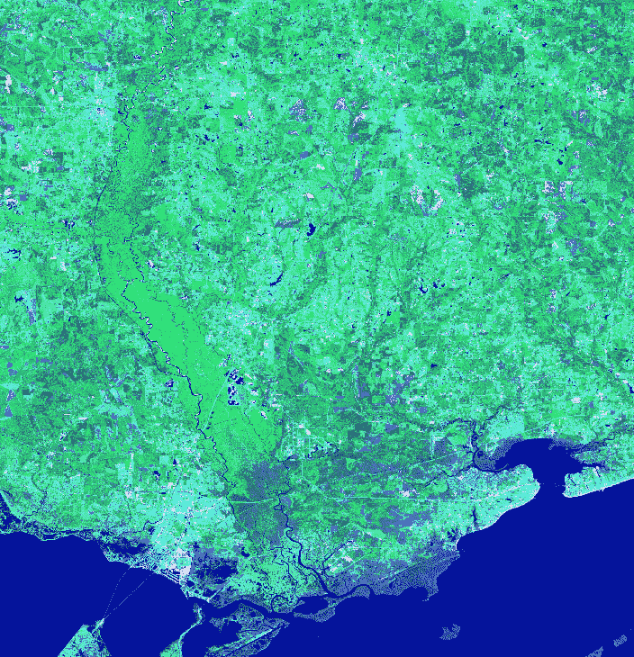

通过将`im`变量中的文件名更改为`stretched.tif`，我们可以在`stretched.tif`上运行`turtle`图形直方图脚本:

```py
im = "stretched.tif"
```

运行前面的代码会得到下面的直方图:


如你所见，这三个波段现在分布均匀。它们彼此之间的相对分布是相同的，但是，在图像中，它们现在遍布整个光谱。

现在，我们可以更改图像以获得更好的显示效果，让我们看看如何对它们进行剪裁，以检查特定的感兴趣区域。

# 剪切图像

分析师很少对整个卫星场景感兴趣，因为它可以轻松覆盖数百平方英里。鉴于卫星数据的规模，我们非常有动力将图像缩小到我们感兴趣的区域。实现这一缩减的最佳方法是将图像裁剪到定义我们研究区域的边界。我们可以使用 shapefiles(或其他向量数据)作为我们的边界定义，并基本上消除该边界之外的所有数据。

以下图像包含我们的`stretched.tif`图像，上面分层有一个县边界文件，在**量子地理信息系统** ( **量子地理信息系统**)中可视化:


要剪切图像，我们需要遵循以下步骤:

1.  使用`gdal_array`将图像加载到数组中。
2.  使用 PyShp 创建一个 shapefile 读取器。
3.  将形状文件光栅化为地理参考图像(将其从向量转换为光栅)。
4.  将 shapefile 图像转换为二进制掩码或过滤器，以便只抓取 shapefile 边界内我们想要的图像像素。
5.  透过遮罩过滤卫星图像。
6.  丢弃遮罩外的卫星图像数据。
7.  将截取的卫星图像保存为`clip.tif`。

我们在[第四章](04.html)、*地理空间 Python 工具箱*中安装了 PyShp，所以你应该已经从 PyPi 安装了。我们还将在这个脚本中添加一些有用的新实用函数。第一个是`world2pixel()`，用 GDAL GeoTransform 对象为我们做世界坐标到图像坐标的转换。

It's still the same process we've used throughout this book, but it's integrated better with GDAL.

我们还添加了`imageToArray()`函数，它将 PIL 图像转换成 NumPy 数组。县界形状文件是我们在前面章节中使用的`hancock.shp`边界，但是如果您需要，也可以在这里下载:[http://git.io/vqsRH](http://git.io/vqsRH)。

我们使用 PIL，因为这是最简单的方式光栅化我们的形状文件作为一个掩模图像，以过滤出超出形状文件边界的像素。让我们开始吧:

1.  首先，我们将加载我们需要的库:

```py
import operator
from osgeo import gdal, gdal_array, osr
import shapefile
```

2.  现在，我们将装载 PIL。这可能需要在不同的平台上以稍微不同的方式安装，因此我们必须检查这种差异:

```py
try:
 import Image
 import ImageDraw
except:
 from PIL import Image, ImageDraw
```

3.  现在，我们将为输入图像、shapefile 和输出图像设置变量:

```py
# Raster image to clip
raster = "stretched.tif"
# Polygon shapefile used to clip
shp = "hancock"
# Name of clipped raster file(s)
output = "clip"
```

4.  接下来，创建一个简单地将图像转换成`numpy`数组的函数，这样我们就可以转换将要创建的蒙版图像，并在基于 NumPy 的裁剪过程中使用它:

```py
def imageToArray(i):
 """
 Converts a Python Imaging Library array to a gdal_array image.
 """
 a = gdal_array.numpy.fromstring(i.tobytes(), 'b')
 a.shape = i.im.size[1], i.im.size[0]
 return a
```

5.  接下来，我们需要一个函数来将地理空间坐标转换为图像像素，这将允许我们使用裁剪形状文件中的坐标来限制保存哪些图像像素:

```py
def world2Pixel(geoMatrix, x, y):
 """
 Uses a gdal geomatrix (gdal.GetGeoTransform()) to calculate
 the pixel location of a geospatial coordinate
 """
 ulX = geoMatrix[0]
 ulY = geoMatrix[3]
 xDist = geoMatrix[1]
 yDist = geoMatrix[5]
 rtnX = geoMatrix[2]
 rtnY = geoMatrix[4]
 pixel = int((x - ulX) / xDist)
 line = int((ulY - y) / abs(yDist))
 return (pixel, line)
```

6.  现在，我们可以将源图像加载到一个`numpy`数组中:

```py
# Load the source data as a gdal_array array
srcArray = gdal_array.LoadFile(raster)
```

7.  我们还将源图像加载为 gdal 图像，因为`gdal_array`没有给我们将坐标转换为像素所需的地理变换信息:

```py
# Also load as a gdal image to get geotransform (world file) info
srcImage = gdal.Open(raster)
geoTrans = srcImage.GetGeoTransform()
```

8.  现在，我们将使用 Python shapefile 库来打开我们的 shapefile:

```py
# Use pyshp to open the shapefile
r = shapefile.Reader("{}.shp".format(shp))
```

9.  接下来，我们将基于源图像将 shapefile 边界框坐标转换为图像坐标:

```py
# Convert the layer extent to image pixel coordinates
minX, minY, maxX, maxY = r.bbox
ulX, ulY = world2Pixel(geoTrans, minX, maxY)
lrX, lrY = world2Pixel(geoTrans, maxX, minY)
```

10.  然后，我们可以根据 shapefile 的范围计算输出图像的大小，并只获取源图像的这一部分:

```py
# Calculate the pixel size of the new image
pxWidth = int(lrX - ulX)
pxHeight = int(lrY - ulY)
clip = srcArray[:, ulY:lrY, ulX:lrX]
```

11.  接下来，我们将为输出图像创建新的 geomatrix 数据:

```py
# Create a new geomatrix for the image
# to contain georeferencing data
geoTrans = list(geoTrans)
geoTrans[0] = minX
geoTrans[3] = maxY
```

12.  现在，我们可以从 shapefile 创建一个简单的黑白蒙版图像，它将定义我们想要从源图像中提取的像素:

```py
# Map points to pixels for drawing the county boundary
# on a blank 8-bit, black and white, mask image.
pixels = []
for p in r.shape(0).points:
 pixels.append(world2Pixel(geoTrans, p[0], p[1]))
rasterPoly = Image.new("L", (pxWidth, pxHeight), 1)
# Create a blank image in PIL to draw the polygon.
rasterize = ImageDraw.Draw(rasterPoly)
rasterize.polygon(pixels, 0)
```

13.  接下来，我们将蒙版图像转换为`numpy`数组:

```py
# Convert the PIL image to a NumPy array
mask = imageToArray(rasterPoly)
```

14.  最后，我们准备使用蒙版数组来裁剪`numpy`中的源数组，并将其保存到新的 geotiff 图像中:

```py
# Clip the image using the mask
clip = gdal_array.numpy.choose(mask, (clip, 0)).astype(
 gdal_array.numpy.uint8)
# Save ndvi as tiff
gdal_array.SaveArray(clip, "{}.tif".format(output),
 format="GTiff", prototype=raster)
```

该脚本生成以下剪切图像:

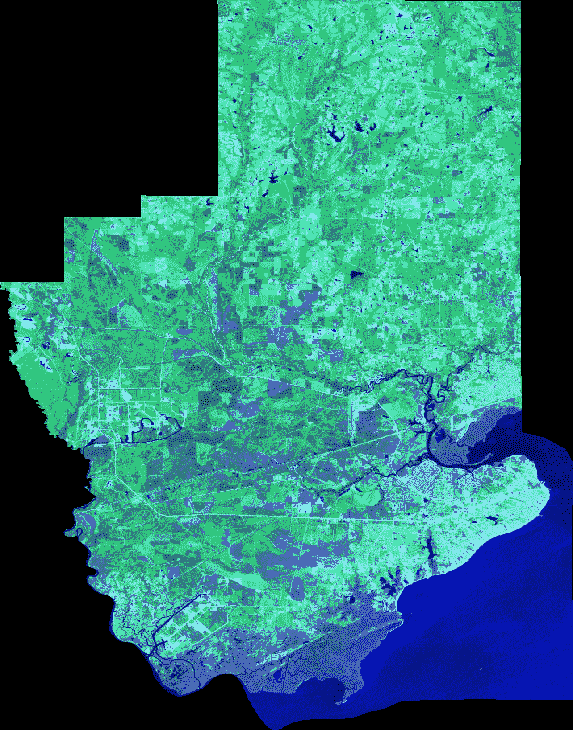

以黑色显示的保留在县界之外的区域实际上被称为`NoData`值，这意味着该位置没有信息，并且被大多数地理空间软件忽略。因为图像是矩形的，`NoData`值对于没有完全填充图像的数据是常见的。

现在，您已经完成了全球地理空间分析师每天使用的整个工作流程，以准备用于地理信息系统的多光谱卫星和航空图像。在下一节中，我们将研究如何将图像作为信息进行分析。

# 分类图像

**自动遥感** ( **ARS** )在可见光谱中很少进行。ARS 在没有任何人工输入的情况下处理图像。可见光谱之外最常见的波长是红外和近红外。

下图是从路易斯安那州新奥尔良到阿拉巴马州莫比尔的美国海湾海岸最近的陆地卫星 8 号天桥的热图像(波段 10)。图像中的主要自然特征已被标记，这样您就可以确定自己的方向:

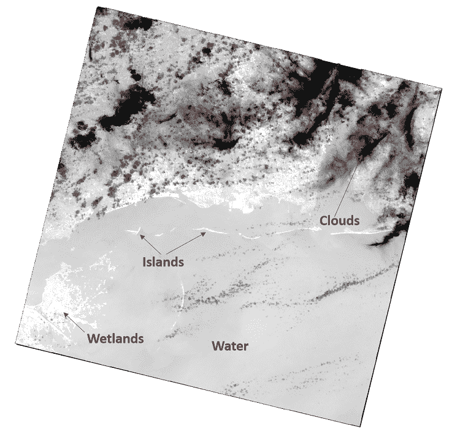

因为图像中的每个像素都有一个反射值，所以它是信息，而不仅仅是颜色。反射率的类型可以明确地告诉我们一个特征是什么，而不是我们通过看它来猜测。Python 可以看到这些值，并通过对相关像素值进行分组，以我们直观的方式挑选特征。我们可以根据像素之间的关系为像素着色，以简化图像和视图相关的特征。这种技术叫做**分类**。

分类可以是相当简单的分组，仅基于从直方图中导出的一些值分布算法，也可以是涉及训练数据集甚至计算机学习和人工智能的复杂方法。最简单的形式称为**无监督分类**，其中除了图像本身之外，没有给出额外的输入。涉及某种训练数据来指导计算机的方法称为**监督分类**。应该注意的是，分类技术被用于许多领域，从医生在患者身体扫描中搜索癌细胞，到赌场在安全视频中使用面部识别软件自动识别 21 点赌桌上已知的“T4”骗子。

为了介绍遥感分类，我们将只使用直方图来分组具有相似颜色和强度的像素，并看看我们得到了什么。首先，您需要从这里下载 Landsat 8 场景:[http://git.io/vByJu](http://git.io/vByJu)。

我们将使用 NumPy 附带的版本来代替前面示例中的`histogram()`函数，该版本允许您轻松指定仓位数量，并返回两个带有频率的数组，以及仓位值的范围。我们将使用带有范围的第二个数组作为图像的类定义。`lut`或查找表是一个任意的调色板，用于为 20 个无监督的类别分配颜色。你可以使用任何你想要的颜色。让我们看看以下步骤:

1.  首先，我们导入我们的库:

```py
import gdal
from gdal import gdal_array, osr
```

2.  接下来，我们为输入和输出图像设置一些变量:

```py
# Input file name (thermal image)
src = "thermal.tif"
# Output file name
tgt = "classified.jpg"
```

3.  将图像加载到`numpy`数组中进行处理:

```py
# Load the image into numpy using gdal
srcArr = gdal_array.LoadFile(src)
```

4.  现在，我们将创建一个包含 20 个组或`bins`的图像直方图，用于分类:

```py
# Split the histogram into 20 bins as our classes
classes = gdal_array.numpy.histogram(srcArr, bins=20)[1]
```

5.  然后，我们将创建一个查找表，它将为我们的类定义颜色范围，以便我们可以可视化它们:

```py
# Color look-up table (LUT) - must be len(classes)+1.
# Specified as R, G, B tuples
lut = [[255, 0, 0], [191, 48, 48], [166, 0, 0], [255, 64, 64], [255, 
    115, 115], [255, 116, 0], [191, 113, 48], [255, 178, 115], [0, 
    153, 153], [29, 115, 115], [0, 99, 99], [166, 75, 0], [0, 204, 
    0], [51, 204, 204], [255, 150, 64], [92, 204, 204], [38, 153, 
    38], [0, 133, 0], [57, 230, 57], [103, 230, 103], [184, 138, 0]]
```

6.  现在我们的设置已经完成，我们可以执行分类:

```py
# Starting value for classification
start = 1
# Set up the RGB color JPEG output image
rgb = gdal_array.numpy.zeros((3, srcArr.shape[0],
 srcArr.shape[1], ), gdal_array.numpy.float32)
# Process all classes and assign colors
for i in range(len(classes)):
  mask = gdal_array.numpy.logical_and(start <= srcArr, srcArr <= 
  classes[i])
 for j in range(len(lut[i])):
   rgb[j] = gdal_array.numpy.choose(mask, (rgb[j], lut[i][j]))
 start = classes[i]+1
```

7.  最后，我们可以保存我们的分类图像:

```py
# Save the image
output = gdal_array.SaveArray(rgb.astype(gdal_array.numpy.uint8), tgt, format="JPEG")
output = None
```

下图是我们的分类输出，我们刚刚将其保存为 JPEG 格式:

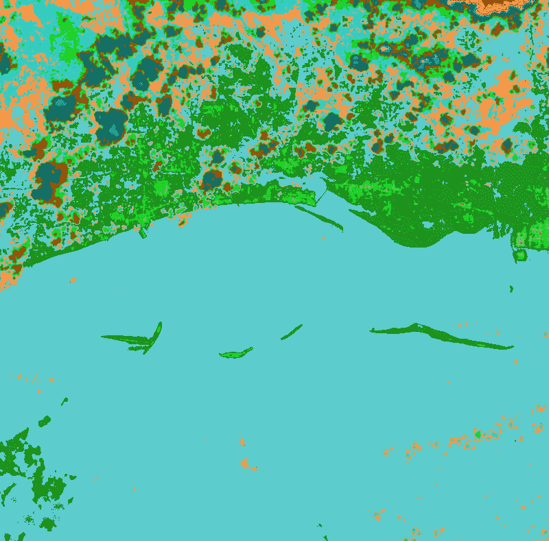

我们在将它保存为图像时没有指定原型参数，因此它没有地理参考信息，尽管我们可以很容易地将输出保存为地理识别。

这个结果对于一个非常简单的无监督分类来说还不错。岛屿和沿海的平地呈现出不同的绿色。云层被隔离成橙色和深蓝色的阴影。我们在内陆确实有一些困惑，那里的地貌颜色和墨西哥湾一样。我们可以通过手动定义类范围来进一步细化这个过程，而不仅仅是使用直方图。

现在，我们已经能够分离图像中的要素，我们可以尝试将要素提取为向量数据，以包含在地理信息系统中。

# 从图像中提取特征

对图像进行分类的能力将我们引向另一种遥感能力。既然你已经在过去的几章中使用了 shapefiles，你有没有想过它们是从哪里来的？形状文件等向量地理信息系统数据通常是从遥感图像中提取的，例如我们到目前为止看到的例子。

提取通常包括分析师点击图像中的每个对象，并绘制特征以将其保存为数据。但是有了良好的遥感数据和适当的预处理，就有可能从图像中自动提取特征。

对于这个例子，我们将从陆地卫星 8 号的热图像中提取一个子集，以隔离墨西哥湾的一组屏障岛屿。由于沙子很热，岛屿呈现白色，较冷的水呈现黑色(您可以在此下载此图片:[http://git.io/vqarj](http://git.io/vqarj)):

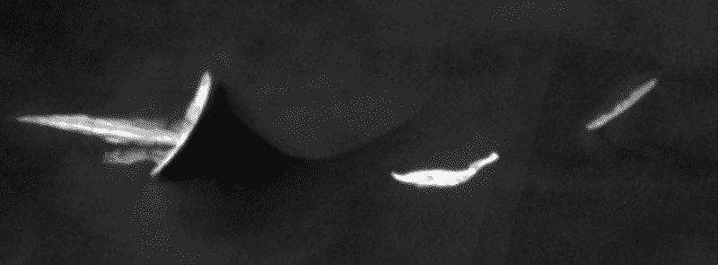

这个例子的目标是自动提取图像中的三个岛屿作为一个 shapefile。但在此之前，我们需要屏蔽掉任何我们不感兴趣的数据。例如，水的像素值范围很广，岛屿本身也是如此。如果我们只想提取岛屿本身，我们需要将所有像素值推入两个面元中，以使图像黑白化。这种技术被称为**阈值化**。图像中的岛屿与背景中的水有足够的对比度，阈值应该很好地隔离它们。

在下面的脚本中，我们将把图像读入一个数组，然后只使用两个面元对图像进行直方图。然后，我们将使用黑色和白色给两个箱子上色。这个脚本只是我们分类脚本的修改版本，输出非常有限。让我们看看以下步骤:

1.  首先，我们导入我们需要的一个库:

```py
from gdal import gdal_array
```

2.  接下来，我们定义输入和输出图像的变量:

```py
# Input file name (thermal image)
src = "islands.tif"
# Output file name
tgt = "islands_classified.tiff"
```

3.  然后，我们可以加载图像:

```py
# Load the image into numpy using gdal
srcArr = gdal_array.LoadFile(src)
```

4.  现在，我们可以设置简单的分类方案:

```py
# Split the histogram into 20 bins as our classes
classes = gdal_array.numpy.histogram(srcArr, bins=2)[1]
lut = [[255, 0, 0], [0, 0, 0], [255, 255, 255]]
```

5.  接下来，我们对图像进行分类:

```py
# Starting value for classification
start = 1
# Set up the output image
rgb = gdal_array.numpy.zeros((3, srcArr.shape[0], srcArr.shape[1], ),
 gdal_array.numpy.float32)
# Process all classes and assign colors
for i in range(len(classes)):
  mask = gdal_array.numpy.logical_and(start <= srcArr, srcArr <= 
  classes[i])
 for j in range(len(lut[i])):
   rgb[j] = gdal_array.numpy.choose(mask, (rgb[j], lut[i][j]))
   start = classes[i]+1
```

6.  最后，我们保存图像:

```py
# Save the image
gdal_array.SaveArray(rgb.astype(gdal_array.numpy.uint8),
 tgt, format="GTIFF", prototype=src) 
```

输出看起来很棒，如下图所示:

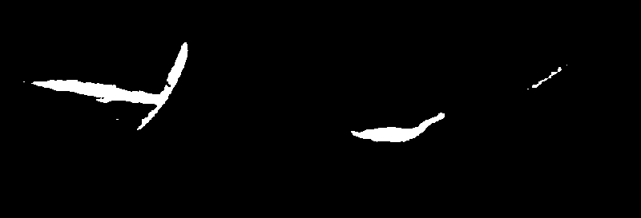

这些岛屿显然是孤立的，所以我们的提取脚本将能够识别它们为多边形，并将它们保存到一个 shapefile 中。GDAL 库有一个名为`Polygonize()`的方法，它就是这么做的。它将图像中的所有孤立像素集合分组，并将其保存为要素数据集。我们将在这个脚本中使用的一个有趣的技术是使用我们的输入图像作为遮罩。

`Polygonize()`方法允许您指定一个遮罩，该遮罩将使用黑色作为过滤器，以防止水被提取为多边形，我们最终只会得到岛屿。脚本中需要注意的另一个方面是，我们将源图像中的地理参考信息复制到 shapefile 中，以便对其进行正确的地理定位。让我们看看以下步骤:

1.  首先，我们导入我们的库:

```py
import gdal
from gdal import ogr, osr
```

2.  接下来，我们设置输入和输出图像和 shapefile 变量:

```py
# Thresholded input raster name
src = "islands_classified.tiff"
# Output shapefile name
tgt = "extract.shp"
# OGR layer name
tgtLayer = "extract"
```

3.  让我们打开输入图像，获取第一个也是唯一一个波段:

```py
# Open the input raster
srcDS = gdal.Open(src)
# Grab the first band
band = srcDS.GetRasterBand(1)
```

4.  然后，我们会告诉`gdal`用那根带子作为面具:

```py
# Force gdal to use the band as a mask
mask = band
```

5.  现在，我们准备好设置我们的 shapefile:

```py
# Set up the output shapefile
driver = ogr.GetDriverByName("ESRI Shapefile")
shp = driver.CreateDataSource(tgt)
```

6.  然后，我们需要将我们的空间参考信息从源图像复制到 shapefile，以在地球上定位它:

```py
# Copy the spatial reference
srs = osr.SpatialReference()
srs.ImportFromWkt(srcDS.GetProjectionRef())
layer = shp.CreateLayer(tgtLayer, srs=srs)
```

7.  现在，我们可以设置我们的 shapefile 属性:

```py
# Set up the dbf file
fd = ogr.FieldDefn("DN", ogr.OFTInteger)
layer.CreateField(fd)
dst_field = 0
```

8.  最后，我们可以提取我们的多边形:

```py
# Automatically extract features from an image!
extract = gdal.Polygonize(band, mask, layer, dst_field, [], None) 
```

输出的 shapefile 简称为`extract.shp`。您可能还记得[第 4 章](04.html)、*地理空间 Python 工具箱*中，我们使用 PyShp 和 PNG Canvas 创建了一个快速的纯 Python 脚本来可视化形状文件。我们将把这个脚本带回这里，这样我们就可以查看我们的 shapefile 了，但是我们会给它添加一些额外的东西。最大的岛屿有一个小泻湖，在多边形中显示为一个洞。为了正确地渲染它，我们必须处理 shapefile 记录中的部分。

使用该脚本的前一个示例没有做到这一点，因此我们将在以下步骤中循环访问 shapefile 特性时添加该部分:

1.  首先，我们需要导入我们需要的库:

```py
import shapefile
import pngcanvas
```

2.  接下来，我们从 shapefile 中获取空间信息，这将允许我们将坐标映射到像素:

```py
r = shapefile.Reader("extract.shp")
xdist = r.bbox[2] - r.bbox[0]
ydist = r.bbox[3] - r.bbox[1]
iwidth = 800
iheight = 600
xratio = iwidth/xdist
yratio = iheight/ydist
```

3.  现在，我们将创建一个列表来保存我们的多边形:

```py
polygons = []
```

4.  然后，我们将遍历 shapefile 并收集我们的多边形:

```py
for shape in r.shapes():
 for i in range(len(shape.parts)):
 pixels = []
 pt = None
 if i < len(shape.parts)-1:
   pt = shape.points[shape.parts[i]:shape.parts[i+1]]
 else:
   pt = shape.points[shape.parts[i]:]
```

5.  接下来，我们将每个点映射到一个图像像素:

```py
 for x, y in pt:
   px = int(iwidth - ((r.bbox[2] - x) * xratio))
   py = int((r.bbox[3] - y) * yratio)
   pixels.append([px, py])
 polygons.append(pixels)
```

6.  接下来，我们使用`PNGCanvas`中的多边形像素信息绘制图像:

```py
c = pngcanvas.PNGCanvas(iwidth, iheight)
for p in polygons:
 c.polyline(p)
```

7.  最后，我们保存图像:

```py
with open("extract.png", "wb") as f:
    f.write(c.dump())
    f.close()
```

下图显示了我们自动提取的岛屿特征:


做这种工作的商业包装很容易花费数万美元。虽然这些包非常健壮，但是看看用简单的 Python 脚本和一些开源包能走多远仍然很有趣，也很有力量。在很多情况下，你可以做任何你需要做的事情。

最西边的岛包含多边形洞，如下图所示，并在该区域放大:

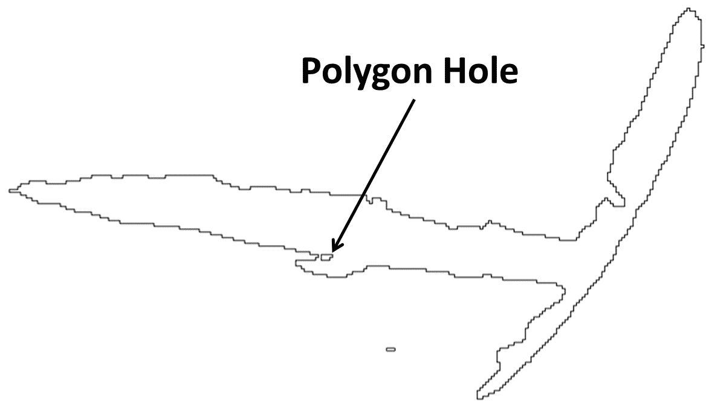

If you want to see what would happen if we didn't deal with the polygon holes, then just run the version of the script from [Chapter 4](04.html), *Geospatial Python Toolbox*, on this same shapefile to compare the difference. The lagoon is not easy to see, but you will find it if you use the other script.

自动特征提取是地理空间分析中的一个圣杯，因为手动提取特征需要成本和繁琐的工作。特征提取的关键是正确的图像分类。自动特征提取适用于水体、岛屿、道路、农田、建筑物和其他往往与其背景具有高对比度像素值的特征。

现在，您已经很好地掌握了使用 GDAL、NumPy 和 PIL 来处理遥感数据。是时候进入我们最复杂的例子了:变化检测。

# 理解变化检测

变化检测是从两个不同的日期拍摄完全相同区域的两幅地理配准图像并自动识别差异的过程。它实际上只是图像分类的另一种形式。就像我们之前的分类例子一样，它可以从这里使用的琐碎技术，到提供惊人精确结果的高度复杂的算法。

在这个例子中，我们将使用来自沿海地区的两幅图像。这些图像显示了一场大飓风前后的人口密集区域，因此存在显著差异，其中许多很容易在视觉上发现，这使得这些样本有利于学习变化检测。我们的技术是简单地从第二幅图像中减去第一幅图像，使用 NumPy 得到一个简单的图像差。这是一种有效且常用的技术。

优点是全面，非常可靠。这种过于简单的算法的缺点是它不能隔离变化的类型。许多变化对于分析来说是微不足道的，比如海洋上的波浪。在这个例子中，我们将相当有效地掩盖水，以避免分散注意力，并且只关注差图像直方图右侧的较高反射率值。

You can download the baseline image from [http://git.io/vqa6h](http://git.io/vqa6h).
You can download the changed image from [http://git.io/vqaic](http://git.io/vqaic).
Note these images are quite large – 24 MB and 64 MB, respectively!

基线图像是全色的，而改变的图像是假彩色的。全色图像是由捕获所有可见光的传感器创建的，并且是典型的高分辨率传感器，而不是捕获包含受限波长的波段的多光谱传感器。

通常情况下，您会使用两个相同的波段组合，但这些样本将适用于我们的目的。我们可以用来评估变化检测的视觉标记包括图像东南象限中的一座桥，该桥从半岛延伸到图像边缘。这座桥在之前的图像中清晰可见，被飓风夷为平地。另一个标记是西北象限中的一艘船，它在后面的图像中显示为白色踪迹，但不在前面的图像中。

一个中性标志是水和国家公路，它穿过城镇并连接到桥梁。这个特征很容易看得见，在两幅图像之间没有明显的变化。以下是基线图像的屏幕截图:

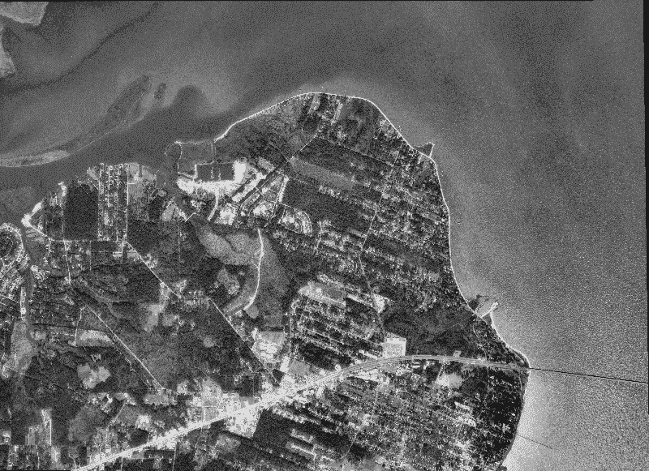

要近距离查看这些图像，您应该使用 QGIS 或 OpenEV (FWTools)，如 [第 3 章](03.html)*地理空间技术景观*中*量子 GIS 和 OpenEv* 部分所述，以便轻松查看。下图是后一张图片:

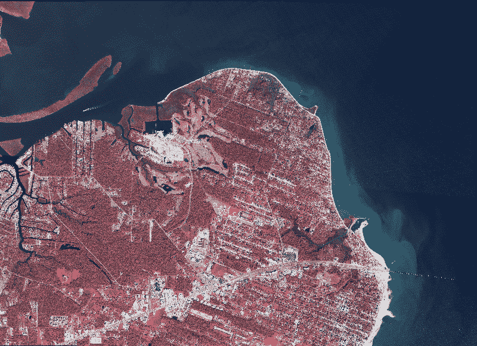

因此，让我们执行变更检测:

1.  首先，我们加载库:

```py
import gdal
from gdal import gdal_array
import numpy as np
```

2.  现在，我们为输入和输出图像设置变量:

```py
# "Before" image
im1 = "before.tif"
# "After" image
im2 = "after.tif"
```

3.  接下来，我们用`gdal_array`将两幅图像读入 NumPy 数组:

```py
# Load before and after into arrays
ar1 = gdal_array.LoadFile(im1).astype(np.int8)
ar2 = gdal_array.LoadFile(im2)[1].astype(np.int8)
```

4.  现在，我们从后图像中减去前图像(差值=后–前):

```py
# Perform a simple array difference on the images
diff = ar2 - ar1
```

5.  然后，我们将图像分为五类:

```py
# Set up our classification scheme to try
# and isolate significant changes
classes = np.histogram(diff, bins=5)[1]
```

6.  接下来，我们将我们的颜色表设置为使用黑色来遮盖下层阶级。我们这样做是为了过滤水和道路，因为它们在图像中较暗:

```py
# The color black is repeated to mask insignificant changes
lut = [[0, 0, 0], [0, 0, 0], [0, 0, 0], [0, 0, 0], [0, 255, 0], [255, 0, 0]]
```

7.  然后，我们给类分配颜色:

```py
# Starting value for classification
start = 1
# Set up the output image
rgb = np.zeros((3, diff.shape[0], diff.shape[1], ), np.int8)
# Process all classes and assign colors
for i in range(len(classes)):
 mask = np.logical_and(start <= diff, diff <= classes[i])
 for j in range(len(lut[i])):
 rgb[j] = np.choose(mask, (rgb[j], lut[i][j]))
 start = classes[i]+1
```

8.  最后，我们保存我们的图像:

```py
# Save the output image
output = gdal_array.SaveArray(rgb, "change.tif", format="GTiff", prototype=im2)
output = None
```

以下是我们最初的差异图像:

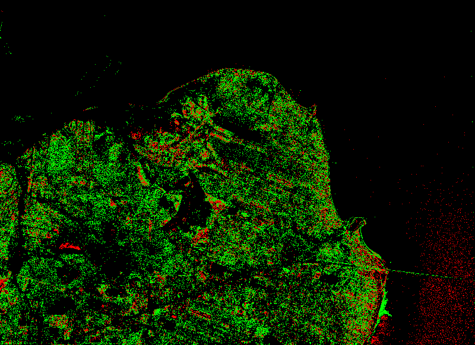

在大多数情况下，绿色类别代表添加了内容的区域。红色将是一个较暗的值，可能会删除一些东西。我们可以看到西北象限的船迹是绿色的。我们还可以看到植被的许多变化，这是由于季节差异所预期的。这座桥是一个异常，因为暴露的桩比原始桥的深色表面更亮，这使它们变成绿色而不是红色。

混凝土是变化检测的主要指标，因为它在阳光下非常明亮，通常是新发展的标志。相反，如果一栋建筑被拆除，混凝土被移除，区别也很容易识别。因此，我们在这里使用的简单差分算法并不完美，但是可以使用阈值、掩蔽、更好的类定义和其他技术来大大改进它。

要真正欣赏我们的变化检测产品，您可以将其覆盖在 QGIS 中的“之前”或“之后”图像上，并将黑色设置为透明，如下图所示:

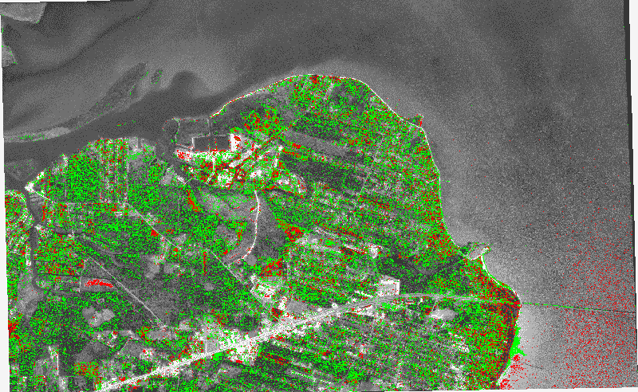

您可以将这种变化检测分析与要素提取示例相结合，将变化提取为可在地理信息系统中有效分析的向量数据。

# 摘要

在本章中，我们介绍了遥感的基础，包括波段交换、直方图、图像分类、特征提取和变化检测。像在其他章节中一样，我们尽可能地接近纯 Python，在我们为了处理速度而妥协的地方，我们尽可能地限制软件库以保持简单。但是，如果你安装了本章中的工具，你就真的有了一个完整的遥感包，它只受你学习欲望的限制。

本章中的技术是所有遥感过程的基础，将允许您构建更复杂的操作。

在下一章中，我们将研究高程数据。高程数据不完全适合地理信息系统或遥感，因为它具有两种类型的处理元素。

# 进一步阅读

GDAL 的作者有一组 Python 示例，涵盖了许多您可能感兴趣的高级主题。可以在[https://github . com/OSGeo/gdal/tree/master/gdal/swig/python/samples](https://github.com/OSGeo/gdal/tree/master/gdal/swig/python/samples)找到。