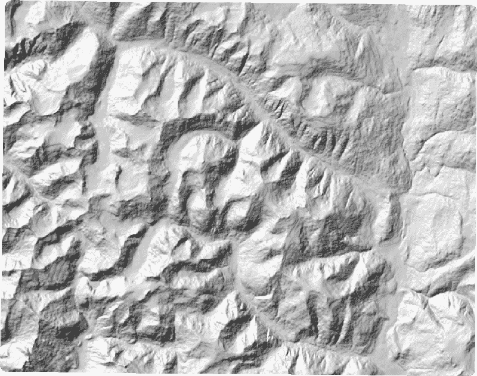
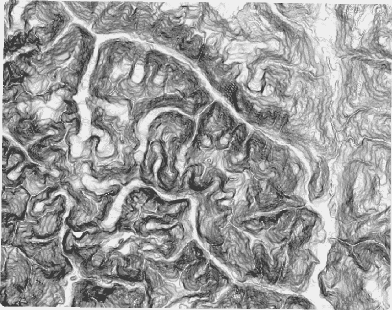
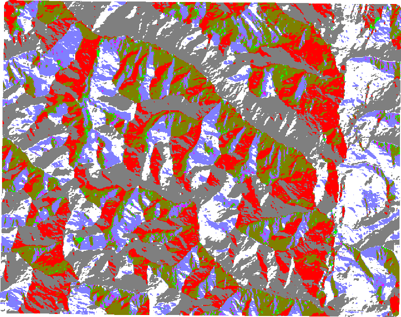
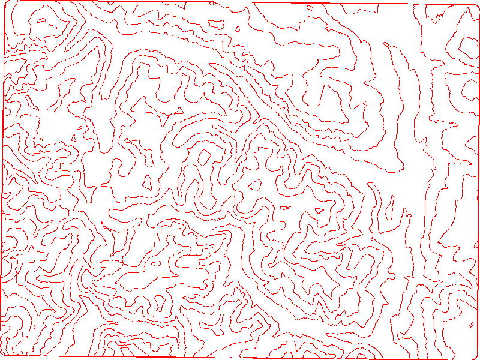
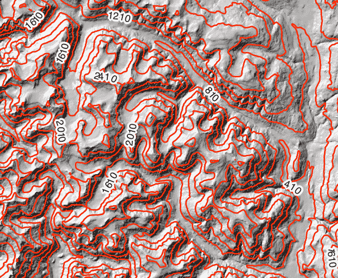
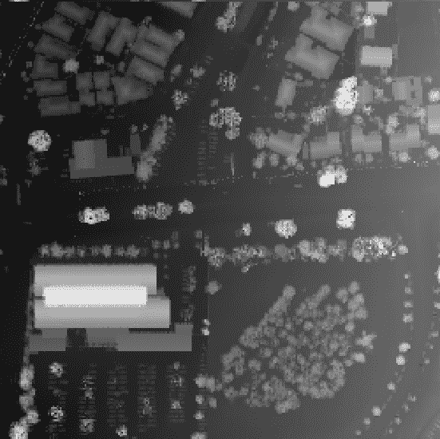
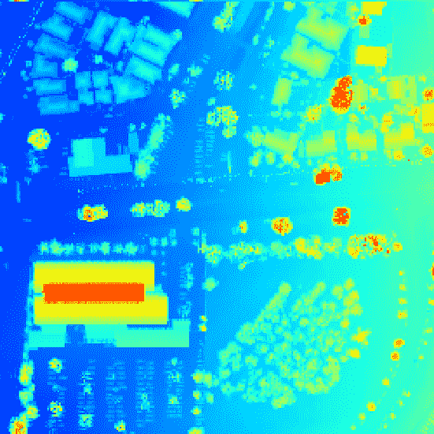
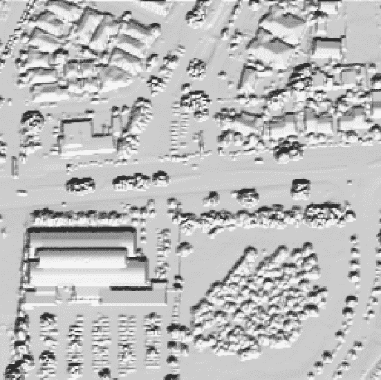
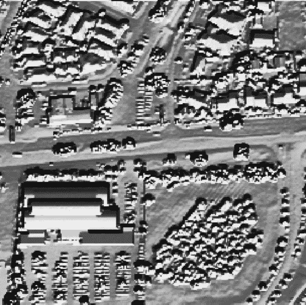
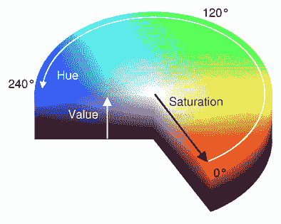

# Python 和高程数据

高程数据是最迷人的地理空间数据类型之一。它代表许多不同类型的数据源和格式。它可以显示矢量和栅格数据的属性，从而产生独特的数据产品。高程数据可用于地形可视化、土地覆盖分类、水文建模、运输路线、特征提取和许多其他目的。

栅格数据和矢量数据不能执行所有这些选项，但是由于高程数据是三维的，由于包含 *x* 、 *y* 和 *z* 坐标，您通常可以从这些数据中获得比任何其他类型更多的信息。

在本章中，我们将涵盖以下主题:

*   使用 ASCII 网格高程数据文件进行简单的高程处理
*   创建阴影浮雕图像
*   创建高程等高线
*   激光雷达数据网格化
*   创建三维网格

在本章中，您将学习如何读写栅格和矢量格式的高程数据。我们还将创造一些衍生产品。

# 访问 ASCII 网格文件

在本章的大部分内容中，我们将使用 ASCII 网格文件。这些文件是一种栅格数据，通常与高程数据相关联。这种网格格式将数据以文本形式存储在大小相等的方形行和列中，并带有简单的标题。行/列中的每个单元格存储一个数值，该数值可以表示地形的某些特征，如海拔、坡度或流向。简单性使其成为一种易于使用且独立于平台的栅格格式。这种格式在[第二章](02.html)*学习地理空间数据*的 *ASCII 网格*一节中有描述。

在本书中，我们一直依赖 GDAL，在某种程度上甚至依赖 PIL 来读写地理空间栅格数据，包括`gdalnumeric`模块，这样我们就可以将栅格数据加载到 NumPy 数组中。ASCII Grid 允许我们仅使用 Python 甚至 NumPy 读写栅格，因为它是简单的纯文本。

As a reminder, some elevation datasets use image formats to store elevation data. Most image formats only support 8-bit values ranging from between 0 to 255; however, some formats, including TIFF, can store larger values.

Geospatial software can typically display these datasets; however, traditional image software and libraries usually don't. For simplicity, in this chapter, we'll mostly stick to the ASCII Grid format for data, which is both human and machine-readable, as well as widely supported.

# 阅读网格

NumPy 能够使用其`loadtxt()`方法直接读取 ASCII Grid 格式，该方法旨在从文本文件中读取数组。前六行由标头组成，标头不是数组的一部分。以下几行是网格标题的示例:

```py
ncols 250
nrows 250
xllcorner 277750.0
yllcorner 6122250.0
cellsize 1.0
NODATA_value -9999
```

让我们看看前面代码中的每一行包含什么:

*   第 1 行包含网格中的列数，与 *x* 轴同义。
*   第 2 行将 *y* 轴表示为行数。
*   第 3 行表示左下角的 *x* 坐标，是以米为单位的最小 *x* 值。
*   第 4 行是网格左下角对应的最小 *y* 值。
*   第 5 行是栅格的像元大小或分辨率。由于像元是正方形的，因此只需要一个大小值，而大多数地理空间栅格中的分辨率值是分开的 *x* 和 *y* 。
*   第 6 行是`NODATA_value`，这是一个分配给任何没有提供值的单元格的数字。

地理空间软件在计算时会忽略这些单元格，并且通常允许对其进行特殊的显示设置，例如将其设为黑色或透明。`-9999`值是一个常见的无数据占位符值，在行业中使用，在软件中很容易检测到，但可以任意选择。例如，负值的高程(即水深测量)可能在`-9999`米处具有有效数据，并且可能选择`9999`或其他值。只要在标题中定义了这个值，大多数软件都不会有问题。在一些例子中，我们将使用数字零；然而，零通常也可以是有效的数据值。

`numpy.loadtxt()`方法包括一个名为`skiprows`的参数，它允许您在读取数组值之前指定文件中要跳过的行数。

To try out this technique, you can download a sample grid file called `myGrid.asc` from [http://git.io/vYapU](http://git.io/vYapU).

因此，对于`myGrid.asc`，我们将使用以下代码:

```py
myArray  = numpy.loadtxt("myGrid.asc", skiprows=6)
```

这一行导致`myArray`变量包含一个从 ascigrid`myGrid.asc`文件派生的`numpy`数组。ASC 文件扩展名由 ASCIIGRID 格式使用。这段代码很好用，但是有一个问题。NumPy 允许我们跳过标题，但不能保留它。我们需要保持这一点，以便我们的数据有一个空间参考。我们还将使用它来保存这个网格或创建一个新的网格。

为了解决这个问题，我们将使用 Python 内置的`linecache`模块来抓取头部。我们可以打开文件，遍历这些行，将每一行存储在一个变量中，然后关闭文件。但是，`linecache`将解决方案简化为一行。下面一行将文件的第一行读入一个名为`line1`的变量:

```py
import linecache
line1 = linecache.getline("myGrid.asc", 1)
```

在本章的示例中，我们将使用这种技术来创建一个简单的头处理器，它可以用几行代码将这些头解析成 Python 变量。现在我们知道如何阅读网格，让我们学习如何编写它们。

# 书写网格

用 NumPy 写网格和读网格一样简单。我们使用相应的`numpy.savetxt()`函数将一个网格保存到一个文本文件中。唯一的问题是，在将数组转储到文件之前，我们必须构建并添加六行标题信息。对于不同版本的 NumPy，此过程略有不同。在这两种情况下，首先将头构建为字符串。如果您使用的是 NumPy 1.7 或更高版本，`savetext()`方法有一个名为 header 的可选参数，允许您指定一个字符串作为参数。您可以使用以下命令从命令行快速检查您的 NumPy 版本:

```py
python -c "import numpy;print(numpy.__version__)"
1.8.2
```

向后兼容的方法是打开一个文件，写入头，然后转储数组。下面是将名为`myArray`的数组保存到名为`myGrid.asc`的 ASCIIGRID 文件的 1.7 版本方法示例:

```py
header = "ncols {}\n".format(myArray.shape[1])
header += "nrows {}\n".format(myArray.shape[0])
header += "xllcorner 277750.0\n"
header += "yllcorner 6122250.0\n"
header += "cellsize 1.0\n"
header += "NODATA_value -9999"
numpy.savetxt("myGrid.asc", myArray, header=header, fmt="%1.2f")
```

我们使用 Python 格式字符串，这允许您在字符串中放置占位符来格式化要插入的 Python 对象。`{}`格式变量将您引用的对象转换为字符串。在这种情况下，我们引用数组中的列数和行数。

在 NumPy 中，数组有两个属性:

*   大小:返回一个整数作为数组中值的个数。
*   Shape:它返回一个元组，分别包含行数和列数。

因此，在前面的示例中，我们使用 shape 属性 tuple 将行数和列数添加到 ASCII 网格的标题中。请注意，我们还为每一行添加了一个尾随换行符(`\n`)。没有理由更改`x`和`y`值、单元格大小或无数据值，除非我们在脚本中更改它们。

`savetxt()`方法还有一个`fmt`参数，它允许您使用 Python 格式字符串来指定数组值的写入方式。在这种情况下，`%1.2f`值指定至少有一个数字且不超过两位小数的浮点数。1.6 之前的 NumPy 向后兼容版本以相同的方式构建头字符串，但首先创建文件句柄:

```py
with open("myGrid.asc", "w") as f:
 f.write(header)
 numpy.savetxt(f, str(myArray), fmt="%1.2f")
```

正如您将在接下来的示例中看到的，这种仅使用 NumPy 生成有效地理空间数据文件的能力非常强大。在接下来的几个例子中，我们将使用加拿大不列颠哥伦比亚省温哥华附近山区的 ascigrid**数字高程模型** ( **DEM** )。

You can download this sample as a ZIP file at the following URL: [http://git.io/vYwUX](http://git.io/vYwUX).

下图是使用 QGIS 着色的原始数字高程模型，其色带使较低的高程值为深蓝色，较高的高程值为鲜红色:


虽然我们可以用这种方式从概念上理解数据，但这不是一种直观的数据可视化方式。让我们看看是否可以通过创建阴影浮雕做得更好。

# 创建阴影浮雕

阴影地形图以这样一种方式对高程进行着色，即地形看起来像是在低角度光线下投射的，这会产生亮点和阴影。这种美学风格创造了一种近乎摄影的错觉，很容易掌握，这样我们就可以理解地形的变化。需要注意的是，这种风格确实是一种错觉，因为从太阳角度来看，光线通常在物理上是不准确的，并且仰角通常被夸大以增加对比度。

在本例中，我们将使用之前引用的 ASCII 数字高程模型来创建另一个网格，该网格表示 NumPy 中地形的阴影浮雕版本。这个地形相当动态，所以我们不需要夸大海拔；但是，该脚本有一个名为`z`的变量，可以从 1.0 开始增加，以放大高程。

在我们定义了包括输入和输出文件名在内的所有变量之后，我们将看到基于`linecache`模块的标题解析器，它也使用 Python 列表理解来循环和解析行，然后将这些行从列表中拆分成六个变量。我们还创建了一个名为`ycell`的`y`细胞大小，它与常规细胞大小正好相反。如果我们不这样做，得到的网格将被转置。

Note that we define filenames for slope and aspect grids, which are two intermediate products that are combined to create the final product. These intermediate grids are output as well. They can also serve as inputs to other types of products.

该脚本使用三乘三的窗口方法来扫描图像，并平滑这些小网格中的中心值，以有效地处理图像。它是在计算机内存限制的情况下完成的。然而，因为我们使用的是 NumPy，所以我们可以通过矩阵一次处理整个数组，而不是使用一系列冗长的嵌套循环。这项技术是基于一位名叫 Michal Migurski 的开发人员的出色工作，他实现了马修·派瑞 C++实现的智能 NumPy 版本，该版本是 GDAL 套件中 DEM 工具的基础。

计算完坡度和坡向后，它们将用于输出着色地形。坡度是小山或山的陡度，而坡向是网格单元面向的方向，指定为 0 到 360 度之间的角度。最后，所有内容都从 NumPy 保存到磁盘。在`savetxt()`方法中，我们指定一个四整数格式的字符串，因为峰值海拔是几千米:

1.  首先，我们将导入`linecache`模块来解析头部，导入`numpy`模块来进行处理:

```py
from linecache import getline
import numpy as np
```

2.  接下来，我们将设置定义如何处理着色浮雕的所有变量名:

```py
# File name of ASCII digital elevation model
source = "dem.asc"

# File name of the slope grid
slopegrid = "slope.asc"

# File name of the aspect grid
aspectgrid = "aspect.asc"

# Output file name for shaded relief
shadegrid = "relief.asc"

# Shaded elevation parameters
# Sun direction
azimuth = 315.0

# Sun angle
altitude = 45.0

# Elevation exageration
z = 1.0

# Resolution
scale = 1.0

# No data value for output
NODATA = -9999

# Needed for numpy conversions
deg2rad = 3.141592653589793 / 180.0
rad2deg = 180.0 / 3.141592653589793
```

3.  现在我们的变量已经设置好了，我们可以解析标题:

```py
# Parse the header using a loop and
# the built-in linecache module
hdr = [getline(source, i) for i in range(1, 7)]
values = [float(h.split(" ")[-1].strip()) for h in hdr]
cols, rows, lx, ly, cell, nd = values
xres = cell
yres = cell * -1
```

4.  接下来，我们可以通过跳过标题部分使用`numpy`加载实际数据:

```py
# Load the dem into a numpy array
arr = np.loadtxt(source, skiprows=6)
```

5.  我们将逐行、逐列地循环数据，来处理它。但是，请注意，我们将跳过包含 nodata 值的外边缘。我们将把数据分成 3×3 像素的小网格，因为对于每个网格单元，我们需要看到它周围的单元:

```py
# Exclude 2 pixels around the edges which are usually NODATA.
# Also set up structure for 3 x 3 windows to process the slope
# throughout the grid
window = []
for row in range(3):
 for col in range(3):
 window.append(arr[row:(row + arr.shape[0] - 2),
 col:(col + arr.shape[1] - 2)])

# Process each 3x3 window in both the x and y directions
x = ((z * window[0] + z * window[3] + z * window[3] + z * 
 window[6]) -
 (z * window[2] + z * window[5] + z * window[5] + z * 
 window[8])) / \
 (8.0 * xres * scale)
y = ((z * window[6] + z * window[7] + z * window[7] + z * 
 window[8]) -
 (z * window[0] + z * window[1] + z * window[1] + z * 
 window[2])) / \
 (8.0 * yres * scale)
```

6.  对于每个 3×3 的迷你窗口，我们将计算`slope`、`aspect`，然后计算`shaded`浮雕值:

```py
# Calculate slope
slope = 90.0 - np.arctan(np.sqrt(x * x + y * y)) * rad2deg

# Calculate aspect
aspect = np.arctan2(x, y)

# Calculate the shaded relief
shaded = np.sin(altitude * deg2rad) * np.sin(slope * deg2rad) + \
 np.cos(altitude * deg2rad) * np.cos(slope * deg2rad) * \
 np.cos((azimuth - 90.0) * deg2rad - aspect)
```

7.  接下来，我们需要在 0-255 之间缩放每个值，以便可以将其视为图像:

```py
# Scale values from 0-1 to 0-255
shaded = shaded * 255
```

8.  现在，我们必须重建头部，因为我们忽略了 nodata 值的外边缘，并且数据集较小:

```py
# Rebuild the new header
header = "ncols {}\n".format(shaded.shape[1])
header += "nrows {}\n".format(shaded.shape[0])
header += "xllcorner {}\n".format(lx + (cell * (cols - 
 shaded.shape[1])))
header += "yllcorner {}\n".format(ly + (cell * (rows - 
 shaded.shape[0])))
header += "cellsize {}\n".format(cell)
header += "NODATA_value {}\n".format(NODATA)
```

9.  接下来，我们将把任何 nodata 值设置为我们在开始时在变量中设置的所选 nodata 值:

```py

# Set no-data values
for pane in window:
 slope[pane == nd] = NODATA
 aspect[pane == nd] = NODATA
 shaded[pane == nd] = NODATA
```

10.  我们将分别保存坡度网格和坡向网格，以便以后查看它们，并了解如何创建着色浮雕:

```py
# Open the output file, add the header, save the slope grid
with open(slopegrid, "wb") as f:
 f.write(bytes(header, "UTF-8")
 np.savetxt(f, slope, fmt="%4i")

# Open the output file, add the header, save the aspectgrid
with open(aspectgrid, "wb") as f:
 f.write(bytes(header, "UTF-8")
 np.savetxt(f, aspect, fmt="%4i")

# Open the output file, add the header, save the relief grid
with open(shadegrid, "wb") as f:
 f.write(bytes(header, 'UTF-8'))
 np.savetxt(f, shaded, fmt="%4i")
```

如果我们将输出着色浮雕网格加载到 QGIS 并指定样式以将图像拉伸到最小值和最大值，我们将看到以下图像:



如果 QGIS 问你要投影，数据是 EPSG:3157。您也可以在我们在[第 4 章](04.html)、*地理空间 Python 工具箱*的*安装 GDAL* 部分讨论的 FWTools OpenEV 应用程序中打开图像，该应用程序将自动拉伸图像以获得最佳查看效果。

如您所见，前面的图像比我们最初检查的伪彩色表示更容易理解。接下来，让我们看看用于创建着色浮雕的坡度栅格:



斜率显示了数据集所有方向上从高点到低点的高程逐渐下降。对于许多类型的水文模型，坡度是一个特别有用的输入:



坡向显示了从一个像元到其相邻像元的最大下坡变化率。如果将纵横比图像与着色浮雕图像进行比较，您将看到纵横比图像的红色和灰色值对应于着色浮雕中的阴影。因此，坡度主要负责将数字高程模型转换为地形起伏，而坡向负责着色。

现在我们可以用一种有用的方式显示数据，让我们看看我们是否也可以从中创建其他数据。

# 创建高程等高线

等高线是数据集中沿同一高程的等值线。等高线通常以一定的间隔步进，以创建一种直观的方式来表示高程数据，包括视觉和数字，使用资源高效的矢量数据集。现在，让我们看看另一种使用等高线更好地可视化高程的方法。

输入用于在我们的数字高程模型中生成等高线，输出是一个形状文件。用于生成轮廓的算法(行进的正方形:[https://en.wikipedia.org/wiki/Marching_squares](https://en.wikipedia.org/wiki/Marching_squares))相当复杂，并且很难使用 NumPy 的线性代数来实现。在这种情况下，我们的解决方案是依靠 GDAL 库，它有一个通过 Python 应用编程接口可用的轮廓绘制方法。事实上，这个脚本的大部分只是设置输出 shapefile 所需的 OGR 库代码。实际的轮廓绘制是一个名为`gdal.ContourGenerate()`的单一方法调用。就在这个调用之前，有定义方法参数的注释。最重要的如下:

*   `contourInterval`:这是等高线之间的数据集单位距离。
*   `contourBase`:这是等高线的起始高程。
*   `fixedLevelCount`:相对于距离，这指定了固定数量的轮廓。
*   `idField`:这是一个必需的 shapefile `dbf`字段的名称，通常只叫 ID。
*   `elevField`:这是高程值所需的 shapefile `dbf`字段的名称，对于地图中的标注非常有用。

你应该从[第四章](04.html)*地理空间 Python 工具箱*的*安装 GDAL* 部分安装 GDAL 和 OGR。我们将实施以下步骤:

1.  首先，我们将定义输入的数字高程模型文件名。
2.  然后，我们将输出 shapefile 的名称。
3.  接下来，我们将使用 OGR 创建 shapefile 数据源。
4.  然后，我们将得到 OGR 层。
5.  接下来，我们将打开数字高程模型。
6.  最后，我们将在 OGR 图层上生成等高线。

让我们看一下前面步骤的代码表示:

1.  首先，我们加载`gdal`和`ogr`库来处理数据:

```py
import gdal
import ogr
```

2.  然后我们将为文件名设置一个变量:

```py
# Elevation DEM
source = "dem.asc"
```

3.  接下来，我们将使用 OGR 创建输出 shapefile 的开头:

```py
# Output shapefile
target = "contour"
ogr_driver = ogr.GetDriverByName("ESRI Shapefile")
ogr_ds = ogr_driver.CreateDataSource(target + ".shp")
ogr_lyr = ogr_ds.CreateLayer(target, 
# wkbLineString25D is the type code for geometry with a z 
# elevation value.
geom_type=ogr.wkbLineString25D)
field_defn = ogr.FieldDefn("ID" ogr.OFTInteger)
ogr_lyr.CreateField(field_defn)
field_defn = ogr.FieldDefn("ELEV" ogr.OFTReal)
ogr_lyr.CreateField(field_defn)
```

4.  然后，我们将创建一些轮廓:

```py
# gdal.ContourGenerate() arguments
# Band srcBand,
# double contourInterval,
# double contourBase,
# double[] fixedLevelCount,
# int useNoData,
# double noDataValue,
# Layer dstLayer,
# int idField,
# int elevField
ds = gdal.Open(source)

# EPGS:3157
gdal.ContourGenerate(ds.GetRasterBand(1), 400, 10, [], 0, 0, ogr_lyr, 0, 1))
ogr_ds = None
```

5.  现在，让我们使用`pngcanvas`绘制刚刚创建的轮廓形状文件，这是我们在[第 4 章](04.html)*地理空间 Python 工具箱*的 *PNGCanvas* 部分中介绍的:

```py
import shapefile
import pngcanvas

# Open the contours
r = shapefile.Reader("contour.shp")

# Setup the world to pixels conversion
xdist = r.bbox[2] - r.bbox[0]
ydist = r.bbox[3] - r.bbox[1]
iwidth = 800
iheight = 600
xratio = iwidth/xdist
yratio = iheight/ydist
contours = []

# Loop through all shapes
for shape in r.shapes():
 # Loop through all parts
 for i in range(len(shape.parts)):
   pixels = []
   pt = None
   if i < len(shape.parts) - 1:
     pt = shape.points[shape.parts[i]:shape.parts[i+1]]
   else:
     pt = shape.points[shape.parts[i]:]
   for x, y in pt:
     px = int(iwidth - ((r.bbox[2] - x) * xratio))
     py = int((r.bbox[3] - y) * yratio)
     pixels.append([px, py])
     contours.append(pixels)

# Set up the output canvas
canvas = pngcanvas.PNGCanvas(iwidth, iheight)

# PNGCanvas accepts rgba byte arrays for colors
red = [0xff, 0, 0, 0xff]
canvas.color = red

# Loop through the polygons and draw them
for c in contours:
 canvas.polyline(c)

# Save the image
with open("contours.png", "wb") as f:
 f.write(canvas.dump())
```

我们将以下面的图像结束:



如果我们将我们的着色浮雕 ASCIIGRID 和 shapefile 带入一个 GIS，比如 QGIS，我们可以创建一个简单的地形图，如下所示。您可以使用在脚本中指定的高程(即`ELEV` ) `dbf`字段，用高程标记等高线:



这些数字网格示例中使用的技术为各种高程产品提供了构建模块。接下来，我们将使用最复杂的高程数据类型之一:LIDAR 数据。

# 使用激光雷达数据

**LIDAR** 代表**光探测和测距**。它类似于基于雷达的图像，但使用每秒钟撞击地面数十万次的有限激光束来收集大量非常精细的( *x* 、 *y* 、 *z* )位置以及时间和强度。强度值是激光雷达与其他数据类型的真正区别。例如，建筑物的沥青屋顶可能与附近的树顶高度相同，但强度会有所不同。就像遥感一样，多光谱卫星图像中的辐射值允许我们建立分类库。激光雷达数据的强度值允许我们对激光雷达数据进行分类和着色。

激光雷达的高体积和高精度实际上使其难以使用。激光雷达数据集被称为点云，因为数据集的形状通常是不规则的，因为数据是带有外围点的三维数据。没有多少软件包可以有效地可视化点云。

此外，不规则形状的有限点集合很难交互，即使我们使用适当的软件也是如此。

由于这些原因，对激光雷达数据最常见的操作之一是投影数据并将其重新采样到常规网格中。我们将使用一个小型激光雷达数据集来完成这项工作。该数据集大约 7 MB 未压缩，包含超过 600，000 个点。这些数据捕捉了一些容易识别的特征，如建筑物、树木和停车场中的汽车。您可以从[http://git.io/vOERW](http://git.io/vOERW)下载压缩数据集。

文件格式是激光雷达特有的一种非常常见的二进制格式，称为 **LAS** ，是激光的缩写。将此文件解压缩到您的工作目录。为了阅读这种格式，我们将使用一个名为`laspy`的纯 Python 库。您可以使用以下命令安装 Python 版:

```py
pip install http://git.io/vOER9
```

安装`laspy`后，我们准备从 LIDAR 创建一个网格。

# 从激光雷达数据创建网格

这个脚本相当简单。我们循环遍历 LIDAR 数据中的( *x* 、 *y* )点位置，并将它们投影到一米大小的网格中。由于激光雷达数据的精度，我们将在一个单元中有多个点。我们对这些点进行平均，以创建一个共同的高程值。我们必须处理的另一个问题是数据丢失。无论何时对数据进行重新采样，都会丢失信息。

在这种情况下，我们将在光栅的中间出现`NODATA`孔。为了解决这个问题，我们用周围单元格的平均值填充这些洞，这是一种插值形式。我们只需要两个模块，都可以在 PyPI 上使用，如下面的代码所示:

```py
from laspy.file import File
import numpy as np

# Source LAS file
source = "lidar.las"

# Output ASCII DEM file
target = "lidar.asc"

# Grid cell size (data units)
cell = 1.0

# No data value for output DEM
NODATA = 0

# Open LIDAR LAS file
las = File(source, mode="r")

# xyz min and max
min = las.header.min
max = las.header.max

# Get the x axis distance in meters
xdist = max[0] - min[0]

# Get the y axis distance in meters
ydist = max[1] - min[1]

# Number of columns for our grid
cols = int(xdist) / cell

# Number of rows for our grid
rows = int(ydist) / cell
cols += 1
rows += 1

# Track how many elevation
# values we aggregate
count = np.zeros((rows, cols)).astype(np.float32)

# Aggregate elevation values
zsum = np.zeros((rows, cols)).astype(np.float32)

# Y resolution is negative
ycell = -1 * cell

# Project x, y values to grid
projx = (las.x - min[0]) / cell
projy = (las.y - min[1]) / ycell

# Cast to integers and clip for use as index
ix = projx.astype(np.int32)
iy = projy.astype(np.int32)

# Loop through x, y, z arrays, add to grid shape,
# and aggregate values for averaging
for x, y, z in np.nditer([ix, iy, las.z]):
 count[y, x] += 1
 zsum[y, x] += z

# Change 0 values to 1 to avoid numpy warnings,
# and NaN values in array
nonzero = np.where(count > 0, count, 1)

# Average our z values
zavg = zsum / nonzero

# Interpolate 0 values in array to avoid any
# holes in the grid
mean = np.ones((rows, cols)) * np.mean(zavg)
left = np.roll(zavg, -1, 1)
lavg = np.where(left > 0, left, mean)
right = np.roll(zavg, 1, 1)
ravg = np.where(right > 0, right, mean)
interpolate = (lavg + ravg) / 2
fill = np.where(zavg > 0, zavg, interpolate)

# Create our ASCII DEM header
header = "ncols {}\n".format(fill.shape[1])
header += "nrows {}\n".format(fill.shape[0])
header += "xllcorner {}\n".format(min[0])
header += "yllcorner {}\n".format(min[1])
header += "cellsize {}\n".format(cell)
header += "NODATA_value {}\n".format(NODATA)

# Open the output file, add the header, save the array
with open(target, "wb") as f:
 f.write(bytes(header, 'UTF-8'))
 # The fmt string ensures we output floats
 # that have at least one number but only
 # two decimal places
 np.savetxt(f, fill, fmt="%1.2f")
```

我们的脚本的结果是一个 ASCIIGRID，当在 OpenEV 中查看时，它看起来像下图。海拔越高越亮，而海拔越低越暗。即使以这种形式，你也能看到建筑物、树木和汽车:



如果我们指定了热图颜色渐变，颜色会让您更清晰地感受到高程差异:



那么，如果我们通过之前的着色地形脚本运行这个输出 DEM，会发生什么呢？直边建筑和斜山有很大的区别。如果您更改着色地形脚本中的输入和输出名称来处理 LIDAR DEM，我们会得到以下坡度结果:


山区平缓起伏的坡度被简化为图像中主要特征的轮廓。在方面图像中，变化非常明显，并且距离如此之短，以至于输出图像看起来非常混乱，如下图所示:


尽管这些图像与粗糙但有些平滑的山地版本有所不同，但我们仍然获得了非常好的阴影浮雕，在视觉上类似于黑白照片:



现在我们知道如何处理 LIDAR 数据，让我们学习如何使用 Python 可视化它。

# 利用 PIL 实现激光雷达数据可视化

本章前面的数字高程模型图像是使用 QGIS 和 OpenEV 可视化的。我们还可以通过引入前几章没有用到的 **Python 图像库** ( **PIL** )的一些新功能，用 Python 创建输出图像。

在这个例子中，我们将使用`PIL.ImageOps`模块，它具有直方图均衡化和自动对比度增强的功能。我们将使用 PIL 的`fromarray()`方法从`numpy`导入数据。让我们看看在以下代码的帮助下，我们可以多么接近本章中所示的桌面 GIS 程序的输出:

```py
import numpy as np

try:
 import Image
 import ImageOps
except ImportError:
 from PIL import Image, ImageOps

# Source gridded LIDAR DEM file
source = "lidar.asc"

# Output image file
target = "lidar.bmp"

# Load the ASCII DEM into a numpy array
arr = np.loadtxt(source, skiprows=6)

# Convert array to numpy image
im = Image.fromarray(arr).convert("RGB")

# Enhance the image:
# equalize and increase contrast
im = ImageOps.equalize(im)
im = ImageOps.autocontrast(im)

# Save the image
im.save(target)
```

如您所见，在下图中，增强的阴影浮雕比以前的版本具有更清晰的浮雕:



现在，让我们为我们的阴影浮雕上色。我们将使用内置的 Python `colorsys`模块进行颜色空间转换。通常，我们将颜色指定为 RGB 值。然而，为了创建热图方案的颜色渐变，我们将使用 **HSV** (色调、饱和度和值的缩写)值来生成我们的颜色。

HSV 的优点是可以在色轮上将 *H* 值调整到 0 到 360 度之间。使用单一色调值允许您使用线性渐变方程，这比尝试处理三个独立 RGB 值的组合要容易得多。下图来自网络杂志 *Qt 季刊*，展示了 HSV 的颜色模型:



`colorsys`模块允许您在 HSV 和 RGB 值之间来回切换。该模块返回 RGB 值的百分比，然后必须将其映射到每种颜色的 0-255 比例。

在下面的代码中，我们将把 ASCII 数字高程模型转换成 PIL 图像，构建调色板，将调色板应用于灰度图像，并保存图像:

```py
import numpy as np

try:
 import Image
 import ImageOps
except:
 from PIL import Image, ImageOps
import colorsys

# Source LIDAR DEM file
source = "lidar.asc"

# Output image file
target = "lidar.bmp"

# Load the ASCII DEM into a numpy array
arr = np.loadtxt(source, skiprows=6)

# Convert the numpy array to a PIL image.
# Use black and white mode so we can stack
# three bands for the color image.
im = Image.fromarray(arr).convert('L')

# Enhance the image
im = ImageOps.equalize(im)
im = ImageOps.autocontrast(im)

# Begin building our color ramp
palette = []

# Hue, Saturation, Value
# color space starting with yellow.
h = .67
s = 1
v = 1

# We'll step through colors from:
# blue-green-yellow-orange-red.
# Blue=low elevation, Red=high-elevation
step = h / 256.0

# Build the palette
for i in range(256):
 rp, gp, bp = colorsys.hsv_to_rgb(h, s, v)
 r = int(rp * 255)
 g = int(gp * 255)
 b = int(bp * 255)
 palette.extend([r, g, b])
 h -= step

# Apply the palette to the image
im.putpalette(palette)

# Save the image
im.save(target)
```

上面的代码生成了下面的图像，较高的高度用较暖的颜色，较低的高度用较冷的颜色:


在这张图片中，我们实际上比默认的 QGIS 版本得到了更多的变化。我们可以潜在地通过平滑算法来改善这张图像，该算法可以在颜色相遇的地方混合颜色，并在视觉上柔化图像。如您所见，随着海拔变化的增加，我们的颜色渐变范围从冷色到暖色。

# 创建不规则三角网

下面的例子是我们迄今为止最复杂的例子。一个**不规则三角网** ( **三角网**)是一个点数据集的矢量表示，该点数据集位于以三角形连接的点的矢量表面中。一种算法确定精确表示地形绝对需要哪些点，这与栅格相反，栅格在给定区域内存储固定数量的像元，并且可以在相邻像元中重复高程值，这样可以更有效地存储为多边形。

在地理信息系统中使用三角网时，三角网也可以比栅格更有效地进行动态重采样，栅格需要更少的计算机内存和处理能力。最常见的 TIN 类型是基于 **Delaunay 三角剖分**，包括所有没有冗余三角形的点。

德劳奈三角测量非常复杂。我们将使用一个由比尔·西蒙斯编写的纯 Python 库，作为史蒂夫·财富的德劳奈三角测量算法`voronoi.py`的一部分，来计算我们的激光雷达数据中的三角形。您可以从[http://git.io/vOEuJ](http://git.io/vOEuJ)下载脚本到您的工作目录或`site-packages`目录。

这个脚本读取 LAS 文件，生成三角形，循环遍历它们，并写出一个形状文件。对于本例，我们将使用激光雷达数据的剪辑版本来减少要处理的区域。如果我们运行 600，000+点的整个数据集，脚本将运行数小时，并生成超过 50 万个三角形。您可以从以下网址下载剪辑的激光雷达数据集作为压缩文件:[http://git.io/vOE62](http://git.io/vOE62)。

由于以下示例的时间密集性，可能需要几分钟才能完成，因此脚本运行时会打印几条状态消息。我们将把三角形存储为**多边形类型**，这允许顶点具有`z`高程值。解压 LAS 文件，运行以下代码生成名为`mesh.shp`的 shapefile:

1.  首先，我们导入我们的库:

```py
import pickle
import os
import time
import math
import numpy as np
import shapefile
from laspy.file import File
# voronoi.py for Python 3: pip install http://git.io/vOEuJ
import voronoi
```

2.  接下来，我们定义我们的 LIDAR 文件、目标输出文件和 pickle 文件的位置和名称:

```py
# Source LAS file
source = "clippedLAS.las"

# Output shapefile
target = "mesh"

# Triangles pickle archive
archive = "triangles.p"
```

3.  现在，我们将创建`voronoi`模块所需的点类:

```py
class Point:
 """Point class required by the voronoi module"""
 def __init__(self, x, y):
   self.px = x
   self.py = y

def x(self):
 return self.px

def y(self):
 return self.py
```

4.  接下来，我们将创建一个三角形数组来跟踪为网格创建的三角形:

```py
# The triangle array holds tuples
# 3 point indices used to retrieve the points.
# Load it from a pickle
# file or use the voronoi module
# to create the triangles.
triangles = None
```

5.  接下来，我们需要打开我们的 LIDAR 文件并提取点:

```py
 # Open LIDAR LAS file
 las = File(source, mode="r")
else:

# Open LIDAR LAS file
 las = File(source, mode="r")
 points = []
 print("Assembling points...")

# Pull points from LAS file
 for x, y in np.nditer((las.x, las.y)):
 points.append(Point(x, y))
 print("Composing triangles...")
```

6.  现在，我们可以对这些点执行德劳奈计算来构建三角形:

```py
# Delaunay Triangulation
 triangles = voronoi.computeDelaunayTriangulation(points)
```

7.  如果我们再次运行这个精确的脚本，我们会将三角形转储到 pickle 归档中以节省时间:

```py
 # Save the triangles to save time if we write more than
 # one shapefile.
 f = open(archive, "wb")
 pickle.dump(triangles, f, protocol=2)
 f.close()
```

8.  接下来，我们可以创建一个 shapefile `Writer`对象，通过设置必要的字段来开始创建我们的输出 shapefile:

```py
print("Creating shapefile...")
 # PolygonZ shapefile (x, y, z, m)
 w = shapefile.Writer(target, shapefile.POLYGONZ)
 w.field("X1", "C", "40")
 w.field("X2", "C", "40")
 w.field("X3", "C", "40")
 w.field("Y1", "C", "40")
 w.field("Y2", "C", "40")
 w.field("Y3", "C", "40")
 w.field("Z1", "C", "40")
 w.field("Z2", "C", "40")
 w.field("Z3", "C", "40")
 tris = len(triangles)
```

9.  然后，我们循环通过三角形并创建网格:

```py
# Loop through shapes and
 # track progress every 10 percent
 last_percent = 0
 for i in range(tris):
     t = triangles[i]
     percent = int((i/(tris*1.0))*100.0)
     if percent % 10.0 == 0 and percent > last_percent:
         last_percent = percent
         print("{} % done - Shape {}/{} at {}".format(percent, 
         i, tris, time.asctime()))
 part = []
 x1 = las.x[t[0]]
 y1 = las.y[t[0]]
 z1 = las.z[t[0]]
 x2 = las.x[t[1]]
 y2 = las.y[t[1]]
 z2 = las.z[t[1]]
 x3 = las.x[t[2]]
 y3 = las.y[t[2]]
 z3 = las.z[t[2]]
```

10.  接下来，我们可以消除任何非常长的线段，这些线段是库的误判:

```py
 # Check segments for large triangles
 # along the convex hull which is a common
 # artifact in Delaunay triangulation
 max = 3
 if math.sqrt((x2-x1)**2+(y2-y1)**2) > max:
 continue
 if math.sqrt((x3-x2)**2+(y3-y2)**2) > max:
 continue
 if math.sqrt((x3-x1)**2+(y3-y1)**2) > max:
 continue
 part.append([x1, y1, z1, 0])
 part.append([x2, y2, z2, 0])
 part.append([x3, y3, z3, 0])
 w.poly(parts=[part])
 w.record(x1, x2, x3, y1, y2, y3, z1, z2, z3)
 print("Saving shapefile...")
```

11.  最后，我们可以保存输出 shapefile:

```py
w.close()
print("Done.")
```

下图显示了彩色激光雷达数据上 TIN 的放大版本:


网格从点云提供了一个高效、连续的表面，这比点云本身更容易处理。

# 摘要

高程数据通常可以为分析和衍生产品提供完整的数据集，而无需任何其他数据。在本章中，您学习了如何仅使用 NumPy 读写 ASCII 网格。您还学习了如何创建着色浮雕、坡度网格和坡向网格。我们使用一个鲜为人知的特性创建了高程等高线，这个特性叫做 GDAL 库的等高线，Python 提供了这个特性。

接下来，我们将激光雷达数据转换成易于操作的 ASCII 网格。我们用不同的方法对 PIL 的激光雷达数据进行了可视化实验。最后，我们通过将激光雷达点云转换为多边形的三维形状文件来创建三维表面或三角网。这些是地形分析工具，用于交通规划、建筑规划、水文排水建模、地质勘探等。

在下一章中，我们将结合前三章的构建块来执行一些高级建模，并实际创建一些信息产品。

# 进一步阅读

您可以通过以下链接找到一些关于 Python 和高程数据的附加教程:[https://www . earth data science . org/tutories/Python/elevation/](https://www.earthdatascience.org/tutorials/python/elevation/)。