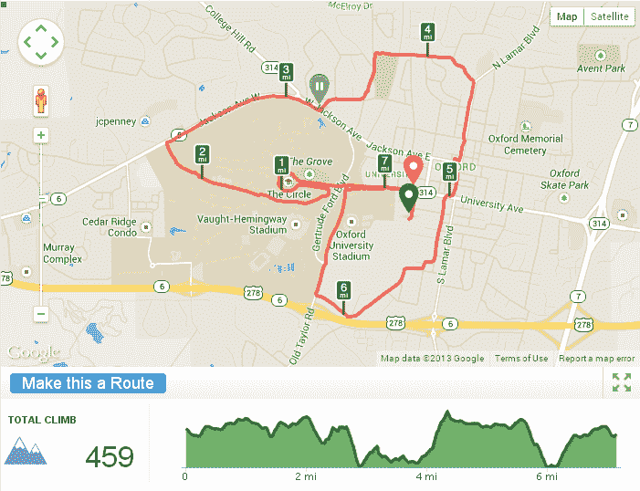
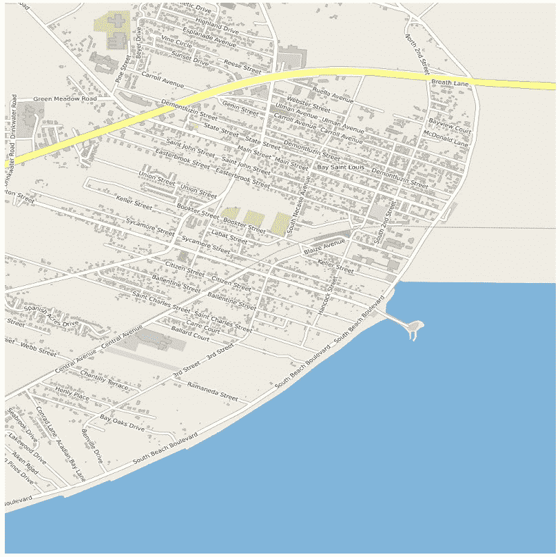
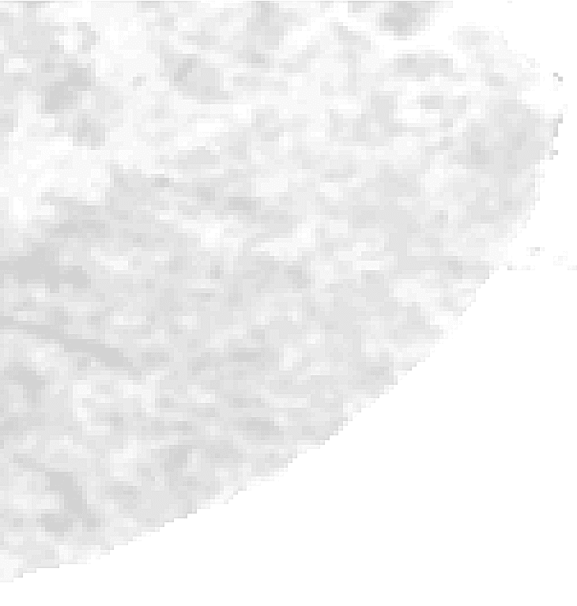
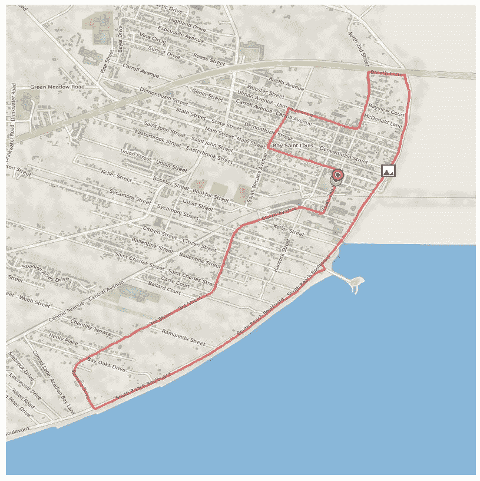
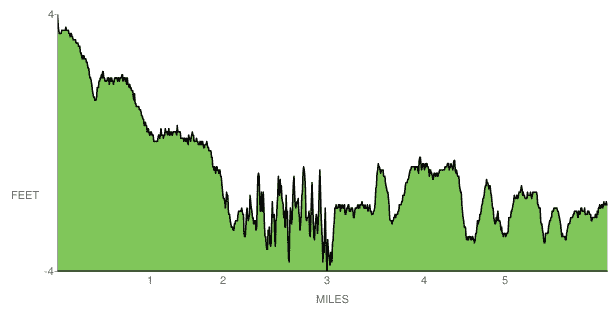

# 把这一切放在一起

在整本书中，我们已经触及了地理空间分析的所有重要方面，并在 Python 中使用了各种不同的技术来分析不同类型的地理空间数据。在这最后一章中，我们将利用几乎所有我们已经讨论过的主题来制作一个非常受欢迎的现实世界产品:全球定位系统路线分析报告。

这些报告常见于数十种移动应用服务、全球定位系统手表、车载导航系统和其他基于全球定位系统的工具。全球定位系统通常记录位置、时间和高度。从这些值中，我们可以得出大量的辅助信息，这些信息与记录数据的路线沿线发生的情况有关。包括 RunKeeper、MapMyRun、Strava 和 Nike Plus 在内的健身应用程序都使用类似的报告来呈现来自跑步、徒步旅行、骑自行车和步行的全球定位系统跟踪的锻炼数据。

我们将使用 Python 创建其中一个报告。这个程序有将近 500 行代码，是我们迄今为止最长的，所以我们将一点一点地来看。我们将结合以下技术:

*   理解典型的全球定位系统报告
*   构建全球定位系统报告工具

当我们逐步完成这个程序时，所有使用的技术都将是熟悉的，但是我们将以新的方式使用它们。

# 技术要求

本章我们需要以下内容:

*   Python 3.6 或更高版本
*   内存:最小–6gb(Windows)，8gb(macOS)；推荐 8 GB
*   存储:最低 7200 转/分的 SATA，20 GB 可用空间，推荐的固态硬盘，40 GB 可用空间
*   处理器:最低英特尔酷睿 i3 2.5 GHz，推荐英特尔酷睿 i5
*   PIL:Python 图像库
*   多维数组处理库
*   `pygooglechart`:优秀的谷歌图表 API 的 Python 包装器
*   FPDF:一个简单而纯粹的 Python PDF 作者

# 理解典型的全球定位系统报告

典型的全球定位系统报告具有共同的元素，包括路线图、高程剖面图和速度剖面图。以下截图是通过 RunKeeper([https://runkeeper.com/index](https://runkeeper.com/index))记录的典型路线的报告:



我们的报告将是相似的，但我们将增加一个转折。我们将像这项服务一样包括路线图和海拔剖面图，但我们还将添加记录路线时发生的天气情况以及在路线上拍摄的地理位置照片。

现在我们已经知道了什么是全球定位系统报告，让我们学习如何构建它。

# 构建全球定位系统报告工具

我们节目的名字是`GPX-Reporter.py`。如果你还记得[第 2 章](02.html)*学习地理空间数据*中的*标记和基于标记的格式*一节， **GPX** 格式是存储全球定位系统路线信息的最常见方式。几乎每一个依靠全球定位系统数据的程序和设备都可以在 GPX 之间进行转换。

对于本例，您可以从:[http://git.io/vl7qi](http://git.io/vl7qi)下载一个示例 GPX 文件。此外，您还需要安装一些来自 PyPI 的 Python 库。

你应该简单地使用`easy_install`或`pip`来安装这些工具。我们还将使用一个名为`SRTM.py`的模块。该模块用于处理奋进号航天飞机在 2000 年为期 11 天的**航天飞机雷达地形任务** ( **SRTM** )中收集的近全球高程数据。使用`pip`安装 SRTM 模块:

```py
pip install srtm.py
```

或者，您也可以下载压缩文件，将其解压缩，并将`srtm`文件夹复制到您的 Python `site-packages`目录或您的工作目录:[http://git.io/vl5Ls](http://git.io/vl5Ls)。

您还需要注册一个免费的黑暗天空应用编程接口。这项免费服务提供独特的工具。这是唯一一项为几乎任何地点提供全球历史天气数据的服务，每天最多可免费提供 1000 个请求:[https://darksky.net/dev](https://darksky.net/dev)。

**黑暗天空**将为您提供一个文本键，您可以在运行 GPX-记者程序之前将其插入到名为`api_key`的变量中。最后，根据黑暗天空的服务条款，您需要下载一个徽标图像以插入报告中:[https://raw . githubusercontent . com/GeospatialPython/Learn/master/darksky . png](https://raw.githubusercontent.com/GeospatialPython/Learn/master/darksky.png)。

You can review the Dark Sky *Terms of Service* here: [https://darksky.net/dev/docs/terms](https://darksky.net/dev/docs/terms).

现在，我们准备通过 GPX-记者项目开展工作。像本书中的其他脚本一样，这个程序试图最小化函数，这样您就可以更好地跟踪程序，并更轻松地修改它。以下列表包含程序中的主要步骤:

1.  设置 Python `logging`模块
2.  建立我们的助手函数
3.  解析 GPX 数据文件
4.  计算路线边界框
5.  缓冲边界框
6.  将盒子转换为仪表
7.  下载底图
8.  下载高程数据
9.  对高程数据进行山体阴影
10.  增加山体阴影对比度
11.  混合山体阴影和底图
12.  在单独的图像上绘制 GPX 轨迹
13.  混合轨迹图像和底图
14.  绘制起点和终点
15.  保存地图图像
16.  计算路线英里标记
17.  构建高程剖面图
18.  获取路线时间段的天气数据
19.  生成 PDF 报告

下一小节将带您完成第一步。

# 初始设置

程序的开头是`import`语句，后面是 Python `logging`模块。与简单的`print`语句相比，`logging`模块提供了一种更强大的方法来跟踪和记录程序状态。在程序的这一部分，我们按照以下步骤进行配置:

1.  我们首先需要安装我们需要的所有库，如下面的代码所示:

```py
from xml.dom import minidom
import json
import urllib.request
import urllib.parse
import urllib.error
import math
import time
import logging
import numpy as np
import srtm # Python 3 version: http://git.io/vl5Ls
import sys
from pygooglechart import SimpleLineChart
from pygooglechart import Axis
import fpdf
import glob
import os
try:
 import Image
 import ImageFilter
 import ImageEnhance
 import ImageDraw
except:
 from PIL import Image
 from PIL import ImageFilter
 from PIL import ImageEnhance
 from PIL import ImageDraw
 from PIL.ExifTags import TAGS
```

2.  现在我们可以配置 Python `logging`模块来告诉我们整个过程中发生了什么，如下所示:

```py
# Python logging module.
# Provides a more advanced way
# to track and log program progress.
# Logging level - everything at or below
# this level will output. INFO is below.
level = logging.DEBUG
# The formatter formats the log message.
# In this case we print the local time, logger name, and message
formatter = logging.Formatter("%(asctime)s - %(name)s - %(message)s")
# Establish a logging object and name it
log = logging.getLogger("GPX-Reporter")
# Configure our logger
log.setLevel(level)
# Print to the command line
console = logging.StreamHandler()
console.setLevel(level)
console.setFormatter(formatter)
log.addHandler(console)
```

这个记录器打印到控制台，但是只需做一些简单的修改，您就可以将它打印到一个文件，甚至一个数据库，只需更改这一部分中的配置。该模块内置于 Python 中，并记录在这里:[https://docs.python.org/3/howto/logging.html](https://docs.python.org/3/howto/logging.html)。

接下来，我们有几个在整个程序中多次使用的实用函数。

# 使用实用功能

除了与时间相关的功能之外，以下所有功能都以某种形式在前面的章节中使用过。让我们看看如何在我们的例子中使用实用函数:

1.  首先，`ll2m()`功能将经纬度转换为米:

```py
def ll2m(lat, lon):
 """Lat/lon to meters"""
 x = lon * 20037508.34 / 180.0
 y = math.log(math.tan((90.0 + lat) *
 math.pi / 360.0)) / (math.pi / 180.0)
 y = y * 20037508.34 / 180
 return (x, y)
```

2.  `world2pixel()`功能将地理空间坐标转换为输出地图图像上的像素坐标:

```py
def world2pixel(x, y, w, h, bbox):
 """Converts world coordinates
 to image pixel coordinates"""
 # Bounding box of the map
 minx, miny, maxx, maxy = bbox
 # world x distance
 xdist = maxx - minx
 # world y distance
 ydist = maxy - miny
 # scaling factors for x, y
 xratio = w/xdist
 yratio = h/ydist
 # Calculate x, y pixel coordinate
 px = w - ((maxx - x) * xratio)
 py = (maxy-y) * yratio
 return int(px), int(py)
```

3.  然后，我们有`get_utc_epoch()`和`get_local_time()`将存储在 GPX 文件中的 UTC 时间转换为沿线的当地时间:

```py
def get_utc_epoch(timestr):
 """Converts a GPX timestamp to Unix epoch seconds
 in Greenwich Mean Time to make time math easier"""
 # Get time object from ISO time string
 utctime = time.strptime(timestr, '%Y-%m-%dT%H:%M:%S.000Z')
 # Convert to seconds since epoch
 secs = int(time.mktime(utctime))
 return secs
```

4.  现在我们有了哈弗斯距离函数和简单的`wms`函数来检索地图图像:

```py
def haversine(x1, y1, x2, y2):
 """Haversine distance formula"""
 x_dist = math.radians(x1 - x2)
 y_dist = math.radians(y1 - y2)
 y1_rad = math.radians(y1)
 y2_rad = math.radians(y2)
 a = math.sin(y_dist/2)**2 + math.sin(x_dist/2)**2 \
 * math.cos(y1_rad) * math.cos(y2_rad)
 c = 2 * math.asin(math.sqrt(a))
 # Distance in miles. Just use c * 6371
 # for kilometers
 distance = c * (6371/1.609344) # Miles
 return distance
```

5.  `wms()`功能通过以下代码检索地图图像:

```py
def wms(minx, miny, maxx, maxy, service, lyr, epsg, style, img, w, h):
 """Retrieve a wms map image from
 the specified service and saves it as a JPEG."""
 wms = service
 wms += "?SERVICE=WMS&VERSION=1.1.1&REQUEST=GetMap&"
 wms += "LAYERS={}".format(lyr)
 wms += "&STYLES={}&".format(style)
 wms += "SRS=EPSG:{}&".format(epsg)
 wms += "BBOX={},{},{},{}&".format(minx, miny, maxx, maxy)
 wms += "WIDTH={}&".format(w)
 wms += "HEIGHT={}&".format(h)
 wms += "FORMAT=image/jpeg"
 wmsmap = urllib.request.urlopen(wms)
 with open(img + ".jpg", "wb") as f:
   f.write(wmsmap.read())
```

6.  接下来，我们有一个`exif()`函数从照片中提取元数据:

```py
def exif(img):
 """Return EXIF metatdata from image"""
 exif_data = {}
 try: 
 i = Image.open(img)
 tags = i._getexif()
 for tag, value in tags.items():
 decoded = TAGS.get(tag, tag)
 exif_data[decoded] = value
 except:
 pass
 return exif_data
```

7.  然后我们有一个`dms2dd()`函数将度/分/秒坐标转换为十进制度，因为照片坐标就是这样存储的:

```py
def dms2dd(d, m, s, i):
 """Convert degrees/minutes/seconds to
 decimal degrees"""
 s *= .01
 sec = float((m * 60.0) + s)
 dec = float(sec / 3600.0)
 deg = float(d + dec)
 if i.upper() == 'W':
 deg = deg * -1.0
 elif i.upper() == 'S':
 deg = deg * -1.0
 return float(deg)
```

8.  最后，我们有一个`gps()`函数从照片元数据中提取坐标:

```py
def gps(exif):
 """Extract GPS info from EXIF metadat"""
 lat = None
 lon = None
 if exif['GPSInfo']: 
 # Lat
 coords = exif['GPSInfo']
 i = coords[1]
 d = coords[2][0][0]
 m = coords[2][1][0]
 s = coords[2][2][0]
 lat = dms2dd(d, m ,s, i)
 # Lon
 i = coords[3]
 d = coords[4][0][0]
 m = coords[4][1][0]
 s = coords[4][2][0]
 lon = dms2dd(d, m ,s, i)
 return lat, lon
```

9.  接下来，我们有我们的程序变量。我们将访问由一家名为**的公司免费提供的**WMS 开放街道地图**服务，以及美国宇航局提供的 SRTM 数据。**

为了简单起见，我们使用 Python 的`urllib`库来访问本书中的 WMS 服务，但是如果您计划频繁使用 OGC web 服务，您应该使用通过 PyPI 提供的 Python 包 OWSLib:[https://pypi.python.org/pypi/OWSLib](https://pypi.python.org/pypi/OWSLib)。

现在，让我们执行以下步骤来设置 WMS web 服务:

1.  我们将输出几个中间产品和图像。这些变量在这些步骤中使用。`route.gpx`文件在本节中定义为`gpx`变量。首先，我们用下面的代码为度数到弧度的转换设置一些转换常数:

```py
# Needed for numpy conversions in hillshading
deg2rad = 3.141592653589793 / 180.0
rad2deg = 180.0 / 3.141592653589793
```

2.  接下来，我们将`.gpx`文件的名称设置如下:

```py
# Program Variables

# Name of the gpx file containing a route.
# https://git.io/fjwHW
gpx = "route.gpx"
```

3.  现在，我们开始设置 WMS 网络服务，它将检索地图:

```py
# NOAA OpenStreetMap Basemap

# OSM WMS service
osm_WMS = "http://ows.mundialis.de/services/service"

# Name of the WMS street layer
# streets = "osm"
osm_lyr = "OSM-WMS"

# Name of the basemap image to save
osm_img = "basemap"

# OSM EPSG code (spatial reference system)
osm_epsg = 3857

# Optional WMS parameter
osm_style = ""
```

4.  接下来，我们设置山体阴影参数，它将决定人造太阳的角度和方向:

```py
# Shaded elevation parameters
#
# Sun direction
azimuth = 315.0

# Sun angle
altitude = 45.0

# Elevation exageration
z = 5.0

# Resolution
scale = 1.0
```

5.  然后我们在没有高程信息的地方设置`no_data`值:

```py
# No data value for output
no_data = 0
```

6.  接下来，我们将输出图像的名称设置如下:

```py
# Output elevation image name
elv_img = "elevation"
```

7.  现在，我们使用以下代码为最小和最大高程值创建颜色:

```py
# RGBA color of the SRTM minimum elevation
min_clr = (255, 255, 255, 0)

# RGBA color of the SRTM maximum elevation
max_clr = (0, 0, 0, 0)

# No data color
zero_clr = (255, 255, 255, 255)
```

8.  然后我们设置输出图像大小，如下所示:

```py
# Pixel width and height of the

# output images
w = 800
h = 800
```

现在我们理解了函数是如何工作的，让我们解析一下 GPX。

# 解析 GPX

现在，我们将使用`built-in xml.dom.minidom`模块解析 GPX 文件，它只是 XML。我们将提取纬度、经度、海拔和时间戳。我们将把它们存储在一个列表中以备后用。使用 Python 的`time`模块将时间戳转换为`struct_time`对象，这使得处理更加容易。

解析需要执行以下步骤:

1.  首先，我们使用`minidom`模块解析`gpx`文件:

```py
# Parse the gpx file and extract the coordinates
log.info("Parsing GPX file: {}".format(gpx))
xml = minidom.parse(gpx)
```

2.  接下来，我们得到所有包含高程信息的`"trkpt"`标签:

```py
# Grab all of the "trkpt" elements
trkpts = xml.getElementsByTagName("trkpt")
```

3.  现在，我们设置列表来存储解析后的位置和高程值:

```py
# Latitude list
lats = []
# Longitude list
lons = []
# Elevation list
elvs = []
# GPX timestamp list
times = []
```

4.  然后，我们遍历 GPX 的全球定位系统条目并解析这些值:

```py
# Parse lat/long, elevation and times
for trkpt in trkpts:
 # Latitude
 lat = float(trkpt.attributes["lat"].value)
 # Longitude
 lon = float(trkpt.attributes["lon"].value)
 lats.append(lat)
 lons.append(lon)
 # Elevation
 elv = trkpt.childNodes[0].firstChild.nodeValue
 elv = float(elv)
 elvs.append(elv)
```

时间戳需要一点额外的工作，因为我们必须从格林尼治时间转换为当地时间:

```py
 # Times
 t = trkpt.childNodes[1].firstChild.nodeValue
 # Convert to local time epoch seconds
 t = get_local_time(t)
 times.append(t)
```

解析 GPX 之后，我们需要路径的边界框来从其他地理空间服务下载数据。

# 获取边界框

当我们下载数据时，我们希望数据集比路线覆盖更多的区域，这样地图就不会在路线边缘附近被裁剪得太紧。所以我们将缓冲边界框的每一边 20%。最后，我们需要东部和北部的数据来配合 WMS 服务。东距和北距是笛卡尔坐标系中点的 *x* 和 *y* 坐标，单位为米。它们通常用于 UTM 坐标系:

1.  首先，我们从坐标列表中获取范围，如下所示:

```py
# Find Lat/Long bounding box of the route
minx = min(lons)
miny = min(lats)
maxx = max(lons)
maxy = max(lats)
```

2.  接下来，我们缓冲边界框，以确保轨迹不会靠近边缘:

```py
# Buffer the GPX bounding box by 20%
# so the track isn't too close to
# the edge of the image.
xdist = maxx - minx
ydist = maxy - miny
x20 = xdist * .2
y20 = ydist * .2

# 10% expansion on each side
minx -= x20
miny -= y20
maxx += x20
maxy += y20
```

3.  最后，我们在一个变量中设置我们的边界框，并将我们的坐标转换为米，这是 web 服务所需要的:

```py
# Store the bounding box in a single
# variable to streamline function calls
bbox = [minx, miny, maxx, maxy]

# We need the bounding box in meters
# for the OSM WMS service. We will
# download it in degrees though to
# match the SRTM file. The WMS spec
# says the input SRS should match the
# output but this custom service just
# doesn't work that way
mminx, mminy = ll2m(miny, minx)
mmaxx, mmaxy = ll2m(maxy, maxx)
```

有了这个，我们现在将下载我们的地图和海拔图像。

# 下载地图和高程图像

我们将首先下载 OSM 底图作为我们的底图，该底图包含街道和标签:

1.  首先，我们将使用`log.info`下载 OSM 底图:

```py
# Download the OSM basemap
log.info("Downloading basemap")
wms(mminx, mminy, mmaxx, mmaxy, osm_WMS, osm_lyr,
 osm_epsg, osm_style, osm_img, w, h)
```

该部分将生成一个中间图像，如下图所示:



2.  接下来，我们将从 **SRTM** 数据集下载一些高程数据。SRTM 几乎是全球性的，提供 30-90 米的分辨率。`SRTM.py` Python 模块使处理这些数据变得容易。`SRTM.py`下载数据并设置其需要进行请求。因此，如果您从不同的区域下载数据，您可能需要清理位于主目录(`~/.srtm`)中的缓存。脚本的这一部分可能需要 2-3 分钟才能完成，具体取决于您的计算机和互联网连接速度:

```py
# Download the SRTM image

# srtm.py downloader
log.info("Retrieving SRTM elevation data")
# The SRTM module will try to use a local cache

# first and if needed download it.
srt = srtm.get_data()
# Get the image and return a PIL Image object
image = srt.get_image((w, h), (miny, maxy), (minx, maxx),
 300, zero_color=zero_clr, min_color=min_clr,
 max_color=max_clr)
# Save the image
image.save(elv_img + ".png")
```

脚本的这一部分还输出了一个中间高程图像，如下图所示:



现在我们有了海拔图像，我们可以把它变成山体阴影。

# 创建山体阴影

我们可以通过在[第 7 章](07.html)、 *Python 和高程数据中*创建阴影浮雕*部分使用的相同**山体阴影**算法来运行该数据。*为此，让我们遵循以下步骤:

1.  首先，我们打开我们的高程图像，并将其读入一个`numpy`数组:

```py
# Hillshade the elevation image
log.info("Hillshading elevation data")
im = Image.open(elv_img + ".png").convert("L")
dem = np.asarray(im)
```

2.  现在，我们设置我们的处理窗口在网格中移动，并在小部分中进行分析以提高效率:

```py
# Set up structure for a 3x3 windows to
# process the slope throughout the grid
window = []
# x, y resolutions
xres = (maxx-minx)/w
yres = (maxy-miny)/h
```

3.  然后，我们将立面图像分成如下窗口:

```py
# Create the windows
for row in range(3):
 for col in range(3):
 window.append(dem[row:(row + dem.shape[0]-2),
 col:(col + dem.shape[1]-2)])
```

4.  我们将为我们的处理窗口创建数组，如下所示:

```py
# Process each cell
x = ((z * window[0] + z * window[3] + z * window[3] + z * window[6]) -
 (z * window[2] + z * window[5] + z * window[5] + z * window[8])) \
 / (8.0 * xres * scale)

y = ((z * window[6] + z * window[7] + z * window[7] + z * window[8]) -
 (z * window[0] + z * window[1] + z * window[1] + z * window[2])) \
 / (8.0 * yres * scale)
```

5.  最后，我们可以通过`numpy`一次性处理它们:

```py
# Calculate slope
slope = 90.0 - np.arctan(np.sqrt(x*x + y*y)) * rad2deg

# Calculate aspect
aspect = np.arctan2(x, y)

# Calculate the shaded relief
shaded = np.sin(altitude * deg2rad) * np.sin(slope * deg2rad) \
 + np.cos(altitude * deg2rad) * np.cos(slope * deg2rad) \
 * np.cos((azimuth - 90.0) * deg2rad - aspect)

shaded = shaded * 255
```

现在我们有了山体阴影图层，我们可以开始创建地图了。

# 创建地图

我们有了开始构建报告地图所需的数据。我们的方法如下:

*   使用过滤器增强高程和底图图像
*   将图像混合在一起，以提供带有山坡的 OSM 地图
*   创建半透明层以绘制街道路线
*   将路线图层与山坡地图混合

这些任务都将使用 PIL `Image`和`ImageDraw`模块来完成，如以下步骤所示:

1.  首先，我们将我们的阴影浮雕`numpy`数组转换回图像并平滑它:

```py
# Convert the numpy array back to an image
relief = Image.fromarray(shaded).convert("L")

# Smooth the image several times so it's not pixelated
for i in range(10):
 relief = relief.filter(ImageFilter.SMOOTH_MORE)

log.info("Creating map image")
```

2.  现在，我们将增加图像的对比度，使其更加突出:

```py
# Increase the hillshade contrast to make
# it stand out more
e = ImageEnhance.Contrast(relief)
relief = e.enhance(2)
```

3.  接下来，我们将地图图像裁剪为与高程图像相同的大小:

```py
# Crop the image to match the SRTM image. We lose
# 2 pixels during the hillshade process
base = Image.open(osm_img + ".jpg").crop((0, 0, w-2, h-2))
```

4.  然后，我们还增加了地图图像的对比度，并将其与山体阴影图像混合:

```py
# Enhance basemap contrast before blending
e = ImageEnhance.Contrast(base)
base = e.enhance(1)

# Blend the the map and hillshade at 90% opacity
topo = Image.blend(relief.convert("RGB"), base, .9)
```

5.  现在，我们准备好在混合地图上绘制全球定位系统轨迹，首先将我们的点转换为像素:

```py
# Draw the GPX tracks
# Convert the coordinates to pixels
points = []
for x, y in zip(lons, lats):
 px, py = world2pixel(x, y, w, h, bbox)
 points.append((px, py))
```

6.  我们还需要从将要创建的轨迹图像的边缘缓冲区中减去缓冲区:

```py
# Crop the image size values to match the map
w -= 2
h -= 2
```

7.  接下来，我们创建一个透明图像，并将我们的轨迹绘制为红线:

```py
# Set up a translucent image to draw the route.
# This technique allows us to see the streets
# and street names under the route line.

track = Image.new('RGBA', (w, h))

track_draw = ImageDraw.Draw(track)

# Route line will be red at 50% transparency (255/2=127)
track_draw.line(points, fill=(255, 0, 0, 127), width=4)
```

8.  现在，我们可以使用以下代码将轨道粘贴到图像上:

```py
# Paste onto the basemap using the drawing layer itself
# as a mask.
topo.paste(track, mask=track)
```

9.  现在我们将在路线上画一个起点，如下所示:

```py
# Now we'll draw start and end points directly on top
# of our map - no need for transparency
topo_draw = ImageDraw.Draw(topo)

# Starting circle
start_lon, start_lat = (lons[0], lats[0])
start_x, start_y = world2pixel(start_lon, start_lat, w, h, bbox)
start_point = [start_x-10, start_y-10, start_x+10, start_y+10]
topo_draw.ellipse(start_point, fill="lightgreen", outline="black")
start_marker = [start_x-4, start_y-4, start_x+4, start_y+4]
topo_draw.ellipse(start_marker, fill="black", outline="white")
```

10.  下面是结束点的代码片段:

```py
# Ending circle
end_lon, end_lat = (lons[-1], lats[-1])
end_x, end_y = world2pixel(end_lon, end_lat, w, h, bbox)
end_point = [end_x-10, end_y-10, end_x+10, end_y+10]
topo_draw.ellipse(end_point, fill="red", outline="black")
end_marker = [end_x-4, end_y-4, end_x+4, end_y+4]
topo_draw.ellipse(end_marker, fill="black", outline="white")
```

现在我们已经画出了我们的轨迹，我们准备放置我们的地理标记的照片。

# 定位照片

我们将使用添加了全球定位系统位置坐标的手机拍摄的照片。你可以从
[下载。](https://raw.githubusercontent.com/GeospatialPython/Learn/master/RoutePhoto.jpg)

将图像放在与脚本相同级别的名为`photos`的目录中。我们将只使用一张照片，但脚本可以处理你想要的男人图像。我们将在地图上绘制并放置一个照片图标，然后保存完成的底图，如以下步骤所示:

1.  首先，我们获得一个包含以下代码的图像列表:

```py
# Photo icon
images = glob.glob("photos/*.jpg")
```

2.  接下来，我们遍历每张图像并获取其全球定位系统信息:

```py
for i in images:
 e = exif(i)
```

3.  然后，我们使用全球定位系统函数解析位置信息，如下所示:

```py
 photo_lat, photo_lon = gps(e)
 #photo_lat, photo_lon = 30.311364, -89.324786
```

4.  现在，我们可以将照片坐标转换为图像像素坐标:

```py
 photo_x, photo_y = world2pixel(photo_lon, photo_lat, w, h, bbox)
```

5.  然后，我们将使用以下代码为照片的位置绘制一个图标:

```py
 topo_draw.rectangle([photo_x - 12, photo_y - 10, photo_x + 12, \
 photo_y + 10], fill="black", outline="black")
 topo_draw.rectangle([photo_x - 9, photo_y - 8, photo_x + 9, \
 photo_y + 8], fill="white", outline="white")
 topo_draw.polygon([(photo_x-8,photo_y+7), (photo_x-3,photo_y-1), (photo_x+2,photo_y+7)], fill = "black")
 topo_draw.polygon([(photo_x+2,photo_y+7), (photo_x+7,photo_y+3), (photo_x+8,photo_y+7)], fill = "black")
```

6.  最后，我们将像这样保存我们的地图:

```py
# Save the topo map
topo.save("{}_topo.jpg".format(osm_img))
```

虽然没有保存到文件系统中，但山坡高程如下所示:


混合地形图如下图所示:



虽然山体阴影制图让我们了解了海拔高度，但它没有给我们任何定量数据。为了获得更详细的信息，我们将创建一个简单的立面图。

# 测量高度

使用出色的谷歌地图应用编程接口，我们可以快速构建一个漂亮的高程剖面图，显示路线上的高程变化:

1.  首先，我们将为我们的高程剖面创建`chart`对象:

```py
# Build the elevation chart using the Google Charts API
log.info("Creating elevation profile chart")
chart = SimpleLineChart(600, 300, y_range=[min(elvs), max(elvs)])
```

2.  现在，我们需要为最小值创建一条线，如下所示:

```py
# API quirk - you need 3 lines of data to color
# in the plot so we add a line at the minimum value
# twice.
chart.add_data([min(elvs)]*2)
chart.add_data(elvs)
chart.add_data([min(elvs)]*2)

# Black lines
chart.set_colours(['000000'])
```

3.  接下来，我们可以按如下方式填写我们的高程剖面:

```py
# fill in the elevation area with a hex color
chart.add_fill_range('80C65A', 1, 2)
```

4.  然后，我们可以按如下方式设置高程标签，并将它们指定给一个轴:

```py
# Set up labels for the minimum elevation, halfway value, and max value
elv_labels = int(round(min(elvs))), int(min(elvs)+((max(elvs)-min(elvs))/2))

# Assign the labels to an axis
elv_label = chart.set_axis_labels(Axis.LEFT, elv_labels)
```

5.  接下来，我们可以用以下代码标记轴本身:

```py
# Label the axis
elv_text = chart.set_axis_labels(Axis.LEFT, ["FEET"])
# Place the label at 30% the distance of the line
chart.set_axis_positions(elv_text, [30])
```

6.  现在我们可以计算轨迹点之间的距离:

```py
# Calculate distances between track segments
distances = []
measurements = []
coords = list(zip(lons, lats))
for i in range(len(coords)-1):
 x1, y1 = coords[i]
 x2, y2 = coords[i+1]
 d = haversine(x1, y1, x2, y2)
 distances.append(d)
total = sum(distances)
distances.append(0)
j = -1
```

我们有高程剖面，但是我们需要沿着 *x* 轴添加距离标记，这样我们就知道剖面沿着路线在哪里发生了变化。

# 测量距离

为了理解高程数据图，我们需要沿着 *x* 轴的参考点来帮助我们确定路线沿线的高程。我们将计算路线沿线的英里分割，并将其放置在图表 x 轴上的适当位置。让我们看看以下步骤:

1.  首先，我们沿着轴定位英里标记，如下所示:

```py
# Locate the mile markers
for i in range(1, int(round(total))):
 mile = 0
 while mile < i:
 j += 1
 mile += distances[j]
 measurements.append((int(mile), j))
 j = -1
```

2.  接下来，我们为英里标记设置标签:

```py
# Set up labels for the mile points

positions = []
miles = []
for m, i in measurements:
 pos = ((i*1.0)/len(elvs)) * 100
 positions.append(pos)
 miles.append(m)

# Position the mile marker labels along the x axis
miles_label = chart.set_axis_labels(Axis.BOTTOM, miles)
chart.set_axis_positions(miles_label, positions)
```

3.  现在，我们可以将英里标记标记如下:

```py
# Label the x axis as "Miles"
miles_text = chart.set_axis_labels(Axis.BOTTOM, ["MILES", ])
chart.set_axis_positions(miles_text, [50, ])

# Save the chart
chart.download('{}_profile.png'.format(elv_img))
```

我们的图表现在应该如下图所示:



我们的第一张图表完成了。现在，让我们看看沿途的天气数据。

# 检索天气数据

在本节中，我们将检索我们的最终数据元素:天气。如前所述，我们将使用黑暗天空服务，该服务允许我们收集世界上任何地方的历史天气报告。天气 API 是基于 REST 和 JSON 的，所以我们将使用`urllib`模块请求数据，使用`json`库解析数据。本节中值得注意的是，我们在本地缓存数据，因此如果需要，您可以离线运行脚本进行测试。在这一部分的早期，您可以放置由`YOUR KEY HERE`文本标记的黑暗天空应用编程接口密钥。让我们看看以下步骤:

1.  首先，我们需要我们感兴趣区域的中心:

```py
log.info("Creating weather summary")

# Get the bounding box centroid for georeferencing weather data
centx = minx + ((maxx-minx)/2)
centy = miny + ((maxy-miny)/2)
```

2.  现在，我们按如下方式设置免费的黑暗应用编程接口密钥，这样我们就可以检索天气数据:

```py
# DarkSky API key
# You must register for free at DarkSky.net
# to get a key to insert here.
api_key = "YOUR API KEY GOES HERE"
```

3.  然后，我们从数据中获取最新的时间戳，用于天气查询:

```py
# Grab the latest route time stamp to query weather history
t = times[-1]
```

4.  现在，我们准备进行天气数据查询，如下所示:

```py
history_req = "https://api.darksky.net/forecast/{}/".format(api_key)
#name_info = [t.tm_year, t.tm_mon, t.tm_mday, route_url.split(".")[0]]
#history_req += "/history_{0}{1:02d}{2:02d}/q/{3}.json" .format(*name_info)
history_req += "{},{},{}".format(centy, centx, t)
history_req += "?exclude=currently,minutely,hourly,alerts,flags"
request = urllib.request.urlopen(history_req)
weather_data = request.read()
```

5.  我们将像这样缓存天气数据，以防以后需要查看:

```py
# Cache weather data for testing
with open("weather.json", "w") as f:
 f.write(weather_data.decode("utf-8"))
```

6.  然后，我们解析天气 JSON 数据如下:

```py
# Retrieve weather data
js = json.loads(open("weather.json").read())
history = js["daily"]
```

7.  我们只需要天气摘要，这是列表中的第一项:

```py
# Grab the weather summary data.
# First item in a list.
daily = history["data"][0]
```

8.  现在，我们将获得具体的天气属性如下:

```py
# Max temperature in Imperial units (Farenheit).
# Celsius would be metric: "maxtempm"
maxtemp = daily["temperatureMax"]

# Minimum temperature
mintemp = daily["temperatureMin"]

# Maximum humidity
maxhum = daily["humidity"]

# Precipitation in inches (cm = precipm)
if "precipAccumulation" in daily:
 precip = daily["precipAccumulation"]
else:
 precip = "0.0"
```

9.  现在我们已经将天气数据存储在变量中，我们可以完成最后一步:将其全部添加到 PDF 报告中。

在某些情况下，除了 PIL 之外，库没有依赖关系。就我们的目的而言，它会很好地工作。我们将继续下一页并添加元素。`fpdf.ln()`分隔行，而`fpdf.cells`包含文本并允许更精确的布局。

我们终于可以通过以下步骤创建 PDF 报告了:

1.  首先，我们如下设置我们的`pdf`对象:

```py
# Simple fpdf.py library for our report.
# New pdf, portrait mode, inches, letter size
# (8.5 in. x 11 in.)
pdf = fpdf.FPDF("P", "in", "Letter")
```

2.  然后，我们将为报告添加一个页面，并设置我们的字体首选项:

```py
# Add our one report page
pdf.add_page()

# Set up the title
pdf.set_font('Arial', 'B', 20)
```

3.  我们将用下面的代码为我们的报告创建一个标题:

```py
# Cells contain text or space items horizontally
pdf.cell(6.25, 1, 'GPX Report', border=0, align="C")

# Lines space items vertically (units are in inches)
pdf.ln(h=1)
pdf.cell(1.75)

# Create a horizontal rule line
pdf.cell(4, border="T")
pdf.ln(h=0)
pdf.set_font('Arial', style='B', size=14)
```

4.  现在，我们可以像这样添加路线图:

```py
# Set up the route map
pdf.cell(w=1.2, h=1, txt="Route Map", border=0, align="C")
pdf.image("{}_topo.jpg".format(osm_img), 1, 2, 4, 4)
pdf.ln(h=4.35)
```

5.  接下来，我们添加如下立面图:

```py
# Add the elevation chart
pdf.set_font('Arial', style='B', size=14)
pdf.cell(w=1.2, h=1, txt="Elevation Profile", border=0, align="C")
pdf.image("{}_profile.png".format(elv_img), 1, 6.5, 4, 2)
pdf.ln(h=2.4)
```

6.  然后，我们可以用以下代码编写天气数据摘要:

```py
# Write the weather summary
pdf.set_font('Arial', style='B', size=14)
pdf.cell(1.2, 1, "Weather Summary", align="C")
pdf.ln(h=.25)
pdf.set_font('Arial', style='', size=12)
pdf.cell(1.8, 1, "Min. Temp.: {}".format(mintemp), align="L")
pdf.cell(1.2, 1, "Max. Hum.: {}".format(maxhum), align="L")
pdf.ln(h=.25)
pdf.cell(1.8, 1, "Max. Temp.: {}".format(maxtemp), align="L")
pdf.cell(1.2, 1, "Precip.: {}".format(precip), align="L")
pdf.ln(h=.25)
```

7.  “黑暗天空”条款要求我们在报告中添加一个徽标，这归功于出色的数据源:

```py
# Give Dark Sky credit for a great service (https://git.io/fjwHl)
pdf.image("darksky.png", 3.3, 9, 1.75, .25)
```

8.  现在，我们可以使用以下代码添加地理定位图像:

```py
# Add the images for any geolocated photos
pdf.ln(h=2.4)
pdf.set_font('Arial', style='B', size=14)
pdf.cell(1.2, 1, "Photos", align="C")
pdf.ln(h=.25)
for i in images:
 pdf.image(i, 1.2, 1, 3, 3)
 pdf.ln(h=.25)
```

9.  最后，我们可以保存报告并查看它:

```py
# Save the report
log.info("Saving report pdf")
pdf.output('report.pdf', 'F')
```

您的工作目录中应该有一个名为`report.pdf`的 PDF 文档，其中包含您的成品。它应该看起来像下面截图中显示的图像:


有了这个，我们使用了我们在这本书中学到的所有技术，并建立了一个全球定位系统报告工具。

# 摘要

恭喜你！在这本书里，你汇集了成为一名现代地理空间分析师所需的最基本的工具和技能。无论您是偶尔使用地理空间数据还是一直使用它，您都将能够更好地充分利用地理空间分析。这本书的重点是使用几乎完全在 PyPI 目录中找到的开源工具，以便于安装和集成。但是，即使您使用 Python 作为商业地理信息系统包或流行库(如 GDAL)的驱动程序，用纯 Python 测试新概念的能力也总是会派上用场。

# 进一步阅读

Python 为可视化数据提供了一套丰富的库。其中最突出的是 **Matplotlib** ，可以生成无数类型的图表和地图，并保存为 PDF。Packt 有几本关于 Matplotlib 的书，包括 *Matplotlib 30 食谱*:[https://www . packtpub . com/大数据与商业智能/matplotlib-30 食谱](https://www.packtpub.com/big-data-and-business-intelligence/matplotlib-30-cookbook)。