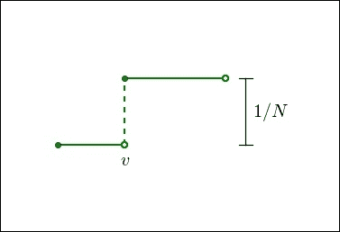
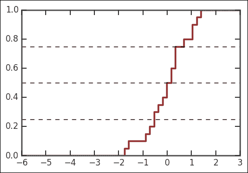
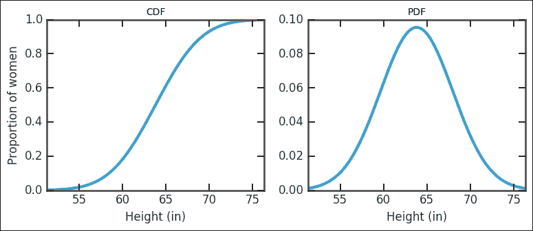
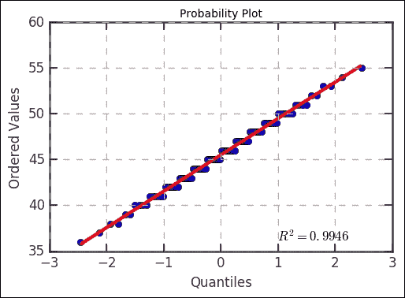
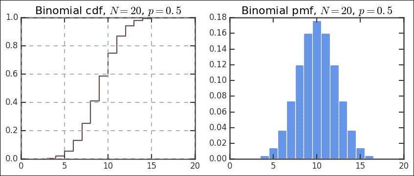

# 第三章。了解模型

在最普通的意义上，一个**模型**是对现实的一部分的近似描述。模型对于科学，事实上对于任何知识领域都是必不可少的:只有通过一次专注于世界的一小部分并进行适当的简化，才有可能理解世界。

在本章中，我们将讨论以下主题:

*   在数据分析中使用基本模型
*   使用累积分布函数和概率密度函数来表征变量
*   使用前面的函数和各种工具进行点估计，生成具有一定分布的随机数
*   讨论离散和连续随机变量的例子以及多元分布的概述

# 模型和实验

模型可以采取多种形式:口头描述、一组数学方程或一段计算机代码。在这本书里，我们对一种特定的模型感兴趣，*概率*或*统计*模型，它代表发生在不确定性实验中的可变性。

### 注

我们在本书中使用术语**实验**在某种程度上是非技术性的。对我们来说，实验是对感兴趣的事件的任何观察。实验的例子是观察网站访问者的数量，或者进行民意测验或临床试验。对我们来说，实验的主要特点是可以重复，并且具有随机性，即同一实验的每次重复都可能导致不同的结果。

我们将考虑的模型采用随机变量的形式。随机变量是具有数值结果的概率结果的理想化表示。重要的是要认识到随机变量是一种抽象:它不代表特定实验的结果，它只是模拟一旦实验实际执行，我们期望得到什么结果。

在本章的剩余部分，我们将讨论统计模型是如何制定的，并描述数据分析中最重要的模型。

在运行本章中的示例之前，请启动 Jupyter 笔记本。默认导入后，在单元格中运行以下命令:

```py
from pandas import Series, DataFrame
import numpy.random as rnd
import scipy.stats as st

```

您现在可以开始运行本章的代码了。

# 累计分布函数

在前一章中，当讨论数字数据的可视化表示时，我们引入了直方图，它表示数据在多个区间中的分布方式。直方图的一个缺点是箱的数量总是被任意选择，不正确的选择可能会给出关于数据分布的无用或误导的信息。

我们说直方图抽象了数据的一些特征。也就是说，直方图允许我们忽略数据中的一些细粒度可变性，从而使一般模式更加明显。

一般来说，在分析数据集时，抽象是一件好事，但我们希望对所有*数据点有一个视觉上引人注目且计算上有用的精确表示。这是由*累积分布函数*提供的。这个函数对于统计计算一直很重要，在计算机出现之前，累积分布表实际上是一个必不可少的工具。然而，作为一个图形工具，累积分布函数通常不会在介绍性统计文本中得到强调。在我看来，这部分是由于历史偏见，因为在没有计算机的帮助下绘制累积分布函数是不方便的。*

 *举一个具体的例子，让我们首先用下面的代码段生成一组服从正态分布的随机值:

```py
mean = 0 
sdev = 1 
nvalues = 10 
norm_variate = mean + sdev * rnd.randn(nvalues) 
print(norm_variate) 

```

在这段代码中，我们使用 NumPy `numpy.random`模块(缩写为`rnd`)来生成随机化的值。随机模块的文档可在[http://docs.scipy.org](http://docs.scipy.org)找到。具体来说，我们使用`randn()`函数，该函数生成均值为 0、方差为 1 的正态分布伪随机数，然后通过加法将分布移至均值，并通过乘法将分布扩大`sdev`。这个函数把我们想要的数值的数量作为一个参数，存储在`nvalues`变量中。

### 注

请注意，我们使用术语**伪随机**。当生成随机数时，计算机实际上使用一个公式来产生根据给定分布近似分布的值。这些值不可能是真正随机的，因为它们是由确定性公式生成的。可以使用*真实随机性*的来源，例如由网站[https://www.random.org/](https://www.random.org/)提供的来源。然而，伪随机数通常足以用于计算机模拟和大多数数据分析问题。

结果存储在`norm_variates`变量中，该变量是一个 NumPy 数组。我们可以假设这些数字代表 10 克藏红花包装相对于目标重量的克数偏移量，也许是为了更好地理解这些数字。这意味着`-0.1`意味着包装中含有的`0.1`克藏红花比它应该含有的要少，`+0.2`意味着它含有的藏红花比它应该含有的要多。

运行此单元格将生成一个包含 10 个数字的数组。运行具有更多值的代码，比如 100(也就是说，`nvalues=100`)，将产生更接近正态分布的分布。这个数组应该近似地遵循均值为 0、标准差为 1 的正态分布。从随机变量采样得到的值，例如`norm_variate`数组中的值，称为**随机变量**。根据定义，数据集的累积分布函数是这样一个函数:给定一个值`x`，返回不超过`x`的数据点数，归一化为 0 到 1。举一个具体的例子，让我们对之前生成的值进行排序，并使用以下代码打印它们:

```py
for i, v in enumerate(sorted(norm_variates), start=1): 
    print('{0:2d} {1:+.4f}'.format(i, v)) 

```

这段代码使用`for`循环结构来遍历随机变量的排序列表。我们使用`enumerate()`，它提供了一个 Python 迭代器，在每次迭代中都从列表中返回索引`i`和相应的值`v`。`start=1`参数使迭代次数从`1`开始。然后，对于每一对，打印`i`和`v`。在 print 语句中，我们使用格式说明符，它是用花括号“`{...}`”括起来的表达式。在本例中，`{0:2d}`指定将`i`打印为*两位十进制值*，`{1:+.4f}`指定将`v`打印为*指定的四位精度浮点值*。结果，我们获得了数据的排序列表，从`1`开始编号。

我获得的值如下:

```py
 1 -0.1412 
 2 +0.6152 
 3 +0.6852 
 4 +2.2946 
 5 +3.2791 
 6 +3.4699 
 7 +3.6961 
 8 +4.2375 
 9 +4.4977 
10 +5.3756 

```

### 型式

当我们从(伪)随机变量中采样时，您将获得一组不同的值。

从这个列表中，很容易计算出累积分布函数值。例如，考虑值 2.2946。小于等于给定值的数据点有四个:`-0.1412`、`0.6152`、`0.6852`和`2.2946`本身。我们现在用数值 4 除以点数，结果在 0 和 1 之间。因此，对于这 10 个值，累积分布函数值为 *4/10=0.4* 。根据数学表达式，我们写下以下内容:


惯例是用 *cdf* 来缩写*累计分布函数*，我们从现在开始这样做。

需要注意的重要一点是，cdf 不是只在数据集中的值上定义的。事实上，它是为任何数值定义的！让我们假设，例如，我们想要在`x=2.5`找到 cdf 的值。注意数字`2.5`在数据集中的第四个和第五个值之间，所以仍然有四个数据值小于或等于 2.5。因此，2.5 的函数值也是`4/10=0.4`。事实上，可以看出，对于`2.2946`和`3.2791`之间的所有数字，cdf 将具有值`0.4`。

稍微思考一下这个过程，我们可以推断出 cdf 的以下行为:它在数据集中的值之间保持不变(即*平坦*)。对于每个数据值，函数将*跳跃，*跳跃的大小是数据点数量的倒数。下图说明了这一点:



在上图中， **v** 是数据集中的一个点，该图显示了 **v** 附近的 cdf。请注意数据点之间的平坦间隔和数据点 **v** 处的跳跃。间断处的实心圆表示该点的函数值。这些是离散数据集的任何累积分布函数的特征。

现在让我们定义一个可以用来绘制 cdf 图的 Python 函数。这是通过以下代码完成的:

```py
def plot_cdf(data, plot_range=None, scale_to=None, **kwargs): 
num_bins = len(data)    
sorted_data = np.array(sorted(data), dtype=np.float64) 
   data_range = sorted_data[-1] - sorted_data[0] 
   coutns, bin_edges = np.histogram(sorted_data, bins=num_bins) 
xvalues = bin_edges[:1] 
yvalues = np.cumsum(counts) 
if plot_range is None: 
        xmin = sorted_data[0] 
        xmax = sorted_data[-1] 
    else: 
        xmin, xmax = plot_range 
   #pad the arrays 
  xvalues = np.concatenate([[xmin, xvalues[0]], xvalues, [xmax]]) 
  yvalues = np.concatenate([[0.0, 0.0], yvalues, [yvalues.max()]]) 
    if scale_to is not None: 
        yvalues = yvalues / len(data) * scale_to 
  plt.axis([xmin, xmax, 0, yvalues.max()]) 
   return plt.plot(xvalues, yvalues, **kwargs) 

```

请注意，运行这段代码不会产生任何输出，因为我们只是在定义`plot_cdf()`函数。代码有些复杂，但我们所做的只是定义存储在`xvalues`和`yvalues`数组中的点列表。这些值是楼梯的前缘和特定台阶的高度。`plt.step()`功能将这些绘制成阶梯图。我们使用 NumPy 的`concatenate()`函数填充数组，从零开始，到数组的最大(或最后)值结束。要绘制数据集的 cdf，我们可以运行以下代码:

```py
nvalues = 20 
norm_variates = rnd.randn(nvalues) 
plot_cdf(norm_variates, plot_range=[-3,3], scale_to=1.0, 
         lw=2.5, color='Brown') 
for v in [0.25, 0.5, 0.75]: 
    plt.axhline(v, lw=1, ls='--', color='black')  

```

在这段代码中，我们首先生成一组新的数据值。然后，我们调用`plot_cdf()`函数生成图形。函数调用的参数是`plot_range`，指定 *x* 轴中的范围，以及`scale_to`，指定我们希望值( *y* 轴)从 0 到 1 规范化。`plot_cdf()`函数的剩余参数被传递给 Pyplot 函数`plot()`。在本例中，我们使用`lw=2.5`选项设置线宽，使用`color="Brown"`选项设置线条颜色。

### 型式

`scale_to`选项的目的是允许在绘图中为`yvalues`设置不同的范围。使用`scale_to=100.0`， *y* 轴以百分比进行缩放，`scale_to=None`表示没有任何缩放的数据点计数。

运行此代码将生成一个类似于下面的图像:



由于数据是随机生成的，您获得的图表会有些不同。在上图中，我们还在`yvalues``0.25``0.5`和`0.75`处画了水平线。这些分别对应于数据中的第一个四分位数、中位数和第三个四分位数。查看 *x* 轴中的相应值，我们看到这些值大约对应于-0.5、0 和 0.5。这是有意义的，因为理论正态分布的实际值是`-0.68`、`0.0`和`0.68`。请注意，由于随机性和样本量小，我们预计无法准确恢复这些值。

现在，我邀请你进行下面的实验。通过更改前面代码中`nvalues`变量的值来增加数据集中的值数量，并再次运行单元格。将会注意到，随着数据值数量的增加，曲线变得更平滑，并向围绕其中心对称的 S 形曲线收敛。还要注意，四分位数和中位数将趋向于接近正态分布、`-0.68`、`0.0`和`0.68`的理论值。正如我们将在下一节中看到的，这些是标准正态分布的一些特征。

让我们研究真实数据集的 cdf。`housefly-wing-lengths.txt`文件包含了家蝇小样本的十分之一毫米的翅膀长度。数据来自*生物统计学*(第 109 页)杂志上*索卡尔，R. R.* 和*罗尔夫，J. R.* 的一篇 1968 年论文和*索卡尔*、 *R. R.* 和*体育猎人*杂志上*的一篇 1955 年论文。社会主义者美洲*(第 48 卷，第 499 页)。数据也可以在[http://www.seattlecentral.edu/qelp/sets/057/057.html](http://www.seattlecentral.edu/qelp/sets/057/057.html)在线获得。

要读取数据，请确保`housefly-wing-lengths.txt`文件与 Jupyter 笔记本在同一个目录中，然后运行以下代码段:

```py
wing_lengths = np.fromfile('data/housefly-wing-lengths.txt', 
                           sep='\n', dtype=np.int64) 
print(wing_lengths) 

```

这个数据集是一个纯文本文件，每行一个值，所以我们简单地使用 NumPy 的`fromfile()`函数将数据加载到一个数组中，我们将其命名为`wing_lengths`。`sep='\n'`选项告诉 NumPy 这是一个文本文件，其值由新的行字符`\n`分隔。最后，`dtype=np.int64`选项指定我们要将值视为整数。数据集很小，我们可以打印所有的点，这是通过重复单元格末尾的`wing_lengths`数组名称来实现的。

现在，让我们通过在一个单元格中运行以下代码来生成该数据的 cdf 图:

```py
plot_cdf(wing_lengths, plot_range=[30, 60], 
         scale_to=100, lw=2) 
plt.grid(lw=1) 
plt.xlabel('Housefly wing length (x.1mm)', fontsize=18) 
plt.ylabel('Percent', fontsize=18); 

```

我们再次使用先前定义的`plot_cdf()`函数。请注意，现在我们使用`scale_to=100`来代替比例，我们可以读取垂直轴上的百分比。我们还向图中添加网格和轴标签。我们获得了以下图:


请注意，cdf 大致具有我们之前观察到的相同的对称 S 形图案。这表明正态分布可能是该数据的合适模型。事实上，这个数据非常符合正态分布。

作为可以从这个情节中提取的信息类型的一个例子，让我们假设我们想设计一个能捕捉 80%苍蝇的网。也就是说，网格应该只允许翅膀长度在底部 20%的苍蝇通过。从上图中，我们可以看到第 20<sup>百分位对应的机翼长度约为十分之四十二毫米。这并不是一个现实的应用，如果我们真的在构建这个网络，我们可能想做一个更仔细的分析，但是它显示了我们如何从累积分布图中快速获得数据信息。</sup>

# 使用发行版

我们强调累积分布函数的主要原因是，一旦我们获得了它，我们就可以计算与模型相关的任何概率。这是因为 cdf 是指定随机变量的通用方法。特别是**连续**或离散数据的描述没有区别。随机变量的密度函数也是一个重要的概念，所以我们将在下一节介绍它。在本节中，我们将看到如何使用 cdf 来进行与随机变量相关的计算。

我们将在发行版中使用的函数是 SciPy 的一部分，包含在`scipy.stats`模块中，我们使用以下代码导入该模块:

```py
import scipy.stats as st 

```

之后，我们可以用缩写`st`来引用包中的函数。

本模块包含大量预定义的发行版，我们鼓励您访问位于[http://docs.scipy.org/doc/scipy/reference/stats.html](http://docs.scipy.org/doc/scipy/reference/stats.html)的官方文档，了解有哪些可用的发行版。对我们来说幸运的是，该模块的组织方式使得所有分发都以统一的方式进行处理，如下行所示:

```py
st.<rv_name>.<function>(<arguments>) 

```

该表达式的组成部分如下:

*   `st`是我们为统计包选择的缩写。
*   `<rv_name>`是分布的名称(`rv`代表随机变量)。
*   `<function>`是我们要计算的具体函数。
*   `<arguments>`是需要传递给每个函数的值。这些可能包括每个分布的形状参数，以及依赖于被调用函数的其他必需参数。

下表列出了每个随机变量可用的一些函数:

<colgroup><col> <col></colgroup> 
| **功能** | **描述** |
| `rvs()` | 随机变量，即伪随机数的产生 |
| `cdf()` | 累积分布函数 |
| `pdf()`或`pmf()` | 概率密度函数(对于连续变量)和概率质量函数(对于离散变量) |
| `ppf()` | 百分比点函数，累积分布函数的反函数 |
| `stats()` | 计算分布的统计(矩) |
| `mean()`、`std()`或`var()` | 分别计算平均值、标准偏差和方差 |
| `fit()` | 使数据符合分布，并从数据中返回形状、位置和比例参数 |

每当我们指定一个分布时，我们需要设置表征感兴趣的随机变量的参数。大多数模型至少有一个*位置*和*刻度*，它们通常被称为随机变量的`shape`参数。该位置指定分布的偏移，而比例代表值的重新缩放(例如单位改变时)。

在下面的例子中，我们将集中讨论正态分布，因为这肯定是一个重要的情况。然而，你应该知道我们给出的计算模式可以用于任何*分布。因此，例如，如果需要使用对数-拉普拉斯分布，他们所要做的就是用`loglaplace`替换下面例子中的`norm`。当然，有必要查阅文档，以确保正确的参数被用于兴趣分布。*

### 型式

统计技术的宝贵资源是 NIST 工程统计手册，可在 http://www.itl.nist.gov/div898/handbook/index.htm 获得。第 *1.3.6* 、*概率分布*一节包含了随机变量和分布的精彩介绍。另一个快速参考是维基百科概率分布列表，位于[http://en . Wikipedia . org/wiki/List _ of _ probability _ distributions](http://en.wikipedia.org/wiki/List_of_probability_distributions)。

对于正态分布，位置参数给出分布的*平均值*，刻度表示分布的*标准差*。这些术语将在本章后面定义，但它们是衡量分布中心和分布范围的数字。为了给出正态分布随机变量的一个具体例子，让我们考虑 20 岁以上女性的身高，如《国家健康统计报告》，第 10 期，2008 年 10 月，可在[http://www.cdc.gov/nchs/data/nhsr/nhsr010.pdf](http://www.cdc.gov/nchs/data/nhsr/nhsr010.pdf)在线获得。该报告包含按年龄组划分的美国人口的人体测量参考数据。在第 14 页，20 岁以上女性的平均身高为 63.8 英寸，标准误差为 0.06。样本量为 4，857。

我们将假设高度是正态分布的(碰巧这是一个合理的假设)。为了描述分布的特征，我们需要平均值和标准偏差。平均值直接在报告中给出。标准偏差不直接报告，但可以根据标准误差和样本量，按照以下公式计算:


标准误差是将在 *[第 4 章](104.html "Chapter 4. Regression")**回归*中引入的样本可变性的度量。我们还忽略了一个问题，即我们使用的是*样本标准差*而不是总体标准差，但样本足够大，足以证明这种方法是正确的，这将在 *[第 4 章](104.html "Chapter 4. Regression")**回归*中看到。我们首先使用以下代码定义要用作这种情况的模型的分布:

```py
N = 4857 
mean = 63.8 
serror = 0.06 
sdev = serror * np.sqrt(N) 
rvnorm = st.norm(loc=mean, scale=sdev) 

```

在这段代码中，我们首先定义变量来表示样本大小、平均值和标准误差。然后，根据前面的公式计算标准偏差。在最后一行代码中，我们调用`norm()`函数，传递均值和标准差作为参数。函数返回的对象被赋给`rvnorm`变量，我们就是通过这个变量来访问包的功能的。

### 型式

不需要先构造一个对象就可以进行所有的计算，但是如果我们想对同一个随机变量进行多次计算，这是推荐的方法。

从任何分布开始的一个好地方是制作图表，这样我们就可以对分布的形状有一个概念。这可以通过以下代码来实现:

```py
xmin = mean-3*sdev 
xmax = mean+3*sdev 
xx = np.linspace(xmin,xmax,200) 
plt.figure(figsize=(8,3)) 
plt.subplot(1,2,1) 
plt.plot(xx, rvnorm.cdf(xx)) 
plt.title('Cumulative distribution function') 
plt.xlabel('Height (in)') 
plt.ylabel('Proportion of women') 
plt.axis([xmin, xmax, 0.0, 1.0]) 
plt.subplot(1,2,2) 
plt.plot(xx, rvnorm.pdf(xx)) 
plt.title('Probability density function') 
plt.xlabel('Height (in)') 
plt.axis([xmin, xmax, 0.0, 0.1]); 

```

前面代码的大部分内容都是关于设置和格式化绘图的。最重要的两段代码是对`plot()`函数的两次调用。第一次通话如下:

```py
plt.plot(xx, rvnorm.cdf(xx)) 

```

`xx`数组先前被定义为包含要绘制的 *x* 坐标。`rvnorm.cdf(xx)`函数调用计算 cdf 的值。第二个调用类似如下:

```py
plt.plot(xx, rvnorm.pdf(xx)) 

```

唯一不同的是，现在我们叫`rvnorm.pdf(xx)`来计算概率密度函数。代码的总体效果是生成 cdf 和密度函数的并排图。这些是常见的 S 形和钟形曲线，它们是正态分布的特征:



现在让我们看看如何使用 cdf 来计算与分布相关的量。假设一家服装厂使用女性身高分类，如下表所示:

<colgroup><col> <col></colgroup> 
| **尺寸** | **高度** |
| 娇小的 | 59 英寸到 63 英寸 |
| 平均的 | 63 英寸到 68 英寸 |
| 高的 | 68 英寸到 71 英寸 |

女性属于*平均*类的比例是多少？我们可以直接从 cdf 获得这些信息。回想一下，这个函数给出了数据值与给定值的比例。因此，身高达到 68 英寸的女性比例由以下表达式计算:

```py
rvnorm.cdf(68) 

```

同样，身高达到 63 英寸的女性比例用以下表达式计算:

```py
rvnorm.cdf(63) 

```

身高在 63 英寸到 68 英寸之间的女性比例就是这些数值之间的差值。由于我们想要一个百分比，我们必须将结果乘以 100，如下面一行代码所示:

```py
100 * (rvnorm.cdf(68) - rvnorm.cdf(63)) 

```

计算结果显示，根据这一分类，大约 42.8%的女性是*平均值*。要计算三个类别的百分比并以一种良好的格式显示它们，我们可以使用以下代码:

```py
categories = [ 
    ('Petite', 59, 63), 
    ('Average', 63, 68), 
    ('Tall', 68, 71), 
    ] 
for cat, vmin, vmax in categories: 
    percent = 100 * (rvnorm.cdf(vmax) - rvnorm.cdf(vmin)) 
    print('{:>8s}: {:.2f}'.format(cat, percent)) 

```

在这段代码中，我们从创建描述类别的 Python 列表开始。每个类别由一个三元组表示，包含类别名称、最小高度和最大高度。然后，我们使用`for`循环来迭代类别。对于每个类别，我们首先使用 cdf 计算该类别中女性的百分比，然后打印结果。

这种分类的一个有点出乎意料的特点是，它对女性的身高施加了最低和最高的值。我们可以用以下代码计算出太矮或太高而不适合任何类别的女性的百分比:

```py
too_short = 100 * rvnorm.cdf(59) 
too_tall = 100 * (1 - rvnorm.cdf(71)) 
unclassified = too_short + too_tall 
print(too_short, too_tall, unclassified) 

```

运行这段代码，我们得出结论，几乎 17%的女性是未分类的！这似乎不算太多，但任何忽视这部分客户的行业都将失去利润。假设我们被雇来想出一个更有效的分类。假设我们同意分布中心 50%的女性应该被归为*平均*，前 25%应该被认为*高*，后 25%应该被认为*娇小*。换句话说，我们想用分布的四分位数来定义身高类别。请注意，这是一个武断的决定，可能不现实。

我们可以用 cdf 的倒数找到类别之间的阈值。这是通过`ppf()`方法计算的，表示**百分比点函数**。这在以下代码中显示:

```py
a = rvnorm.ppf(0.25) 
b = rvnorm.ppf(0.75) 
print(a, b) 

```

### 型式

这个计算告诉你如何计算任何分布的第一个和第三个四分位数。一般来说，要找到分布的百分位数`c`，我们可以使用`rvnorm.ppf(c/100.)`表达式。

根据前面的计算，根据我们的标准，如果女性的身高在大约 61 英寸到 67 英寸之间，那么她们应该被认为是平均身高。看来原来的分类是偏向高个子女性的(有很大比例的矮个子女性不符合这个分类)。我们只能推测为什么会这样。行业标准有时是从传统继承而来的，可能是在没有考虑实际数据的情况下制定的。

值得注意的是，在我们所做的所有计算中，我们使用了*累积分布函数*，而不是概率密度函数，这将在下一节中介绍。事实上，这将是推理中所需的大多数计算的情况。事实上，大多数人在定义分布时更喜欢使用概率密度，这可能只是由于历史偏见。事实上，*随机变量的两个*视图都很重要，在理论和应用中都有一席之地。

为了完成这个例子，让我们使用下面的代码计算高度分布的一些相关参数(即点估计值):

```py
mean, variance, skew, kurtosis = rvnorm.stats(moments='mvks') 
print(mean, variance, skew, kurtosis) 

```

这将打印平均值的`63.8`，方差的`17.4852`，以及偏斜度和峰度的 0 值。这些值解释如下:

*   `mean`是分布的平均值。由于分布是对称的，它与中位数一致。
*   `variance`是标准差的平方。它被定义为偏离平均值的平方的平均值。
*   `skew`测量分布的不对称性。因为正态分布是对称的，所以偏斜为零。
*   `kurtosis`表示分布是如何达到峰值的:它是有一个尖锐的峰值还是一个平坦的凸起？正态分布的峰度值为零，因为它用作参考分布。

对于我们的下一个示例，假设我们需要为一些设备的故障时间构建一个模拟。这种情况下经常使用的模型是威布尔分布，以沃罗迪·威布尔命名，他在 1951 年仔细研究了该分布。这个分布用两个数字来描述，称为`scale`参数，用`η` ( `eta`)表示，和`shape`参数，用`β` ( `beta`)表示。两个参数都必须是正数。

### 注

威布尔分布有一个三参数版本，引入了一个位置参数。我们假设设备从运行开始就可能出现故障，因此位置参数为零，可以忽略。

`shape`参数与设备的故障率如何取决于其年龄(或运行时间)有关，如下所示:

*   如果形状参数小于`1`，则故障率降低久而久之。例如，如果有大量项目存在缺陷，并且在投入使用时往往会提前失效，就会出现这种情况。
*   如果形状参数等于`1`，故障率在时间上是恒定的。这就是众所周知的**指数分布**。在这个模型中，设备在给定时间间隔内发生故障的几率并不取决于它已经运行了多长时间。在大多数情况下，这是一个不现实的假设。
*   如果`shape`参数大于`1`，则设备故障率增加久而久之。这反映了一个老化过程，在这个过程中，较旧的设备更容易出现故障。

另一方面，比例参数决定了分布的扩散程度。用直观的方式来说，比例参数的较大值对应于故障时间预测的更多不确定性。请注意，在这种情况下，比例参数不能解释为模型的标准偏差。

假设我们要用`shape`参数`βpara`和比例参数`ηand`来模拟威布尔分布。在这一点上，我们鼓励您通过修改我们以前用于正态分布的代码来生成威布尔分布的累积分布和概率密度函数的图。要创建分发，可以使用以下代码:

```py
eta = 1.0 
beta = 1.5 
rvweib = st.weibull_min(beta, scale=eta) 

```

定义`eta`和`beta`参数后，我们调用`weibull_min()`函数，生成合适的对象。生成图表后，您会注意到威布尔分布明显不对称，在达到峰值后有一个长的右尾。

现在让我们回到模拟分布的问题。为了产生符合威布尔分布的样本大小`500`，我们使用以下代码:

```py
weib_variates = rvweib.rvs(size=500) 
print(weib_variates[:10]) 

```

在这段代码中，我们简单地调用`rvs()`方法，传递所需的样本大小作为参数。缩写 **rvs** 代表**随机变量**。由于生成的样本非常大，我们只需打印前 10 个值。我们可以使用直方图来可视化样本，如以下代码所示:

```py
weib_df = DataFrame(weib_variates,columns=['weibull_variate']) 
weib_df.hist(bins=30); 

```

在这段代码中，我们首先将数据转换为 Pandas DataFrame 对象，因为我们想要使用 Pandas 的绘图功能。然后，我们简单地调用`hist()`方法，传递箱数作为参数。这将产生以下直方图:


注意 **0.5** 附近的峰值，后面是一个向右衰减的尾巴。还要注意直方图最右边的几个值。与大部分数据相比，这些数据代表了很长的存活时间。

最后，我们想评估模拟有多好。为此，我们可以绘制样本的累积分布函数，与理论分布进行比较。这是通过以下代码实现的:

```py
xmin = 0 
xmax = 3.5 
xx = np.linspace(xmin,xmax,200) 
plt.plot(xx, rvweib.cdf(xx), color='orange', lw=5) 
plot_cdf(weib_variates, plot_range=[xmin, xmax], scale_to=1, lw=2, color='green') 
plt.axis([xmin, xmax, 0, 1]) 
plt.title('Weibul distribution simulation', fontsize=14) 
plt.xlabel('Failure Time', fontsize=12); 

```

这段代码本质上是我们之前看到的代码段的组合。我们使用适当的参数调用`plot()`函数来生成理论 cdf 的图，然后使用本章前面定义的`plot_cdf()`函数来绘制数据的 cdf。可以看出，两条曲线显示出相当好的一致性。

作为本节的最后一个例子，让我们探索`fit()`方法，它试图将分布拟合到数据。让我们回到家蝇翅膀长度的数据集。如前所述，我们怀疑数据是正态分布的。我们可以用下面的代码找到*最适合*数据的正态分布:

```py
wing_lengths = np.fromfile('data/housefly-wing-lengths.txt', 
                           sep='\n', dtype=np.int64) 
mean, std = st.norm.fit(wing_lengths) 
print(mean, std) 

```

为了安全起见，我们使用`fromfile()`功能再次读取数据。然后我们使用`st.norm.fit()`函数来拟合数据集的正态分布。`fit()`函数返回拟合正态分布的均值和标准差。这是参数估计(点估计)的一个例子。下一个问题是:*契合度有多好？*我们可以通过生成分位数图来进行图形化评估，如 *[第二章](102.html "Chapter 2. Exploring Data")**探索数据*所示。以下是代码:

```py
st.probplot(wing_lengths, dist='norm', plot=plt) 
plt.grid(lw=1.5, lw='dashed'); 

```

该代码将产生以下图:



请注意，样本非常接近直线，这表明正态分布非常适合此数据。但是，请注意，数据中存在一些聚类，这是重复值(测量不精确和舍入)的结果。

### 注

将模型拟合到样本是一个复杂的主题，应该小心处理。在这一节中，我们集中学习如何使用 NumPy 和 SciPy 提供的工具，而没有深入探讨我们使用的方法有多合适的问题。对一些主题的更仔细的讨论出现在本书的其余章节中。

我们通过鼓励您访问`stats`模块的 SciPy 文档来完成这一部分。这是一个包含大量功能的广泛模块。这些文献组织得非常好，非常全面，包括对所用方法的讨论以及与理论的相关链接。

# 概率密度函数

到目前为止，我们认为累积分布函数是描述随机变量的主要方法。然而，对于一大类重要模型来说，**概率密度函数** ( **pdf** )是一个重要的替代表征。

为了理解 cdf 和 pdf 之间的区别，我们需要概率的概念。在随机变量的上下文中，概率仅仅意味着随机结果落在某个值范围内的可能性，归一化为 0 到 1 之间的数字。例如，让我们考虑上一节讨论的女性身高的例子。我们得出结论，42.8%的女性身高在 63 英寸到 68 英寸之间。另一种表达方式是说，对于代表女性身高的随机变量，*结果在 63 到 68 之间的概率为. 428* 。

cdf 和 pdf 之间的主要区别在于它们各自表示概率的方式:

*   对于 cdf，结果在范围内的概率计算为范围端点处 cdf 值之间的*差值*
*   对于 pdf，结果在范围内的概率计算为由范围确定的曲线下的*区域*

为了阐明这些概念，让我们考虑下图:


此图显示了标准正态分布的 cdf 和 pdf。在这两个图中，我们在水平轴上有一系列由值 **a** 和 **b** 定义的值。该图用图表说明了每种情况下结果落入该范围的概率:

*   在 cdf 的情况下，概率由 *F(b)-F(a)* 给出，其对应于 *y* 轴上高亮显示的线段的长度
*   在 cdf 的情况下，概率由数值 **a** 和 **b** 之间的曲线所限定的*区域*给出

这一观察事实上解释了为什么 cdf 在计算上更有用。要使用 cdf 计算概率，我们只需要两个值之间的差值，而要使用 pdf 进行同样的计算，就需要找到一个区域的值。由于这不是一个简单的形状，我们需要微积分来计算面积。事实上，在正态分布的情况下，这是一个即使用微积分课程中常见的方法也无法计算的区域！当然，当我们用 Python 进行计算时，这种复杂性仍然存在，但幸运的是，细节对我们来说是隐藏的。

这是一个很好的时间来简要提及 pdf 是如何与分布的重要特征(如平均值和标准差)相关联的。当谈到随机变量时，*平均值*的概念在技术上被称为随机变量的**期望值**或**均值**。直观地说，如果观察到大量具有相同分布的试验，这是我们期望看到的值的平均值。同样，随机变量的方差是平均值的平均平方偏差。

最后，*标准差*是方差的平方根。不幸的是，为了给连续随机变量给出这些概念的数学定义，我们再次需要微积分。由于这本书专注于 Python 在数据分析中的实际应用，我们将满足于这些概念的直观含义，让计算机在幕后做肮脏的计算工作。

我们最后指出，在本节中，我们集中于以平滑 cdf 为特征的连续分布。另一个极端是*离散分布*，它有一个看起来像*阶梯*的 cdf，很像上一节看到的例子。离散随机变量不能用 pdf 表示。相反，它们是根据**概率质量函数** ( **pmf** )来定义的。下一节将讨论离散随机变量的一个例子。

# 模型从何而来？

在本节中，我们将考虑模型最重要的实用点。模型是如何构思的，我们如何知道在给定的情况下使用什么样的模型是正确的？

这些都不是简单的问题，设计和选择合适模型的过程既是一门艺术，也是一门科学。冒着过于简单化的风险，我们可以说概率模型可以来自两个来源:

*   在*先验模型*中，研究者考虑相关因素，识别重要的量和关系，并创建适合所考虑问题的描述
*   在*极限模型*中，研究者试图找到一个过于复杂的模型的近似值，无论是在概念上还是在计算上

在这两种情况下，生成的模型可能采取几种不同的形式。例如，它可以是数学公式、模拟或算法。在进行实验或观察后，必须始终根据真实数据验证模型。

最需要强调的一点是，所有模型都有*假设*。这些建立了模型有效的边界。识别所做的假设可能是成功选择模型的第一个重要步骤。

作为例子，我们将考虑两个具有历史和实际重要性的模型:*二项分布*和*德莫伊弗近似*。

二项式分布是离散随机变量的一个例子，它最初是在赌博的背景下构思的，但对许多情况具有广泛的适用性。以下是该模型的基本假设:

*   进行一系列 *N* 试验，每个试验只能有两个结果中的一个。我们将这两种可能的结果称为 0 和 1(失败和成功)。
*   每个试验都有已知的有结果的概率 *p* 和相应的有结果的概率*1-p**0*。
*   这些试验是独立的，即每个试验的结果不受其他试验结果的影响。
*   正在观察的变量是在 *N* 试验中等于`1`的结果数。

很容易理解为什么这种模式对赌徒有吸引力:在一个碰运气的游戏中，一个人要么赢，用 1 表示，要么输，用 0 表示。每个结果的概率都是已知的。赌徒反复玩游戏，有兴趣知道会赚多少钱，这是由赢的次数决定的。

在更实际的应用中，我们可以想到质量控制系统。在这种情况下，1 代表好的项目，0 代表有缺陷的项目。我们知道一个项目好或有缺陷的概率 *p* ，并且想知道 *N* 项目生产时好项目数量的可变性。

具体来说，假设我们在玩一个*公平的*游戏，在这个游戏中，赢和输的概率都是`0.5`。我们假设玩了 20 场游戏。二项式分布也是`scipy.stats`模块的一部分，我们可以用下面的代码创建一个表示分布的对象:

```py
N = 20 
p = 0.5 
rv_binom = st.binom(N, p) 

```

由于该游戏被玩了 20 次，所以该系列中的获胜次数是 0 到 20 之间的整数。例如，为了计算我们在 20 场比赛中赢 12 场的概率，我们使用概率质量函数，如下式所示:

```py
rv_binom.pmf(12) 

```

评估这段代码，我们得出结论，20 场比赛中恰好有 12 场获胜的概率约为 0.12 或 12%。

在许多情况下，我们对确切获胜次数的概率不感兴趣，而是对范围的概率感兴趣。例如，让我们假设在特定的一天，我们在 20 场比赛中只赢了 7 场，并想知道我们是否被欺骗了。评估这一点的一种方法是计算赢得七场或更少比赛的概率。如果这个概率很小，很可能游戏公平的假设是不成立的。为了计算这个概率，我们需要累积分布函数，可以用下面一行代码来计算:

```py
rv_binom.cdf(7) 

```

结果表明，这一事件发生的概率约为 0.13，即 13%的时间。这不是一个很小的数字，所以我们预计，有时，我们实际上只会赢得 20 场比赛中的 7 场，即使是在一场公平的比赛中。所以，似乎没有理由怀疑作弊，至少在这个孤立的案例中。

为了了解分布的行为，让我们绘制`cdf`和`pmf`的图。这可以通过以下代码来完成:

```py
xx = np.arange(N+1) 
cdf = rv_binom.cdf(xx) 
pmf = rv_binom.pmf(xx) 
xvalues = np.arange(N+1) 
plt.figure(figsize=(9,3.5)) 
plt.subplot(1,2,1) 
plt.step(xvalues, cdf, lw=2, color='brown') 
plt.grid(lw=1, ls='dashed') 
plt.title('Binomial cdf, $N=20$, $p=0.5$', fontsize=16) 
plt.subplot(1,2,2) 
left = xx - 0.5 
plt.bar(left, pmf, 1.0, color='CornflowerBlue') 
plt.title('Binomial pmf, $N=20$, $p=0.5$', fontsize=16) 
plt.axis([0, 20, 0, .18]);
```

这段代码类似于我们在本章前面显示的图表中使用的方法，但是我们在这里重复它，因为您可能会发现有一个模型来绘制离散分布图很有用。对于 cdf，我们简单地绘制出`xvalues`和`yvalues`数组，其中包含从`rv_binom`对象的`cdf`方法获得的 cdf 的阶梯。因为我们希望它以这种方式显示(即楼梯)，所以我们使用 step 函数来绘制它。对于 pmf，我们使用稍微不同的方法，`bar()`函数，它是一个 matplotlib 函数，绘制一个通用的条形图。这个函数的参数是两个数组，包含每个条的左坐标和高度，以及一个指定条宽度的数字。下图显示了这些图:



这里有一点需要注意:pmf 是一个只为 1 到 20 之间的整数值定义的函数。然而，为了可视化的目的，而不仅仅是绘制离散点，我们绘制宽度为 1 的条，因为数据是离散的。每个条形以对应于*胜*的整数为中心。通过这些选择，概率模型中的概率对应于条形的面积，这与连续分布的概率模型的解释相同。

你可能注意到前面的图和正态分布有惊人的相似之处。法国数学家德·莫伊弗第一个注意到，如果试验次数 *N* 很大，二项式分布的 pmf 图近似于平滑曲线。他意识到，如果他能够找到这条曲线的公式，他将有一个更简单的方法来计算大量试验的二项式概率。他找到了曲线的公式，并利用这个公式计算了 3600 次试验的二项式概率，这在当时是一个了不起的壮举。这就是正态分布的诞生。

为了理解德莫尔近似，我们必须首先计算二项式分布的平均值和标准差。我们将以两种方式做到这一点。首先，让我们使用`scipy.stats`中提供的功能，如下代码所示:

```py
mean = rv_binom.mean() 
std = rv_binom.std() 
print(mean, std) 

```

在这里，我们简单地调用`mean()`和`std()`方法来计算平均值和标准差。另一种方法是使用理论公式，如以下代码所示:

```py
mean = N * p 
std = np.sqrt(N * p * (1 - p)) 
print(mean, std) 

```

不管怎样，我们得到平均值为 10.0，标准差约为 2.236。德莫伊弗近似定理可以非正式地表述如下:

*对于大 N，二项式分布近似为均值和标准差相同的正态分布。*

下图显示了二项式分布的 pmf，叠加了具有相同平均值和标准偏差的正态分布图。可以看出，这种一致是显著的:


# 多元分布

到目前为止，在这一章，我们只考虑了一个随机实验的情况下，有一个单一的数字结果。在这个框架内，我们只能对单个变量建模。在大多数数据分析问题中，我们可能对变量之间的关系感兴趣。例如，我们可能想了解一个人的身高和体重之间的关系，或者收入和教育水平之间的关系。在另一种情况下，我们可能会反复观察一个变量。例如，我们可能对一个地区冬季的日降雪量感兴趣。

为了处理这些情况，我们需要由*多元分布*描述的模型。我们有类似的 cdf 和 pdf(或离散分布的 pmf)，但现在我们必须使用依赖于几个变量的函数。我们在前面几节中讨论的单变量分布被用作构建块，但是我们有额外的复杂性，即必须指定不同变量如何相互作用。

典型的例子是二元正态分布。在这个模型中，我们观察到两个正态分布的随机变量。这两个变量都有各自的平均值和标准差。然而，我们也必须说这两个变量是如何相互作用的。

在最简单的情况下，一个变量的结果对另一个变量的结果没有任何影响。例如，考虑一下伦敦的降雪和悉尼足球比赛比分之间的关系。除非我们相信某种超自然的联系，否则我们不会期望这些变量之间有任何联系。在这种情况下，我们说变量是*独立的*。

另一方面，更有趣的是，变量可能是*相关的*；从某种意义上说，一个观测结果将影响另一个观测结果的概率。例如，我们期望一个人的体重和身高是相关的。在这种情况下，我们将有兴趣知道相关性有多强，并可能使用其中一个变量来预测另一个变量。

多元正态分布也是`scipy.stats`包的一部分。现在，我们将只看到如何根据二元正态分布生成随机变量。我们将在本书后面详细讨论多元分布。让我们运行以下代码来生成随机变量:

```py
binorm_variates = st.multivariate_normal.rvs(mean=[0,0], size=300) 
df = DataFrame(binorm_variates, columns=['Z1', 'Z2']) 
df.head(10) 

```

在这段代码中，我们使用`multivariate_normal.rvs()`函数从均值为零和默认协方差`1`的二元正态中生成大小为 300 的样本。然后，我们将 NumPy 数组转换为 Pandas 数据帧，并打印数据帧的前 10 个组件。我们现在可以使用下面几行代码创建变量的散点图:

```py
df.plot(kind='scatter', x='Z1', y='Z2') 
plt.title('Bivariate Normal Distribution') 
plt.axis([-4,4,-4,4]); 

```

这里，我们使用的是`df`对象的`plot()`方法。`kind=scatter`选项用于产生散点图。我们必须用相应的选项为散点图指定`x`和`y`组件。之后，我们设置图的标题并调整轴的范围:


# 总结

在本章中，您学习了数据分析中使用的基本模型。我们研究了如何使用累积分布函数和概率密度函数来表征随机变量，以及如何使用这些工具进行计算，包括计算平均值、标准偏差和方差以及生成随机变量。

我们已经看到了连续和离散随机变量的例子，并研究了两个重要的情况:二项式分布及其正态分布的逼近。本章最后概述了多元分布。

在下一章中，我们将仔细研究回归的各种方法。*