# 第五章。使聚集

对于由几个独立分布组成的数据，我们如何发现和表征它们？在本章中，我们将研究一些识别数据中聚类的方法。具有相似特征的点组形成簇。有许多不同的算法和方法来实现这一点，有好有坏。我们希望检测数据中的多个独立分布，并确定每个点与另一个点或聚类的关联度(或相似度)。如果它们属于一个集群，则关联度需要高；如果它们不属于一个集群，则关联度需要低。当然，就像以前一样，这可以是一维问题或多维问题。聚类发现的一个固有困难是确定数据中有多少个聚类。对此有各种不同的定义方法；有些情况下，用户需要输入聚类的数量，然后算法找到哪些点属于哪个聚类，有些情况下，开始的假设是每个点都是一个聚类，然后在试验的基础上迭代组合两个附近的聚类，看看它们是否属于一起。

在本章中，我们将涵盖以下主题:

*   集群发现的简短介绍—提醒您一般问题—以及解决它的算法
*   Analysis of a dataset in the context of cluster finding-the Cholera outbreak in central London 1854
    *   通过简单的零阶分析，计算整个数据集的质心
    *   通过为每个记录的霍乱相关死亡找到最近的水泵
*   使用 K-均值最近邻算法进行聚类发现，将其应用于来自 *[第 4 章](104.html "Chapter 4. Regression")**回归*的数据，并识别两个独立的分布
*   通过分析宇宙有限区域中星系的分布来使用层次聚类

这里涉及的算法和方法集中在 SciPy 中可用的算法和方法上。

像以前一样，启动一个新的笔记本，并放入默认导入。也许你想换成交互式笔记本，尝试一下。对于本章，我们将添加以下特定导入。与聚类相关的来自 SciPy，而稍后，我们将需要一些包来转换天文坐标。这些包都预装在 Anaconda Python 3 发行版中，并在那里进行了测试:

```py
import scipy.cluster.hierarchy as hac 
import scipy.cluster.vq as vq

```

# 聚类发现介绍

有许多不同的聚类识别算法。他们中的许多人试图以最好的方式解决特定的问题。因此，您想要使用的特定算法可能取决于您试图解决的问题，也取决于您正在使用的特定包中有哪些可用的算法。

一些最初的聚类算法包括简单地找到质心位置，使到每个聚类中所有点的距离最小。每个簇中的点比其他簇的质心更靠近该质心。在这一点上可能很明显，最困难的部分是计算出有多少个集群。如果我们可以确定这一点，那么尝试各种移动簇形心的方法，计算到每个点的距离，然后找出簇形心在哪里，这是相当简单的。也有明显的情况，这可能不是最好的解决方案，例如，如果你有两个非常长的集群彼此相邻。

通常，该距离是欧几里得距离:


这里， *p* 是一个包含所有点位置的向量，也就是簇 *C <sub>k</sub>* 中的`{p1,p2,...,pN-1,pN}`，距离是从簇质心计算出来的， *<sub>i</sub>* 。我们必须找到使点到点的绝对距离之和最小的聚类质心:

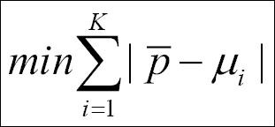

在第一个例子中，我们将首先处理固定的簇形心。

## 从简单开始——约翰·斯诺研究霍乱

1854 年，伦敦西北部布罗德街附近爆发了霍乱。当时的主要理论声称霍乱通过污浊的空气传播，就像人们认为瘟疫是通过污浊的空气传播一样。当时的医生约翰·斯诺假设霍乱是通过饮用水传播的。在疫情期间，约翰追踪了死亡人数，并将其绘制在该地区的地图上。通过他的分析，他得出结论，大多数案例都集中在布罗德街水泵上。有传言称，他随后拆除了水泵的手柄，从而阻止了一场疫情。今天，我们知道霍乱通常通过被污染的食物或水传播，从而证实了约翰的假设。我们将对约翰·斯诺的数据做一个简短但有启发性的再分析。

数据来源于国家地理信息与分析中心公共数据档案([http://www.ncgia.ucsb.edu/](http://www.ncgia.ucsb.edu/)[http://www.ncgia.ucsb.edu/pubs/data.php](http://www.ncgia.ucsb.edu/pubs/data.php))。数据文件的清理图和副本以及数据的地理空间信息分析示例也可以在[https://www.udel.edu/johnmack/frec682/cholera/cholera2.html](https://www.udel.edu/johnmack/frec682/cholera/cholera2.html)找到。关于医生和科学家约翰·斯诺的生活和工作的大量信息可以在[http://johnsnow.matrix.msu.edu](http://johnsnow.matrix.msu.edu)找到。

为了开始分析，我们把数据读入Pandas数据框；这些数据已经被格式化成了Pandas可读的 CSV 文件:

```py
deaths = pd.read_csv('data/cholera_deaths.txt') 
pumps = pd.read_csv('data/cholera_pumps.txt') 

```

每个文件包含两列，一列为`X`坐标，一列为`Y`坐标。让我们看看它是什么样子的:

```py
deaths.head() 

```

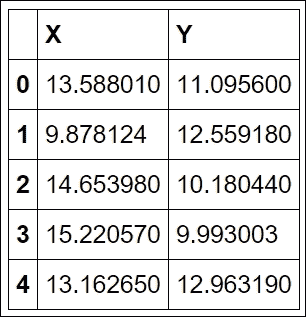

```py
pumps.head() 

```

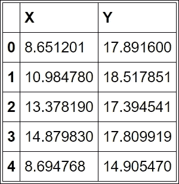

有了这些信息，我们现在可以绘制所有泵和死亡的图表，以便可视化数据:

```py
plt.figure(figsize=(4,3.5))  
plt.plot(deaths['X'], deaths['Y'],
         marker='o', lw=0, mew=1, mec='0.9', ms=6) 
plt.plot(pumps['X'],pumps['Y'],
         marker='s', lw=0, mew=1, mec='0.9', color='k', ms=6) 
plt.axis('equal') 
plt.xlim((4.0,22.0)); 
plt.xlabel('X-coordinate') 
plt.ylabel('Y-coordinate') 
plt.title('John Snow's Cholera') 

```

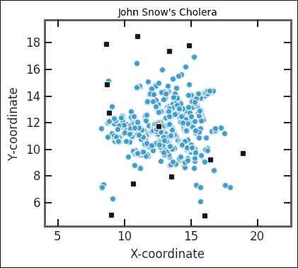

很容易看出中间的泵很重要。作为第一次数据探索，我们将简单地计算分布的平均质心，并在图中将其绘制为椭圆。我们计算沿 *x* 和 *y* 轴的平均值和标准偏差作为质心位置:

```py
fig = plt.figure(figsize=(4,3.5))  
ax = fig.add_subplot(111) 
plt.plot(deaths['X'], deaths['Y'],
         marker='o', lw=0, mew=1, mec='0.9', ms=6) 
plt.plot(pumps['X'],pumps['Y'],
         marker='s', lw=0, mew=1, mec='0.9', color='k', ms=6) 

from matplotlib.patches import Ellipse 
ellipse = Ellipse(xy=(deaths['X'].mean(), deaths['Y'].mean()),
                  width=deaths['X'].std(), height=deaths['Y'].std(),
                  zorder=32, fc='None', ec='IndianRed', lw=2) 
ax.add_artist(ellipse) 
plt.plot(deaths['X'].mean(), deaths['Y'].mean(),
         '.', ms=10, mec='IndianRed', zorder=32) 
for i in pumps.index: 
    plt.annotate(s='{0}'.format(i), xy=(pumps[['X','Y']].loc[i]),
                 xytext=(-15,6), textcoords='offset points') 
plt.axis('equal') 
plt.xlim((4.0,22.5)) 
plt.xlabel('X-coordinate') 
plt.ylabel('Y-coordinate') 
plt.title('John Snow's Cholera') 

```

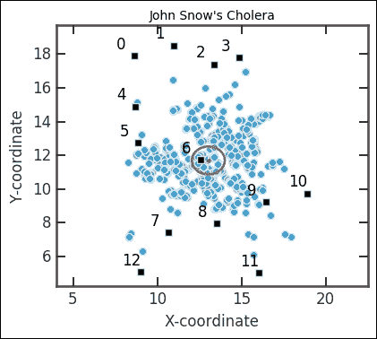

这里，我们还绘制了泵指数，它可以通过`pumps.index`方法从数据框中获得。分析的下一步是看哪个泵最接近每个点。我们通过计算从所有泵到所有点的距离来做到这一点。然后，我们想弄清楚每个点，哪个泵最接近。

我们将距离每个点最近的泵保存在死亡数据框的单独一列中。有了这个数据集，for 循环运行得相当快。但是，与`sum()`和`idxmin()`方法链接的 DataFrame 减法需要几秒钟。我强烈建议你用各种方法来加速这个过程。我们还使用数据框的`.apply()`方法对值进行平方和平方根。这种简单的暴力第一次尝试花了一分多钟来运行。内置的函数和方法帮助很大:

```py
deaths_tmp = deaths[['X','Y']].as_matrix() 
idx_arr = np.array([], dtype='int') 
for i in range(len(deaths)): 
    idx_arr = np.append(idx_arr,
              (pumps.subtract(deaths_tmp[i])).apply(lambda
              x:x**2).sum(axis=1).apply(lambda x:x**0.5).idxmin()) 
deaths['C'] = idx_arr 

```

打印出表格的前几行，快速检查是否一切正常:

```py
deaths.head() 

```

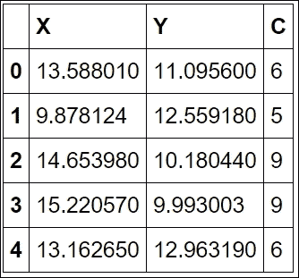

现在我们想想象我们所拥有的。通过颜色，我们可以显示出我们把每一次死亡与哪个水泵联系在一起。为了做到这一点，我们使用彩色地图；在这种情况下，*喷射*色图。通过用 0 到 1 之间的值调用 colormap，它返回一个颜色；因此，我们给它泵索引，然后用泵的总数除以它-在我们的例子中是 12:

```py
fig = plt.figure(figsize=(4,3.5)) 
ax = fig.add_subplot(111) 
np.unique(deaths['C'].values) 
plt.scatter(deaths['X'].as_matrix(), deaths['Y'].as_matrix(),  
               color=plt.cm.jet(deaths['C']/12.),  
               marker='o', lw=0.5, edgecolors='0.5', s=20) 
plt.plot(pumps['X'],pumps['Y'],  
marker='s', lw=0, mew=1, mec='0.9', color='0.3', ms=6) 
for i in pumps.index: 
plt.annotate(s='{0}'.format(i), xy=(pumps[['X','Y']].loc[i]),
             xytext=(-15,6), textcoords='offset points',
             ha='right') 
ellipse = Ellipse(xy=(deaths['X'].mean(), deaths['Y'].mean()),
                  width=deaths['X'].std(),
                  height=deaths['Y'].std(),
                  zorder=32, fc='None', ec='IndianRed', lw=2) 
ax.add_artist(ellipse) 
plt.axis('equal') 
plt.xlim((4.0,22.5)) 
plt.xlabel('X-coordinate') 
plt.ylabel('Y-coordinate') 
plt.title('John Snow's Cholera') 

```

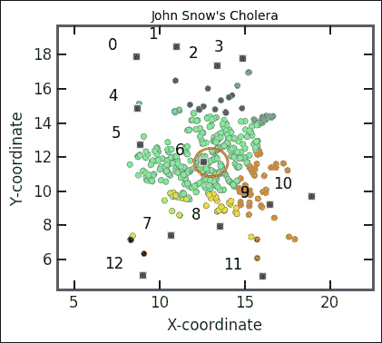

大多数死亡病例主要是因为水泵靠近中心。这个水泵位于布罗德大街。

现在，记住我们已经使用了集群质心的固定位置。在这种情况下，我们基本上假设水泵与霍乱病例有关。此外，欧几里得距离并不是真实的距离。人们沿着道路去取水，那里的路不一定是直的。因此，人们必须绘制出街道图，并计算出从那里到每个水泵的距离。即便如此，已经到了这个程度，很明显中心泵与霍乱病例有关。你如何解释不同的距离？为了计算距离，你可以做所谓的成本分析(c.f .当你点击卫星导航上的方向去一个地方)。做成本分析有很多不同的方法，它也涉及到在迷宫中找到正确方法的问题。

除了这些事情之外，我们没有任何时域数据，也就是说，随着时间的推移，霍乱可能会传播到其他水泵，疫情可能从布罗德街水泵开始，并传播到附近的其他水泵。没有时间数据，想弄清楚发生了什么就特别困难。

这是集群发现的一般方法。坐标可能是属性，例如狗的长度和重量，以及群集质心的位置，我们会反复移动，直到找到最佳位置。

# K-均值聚类

K 均值算法也被称为向量量化。该算法所做的是找到使到聚类中所有点的距离最小的聚类(质心)位置。这是迭代完成的；算法的问题是它可能有点贪婪，这意味着它会很快找到最近的最小值。这通常通过某种跳盆方法来解决，其中找到的最近的最小值被随机扰动，并且算法重新开始。由于这个事实，算法依赖于良好的初始猜测作为输入。

## 自杀率对国内生产总值对绝对纬度

如 *[第四章](104.html "Chapter 4. Regression")**回归*所述，我们将针对集群分析自杀率对比 GDP 对比绝对纬度或**离赤道度数** ( **DFE** )的数据。我们从视觉检查中得出的假设是，至少有两个不同的集群，一个具有较高的自杀率、国内生产总值和绝对纬度，另一个具有较低的自杀率。我们在 *[第 4 章](104.html "Chapter 4. Regression")**回归*中保存了一个 HDF 文件，现在我们将其作为数据帧读入。这一次，我们希望丢弃一个或多个列条目为 NaN 或空的所有行。因此，我们对此使用适当的 DataFrame 方法:

```py
TABLE_FILE = 'data/data_ch4.h5' 
d2 = pd.read_hdf(TABLE_FILE) 
d2 = d2.dropna() 

```

接下来，虽然数据帧是一种非常方便的格式，我们将在后面使用，但 SciPy 中集群算法的输入并不处理Pandas的数据类型。因此，我们将数据传输到 NumPy 数组:

```py
rates = d2[['DFE','GDP_CD','Both']].as_matrix().astype('float') 

```

接下来，概括一下，我们用一个国内生产总值直方图和一个所有数据的散点图来可视化数据。我们这样做是为了帮助我们对集群质心位置进行初步猜测:

```py
plt.subplots(12, figsize=(8,3.5)) 
plt.subplot(121) 
plt.hist(rates.T[1], bins=20,color='SteelBlue') 
plt.xticks(rotation=45, ha='right') 
plt.yscale('log') 
plt.xlabel('GDP') 
plt.ylabel('Counts') 
plt.subplot(122) 
plt.scatter(rates.T[0], rates.T[2],  
            s=2e5*rates.T[1]/rates.T[1].max(), 
            color='SteelBlue', edgecolors='0.3'); 
plt.xlabel('Absolute Latitude (Degrees, 'DFE')') 
plt.ylabel('Suicide Rate (per 100')') 
plt.subplots_adjust(wspace=0.25); 

```

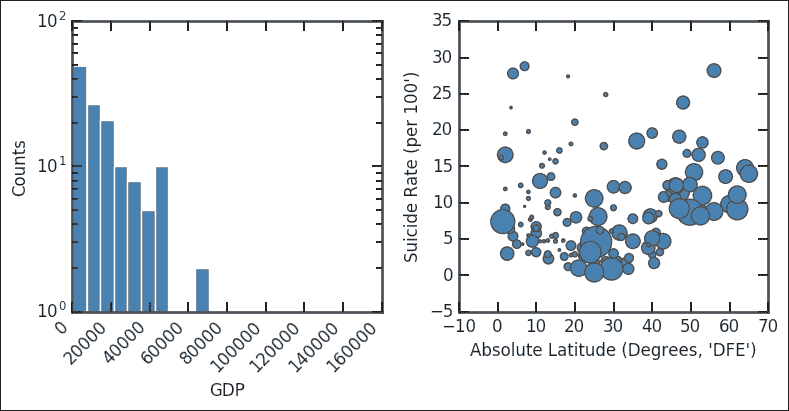

右边的散点图显示了 y 轴上的**自杀率**和 x 轴上的**绝对纬度**。每个点的大小与该国的国内生产总值成正比。运行聚类 k-means 的函数采用一种特殊的规范化输入。数据数组(列)必须通过数组的标准偏差进行规范化。虽然这很简单，但模块中包含了一个名为`whiten`的函数。它将使用标准差来缩放数据:

```py
w = vq.whiten(rates) 

```

为了展示它对数据的作用，我们再次绘制了前面的图，但是使用了`whiten`函数的输出:

```py
plt.subplots(12, figsize=(8,3.5)) 
plt.subplot(121) 
plt.hist(w[:,1], bins=20, color='SteelBlue') 
plt.yscale('log') 
plt.subplot(122) 
plt.scatter(w.T[0], w.T[2], s=2e5*w.T[1]/w.T[1].max(),  
            color='SteelBlue', edgecolors='0.3') 
plt.xticks(rotation=45, ha='right'); 

```


如您所见，所有数据都是根据上图进行缩放的。然而，如上所述，比例只是标准差。让我们计算缩放比例并将其保存到`sc`变量中:

```py
sc = rates.std(axis=0) 

```

现在，我们准备好估计聚类质心的初始猜测。读取第一个数据图，我们猜测质心在 20 DFE，20 万 GDP，10 次自杀，第二个在 45 DFE，10 万 GDP，15 次自杀。我们将它放在一个数组中，并用我们的缩放参数将其缩放到与`whiten`函数的输出相同的比例。然后发送到 SciPy 的`kmeans2`功能:

```py
init_guess = np.array([[20,20E3,10],[45,100E3,15]]) 
init_guess /= sc
z2_cb, z2_lbl = vq.kmeans2(w, init_guess, minit='matrix',
                           iter=500) 

```

还有另一个函数`kmeans`(没有`2`)，它是一个不太复杂的版本，当到达局部极小值时不会停止迭代；当两次迭代之间的变化低于某个水平时，它就停止了。因此，标准的 k-means 算法在 SciPy 中由`kmeans2`函数表示。该函数输出质心的缩放位置(这里是`z2_cb`)和一个查找表(`z2_lbl`)，告诉我们哪一行属于哪个质心。为了得到我们*理解的*单位的质心位置，我们简单地乘以我们的比例值:

```py
z2_cb_sc = z2_cb * sc 

```

此时，我们可以绘制结果。下面的部分相当长，包含了许多不同的部分，所以我们将一节一节地讨论它们。但是，代码应该在笔记本的一个单元格中运行:

```py
# K-means clustering figure START 
plt.figure(figsize=(6,4)) 
plt.scatter(z2_cb_sc[0,0], z2_cb_sc[0,2],
            s=5e2*z2_cb_sc[0,1]/rates.T[1].max(),
            marker='+', color='k',
            edgecolors='k', lw=2, zorder=10, alpha=0.7);
plt.scatter(z2_cb_sc[1,0], z2_cb_sc[1,2],
            s=5e2*z2_cb_sc[1,1]/rates.T[1].max(),
            marker='+', color='k', edgecolors='k', lw=3,
            zorder=10, alpha=0.7); 

```

第一步相当简单；我们设置图形大小并绘制聚类质心的点。我们假设了两个集群，因此我们用对`plt.scatter`的两个不同调用来绘制它们。这里，`z2_cb_sc[1,0]`从数组中获取第二个簇`x`坐标(DFE)，然后将 0 切换为 1，就得到`y`坐标(速率)。我们将标记的大小设置为与第三个数据轴(国内生产总值)的值成比例。我们还对数据做了进一步的处理，就像前面的图一样，这样更容易比较和区分聚类。`zorder`关键字给出了绘制元素的深度顺序；高的`zorder`会把它们放在其他东西上面，负的`zorder`会把它们送到后面。

```py
s0 = abs(z2_lbl==0).astype('bool') 
s1 = abs(z2_lbl==1).astype('bool') 
pattern1 = 5*'x' 
pattern2 = 4*'/' 
plt.scatter(w.T[0][s0]*sc[0],  
            w.T[2][s0]*sc[2],  
            s=5e2*rates.T[1][s0]/rates.T[1].max(), 
            lw=1, 
            hatch=pattern1, 
            edgecolors='0.3', 
            color=plt.cm.Blues_r( 
                rates.T[1][s0]/rates.T[1].max())); 
plt.scatter(rates.T[0][s1], 
            rates.T[2][s1],  
            s=5e2*rates.T[1][s1]/rates.T[1].max(), 
            lw=1, 
            hatch=pattern2, 
            edgecolors='0.4', 
            marker='s', 
            color=plt.cm.Reds_r( 
                rates.T[1][s1]/rates.T[1].max()+0.4)) 

```

在本节中，我们绘制了簇的点。首先，我们得到选择数组。它们只是布尔数组，即对应于簇 0 或簇 1 的值为真的数组。因此，当簇 id 为 0 时 s0 为真，当簇 id 为 1 时 s1 为真。接下来，我们为散点图标记定义阴影图案，稍后我们给出绘图函数作为输入。填充图案的乘数给出图案的密度。点的散点图是以类似于质心的方式创建的，只是标记稍微复杂一些。它们都是彩色编码的，就像前面霍乱死亡的例子一样，但是都是渐变的，而不是所有点都是完全相同的颜色。梯度由国内生产总值定义，国内生产总值也定义了点的大小。发送到图中的 x 和 y 数据在集群之间是不同的，但是它们最终访问相同的数据，因为我们乘以了我们的比例因子。

```py
p1 = plt.scatter([],[], hatch='None',  
                 s=20E3*5e2/rates.T[1].max(),  
                 color='k', edgecolors='None',) 
p2 = plt.scatter([],[], hatch='None', 
                 s=40E3*5e2/rates.T[1].max(),   
                 color='k', edgecolors='None',) 
p3 = plt.scatter([],[], hatch='None', 
                 s=60E3*5e2/rates.T[1].max(),  
                 color='k', edgecolors='None',) 
p4 = plt.scatter([],[], hatch='None', 
                 s=80E3*5e2/rates.T[1].max(),  
                 color='k', edgecolors='None',) 
labels = ["20'", "40'", "60'", ">80'"] 
plt.legend([p1, p2, p3, p4], labels, ncol=1,  
           frameon=True, #fontsize=12, 
           handlelength=1, loc=1,  
           borderpad=0.75,labelspacing=0.75, 
           handletextpad=0.75, title='GDP', scatterpoints=1.5) 
plt.ylim((-4,40)) 
plt.xlim((-4,80)) 
plt.title('K-means clustering') 
plt.xlabel('Absolute Latitude (Degrees, 'DFE')') 
plt.ylabel('Suicide Rate (per 100 000)'); 

```

对绘图的最后一个调整是通过创建自定义图例进行的。我们想展示这些点的不同规模以及它们对应的国内生产总值。由于从低到高有一个连续的梯度，我们不能使用绘制的点。因此，我们创建自己的坐标，但将`x`和`y`输入坐标保留为空列表。这不会在剧情中显示任何东西，但是我们可以用它们在传说中注册。图例功能的各种调整控制图例布局的不同方面。我鼓励你尝试一下，看看会发生什么:

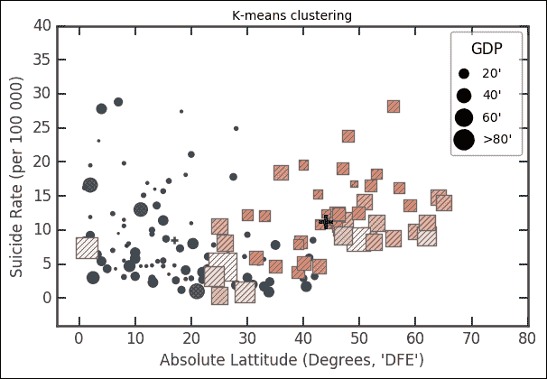

至于最后的分析，确定了两个不同的集群。就像我们之前的假设一样，有一个集群具有明显的线性趋势，GDP 相对较高，也位于较高的绝对纬度。虽然辨识度比较弱，但很明显这两个群体是分开的。国内生产总值低的国家聚集在赤道附近。当您添加更多集群时会发生什么？尝试为低 DFE 高比率国家添加一个集群，将其可视化，并思考这对结论意味着什么。

# 层次聚类分析

层次聚类是基于连通性的聚类。它假设集群是连接的，或者换句话说，是链接的。例如，我们可以根据这个假设对动物和植物进行分类。我们都是从共同点发展而来的。这使得我们有可能一方面假设每个观测都是它自己的群，另一方面假设所有观测都在同一个群中。这也形成了两种层次聚类算法的基础，凝聚和分裂:

*   **凝聚聚类**从自身聚类中的每个点开始，然后合并相异度最低的两个聚类，即自下而上的方法
*   **分裂集群**顾名思义，是一种自上而下的方法，我们从一个单独的集群开始，这个集群被分成越来越小的集群

与 k-means 相反，它为我们提供了一种识别聚类的方法，而无需对聚类的数量或聚类位置进行初始猜测。对于这个例子，我们将在 SciPy 中运行一个凝聚聚类算法。

## 读入并减少数据

宇宙中的星系不是随机分布的，它们形成星团和细丝。这些结构暗示了宇宙复杂的运动和历史。星系团有许多不同的目录，尽管对星系团进行分类的技术各不相同，对此有几种观点。我们将使用更新的兹维奇星表，它包含 19，367 个星系(Falco 等人，1999，PASP 111，438)。文件可以从[http://tdc-www.harvard.edu/uzc/index.html](http://tdc-www.harvard.edu/uzc/index.html)下载。第一份《兹维奇星系和星系团目录》于 1961 年发布(兹维奇等人，1961-1968 年。星系和星系团目录，第 1-6 卷。加州理工学院)。

首先，我们导入一些必需的包，将文件读入到一个数据框中，并研究我们所拥有的:

```py
import astropy.coordinates as coord 
import astropy.units as u 
import astropy.constants as c 

```

Astropy 是一个社区开发的天文软件包，帮助天文学家分析和创建强大的软件来处理他们的数据([http://www.astropy.org/](http://www.astropy.org/))。我们导入可以处理天文坐标(**世界坐标系** - **WCS** )并转换的坐标包。单位和常数包是处理物理单位(转换等)和常数(带有单位)的包；在单位很重要的情况下，两者都非常便于计算:

```py
uzcat = pd.read_table('data/uzcJ2000.tab/uzcJ2000.tab',
                      sep='\t', header=16, dtype='str',
                      names=['ra', 'dec', 'Zmag', 'cz', 'cze', 'T', 'U',
                             'Ne', 'Zname', 'C', 'Ref', 'Oname', 'M', 'N'],
                      skiprows=[17]) 

```

让我们用 head 方法来看看数据:

```py
uzcat.head() 

```


前两列`ra`和`dec`是赤道坐标系中的坐标。基本上，如果你想象地球的经纬度系统扩大了，我们就在里面了。赤纬是经度，赤纬是纬度。这样做的一个结果是，当我们在里面的时候，东方是西方，西方是东方。第三列是 Z 星等，这是测量星系在某个光波长下的亮度(以对数为单位)。第四列是相对于我们太阳的红移距离，单位为千米/秒(第五列是不确定性)(即日心说距离)。这个奇数单位是红移乘以光速(`v = cz`、`z: redshift`)。由于其简单性，`v`参数的速度可以超过光速，即非物理速度。它假设宇宙中每个星系的径向速度都由宇宙的膨胀所支配。回忆起在 *[第三章](103.html "Chapter 3. Learning About Models")**关于模型的学习*中，我们看了哈勃定律，宇宙的膨胀随着距离线性增加。虽然哈勃常数在短距离内是恒定的，但今天我们知道宇宙的膨胀速度(即哈勃常数，H <sub>0</sub> )在大距离时会发生变化，这种变化取决于宇宙学假设的情况。稍后我们将把这个距离转换成更容易掌握的距离。

其余各栏在随附的自述文件中或在线上的[http://tdc-www.harvard.edu/uzc/uzcjformat.html](http://tdc-www.harvard.edu/uzc/uzcjformat.html)中进行了描述。

首先，我们想把坐标翻译成比字符串更易读的东西(即`ra`和`dec`列)。赤道坐标以小时、分钟和秒为单位，以度、分钟和秒为单位。要从小时中获得度数，只需将小时乘以 15(即 360 度除以 24 小时)。选择此数据集作为示例的首要原因之一是，由于坐标系的原因，距离不是欧几里德距离。为了能够使用它，我们必须将坐标转换成笛卡尔坐标，我们很快就会这样做。如前所述，我们现在用坐标解决第一件事；我们将它们转换成可以理解的字符串:

```py
df['ra'] = df['ra'].apply(lambda x: '{0}h{1}m{2}s'.format(
                          x[:2],x[2:4],x[4:])) 
df['dec'] = df['dec'].apply(lambda x: '{0}d{1}m{2}s'.format(
                            x[:3],x[3:5],x[5:])) 
df.head() 

```


接下来，我们需要将`np.nan`放在条目为空的地方(我们正在检查它是否是一个带有空格的空字符串)。使用`apply`，您可以将函数应用于某一列/行，`applymap`将函数应用于每个表条目:

```py
uzcat = uzcat.applymap(lambda x: np.nan if
                       isinstance(x, str) and
                       x.isspace() else x) 
uzcat['cz'] = uzcat['cz'].astype('float') 

```

我们还通过运行`mycat.Zmag = mycat.Zmag.astype('float')`将星等列转换为浮点数。为了对数据进行初步可视化，我们需要将坐标转换为弧度或角度，matplotlib 理解这一点。为此，我们使用方便的天文坐标包:

```py
coords_uzc = coord.SkyCoord(uzcat['ra'], uzcat['dec'], frame='fk5',
                            equinox='J2000') 

```

我们现在可以访问一个对象中的坐标，并将它们转换为不同的单位。例如，`coords_uzc.ra.deg.min()`将以度为单位返回最小 RA 坐标；将`deg`替换为`rad`将返回弧度。在这个层面上将其可视化有几个原因；这样做的一个原因是，我们想要检查坐标覆盖了什么；我们在看天空的哪一部分。为此，我们使用投影方法；否则，这些坐标没有意义，因为它们不是常见的 *x* 、 *y* 、 *z* 坐标(在本例中，是莫勒维德投影)，所以我们看到的是整个天空变平了:

```py
color_czs = (uzcat['cz']+abs(uzcat['cz'].min())) /  
            (uzcat['cz'].max()+abs(uzcat['cz'].min())) 
from matplotlib.patheffects import withStroke 
whitebg = withStroke(foreground="w", linewidth=2.5) 
fig = plt.figure(figsize=(8,3.5)) 
ax = fig.add_subplot(111, projection="mollweide") 
ax.scatter(coords_uzc.ra.radian-np.pi, coords_uzc.dec.radian,  
           color=plt.cm.Blues_r(color_czs), alpha=0.6, 
           s=4, marker='.', zorder=-1) 
plt.grid() 
for tick in ax.get_xticklabels(): 
    tick.set_path_effects([whitebg])  

```

由于散射点是暗的，我还修改了路径效果的刻度标签，这是在 matplotlib 1.4 中引入的。这使得区分坐标标签变得更加容易:

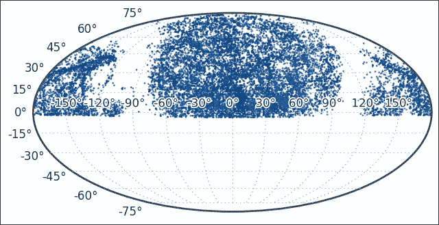

我们可以看到，我们只有天空上部的数据。我们也看到了银河系的范围，它的气体和尘埃挡住了我们的视线，在数据集中没有发现星系。为了尽量减少我们看到的数据，我们将沿着 12 月 15 到 30 度之间的方向进行切割。让我们检查一下覆盖的距离分布:

```py
uzcat['cz'].hist(bins=50) 
plt.yscale('log') 
plt.xlabel('CZ-distance') 
plt.ylabel('Counts') 
plt.xticks(rotation=45, ha='right'); 

```

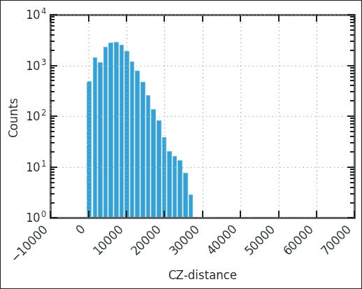

峰值约为 10，000 公里/秒，我们以 12，500 公里/秒的速度切断了它。让我们自上而下地想象一下这个切口。我们不看`RA`和`Dec`，而是看`RA`和`cz`。首先，我们创建选择:

```py
uzc_czs = uzcat['cz'].as_matrix() 
uzcat['Zmag'] = uzcat['Zmag'].astype('float') 
decmin = 15 
decmax = 30 
ramin = 90 
ramax = 295 
czmin = 0 
czmax = 12500 
selection_dec = (coords_uzc.dec.deg>decmin) * 
                (coords_uzc.dec.deg<decmax) 
selection_ra = (coords_uzc.ra.deg>ramin) * 
               (coords_uzc.ra.deg<ramax) 
selection_czs = (uzc_czs>czmin) * (uzc_czs<czmax) 
selection= selection_dec * selection_ra * selection_czs 

```

为了方便起见，我们从数据框中导出`cz`列；我们为每个选择创建一个单独的布尔数组。这样，我们可以过滤任何我们想要的。比如调用`coords_uzc.ra.radian[selection_dec*selection_ra]`只会过滤掉我们要找的`RA`和`Dec`。接下来，我们只使用`Dec`滤镜来绘制，然后想象我们将要切入`cz`和`RA`的位置。我没有解释这里选择的`RA`和`cz`中的切割，但是看了下面的图片后做的:

```py
fig = plt.figure( figsize=(6,6)) 
ax = fig.add_subplot(111, polar=True) 
sct = ax.scatter(coords_uzc.ra.radian[selection_dec],
                 uzc_czs[selection_dec],
                 color='SteelBlue',
                 s=uzcat['Zmag'][selection_dec*selection_czs],
                 edgecolors="none",
                 alpha=0.7,
                 zorder=0) 
ax.set_rlim(0,20000) 
ax.set_theta_offset(np.pi/-2) 
ax.set_rlabel_position(65) 
ax.set_rticks(range(2500,20001,5000)); 
ax.plot([(ramin*u.deg).to(u.radian).value,  
         (ramin*u.deg).to(u.radian).value], [0,12500],  
         color='IndianRed', alpha=0.8, dashes=(10,4)) 
ax.plot([ramax*np.pi/180., ramax*np.pi/180.], [0,12500], 
        color='IndianRed', alpha=0.8, dashes=(10,4)) 
        theta = np.arange(ramin, ramax, 1) 
ax.plot(theta*np.pi/180., np.ones_like(theta)*12500,
        color='IndianRed', alpha=0.8, dashes=(10,4)) 

```


这里，当我们实例化子剧情时，我们通过传递`polar=True`来使用极坐标图，并将`selection_dec`过滤器应用于所有高于`30`和低于`15`度的`Dec`值。坐标需要以弧度给出，因此我们按照前面的描述，通过简单地要求以弧度表示的坐标，就可以转到弧度。接下来，我们自定义绘图，顺时针旋转绘图 90 度，弧度为π/2。为了更容易阅读径向距离轴标签，我们将它们设置为以 65 度绘制，并设置它们应该绘制的距离。最后两个函数调用绘制了虚线区域，我将该区域设置为`selection_ra`和`selection_czs`。接下来，我们只绘制选择点并放大一点:

```py
fig = plt.figure( figsize=(6,6)) 
ax = fig.add_subplot(111, polar=True) 
sct = ax.scatter(coords_uzc.ra.radian[selection],
                 uzc_czs[selection],
                 color='SteelBlue',
                 s=uzcat['Zmag'][selection],
                 edgecolors="none",
                 alpha=0.7,
                 zorder=0) 
ax.set_rlim(0,12500) 
ax.set_theta_offset(np.pi/-2) 
ax.set_rlabel_position(65) 
ax.set_rticks(range(2500,12501,2500)); 

```


需要注意的是，大多数坐标都在 90 到 270 度形成的直线之上。这将对笛卡尔坐标产生影响。对于总目录的一个子部分，最好创建一个单独的数据框来存储其中的所有内容，包括以度为单位的坐标:

```py
mycat = uzcat.copy(deep=True).loc[selection] 
mycat['ra_deg'] = coords_uzc.ra.deg[selection] 
mycat['dec_deg'] = coords_uzc.dec.deg[selection] 

```

虽然`RA`、`Dec`、`cz`对于天文学家来说是完全可以理解的坐标格式，但对于大多数人来说却不是(对于天文学家来说甚至很难消化)。所以我们现在将这些球面坐标(天球赤道坐标系)转换为`X`、`Y`、`Z`。为此，我们在 Astropy 坐标包中使用了一些非常方便的函数，我们已经使用过了。首先，我们计算到星系的实际距离。为此，我们使用`Distance`函数，该函数可以用不同的宇宙几何/宇宙学来完成，但缺省值(当前值)对我们来说没问题:

```py
zs = (((mycat['cz'].as_matrix()*u.km/u.s) / c.c).decompose()) 
dist = coord.Distance(z=zs) 
print(dist) 
mycat['dist'] = dist 

```

我们现在有了计算星系笛卡尔坐标的一切:

```py
coords_xyz = coord.SkyCoord(ra=mycat['ra_deg']*u.deg,
                            dec=mycat['dec_deg']*u.deg,
                            distance=dist*u.Mpc,
                            frame='fk5',
                            equinox='J2000')

```

现在是将这些笛卡尔坐标保存到我们目录中的好时机:

```py
mycat['X'] = coords_xyz.cartesian.x.value 
mycat['Y'] = coords_xyz.cartesian.y.value 
mycat['Z'] = coords_xyz.cartesian.z.value 

```

我建议在我们创建的当前数据框架目录(即`mycat`)上运行`head()`和`describe()`。请注意，大多数`X`坐标都是负的。这是为什么？还记得我们大多数选择的`RA`坐标吗？回去看看我们画的极坐标图。`RA`在 90 度到 270 度之间；基本上反方向 0 度，导致他们现在有负 X 坐标。现在我想把这个情节；由于它实际上是三维数据，我将使用两个图来可视化三维:

```py
fig, axs = plt.subplots(1,2, figsize=(14,6)) 
plt.subplot(121) 
plt.scatter(mycat['Y'], -1*mycat['X'], s=8,
            color=plt.cm.OrRd_r(10**(mycat.Zmag
                                     -mycat.Zmag.max())),
            edgecolor='None') 
plt.xlabel('Y (Mpc)'); plt.ylabel('X (Mpc)') 
plt.axis('equal'); 
plt.subplot(122) 
plt.scatter(-1*mycat['X'],mycat['Z'], s=8,
            color=plt.cm.OrRd_r(10**(mycat.Zmag
                                     -mycat.Zmag.max())),
            edgecolor='None') 
lstyle = dict(lw=1.5, color='k', dashes=(6,4)) 
plt.plot([0,150], [0,80], **lstyle) 
plt.plot([0,150], [0,45], **lstyle) 
plt.plot([0,-25], [0,80], **lstyle) 
plt.plot([0,-25], [0,45], **lstyle) 
plt.xlabel('X (Mpc)'); plt.ylabel('Z (Mpc)') 
plt.axis('equal') 
plt.subplots_adjust(wspace=0.25); 

```

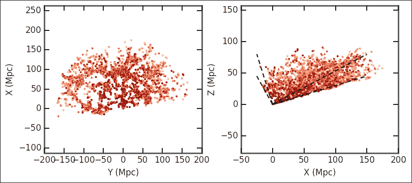

像这样可视化它会给你一个很好的概述，即使数据是三维的。我们本可以在转换到`X`、`Y`和`Z`坐标后进行选择，并切割出一个立方体。试试这个，看看这个练习的结果有什么不同。再者，我建议你在这个阶段尝试制作一个立体的剧情；代码参考前一章( *[第四章](104.html "Chapter 4. Regression")* 、*回归*)。我们现在已经缩小了目录，以覆盖我们感兴趣的区域，并将一些列映射到易于函数读取的值。现在是时候保存它，以便更容易地从我们停止的地方开始。就像上一章一样，我们使用 HDF 文件格式:

```py
TABLE_FILE = 'data/data_ch5_clustering.h5' 
mycat.to_hdf(TABLE_FILE, 'ch5data', mode='w', table=True) 

```

作为替代方案，如果您对 HDF 库有问题或者只是想要一个替代方案，您也可以使用 pickle 模块保存它，这是 Python 中的一个标准模块:

```py
mycat.to_pickle('data/data_ch5_clustering.pick') 

```

我们将在 *[第 7 章](107.html "Chapter 7. Supervised and Unsupervised Learning")**监督和非监督学习*中阅读这些数据。现在，我们已经减少了数据，以便对其进行聚类分析。

## 分层聚类算法

分层凝聚聚类算法通过`linkage`函数在 SciPy 中运行，该数组作为输入。链接函数中有两个主要参数需要设置，方法和度量:

*   **方法**定义要使用的链接算法，即我们如何估计两个聚类之间的差异，从而定义聚类是如何形成的
*   **度量**定义距离度量；在这种情况下，我们使用的是非分类变量，其中距离是有意义的

在我们的例子中，我们已经将数据转换为笛卡尔坐标，这样我们就可以使用公共的欧几里得距离。可以定义自己的距离函数。链接功能中可能的方法和指标在 http://docs.scipy.org/[的 SciPy 文档中列出。](http://docs.scipy.org/)

联动函数取一个 N 乘 2 的数组(N 个数据点)，所以这里只使用 *X* 和 *Y* 坐标:

```py
galpos = np.array([mycat.X,mycat.Y]).T 
z_centroid = hac.linkage(galpos, metric = 'euclidean',
                         method = 'centroid')

```

这里的输出是链接矩阵。这是整个运行的结果；它包含四列。为了快速说明它包含的内容，我们运行了一个受控且小得多的示例。为了可视化各个组级别，我们还绘制了一个树形图，这是通过`hac.dendrogram`函数完成的，该函数将链接输出作为输入。它以一种便捷的方式可视化了聚类序列。根级别是整个数据集位于一个集群中的级别。另一端是较低层次的集群；但是，它们连接到根级别。每个节点代表一组集群，每个节点连接到两个子节点。如果绘制了所有级别，则末端节点(最低级别的节点)称为叶节点，并且只包含一个数据点(观察)。这些是如何连接的由链接定义(相异度测量算法)决定:

```py
x = np.array([1,2,2,1,6,7,8,5]) 
y = np.array([8,6,8,7,1,2,2,3]) 
a = np.array([x,y]).T 
z = hac.linkage(a, metric = 'euclidean', method = 'centroid') 
fig, axs = plt.subplots(1,2,figsize=(7,3)) 
axs[0].scatter(x,y, marker='o', s=40, c='IndianRed') 
axs[0].set_xlabel('X'); axs[0].set_ylabel('Y'); 
for i in range(len(x)): 
    axs[0].annotate(s=str(i), xy=(x[i]+0.1,y[i]+0.1)) 
ellipse1 = Ellipse(xy=(1.6,8.2),  
                   width=2., height=1.2, 
                   zorder=32, fc='None', ec='k', lw=1.5) 
axs[0].add_artist(ellipse1) 
d_temp = hac.dendrogram(z, ax=axs[1]) 
axs[1].annotate(s='8',
                xy=(np.mean(d_temp['icoord'][0][1:-1]),
                d_temp['dcoord'][0][1]),
                xytext=(3,3), textcoords='offset points') 
axs[1].annotate(s='9',
                xy=(np.mean(d_temp['icoord'][3][1:-1]),
                d_temp['dcoord'][3][1]), 
                xytext=(3,3), textcoords='offset points')
axs[1].annotate(s='10',
                xy=(np.mean(d_temp['icoord'][1][1:-1])-2,
                d_temp['dcoord'][1][1]),
                xytext=(3,3), textcoords='offset points',
                ha='right')
axs[1].annotate(s='Root',
                xy=(np.mean(d_temp['icoord'][-1][1:-1]),
                d_temp['dcoord'][-1][1]-0.3),
                xytext=(5,5), textcoords='offset points',
                va='top', ha='center')
axs[1].set_xlabel('Leafs') 

```


在联动输出`z`中，第一行是`[0., 2., 1., 2.]`，表示如下:簇索引 0 和 2 组成一个组，它们的距离是`1`，组中的叶数(数据点)是`2`。这组被包围在图像中。组号是原始点数加上迭代次数(`n+i`)；在这种情况下，我们形成集群 8 (8+0)。第三排(`NB`，不是第二排！)里面有数字`[3., 8., 1.11803399, 3.]`。它结合了簇索引 3，在这种情况下，这只是一个点，因为每个小于 8 的簇号都是簇 8 的点/叶，就像我们在第一次迭代中创建的一样。它们之间的距离(使用给定的度量和方法)是`1.111803399`并且它包含三个叶子。形成第 10<sup>簇，即 8 + 2 次迭代。我已经在示例树图中说明了这些节点，并标记了集群组编号 10。想想它如何适合这里描述的链接输出。</sup>

有了这些知识，我们现在可以绘制主要数据分析的树形图:

```py
fig, ax = plt.subplots(1, figsize=(8,6)) 
d0 = hac.dendrogram(z_centroid, p=6, truncate_mode='level',  
                    orientation='right', ax=ax) 

```

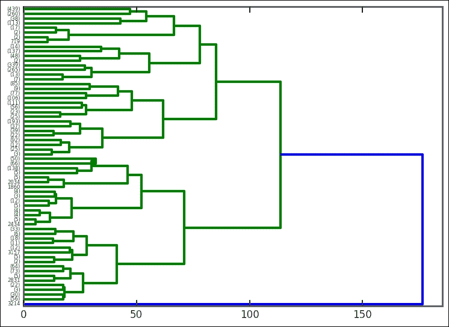

这一次，我给绘图功能增加了一些参数——我们将整个树形图倾斜了 90 度。两个节点之间的高度与节点之间的不同程度成正比(距离法)。将这个树形图切开会产生一定数量的簇。有趣的是，根节点只分裂一次成两个簇，其中只有一个继续分裂。为了得到某个级别的聚类，我们使用`fcluster`函数，这也是 SciPy 聚类模块的一部分。我建议你尝试不同数量的集群并绘制它们。在下面的例子中，我使用了`20`集群:

```py
nclust = 20 
part_centroid = hac.fcluster(z_centroid, 20, criterion='maxclust') 

```

这里，标准设定了形成集群的约束。为了检查每个聚类/组中的点的划分，我们绘制了一个直方图:

```py
plt.figure(figsize=(7,6)) 
otpt = plt.hist(part_centroid, color='SteelBlue', bins=nclust); 
plt.xlabel('Cluster no.'); plt.ylabel('Counts'); 

```

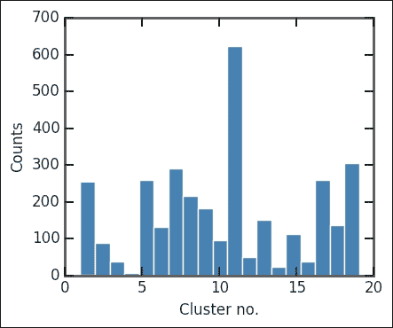

第 11<sup>集群有很多点。当然，这并不能告诉我们太多，所以现在我们绘制所有集群。作为每个簇的位置，我只是用数组对象的均值法计算质心。这只是为了更清楚地标记集群的位置:</sup>

```py
plt.figure(figsize=(6,5)) 
plt.subplot(111) 
part = part_centroid 
levels = np.arange(nclust) 
colors = plt.cm.rainbow(np.random.rand(len(levels))) 
for n, color in zip(levels, colors): 
    plt.scatter(mycat['Y'][part==n], -1*mycat['X'][part==n], s=12,
                color=color, edgecolor='None') 
    plt.plot(mycat['Y'][part==n].mean(),
             -1*mycat['X'][part==n].mean(),
             'o', c='0.7', mec='k', ms=6,
             ls='None', mew=1.5, alpha=0.7)
plt.xlabel('Y (Mpc)'); plt.ylabel('X (Mpc)') 
plt.scatter(mycat['Y'], -1*mycat['X'], s=10,
            color='0.7', edgecolor='None',zorder=-1) 
plt.title('A slice of the Universe - Clusters identified') 
plt.axis('equal'); 

```

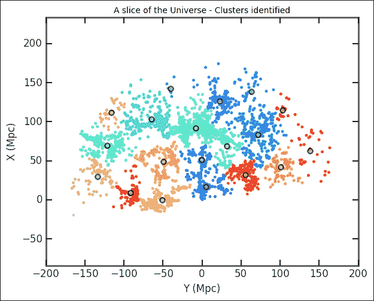

集群划分看起来很稳固。然而，我们通过目视检查改变集群数量的效果来确定集群的数量。这可能不是真实或理想的集群数量。在前面的例子中，我们有一个我们想要测试的两个集群的假设，但是即使在这种情况下，数据也可能更好地由例如三个集群或者可能没有集群(或者一个具有异常值的集群)来表示。我们希望有一种可重复的方法来确定集群的数量。有几种方法可以做到这一点；甚至还有一篇专门的维基百科文章介绍如何找到集群的数量([https://en . Wikipedia . org/wiki/decising _ the _ number _ of _ clusters _ in _ a _ data _ set](https://en.wikipedia.org/wiki/Determining_the_number_of_clusters_in_a_data_set))。确定最佳簇数的主要问题是我们必须假设一些关于簇形状的东西。分层聚类通过检查一个聚类的所有级别，假设每个聚类被分成更小的聚类，从而稍微避免了这个问题。

一种方法是通过计算每个聚类的平方距离(即方差)的归一化和来测量聚类的紧密度，然后用它来估计聚类大小的方差可以描述多少百分比的数据。逐渐增加聚类的数量，通过计算方差，你会得到一个聚类覆盖率增加的图表。当达到群集的`true`数量时，该方差(或覆盖率)将停止增加并变平。然而，这并不适合所有的丛形状；例如，想象一下，非常细长的椭圆彼此靠近。在我们的例子中，中等距离的团簇更多的是丝状的，而不是团簇状的(或高斯状的)。

# 总结

我们现在已经使用一系列方法来识别聚类，从手动计算简单的质心到 SciPy 中的高级层次聚类算法。当然，Python 中还有更多包。我们将在 *[第 7 章](107.html "Chapter 7. Supervised and Unsupervised Learning")**监督和非监督学习*中查看一个替代方案，即机器学习包 Scikit-learn，以识别聚类。SciPy 有这两个聚类框架，即向量量化和层次聚类，它们为聚类分析奠定了基础，在许多一般的数据分析问题中非常有用。在下一章中，我们将了解贝叶斯分析以及如何使用 Python 中的 PyMC 贝叶斯推理包来表征数据中的各种事物。