# 第八章。时间序列分析

有时我们要分析的数据是以固定时间间隔测量的变量；当我们有这样的数据时，我们谈论的是一个时间序列。更具体地说，在时间序列的每一步，都有不止一个可能的结果，每一步的部分结果是随机的，可能只取决于时间上的前几步。由于这些原因，简单的线性回归不起作用。在时间序列分析中，我们建立模型来解释时间上的变化，这有时被称为*纵向分析*。

本章涵盖时间序列分析中的以下主题:

*   时间序列建模，它的有用性，以及Pandas如何处理数据
*   时间序列中的各种常见模式
*   平稳性的概念以及如何测试和使数据平稳
*   重采样、平滑和计算滚动统计
*   如何模拟已知的变化并做出短期预测

我们从一些关于时间序列的更多信息开始，分析它可以给出什么样的见解。

# 简介

时间序列分析在几种情况下很重要；例如，它可以用来描述变量在时间上的变化，通过对已知变化建模来预测或预测，然后在时间上向前外推这些变化，或者评估某些外部刺激如何影响某个时间序列变量。

有三种主要的建模和预测方法:

*   *外推*，这是我们在本章重点关注的时间序列分析。这种方法简单地使用历史数据来构建模型，然后用于预测未来。
*   *判断性*，例如，在决策中使用，在需要结合判断或信念(即概率)的地方很常见。当不存在历史时间序列数据时，可能会出现这种情况。
*   *计量经济学*，这是一种基于回归的方法，通常试图量化某些变量/事件如何以及在多大程度上影响时间序列的结果。顾名思义，这有时用于经济研究。

还有其他方法，如*天真的方法*(使用最后的一个或多个历史值作为预测)；然而，我们将集中讨论对时间序列分析最有用的方法——外推法。大多数行业在其工作流程中的某个点使用时间序列分析。两个明显的例子如下:

*   **零售**:某个产品应该库存多少，会卖出多少？
*   **金融**:管理资产，给定前几个月的股票数据，明天股票会涨还是跌？

### 型式

这里重要的一点是，我们试图模拟部分随机的变化，因此有些事情是不可能模拟的。在时间序列完全随机化的情况下，最好的预测和模型只是一个平均值和分布。

一个时间序列数据集可以看作是在固定时间间隔内的一系列 *y* 值，因此没有 *x* 轴值是数据的一部分。这可以表达如下:


这里，集合中的每个 *y* 只是某个时间点的每个值。了解了这些内容后，您就可以使用 Pandas 和 statsmodels 学习 Python 中的时间序列分析了。

像往常一样，打开 Jupyter，启动一个新的笔记本，并输入默认导入。我添加了一些导入，因为我们将在整个章节中使用它们。除了默认导入(在[第 1 章](101.html "Chapter 1. Tools of the Trade")、*交易工具*中描述)之外，额外导入如下:

```py
from pandas.io import data, wb 
import scipy.stats as st 
from statsmodels.tsa import stattools as stt 
from statsmodels import tsa 
import statsmodels.api as smapi 

```

在这里，就像前面提到的，如果你有Pandas版本，它被分成一个单独的包，你必须用`pandas_datareader`代替`pandas.io`。此外，我将使用我们之前定义的`despine()`函数，所以请确保您将它放在单元格中。如您所见，我将使用的主要包是 statsmodels 它有一些很好的功能，使时间序列分析变得更加容易。statsmodels 开发人员正在致力于升级时间序列分析，以包含更多高级功能，因此请密切关注更新。作为分析的开始，我将阅读第一个数据，并了解Pandas时间序列对象所具有的一些独特的方法和特征。

# Pandas与时间序列数据

在Pandas中，时间序列数据有一定的数据类型。这是一个普通的Pandas数据帧或系列，其中索引是一列`datetime`对象。Pandas必须是这种类型的物体，才能识别它是日期，才能理解如何处理日期。为了向您展示它是如何工作的，让我们读入一个时间序列数据集。

我们读到的第一个数据是 1988 年 1 月 1 日至 1991 年 12 月 31 日美国达拉斯附近费希尔河的日平均气温。数据可以多种格式从 DataMarket([https://datamarket.com/data/set/235d/](https://datamarket.com/data/set/235d/))下载，也可以从[http://FTP . uni-bayreuth . de/math/stat lib/datasets/hipel-mcleod](http://ftp.uni-bayreuth.de/math/statlib/datasets/hipel-mcleod)获取。这里，我有 CSV 格式的数据。数据来自时间序列数据库([https://datamarket.com/data/list/?q=provider:tsdl](https://datamarket.com/data/list/?q=provider:tsdl))并起源于 Hipel 和 McLeod (1994)。

数据有两列:第一列是日期，第二列是当天的平均测量温度。要读入日期，我们需要给 Pandas CSV 数据读取器一个日期解析函数，它以字符串格式获取日期并将其转换为`datetime`对象，就像我们在前几章中讨论的那样(例如，[第 6 章](106.html "Chapter 6. Bayesian Methods")、*贝叶斯方法*)。打开数据文件，可以看到日期的格式是年-月-日。因此，我们为此创建了一个日期解析函数:

```py
dateparse = lambda d: pd.datetime.strptime(d, '%Y-%m-%d')  

```

有了这个日期解析函数，我们现在可以像以前一样读入数据:

```py
temp = pd.read_csv('data/mean-daily-temperature-fisher-river.csv', 
                   parse_dates=['Date'],  
                   index_col='Date',  
                   date_parser=dateparse) 

```

由于文件中的列是命名的，即数据的第一行显示**日期**和**温度**，我们让读者知道索引列——作为索引的列——是具有**日期**名称的列。我们还告诉它用日期解析函数解析这个列，这也是我们给出的。查看前几个条目，我们可以看到它是一个完整的 DataFrame 对象:

```py
temp.head() 

```

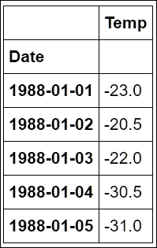

为了使我们的分析更容易，并且因为我们使用的是单变量数据集，所以我们只能从中提取Pandas系列。这只是数据框中的列。下面，我们得到一个 Series 对象:

```py
temp = temp.iloc[:,0] 

```

Series 对象仍然以日期作为索引；事实上，打印出`index`属性表明我们确实将日期解析为索引:

```py
temp.index 

```


`dtype='datetime64[ns]'`值表示我们以非常高的精度将索引存储为日期。像往常一样，我们首先可视化数据，看看我们在处理什么:

```py
temp.plot(lw=1.5) 
despine(plt.gca()) 
plt.gcf().autofmt_xdate() 
plt.ylabel('Temperature'); 

```

像往常一样，这些线简单地调用Pandas系列方法图，改变线宽(`lw`)，然后得到当前轴(`plt.gca()`)，发送到`despine()`功能，然后设置 *y* 标签:

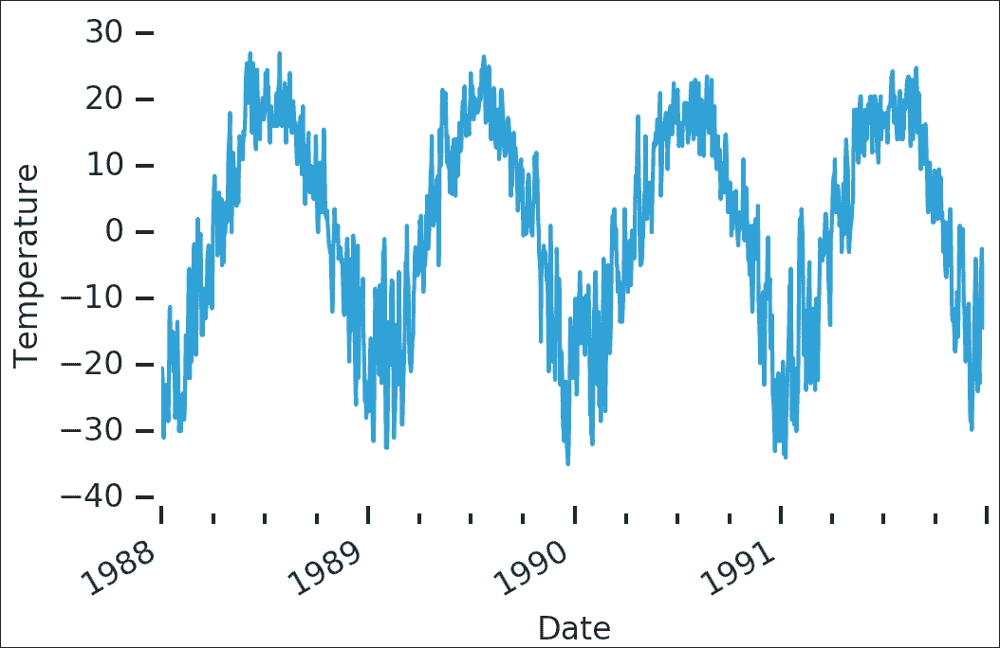

如你所见，数据中有一个很强的模式。因为它每年都在重复，所以它是一种特殊类型的周期性模式，一种季节性模式。为了检查一些统计数据，我们调用我们拥有的 Series 对象的`describe()`方法:

```py
temp.describe() 

```

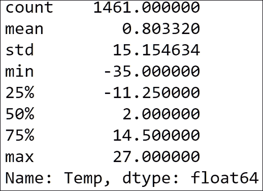

在打印的统计数据中，我们可以看到最低温度为 **-35** ，相当冷。我们还看到有很多测量，足够我们使用，在时间序列分析中，拥有足够的数据非常重要。当我们没有足够的数据时，我们不得不采用更复杂的模型，如引言中描述的判断模型。我们现在有时间序列数据可以使用，我们将从研究如何在Pandas中分割这些物体开始。

# 索引和切片

Pandas中的时间序列可以用许多不同的方式进行索引和切片，但不能用整数索引。我们的索引是日期，记得吗？因此，要获得 1988 年的所有数据，我们只需将该年作为一个字符串进行索引。在下面的代码中，我们以 1988 年为索引，然后绘制值:

```py
temp['1988'].plot(lw=1.5) 
despine(plt.gca()) 
plt.gcf().autofmt_xdate() 
plt.minorticks_off() 
plt.ylabel('Temperature'); 

```


该图显示了 1988 年气温的变化，从接近-30 度到大约+25 度，然后在 10 月下旬回到零下。正如您可能怀疑的那样，您也可以通过给出年和月来索引整个月:

```py
temp['1988-01'].plot(ls='dotted', marker='.') 
despine(plt.gca()) 
plt.gcf().autofmt_xdate() 
plt.ylabel('Temperature'); 

```

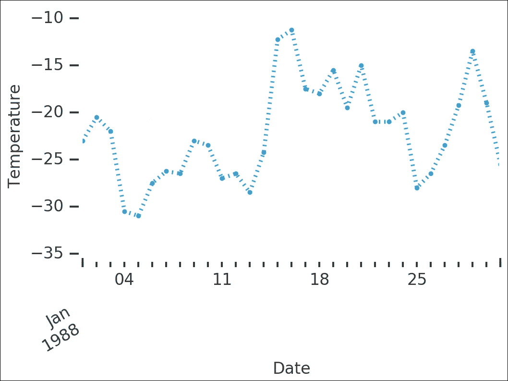

一个月内的变化，这里是一月，相当大，从最小到最大大约 20 度。您也可以使用两个索引进行切片，就像普通数组一样。试着切片做几个月的剧情，比如`temp['1988-06': '1989-06']`。

正如您可以用普通数组过滤掉某些值一样，您也可以过滤掉时间序列中的某些值。为了只在温度严格低于-25 时获取值，您可以像往常一样——进行一个返回布尔数组的比较:

```py
temp[temp < -25].head() 

```

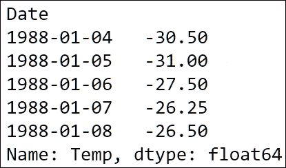

为了完成这一部分，绘制一个图表，每个年份绘制在相同的图中，如下所示:


从该数据的第一个图中可以强烈暗示，它具有季节性成分，对于这样的数据集(室外温度)来说一点也不奇怪。不过，尽量自己切片制作这个剧情。还可以加上 *x* 轴上的月份吗？也许试着只做一个月，但要做一整年，比如四月或五月。我们将介绍的下一步是如何操纵和计算时间序列的各种估计。

# 重采样、平滑和其他估计

另一种可视化和对数据进行一些初始分析的有用方法是重采样、平滑和其他滚动估计。重采样时，需要向函数传递一个 frequency 关键字。这是整数和字母的组合，其中字母表示整数的类型。给你一个想法，一些频率说明符如下:

`B`，营业日，或`D`，日历日

`W`，每周

`M`，日历月结束或`MS`为开始

`Q`，日历季度结束或`QS`开始

`A`，日历年结束，或`AS`为开始

`H`，每小时，`T`，每分钟

其中大多数可以通过在说明符的开头添加`B`来修改，将其更改为业务(月、季度、年等)，还有一些其他的关键字/描述符可以在 Pandas 文档中找到。现在让我们在下面的例子中尝试其中的一些。因为这一章包含了几个真实世界的数据示例，我们用它们来突出不同的东西，所以请随意摆弄数据分析。要按年份对数据进行重新采样，我们只需将`A`传递给`resample()`方法:

```py
temp.resample('A').head() 

```

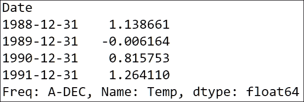

在这里，数值基本上是一年的平均值，标签在年底。现在让我们用一些重采样选项绘制一个图，清楚地显示这些年发生的变化。

### 注

`resample()`方法的工作原理可能会在即将发行的《Pandas》中有所改变。如果您运行的版本高于 0.17.1，您应该参考 Pandas 文档了解更多信息。

首先，我们绘制原始数据，然后将重新采样的数据绘制为每周一次，最后绘制为每年一次。但是，如果我们按年给出频率描述符`A`，那就是年底了。如果能显示出一年与一年之间的变化就好了，这里的中心点不是在年初，而是在年中。为了实现这一点，我们使用`AS`描述符，给我们在一年内重新采样的数据加上开头的标签，然后用`loffset='178 D'`关键字添加大约半年的偏移量:

```py
temp.plot(lw=1.5, color='SkyBlue') 
temp.resample('W').plot(lw=1, color='Green') 
temp.resample('AS', loffset='178 D').plot(color='k') 
plt.ylim(-50,30) 
plt.ylabel('Temperature') 
plt.title('Fisher River Mean Temperature') 
plt.legend(['Raw', 'Binned Weekly', 'Binned Yearly'], loc=3) 
despine(plt.gca()); 

```

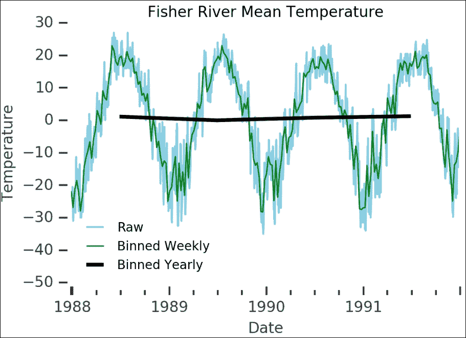

为了使图例更加清晰可见，我简单地用`plt.ylim()`功能添加了一些空间。现在试着绘制一个类似下图的图，在原始数据上绘制一个月和六个月的重采样图:

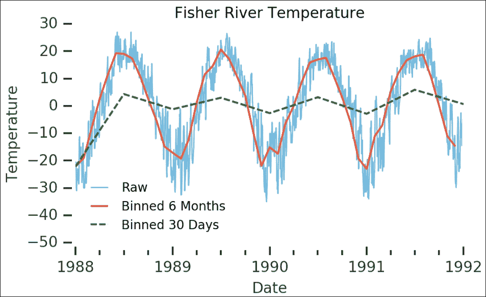

有时我们想计算某个东西的滚动值。虽然重采样看起来像滚动平均值，但在Pandas中有一个特定的函数。我们可以做的一件事是将时间序列上的滚动平均值与它周围区域的最小值和最大值相结合，以突出变化，得到一个漂亮的数字。在下图中，我们在 60 的窗口中绘制了滚动平均值，这意味着如果以天为单位对数据进行采样，它将是 60 天。此外，我们已经告诉滚动装置位于窗口的中心。为了从原始数据中获得最小值和最大值，我们重新采样到月份，取最小值和最大值，并填充它们之间的图:

```py
temp.plot(lw=1, alpha=0.5) 
pd.rolling_mean(temp, center=True, window=60).plot(color='Green') 
plt.fill_between(temp.resample('M', label='left',  
                               loffset='15 D').index, 
                 y1=temp.resample('M', how='max').values, 
                 y2=temp.resample('M', how='min').values, 
                 color='0.85') 
plt.gcf().autofmt_xdate() 
plt.ylabel('Temperature') 
despine(plt.gca()) 
plt.title('Fisher River Temperature'); 

```

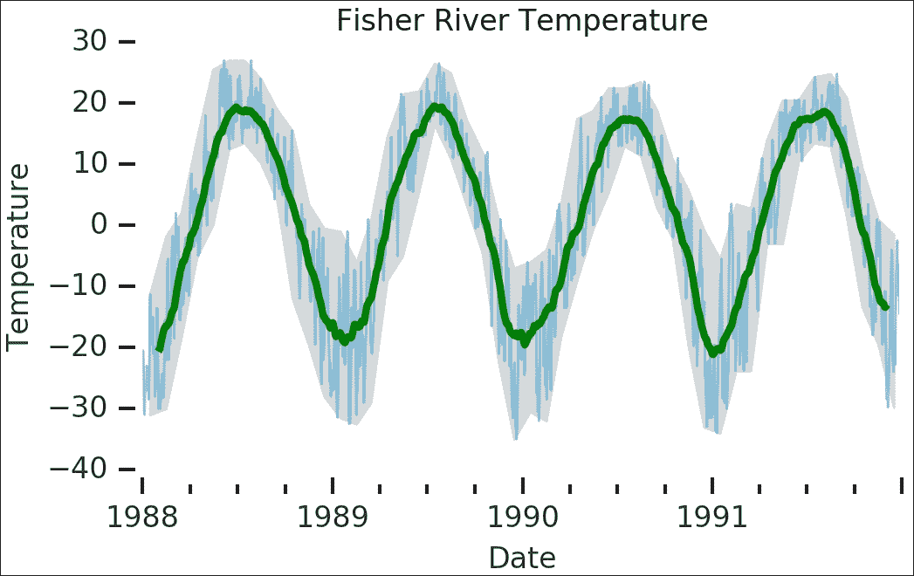

这已经看起来很好了；滚动平均值再现了大规模的温度年复一年的变化。虽然这是一种时间序列分析，可能足以进行一阶分析和处理数据，但我们将研究一些更复杂的方法来模拟变化。您可以计算其他滚动值，例如协方差:

```py
pd.rolling_cov(temp, center=True, window=10).plot(color='Green') 
despine(plt.gca()); 

```

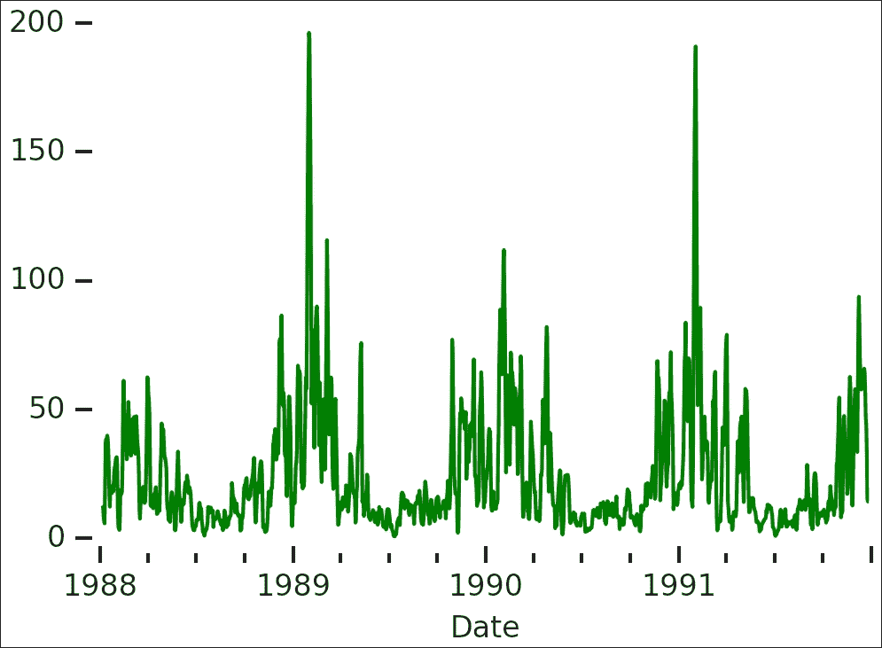

在这种情况下，协方差在 10 天的窗口内，在一年的转变前后似乎非常高。另一个要计算的滚动值是方差:

```py
pd.rolling_var(temp, center=True, window=14).plot(color='Green') 
despine(plt.gca()); 

```

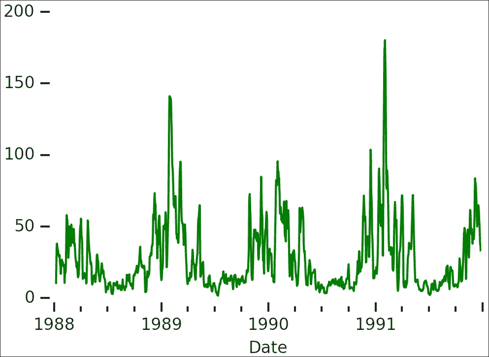

正如我们将在后面讨论的，分析随时间变化的方差对于时间序列分析非常重要。尝试改变协方差和方差的窗口，看看它们有什么不同。

我们之前计算了滚动平均值，发现它似乎遵循了数据的大规模逐年变化。让我们计算残差，从原始数据中减去滚动平均值:

```py
temp_residual = temp-pd.rolling_mean(temp, center=True, window=60) 

```

将残差可视化，我们可以看到它仍然有一些周期性。为了分析时间序列，我们需要数据包含尽可能少的这些大规模模式:

```py
temp_residual.plot(lw=1.5, color='Coral') 
despine(plt.gca()) 
plt.gcf().autofmt_xdate() 
plt.title('Residuals') 
plt.ylabel('Temperature'); 

```


时间序列分析主要基于这样一个事实，即当前值可能只取决于以前的几个值，并且程度不同。所以要分析数据，我们需要去掉这些。这自然将我们引向下一个话题——平稳性。在下一节中，我们将讨论这一点，向您展示如何测试您的数据是否是静态的，以及如果不是静态的，使其成为静态的几种方法。

# 平稳性

大多数时间序列建模依赖于数据的平稳性。平稳时间序列最简单的定义是，它的大部分统计特征都是随时间大致恒定的。对于统计特征，平均值、方差和自相关最常被提及。为了使这成为事实，我们不能有任何趋势，也就是说，数据不能随着时间单调增加。也不能有长周期的起伏。如果这些事情中的任何一个是真的，平均值会随着时间而改变，方差也会改变。还有其他更复杂的数学测试，如下面的(扩充的)迪基-富勒测试。我们将重点放在这个测试上，因为它在 statsmodels 中很方便。

事实是，在进行时间序列分析时，我们首先需要确保数据是平稳的。在 Python 中检查数据是否稳定的最简单方法是做一个增强的 Dickey-Fuller 测试。这是一个统计测试，用于估计数据集是否稳定。statsmodels 包有一个功能，可以对此进行测试并发回诊断结果。测试值(我们称之为 *ADF* 值)需要与 1、5 和 10%的临界值进行比较。如果 ADF 值在 5%时低于临界值，并且 p 值(是的，统计 p 值)很小，大约小于 0.05，我们可以拒绝数据在 95%置信水平下不稳定的零假设。

为了更容易判断结果是否显示时间序列是平稳的，让我们编写一个小函数来运行该函数并总结输出:

```py
def is_stationary(df, maxlag=15, autolag=None, regression='ct'): 
    """Run the Augmented Dickey-Fuller test from Statsmodels 
    and print output. 
    """ 
    outpt = stt.adfuller(df,maxlag=maxlag, autolag=autolag, 
                         regression=regression) 
    print('adf\t\t {0:.3f}'.format(outpt[0])) 
    print('p\t\t {0:.3g}'.format(outpt[1])) 
    print('crit. val.\t 1%: {0:.3f}, \ 
          5%: {1:.3f}, 10%: {2:.3f}'.format(outpt[4]["1%"],  
          outpt[4]["5%"], outpt[4]["10%"])) 
    print('stationary?\t {0}'.format(['true', 'false']\ 
          [outpt[0]>outpt[4]['5%']])) 
    return outpt 

```

我们现在准备测试数据集的平稳性，所以让我们来读一个。

该数据集可从数据市场([https://datamarket.com/data/set/22n4/](https://datamarket.com/data/set/22n4/))下载。这些数据来自时间序列数据库([https://datamarket.com/data/list/?q=provider:tsdl](https://datamarket.com/data/list/?q=provider:tsdl))并起源于亚伯拉罕和莱多尔特(1983)。它显示了魁北克从 1960 年到 1968 年的汽车月销量。和以前一样，我们使用日期解析器直接获取Pandas时间序列数据帧:

```py
carsales = pd.read_csv('data/monthly-car-sales\ 
                       -in-quebec-1960.csv', 
                       parse_dates=['Month'],  
                       index_col='Month',  
                       date_parser=lambda d: \   
                       pd.datetime.strptime(d, '%Y-%m')) 

```

要转到Pandas系列对象而不是数据帧，我们要做和以前一样的事情:

```py
carsales = carsales.iloc[:,0] 

```

绘制数据集显示了一些有趣的事情。数据有一些强烈的季节性趋势，即每年内的周期性模式。它也有一个缓慢的上升趋势，但更多的是在后来:

```py
plt.plot(carsales) 
despine(plt.gca()) 
plt.gcf().autofmt_xdate() 
plt.xlim('1960','1969') 
plt.xlabel('Year') 
plt.ylabel('Sales') 
plt.title('Monthly Car Sales'); 

```

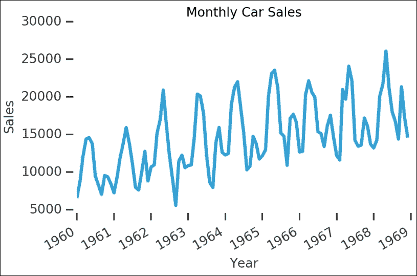

我们现在可以运行我们的小包装来测试它是否是信纸:

```py
is_stationary(carsales); 

```


不是的！嗯，这不是一个巨大的惊喜，因为它有所有这些模式。这将带我们进入下一部分，在这里我们将看到时间序列组成的各种模式和组件。

# 图案和组件

在时间序列中，主要有四种不同的模式或组成部分:

*   **趋势**:数值随时间缓慢但显著的变化
*   **季节**:周期性的变化，周期不到一年
*   **周期**:周期变化，周期超过一年
*   **随机**:随机的成分；纯随机数据的最佳模型是平均值，假设它具有对应于正态分布的分布

因此，在我们能够分析我们的数据之前，它需要是稳定的，为了使它稳定，我们需要注意模式:趋势、季节和周期。您将执行的分析将基于不符合这些模式的时间序列的一部分，随机分量是模型不确定性的一部分。

## 分解成分

一种处理各种成分并使时间序列平稳的方法是分解。有不同的方法来识别组件；在 statsmodels 中，有一个函数可以一次性分解所有的模型。让我们导入它，并运行我们的时间序列:

```py
from statsmodels.tsa.seasonal import seasonal_decompose 
carsales_decomp = seasonal_decompose(carsales, freq=12) 

```

该函数以频率为输入；这与季节有关，因此输入您认为数据具有的季节周期。在这种情况下，我以`12`为例，通过查看数据，它看起来像是一个年度周期。返回的对象包含Pandas系列的几个属性，所以让我们从返回的对象中提取它们:

```py
carsales_trend = carsales_decomp.trend 
carsales_seasonal = carsales_decomp.seasonal 
carsales_residual = carsales_decomp.resid 

```

为了可视化这些不同的组件，我们将它们绘制成一个图形:

```py
def change_plot(ax): 
    despine(ax) 
    ax.locator_params(axis='y', nbins=5) 
    plt.setp(ax.get_xticklabels(), rotation=90, ha='center') 

plt.figure(figsize=(9,4.5)) 

plt.subplot(221) 
plt.plot(carsales, color='Green') 
change_plot(plt.gca()) 
plt.title('Sales', color='Green') 
xl = plt.xlim() 
yl = plt.ylim() 

plt.subplot(222) 
plt.plot(carsales.index,carsales_trend,  
         color='Coral') 
change_plot(plt.gca()) 
plt.title('Trend', color='Coral') 
plt.gca().yaxis.tick_right() 
plt.gca().yaxis.set_label_position("right") 
plt.xlim(xl) 
plt.ylim(yl) 

plt.subplot(223) 
plt.plot(carsales.index,carsales_seasonal,  
         color='SteelBlue') 
change_plot(plt.gca()) 
plt.gca().xaxis.tick_top() 
plt.gca().xaxis.set_major_formatter(plt.NullFormatter()) 
plt.xlabel('Seasonality', color='SteelBlue', labelpad=-20) 
plt.xlim(xl) 
plt.ylim((-8000,8000)) 

plt.subplot(224) 
plt.plot(carsales.index,carsales_residual, 
         color='IndianRed') 
change_plot(plt.gca()) 
plt.xlim(xl) 
plt.gca().yaxis.tick_right() 
plt.gca().yaxis.set_label_position("right") 
plt.gca().xaxis.tick_top() 
plt.gca().xaxis.set_major_formatter(plt.NullFormatter()) 
plt.ylim((-8000,8000)) 
plt.xlabel('Residuals', color='IndianRed', labelpad=-20) 

plt.tight_layout() 
plt.subplots_adjust(hspace=0.55) 

```


在这里，我们可以看到所有不同的组成部分——原始销售额显示在左上角，而数据的总体趋势显示在右上角。识别出的季节性在左下方，将这两者分开后的残差在右下方。季节性成分有多个周期性峰值。这种季节性因素非常有趣，因为它占了销售年度变化的大部分。让我们通过绘制去趋势数据(即从原始销售数据中减去的趋势)和季节性变化(一年内)来进一步了解它:

```py
fig = plt.figure(figsize=(7,1.5) ) 

ax1 = fig.add_axes([0.1,0.1,0.6,0.9]) 
ax1.plot(carsales-carsales_trend,  
         color='Green', label='Detrended data') 
ax1.plot(carsales_seasonal,  
         color='Coral', label='Seasonal component') 
kwrds=dict(lw=1.5, color='0.6', alpha=0.8) 
d1 = pd.datetime(1960,9,1) 
dd = pd.Timedelta('365 Days') 
[ax1.axvline(d1+dd*i, dashes=(3,5),**kwrds) for i in range(9)] 
d2 = pd.datetime(1960,5,1) 
[ax1.axvline(d2+dd*i, dashes=(2,2),**kwrds) for i in range(9)] 
ax1.set_ylim((-12000,10000)) 

ax1.locator_params(axis='y', nbins=4) 
ax1.set_xlabel('Year') 
ax1.set_title('Sales Seasonality') 
ax1.set_ylabel('Sales') 
ax1.legend(loc=0, ncol=2, frameon=True); 

ax2 = fig.add_axes([0.8,0.1,0.4,0.9]) 
ax2.plot(carsales_seasonal['1960':'1960'],  
         color='Coral', label='Seasonal component') 
ax2.set_ylim((-12000,10000)) 
[ax2.axvline(d1+dd*i, dashes=(3,5),**kwrds) for i in range(1)] 
d2 = pd.datetime(1960,5,1) 
[ax2.axvline(d2+dd*i, dashes=(2,2),**kwrds) for i in range(1)] 
despine([ax1, ax2]) 

import matplotlib.dates as mpldates 
yrsfmt = mpldates.DateFormatter('%b') 
ax2.xaxis.set_major_formatter(yrsfmt) 
labels = ax2.get_xticklabels() 
plt.setp(labels, rotation=90);  

```


如你所见，季节性因素非常重要。虽然这对于这个数据集来说是显而易见的，但它是时间序列分析的一个良好开端，因为您可以将数据分解成这样的片段，并且它提供了对正在发生的事情的丰富见解。让我们将这一季节性因素保留一年:

```py
carsales_seasonal_component = carsales_seasonal['1960'].values 

```

减去趋势和季节性后剩下的残差现在应该是平稳的，对吗？它们看起来像是静止的。让我们检查一下包装函数。为此，我们首先需要摆脱`NaN`值:

```py
carsales_residual.dropna(inplace=True) 
is_stationary(carsales_residual.dropna()); 

```


它现在是静止的；这意味着我们可以继续分析时间序列并开始建模。当试图在残差模型中重新包含季节和趋势成分时，当前版本的 statsmodels 中可能存在一些错误。正因为如此，我们试图用不同的方式来做这件事。

在我们开始制作时间序列模型之前，我想多看看残差。我们可以利用前几章学到的知识，检查残差是否正态分布。首先，我们绘制值的直方图，并过度拟合高斯概率密度分布:

```py
loc, shape = st.norm.fit(carsales_residual) 
x=range(-3000,3000) 
y = st.norm.pdf(x, loc, shape) 
n, bins, patches = plt.hist(carsales_residual, bins=20, normed=True) 
plt.plot(x,y, color='Coral') 
despine(plt.gca()) 
plt.title('Residuals') 
plt.xlabel('Value'); plt.ylabel('Counts'); 

```

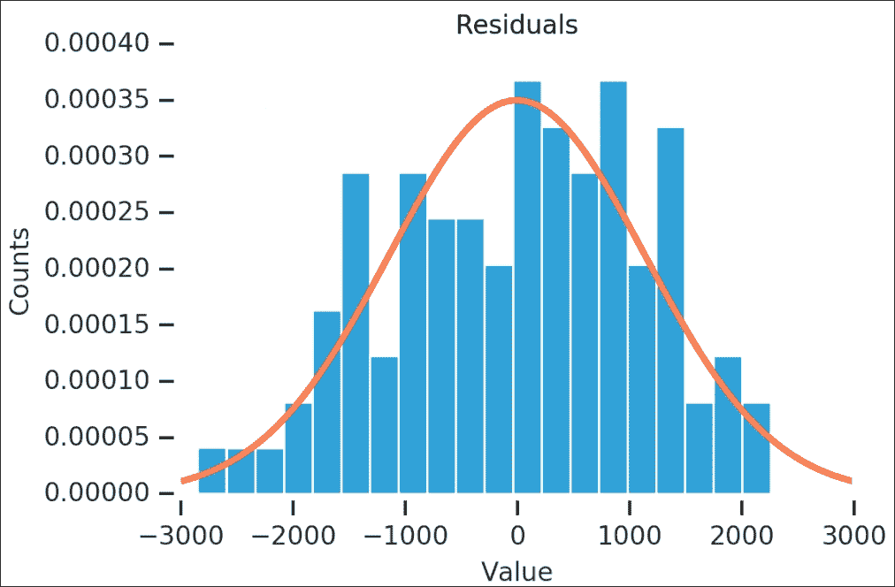

我们使用的另一个检查是概率图，所以我们也在这个上面运行它。但是，我们不会像以前那样让它绘制图形，而是自己动手。为此，我们捕捉`probplot()`的输出，不给予它任何轴或绘图功能作为输入。得到变量后，我们只需用给定的系数画出它们和一条线:

```py
(osm,osr), (slope, intercept, r) = st.probplot(carsales_residual, 
                                               dist='norm', fit=True) 
line_func = lambda x: slope*x + intercept 
plt.plot(osm,osr, 
         '.', label='Data', color='Coral') 
plt.plot(osm, line_func(osm),  
         color='SteelBlue', 
         dashes=(20,5), label='Fit') 
plt.xlabel('Quantiles'); plt.ylabel('Ordered Values') 
despine(plt.gca()) 
plt.text(1, -14, 'R$^2$={0:.3f}'.format(r)) 
plt.title('Probability Plot') 
plt.legend(loc='best', numpoints=4, handlelength=4); 

```

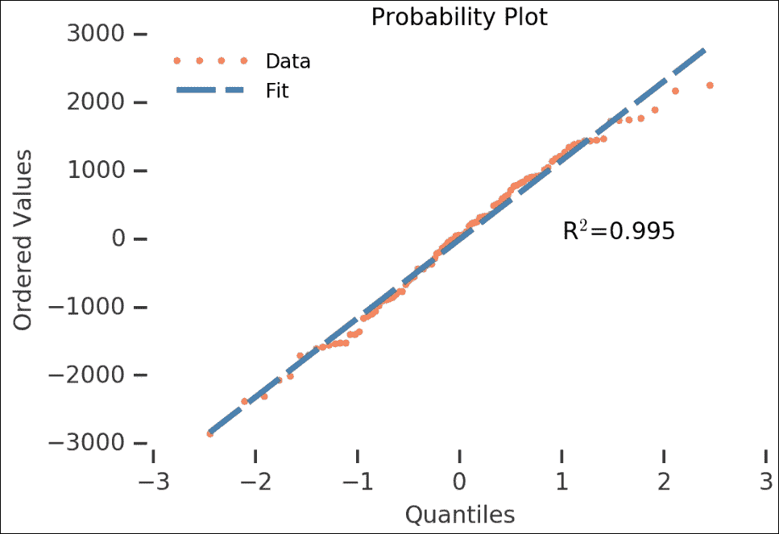

残差看起来像是正态分布——高的 *R <sup>2</sup>* 值也表明它具有统计学意义。现在我们已经检查了自动分解的残差，我们可以继续下一个使数据稳定的方法。

## 差异

通过求差，我们简单地取两个相邻值之间的差。要做到这一点，Pandas有一个方便的`diff()`方法。下图显示了数据移动一个周期后的差异:

```py
carsales.diff(1).plot(label='1 period', title='Carsales') 
plt.legend(loc='best') 
despine(plt.gca()) 

```


请记住，这是基于原始数据——具有强烈趋势和季节性的数据。虽然这种趋势已经消失，但似乎一些季节性仍然存在；但是，让我们检查一下这是否是一个平稳的时间序列:

```py
is_stationary(carsales.diff(1).dropna()) 

```


不，p 值高于 0.05，ADF 值至少高于 5%，所以我们不能拒绝零假设。让我们再次运行`diff()`，但是同时运行`1`和`12`周期(即 12 个月，一年):

```py
carsales.diff(1).plot(label='1 period', title='Carsales', 
                      dashes=(15,5)) 
carsales.diff(1).diff(12).plot(label='1 and 12 period(s)', 
                               color='Coral') 
plt.legend(loc='best') 
despine(plt.gca()) 
plt.xlabel('Date') 

```

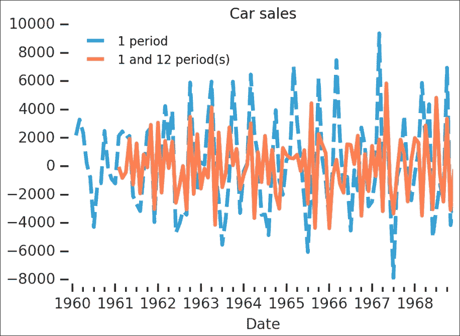

由此很难判断它是多还是少是静止的。我们必须对输出运行包装器来检查:

```py
is_stationary(carsales.diff(1).diff(12).dropna()); 

```


这样好多了；我们似乎已经摆脱了季节性和趋势性的成分。

我鼓励您使用第一个示例数据集，并检查我们在本节中介绍的一些内容。各种周期性/季节性成分是如何分解的？你必须用什么价值观才能让它发挥作用？在下一节中，我们将介绍时间序列的一些通用模型，以及它们在 statsmodels 中的使用方式。

# 时间序列模型

建模时间序列会变得非常复杂；在这里，我们将逐一介绍一些最常用的模型，并解释它们背后的一些想法。我们将从自回归模型开始，继续移动平均模型，最后是组合自回归综合移动平均模型。首先，导入 statsmodel 时间序列模型框架:

```py
from statsmodels.tsa.arima_model import ARIMA 

```

`ARIMA`函数以Pandas时间序列和模型参数作为输入，并发回一个模型对象。为了使用分解和差分相结合的方法来使时间序列平稳，我首先去除了 statsmodels 函数分解出的季节分量，然后取第一个差值并检查它是否平稳:

```py
is_stationary((carsales-carsales_seasonal).diff(1).dropna()); 

```


它是平稳的 ADF 值低于 5%临界值，p 值小于 0.05。我将把这些步骤保存在单独的数据结构中，用于建模:

```py
ts = carsales-carsales_seasonal 
tsdiff = ts.diff(1) 

```

我们现在准备检查各种型号。

## 自回归–AR

对于自回归模型，我们使用前面几个步骤的值来建模一个值。重要的参数是模型要使用多少个先前的步骤；这里，这是参数 *p* 。有多种方法可以预先估计 *p* 参数，但有时运行不同值的模型并检查可用数据的正常拟合程序是在参数之间进行选择的好方法。*AR(p)*(p*的 AR)模型可以用简单的方式表达如下:*

 *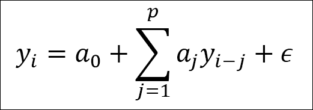

这里 *j* 从 1 运行到 *p* 。注意，它显示当前值 *y <sub>i</sub>* 是 *p* 先前值和随机/不确定性贡献 *ε* 的函数。也就是说，每个值都有一个我们可以建模的部分和一个我们想要最小化的随机贡献。此外，重要的是要注意 *a* 参数-这些参数/系数(有时也称为权重)可以通过拟合进行调整，以使模型更好地再现值。他们基本上控制了每个先前的值对模型的重要性。虽然 *p* 参数很重要，但是将模型拟合到可用的历史数据来调整参数也很重要。

要运行这个模型，我们只需将`order`变量作为 ARIMA 函数的输入。它应该是一个有三个值的元组——第一个值给出了 *p* 值，第二个给出了中间值 *d* 求数据差的次数，第三个也是最后一个输入是 *q* 求平均模型的移动。要运行带有 *p=1* 和 *d=1* 的 AR 模型，然后将其与数据进行拟合，我们只需在一个单元格中运行以下内容:

```py
model = ARIMA(ts, order=(1, 1, 0)) 
arres = model.fit() 

```

现在我们已经拟合了前面方程中显示的参数。为了可视化拟合，在拟合结果对象中有一个方便的函数，在这种情况下为`arres`:

```py
arres.plot_predict(start='1961-12-01', end='1970-01-01', alpha=0.10) 
plt.legend(loc='upper left') 
despine(plt.gca()) 
plt.xlabel('Year') 
print(arres.aic, arres.bic) 

```


您可以清楚地看到，当 AR 模型预测现有的历史数据时，它是如何移动这些数据的；重要的是超越样本的预测。90%置信区间也绘制在灰色区域；预测主要是前几个值。此后，它收敛到一个恒定的趋势。在前面代码的最后一行，我还打印了 **AIC** 和 **BIC** ( `print(arres.aic, arres.bic)`)，这是**阿凯克信息准则**和**贝叶斯信息准则**。它们都被用来评估一个模型相对于另一个模型有多好。与其他模型相比，这些值越低，模型就越好(相对而言)。在这种情况下，打印输出为`1870.3331809826666`和`1878.35166749`。

虽然这个模型并不完美，但它给了你一些对*未来*销量的估计。在下一节中，我们将创建一个移动平均模型。

## 移动平均线–毫安

在移动平均模型中，计算先前 *q* 值的平均值(称为)，并以与自回归模型相同的方式对随机贡献进行建模，假设当前值是 *q* 先前值的平均值的函数，以及用参数/系数修改的小随机变化，这里为 *b* 。这可以表达如下:


这里， *j* 从 1 到 *q* 运行，之前值的平均值可以表示如下:


该模型本质上假设当前值由 *q* 先前值的平均值很好地建模，因此它被称为移动平均模型。

就像之前一样，我们用`ARIMA`函数初始化模型，但是这次用不同的输入，这样我们就可以使用 MA 模型:

```py
model = ARIMA(ts, order=(0, 1, 1)) 
mares = model.fit() 

```

绘制这张图并打印 AIC 和 BIC 表明，它实际上是预测未来价值的更好模型:

```py
mares.plot_predict(start='1961-12-01', end='1970-01-01', alpha=0.10) 
plt.legend(loc='upper left') 
despine(plt.gca()) 
plt.xlabel('Year') 
print(mares.aic, mares.bic) 

```

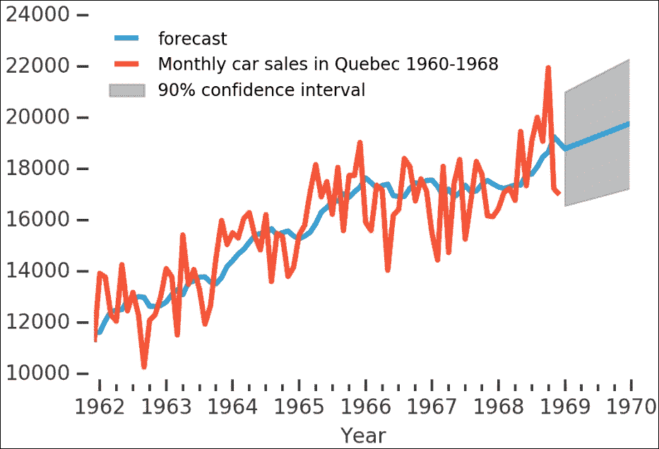

AIC 和 BIC 是`1853.0753124033156`和`1861.09379891`，略低于 AR 模型。从外观上看，这种模型更善于将历史数据的大致趋势外推至未来。在下一节中，我们将制作一个 AR 和 MA 模型的复合模型。在此之前，我将向您展示两种选择 *p* 和 *q* 参数的方法。

## 选择 p 和 q

AR 和 MA 模型的 *p* 和 q 参数应根据所得模型与历史数据的拟合程度进行选择。应该在结果之间比较 AIC 或 BIC，并且应该选择具有最低值的结果。

### 自动功能

statsmodels 包当然为此提供了便利功能。我们将看到如何在数据上运行:

```py
tsa.stattools.arma_order_select_ic(tsdiff.dropna(), max_ar=2, max_ma=2, 
                                   ic='aic') 

```


它打印的输出显示我们应该使用 AR(1)和 MA(1)模型，作为输入的是`tsdiff`， *d* 也应该是`1`。

### (部分)自相关函数

虽然方便的自动功能做得很好，但它运行各种参数输入的整个建模。估算 *p* 和 *q* 的另一种方法是绘制**自相关函数** ( **ACF** )和**偏自相关函数** ( **PACF** )。为此，我们首先计算它们:

```py
acf = stt.acf(tsdiff.dropna(), nlags=10) 
pacf = stt.pacf(tsdiff.dropna(), nlags=10) 

```

在此之后，我们可以绘制两者以及临界极限。对于平稳时间序列，值的限制应为(部分)自相关的 5%，即 *1.96/(N-d)* ，其中 *N* 是数据点的数量， *d* 是您对数据求差的次数。让我们来画出 ACF 和 PACF。在这个图中，我还绘制了自动程序建议的值，`1`和`1`:

```py
fig, (ax1, ax2) = plt.subplots(1,2, figsize=(8,2))
 ax1.axhline(y=0,color='gray')
   ax1.axhline(y=-1.96/ (len(ts)-1)**.5,
        linestyle='--',color='gray')
   ax1.axhline(y=1.96/ (len(ts)-1) **.5,
        linestyle='--',color='gray')
   ax1.axvline(x=1,ls=':',color='gray')
   ax1.plot(acf)
   ax1.set_title('ACF')
   ax2.axhline(y=0,color='gray')
   ax2.axhline(y=-1.96/ (len(ts)-1) **.5,
        linestyle='--',color='gray')
   ax2.axhline(y=1.96/ (len(ts)-1) **.5,
        linestyle='--',color='gray')
   ax2.axvline(x=1,ls=':',color='gray')
   ax2.plot(pacf)
   ax2.set_title('PACF')
   despine([ax1,ax2])

```


如你所见，两条曲线都在 p=1 和 q=1 时越过临界极限。这也是你如何估计 *p* 和 *q* 参数的方法，通过检查它们在哪里越过临界值并稳定在极限内。现在我们准备运行复合模型。

## 自回归综合移动平均线–ARIMA

我们要看的最后一个模型是**自回归综合移动平均线** ( **ARIMA** )模型。顾名思义，它是前面两种模式的结合。它与之前运行的功能相同，但是对于输入元组，我们使用所有的函数。为了说明一些功能，我将使用与前面型号不同的 *d* 值来运行它:

```py
model = ARIMA(ts, order=(1, 0, 1)) 
arimares = model.fit() 

```

下图显示了对历史值的预测和估计:

```py
arimares.plot_predict(start='1961-12-01', end='1970-01-01', alpha=0.10) 
plt.legend(loc='upper left') 
despine(plt.gca()) 
plt.xlabel('Year') 
print(arimares.aic, arimares.bic) 

```

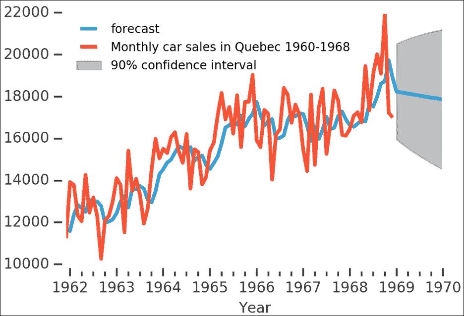

AIC 和 BIC 是`1880.0061559512924`和`1890.73468086`，比之前的 MA 车型略差。我建议您尝试更改输入的 *p* 、 *d* 、 *q* 参数，或许更改为 *(1，1，1)* 。用不同的值玩一玩，把数据再差一次，看看会发生什么。

# 总结

在本章中，我们用 Pandas 和 statsmodels 查看了 Python 中时间序列分析的许多有趣的方面，它们如何处理数据，以及一些可用的基本操作函数。我们还研究了平稳性的概念，如何测试你的时间序列，以及如何将非平稳序列转化为平稳序列。您还发现了时间序列可以构建的各种模式和组成部分，最后，我们介绍了如何创建 ARIMA 模型，并根据以前的历史数据预测未来的值。

这一章结束了这本书。我们已经介绍了许多不同的分析技术和一般的统计知识，以及如何在 Python 中使用它们来帮助您。有了这本书里的知识，你可以开始探索数据，任何种类的数据。除了这些章节，还有一个附录。在[附录](109.html "Appendix E. More on Jupyter Notebook and matplotlib Styles")、*更多关于 Jupyter 笔记本和 matplotlib 样式*中，我将查看 Jupyter 笔记本的提示和扩展(插件)。我还将提供一些进一步资源的链接，包括各种数据存储库，供您查找要下载的数据，并创建您自己的假设进行测试。

如前所述，花时间处理数据，尝试不同的算法并比较结果是很重要的。希望大家也已经意识到，数据分析中的很多工作都是在实际将分析方法/算法应用到数据中，用结果做一个图之前进行的，做好能显示所有结果而不显得臃肿的图是非常困难的。一般来说，对于现实世界的数据分析，这个过程是困难的，当完成时，你必须以一种其他人都能理解的简单方式呈现出来。根据本书教授的内容，你应该能够对报告中几乎任何数据和有吸引力的数字进行可靠的分析，从而清楚地突出你的结果。*