# 第七章。用财务数据分析选股

在本章中，我们将介绍以下食谱:

*   计算简单和日志返回
*   用夏普比率和流动性对股票进行排名
*   用卡尔马尔比率和索蒂诺比率对股票进行排名
*   分析退货统计数据
*   将个股与大盘联系起来
*   探索风险和回报
*   用非参数游程检验检验市场
*   随机漫步测试
*   用自回归模型确定市场效率
*   为股票价格数据库创建表格
*   填充股票价格数据库
*   优化等权双资产投资组合

# 简介

金融学涉及许多学科，如货币、储蓄、投资和保险。在这一章中，我们将集中讨论股票投资，因为股价数据非常丰富。根据学术理论，一般投资者不应该投资个股，而应该投资整个市场，例如，代表一个国家内大公司的一篮子股票。经济学家为这一理论提出了几个这样的论点。首先，金融市场是随机的；因此，通过选股击败一个平均篮子是非常困难的。其次，个股波动剧烈，价格波动剧烈。这些价格变动在一个篮子里得到平均，这使得投资一组股票的风险降低。

我们将分析股票价格，但没有什么能阻止你重用食谱来分析共同基金和交易所交易基金或其他金融资产。为了简化分析，我将选择范围限制在六只知名美国公司的股票，这些公司也在标准普尔 500 股票指数中有代表。

# 计算简单和日志返回

**收益**衡量(股票)价格的变化率。使用收益的好处是收益是无量纲的，所以我们可以很容易地比较不同金融证券的收益。相比之下，仅金融资产的价格并不能告诉我们太多。在本章中，我们计算每日回报，因为我们的数据是每天采样的。通过小的调整，您应该能够在不同的时间范围内应用相同的分析。

事实上，有各种类型的回报。出于基本分析的目的，我们只需要了解 simple (7.1)和 log(arithmic)返回(7.2)，如下式所示:

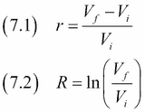

实际上，这些类型的返回可以很容易地转换，从简单的返回到日志返回。如果给你选择，日志返回是你应该喜欢的，因为它们更容易计算。

## 怎么做...

1.  进口情况如下:

    ```py
    import dautil as dl
    import ch7util
    import matplotlib.pyplot as plt
    ```

2.  下载标准普尔 500 指数数据:

    ```py
    ohlc = dl.data.OHLC()
    sp500 = ohlc.get('^GSPC')['Adj Close']
    rets = sp500[1:]/sp500[:-1] - 1
    ```

3.  绘制简单和日志返回:

    ```py
    _, ax = plt.subplots()
    cp = dl.plotting.CyclePlotter(ax)
    cp.plot(sp500.index, rets, label='Simple')
    cp.plot(sp500.index[1:], ch7util.log_rets(sp500), label='Log')
    ax.set_title('Simple and Log Returns')
    ax.set_xlabel('Date')
    ax.set_ylabel('Return')
    ax.legend(loc='best')
    ```

最终结果参考以下截图(简单和日志返回的值非常接近):


本食谱的代码在本书代码包的`simple_log_rets.ipynb`文件中。

## 另见

*   相关维基百科页面在[https://en.wikipedia.org/wiki/Rate_of_return](https://en.wikipedia.org/wiki/Rate_of_return)(2015 年 10 月检索)

# 用夏普比率和流动性对股票进行排名

由 T2 威廉夏普定义的夏普比率是一个基本的投资指标。比例如下:


这个比率取决于资产的回报和基准的回报。我们将使用标准普尔 500 指数作为基准。这个比率应该代表一个报酬与风险的比率。我们希望在最小化风险的同时最大化回报，这与最大化夏普比率相对应。

另一个重要的投资变量是流动性。现金是最终的流动资产，但大多数其他资产的流动性较低，这意味着当我们试图出售或购买它们时，它们会改变价值。我们将使用本食谱中的交易量作为流动性的衡量标准。(交易量对应于金融资产的交易数量。流动性衡量一项资产的流动性——买卖它有多容易。)

## 怎么做...

你可以在本书的代码包`sharpe_liquidity.ipynb`文件中找到代码:

1.  进口情况如下:

    ```py
    import numpy as np
    import dautil as dl
    import matplotlib.pyplot as plt
    import ch7util
    ```

2.  定义以下函数计算平均交易量的比值和对数:

    ```py
    def calc_metrics(ticker, ohlc):
        stock = ohlc.get(ticker)
        sp500 = ohlc.get('^GSPC')
        merged = ch7util.merge_sp500(stock, sp500)
        rets_stock = ch7util.log_rets(merged['Adj Close_stock'])
        rets_sp500 = ch7util.log_rets(merged['Adj Close_sp500'])
        stock_sp500 = rets_stock - rets_sp500
        sharpe_stock = stock_sp500.mean()/stock_sp500.std()
        avg_vol = np.log(merged['Volume_stock'].mean())

        return (sharpe_stock, avg_vol)
    ```

3.  从`ch7util`模块计算我们一篮子股票的指标:

    ```py
    dfb = dl.report.DFBuilder(cols=['Ticker', 'Sharpe', 'Log(Average Volume)'])

    ohlc = dl.data.OHLC()

    for symbol in ch7util.STOCKS:
        sharpe, vol = calc_metrics(symbol, ohlc)
        dfb.row([symbol, sharpe, vol])

    df = dfb.build(index=ch7util.STOCKS)
    ```

4.  绘制股票的比率和对数平均成交量:

    ```py
    _, ax = plt.subplots()
    ax.scatter(df['Log(Average Volume)'], df['Sharpe'])
    dl.plotting.plot_polyfit(ax, df['Log(Average Volume)'], df['Sharpe'])

    dl.plotting.plot_text(ax, df['Log(Average Volume)'],
                          df['Sharpe'], ch7util.STOCKS)
    ax.set_xlabel('Log(Average Volume)')
    ax.set_ylabel('Sharpe')
    ax.set_title('Sharpe Ratio & Liquidity')
    ```

有关最终结果，请参考以下屏幕截图:

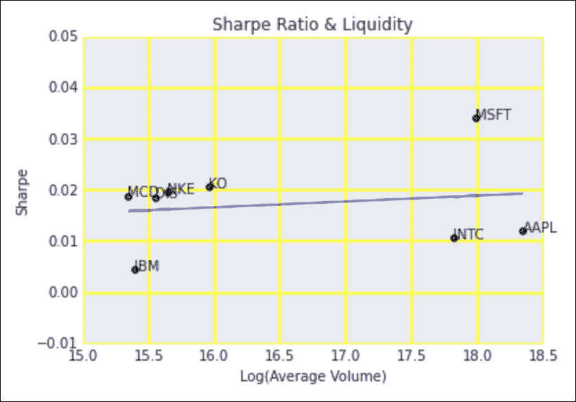

## 另见

*   相关维基百科页面在[https://en.wikipedia.org/wiki/Sharpe_ratio](https://en.wikipedia.org/wiki/Sharpe_ratio)(2015 年 10 月检索)

# 用卡尔马尔比率和索蒂诺比率对股票进行排名

**Sortino** 和 **Calmar 比率**是与夏普比率相当的业绩比率(参考*用夏普比率和流动性*配方对股票进行排名)。比率甚至更多；然而，夏普比率一直在附近最长，因此应用非常广泛。

Sortino 比率以 Frank Sortino 命名，但它是由 Brian Rom 定义的。比率将风险定义为低于基准的下行方差。基准可以是指数，也可以是固定收益，如零。该比率定义如下:


*R* 为资产回报， *T* 为目标基准， *DR* 为下行风险。卡尔马尔比率是由特里·杨发明的，并以他的公司和时事通讯命名。该比率将风险定义为资产的**最大提取**(价格从峰值跌至底部)。

## 怎么做...

以下是本书代码包中`calmar_sortino.ipynb`文件的分解:

1.  进口情况如下:

    ```py
    import numpy as np
    import dautil as dl
    import ch7util
    from scipy.signal import argrelmin
    from scipy.signal import argrelmax
    import matplotlib.pyplot as plt
    ```

2.  定义以下函数计算排序比:

    ```py
    def calc_sortino(rets):
        # Returns below target
        semi_var = rets[rets < 0] ** 2
        semi_var = semi_var.sum()/len(rets)
        sortino = np.sqrt(semi_var)

        return rets.mean()/sortino
    ```

3.  定义以下函数计算卡尔马尔比:

    ```py
    def calc_calmar(rets):
        # Peaks and bottoms indexes in sequence
        mins = np.ravel(argrelmin(rets))
        maxs = np.ravel(argrelmax(rets))
        extrema = np.concatenate((mins, maxs))
        extrema.sort()

        return -rets.mean()/np.diff(rets[extrema]).min()
    ```

4.  为我们的股票列表计算卡尔马尔和索蒂诺比率:

    ```py
    ohlc = dl.data.OHLC()
    dfb = dl.report.DFBuilder(cols=['Ticker', 'Sortino', 'Calmar'])

    for symbol in ch7util.STOCKS:
        stock = ohlc.get(symbol)
        rets = ch7util.log_rets(stock['Adj Close'])
        sortino = calc_sortino(rets)
        calmar = calc_calmar(rets)
        dfb.row([symbol, sortino, calmar])

    df = dfb.build(index=ch7util.STOCKS).dropna()
    ```

5.  绘制股票的 Sortino 和 Calmar 比率:

    ```py
    _, ax = plt.subplots()
    ax.scatter(df['Sortino'], df['Calmar'])
    dl.plotting.plot_polyfit(ax, df['Sortino'], df['Calmar'])
    dl.plotting.plot_text(ax, df['Sortino'], df['Calmar'], ch7util.STOCKS)
    ax.set_xlabel('Sortino')
    ax.set_ylabel('Calmar')
    ax.set_title('Sortino & Calmar Ratios')
    ```

有关最终结果，请参考以下屏幕截图:

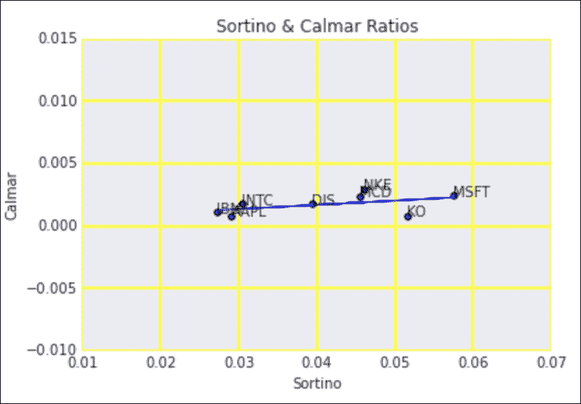

## 另见

*   维基百科关于 https://en.wikipedia.org/wiki/Sortino_ratio 索特诺比率的页面(2015 年 10 月检索)
*   维基百科关于 https://en.wikipedia.org/wiki/Calmar_ratio 卡尔马尔比率的页面(2015 年 10 月检索)

# 分析退货统计

回报，尤其是股票指数的回报，已经被广泛研究。过去，人们认为回报是正态分布的。然而，现在很明显，回报分布有肥尾(比正态分布更肥)。更多信息可在[https://en.wikipedia.org/wiki/Fat-tailed_distribution](https://en.wikipedia.org/wiki/Fat-tailed_distribution)获得(2015 年 10 月检索)。检查数据是否符合正态分布非常容易。我们只需要样本的平均值和标准差。

在本食谱中，我们将探讨许多主题:

*   股票收益的偏斜度和峰度是一个值得研究的问题。偏斜度在股票期权模型中尤其重要。分析师通常将自己限制在均值和标准差范围内，假设它们分别对应于报酬和风险。
*   如果我们对趋势的存在感兴趣，那么我们应该看一看自相关图。这是一个自相关图——即信号和某个滞后的信号之间的相关性(也在 *Python 数据分析*、 *Packt Publishing* 中解释)。
*   我们还将绘制负回报(其绝对值)和对数-对数标度上的相应计数，因为这些似乎近似遵循幂律(尤其是尾值)。

## 怎么做...

分析可以在本书代码包的`rets_stats.ipynb`文件中找到:

1.  进口情况如下:

    ```py
    import dautil as dl
    import ch7util
    import matplotlib.pyplot as plt
    from scipy.stats import skew
    from scipy.stats import kurtosis
    from pandas.tools.plotting import autocorrelation_plot
    import numpy as np
    from scipy.stats import norm
    from IPython.display import HTML
    ```

2.  计算我们股票的回报:

    ```py
    ohlc = dl.data.OHLC()
    rets_dict = {}

    for i, symbol in enumerate(ch7util.STOCKS):
        rets = ch7util.log_rets(ohlc.get(symbol)['Adj Close'])
        rets_dict[symbol] = rets

    sp500 = ch7util.log_rets(ohlc.get('^GSPC')['Adj Close'])
    ```

3.  绘制标准普尔 500 回报和相应理论正态分布的直方图:

    ```py
    sp = dl.plotting.Subplotter(2, 2, context)
    sp.ax.set_xlim(-0.05, 0.05)
    _, bins, _ = sp.ax.hist(sp500, bins=dl.stats.sqrt_bins(sp500),
                         alpha=0.6, normed=True)
    sp.ax.plot(bins, norm.pdf(bins, sp500.mean(), sp500.std()), lw=2)
    ```

4.  绘制收益的偏斜度和峰度:

    ```py
    skews = [skew(rets_dict[s]) for s in ch7util.STOCKS]
    kurts = [kurtosis(rets_dict[s]) for s in ch7util.STOCKS]
    sp.label()

    sp.next_ax().scatter(skews, kurts)
    dl.plotting.plot_text(sp.ax, skews, kurts, ch7util.STOCKS)
    sp.label()
    ```

5.  绘制标准普尔 500 回报的自相关图:

    ```py
    autocorrelation_plot(sp500, ax=sp.next_ax())
    sp.label()
    ```

6.  绘制负回报(绝对值)和计数的对数-对数图:

    ```py
    # Negative returns
    counts, neg_rets = np.histogram(sp500[sp500 < 0])
    neg_rets = neg_rets[:-1] + (neg_rets[1] - neg_rets[0])/2
    # Adding 1 to avoid log(0)
    dl.plotting.plot_polyfit(sp.next_ax(), np.log(np.abs(neg_rets)),
                             np.log(counts + 1), plot_points=True)
    sp.label()

    HTML(sp.exit())
    ```

有关最终结果，请参考以下屏幕截图:

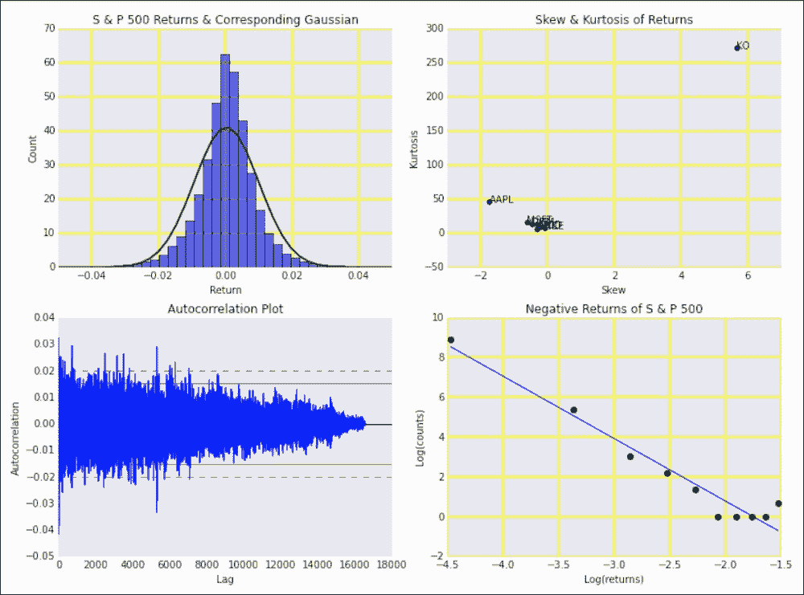

# 将个股与大盘关联起来

当我们定义一个股市或指数时，我们通常会选择在某些方面相似的股票。例如，股票可能在同一个国家或大陆。鸟类的位置可以从它们所属的鸟群的位置来粗略估计。同样，我们预计股票回报将与其市场相关，尽管不一定完全相关。

我们将探讨以下指标:

*   最明显的指标据称是个股回报率和标准普尔 500 指数的相关系数。
*   另一个指标是从线性回归而不是相关性中获得的斜率。
*   我们也可以分析收益的平方差，有点类似于回归诊断中的平方误差。
*   我们也可以将交易量和波动性联系起来，而不是将回报联系起来。为了衡量波动性，我们将使用有点不寻常的高低价格差的平方值。实际上，我们应该把这个值除以一个常数；然而，这对于相关系数计算来说不是必需的。

## 怎么做...

分析在本书代码包的`correlating_market.ipynb`文件中:

1.  进口情况如下:

    ```py
    import ch7util
    import dautil as dl
    import numpy as np
    import matplotlib.pyplot as plt
    from IPython.display import HTML
    ```

2.  定义以下函数来计算波动率:

    ```py
    def hl2(df, suffix):
        high = df['High_' + suffix]
        low = df['Low_' + suffix]

        return (high - low) ** 2
    ```

3.  定义以下函数来关联标准普尔 500 和我们的股票:

    ```py
    def correlate(stock, sp500):
        merged = ch7util.merge_sp500(stock, sp500)
        rets = ch7util.log_rets(merged['Adj Close_stock'])
        sp500_rets = ch7util.log_rets(merged['Adj Close_sp500'])
        result = {}

        result['corrcoef'] = np.corrcoef(rets, sp500_rets)[0][1]
        slope, _ = np.polyfit(sp500_rets, rets, 1)
        result['slope'] = slope

        srd = (sp500_rets - rets) ** 2
        result['msrd'] = srd.mean()
        result['std_srd'] = srd.std()

        result['vols'] = np.corrcoef(merged['Volume_stock'],
                                     merged['Volume_sp500'])[0][1]

        result['hl2'] = np.corrcoef(hl2(merged, 'stock'),
                                    hl2(merged, 'sp500'))[0][1]

        return result
    ```

4.  将我们的一组股票与标准普尔 500 指数联系起来
5.  绘制股票的相关系数:

    ```py
    sp = dl.plotting.Subplotter(2, 2, context)
    dl.plotting.bar(sp.ax, ch7util.STOCKS,
                    [corr['corrcoef'] for corr in corrs])
    sp.label()

    dl.plotting.bar(sp.next_ax(), ch7util.STOCKS,
                    [corr['slope'] for corr in corrs])
    sp.label()
    ```

6.  绘制差异统计的平方:

    ```py
    sp.next_ax().set_xlim([0, 0.001])
    dl.plotting.plot_text(sp.ax, [corr['msrd'] for corr in corrs],
                          [corr['std_srd'] for corr in corrs],
                          ch7util.STOCKS, add_scatter=True,
                          fontsize=9, alpha=0.6)
    sp.label()
    ```

7.  绘制成交量和波动率相关系数:

    ```py
    dl.plotting.plot_text(sp.next_ax(), [corr['vols'] for corr in corrs],
                          [corr['hl2'] for corr in corrs],
                          ch7util.STOCKS, add_scatter=True,
                          fontsize=9, alpha=0.6)
    sp.label()

    HTML(sp.exit())
    ```

最终结果参见以下截图:

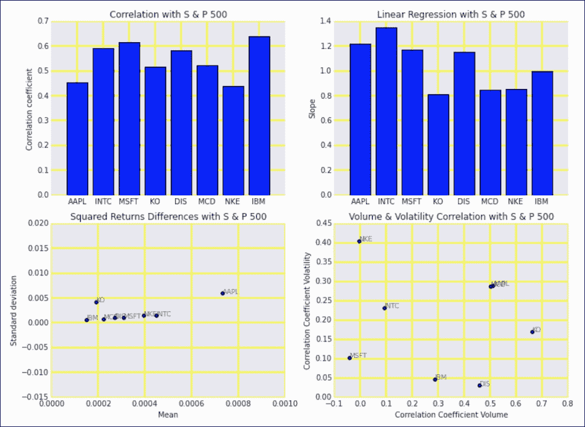

# 探索风险与回报

金融中的贝塔系数是一个线性回归模型的斜率(T2 ),该模型包含了 T3 资产的收益和一个基准的收益，例如 T4 500 指数。该模型定义如下:


根据 **资本资产定价模型** ( **资本资产定价模型**)的说法，贝塔是衡量风险的指标。预期收益由收益的平均值给出。如果我们绘制各种证券的贝塔值和预期收益，我们就获得了相应市场的**证券市场线** ( **SML** )。SML 的截距给出了**无风险率**，理论上我们应该在不承担任何风险的情况下获得回报。一般来说，如果一项资产不在 SML，那么根据资本资产定价模型，它被错误定价。

## 怎么做...

程序在本书代码包的`capm.ipynb`文件中:

1.  进口情况如下:

    ```py
    import dautil as dl
    import numpy as np
    import pandas as pd
    import ch7util
    import matplotlib.pyplot as plt
    ```

2.  定义以下函数来计算β值:

    ```py
    def calc_beta(symbol):
        ohlc = dl.data.OHLC()
        sp500 = ohlc.get('^GSPC')['Adj Close']
        stock = ohlc.get(symbol)['Adj Close']
        df = pd.DataFrame({'SP500': sp500, symbol: stock}).dropna()
        sp500_rets = ch7util.log_rets(df['SP500'])
        rets = ch7util.log_rets(df[symbol])
        beta, _ = np.polyfit(sp500_rets, rets, 1)

        # annualize & percentify
        return beta, 252 * rets.mean() * 100
    ```

3.  计算我们股票的贝塔值和平均回报:

    ```py
    betas = []
    means = []

    for symbol in ch7util.STOCKS:
        beta, ret_mean = calc_beta(symbol)
        betas.append(beta)
        means.append(ret_mean)
    ```

4.  绘制结果和市场安全线:

    ```py
    _, ax = plt.subplots()
    dl.plotting.plot_text(ax, betas, means, ch7util.STOCKS, add_scatter=True)
    dl.plotting.plot_polyfit(ax, betas, means)
    ax.set_title('Capital Asset Pricing Model')
    ax.set_xlabel('Beta')
    ax.set_ylabel('Mean annual return (%)')
    ```

有关最终结果，请参考以下屏幕截图:

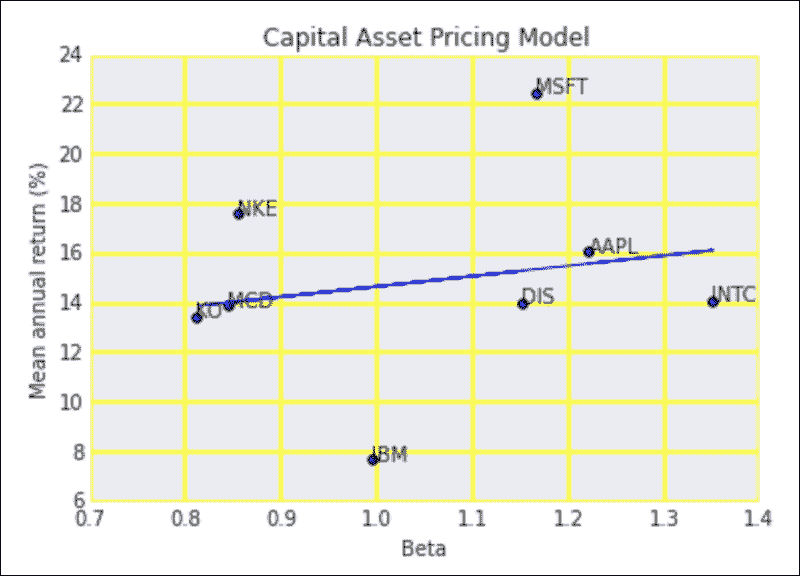

## 另见

*   关于 https://en.wikipedia.org/wiki/Beta_%28finance%29 测试版的维基百科页面(2015 年 10 月检索)
*   维基百科关于 https://en.wikipedia.org/wiki/Capital_asset_pricing_model 资本资产定价模型的页面(2015 年 10 月检索)

# 用非参数游程检验检验市场

**有效市场假说**(**【EMH】**)规定你平均不能通过挑选更好的股票或把握市场时机来“跑赢市场”。根据《EMH》的说法，所有关于市场的信息都可以以这样或那样的形式立即提供给每个市场参与者，并立即反映在资产价格中，因此投资就像是在玩一场纸牌游戏，所有的牌都露出来了。你能赢的唯一方法是在风险很大的股票上下注，然后走运。

法国数学家学士在 1900 年左右为 EMH 开发了一个测试。该测试考察了连续出现的正负价格变化。我们不计算价格没有变化的事件，只使用它们来结束运行。无论如何，对于流动性市场来说，这类事件相对较少。

统计测试本身在金融界之外为人所知，被称为“T2”沃尔德-沃尔福威茨运行测试“T3”。如果我们用“+”表示正变化，用“-”表示负变化，我们可以用 5 次运行得到序列“++++++++++++”。以下计算运行次数的平均值μ (7.6)、标准偏差σ (7.7)和 Z 评分 Z (7.8)的公式 *R* 还要求负变化次数 *N-* ，正变化次数 *N+* ，以及总变化次数 *N* :

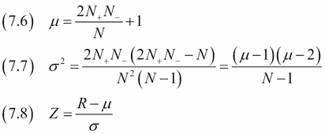

我们假设运行次数遵循正态分布，这给了我们一种方法，在我们选择的置信水平下，潜在地拒绝运行的随机性。

## 怎么做...

看看这本书代码包里的`non_parametric.ipynb`文件。

1.  进口情况如下:

    ```py
    import dautil as dl
    import numpy as np
    import pandas as pd
    import ch7util
    import matplotlib.pyplot as plt
    from scipy.stats import norm
    from IPython.display import HTML
    ```

2.  定义以下函数来计算运行次数:

    ```py
    def count_runs(signs):
        nruns = 0
        prev = None

        for s in signs:
            if s != 0 and s != prev:
                nruns += 1

            prev = s

        return nruns
    ```

3.  定义以下函数来计算平均值、标准偏差和 z 分数:

    ```py
    def proc_runs(symbol):
        ohlc = dl.data.OHLC()
        close = ohlc.get(symbol)['Adj Close'].values
        diffs = np.diff(close)
        nplus = (diffs > 0).sum()
        nmin = (diffs < 0).sum()
        n = nplus + nmin
        mean = (2 * (nplus * nmin) / n) + 1
        var = (mean - 1) * (mean - 2) / (n - 1)
        std = np.sqrt(var)
        signs = np.sign(diffs)
        nruns = count_runs(np.diff(signs))

        return mean, std, (nruns - mean) / std
    ```

4.  计算我们股票的指标:

    ```py
    means = []
    stds = []
    zscores = []

    for symbol in ch7util.STOCKS:
        mean, std, zscore = proc_runs(symbol)
        means.append(mean)
        stds.append(std)
        zscores.append(zscore)
    ```

5.  用表示 95%置信水平的线绘制 z 分数:

    ```py
    sp = dl.plotting.Subplotter(2, 1, context)
    dl.plotting.plot_text(sp.ax, means, stds, ch7util.STOCKS, add_scatter=True)
    sp.label()

    dl.plotting.bar(sp.next_ax(), ch7util.STOCKS, zscores)
    sp.ax.axhline(norm.ppf(0.95), label='95 % confidence level')
    sp.label()
    HTML(sp.exit())
    ```

最终结果参见以下截图:

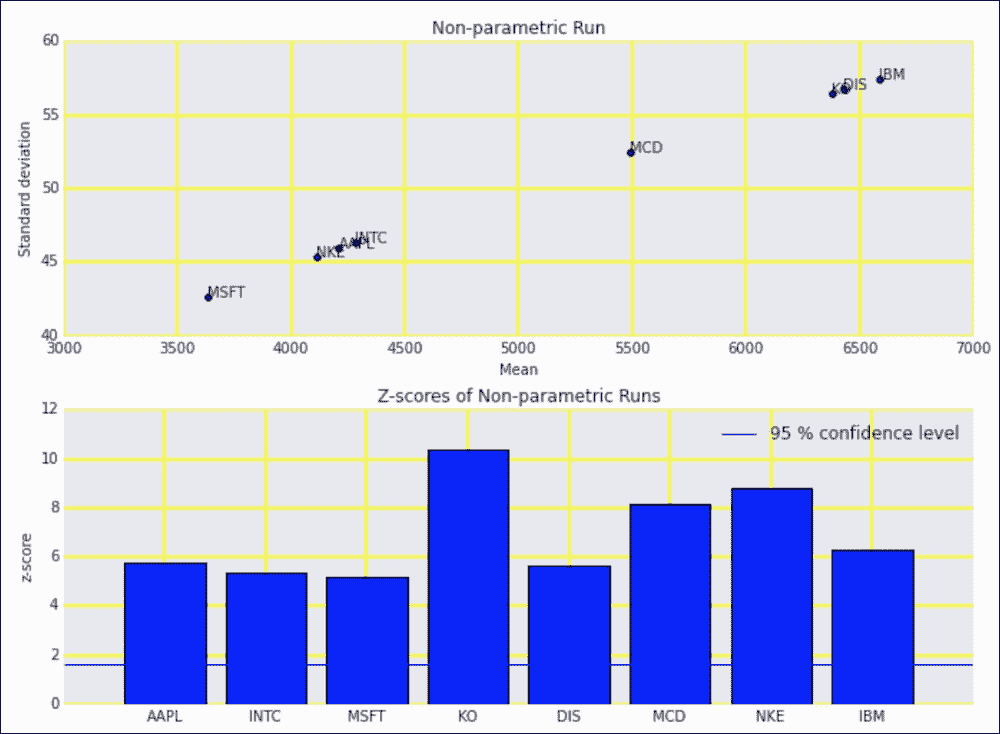

## 另见

*   维基百科关于沃尔德-沃尔福威茨运行测试的页面位于(2015 年 10 月检索)
*   关于 https://en.wikipedia.org/wiki/Efficient-market_hypothesis EMH 的维基百科页面(2015 年 10 月检索)

# 随机行走测试

**随机游走假说** ( **RWH** )就像有效市场假说(参考*用非参数游程检验*食谱检验市场)一样，声称市场是打不过的。 RWH 规定，资产价格执行随机游走。事实上，只要反复抛硬币，你就能生成相当令人信服的股价图。

1988 年，金融学教授罗和麦克莱恩斯用资产价格的自然对数作为数据为构建了一个测试。该测试指定原木价格在平均值(7.9)附近漂移。我们预计不同频率(例如，一天和两天)的价格变化是随机的。此外，两个不同频率下的方差(7.10 和 7.11)是相关的，根据以下等式，相应的比值(7.12)通常分布在零附近:

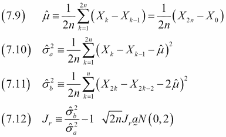

## 怎么做...

代码在本书代码包的`random_walk.ipynb`文件中:

1.  进口情况如下:

    ```py
    import dautil as dl
    import numpy as np
    import matplotlib.pyplot as plt
    import ch7util
    ```

2.  计算我们股票的比率:

    ```py
    ratios = []

    for symbol in ch7util.STOCKS:
        ohlc = dl.data.OHLC()
        P = ohlc.get(symbol)['Adj Close'].values
        N = len(P)
        mu = (np.log(P[-1]) - np.log(P[0]))/N
        var_a = 0
        var_b = 0

        for k in range(1, N):
            var_a = (np.log(P[k]) - np.log(P[k - 1]) - mu) ** 2
            var_a = var_a / N

        for k in range(1, N//2):
            var_b = (np.log(P[2 * k]) - np.log(P[2 * k - 2]) - 2 * mu) ** 2
            var_b = var_b / N

        ratios.append(np.sqrt(N) * (var_b/var_a - 1))
    ```

3.  绘制比率图，我们预计比率接近于零(7.12):

    ```py
    _, ax = plt.subplots()
    dl.plotting.bar(ax, ch7util.STOCKS, ratios)
    ax.set_title('Random Walk Test')
    ax.set_ylabel('Ratio')
    ```

有关最终结果，请参考以下屏幕截图:

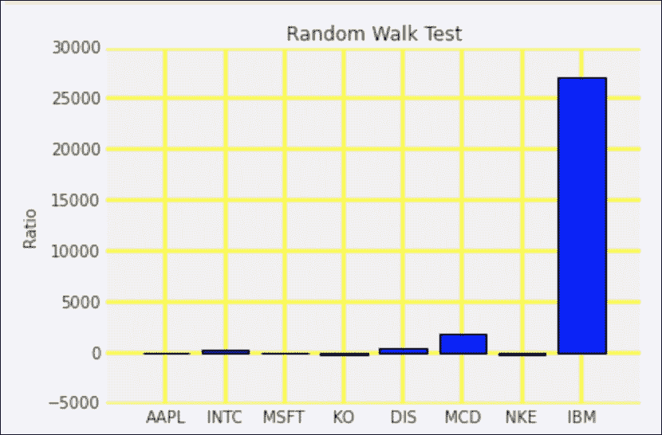

## 另见

*   维基百科页面关于 https://en.wikipedia.org/wiki/Random_walk_hypothesis 的随机行走假说(2015 年 10 月检索)
*   菲南德牧师。种马。(1988) 1 (1): 41-66.doi:10 . 1093/rfs/1 . 1 . 41[http://rfs.oxfordjournals.org/content/1/1/41.full](http://rfs.oxfordjournals.org/content/1/1/41.full)(2015 年 10 月检索)

# 用自回归模型确定市场效率

根据有效市场假说(参考*用非参数游程检验*方法检验市场)，关于资产的所有信息立即反映在资产的价格中。这意味着以前的价格不会影响现在的价格。以下方程指定了自回归模型(7。13)和受限模型(7。14)将所有系数设置为零:

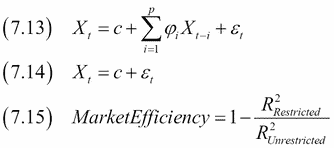

如果我们相信市场是有效的，我们会期望非限制模型比限制模型没有什么增加，因此，比率(7。15)的相应 R 平方系数应该接近 1。

## 怎么做...

脚本在本书代码包的`autoregressive_test.ipynb`文件中:

1.  进口情况如下:

    ```py
    import dautil as dl
    import ch7util
    import numpy as np
    import matplotlib.pyplot as plt
    import statsmodels.api as sm
    from IPython.display import HTML
    ```

2.  使用(7.13)和(7.14)拟合模型，然后使用(7.15)为我们的股票列表计算市场效率:

    ```py
    ohlc = dl.data.OHLC()
    efficiencies = []
    restricted_r2 = []
    unrestricted_r2 = []

    for stock in ch7util.STOCKS:
        rets = ch7util.log_rets(ohlc.get(stock)['Adj Close'])
        restricted = sm.OLS(rets, rets.mean() * np.ones_like(rets)).fit()
        rets_1 = rets[3:-1]
        rets_2 = rets[2:-2]
        rets_3 = rets[1:-3]
        rets_4 = rets[:-4]
        x = np.vstack((rets_1, rets_2, rets_3, rets_4)).T
        x = sm.add_constant(x)
        y = rets[4:]
        unrestricted = sm.OLS(y, x).fit()
        restricted_r2.append(restricted.rsquared)
        unrestricted_r2.append(unrestricted.rsquared)
        efficiencies.append(1 - restricted.rsquared/unrestricted.rsquared)
    ```

3.  将市场效率和 R 平方值绘制如下:

    ```py
    sp = dl.plotting.Subplotter(2, 1, context)
    dl.plotting.bar(sp.ax, ch7util.STOCKS, efficiencies)
    sp.label()
    dl.plotting.plot_text(sp.next_ax(), unrestricted_r2, np.array(restricted_r2)/10 ** -16,
                          ch7util.STOCKS, add_scatter=True)
    sp.label()
    HTML(sp.exit())
    ```

有关最终结果，请参考以下屏幕截图:

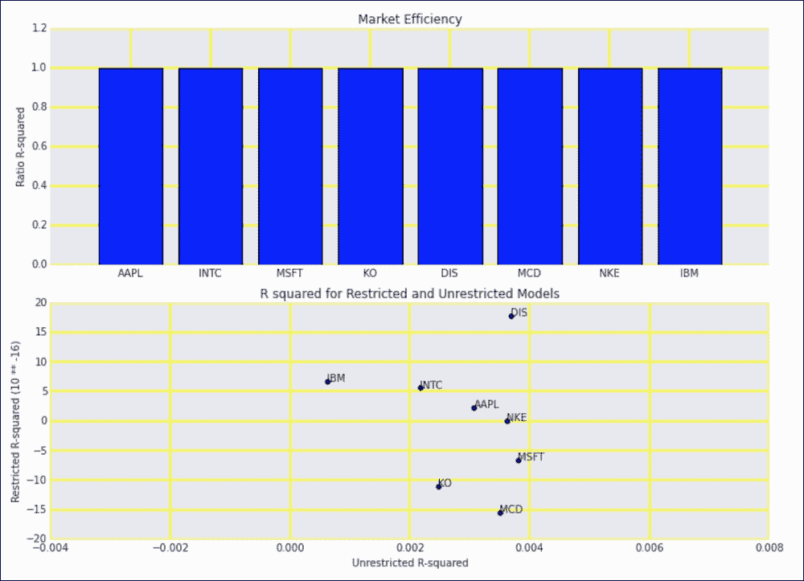

## 另见

*   https://en.wikipedia.org/wiki/Autoregressive_model T2 的自回归模型的维基百科页面(2015 年 10 月检索)

# 为股票价格数据库创建表格

只存储股票价格一般来说不是很有用。我们通常希望存储关于公司和相关衍生品的额外静态信息，如股票期权和期货。经济学理论告诉我们，在历史价格数据中寻找周期和趋势或多或少是浪费时间；因此，创建数据库似乎更没有意义。当然你不必相信这个理论，无论如何创建一个股票价格数据库是一个有趣的技术挑战。数据库对于投资组合优化也很有用(参见食谱*优化同等权重的 2 资产投资组合*)。

我们将基于*中的星型模式进行设计，用事实和维度表*实现星型模式。事实表将保存价格，包括日期维度表、资产维度表和来源维度表，如下图所示:


显然，模式会随着时间的推移而发展，根据需要添加或删除表、索引和列。我们将使用*中的模式填充股票价格数据库*配方。

## 怎么做...

该模式在本书的代码包中的`database_tables.py`文件中定义:

1.  进口情况如下:

    ```py
    from sqlalchemy import Column
    from sqlalchemy.ext.declarative import declarative_base
    from sqlalchemy import Date
    from sqlalchemy import ForeignKey
    from sqlalchemy import Integer
    from sqlalchemy import String

    Base = declarative_base()
    ```

2.  为股价事实表定义以下类别:

    ```py
    class StockPrice(Base):
        __tablename__ = 'stock_price'
        id = Column(Integer, primary_key=True)
        date_id = Column(Integer, ForeignKey('date_dim.id'),
                         primary_key=True)
        asset_id = Column(Integer, ForeignKey('asset_dim.id'),
                          primary_key=True)
        source_id = Column(Integer, ForeignKey('source_dim.id'),
                           primary_key=True)
        open_price = Column(Integer)
        high_price = Column(Integer)
        low_price = Column(Integer)
        close_price = Column(Integer)
        adjusted_close = Column(Integer)
        volume = Column(Integer)
    ```

3.  为日期维度表定义以下类:

    ```py
    class DateDim(Base):
        __tablename__ = 'date_dim'
        id = Column(Integer, primary_key=True)
        date = Column(Date, nullable=False, unique=True)
        day_of_month = Column(Integer, nullable=False)
        day_of_week = Column(Integer, nullable=False)
        month = Column(Integer, nullable=False)
        quarter = Column(Integer, nullable=False)
        year = Column(Integer, nullable=False)
    ```

4.  定义以下类来保存股票信息:

    ```py
    class AssetDim(Base):
        __tablename__ = 'asset_dim'
        id = Column(Integer, primary_key=True)
        symbol = Column(String, nullable=False, unique=True)
        name = Column(String, nullable=False)
        # Could make this a reference to separate table
        category = Column(String, nullable=False)
        country = Column(String, nullable=False)
        # Could make this a reference to separate table
        sector = Column(String, nullable=False)
    ```

5.  为源维度表定义以下类(雅虎财经只需要一个条目):

    ```py
    class SourceDim(Base):
        __tablename__ = 'source_dim'
        id = Column(Integer, primary_key=True)
        name = Column(String, nullable=False)
        url = Column(String)
    ```

# 填充股票价格数据库

在*为股票价格数据库*配方创建表格中，我们为历史股票价格数据库定义了一个模式。在这个食谱中，我们将使用雅虎财经的数据填充表格，并绘制不同时间段和业务部门的平均交易量。

股市研究人员发现了几个与季节效应有关的奇怪现象。此外，还有某些反复出现的事件，如盈利公告、股息支付和期权到期。同样，经济理论告诉我们，我们观察到的任何模式要么是幻觉，要么是所有市场参与者都已经知道的。这是真是假很难证实；然而，这种方法作为数据分析的练习是很棒的。此外，您可以使用数据库来优化您的投资组合，如*优化等权重 2 资产投资组合*食谱中所述。

## 怎么做...

代码在本书代码包的`populate_database.ipynb`文件中:

1.  进口情况如下:

    ```py
    import database_tables as tables
    import pandas as pd
    import os
    import dautil as dl
    import ch7util
    import sqlite3
    import matplotlib.pyplot as plt
    import seaborn as sns
    from IPython.display import HTML
    ```

2.  定义以下函数来填充日期维度表:

    ```py
    def populate_date_dim(session):
        for d in pd.date_range(start='19000101', end='20250101'):
            adate = tables.DateDim(date=d.date(), day_of_month=d.day,
                                   day_of_week=d.dayofweek, month=d.month,
                                   quarter=d.quarter, year=d.year)
            session.add(adate)

        session.commit()
    ```

3.  定义以下功能填充资产维度表:

    ```py
    def populate_asset_dim(session):
        asset = tables.AssetDim(symbol='AAPL', name='Apple Inc.',
                                category='Common Stock', country='USA',
                                sector='Consumer Goods')
        session.add(asset)

        asset = tables.AssetDim(symbol='INTC', name='Intel Corporation',
                                category='Common Stock', country='USA',
                                sector='Technology')
        session.add(asset)

        asset = tables.AssetDim(symbol='MSFT', name='Microsoft Corporation',
                                category='Common Stock', country='USA',
                                sector='Technology')
        session.add(asset)

        asset = tables.AssetDim(symbol='KO', name='The Coca-Cola Company',
                                category='Common Stock', country='USA',
                                sector='Consumer Goods')
        session.add(asset)

        asset = tables.AssetDim(symbol='DIS', name='The Walt Disney Company',
                                category='Common Stock', country='USA',
                                sector='Services')
        session.add(asset)

        asset = tables.AssetDim(symbol='MCD', name='McDonald\'s Corp.',
                                category='Common Stock', country='USA',
                                sector='Services')
        session.add(asset)

        asset = tables.AssetDim(symbol='NKE', name='NIKE, Inc.',
                                category='Common Stock', country='USA',
                                sector='Consumer Goods')
        session.add(asset)

        asset = tables.AssetDim(symbol='IBM',
                                name='International Business Machines Corporation',
                                category='Common Stock', country='USA',
                                sector='Technology')
        session.add(asset)

        session.commit()
    ```

4.  定义以下函数来填充源维度表:

    ```py
    def populate_source_dim(session):
        session.add(tables.SourceDim(name='Yahoo Finance',
                                     url='https://finance.yahoo.com'))
        session.commit()
    ```

5.  定义以下函数来填充持有股票价格的事实表:

    ```py
    def populate_prices(session):
        symbols = dl.db.map_to_id(session, tables.AssetDim.symbol)
        dates = dl.db.map_to_id(session, tables.DateDim.date)
        source_id = session.query(tables.SourceDim).first().id
        ohlc = dl.data.OHLC()
        conn = sqlite3.connect(dbname)
        c = conn.cursor()
        insert = '''INSERT INTO stock_price (id, date_id,
            asset_id, source_id, open_price, high_price, low_price,
            close_price, adjusted_close, volume)  VALUES({id}, {date_id},
            {asset_id}, {source_id}, {open_price}, {high_price},
            {low_price}, {close_price}, {adj_close}, {volume})'''
        logger = dl.log_api.conf_logger(__name__)

        for symbol in ch7util.STOCKS:
            df = ohlc.get(symbol)
            i = 0

            for index, row in df.iterrows():
                date_id = dates[index.date()]
                asset_id = symbols[symbol]
                i += 1
                stmt = insert.format(id=i, date_id=date_id,
                                     asset_id=asset_id,
                                     source_id=source_id,
                                     open_price=dl.data.centify(row['Open']),
                                     high_price=dl.data.centify(row['High']),
                                     low_price=dl.data.centify(row['Low']),
                                     close_price=dl.data.centify(row['Close']),
                                     adj_close=dl.data.centify(row['Adj Close']),
                                     volume=int(row['Volume']))
                c.execute(stmt)

                if i % 1000 == 0:
                    logger.info("Progress %s %s", symbol, i)

                conn.commit()

            conn.commit()

        c.close()
        conn.close()
    ```

6.  定义以下函数来填充所有表:

    ```py
    def populate(session):
        if session.query(tables.SourceDim).count() == 0:
            populate_source_dim(session)
            populate_asset_dim(session)
            populate_date_dim(session)
            populate_prices(session)
    ```

7.  定义以下函数来绘制平均体积:

    ```py
    def plot_volume(col, ax):
        df = pd.read_sql(sql.format(col=col), conn)
        sns.barplot(x=col, y='AVG(P.Volume/1000)', data=df,
                    hue='sector', ax=ax)

        ax.legend(loc='best')

    dbname = os.path.join(dl.data.get_data_dir(), 'stock_prices.db')
    session = dl.db.create_session(dbname, tables.Base)
    populate(session)
    sql = '''
        SELECT
            A.sector,
            D.{col},
            AVG(P.Volume/1000)
        FROM stock_price P
        INNER JOIN date_dim D  ON (P.Date_Id = D.Id)
        INNER JOIN asset_dim A ON (P.asset_id = a.Id)
        GROUP BY
            A.sector,
            D.{col}
          '''
    ```

8.  用以下代码绘制平均体积:

    ```py
    conn = sqlite3.connect(dbname)

    sp = dl.plotting.Subplotter(2, 2, context)
    plot_volume('day_of_week', sp.ax)
    sp.ax.set_xticklabels(['Mon', 'Tue', 'Wed', 'Thu', 'Fri'])

    plot_volume('month', sp.next_ax())
    sp.ax.set_xticklabels(dl.ts.short_months())

    plot_volume('day_of_month', sp.next_ax())
    plot_volume('quarter', sp.next_ax())
    HTML(sp.exit())
    ```

有关最终结果，请参考以下屏幕截图:


# 优化等权重双资产组合

买卖股票有点像购物。购物是超市和网上书店都很熟悉的事情。这些类型的业务通常应用技术，如篮子分析和推荐引擎。例如，如果你是一个写历史不准确小说的作家的粉丝，推荐引擎可能会推荐同一作家的另一部小说或其他历史不准确的小说。

股票推荐引擎不能这样工作。例如，如果你的投资组合中只有石油生产商的股票，而油价对你不利，那么整个投资组合将失去价值。所以，我们应该尝试拥有来自不同行业、行业或地理区域的股票。我们可以用回报的相关性来衡量相似性。

类似于夏普比率(参考*用夏普比率和流动性排名股票*食谱)，我们希望最大化我们的投资组合的平均回报，最小化投资组合回报的方差。这些想法也存在于**现代投资组合理论** ( **MPT** )中，其发明者被授予诺贝尔奖。对于双资产投资组合，我们有以下等式:


权重 *wA* 和 *wB* 为组合权重，合计为 1。权重可以是负的——因为投资者可以卖空(不持有就卖出，这会产生借贷成本)一种证券。我们可以用线性代数方法或一般优化算法解决投资组合优化问题。然而，对于权重相等、只有少数股票的双资产投资组合来说，蛮力方法已经足够好了。

## 怎么做...

以下是本书代码包中`portfolio_optimization.ipynb`文件的分解:

1.  进口情况如下:

    ```py
    import dautil as dl
    import ch7util
    import pandas as pd
    import numpy as np
    import seaborn as sns
    import matplotlib.pyplot as plt
    ```

2.  定义以下函数来计算预期收益(7.16):

    ```py
    def expected_return(stocka, stockb, means):
        return 0.5 * (means[stocka] + means[stockb])
    ```

3.  定义以下函数计算投资组合回报的方差(7.17):

    ```py
    def variance_return(stocka, stockb, stds):
        ohlc = dl.data.OHLC()
        dfa = ohlc.get(stocka)
        dfb = ohlc.get(stockb)
        merged = pd.merge(left=dfa, right=dfb,
                          right_index=True, left_index=True,
                          suffixes=('_A', '_B')).dropna()
        retsa = ch7util.log_rets(merged['Adj Close_A'])
        retsb = ch7util.log_rets(merged['Adj Close_B'])
        corr = np.corrcoef(retsa, retsb)[0][1]

        return 0.25 * (stds[stocka] ** 2 + stds[stockb] ** 2 +
                       2 * stds[stocka] * stds[stockb] * corr)
    ```

4.  定义以下函数计算预期收益与方差的比值:

    ```py
    def calc_ratio(stocka, stockb, means, stds, ratios):
        if stocka == stockb:
            return np.nan

        key = stocka + '_' + stockb
        ratio = ratios.get(key, None)

        if ratio:
            return ratio

        expected = expected_return(stocka, stockb, means)
        var = variance_return(stocka, stockb, stds)
        ratio = expected/var
        ratios[key] = ratio

        return ratio
    ```

5.  计算每只股票的平均回报和标准差:

    ```py
    means = {}
    stds = {}

    ohlc = dl.data.OHLC()

    for stock in ch7util.STOCKS:
        close = ohlc.get(stock)['Adj Close']
        rets = ch7util.log_rets(close)
        means[stock] = rets.mean()
        stds[stock] = rets.std()
    ```

6.  计算我们所有股票组合的网格比率:

    ```py
    pairs = dl.collect.grid_list(ch7util.STOCKS)
    sorted_pairs = [[sorted(row[i]) for row in pairs]
                    for i in range(len(ch7util.STOCKS))]
    ratios = {}

    grid = [[calc_ratio(row[i][0], row[i][1], means, stds, ratios)
            for row in sorted_pairs] for i in range(len(ch7util.STOCKS))]
    ```

7.  在热图中绘制网格如下:

    ```py
    %matplotlib inline
    plt.title('Expected Return/Return Variance for 2 Asset Portfolio')
    sns.heatmap(grid, xticklabels=ch7util.STOCKS, yticklabels=ch7util.STOCKS)
    ```

最终结果参见以下截图:

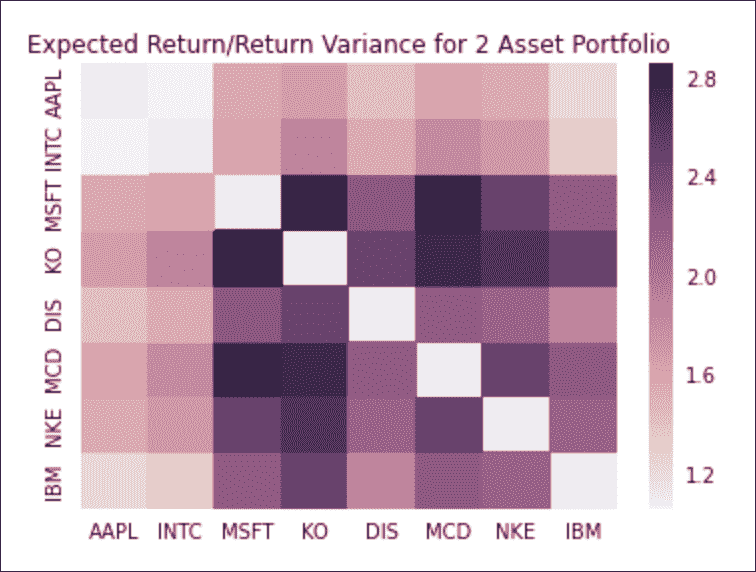

## 另见

*   关于 https://en.wikipedia.org/wiki/Modern_portfolio_theory MPT 的维基百科页面(2015 年 10 月检索)