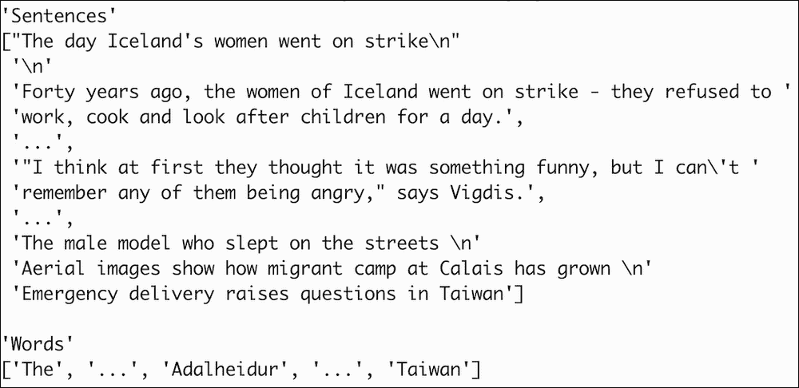
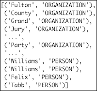
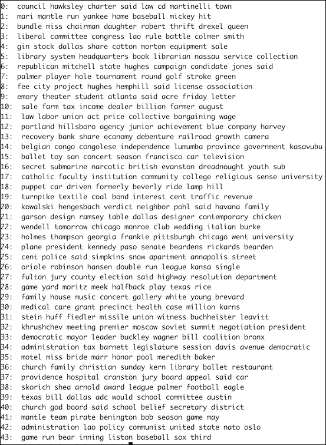
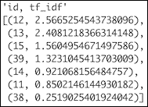
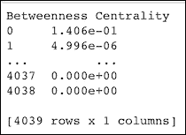
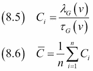
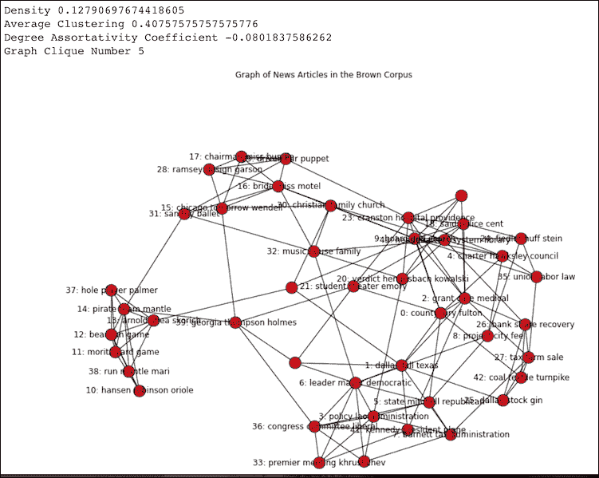

# 八、文本挖掘与社交网络分析

在本章中，我们将介绍以下食谱:

*   创建分类语料库
*   用句子和单词标记新闻文章
*   词干，引理，过滤和 TF-IDF 分数
*   识别命名实体
*   利用非负矩阵分解提取主题
*   实现基本术语数据库
*   计算社交网络密度
*   计算社交网络接近度中心度
*   确定中间中心性
*   估计平均聚类系数
*   计算图的分类系数
*   得到图的团数
*   创建具有余弦相似性的文档图

# 简介

人类通过语言交流已经有几千年了。手写文本已经存在了很长时间，古腾堡出版社当然是一个巨大的发展，但是现在我们有了计算机、互联网和社交媒体，事情肯定已经失控了。

本章将帮助你应对文本和社交媒体信息的泛滥。我们将使用的主要 Python 库是 NLTK 和 NetworkX。你必须真正理解在这些库中可以找到多少特性。用`pip`或`conda`安装 NLTK，如下所示:

```py
$ conda/pip install nltk 

```

代码用 NLTK 3.0.2 进行了测试。如需下载语料库，请按照[http://www.nltk.org/data.html](http://www.nltk.org/data.html)给出的说明进行(2015 年 11 月检索)。

使用 `pip`或`conda`安装网络，如下所示:

```py
$ conda/pip install networkx 

```

该代码用网络 1.9.1 进行了测试。

# 创建分类语料库

作为 Python 爱好者，我们对关于 Python 编程或相关技术的新闻感兴趣；但是，如果搜索 Python 文章，也可能会得到关于蛇的文章。这个问题的一个解决方案是训练一个识别相关文章的分类器。这需要一个训练集——一个分类的语料库，例如，“Python 编程”和“其他”类别。

NLTK 有`CategorizedPlaintextCorpusReader`类，用于构建分类语料库。为了让事情变得更加令人兴奋，我们将从 RSS 源中获取新闻文章的链接。我选择了英国广播公司的节目，但是你当然可以使用任何其他的节目。英国广播公司的节目已经分类了。我选择了世界新闻和科技新闻，所以这给了我们两个类别。提要不包含文章的全文，因此我们需要使用 Selenium 进行一些抓取，如[第 5 章](05.html "Chapter 5. Web Mining, Databases, and Big Data")、*网络挖掘、数据库和大数据*所述。你可能需要对文本文件进行后处理，因为英国广播公司的网页不仅包含新闻故事的文本，还包含副刊。

## 做好准备

按照本章*简介*部分的说明安装 NLTK。安装用于处理 RSS 源的 feedparser:

```py
$ pip/conda install feedparser

```

我用 feedparser 5.2.1 测试了这个配方。

## 怎么做...

1.  进口情况如下:

    ```py
    import feedparser as fp
    import urllib
    from selenium import webdriver
    from selenium.webdriver.support.ui import WebDriverWait
    from selenium.webdriver.support import expected_conditions as EC
    from selenium.webdriver.common.by import By
    import dautil as dl
    from nltk.corpus.reader import CategorizedPlaintextCorpusReader
    import os
    ```

2.  创建以下变量来帮助刮擦:

    ```py
    DRIVER = webdriver.PhantomJS()
    NAP_SECONDS = 10
    LOGGER = dl.log_api.conf_logger('corpus')
    ```

3.  定义以下功能存储文本内容:

    ```py
    def store_txt(url, fname, title):
        try:
            DRIVER.get(url)

            elems = WebDriverWait(DRIVER, NAP_SECONDS).until(
                EC.presence_of_all_elements_located((By.XPATH, '//p'))
            )

            with open(fname, 'w') as txt_file:
                txt_file.write(title + '\n\n')
                lines = [e.text for e in elems]
                txt_file.write(' \n'.join(lines))
        except Exception:
            LOGGER.error("Error processing HTML", exc_info=True)
    ```

4.  定义以下函数来检索故事:

    ```py
    def fetch_news(dir):
        base = 'http://newsrss.bbc.co.uk/rss/newsonline_uk_edition/{}/rss.xml'

        for category in ['world', 'technology']:
            rss = fp.parse(base.format(category))

            for i, entry in enumerate(rss.entries):
                fname = '{0}_bbc_{1}.txt'.format(i, category)
                fname = os.path.join(dir, fname)

                if not dl.conf.file_exists(fname):
                    store_txt(entry.link, fname, entry.title)
    ```

5.  用以下代码调用函数:

    ```py
    if __name__ == "__main__":
        dir = os.path.join(dl.data.get_data_dir(), 'bbc_news_corpus')

        if not os.path.exists(dir):
            os.mkdir(dir)

        fetch_news(dir)
        reader = CategorizedPlaintextCorpusReader(dir, r'.*bbc.*\.txt',
                                                  cat_pattern=r'.*bbc_(\w+)\.txt')
        printer = dl.log_api.Printer(nelems=3)
        printer.print('Categories', reader.categories())
        printer.print('World fileids', reader.fileids(categories=['world']))
        printer.print('Technology fileids',
                      reader.fileids(categories=['technology']))
    ```

最终结果参见以下截图:


代码在本书代码包的`corpus.py`文件中。

## 另见

*   位于[的`CategorizedPlaintextCorpusReader`文档](http://www.nltk.org/api/nltk.corpus.reader.html#nltk.corpus.reader.CategorizedPlaintextCorpusReader)

# 用句子和单词标记新闻文章

作为 NLTK 分布的一部分的语料库已经被标记化，所以我们可以很容易地获得单词和句子的列表。对于我们自己的语料库，我们也应该应用标记化。这个食谱演示了如何用 NLTK 实现标记化。我们将使用的文本文件在本书的代码包中。这个特殊的文本是英文的，但是 NLTK 也支持其他语言。

## 做好准备

按照本章*简介*部分的说明安装 NLTK。

## 怎么做...

程序在本书代码包的`tokenizing.py`文件中:

1.  进口情况如下:

    ```py
    from nltk.tokenize import sent_tokenize
    from nltk.tokenize import word_tokenize
    import dautil as dl
    ```

2.  以下代码演示了标记化:

    ```py
    fname = '46_bbc_world.txt'
    printer = dl.log_api.Printer(nelems=3)

    with open(fname, "r", encoding="utf-8") as txt_file:
        txt = txt_file.read()
        printer.print('Sentences', sent_tokenize(txt))
        printer.print('Words', word_tokenize(txt))
    ```

有关最终结果，请参考以下屏幕截图:



## 另见

*   相关文件在 http://www.nltk.org/api/nltk.tokenize.html?highlight = send _ tokenize # nltk . tokenize . send _ tokenize(2015 年 10 月检索)。

# 词干、引理、过滤和 TF-IDF 分数

单词包模型将语料库字面上表示为单词包，不考虑单词的位置，只考虑它们的数量。停止词是常见的词，如“a”、“is”和“the”，它们不增加信息价值。

TF-IDF 分数可以针对单个单词(**单字**)或多个连续单词(**n-克**)的组合进行计算。TF-IDF 大致为**词频**和**逆文档频率**的比值。我说“大致”是因为我们通常取比率的对数或应用加权方案。术语频率是文档中一个单词或 n-gram 的频率。逆文档频率是单词或 n-gram 出现的文档数量的倒数。我们可以使用 TF-IDF 分数进行聚类或者作为分类的一个特征。在*用非负矩阵分解提取主题*食谱中，我们将使用分数来发现主题。

NLTK 通过一个稀疏矩阵来表示分数，该矩阵为语料库中的每个文档提供一行，为每个单词或 n-gram 提供一列。即使矩阵是稀疏的，我们也应该根据我们试图解决的问题类型，尽可能多地过滤单词。过滤代码在`ch8util.py`中，执行以下操作:

*   将所有单词转换为小写。在英语中，句子以大写字母开头，在单词包模型中，我们不关心单词的位置。显然，如果我们想检测命名实体(如*识别命名实体*配方)，案例很重要。
*   忽略停止词，因为它们没有语义价值。
*   忽略仅由一个字符组成的单词，因为这些单词要么是停止单词，要么是假装单词的标点符号。
*   忽略只出现一次的单词，因为这些单词不太可能很重要。
*   只允许包含字母的单词，因此会忽略像“7”这样包含数字的单词。

我们也会用**引理**进行过滤。引理化类似于词干化，我也将演示这一点。这两个过程背后的想法是单词有共同的词根，例如，“分析”、“分析师”和“分析师”有共同的词根。一般来说，**词干**会剪切字符，所以结果不一定是一个有效的单词。相反，引理化总是产生有效的单词并执行字典查找。

本书代码包中`ch8util.py`文件的代码如下:

```py
from collections import Counter
from nltk.corpus import brown
from joblib import Memory

memory = Memory(cachedir='.')

def only_letters(word):
    for c in word:
        if not c.isalpha():
            return False

    return True

@memory.cache
def filter(fid, lemmatizer, sw):
    words = [lemmatizer.lemmatize(w.lower()) for w in brown.words(fid)
             if len(w) > 1 and w.lower() not in sw]

    # Ignore words which only occur once
    counts = Counter(words)
    rare = set([w for w, c in counts.items() if c == 1])

    filtered_words = [w for w in words if w not in rare]

    return [w for w in filtered_words if only_letters(w)]
```

我决定将分析限制在单图，但是将分析扩展到二元模型或三元模型是非常容易的。我们将使用的 scikit-learn `TfidfVectorizer`类允许我们指定一个`ngram_range`字段，这样我们就可以同时考虑 unigrams 和 n-grams。我们将腌制这个食谱的结果，以供其他食谱重复使用。

## 做好准备

按照*简介*部分的说明安装 NLTK。

## 怎么做...

脚本在本书代码包的`stemming_lemma.py`文件中:

1.  进口情况如下:

    ```py
    from nltk.corpus import brown
    from nltk.corpus import stopwords
    from nltk.stem import PorterStemmer
    from nltk.stem import WordNetLemmatizer
    import ch8util
    from sklearn.feature_extraction.text import TfidfVectorizer
    import numpy as np
    import pandas as pd
    import pickle
    import dautil as dl
    ```

2.  演示词干和引理如下:

    ```py
    stemmer = PorterStemmer()
    lemmatizer = WordNetLemmatizer()

    print('stem(analyses)', stemmer.stem('analyses'))
    print('lemmatize(analyses)', lemmatizer.lemmatize('analyses'))
    ```

3.  过滤 NLTK 布朗语料库中的单词:

    ```py
    sw = set(stopwords.words())
    texts = []

    fids = brown.fileids(categories='news')

    for fid in fids:
        texts.append(" ".join(ch8util.filter(fid, lemmatizer, sw)))
    ```

4.  计算 TF-IDF 分数如下:

    ```py
    vectorizer = TfidfVectorizer()
    matrix = vectorizer.fit_transform(texts)

    with open('tfidf.pkl', 'wb') as pkl:
        pickle.dump(matrix, pkl)

    sums = np.array(matrix.sum(axis=0)).ravel()

    ranks = [(word, val) for word, val in
             zip(vectorizer.get_feature_names(), sums)]

    df = pd.DataFrame(ranks, columns=["term", "tfidf"])
    df.to_pickle('tfidf_df.pkl')
    df = df.sort(['tfidf'])
    dl.options.set_pd_options()
    print(df)
    ```

最终结果参见以下截图:


## 它是如何工作的

如您所见，词干不返回有效的单词。它比引理化更快；但是，如果想要重用结果，首选引理化是有意义的。TF-IDF 分数在最终Pandas`DataFrame`对象中按升序排序。更高的 TF-IDF 分数表示更重要的单词。

## 另见

*   维基百科页面关于[https://en.wikipedia.org/wiki/Bag-of-words_model](https://en.wikipedia.org/wiki/Bag-of-words_model)的单词包模型(2015 年 10 月检索)
*   维基百科关于 https://en.wikipedia.org/wiki/Lemmatisation 词条化的页面(2015 年 10 月检索)
*   https://en.wikipedia.org/wiki/Tf%E2%80%93idf 的 TF-IDF 的维基百科页面(2015 年 10 月检索)
*   维基百科关于https://en.wikipedia.org/wiki/Stop_words 的停词页面(2015 年 10 月检索)
*   位于[的`TfidfVectorizer`类的文档](http://scikit-learn.org/stable/modules/generated/sklearn.feature_extraction.text.TfidfVectorizer.html)(2015 年 10 月检索)
*   位于[的`WordNetLemmatizer`类文档](http://www.nltk.org/api/nltk.stem.html#nltk.stem.wordnet.WordNetLemmatizer)

# 识别命名实体

**命名实体识别** ( **NER** )试图检测文本中的人名、组织名、地点名和其他名称。有些 NER 系统几乎和人类一样好，但这不是一件容易的事情。命名实体通常以大写字母开头，例如 Ivan。因此，在应用 NER 时，我们不应该改变词语的大小写。

NLTK 支持斯坦福 NER 应用编程接口。这是一个 Java API，所以你的系统上需要有 Java。我用 Java 1.8.0_65 测试了代码。本食谱中的代码下载了截至 2015 年 10 月的最新斯坦福 NER 档案(`stanford-ner-2015-04-20.zip/3.5.2`)。如果你想要另一个版本，看看[http://nlp.stanford.edu/software/CRF-NER.shtml](http://nlp.stanford.edu/software/CRF-NER.shtml)(检索 2015 年 10 月)。

## 做好准备

按照*简介*部分的说明安装 NLTK。您可能还需要安装 Java。

## 怎么做...

脚本在本书代码包的`named_entity.py`文件中:

1.  进口如下:

    ```py
    from nltk.tag.stanford import NERTagger
    import dautil as dl
    import os
    from zipfile import ZipFile
    from nltk.corpus import brown
    ```

2.  定义以下功能下载 NER 档案:

    ```py
    def download_ner():
        url = 'http://nlp.stanford.edu/software/stanford-ner-2015-04-20.zip'
        dir = os.path.join(dl.data.get_data_dir(), 'ner')

        if not os.path.exists(dir):
            os.mkdir(dir)

        fname = 'stanford-ner-2015-04-20.zip'
        out = os.path.join(dir, fname)

        if not dl.conf.file_exists(out):
            dl.data.download(url, out)

            with ZipFile(out) as nerzip:
                nerzip.extractall(path=dir)

        return os.path.join(dir, fname.replace('.zip', ''))
    ```

3.  将 NER 应用于布朗语料库中的一个文件:

    ```py
    dir = download_ner()
    st = NERTagger(os.path.join(dir, 'classifiers',
                                'english.all.3class.distsim.crf.ser.gz'),
                   os.path.join(dir, 'stanford-ner.jar'))
    fid = brown.fileids(categories='news')[0]
    printer = dl.log_api.Printer(nelems=9)

    tagged = [pair for pair in dl.collect.flatten(st.tag(brown.words(fid)))
              if pair[1] != 'O']
    printer.print(tagged)
    ```

有关最终结果，请参考以下屏幕截图:



## 它是如何工作的

我们通过指定一个预先训练好的分类器和 NER JAR (Java 档案)创建了一个`NerTagger`对象。分类器在我们的语料库中将单词标记为组织、位置、人或其他。分类是区分大小写的，这意味着如果你把所有的单词都小写，你会得到不同的结果。

## 另见

*   https://en.wikipedia.org/wiki/Named-entity_recognition 关于 NER 的维基百科页面(2015 年 10 月检索)

# 利用非负矩阵分解提取主题

自然语言处理中的主题并不完全符合字典的定义，而是更符合一个模糊的统计概念。我们谈到**话题模型**和与话题相关的单词的概率分布，正如我们所知。当我们阅读文本时，我们期望出现在标题或正文中的某些单词能够捕捉文档的语义上下文。一篇关于 Python 编程的文章会有“类”和“函数”这样的词，而一个关于蛇的故事会有“蛋”和“害怕”这样的词文本通常有多个主题；例如，这个食谱是关于主题模型和非负矩阵分解，我们将很快讨论。因此，我们可以通过给主题分配不同的权重来为主题定义一个加法模型。

主题建模算法之一是**非负矩阵分解** ( **NMF** )。该算法将一个矩阵分解为两个矩阵的乘积，使得两个矩阵没有负值。通常，我们只能在数值上逼近因式分解的解，时间复杂度是多项式的。scikit-learn `NMF`类实现了这个算法。NMF 还可以应用于文档聚类和信号处理。

## 怎么做...

我们将重用来自*词干、引理、过滤和 TF-IDF 评分*方法的结果:

1.  进口情况如下:

    ```py
    from sklearn.decomposition import NMF
    import ch8util
    ```

2.  从泡菜加载 TF-IDF 矩阵和单词:

    ```py
    terms = ch8util.load_terms()
    tfidf = ch8util.load_tfidf()
    ```

3.  将主题可视化为高级单词列表:

    ```py
    nmf = NMF(n_components=44, random_state=51).fit(tfidf)

    for topic_idx, topic in enumerate(nmf.components_):
        label = '{}: '.format(topic_idx)
        print(label, " ".join([terms[i] for i in topic.argsort()[:-9:-1]]))
    ```

有关最终结果，请参考以下屏幕截图:



代码在本书代码包的`topic_extraction.py`文件中。

## 它是如何工作的

`NMF`类有一个`components_`属性，保存数据的非负成分。我们选择了`components_`属性中最高值对应的单词。如你所见，话题多种多样，虽然有点过时。

## 另见

*   位于[的 NMF 课程的](http://scikit-learn.org/stable/modules/generated/sklearn.decomposition.NMF.html)文档
*   关于[https://en.wikipedia.org/wiki/Topic_model](https://en.wikipedia.org/wiki/Topic_model)话题模型的维基百科页面(2015 年 10 月检索)
*   维基百科关于 NMF 的页面

# 实现基本术语数据库

众所周知，自然语言处理有许多应用:

*   商业和开源搜索引擎实现的全文搜索
*   文档聚类
*   分类，例如在产品评论的上下文中确定文本类型或情感

为了执行这些任务，我们需要计算特征，如 TF-IDF 分数(参考*词干、引理、过滤和 TF-IDF 分数*)。特别是在大数据集的情况下，存储特征以便于处理是有意义的。搜索引擎使用倒排索引，将单词映射到网页。这类似于关联表模式(参见*实现关联表*)。

我们将用三个表实现关联表模式。一个表包含单词，另一个表将实现三个表的关联表模式。一个表包含单词，另一个表保存关于文档的信息，第三个表链接其他两个表，如下图所示:


## 怎么做...

程序在本书代码包的`terms_database.py`文件中:

1.  进口为如下:

    ```py
    from sqlalchemy.ext.declarative import declarative_base
    from sqlalchemy import Column
    from sqlalchemy import ForeignKey
    from sqlalchemy import Float
    from sqlalchemy import Integer
    from sqlalchemy import String
    from sqlalchemy.orm import backref
    from sqlalchemy.orm import relationship
    import os
    import dautil as dl
    from nltk.corpus import brown
    from sqlalchemy import func
    import ch8util

    Base = declarative_base()
    ```

2.  为文本文档定义以下类别:

    ```py
    class Text(Base):
        __tablename__ = 'texts'
        id = Column(Integer, primary_key=True)
        file = Column(String, nullable=False, unique=True)
        terms = relationship('Term', secondary='text_terms')

        def __repr__(self):
            return "Id=%d file=%s" % (self.id, self.file)
    ```

3.  为文章中的单词定义以下类别:

    ```py
    class Term(Base):
        __tablename__ = 'terms'
        id = Column(Integer, primary_key=True)
        word = Column(String, nullable=False, unique=True)

        def __repr__(self):
            return "Id=%d word=%s" % (self.id, self.word)
    ```

4.  为文档和单词的关联定义以下类:

    ```py
    class TextTerm(Base):
        __tablename__ = 'text_terms'
        text_id = Column(Integer, ForeignKey('texts.id'), primary_key=True)
        term_id = Column(Integer, ForeignKey('terms.id'), primary_key=True)
        tf_idf = Column(Float)
        text = relationship('Text', backref=backref('term_assoc'))
        term = relationship('Term', backref=backref('text_assoc'))

        def __repr__(self):
            return "text_id=%s term_id=%s" % (self.text_id, self.term_id)
    ```

5.  定义以下功能在文本表中插入条目:

    ```py
    def populate_texts(session):
        if dl.db.not_empty(session, Text):
            # Cowardly refusing to continue
            return

        fids = brown.fileids(categories='news')

        for fid in fids:
            session.add(Text(file=fid))

        session.commit()
    ```

6.  定义以下函数在术语表中插入条目:

    ```py
    def populate_terms(session):
        if dl.db.not_empty(session, Term):
            # Cowardly refusing to continue
            return

        terms = ch8util.load_terms()

        for term in terms:
            session.add(Term(word=term))

        session.commit()
    ```

7.  定义以下函数在关联表中插入条目:

    ```py
    def populate_text_terms(session):
        if dl.db.not_empty(session, TextTerm):
            # Cowardly refusing to continue
            return

        text_ids = dl.collect.flatten(session.query(Text.id).all())
        term_ids = dl.collect.flatten(session.query(Term.id).all())

        tfidf = ch8util.load_tfidf()
        logger = dl.log_api.conf_logger(__name__)

        for text_id, row, in zip(text_ids, tfidf):
            logger.info('Processing {}'.format(text_id))
            arr = row.toarray()[0]
            session.get_bind().execute(
                TextTerm.__table__.insert(),
                [{'text_id': text_id, 'term_id': term_id,
                  'tf_idf': arr[i]}
                 for i, term_id in enumerate(term_ids)
                 if arr[i] > 0]
            )

        session.commit()
    ```

8.  定义以下功能，使用关键词进行搜索:

    ```py
    def search(session, keywords):
        terms = keywords.split()
        fsum = func.sum(TextTerm.tf_idf)

        return session.query(TextTerm.text_id, fsum).\
            join(Term, TextTerm).\
            filter(Term.word.in_(terms)).\
            group_by(TextTerm.text_id).\
            order_by(fsum.desc()).all()
    ```

9.  用下面的代码调用我们定义的函数:

    ```py
    if __name__ == "__main__":
        dbname = os.path.join(dl.data.get_data_dir(), 'news_terms.db')
        session = dl.db.create_session(dbname, Base)
        populate_texts(session)
        populate_terms(session)
        populate_text_terms(session)
        printer = dl.log_api.Printer()
        printer.print('id, tf_idf', search(session, 'baseball game'))
    ```

我们搜索了“棒球比赛”有关最终结果(文件标识和 TF-IDF 总和)，请参考以下屏幕截图:



## 它是如何工作的

我们使用关联表数据库模式存储 TF-IDF 分数。作为使用数据库的一个例子，我们查询了“棒球比赛”查询在术语表中查找两个单词的标识，然后在关联表中汇总相关的 TF-IDF 分数。总和作为相关性得分。然后，我们给出了相应的文件标识与相关性得分的降序排列。如果您向最终用户显示结果，您必须至少再做一次查询，才能用文件名替换文件标识。碰巧，我们正在分析的文件被命名为`ca01`到`ca44`，所以查询不是严格必要的。

因为我已经有了 TF-IDF 分数，所以我发现直接存储它们很方便。但是，您也可以决定存储术语频率和反向文档频率，并从中得出 TF-IDF 分数。您只需要确定每个新文档的术语频率和文档中的单词。添加或删除文档时，需要更新所有反向文档频率。然而，通过关联表建立链接已经足以计算术语频率、反向文档频率和 TF-IDF 分数。

## 另见

*   维基百科中关于[https://en.wikipedia.org/wiki/Search_engine_indexing](https://en.wikipedia.org/wiki/Search_engine_indexing)搜索引擎索引的页面(2015 年 10 月检索)

# 计算社交网络密度

人类是群居动物，因此，社会关系非常重要。我们可以将这些联系和相关人员视为一个网络。我们将网络或子集表示为图形。图由通过边或线连接的节点或点组成。图形可以是有向的，也可以是无向的，线条可以是箭头。

我们将使用脸书 SPAN 数据，我们也在*可视化网络图与蜂巢图*配方中使用了该数据。脸书在 2004 年起步时规模很小，但截至 2015 年，其用户已超过 10 亿。数据没有包括所有的用户，但是对于一个像样的分析来说还是足够的。以下方程描述了无向(8.1)和有向(8.2)图的密度:


在这些等式中， *n* 是节点的数量， *m* 是边的数量。

## 做好准备

按照*简介*部分的说明安装网络。

## 怎么做...

代码在本书代码包的`net_density.ipynb`文件中:

1.  进口情况如下:

    ```py
    import networkx as nx
    import dautil as dl
    ```

2.  创建一个网络图，如下所示:

    ```py
    fb_file = dl.data.SPANFB().load()
    G = nx.read_edgelist(fb_file,
                         create_using=nx.Graph(),
                         nodetype=int)
    ```

3.  调用`density()`功能如下:

    ```py
    print('Density', nx.density(G))
    ```

我们得到以下密度:

```py
Density 0.010819963503439287

```

## 另见

*   [https://networkx . github . io/documentation/latest/reference/generated/networkx . class . function . density . html](https://networkx.github.io/documentation/latest/reference/generated/networkx.classes.function.density.html)中记录的`density()`函数(2015 年 10 月检索)
*   关于图形的维基百科页面位于[https://en . Wikipedia . org/wiki/Graph _ % 28 abstract _ data _ type % 29](https://en.wikipedia.org/wiki/Graph_%28abstract_data_type%29)(2015 年 10 月检索)

# 计算社交网络亲密度中心度

在像脸书 SPAN 数据这样的社交网络中，我们会有有影响力的人。在图形术语中，这些是有影响力的节点。**中心性**找到重要节点的特征。**贴近度中心度**使用节点间最短路径作为特征，如下式所示:


在(8.3)中， *d(u，v)* 是 *u* 、 *v* 之间的最短路径， *n* 是节点数。一个有影响力的节点离其他节点很近，因此最短路径的总和很低。我们可以分别计算每个节点的贴近度中心度，对于一个大图来说，这可能是一个冗长的计算。NetworkX 允许我们指定我们感兴趣的节点，所以我们将只计算几个节点的接近度中心度。

## 做好准备

按照*简介*部分的说明安装网络。

## 怎么做...

请看一下本书代码包中的`close_centrality.ipynb`文件:

1.  进口情况如下:

    ```py
    import networkx as nx
    import dautil as dl
    ```

2.  根据脸书 SPAN 数据创建一个网络图，如下所示:

    ```py
    fb_file = dl.data.SPANFB().load()
    G = nx.read_edgelist(fb_file,
                         create_using=nx.Graph(),
                         nodetype=int)
    ```

3.  计算节点`1`和节点`4037`的贴近度中心度:

    ```py
    print('Closeness Centrality Node 1',
          nx.closeness_centrality(G, 1))
    print('Closeness Centrality Node 4037',
          nx.closeness_centrality(G, 4037))
    ```

对于脸书跨度数据，我们得到以下结果:

```py
Closeness Centrality Node 1 0.2613761408505405
Closeness Centrality Node 4037 0.18400546821599453

```

## 另见

*   维基百科关于亲密度中心性的页面在[https://en . Wikipedia . org/wiki/Centrality #亲密度 _ 中心性](https://en.wikipedia.org/wiki/Centrality#Closeness_centrality)(2015 年 10 月检索)

# 确定中间中心性

**介数中心性**是一种类似于接近中心性的中心性(参考*计算社交网络接近中心性*食谱)。该指标由以下等式给出:


它是通过一个节点的所有可能的最短路径对的分数的总和。

## 做好准备

按照*简介*部分的说明安装网络。

## 怎么做...

脚本在本书代码包的`between_centrality.ipynb`文件中:

1.  进口情况如下:

    ```py
    import networkx as nx
    import dautil as dl
    import pandas as pd
    ```

2.  将脸书 SPAN 数据载入网络图:

    ```py
    fb_file = dl.data.SPANFB().load()
    G = nx.read_edgelist(fb_file,
                         create_using=nx.Graph(),
                         nodetype=int)
    ```

3.  用`k = 256`(要使用的节点数)计算中间中心度，并将结果存储在Pandas`DataFrame`对象中:

    ```py
    key_values = nx.betweenness_centrality(G, k=256)
    df = pd.DataFrame.from_dict(key_values, orient='index')

    dl.options.set_pd_options()
    print('Betweenness Centrality', df)
    ```

有关最终结果，请参考以下屏幕截图:



## 另见

*   维基百科页面，关于[https://en.wikipedia.org/wiki/Betweenness_centrality](https://en.wikipedia.org/wiki/Betweenness_centrality)的中间性中心性(检索于 2015 年 10 月
*   位于[https://networkx . github . io/documentation/latest/reference/generated/networkx . algorithms . centrality . interness _ centrality . html](https://networkx.github.io/documentation/latest/reference/generated/networkx.algorithms.centrality.betweenness_centrality.html)的`betweenness_centrality()`功能的文档(2015 年 10 月检索)

# 估计平均聚类系数

从幼儿园开始，我们就有了朋友，亲密的朋友，永远最好的朋友，社交媒体的朋友，以及其他的朋友。因此，社交网络图应该有团块，不像你在高中派对上看到的那样。自然产生的问题是，如果我们只是邀请一群随机的陌生人参加聚会，或者在网上重新创建这个设置，会发生什么？我们希望陌生人联系的概率比朋友低。在图论中，这个概率是由 **聚类系数**来衡量的。

**平均聚类系数**是聚类系数的局部(单节点)版本。这个度量的定义考虑了由节点组成的三角形。有了三个节点，我们可以形成一个三角形，例如，三个火枪手。如果我们在混合中加入达塔格南，更多的三角形是可能的，但不是所有的三角形都必须实现。达塔尼昂可能会和三个火枪手打起来。在(8.5)中，我们将聚类系数定义为已实现三角形和可能三角形的比率以及平均聚类系数(8.6):



## 做好准备

按照*简介*部分的说明安装网络。

## 怎么做...

脚本在本书代码包的`avg_clustering.ipynb`文件中:

1.  进口情况如下:

    ```py
    import networkx as nx
    import dautil as dl
    ```

2.  将脸书跨度数据加载到网络图中:

    ```py
    fb_file = dl.data.SPANFB().load()
    G = nx.read_edgelist(fb_file,
                         create_using=nx.Graph(),
                         nodetype=int)
    ```

3.  计算平均聚类系数如下:

    ```py
    print('Average Clustering',
          nx.average_clustering(G))
    ```

对于脸书跨度数据，我们得到以下结果:

```py
Average Clustering 0.6055467186200871

```

## 另见

*   关于 https://en.wikipedia.org/wiki/Clustering_coefficient 聚类系数的维基百科页面(2015 年 10 月检索)
*   位于[的`average_clustering()`功能的文档](https://networkx.github.io/documentation/latest/reference/generated/networkx.algorithms.approximation.clustering_coefficient.average_clustering.html)。

# 计算图的分类系数

在图论中，相似度是通过**度分布**来衡量的。**度**是一个节点到其他节点的连接数。在有向图中，我们有传入和传出的连接以及相应的度数和度数。朋友往往有共同点。在图论中，这个趋势由**配合度系数**来衡量。该系数是一对节点之间的皮尔逊相关系数，如下式所示:


*qk* (剩余度分布)是离开节点 *k* 的连接数。 *ejk* 是节点对剩余度数的联合概率分布。

## 做好准备

按照*简介*部分的说明安装网络。

## 怎么做...

代码在本书代码包的`assortativity.ipynb`文件中:

1.  进口情况如下:

    ```py
    import networkx as nx
    import dautil as dl
    ```

2.  将脸书跨度数据加载到网络图中:

    ```py
    fb_file = dl.data.SPANFB().load()
    G = nx.read_edgelist(fb_file,
                         create_using=nx.Graph(),
                         nodetype=int)
    ```

3.  计算分类系数如下:

    ```py
    print('Degree Assortativity Coefficient',
          nx.degree_assortativity_coefficient(G))
    ```

对于脸书跨度数据，我们得到以下结果:

```py
Degree Assortativity Coefficient 0.0635772291856

```

## 另见

*   关于【https://en.wikipedia.org/wiki/Degree_distribution】[学位分布的维基百科页面(2015 年 10 月检索)](https://en.wikipedia.org/wiki/Degree_distribution)
*   https://en.wikipedia.org/wiki/Assortativity 的分类的维基百科页面(2015 年 10 月检索)
*   位于[的`degree_assortativity_coefficient()`功能的](https://networkx.github.io/documentation/latest/reference/generated/networkx.algorithms.assortativity.degree_assortativity_coefficient.html)文档

# 求图的团数

一个**完全图**是一个在中的图，其中每对节点通过唯一的连接连接。一个**小团体** 是一个完整的子图。这相当于拉帮结派的一般概念，每个人都认识所有其他人。**最大团**是节点最多的团。**团数**是最大团中的节点数。不幸的是，找到团数需要很长时间，所以我们不会使用完整的脸书 SPAN 数据。

## 做好准备

按照*简介*部分的说明安装网络。

## 怎么做...

代码在本书代码包的`clique_number.py`文件中:

1.  进口情况如下:

    ```py
    import networkx as nx
    import dautil as dl
    ```

2.  将脸书跨度数据加载到网络图中:

    ```py
    fb_file = dl.data.SPANFB().load()
    G = nx.read_edgelist(fb_file,
                         create_using=nx.Graph(),
                         nodetype=int)
    ```

3.  确定子图的团数:

    ```py
    print('Graph Clique Number',
          nx.graph_clique_number(G.subgraph(list(range(2048)))))
    ```

对于部分脸书跨度数据，我们得到以下结果:

```py
Graph Clique Number 38

```

## 另见

*   维基百科关于 https://en.wikipedia.org/wiki/Complete_graph T2 完整图表的页面(2015 年 10 月检索)
*   维基百科关于 https://en.wikipedia.org/wiki/Clique_%28graph_theory%29 派系的页面(2015 年 10 月检索)
*   [https://networkx . github . io/documentation/latest/reference/generated/networkx . algorithms . click . graph _ click _ number . html](https://networkx.github.io/documentation/latest/reference/generated/networkx.algorithms.clique.graph_clique_number.html)上的功能文档(2015 年 10 月检索)

# 创建具有余弦相似性的文档图

互联网是一个相互链接的大型文档网络。我们可以将其视为文档图，其中每个节点对应一个文档。您将期望文档链接到类似的文档；但是，网页有时会链接到其他不相关的网页。这可能是错误的或故意的，例如在广告或试图提高搜索引擎排名的背景下。像维基百科这样更值得信赖的来源可能会产生更好的图表。然而，一些维基百科页面是非常基本的存根，所以我们可能会错过高质量的链接。

**余弦相似度**是一种常用的距离度量，用来衡量两个文档的相似度。对于这个度量，我们需要计算两个特征向量的内积。向量的余弦相似性对应于向量之间角度的余弦，因此得名。余弦相似度由以下等式给出:


该配方中的特征向量是对应于文档的 TF-IDF 分数。文档与其自身的余弦相似度等于 1(零角度)；因此，对于相似的文档，余弦相似度应该尽可能接近 1。

我们将执行以下步骤来创建布朗语料库中新闻文章的文档图:

1.  使用我们从*词干、引理、过滤和*配方的 TF-IDF 分数代码中存储的 TF-IDF 分数计算余弦相似度。结果类似于相关矩阵。
2.  对于每个文档，在图中为每个文档添加一个连接，这是非常相似的。我用相似度的第 90 个百分位数作为阈值；但是，如果您愿意，可以使用另一个值。
3.  对于每个文档，使用 TF-IDF 分数选择前三个单词。我用这些词来注释文档节点。
4.  如本章所述，使用网络计算图形指标。

## 怎么做...

创建余弦相似性文档图的代码在本书代码包的`cos_similarity.ipynb`文件中:

1.  进口情况如下:

    ```py
    from sklearn.metrics.pairwise import cosine_similarity
    import networkx as nx
    import matplotlib.pyplot as plt
    import numpy as np
    import dautil as dl
    import ch8util
    ```

2.  定义以下功能，将节点添加到每个文档前三个最重要的单词注释的网络图中:

    ```py
    def add_nodes(G, nodes, start, terms):
        for n in nodes:
            words = top_3_words(tfidf, n, terms)
            G.add_node(n, words='{0}: {1}'.
                       format(n, " ".join(words.tolist())))
            G.add_edge(start, n)
    ```

3.  定义以下函数来查找文档的前三个单词:

    ```py
    def top_3_words(tfidf, row, terms):
        indices = np.argsort(tfidf[row].toarray().ravel())[-3:]

        return terms[indices]
    ```

4.  加载必要的数据，计算余弦相似度，并创建一个网络图:

    ```py
    tfidf = ch8util.load_tfidf()
    terms = ch8util.load_terms()

    sims = cosine_similarity(tfidf, tfidf)
    G = nx.Graph()
    ```

5.  迭代余弦相似度，并向图中添加节点:

    ```py
    for i, row in enumerate(sims):
        over_limit = np.where(row > np.percentile(row, 90))[0]
        nodes = set(over_limit.tolist())
        nodes.remove(i)
        add_nodes(G, nodes, i, terms)
    ```

6.  绘制图表并使用网络打印一些指标:

    ```py
    labels = nx.get_node_attributes(G, 'words')
    nx.draw_networkx(G, pos=nx.spring_layout(G), labels=labels)
    plt.axis('off')
    plt.title('Graph of News Articles in the Brown Corpus')
    print('Density', nx.density(G))
    print('Average Clustering',
          nx.average_clustering(G))
    print('Degree Assortativity Coefficient',
          nx.degree_assortativity_coefficient(G))
    print('Graph Clique Number', nx.graph_clique_number(G))
    ```

最终结果参见以下截图:



## 另见

*   计算社交网络密度的方法
*   *估算平均聚类系数*配方
*   计算图表的配合系数配方
*   获取图表配方的团数
*   维基百科关于[https://en.wikipedia.org/wiki/Cosine_similarity](https://en.wikipedia.org/wiki/Cosine_similarity)余弦相似度的页面(2015 年 10 月检索)
*   关于[功能的文档](http://scikit-learn.org/stable/modules/metrics.html#cosine-similarity)(2015 年 10 月检索)