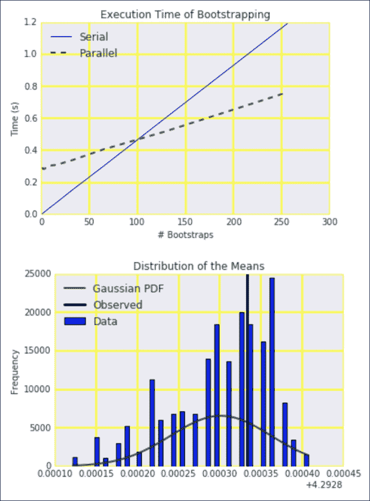
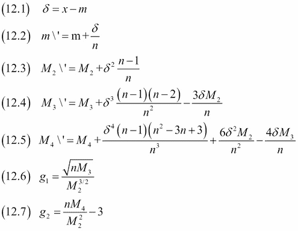
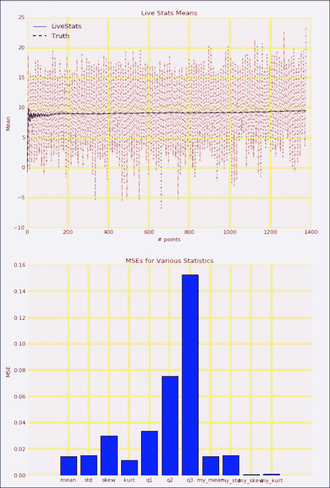
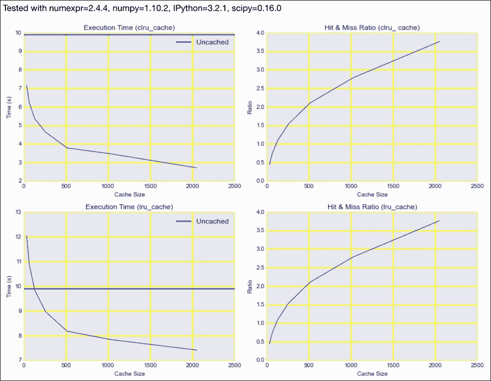
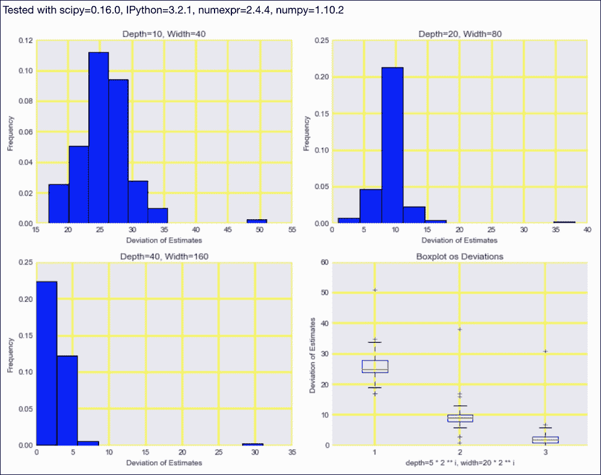

# 十二、并行性和性能

在本章中，我们将介绍以下食谱:

*   用 Numba 进行即时编译
*   用 Numexpr 加速数值表达式
*   使用`threading`模块运行多个线程
*   使用`concurrent.futures`模块启动多个任务
*   与`asyncio`模块异步访问资源
*   带`execnet`的分布式处理
*   分析内存使用情况
*   即时计算平均值、方差、偏斜度和峰度
*   使用最近最少使用的缓存进行缓存
*   缓存 HTTP 请求
*   使用最小计数草图进行流式计数
*   利用 OpenCL 开发图形处理器的能力

# 简介

1943 年至 1946 年间建造的 ENIAC，用一万八千根管子填满了一个大房间，拥有 20 位内存。从那以后，我们走过了漫长的道路。摩尔定律也预测了这种指数增长。当然，我们面对的是一个自我实现的预言还是一个基本现象，这很难说。据称，增长开始减速。

鉴于我们目前对技术、热力学和量子力学的了解，我们可以为摩尔定律设定硬性限制。然而，我们的假设可能是错误的；例如，科学家和工程师可能会想出从根本上更好的技术来制造芯片。(其中一个发展就是量子计算，目前还远未普及。)最大的障碍是散热，散热通常以 *kT* 为单位测量，K 为玻尔兹曼常数(约 10-23 J/K)，而 *T* 以开尔文为单位(冰点为 273.15 K)。一个芯片的每比特散热量至少为*kT*(350K 时为 10-20 J)。90 年代的半导体至少消耗了十万 *kT* 。计算系统在运行过程中会经历能量水平的变化。能量上最小的容许差大概是 100 *kT* 。即使我们设法避免了这种限制，我们也很快会在接近原子水平的水平上运行，由于量子力学的原因，这是不切实际的(关于粒子的信息从根本上是有限的)，除非我们谈论的是量子计算机。目前的共识是，我们将在几十年内达到极限。另一个考虑是芯片的复杂布线。复杂的布线大大降低了芯片的预期寿命。

本章是关于软件性能的；然而，还有其他更重要的软件方面，例如可维护性、健壮性和可用性。押注摩尔定律是有风险的，也是不现实的，因为我们还有其他提高性能的可能性。第一种选择是使用多台机器、单台机器上的内核、GPU 或其他专用硬件(如)尽可能并行地完成工作。例如，我正在八核机器上测试代码。作为一名学生，我有幸参与了一个以创建网格为目标的项目。网格被认为是将大学计算机聚集到一个单一的计算环境中。在后期，也有计划连接其他计算机，有点像 SETI 项目。(众所周知，很多办公电脑在周末和晚上都是闲置的，为什么不让它们也工作呢？)

当然，目前有各种各样的商业云系统，比如亚马逊和谷歌提供的。我不会讨论这些，因为我觉得这些是更专业的主题，尽管我在 *Python 数据分析*中确实介绍了一些 Python 特有的云系统。

提高性能的第二种方法是应用缓存，从而避免不必要的函数调用。我在[第 9 章](09.html "Chapter 9. Ensemble Learning and Dimensionality Reduction")、*集成学习和降维*中介绍了具有缓存功能的 joblib 库。Python 3 为我们带来了并行性和缓存的新特性。

第三种方法是靠近金属。众所周知，Python 是一种带有虚拟机和解释器的高级编程语言。Python 有一个额外的层，这是一种不同于 C 语言的语言。当我还是个学生的时候，我们被教导 C 是一种高级语言，以汇编和机器码为低级。据我所知，现在，几乎没有人用汇编语言编写代码。通过 Cython(包含在 *Python 数据分析*中)和类似的软件，我们可以编译我们的代码来获得与 C 和 C++相当的性能。编译是一件麻烦的事情，也是有问题的，因为它降低了平台依赖性带来的可移植性。一个常见的解决方案是使用 shell 脚本自动编译并生成文件。Numba 和其他类似的项目通过即时编译让生活变得更加容易，尽管有一些限制。

# 用 Numba 及时编译

Numba 软件使用特殊的函数装饰器执行即时编译。编译会自动生成本机机器代码。生成的代码可以在 CPU 和 GPU 上运行。Numba 的主要用例是使用 NumPy 数组的数学密集型代码。

我们可以用带有可选函数签名的`@numba.jit`装饰器(例如`int32(int32)`)编译代码。这些类型对应于相似的 NumPy 类型。Numba 在`nopython`和`object`模式下运行。`nopython`模式速度更快，但限制更多。我们也可以通过`nogil`选项释放 **全局解释器锁** ( **GIL** )。您可以通过使用`cache`参数请求文件缓存来缓存编译结果。

`@vectorize`装饰器将带有标量参数的函数转换成 NumPy ufuncs。向量化提供了额外的优势，例如自动广播，并且可以在单核、多核并行或 GPU 上使用。

## 做好准备

使用以下命令安装 Numba:

```py
$ pip/conda install numba

```

我用 Numba 0.22.1 测试了代码。

## 怎么做...

1.  进口情况如下:

    ```py
    from numba import vectorize
    from numba import jit
    import numpy as np
    ```

2.  定义以下功能来使用`@vectorize`装饰器:

    ```py
    @vectorize
    def vectorize_version(x, y, z):
        return x ** 2 + y ** 2 + z ** 2
    ```

3.  定义以下功能来使用`@jit`装饰器:

    ```py
    @jit(nopython=True)
    def jit_version(x, y, z):
        return x ** 2 + y ** 2 + z ** 2
    ```

4.  定义一些随机数组如下:

    ```py
    np.random.seed(36)
    x = np.random.random(1000)
    y = np.random.random(1000)
    z = np.random.random(1000)
    ```

5.  测量数组平方和所需的时间:

    ```py
    %timeit x ** 2 + y ** 2 + z ** 2
    %timeit vectorize_version(x, y, z)
    %timeit jit_version(x, y, z)
    jit_version.inspect_types()
    ```

最终结果参见以下截图:


代码在本书代码包的`compiling_numba.ipynb`文件中。

## 它是如何工作的

在我的机器上测得的最佳时间是 1.82 微秒，这比正常 Python 代码测得的时间快得多。在截图的最后，我们看到了编译的结果，最后一部分被省略了，因为它太长了，很难阅读。我们会收到警告，这很可能是由 CPU 缓存引起的。我是故意留下的，但是你可以使用不适合缓存的更大的数组来删除它们。

## 另见

*   http://numba.pydata.org/的 Numba 网站(2016 年 1 月检索)

# 用 Numexpr 加速数值表达式

Numexpr 是一个数值数组表达式求值的软件包，在你安装 pandas 的时候也安装了，你可能在其他菜谱的水印里看到过公布(用 Numexpr 2.3.1 测试过)。Numexpr 试图通过避免创建临时变量来加快计算速度，因为读取变量可能是一个潜在的瓶颈。对于无法容纳在中央处理器高速缓存中的数组，预计加速比最大。

Numexpr 将大数组分割成块，这些块可以放入缓存中，并且它还在可能的情况下并行使用多个内核。它有一个`evaluate()`函数，该函数接受简单表达式并对其求值(有关支持特性的完整列表，请参考文档)。

## 怎么做...

1.  进口情况如下:

    ```py
    import numexpr as ne
    import numpy as np
    ```

2.  生成随机数组，数组应该太大，无法保存在缓存中:

    ```py
    a = np.random.rand(1e6)
    b = np.random.rand(1e6)
    ```

3.  计算一个简单的算术表达式并测量执行时间:

    ```py
    %timeit 2 * a ** 3 + 3 * b ** 9
    %timeit ne.evaluate("2 * a ** 3 +3 * b ** 9 ")
    ```

有关最终结果，请参考以下屏幕截图:


代码在本书代码包的`speeding_numexpr.ipynb`文件中。

## 它是如何工作的

我们生成了不应该放在缓存中的随机数据，以避免缓存效应，因为这是 Numexpr 的最佳用例。缓存的大小因机器而异，因此如有必要，请为数组使用更大或更小的大小。在示例中，我们放入了一个包含简单算术表达式的字符串，尽管我们可以使用稍微复杂一点的表达式。有关更多详细信息，请参考文档。我用一台有八个内核的机器测试了代码。加速比大于八倍，所以这显然是由于 Numexpr。

## 另见

*   https://pypi.python.org/pypi/numexpr 的 Numexpr 网站(2016 年 1 月检索)

# 用线程模块运行多个线程

计算机进程是正在运行的程序的一个实例。进程实际上是重量级的，所以我们可能更喜欢线程，线程更轻。事实上，线程通常只是进程的子单元。进程是相互分离的，而线程可以共享指令和数据。

操作系统通常为每个内核分配一个线程(如果有多个)，或者定期在线程之间切换；这叫 **时间切片**。线程作为进程可以有不同的优先级，操作系统有后台运行的守护线程，优先级非常低。

线程之间的切换比进程之间的切换更容易；但是，由于线程共享信息，因此使用起来更加危险。例如，如果多个线程能够同时增加一个计数器，这将使代码不确定，并且可能不正确。最小化风险的一种方法是确保一次只有一个线程可以访问共享变量或共享函数。这个策略在 Python 中实现为 GIL。

## 怎么做...

1.  进口情况如下:

    ```py
    import dautil as dl
    import ch12util
    from functools import partial
    from queue import Queue
    from threading import Thread
    import matplotlib.pyplot as plt
    import numpy as np
    from scipy.stats import skew
    from IPython.display import HTML

    STATS = []
    ```

2.  定义以下功能重新采样:

    ```py
    def resample(arr):
        sample = ch12util.bootstrap(arr)
        STATS.append((sample.mean(), sample.std(), skew(sample)))
    ```

3.  定义以下要引导的类:

    ```py
    class Bootstrapper(Thread):
        def __init__(self, queue, data):
            Thread.__init__(self)
            self.queue = queue
            self.data = data
            self.log = dl.log_api.conf_logger(__name__)

        def run(self):
            while True:
                index = self.queue.get()

                if index % 10 == 0:
                    self.log.debug('Bootstrap {}'.format(
                        index))

                resample(self.data)
                self.queue.task_done()
    ```

4.  定义以下函数来执行串行重采样:

    ```py
    def serial(arr, n):
        for i in range(n):
            resample(arr)
    ```

5.  定义以下函数执行并行重采样:

    ```py
    def threaded(arr, n):
        queue = Queue()

        for x in range(8):
            worker = Bootstrapper(queue, arr)
            worker.daemon = True
            worker.start()

        for i in range(n):
            queue.put(i)

        queue.join()
    ```

6.  绘制时刻分布和执行时间:

    ```py
    sp = dl.plotting.Subplotter(2, 2, context)
    temp = dl.data.Weather.load()['TEMP'].dropna().values
    np.random.seed(26)
    threaded_times = ch12util.time_many(partial(threaded, temp))
    serial_times = ch12util.time_many(partial(serial, temp))

    ch12util.plot_times(sp.ax, serial_times, threaded_times)

    stats_arr = np.array(STATS)
    ch12util.plot_distro(sp.next_ax(), stats_arr.T[0], temp.mean())
    sp.label()

    ch12util.plot_distro(sp.next_ax(), stats_arr.T[1], temp.std())
    sp.label()

    ch12util.plot_distro(sp.next_ax(), stats_arr.T[2], skew(temp))
    sp.label()

    HTML(sp.exit())
    ```

有关最终结果，请参考以下屏幕截图:


代码在本书的代码包中的 `running_threads.ipynb`文件中。

## 另见

*   https://docs.python.org/3/library/threading.htmlPython 线程文档(2016 年 1 月检索)

# 用并发期货模块启动多个任务

`concurrent.futures`模块是一个 Python 模块，我们可以用它异步执行可调用的东西。如果您熟悉 Java 并浏览该模块，您会注意到与等效 Java API 的一些相似之处，例如类名和体系结构。根据 Python 文档，这不是巧合。

在这种情况下，任务是一个独立的工作单元。例如，打印文档可以被认为是一项任务，但通常我们会考虑更小的任务，例如添加两个数字。

## 怎么做...

1.  进口情况如下:

    ```py
    import dautil as dl
    import ch12util
    from functools import partial
    import matplotlib.pyplot as plt
    import numpy as np
    from scipy.stats import skew
    import concurrent.futures
    from IPython.display import HTML

    STATS = []
    ```

2.  定义以下函数进行重采样:

    ```py
    def resample(arr):
        sample = ch12util.bootstrap(arr)
        STATS.append((sample.mean(), sample.std(), skew(sample)))
    ```

3.  定义以下要引导的类:

    ```py
    class Bootstrapper():
        def __init__(self, data):
            self.data = data
            self.log = dl.log_api.conf_logger(__name__)

        def run(self, index):
            if index % 10 == 0:
                self.log.debug('Bootstrap {}'.format(
                    index))

            resample(self.data)
    ```

4.  定义以下函数来执行串行重采样:

    ```py
    def serial(arr, n):
        for i in range(n):
            resample(arr)
    ```

5.  定义以下函数执行并行重采样:

    ```py
    def parallel(arr, n):
        executor = concurrent.futures.ThreadPoolExecutor(max_workers=8)
        bootstrapper = Bootstrapper(arr)

        for x in executor.map(bootstrapper.run, range(n)):
            pass

        executor.shutdown()
    ```

6.  绘制时刻分布和执行时间:

    ```py
    rain = dl.data.Weather.load()['RAIN'].dropna().values
    np.random.seed(33)
    parallel_times = ch12util.time_many(partial(parallel, rain))
    serial_times = ch12util.time_many(partial(serial, rain))

    sp = dl.plotting.Subplotter(2, 2, context)
    ch12util.plot_times(sp.ax, serial_times, parallel_times)

    STATS = np.array(STATS)
    ch12util.plot_distro(sp.next_ax(), STATS.T[0], rain.mean())
    sp.label()

    ch12util.plot_distro(sp.next_ax(), STATS.T[1], rain.std())
    sp.label()

    ch12util.plot_distro(sp.next_ax(), STATS.T[2], skew(rain))
    sp.label()
    HTML(sp.exit())
    ```

有关最终结果，请参考以下屏幕截图:


代码在本书的代码包中的 `launching_futures.ipynb`文件中。

## 另见

*   [https://docs.python.org/3/library/concurrent.futures.html](https://docs.python.org/3/library/concurrent.futures.html)的模块文档(2016 年 1 月检索)

# 与异步模块异步访问资源

输入/输出(例如，文件或数据库访问)缓慢是生活中的一个基本事实。I/O 不仅慢，而且不可预测。在一个常见的场景中，我们等待数据(来自 web 服务或传感器)并将数据写入文件系统或数据库。在这种情况下，我们会发现自己受到输入/输出的限制，花费更多的时间等待数据，而不是实际处理数据。我们可以定期轮询数据或触发事件(检查您的手表或设置警报)。图形用户界面通常有特殊的线程，在无限循环中等待用户输入。

异步输入输出的 Python `asyncio`模块使用了**的概念，并通过相关的函数装饰器来协调**。在[第 5 章](05.html "Chapter 5. Web Mining, Databases, and Big Data")、*网络挖掘、数据库和大数据*的*刮网*配方中也给出了该模块的一个简单示例。子程序可以看作是协同程序的一个特例。一个子例程有一个开始和结束点，要么通过一个返回语句提前结束，要么到达子例程定义的末尾。相比之下，一个协同程序可以通过调用另一个协同程序，然后从该退出点恢复执行，来产生`yield from`语句。可以说，科罗廷正在让另一个科罗廷接管，并回到睡眠状态，直到它再次被激活。

子程序可以放在一个堆栈上。然而，协同程序需要多个堆栈，这使得理解代码和潜在的异常更加复杂。

## 怎么做...

代码在本书代码包的`accessing_asyncio.ipynb`文件中:

1.  进口情况如下:

    ```py
    import dautil as dl
    import ch12util
    from functools import partial
    import matplotlib.pyplot as plt
    import numpy as np
    from scipy.stats import skew
    import asyncio
    import time
    from IPython.display import HTML

    STATS = []
    ```

2.  定义以下函数进行重采样:

    ```py
    def resample(arr):
        sample = ch12util.bootstrap(arr)
        STATS.append((sample.mean(), sample.std(), skew(sample)))
    ```

3.  定义以下要引导的类:

    ```py
    class Bootstrapper():
        def __init__(self, data, queue):
            self.data = data
            self.log = dl.log_api.conf_logger(__name__)
            self.queue = queue

        @asyncio.coroutine
        def run(self):
            while not self.queue.empty():
                index = yield from self.queue.get()

                if index % 10 == 0:
                    self.log.debug('Bootstrap {}'.format(
                        index))

                resample(self.data)
                # simulates slow IO
                yield from asyncio.sleep(0.01)
    ```

4.  定义以下功能执行串行重采样:

    ```py
    def serial(arr, n):
        for i in range(n):
            resample(arr)
            # simulates slow IO
            time.sleep(0.01)
    ```

5.  定义以下函数执行并行重采样:

    ```py
    def parallel(arr, n):
        q = asyncio.Queue()

        for i in range(n):
            q.put_nowait(i)

        bootstrapper = Bootstrapper(arr, q)
        policy = asyncio.get_event_loop_policy()
        policy.set_event_loop(policy.new_event_loop())
        loop = asyncio.get_event_loop()

        tasks = [asyncio.async(bootstrapper.run())
                 for i in range(n)]

        loop.run_until_complete(asyncio.wait(tasks))
        loop.close()
    ```

6.  绘制力矩和执行时间的分布:

    ```py
    pressure = dl.data.Weather.load()['PRESSURE'].dropna().values
    np.random.seed(33)
    parallel_times = ch12util.time_many(partial(parallel, pressure))
    serial_times = ch12util.time_many(partial(serial, pressure))

    dl.options.mimic_seaborn()
    ch12util.plot_times(plt.gca(), serial_times, parallel_times)

    sp = dl.plotting.Subplotter(2, 2, context)
    ch12util.plot_times(sp.ax, serial_times, parallel_times)

    STATS = np.array(STATS)
    ch12util.plot_distro(sp.next_ax(), STATS.T[0], pressure.mean())
    sp.label()

    ch12util.plot_distro(sp.next_ax(), STATS.T[1], pressure.std())
    sp.label()

    ch12util.plot_distro(sp.next_ax(), STATS.T[2], skew(pressure))
    sp.label()
    HTML(sp.exit())
    ```

最终结果参见下面的截图:


## 另见

*   位于[https://docs.python.org/3/library/asyncio.html](https://docs.python.org/3/library/asyncio.html)的`asyncio`模块的文档(2016 年 1 月检索)
*   https://en.wikipedia.org/wiki/Coroutine 相关维基百科页面(2016 年 1 月检索)

# 使用 execnet 进行分布式处理

`execnet`模块采用无共享模式，使用**通道**进行通信。这个上下文中的通道是用于在(分布式)计算机进程之间发送和接收消息的软件抽象。`execnet`最适用于将异构计算环境与不同的 Python 解释器和安装的软件相结合。这些环境可以有不同的操作系统和 Python 实现(CPython、Jython、pypypy 或其他)。

在 **无共享架构**中，计算节点不共享内存或文件。因此，该架构是完全分散的，具有完全独立的节点。明显的优势是我们不依赖任何一个节点。

## 做好准备

使用以下命令安装 execnet:

```py
$ pip/conda install execnet 

```

我用 execnet 1.3.0 测试了代码。

## 怎么做...

1.  进口情况如下:

    ```py
    import dautil as dl
    import ch12util
    from functools import partial
    import matplotlib.pyplot as plt
    import numpy as np
    import execnet

    STATS = []
    ```

2.  定义以下助手函数:

    ```py
    def run(channel, data=[]):
        while not channel.isclosed():
            index = channel.receive()

            if index % 10 == 0:
                print('Bootstrap {}'.format(
                    index))

            total = 0

            for x in data:
                total += x

            channel.send((total - data[index])/(len(data) - 1))
    ```

3.  定义以下函数来执行串行重采样:

    ```py
    def serial(arr, n):
        for i in range(n):
            total = 0

            for x in arr:
                total += x

            STATS.append((total - arr[i])/(len(arr) - 1))
    ```

4.  定义以下函数执行并行重采样:

    ```py
    def parallel(arr, n):
        gw = execnet.makegateway()
        channel = gw.remote_exec(run, data=arr.tolist())

        for i in range(n):
            channel.send(i)
            STATS.append(channel.receive())

        gw.exit()
    ```

5.  绘制平均值和执行时间的分布:

    ```py
    ws = dl.data.Weather.load()['WIND_SPEED'].dropna().values
    np.random.seed(33)
    parallel_times = ch12util.time_many(partial(parallel, ws))
    serial_times = ch12util.time_many(partial(serial, ws))

    %matplotlib inline
    dl.options.mimic_seaborn()
    ch12util.plot_times(plt.gca(), serial_times, parallel_times)
    plt.legend(loc='best')

    plt.figure()
    STATS = np.array(STATS)
    ch12util.plot_distro(plt.gca(), STATS, ws.mean())
    plt.title('Distribution of the Means')
    plt.legend(loc='best')
    ```

有关最终结果，请参考以下屏幕截图:



代码在书的代码包中的`distributing_execnet.ipynb`文件中。

## 另见

*   http://codespeak.net/execnet/的 execnet 网站(2016 年 1 月检索)
*   https://en.wikipedia.org/wiki/Shared_nothing_architecture 的相关维基百科页面(2016 年 1 月检索)

# 分析内存使用情况

在 *Python 数据分析*中，我们使用了各种分析工具。这些工具主要与测量执行时间有关。然而，记忆也很重要，尤其是当我们没有足够的记忆时。**内存泄漏** 是计算机程序的常见问题，我们可以通过执行内存分析来发现。当我们不释放不需要的内存时，就会发生泄漏。当我们使用需要比我们需要更多内存的数据类型时，也可能会出现问题，例如，整数数组就可以使用 NumPy `float64`数组。

Python `memory_profiler`模块可以逐行剖析代码的内存使用情况。安装后，您还可以通过各种神奇的命令在 IPython 笔记本中使用该模块。该模块通过与操作系统通信来工作。在 Windows 上，您将需要 Python `psutil`包进行通信。

## 做好准备

用以下命令安装`memory_profiler`:

```py
$ pip install memory-profiler 

```

我用 memory_profiler 0.39 测试了代码。

创建一个脚本进行分析(参见本书代码包中的`mem_test.py`文件):

```py
import numpy as np

def test_me():
    a = np.random.random((999, 99))
    b = np.random.random((99, 99))
    a.ravel()
    b.tolist()
```

## 怎么做...

1.  进口情况如下:

    ```py
    import dautil as dl
    from mem_test import test_me
    ```

2.  按如下方式加载 IPython 扩展:

    ```py
    %load_ext memory_profiler
    ```

3.  使用以下命令逐行剖析测试脚本:

    ```py
    %mprun -f test_me test_me()
    ```

有关最终结果，请参考以下屏幕截图:


代码在本书的代码包中的 `profiling_memory.ipynb`文件中。

## 另见

*   [https://pypi.python.org/pypi/memory_profiler](https://pypi.python.org/pypi/memory_profiler)的 memory_profiler 网站(2016 年 1 月检索)

# 即时计算平均值、方差、偏斜度和峰度

均值、方差、偏斜度和峰度是统计学中的重要量。一些计算涉及平方的和，对于大的值可能导致溢出。为了避免精度的损失，我们必须认识到方差在偏移某个常数时是不变的。

当我们在内存中有足够的空间时，我们可以直接计算力矩，必要时考虑数值问题。然而，我们可能不想将数据保存在内存中，因为它很多，或者因为它更便于计算飞行中的时刻。

一个在线和数值稳定的算法来计算方差已经提供了特里贝里(特里贝里，蒂莫西(2007)，*计算高阶矩在线*)。我们将把这个算法与`LiveStats`模块中的实现进行比较，尽管它不是最好的算法。如果你对改进的算法感兴趣，看看*中列出的维基百科页面，也可以参见*部分。

看看下面的等式:



偏斜度由 12.6 给出，峰度由 12.7 给出。

## 做好准备

使用以下命令安装 LiveStats:

```py
$ pip install LiveStats 

```

我用 LiveStats 1.0 测试了代码。

## 怎么做...

1.  进口情况如下:

    ```py
    from livestats import livestats
    from math import sqrt
    import dautil as dl
    import numpy as np
    from scipy.stats import skew
    from scipy.stats import kurtosis
    import matplotlib.pyplot as plt
    ```

2.  定义以下函数来实现力矩计算的方程:

    ```py
    # From https://en.wikipedia.org/wiki/
    # Algorithms_for_calculating_variance
    def online_kurtosis(data):
        n = 0
        mean = 0
        M2 = 0
        M3 = 0
        M4 = 0
        stats = []

        for x in data:
            n1 = n
            n = n + 1
            delta = x - mean
            delta_n = delta / n
            delta_n2 = delta_n ** 2
            term1 = delta * delta_n * n1
            mean = mean + delta_n
            M4 = M4 + term1 * delta_n2 * (n**2 - 3*n + 3) + \
                6 * delta_n2 * M2 - 4 * delta_n * M3
            M3 = M3 + term1 * delta_n * (n - 2) - 3 * delta_n * M2
            M2 = M2 + term1
            s = sqrt(n) * M3 / sqrt(M2 ** 3)
            k = (n*M4) / (M2**2) - 3
            stats.append((mean, sqrt(M2/(n - 1)), s, k))

        return np.array(stats)
    ```

3.  初始化并加载数据如下:

    ```py
    test = livestats.LiveStats([0.25, 0.5, 0.75])

    data = dl.data.Weather.load()['TEMP'].\
        resample('M').dropna().values
    ```

4.  用 LiveStats 计算各种统计，上节提到的算法，和对比一下我们一次对所有数据应用 NumPy 函数时的结果:

    ```py
    ls = []
    truth = []

    test.add(data[0])

    for i in range(1, len(data)):
        test.add(data[i])
        q1, q2, q3 = test.quantiles()

        ls.append((test.mean(), sqrt(test.variance()),
                  test.skewness(), test.kurtosis(), q1[1], q2[1], q3[1]))
        slice = data[:i]
        truth.append((slice.mean(), slice.std(),
                      skew(slice), kurtosis(slice),
                      np.percentile(slice, 25), np.median(slice),
                      np.percentile(slice, 75)))

    ls = np.array(ls)
    truth = np.array(truth)
    ok = online_kurtosis(data)
    ```

5.  将结果绘制为如下:

    ```py
    dl.options.mimic_seaborn()
    cp = dl.plotting.CyclePlotter(plt.gca())
    cp.plot(ls.T[0], label='LiveStats')
    cp.plot(truth.T[0], label='Truth')
    cp.plot(data)
    plt.title('Live Stats Means')
    plt.xlabel('# points')
    plt.ylabel('Mean')
    plt.legend(loc='best')

    plt.figure()

    mses = [dl.stats.mse(truth.T[i], ls.T[i])
            for i in range(7)]
    mses.extend([dl.stats.mse(truth.T[i], ok[1:].T[i])
                 for i in range(4)])
    dl.plotting.bar(plt.gca(),
                    ['mean', 'std', 'skew', 'kurt',
                     'q1', 'q2', 'q3',
                     'my_mean', 'my_std', 'my_skew', 'my_kurt'], mses)
    plt.title('MSEs for Various Statistics')
    plt.ylabel('MSE')
    ```

最终结果参见以下截图:



代码在本书的代码包中的 `calculating_moments.ipynb`文件中。

## 另见

*   位于 https://bitbucket.org/scassidy/livestats 的 LiveStats 网站(2016 年 1 月检索)
*   相关维基百科页面位于(2016 年 1 月检索)

# 使用最近最少使用的缓存进行缓存

**缓存**包括将结果(通常来自函数调用)存储在内存或磁盘上。如果操作正确，缓存有助于减少函数调用的次数。一般来说，出于空间原因，我们希望保持缓存较小。如果我们能够在缓存中找到项目，我们就谈论命中；否则，我们会有失误。显然，我们希望有尽可能多的命中和尽可能少的失误。这意味着我们希望最大化命中率。

缓存算法有很多，其中我们将介绍最近最少使用的**(**LRU**)算法。该算法跟踪缓存项何时被使用。如果缓存即将超过其最大指定大小，LRU 会删除最近最少使用的项目。理由是这些项目可能更古老，因此不再相关。LRU 有几种变体。其他算法则相反——删除最近的项目、最不常用的项目或随机项目。**

标准的 Python 库有一个 LRU 的实现，但也有一个专门的 Python 库，其中一些部分用 C 实现，因此它可能更快。我们将使用 NLTK `lemmatize()`方法比较两种实现(参考[第 8 章](08.html "Chapter 8. Text Mining and Social Network Analysis")、*文本挖掘和社交网络分析*中的*词干、引理、过滤和 TF-IDF 评分*方法)。

## 做好准备

按照以下步骤安装 fastcache:

```py
$ pip/conda install fastcache

```

我用 fastcache 1.0.2 测试了代码。

## 怎么做...

1.  进口情况如下:

    ```py
    from fastcache import clru_cache
    from functools import lru_cache
    from nltk.corpus import brown
    from nltk.stem import WordNetLemmatizer
    import dautil as dl
    import numpy as np
    from IPython.display import HTML
    ```

2.  定义以下函数进行缓存:

    ```py
    def lemmatize(word, lemmatizer):
        return lemmatizer.lemmatize(word.lower())
    ```

3.  定义以下函数来衡量缓存的效果:

    ```py
    def measure(impl, words, lemmatizer):
        cache = dl.perf.LRUCache(impl, lemmatize)
        times = []
        hm = []

        for i in range(5, 12):
            cache.maxsize = 2 ** i
            cache.cache()
            with dl.perf.StopWatch() as sw:
                _ = [cache.cached(w, lemmatizer) for w in words]

            hm.append(cache.hits_miss())
            times.append(sw.elapsed)
            cache.clear()

        return (times, hm)
    ```

4.  初始化一个单词列表和一个 NLTK `WordNetLemmatizer`对象:

    ```py
    words = [w for w in brown.words()]
    lemmatizer = WordNetLemmatizer()
    ```

5.  测量执行时间如下:

    ```py
    with dl.perf.StopWatch() as sw:
        _ = [lemmatizer.lemmatize(w.lower()) for w in words]

    plain = sw.elapsed

    times, hm = measure(clru_cache, words, lemmatizer)
    ```

6.  绘制不同缓存大小的结果:

    ```py
    sp = dl.plotting.Subplotter(2, 2, context)
    sp.ax.plot(2 ** np.arange(5, 12), times)
    sp.ax.axhline(plain, lw=2, label='Uncached')
    sp.label()

    sp.next_ax().plot(2 ** np.arange(5, 12), hm)
    sp.label()

    times, hm = measure(lru_cache, words, lemmatizer)
    sp.next_ax().plot(2 ** np.arange(5, 12), times)
    sp.ax.axhline(plain, lw=2, label='Uncached')
    sp.label()

    sp.next_ax().plot(2 ** np.arange(5, 12), hm)
    sp.label()
    HTML(sp.exit())
    ```

最终结果参见以下截图:



代码在本书代码包的`caching_lru.ipynb`文件中。

## 另见

*   http://en.wikipedia.org/wiki/Cache_algorithms 相关维基百科页面(2016 年 1 月检索)
*   https://pypi.python.org/pypi/fastcache 的 fastcache 网站(2016 年 1 月检索)
*   [https://docs . python . org/3/library/func tools . html # func tools . LRU _ cache](https://docs.python.org/3/library/functools.html#functools.lru_cache)的`functools.lru_cache`文档(2016 年 1 月检索)

# 缓存 HTTP 请求

有时，数据可以通过 HTTP 上的网络服务获得。这样做的好处是，我们不必太在意发送方使用的技术。例如，这与电子邮件的工作方式类似。然而，我们必须通过 HTTP GET(通常)或 HTTP POST(按照惯例大写)方法显式地请求信息。每当我们请求一个网页或下载一个文件时，我们通常会执行一个 GET 请求。另一端的 web 服务器必须处理该请求。如果有很多请求，我们可能会降低服务器的速度，因此组织通常会采取措施来防止这种情况。这可能意味着您的进一步请求将被阻止。

出于效率原因，避免多次发出相同的请求也是有利的。网络浏览器用缓存解决了这个问题，我们可以用`requests-cache`包做同样的事情。默认情况下，缓存存储在 SQLite 数据库中。

我们将不涉及的一个常见用例是用 HTTP 定期检索信息。显然，如果没有任何变化，我们不想检索内容。HTTP 协议提供了确定内容是否被修改的有效机制。但是，web 服务器不需要报告内容更改。

## 做好准备

使用以下命令安装请求缓存:

```py
$ pip install --upgrade requests-cache 

```

我用请求测试了代码——缓存 0.4.10。

## 怎么做...

1.  进口情况如下:

    ```py
    import requests
    import requests_cache
    ```

2.  安装缓存(这将默认创建一个 SQLite 数据库):

    ```py
    requests_cache.install_cache()
    ```

3.  请求建立缓存的网站:

    ```py
    %time requests.get('http://google.com')
    ```

4.  请求现在应该来自本地缓存的相同网站:

    ```py
    %time requests.get('http://google.com')
    ```

5.  清除缓存如下:

    ```py
    requests_cache.clear()
    ```

6.  再次请求网站(缓存现在应该是空的):

    ```py
    %time requests.get('http://google.com')
    ```

有关最终结果，请参考以下屏幕截图:


代码在本书代码包的 `caching_requests.ipynb`文件中。

## 另见

*   https://en.wikipedia.org/wiki/HTTP_ETag 相关维基百科页面(2016 年 1 月检索)
*   https://pypi.python.org/pypi/requests-cache 的请求缓存网站(2016 年 1 月检索)

# 使用最小计数草图进行流式计数

流式或在线算法很有用，因为它们不需要像其他算法那样多的内存和处理能力。本章有一个在线计算统计矩的方法(参考*即时计算平均值、方差、偏斜度和峰度*)。

此外，在[第 5 章](05.html "Chapter 5. Web Mining, Databases, and Big Data")、*网络挖掘、数据库和大数据*的*用 Spark* 配方聚类流数据中，我介绍了另一种流算法。

由于基本原因或舍入误差，流算法通常是近似的。因此，如果可能的话，你应该尝试使用其他算法。当然，在许多情况下，近似结果已经足够好了。例如，一个用户在社交媒体网站上有 500 或 501 个连接并不重要。如果你只是发送成千上万的邀请，你迟早会到达那里。

素描是你可能从绘画中知道的东西。在这种情况下，素描意味着勾勒出没有任何细节的物体的大致轮廓。类似的概念存在于流算法的世界中。

在这个食谱中，我涵盖了格雷厄姆·科尔莫和 s .穆图·穆图克里希南(S. Muthu Muthukrishnan)的*计数-min 草图* (2003 年)，这在排名的上下文中很有用。例如，我们可能想知道新闻网站上浏览次数最多的文章、热门话题、点击次数最多的广告或联系最多的用户。天真的方法需要在字典或表格中记录每个条目的数量。字典使用散列函数来计算作为关键字的识别整数。出于理论上的原因，我们可能会有冲突——这意味着两个或多个项目有相同的密钥。Count-min 草图是一个二维表格数据结构，它很小，并且对每一行都使用散列函数。它容易发生碰撞，导致过度安装。

当事件发生时，例如有人观看广告，我们会执行以下操作:

1.  对于草图中的每一行，我们应用相关的散列函数，例如，使用广告标识符来获得列索引。
2.  递增与行和列对应的值。

每个事件都清晰地映射到草图中的每一行。当我们请求计数时，我们遵循相反的路径来获得多个计数。最低计数给出了该项目的估计计数。

这种设置背后的想法是，频繁项目可能会主导不太常见的项目。热门物品与冷门物品碰撞的概率大于热门物品之间的碰撞概率。

## 怎么做...

1.  进口情况如下:

    ```py
    from nltk.corpus import brown
    from nltk.corpus import stopwords
    import dautil as dl
    from collections import defaultdict
    import matplotlib.pyplot as plt
    import numpy as np
    from IPython.display import HTML
    ```

2.  将 NLTK Brown 和 stop 单词语料库的单词存储在列表中:

    ```py
    words_dict = dl.collect.IdDict()
    dd = defaultdict(int)
    fid = brown.fileids(categories='news')[0]
    words = brown.words(fid)
    sw = set(stopwords.words('english'))
    ```

3.  计算每个停止字的出现次数:

    ```py
    for w in words:
        if w in sw:
            dd[w] += 1
    ```

4.  绘制最小计数草图各种参数的计数误差分布:

    ```py
    sp = dl.plotting.Subplotter(2, 2, context)
    actual = np.array([dd[w] for w in sw])
    errors = []

    for i in range(1, 4):
        cm = dl.perf.CountMinSketch(depth=5 * 2 ** i,
                                    width=20 * 2 ** i)

        for w in words:
            cm.add(words_dict.add_or_get(w.lower()))

        estimates = np.array([cm.estimate_count(words_dict.add_or_get(w))
                            for w in sw])
        diff = estimates - actual
        errors.append(diff)

        if i > 1:
            sp.next_ax()

        sp.ax.hist(diff, normed=True,
                bins=dl.stats.sqrt_bins(actual))
        sp.label()

    sp.next_ax().boxplot(errors)
    sp.label()
    HTML(sp.exit())
    ```

有关最终结果，请参考以下屏幕截图:



代码在本书代码包的 `stream_demo.py`文件中。

## 另见

*   https://en.wikipedia.org/wiki/Count%E2%80%93min_sketch 相关维基百科页面(2016 年 1 月检索)

# 利用 OpenCL 利用图形处理器的能力

**开放计算语言** ( **OpenCL** )最初由苹果公司(Apple Inc .)开发，是一个开放的程序技术标准，可以在各种设备上运行，包括在商品硬件上可用的 CPU 和 GPU，比如我用于这个配方的机器。自 2009 年以来，OpenCL一直由 Khronos 计算工作组维护。许多硬件厂商，包括我比较喜欢的厂商，都有 OpenCL 的实现。

OpenCL 是一种类似 C 的语言(实际上有多种 C 语言方言或版本)，其功能称为 **内核**。内核可以在多个处理元件上并行运行。硬件供应商给出了处理元素的定义。OpenCL 程序是为了可移植性而在运行时编译的。

可移植性是 OpenCL 相对于类似技术(如作为 NVIDIA 产品的 CUDA)的最大优势。另一个优势是能够在中央处理器、图形处理器和其他设备之间共享工作。有人建议使用机器学习来优化分工。

皮奥尼塔斯可以用 PyOpenCL 包编写 OpenCL 程序。PyOpenCL 向 Python 异常添加了额外的功能，例如对象清理和错误转换。许多其他库使用并在某些方面增强了 pyoppencl(请参考 pyoppencl 文档)。

## 做好准备

使用以下命令安装`pyopencl` :

```py
$ pip install pyopencl 

```

我用 PyOpenCL 2015.2.3 测试了代码。更多信息请参考[https://wiki.tiker.net/OpenCLHowTo](https://wiki.tiker.net/OpenCLHowTo)。

## 怎么做...

代码在本书代码包的`opencl_demo.ipynb`文件中:

1.  进口情况如下:

    ```py
    import pyopencl as cl
    from pyopencl import array
    import numpy as np
    ```

2.  定义以下函数来接受 NumPy 数组并执行简单的计算:

    ```py
    def np_se(a, b):
        return (a - b) ** 2
    ```

3.  定义以下函数，使用 OpenCL 进行与上一步相同的计算:

    ```py
    def gpu_se(a, b, platform, device, context, program):
    ```

4.  创建一个队列，启用概要分析(仅用于演示)和缓冲区，以便在

    ```py
        queue = cl.CommandQueue(context,
                                properties=cl.command_queue_properties.
                                PROFILING_ENABLE)
        mem_flags = cl.mem_flags
        a_buf = cl.Buffer(context,
                          mem_flags.READ_ONLY | mem_flags.COPY_HOST_PTR,
                          hostbuf=a)
        b_buf = cl.Buffer(context,
                          mem_flags.READ_ONLY | mem_flags.COPY_HOST_PTR, hostbuf=b)
        error = np.empty_like(a)
        destination_buf = cl.Buffer(context,
                                    mem_flags.WRITE_ONLY,
                                    error.nbytes)
    ```

    周围洗牌
5.  执行 OpenCL 程序并分析代码:

    ```py
        exec_evt = program.mean_squared_error(queue, error.shape, None,
                                              a_buf, b_buf, destination_buf)
        exec_evt.wait()
        elapsed = 1e-9*(exec_evt.profile.end - exec_evt.profile.start)

        print("Execution time of OpenCL: %g s" % elapsed)

        cl.enqueue_copy(queue,
                        error, destination_buf)

        return error
    ```

6.  生成随机数据如下:

    ```py
    np.random.seed(51)
    a = np.random.rand(4096).astype(np.float32)
    b = np.random.rand(4096).astype(np.float32)
    ```

7.  访问中央处理器和图形处理器。这部分依赖于硬件，所以您可能需要更改这些行:

    ```py
    platform = cl.get_platforms()[0]
    device = platform.get_devices()[2]
    context = cl.Context([device])
    ```

8.  用 OpenCL 语言定义一个内核:

    ```py
    program = cl.Program(context, """
        __kernel void mean_squared_error(__global const float *a,
        __global const float *b, __global float *result)
        {
            int gid = get_global_id(0);
            float temp = a[gid] - b[gid];
            result[gid] =  temp * temp;
        }
            """).build()
    ```

9.  用 NumPy 和 OpenCL (GPU)计算平方误差，并测量执行时间:

    ```py
    gpu_error = gpu_se(a, b, platform, device, context, program)

    np_error = np_se(a, b)
    print('GPU error', np.mean(gpu_error))
    print('NumPy error', np.mean(np_error))
    %time np_se(a, b)
    ```

有关最终结果，请参考以下屏幕截图:


## 另见

*   位于[http://documen.tician.de/pyopencl/](http://documen.tician.de/pyopencl/)的 PyOpenCL 网站(2016 年 1 月检索)