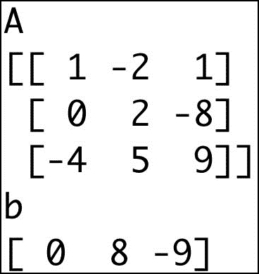
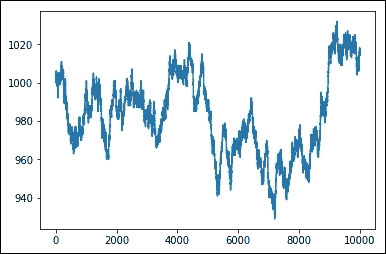
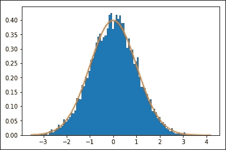
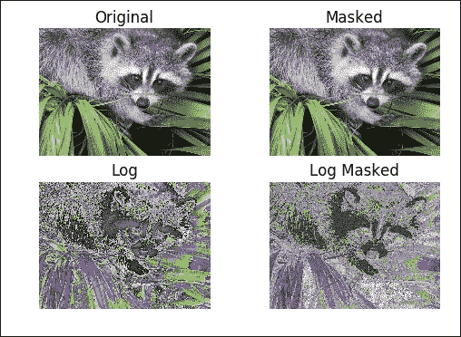
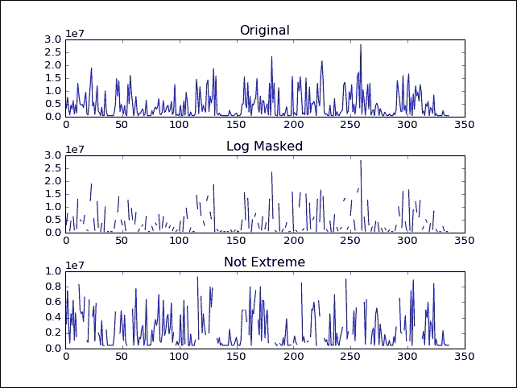

# 第四章。统计学和线性代数

统计学和线性代数为探索性数据分析奠定了基础。两种主要的统计方法，描述性的和推断性的，都有助于从原始数据中获得见解和做出推断。例如，我们可以计算出一个变量的数据有一定的算术平均值和标准偏差。从这些数字中，我们可以推断出这个变量的范围和期望值。然后，我们可以运行统计测试来检查我们得出正确结论的可能性有多大。

线性代数关注的是线性方程组。使用`linalg`包，用 NumPy 和 SciPy 很容易解决这些问题。例如，线性代数对于将数据拟合到模型中是有用的。我们将在本章中介绍用于随机数生成和屏蔽数组的其他 NumPy 和 SciPy 包。

在本章中，我们将涵盖以下主题:

*   NumPy 的基本描述性统计
*   带有 NumPy 的 Linera 代数
*   用 NumPy 求特征值和特征向量
*   随机数
*   创建数字掩码数组

# 用 NumPy 进行基本描述性统计

在本书中，我们将尝试使用尽可能多的不同数据集。这取决于数据的可用性。不幸的是，这意味着数据的主题可能与你的兴趣不完全匹配。每个数据集都有自己的怪癖，但是你在本书中获得的一般技能应该转移到你自己的领域。在本章中，我们将把`statsmodels`库中的数据集加载到 NumPy 数组中，以便对数据进行分析。

莫纳罗亚公司 <sub>2</sub> 测量是我们将从`statsmodels`数据集包中使用的第一个数据集。以下代码加载数据集并打印基本的描述性统计值:

```py
import numpy as np
from scipy.stats import scoreatpercentile
import pandas as pd

data = pd.read_csv("co2.csv", index_col=0, parse_dates=True) 
co2 = np.array(data.co2) 

print("The statistical values for amounts of co2 in atmosphere: \n") 
print("Max method", co2.max()) 
print("Max function", np.max(co2)) 

print("Min method", co2.min()) 
print("Min function", np.min(co2)) 

print("Mean method", co2.mean()) 
print("Mean function", np.mean(co2)) 

print("Std method", co2.std()) 
print("Std function", np.std(co2)) 

print("Median", np.median(co2)) 
print("Score at percentile 50", scoreatpercentile(co2, 50))
```

前面的代码计算 NumPy 数组的平均值、中值、最大值、最小值和标准偏差。

### 注

如果这些术语听起来不熟悉，请花些时间从维基百科或任何其他来源了解它们。如*前言*所述，我们将假设您熟悉基本的数学和统计概念。

数据来自`statsmodels`包，包含美国夏威夷莫纳罗亚天文台的大气`co2`值

现在，让我们浏览一下代码:

1.  首先，加载 Python 包模块的常用导入语句如下:

    ```py
            import numpy as np 
            from scipy.stats import scoreatpercentile 
            import pandas as pd 

    ```

2.  Next, we will load the data with the following lines of code:

    ```py
            data = pd.read_csv("co2.csv", index_col=0, parse_dates=True) 
            co2 = np.array(data.co2) 

    ```

    前面代码中的数据被复制到 NumPy 数组中，`co2`，包含大气中`co2`的值。

3.  The maximum of an array can be obtained via a method of the `ndarray` and NumPy functions. The same goes for the minimum, mean, and standard deviations. The following code snippet prints the various statistics:

    ```py
            print("Max method", co2.max())
            print("Max function", np.max(co2))

            print("Min method", co2.min())
            print("Min function", np.min(co2))

            print("Mean method", co2.mean())
            print("Mean function", np.mean(co2))

            print("Std method", co2.std())
            print("Std function", np.std(co2))

    ```

    输出如下:

    ```py
               Max method 366.84 
               Max function 366.84 
               Min method 313.18 
               Min function 313.18 
               Mean method 337.053525641 
               Mean function 337.053525641
               Std method 14.9502216262
               Std function 14.9502216262
    ```

4.  The median can be retrieved with a NumPy or SciPy function, which can estimate the 50th percentile of the data with the following lines:

    ```py
            print("Median", np.median(co2))
            print("Score at percentile 50",scoreatpercentile(co2, 50)) 

    ```

    将打印以下内容:

    ```py
               Median 335.17 
               Score at percentile 50 335.17
    ```

# 带 NumPy 的线性代数

线性代数是数学的一个重要分支。例如，我们可以使用线性代数来执行线性回归。`numpy.linalg`子包保存线性代数例程。有了这个子包，您可以反转矩阵、计算特征值、求解线性方程、寻找行列式等等。NumPy 中的矩阵由`ndarray`的子类表示。

## 用 NumPy 求矩阵的逆

线性代数中平方可逆矩阵`A`的逆是矩阵`A<sup>-1</sup>`，当与原矩阵相乘时，等于单位矩阵`I`。这可以写成下面的数学方程:

```py
A A-1 = I 

```

`numpy.linalg`子包中的`inv()`功能可以为我们做到这一点。让我们反转一个示例矩阵。要反转矩阵，请执行以下步骤:

1.  Create the demonstration matrix with the `mat()` function:

    ```py
            A = np.mat("2 4 6;4 2 6;10 -4 18")
             print("A\n", A)
    ```

    `A`矩阵打印如下:

    ```py
              A[[ 2  4  6] [ 4  2  6] [10 -4 18]]]
    ```

2.  Invert the matrix.

    现在我们可以查看正在运行的`inv()`子程序:

    ```py
              inverse = np.linalg.inv(A)
               print("inverse of A\n", inverse)
    ```

    逆矩阵显示如下:

    ```py
              inverse of A[
              [-0.41666667 0.66666667 -0.08333333] 
              [ 0.08333333 0.16666667 -0.08333333] 
              [ 0.25 -0.33333333 0.08333333]]
    ```

    ### 注

    如果矩阵是奇异的，或者不是正方形的，则会出现一个`LinAlgError`。如果您愿意，您可以手动检查解决方案。这是留给你的一个练习，在这个练习之外。`pinv()` NumPy 函数执行伪求逆，可以应用于任何矩阵，包括非正方形的矩阵。

3.  Check by multiplication.

    让我们检查一下当我们将原始矩阵乘以`inv()`函数的结果时，我们得到了什么:

    ```py
              print("Check\n", A * inverse) 

    ```

    结果是身份矩阵，正如预期的那样(忽略小的差异):

    ```py
              Check
              [[  1.00000000e+00   0.00000000e+00  -5.55111512e-17] 
              [ -2.22044605e-16   1.00000000e+00  -5.55111512e-17] 
              [ -8.88178420e-16   8.88178420e-16   1.00000000e+00]]
    ```

    通过从前面的结果中减去 3×3 单位矩阵，我们得到反演过程的误差:

    ```py
    print("Error\n", A * inverse - np.eye(3)) 

    ```

    一般来说，误差应该可以忽略不计，但在某些情况下，小误差可能会传播并带来不良副作用:

    ```py
    [[ -1.11022302e-16   0.00000000e+00  -5.55111512e-17] 
     [ -2.22044605e-16   4.44089210e-16  -5.55111512e-17] 
     [ -8.88178420e-16   8.88178420e-16  -1.11022302e-16]]
    ```

    在这种情况下，更高精度的数据类型可能会有所帮助或切换到更好的算法。我们使用`numpy.linalg`子包的`inv()`例程计算矩阵的逆矩阵。我们用矩阵乘法确定，这是否真的是逆矩阵:

    ```py
    import numpy as np 

    A = np.mat("2 4 6;4 2 6;10 -4 18") 
    print "A\n", A 

    inverse = np.linalg.inv(A) 
    print("inverse of A\n", inverse)

    print("Check\n", A * inverse)
    print("Error\n", A * inverse - np.eye(3))

    ```

## 用 NumPy 求解线性系统

矩阵以线性方式将一个向量转换成另一个向量。这个操作在数值上对应于一个线性方程组。`numpy.linalg`的`solve()`子程序求解形式为`Ax = b`的线性方程组；这里，`A`是矩阵，`b`可以是一维或二维数组，`x`是未知量。我们将见证`dot()`子程序的运行。这个函数计算两个浮点数数组的点积。

让我们解决一个线性系统的例子。要求解线性系统，请执行以下步骤:

1.  Create matrix `A` and array `b`.

    下面的代码将创建矩阵`A`和数组`b`:

    ```py
              A = np.mat("1 -2 1;0 2 -8;-4 5 9")
               print("A\n", A)
               b = np.array([0, 8, -9])
               print("b\n", b)
    ```

    矩阵`A`和数组(向量)`b`定义如下:

    

2.  调用`solve()`功能。
3.  Solve this linear system with the `solve()` function:

    ```py
              x = np.linalg.solve(A, b)
               print("Solution", x)
    ```

    线性系统的解如下:

    ```py
              Solution [ 29\.  16\.   3.]
    ```

4.  Check with the `dot()` function.

    使用`dot()`功能检查解决方案是否正确:

    ```py
              print("Check\n", np.dot(A , x)) 

    ```

    结果是意料之中的:

    ```py
              Check[[ 0\.  8\. -9.]]
    ```

我们通过应用 NumPy 的`linalg`子包中的`solve()`函数并使用`dot()`函数检查结果来求解线性系统:

```py
import numpy as np 

A = np.mat("1 -2 1;0 2 -8;-4 5 9") 
print("A\n", A)

b = np.array([0, 8, -9]) 
print("b\n", b) 

x = np.linalg.solve(A, b) 
print("Solution", x)

print("Check\n", np.dot(A , x)) 

```

# 用 NumPy 求特征值和特征向量

`eigenvalues`是方程`Ax = ax`的标量解，其中`A`是二维矩阵，`x`是一维向量。`eigenvectors`是对应于`eigenvalues`的向量。

### 注

`eigenvalues`和`eigenvectors`是数学中的基础，用于许多重要的算法，如**主成分分析** ( **主成分分析**)。主成分分析可用于简化大型数据集的分析。

`numpy.linalg`包中的`eigvals()`子程序计算`eigenvalues`。`eig()`函数返回一个包含`eigenvalues`和`eigenvectors`的元组。

我们将获得具有`numpy.linalg`子包的`eigvals()`和`eig()`功能的矩阵的`eigenvalues`和`eigenvectors`。我们将通过应用`dot()`功能来检查结果:

```py
import numpy as np 

A = np.mat("3 -2;1 0") 
print("A\n", A) 

print("Eigenvalues", np.linalg.eigvals(A)) 

eigenvalues, eigenvectors = np.linalg.eig(A) 
print("First tuple of eig", eigenvalues) 
print("Second tuple of eig\n", eigenvectors) 

for i in range(len(eigenvalues)): 
   print("Left", np.dot(A, eigenvectors[:,i])) 
   print("Right", eigenvalues[i] * eigenvectors[:,i]) 

```

让我们计算一个矩阵的`eigenvalues`:

1.  Create the matrix.

    以下代码将创建一个矩阵:

    ```py
              A = np.mat("3 -2;1 0")
               print("A\n", A)
    ```

    我们创建的矩阵如下所示:

    ```py
              A[[ 3 -2] [ 1  0]]
    ```

2.  Calculate `eigenvalues` with the `eig()` function.

    应用`eig()`子程序:

    ```py
              print("Eigenvalues", np.linalg.eigvals(A)) 

    ```

    矩阵的`eigenvalues`如下:

    ```py
              Eigenvalues [ 2\.  1.]
    ```

3.  Get eigenvalues and `eigenvectors` with `eig()`.

    使用`eig()`功能获取`eigenvalues`和`eigenvectors`。该例程返回一个元组，其中第一个元素包含`eigenvalues`，第二个元素包含匹配的`eigenvectors`，按列设置:

    ```py
              eigenvalues, eigenvectors = np.linalg.eig(A)
               print("First tuple of eig", eigenvalues)
               print("Second tuple of eig\n", eigenvectors)
    ```

    `eigenvalues`和`eigenvectors`值如下:

    ```py
              First tuple of eig [ 2\. 1.]
              Second tuple of eig
              [[ 0.89442719 0.70710678] 
              [ 0.4472136 0.70710678]]
    ```

4.  Check the result.

    通过计算`eigenvalues`方程`Ax = ax`的两边，用`dot()`函数检查答案:

    ```py
              for i in range(len(eigenvalues)):
               print("Left", np.dot(A, eigenvectors[:,i]))
               print("Right", eigenvalues[i] * eigenvectors[:,i])
    ```

    输出如下:

    ```py
              Left [[ 1.78885438] [ 0.89442719]]
              Right [[ 1.78885438] [ 0.89442719]]
              Left [[ 0.70710678] [ 0.70710678]]
              Right [[ 0.70710678] [ 0.70710678]]
    ```

# NumPy 随机数

随机数用于蒙特卡罗方法、随机微积分等。实随机数很难产生，所以在实践中，我们使用伪随机数。伪随机数对于大多数意图和目的来说都是足够随机的，除了一些非常特殊的情况，例如非常精确的模拟。随机数关联例程可以位于 NumPy `random`子包中。

### 注

核心随机数发生器基于默森扭转算法(参考[https://en.wikipedia.org/wiki/Mersenne_twister](https://en.wikipedia.org/wiki/Mersenne_twister))。

随机数可以由离散或连续分布产生。分布函数有一个可选的`size`参数，它通知 NumPy 要创建多少个数字。您可以指定整数或元组作为大小。这将导致用随机数填充适当形状的数组。离散分布包括几何分布、超几何分布和二项式分布。连续分布包括正态分布和对数正态分布。

## 二项分布的赌博

二项式分布对一个实验的整数次独立运行的成功次数进行建模，其中每个实验的成功几率是一个设定值。

设想一个 17 世纪的赌场，在那里你可以赌掷 8 块钱。在一个受欢迎的游戏中，九枚硬币被抛了出来。如果少于五个硬币是头像，那么你就输了一块八；否则，你赚一个。让我们模拟一下，从我们拥有的一千枚硬币开始。为此，我们将使用`random`模块中的`binomial()`功能:

### 注

如果你想跟着代码走，看看本书代码包里的`ch-04.ipynb`。

```py
import numpy as np 
from matplotlib.pyplot import plot, show 

cash = np.zeros(10000) 
cash[0] = 1000 
outcome = np.random.binomial(9, 0.5, size=len(cash)) 

for i in range(1, len(cash)): 

   if outcome[i] < 5: 
      cash[i] = cash[i - 1] - 1 
   elif outcome[i] < 10: 
      cash[i] = cash[i - 1] + 1 
   else: 
      raise AssertionError("Unexpected outcome " + outcome) 

print(outcome.min(), outcome.max()) 

plot(np.arange(len(cash)), cash) 
show() 

```

为了理解`binomial()`功能，请看以下步骤:

1.  Calling the `binomial()` function.

    将充当现金余额的数组初始化为零。调用`10000`大小的`binomial()`函数。这代表我们赌场的 10，000 次抛硬币:

    ```py
              cash = np.zeros(10000) 
              cash[0] = 1000 
              outcome = np.random.binomial(9, 0.5, size=len(cash)) 

    ```

2.  Updating the cash balance.

    查看投币结果，更新`cash`数组。显示`outcome`数组的最高和最低值，只是为了确保我们没有任何异常的异常值:

    ```py
              for i in range(1, len(cash)):
               if outcome[i] < 5:
               cash[i] = cash[i - 1] - 1
               elif outcome[i] < 10:
               cash[i] = cash[i - 1] + 1
               else:
               raise AssertionError("Unexpected outcome " + outcome)
               print(outcome.min(), outcome.max())
    ```

    不出所料，数值介于`0`和`9`之间:

    ```py
               0 9
    ```

3.  接下来，用 matplotlib 绘制现金数组:

    ```py
            plot(np.arange(len(cash)), cash) 
            show() 

    ```

在下面的图中，您可以确定我们的现金余额执行随机游走(不遵循模式的随机移动):



当然，每次执行代码，我们都会有不同的随机游走。如果您希望总是收到相同的结果，您将希望从 NumPy `random`子包中向`binomial()`函数传递一个种子值。

## 正态分布采样

连续分布由**概率密度函数**建模。指定间隔的机会是通过对 PDF 的整合找到的。NumPy `random`模块有许多代表连续分布的功能，如`beta`、`chisquare`、`exponential`、`f`、`gamma`、`gumbel`、`laplace`、`lognormal`、`logistic`、`multivariate_normal`、`noncentral_chisquare`、`noncentral_f`、`normal`等。

我们将通过应用`random` NumPy 子包中的`normal()`函数来可视化正态分布。我们将通过绘制钟形曲线和随机生成值的直方图来实现这一点:

```py
import numpy as np 
import matplotlib.pyplot as plt 

N=10000 

normal_values = np.random.normal(size=N) 
dummy, bins, dummy = plt.hist(normal_values, np.sqrt(N), normed=True, lw=1) 
sigma = 1 
mu = 0 
plt.plot(bins, 1/(sigma * np.sqrt(2 * np.pi)) * np.exp( - (bins - mu)**2 / (2 * sigma**2) ),lw=2) 
plt.show() 

```

随机数可以由正态分布产生，它们的分布可以用直方图显示。要绘制正态分布，请执行以下步骤:

1.  Generate values.

    借助`random` NumPy 子包中的`normal()`功能，为特定样本量创建随机数:

    ```py
              N=100.00 
              normal_values = np.random.normal(size=N) 

    ```

2.  Draw the histogram and theoretical PDF.

    绘制直方图和理论 PDF，中心值为`0`，标准偏差为`1`。我们将为此使用 matplotlib:

    ```py
              dummy, bins, dummy = plt.hist(normal_values, np.sqrt(N),         
              normed=True, lw=1)
              sigma = 1
              mu = 0
              plt.plot(bins, 1/(sigma * np.sqrt(2 * np.pi)) * np.exp( - 
              (bins - mu)**2 / (2 * sigma**2) ),lw=2)
              plt.show()
    ```

    在下面的图中，我们看到了著名的钟形曲线:

    

## 用 SciPy 进行正态性测试

正态分布广泛应用于科学和统计中。根据中心极限定理，具有独立观测值的大的随机样本将向正态分布收敛。正态分布的性质是众所周知的，并且被认为使用方便。然而，需要满足许多要求，例如必须独立的足够多的数据点。检查数据是否符合正态分布是很好的做法。存在大量的正态性测试，其中一些已经在`scipy.stats`包中实现。我们将在本节中应用这些测试。作为样本数据，我们将使用来自[https://www.google.org/flutrends/data.txt](https://www.google.org/flutrends/data.txt)的流感趋势数据。原始文件已缩减为仅包含两列-阿根廷的日期和值。几行如下:

```py
Date,Argentina
29/12/02,
05/01/03,
12/01/03,
19/01/03,
26/01/03,
02/02/03,136
```

数据可以在代码包的`goog_flutrends.csv`文件中找到。我们还将从正态分布中采样数据，就像我们在前面的教程中所做的那样。由此产生的数组将具有与流感趋势数组相同的大小，并将作为黄金标准，它应该以优异的成绩通过常态测试。以下代码参见代码包中的`ch-04.ipynb`:

```py
import numpy as np 
from scipy.stats import shapiro 
from scipy.stats import anderson 
from scipy.stats import normaltest 

flutrends = np.loadtxt("goog_flutrends.csv", delimiter=',', usecols=(1,), skiprows=1, converters = {1: lambda s: float(s or 0)}, unpack=True) 
N = len(flutrends) 
normal_values = np.random.normal(size=N) 

print("Normal Values Shapiro", shapiro(normal_values)) 
print("Flu Shapiro", shapiro(flutrends)) 

print("Normal Values Anderson", anderson(normal_values)) 
print("Flu Anderson", anderson(flutrends)) 

print("Normal Values normaltest", normaltest(normal_values)) 
print("Flu normaltest", normaltest(flutrends)) 

```

作为一个反面例子，我们将使用一个与前面提到的两个用零填充的数组大小相同的数组。在现实生活中，如果我们正在处理一个罕见的事件(例如，疫情疫情)，我们可以得到这些类型的价值。

在数据文件中，有些单元格是空的。当然，这类问题经常发生，因此我们必须习惯于清理数据。我们将假设正确的值应该是`0`。转换器可以为我们填写这些零值，如下所示:

```py
flutrends = np.loadtxt("goog_flutrends.csv", delimiter=',', usecols=(1,), skiprows=1, converters = {1: lambda s: float(s or 0)}, unpack=True) 

```

夏皮罗-维尔克检验可以检验是否正常。对应的 SciPy 函数返回一个元组，其中第一个数字是测试统计量，第二个数字是 p 值。应该注意的是，用零填充的数组会引起警告。事实上，这个例子中使用的三个函数都有这个数组的问题，并给出了警告。我们得到以下结果:

```py
Normal Values Shapiro (0.9967482686042786, 0.2774980068206787)
Flu Shapiro (0.9351990818977356, 2.2945883254311397e-15)
```

我们得到的 p 值类似于本例后面第三次测试的结果。分析基本一致。

安德森-达林检验可以检验正态性，也可以检验其他分布，如指数分布、逻辑分布和甘贝尔分布。SciPy 函数将测试统计与包含 15、10、5、2.5 和 1%显著性水平的临界值的数组相关联。如果统计量在显著性水平上大于临界值，我们可以拒绝正态性。我们得到以下值:

```py
Normal Values Anderson (0.31201465602225653, array([ 0.572,  0.652,  0.782,  0.912,  1.085]), array([ 15\. ,  10\. ,   5\. ,   2.5,   1\. ]))
Flu Anderson (8.258614154768793, array([ 0.572,  0.652,  0.782,  0.912,  1.085]), array([ 15\. ,  10\. ,   5\. ,   2.5,   1\. ]))
```

正如我们所预料的那样，我们不能拒绝我们的黄金标准数组的常态。然而，为流感趋势数据返回的统计数据大于所有相应的临界值。因此，我们可以自信地拒绝常态。在三个测试函数中，这个似乎是最容易使用的。

达戈斯蒂诺-皮尔森测试也作为`normaltest()`函数在 SciPy 中实现。这个函数返回一个带有统计和 p 值的元组，就像`shapiro()`函数一样。p 值是双边卡方概率。卡方是另一个众所周知的分布。测试本身基于偏斜度和峰度测试的 z 分数。偏斜度衡量分布的对称性。正态分布是对称的，偏斜度为零。峰度告诉我们一些关于分布的形状(高峰，肥尾)。正态分布的峰度为 3(过度峰度为零)。通过测试获得以下值:

```py
Normal Values normaltest (3.102791866779639, 0.21195189649335339)
Flu normaltest (99.643733363569538, 2.3048264115368721e-22)
```

因为我们处理的是 p 值的概率，所以我们希望这个概率尽可能高，并且接近 1。此外，如果 p 值至少为 0.5，我们可以接受正态性。对于黄金标准数组，我们得到一个较低的值，这意味着我们可能需要有更多的观察。留给你来证实这一点。

# 创建 NumPy 屏蔽数组

数据通常很混乱，包含我们不常处理的空白或字符。屏蔽数组可用于忽略缺失或无效的数据点。来自`numpy.ma`子包的屏蔽数组是带有屏蔽的`ndarray`的子类。在本节中，我们将使用`face`照片作为数据源，并表现得好像其中一些数据已损坏。以下是本书代码包中`ch-04.ipynb`文件中屏蔽数组示例的完整代码:

```py
import numpy 
import scipy 
import matplotlib.pyplot as plt 

face = scipy.misc.face() 

random_mask = numpy.random.randint(0, 2, size=face.shape) 

plt.subplot(221) 
plt.title("Original") 
plt.imshow(face) 
plt.axis('off') 

masked_array = numpy.ma.array(face, mask=random_mask) 

plt.subplot(222) 
plt.title("Masked") 
plt.imshow(masked_array) 
plt.axis('off') 

plt.subplot(223) 
plt.title("Log") 
plt.imshow(numpy.ma.log(face).astype("float32")) 
plt.axis('off') 

plt.subplot(224) 
plt.title("Log Masked") 
plt.imshow(numpy.ma.log(masked_array).astype("float32")) 
plt.axis('off') 

plt.show() 

```

最后，我们将显示原始图片、原始图像的对数值、屏蔽数组及其对数值:

1.  Create a mask.

    为了产生屏蔽数组，我们必须规定一个屏蔽。让我们创建一个随机掩码。该掩码的值为`0`或`1`:

    ```py
              random_mask = numpy.random.randint(0, 2, size=face.shape) 

    ```

2.  Create a masked array.

    通过应用前一步中的掩码，创建一个掩码数组:

    ```py
              masked_array = numpy.ma.array(face, mask=random_mask) 

    ```

    结果图片展示如下:

    

我们对 NumPy 数组应用了随机掩码。这导致忽略与掩码匹配的数据。在`numpy.ma`子包中可以发现整个范围的屏蔽数组过程。在本教程中，我们只介绍了如何生成屏蔽数组。

## 忽略负值和极值

当我们想要忽略负值时，屏蔽数组很有用；例如，当取数组值的对数时。屏蔽数组的第二个用例是拒绝异常值。这基于极值的上限和下限。在本教程中，我们将把这些技术应用到 MLB 球员的工资数据中。数据来源于[http://www.exploredata.net/Downloads/Baseball-Data-Set](http://www.exploredata.net/Downloads/Baseball-Data-Set)。数据被编辑为包含两列-球员姓名和工资。这导致了`MLB2008.csv`，可以在代码包中找到。本教程的完整脚本在本书代码包的`ch-04.ipynb`文件中:

```py
import numpy as np 
from datetime import date 
import sys 
import matplotlib.pyplot as plt 

salary = np.loadtxt("MLB2008.csv", delimiter=',', usecols=(1,), skiprows=1, unpack=True) 
triples = np.arange(0, len(salary), 3) 
print("Triples", triples[:10], "...") 

signs = np.ones(len(salary)) 
print("Signs", signs[:10], "...") 

signs[triples] = -1 
print("Signs", signs[:10], "...") 

ma_log = np.ma.log(salary * signs) 
print("Masked logs", ma_log[:10], "...") 

dev = salary.std() 
avg = salary.mean() 
inside = np.ma.masked_outside(salary, avg - dev, avg + dev) 
print("Inside", inside[:10], "...") 

plt.subplot(311) 
plt.title("Original") 
plt.plot(salary) 

plt.subplot(312) 
plt.title("Log Masked") 
plt.plot(np.exp(ma_log)) 

plt.subplot(313) 
plt.title("Not Extreme") 
plt.plot(inside) 

plt.subplots_adjust(hspace=.9) 

plt.show() 

```

以下是将帮助您执行上述命令的步骤:

1.  Taking the logarithm of negative numbers.

    我们将取包含负数的数组的对数。首先，让我们创建一个可以被 3 整除的数组:

    ```py
              triples = numpy.arange(0, len(salary), 3)
               print("Triples", triples[:10], "...")
    ```

    接下来，我们将生成一个数组，其大小与薪资数据数组相同:

    ```py
              signs = numpy.ones(len(salary)) 
              print("Signs", signs[:10], "...") 

    ```

    借助我们在[第 2 章](02.html "Chapter 2. NumPy Arrays")、 *NumPy 数组*中获得的索引技巧，我们将每个第三数组元素设置为负:

    ```py
              signs[triples] = -1 
              print("Signs", signs[:10], "...") 

    ```

    总之，我们将取这个数组的对数:

    ```py
              ma_log = numpy.ma.log(salary * signs) 
              print("Masked logs", ma_log[:10], "...") 

    ```

    这应该打印以下工资数据(注意`-`代表数据中的 NaN 值):

    ```py
              Triples [ 0 3 6 9 12 15 18 21 24 27] ...
              Signs [ 1\. 1\. 1\. 1\. 1\. 1\. 1\. 1\. 1\. 1.] ...
              Signs [-1\. 1\. 1\. -1\. 1\. 1\. -1\. 1\. 1\. -1.] ...
              Masked logs [-- 14.970818190308929 15.830413578506539 --           
              13.458835614025542 15.319587954740548 -- 15.648092021712584 
              13.864300722133706 --] ...
    ```

2.  Ignoring extreme values.

    让我们将异常值指定为“比平均值低一个标准差”或“比平均值高一个标准差”(这不一定是这里给出的正确定义，但很容易计算)。该定义指导我们编写以下代码，这些代码将掩盖极端点:

    ```py
              dev = salary.std()
              avg = salary.mean()
              inside = numpy.ma.masked_outside(salary, avg-dev, avg+dev)
              print("Inside", inside[:10], "...")
    ```

    以下代码显示了前十个元素的输出:

    ```py
              Inside [3750000.0 3175000.0 7500000.0 3000000.0 700000.0 
              4500000.0 3000000.0 6250000.0 1050000.0 4600000.0] ...
    ```

    让我们绘制原始工资数据，再次取对数和指数后的数据，最后是应用基于标准差的掩码后的数据。

它看起来像这样:



`numpy.ma`子包中的函数屏蔽数组元素，我们认为这是无效的。例如，`log()`和`sqrt()`功能不允许负值。屏蔽值就像关系数据库和编程中的空值。具有屏蔽值的所有操作都会传递一个屏蔽值。

# 总结

在本章中，您学习了很多关于 NumPy 和 SciPy 子包的知识。我们研究了线性代数、统计学、连续和离散分布、屏蔽数组和随机数。

下一章[第五章](05.html "Chapter 5. Retrieving, Processing, and Storing Data")、*检索、处理和存储数据*，将教会我们一些至关重要的技能，尽管有些人可能不认为它们是数据分析。我们将使用一个更广泛的定义，考虑任何可以想象的与数据分析相关的东西。通常，当我们分析数据时，我们没有一个完整的助手团队来帮助我们检索和存储数据。然而，由于这些任务对于平稳的数据分析流程很重要，我们将详细描述这些活动。