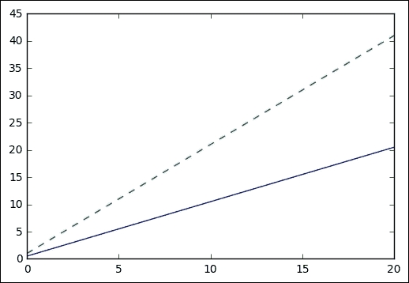
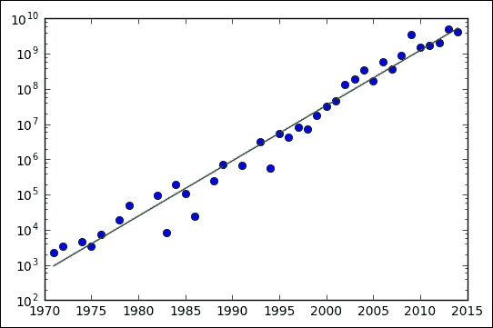
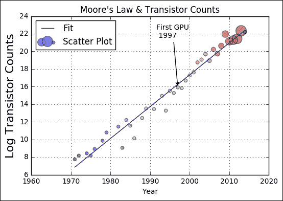
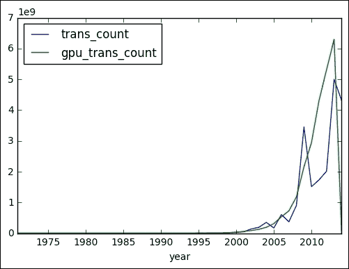
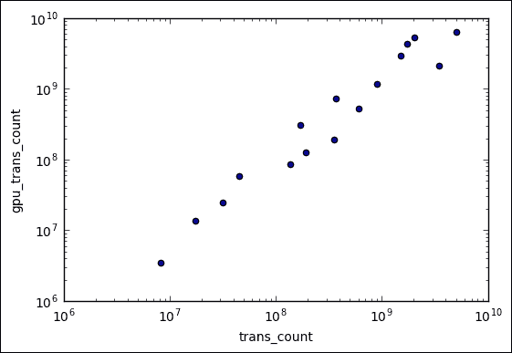
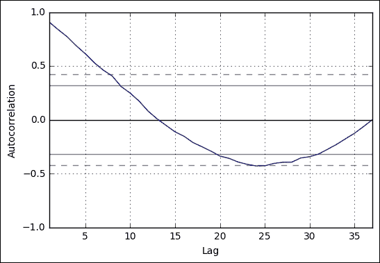
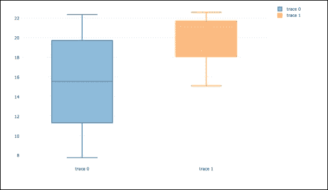

# 六、数据可视化

数据分析的第一步是可视化。即使是在查看数值表时，我们也可以在脑海中形成一个图表化数据的样子。数据可视化涉及信息的可视化表示的概念和分析，表示以某种形式模式抽象的数据，包括数据测量单位的属性或数量。数据可视化与科学可视化和统计图形密切相关。Python `matplotlib`库是一个著名的基于 NumPy 的绘图库，我们将在本章中使用它。它有一个面向对象的和类似于 Matlab 的程序性应用编程接口，可以并行使用。在[http://matplotlib.org/gallery.html](http://matplotlib.org/gallery.html)可以找到一个包含 matplotlib 示例的图库，这是一个基于云的数据可视化服务。我们将在本章末尾简要介绍这项服务。以下是本章将涵盖的主题列表:

*   `matplotlib`子包
*   基本`matplotlib`地块
*   对数图
*   散点图
*   图例和注释
*   三维图
*   Pandas中的阴谋
*   滞后图
*   自相关图
*   plot.ly

# matplotlib 子包

如果我们更改`ch-01.ipynb`最后一节的代码来列出`matplotlib`子包，我们会得到以下结果:

```py
matplotlib version 1.3.1
matplotlib.axes
matplotlib.backends
matplotlib.compat
matplotlib.delaunay DESCRIPTION :Author: Robert Kern   
    <robert.kern@gmail.com> :Copyright: Copyright 2005  
    Robert Kern. 
    :License: BSD-style license. See LICENSE.tx
matplotlib.projections
matplotlib.sphinxext
matplotlib.style
matplotlib.testing
matplotlib.tests
matplotlib.tri

```

子包的名称很容易解释。后端是指输出最终结果的方式。该输出可以是几种文件格式之一，也可以显示在图形用户界面的屏幕上。

# 基本 matplotlib 打印

我们在[第 1 章](01.html "Chapter 1. Getting Started with Python Libraries")、*Python 库*中安装了 matplotlib 和 IPython。如果你需要刷新记忆，你可以回到那一章。许多人认为类似于 Matlab 的程序性 matplotlib 应用编程接口比面向对象的应用编程接口更容易使用，所以我们将首先演示这个程序性应用编程接口。为了在 matplotlib 中创建一个非常基本的图，我们需要调用`matplotlib.pyplot`子包中的`plot()`函数。该函数为具有已知`x`和`y` 坐标的单个点列表或多个点列表生成二维图。

或者，我们可以传递一个格式参数，例如，指定一个虚线样式。`plot()`功能的格式选项和参数列表很长，但是使用以下命令很容易查找(在导入`matplotlib.pyplot`库之后):

```py
In [1]: help(plot)

```

在本例中，我们将绘制两条线-一条是实线样式(默认)，另一条是虚线样式。

以下演示代码位于本书代码包的`ch-06.ipynb`文件中:

```py
import matplotlib.pyplot as plt 
import numpy as np 

x = np.linspace(0, 20) 

plt.plot(x,  .5 + x) 
plt.plot(x, 1 + 2 * x, '--') 
plt.show() 

```

请按照以下步骤绘制上述线条:

1.  首先，我们用 NumPy `linspace()`函数指定`x`坐标。指定`0`的开始值和`20`的结束值:

    ```py
            x = np.linspace(0, 20) 

    ```

2.  如下绘制线条:

    ```py
            plt.plot(x,  .5 + x) 
            plt.plot(x, 1 + 2 * x, '--') 

    ```

3.  At this juncture, we can either save the plot to a file with the `savefig()` function or show the plot on the screen with the `show()` function. Show the plot on the screen as follows:

    ```py
            plt.show() 

    ```

    最终结果见下图:

    

# 对数图

**对数图**(或对数图)是使用对数标度的图。对数刻度显示变量的值，它使用与数量级匹配的间隔，而不是规则的线性刻度。对数图有两种类型。对数-对数图在两个轴上都采用对数标度，在 matplotlib 中由`matplotlib.pyplot.loglog()`函数表示。半对数图在一个轴上使用线性标度，在另一个轴上使用对数标度。这些图在 matplotlib 应用编程接口中由`semilogx()`和`semilogy()`函数表示。在对数-对数图上，幂律显示为直线。在半对数图上，直线代表指数规律。

**摩尔定律**就是这样的定律。这不是物理上的，更多的是经验上的观察。戈登·摩尔发现了集成电路中晶体管数量每两年翻一番的趋势。在[http://en . Wikipedia . org/wiki/Transistor _ count #微处理器](http://en.wikipedia.org/wiki/Transistor_count#Microprocessors)上，你可以看到一张表格，上面有各种微处理器的晶体管计数和相应的推出年份。

从这个表中，我准备了一个 CSV 文件，`transcount.csv`，只包含晶体管计数和年份。我们仍然需要平均每年的晶体管数量。平均和加载可以用Pandas来完成。如有需要，可参考[第三章](03.html "Chapter 3. The Pandas Primer")、*Pandas底火*、*获取提示。一旦我们在表中有了每年的平均晶体管计数，我们就可以试着在计数与年份的对数上画一条直线。NumPy `polyfit()`函数允许我们将数据拟合为多项式。*

以下代码请参考本书代码包中的`ch-06.ipynb`文件:

```py
import matplotlib.pyplot as plt 
import numpy as np 
import pandas as pd 

df = pd.read_csv('transcount.csv') 
df = df.groupby('year').aggregate(np.mean) 
years = df.index.values 
counts = df['trans_count'].values 
poly = np.polyfit(years, np.log(counts), deg=1) 
print("Poly", poly) 
plt.semilogy(years, counts, 'o') 
plt.semilogy(years, np.exp(np.polyval(poly, years))) 
plt.show() 

```

以下步骤将解释前面的代码:

1.  将数据拟合如下:

    ```py
            poly = np.polyfit(years, np.log(counts), deg=1) 
            print("Poly", poly) 

    ```

2.  拟合的结果是一个多项式对象(见[。这个对象的字符串表示给出了多项式系数，系数的阶数是递减的，所以最高的系数排在第一位。对于我们的数据，我们获得以下多项式系数:

    ```py
            Poly [  3.61559210e-01  -7.05783195e+02]
    ```](http://docs.scipy.org/doc/numpy/reference/generated/numpy.polynomial.polynomial.Polynomial.html#numpy.polynomial.polynomial.Polynomial) 
3.  The NumPy `polyval()` function enables us to evaluate the polynomial we just obtained. Plot the data and fit it with the `semilogy()` function:

    ```py
            plt.semilogy(years, counts, 'o') 
            plt.semilogy(years, np.exp(np.polyval(poly, years))) 

    ```

    趋势线绘制为实线，数据点绘制为实心圆。最终结果见下图:

    

# 散点图

一个**散点图**显示了笛卡尔坐标系中两个变量之间的关系。每个数据点的位置由这两个变量的值决定。散点图可以提示所研究的变量之间的任何相关性。上升趋势表明正相关。一张**气泡图**是散点图的延伸。在气泡图中，第三个变量的值由数据点周围气泡的相对大小来表示，因此得名。

在[http://en.wikipedia.org/wiki/Transistor_count#GPUs](http://en.wikipedia.org/wiki/Transistor_count#GPUs)有一张表格，上面有**图形处理器单元** ( **图形处理器**)的晶体管计数。

图形处理器是用于高效显示图形的专用电路。由于现代显示硬件的工作方式，图形处理器可以用高度并行的操作来处理数据。图形处理器是计算领域的新发展。在本书代码包的`gpu_transcount.csv`文件中，你会注意到我们没有太多的数据点。处理缺失数据是一个反复出现的气泡图问题。我们将为缺失值定义默认气泡大小。同样，我们将每年加载和平均数据。然后，我们将把年指数上的中央处理器和图形处理器数据帧的晶体管计数与外部连接合并。`NaN`值将被设置为`0`(本例适用，但有时将`NaN`值设置为`0`可能不是一个好主意)。前文中描述的所有功能都包含在[第 3 章](03.html "Chapter 3. The Pandas Primer")、**Pandas初级套装*中，因此如果您需要，请参考本章。matplotlib 应用编程接口为散点图和气泡图提供`scatter()`功能。我们可以使用以下命令查看该函数的文档:*

```py
$ ipython3
ln [1]: import matplotlib as mpl
In [2]: help(mpl.scatter)

```

在本例中，我们将指定`s`参数，该参数与气泡的大小有关。`c`参数指定颜色。不幸的是，你在这本书里看不到颜色，所以你必须自己运行例子来看不同的颜色。`alpha`参数决定了图中气泡的透明度。该值在`0`(完全透明)和`1`(不透明)之间变化。按如下方式创建气泡图:

```py
plt.scatter(years, cnt_log, c= 200 * years, s=20 + 200 * gpu_counts/gpu_counts.max(), alpha=0.5) 

```

本例的以下代码也可以在本书代码包的`ch-06.ipynb`文件中找到:

```py
import matplotlib.pyplot as plt 
import numpy as np 
import pandas as pd 

df = pd.read_csv('transcount.csv') 
df = df.groupby('year').aggregate(np.mean) 

gpu = pd.read_csv('gpu_transcount.csv') 
gpu = gpu.groupby('year').aggregate(np.mean) 

df = pd.merge(df, gpu, how='outer', left_index=True, right_index=True) 
df = df.replace(np.nan, 0) 
print(df) 
years = df.index.values 
counts = df['trans_count'].values 
gpu_counts = df['gpu_trans_count'].values 
cnt_log = np.log(counts) 
plt.scatter(years, cnt_log, c= 200 * years, s=20 + 200 * gpu_counts/gpu_counts.max(), alpha=0.5) 
plt.show() 

```

最终结果见下图:


# 传说和注释

图例和注释是一目了然地显示理解情节所需信息的有效工具。典型图将包含以下附加信息元素:

*   描述剧情中各种数据系列的图例。这是通过调用 matplotlib `legend()`函数并为每个数据系列提供标签来实现的。
*   情节中重要点的注释。matplotlib `annotate()`功能可用于此目的。matplotlib 注释由一个标签和一个箭头组成。这个函数有很多参数描述标签和箭头的样式和位置，所以可能需要调用`help(annotate)`进行详细描述。
*   水平轴和垂直轴上的标签。这些标签可以通过`xlabel()`和`ylabel()`功能绘制。我们需要给这些函数一个字符串形式的标签文本，以及可选的参数，比如标签的字体大小。
*   具有 matplotlib `title()`功能的图形的描述性标题。通常，我们只给这个函数一个表示标题的字符串。
*   有一个网格也很好，这样可以很容易地定位点。matplotlib `grid()`功能打开和关闭绘图网格。

我们将修改上一个示例中的气泡图代码，并添加本章第二个示例中的直线拟合。在此设置中，将标签添加到数据系列，如下所示:

```py
plt.plot(years, np.polyval(poly, years), label='Fit') 
plt.scatter(years, cnt_log, c= 200 * years, s=20 + 200 * gpu_counts/gpu_counts.max(), alpha=0.5, label="Scatter Plot") 

```

让我们注释一下数据集中的第一个 GPU。为此，获取相关的点，定义注释的标签，指定箭头的样式(`arrowprops`参数)，并确保注释悬停在有问题的点上方:

```py
gpu_start = gpu.index.values.min() 
y_ann = np.log(df.at[gpu_start, 'trans_count']) 
ann_str = "First GPU\n %d" % gpu_start 
plt.annotate(ann_str, xy=(gpu_start, y_ann), arrowprops=dict(arrowstyle="->"), xytext=(-30, +70), textcoords='offset points') 

```

完整的代码示例在本书代码包的`ch-06.ipynb`文件中:

```py
import matplotlib.pyplot as plt 
import numpy as np 
import pandas as pd 

df = pd.read_csv('transcount.csv') 
df = df.groupby('year').aggregate(np.mean) 
gpu = pd.read_csv('gpu_transcount.csv') 
gpu = gpu.groupby('year').aggregate(np.mean) 

df = pd.merge(df, gpu, how='outer', left_index=True, right_index=True) 
df = df.replace(np.nan, 0) 
years = df.index.values 
counts = df['trans_count'].values 
gpu_counts = df['gpu_trans_count'].values 

poly = np.polyfit(years, np.log(counts), deg=1) 
plt.plot(years, np.polyval(poly, years), label='Fit') 

gpu_start = gpu.index.values.min() 
y_ann = np.log(df.at[gpu_start, 'trans_count']) 
ann_str = "First GPU\n %d" % gpu_start 
plt.annotate(ann_str, xy=(gpu_start, y_ann), arrowprops=dict(arrowstyle="->"), xytext=(-30, +70), textcoords='offset points') 

cnt_log = np.log(counts) 
plt.scatter(years, cnt_log, c= 200 * years, s=20 + 200 * gpu_counts/gpu_counts.max(), alpha=0.5, label="Scatter Plot") 
plt.legend(loc='upper left') 
plt.grid() 
plt.xlabel("Year") 
plt.ylabel("Log Transistor Counts", fontsize=16) 
plt.title("Moore's Law & Transistor Counts") 
plt.show() 

```

最终结果见下图:



# 三维图

二维图是数据可视化的基础。然而，如果你想炫耀，没有什么比得上一个好的三维剧情。我曾经负责过一个可以画等高线图和三维图的软件包。该软件甚至可以绘制出当用特殊的眼镜观看时会突然出现在你面前的图表。

matplotlib API 具有用于三维绘图的`Axes3D`类。通过演示这个类是如何工作的，我们也将展示面向对象的 matplotlib API 是如何工作的。matplotlib `Figure`类是图表元素的顶级容器:

1.  创建一个`figure`对象，如下所示:

    ```py
            fig = plt.figure() 

    ```

2.  从`figure`对象创建一个`Axes3D`对象:

    ```py
            ax = Axes3D(fig) 

    ```

3.  年份和 CPU 晶体管计数将是我们的`X`和`Y`轴。我们有必要根据年份和中央处理器晶体管计数数组创建坐标矩阵。使用`meshgrid()`功能

    ```py
            X, Y = np.meshgrid(X, Y) 

    ```

    创建坐标矩阵
4.  用`Axes3D`类的`plot_surface()`方法绘制数据:

    ```py
            ax.plot_surface(X, Y, Z) 

    ```

5.  面向对象的 API 方法的命名约定是以`set_`开始，以过程对应的函数名结束，如下面的代码片段所示:

    ```py
            ax.set_xlabel('Year') 
            ax.set_ylabel('Log CPU transistor counts') 
            ax.set_zlabel('Log GPU transistor counts') 
            ax.set_title("Moore's Law & Transistor Counts") 

    ```

您还可以查看本书代码包中`ch-06.ipynb`文件中的以下代码:

```py
from mpl_toolkits.mplot3d.axes3d import Axes3D 
import matplotlib.pyplot as plt 
import numpy as np 
import pandas as pd 

df = pd.read_csv('transcount.csv') 
df = df.groupby('year').aggregate(np.mean) 
gpu = pd.read_csv('gpu_transcount.csv') 
gpu = gpu.groupby('year').aggregate(np.mean) 

df = pd.merge(df, gpu, how='outer', left_index=True, right_index=True) 
df = df.replace(np.nan, 0) 

fig = plt.figure() 
ax = Axes3D(fig) 
X = df.index.values 
Y = np.where(df['trans_count'].values>0,np.ma.log(df['trans_count'].values), 0) 
X, Y = np.meshgrid(X, Y) 
Z = np.where(df['gpu_trans_count'].values>0,np.ma.log(df['gpu_trans_count'].values), 0) 
ax.plot_surface(X, Y, Z) 
ax.set_xlabel('Year') 
ax.set_ylabel('Log CPU transistor counts') 
ax.set_zlabel('Log GPU transistor counts') 
ax.set_title("Moore's Law & Transistor Counts") 
plt.show() 

```

最终结果见下图:


# 在Pandas中绘图

Pandas`Series`和`DataFrame`类中的`plot()`方法包装了相关的 matplotlib 函数。在最基本的形式中，没有任何参数，`plot()`方法显示了我们在本章中一直使用的数据集的以下图:



要创建半对数图，添加`logy`参数:

```py
df.plot(logy=True) 

```

这导致我们的数据如下图所示:


要创建散点图，请将`kind`参数指定为`scatter`。我们还需要指定两列。将`loglog`参数设置为`True`以生成对数图(对于此代码，我们至少需要 Pandas v0.13.0):

```py
df[df['gpu_trans_count'] > 0].plot(kind='scatter', x='trans_count', y='gpu_trans_count', loglog=True) 

```

最终结果见下图:



以下程序在本书代码包的`ch-06.ipynb`文件中:

```py
import matplotlib.pyplot as plt 
import numpy as np 
import pandas as pd 

df = pd.read_csv('transcount.csv') 
df = df.groupby('year').aggregate(np.mean) 

gpu = pd.read_csv('gpu_transcount.csv') 
gpu = gpu.groupby('year').aggregate(np.mean) 

df = pd.merge(df, gpu, how='outer', left_index=True, right_index=True) 
df = df.replace(np.nan, 0) 
df.plot() 
df.plot(logy=True) 
df[df['gpu_trans_count'] > 0].plot(kind='scatter', x='trans_count', y='gpu_trans_count', loglog=True) 
plt.show() 

```

# 滞后图

一个**滞后图**是一个时间序列和相同数据滞后的散点图。例如，通过这样的图，我们可以检查今年的中央处理器晶体管计数和前一年的计数之间是否存在可能的相关性。`pandas.tools.plotting`中的`lag_plot()`Pandas功能可以画出滞后图。用`1`的默认滞后绘制一个 CPU 晶体管计数的滞后图，如下所示:

```py
lag_plot(np.log(df['trans_count'])) 

```

最终结果见下图:


滞后图示例的以下代码也可以在本书代码包的`ch-06.ipynb`文件中找到:

```py
import matplotlib.pyplot as plt 
import numpy as np 
import pandas as pd 
from pandas.tools.plotting import lag_plot 

df = pd.read_csv('transcount.csv') 
df = df.groupby('year').aggregate(np.mean) 

gpu = pd.read_csv('gpu_transcount.csv') 
gpu = gpu.groupby('year').aggregate(np.mean) 

df = pd.merge(df, gpu, how='outer', left_index=True, right_index=True) 
df = df.replace(np.nan, 0) 
lag_plot(np.log(df['trans_count'])) 
plt.show() 

```

# 自相关图

**自相关图**绘制不同时滞的时间序列数据的**自相关图**。通俗地说，自相关就是时间 *n* 的值和时间 *n* 的值+l 的相关性，其中 l 是时滞。通常，这些图用于检查时间序列在其进展中是否具有随机性。在随机时间序列的情况下，自相关在所有时滞分离中都接近于零，在非随机时间序列的一些或所有时滞分离中具有非零的显著性值。我们在[第 7 章](07.html "Chapter 7. Signal Processing and Time Series")、*信号处理和时间序列中进一步解释自相关。*

`pandas.tools.plotting`中的`autocorrelation_plot()`Pandas函数可以画出自相关图。以下是本书代码包中`ch-06.ipynb`文件的代码:

```py
import matplotlib.pyplot as plt 
import numpy as np 
import pandas as pd 
from pandas.tools.plotting import autocorrelation_plot 

df = pd.read_csv('transcount.csv') 
df = df.groupby('year').aggregate(np.mean) 

gpu = pd.read_csv('gpu_transcount.csv') 
gpu = gpu.groupby('year').aggregate(np.mean) 

df = pd.merge(df, gpu, how='outer', left_index=True, right_index=True) 
df = df.replace(np.nan, 0) 
autocorrelation_plot(np.log(df['trans_count'])) 
plt.show() 

```

绘制中央处理器晶体管计数的自相关图，如下所示:

```py
autocorrelation_plot(np.log(df['trans_count'])) 

```

最终结果见下图。正如我们在下图中看到的，较新的值(较小的滞后)与当前值的相关性比较旧的值(较大的滞后)更强，并且当滞后非常大时，相关性衰减到`0`:



# Plot.ly

Plot.ly 是在线数据可视化工具的**软件即服务** ( **SaaS** )云服务。Plot.ly 提供了一个相关的 python 库，可以在用户的机器上与 Python 一起使用。我们可以通过网络界面导入和分析数据，或者完全在本地环境中工作，并在 Plot.ly 网站上发布最终结果。情节可以很容易地在一个团队的网站上分享，允许合作，这确实是网站的第一点。在本节中，我们将给出一个如何用 Python API 绘制方框图的例子。

箱线图是使用四分位数可视化数据集的一种特殊方式。如果我们将排序后的数据集分成四个相等的部分，第一个四分位数将是具有最小数字的部分的最大值。第二个四分位数将是数据集中间的值，也称为中位数。第三个四分位数是中间值和最高值之间的值。箱线图的底部和顶部由第一个和第三个四分位数组成。穿过盒子的线是中线。盒子两端的胡须通常是数据集的最小值和最大值。在这一节的最后，我们将看到一个带注释的方框图，它将澄清问题。使用以下命令安装绘图应用编程接口:

```py
$ sudo pip3 install plotly
```

安装完应用编程接口后，注册获取应用编程接口密钥。以下代码片段在提供有效密钥后让您登录:

```py
# Change the user and api_key to your own username and api_key
py.sign_in('username', 'api_key')
```

使用绘图应用编程接口创建方框图，如下所示:

```py
data = Data([Box(y=counts), Box(y=gpu_counts)])
plot_url = py.plot(data, filename='moore-law-scatter')
```

请参考本书代码包中`ch-06.ipynb`文件的以下代码:

```py
import plotly.plotly as py
from plotly.graph_objs import *
import numpy as np
import pandas as pd

df = pd.read_csv('transcount.csv')
df = df.groupby('year').aggregate(np.mean)

gpu = pd.read_csv('gpu_transcount.csv')
gpu = gpu.groupby('year').aggregate(np.mean)
df = pd.merge(df, gpu, how='outer', left_index=True, right_index=True)
df = df.replace(np.nan, 0)

# Change the user and api_key to your own username and api_key
py.sign_in('username', 'api_key')

counts = np.log(df['trans_count'].values)
gpu_counts = np.log(df['gpu_trans_count'].values)

data = Data([Box(y=counts), Box(y=gpu_counts)])
plot_url = py.plot(data, filename='moore-law-scatter')
print(plot_url)
```

最终结果见下图:



# 总结

在本章中，我们讨论了使用 Python 使用绘图来可视化数据。为此，我们使用了 matplotlib 和 Pandas。我们介绍了箱线图、散点图、气泡图、对数图、自相关图、滞后图、三维图、图例和注释。

对数图(或对数图)是使用对数刻度的图。半对数图在一个轴上使用线性标度，在另一个轴上使用对数标度。散点图将两个变量相对绘制。气泡图是一种特殊类型的散点图。在气泡图中，第三个变量的值相对由数据点周围气泡的大小来表示。自相关绘制不同滞后时间序列数据的自相关图。

我们了解了 plot.ly，一个基于云的在线数据可视化服务，并使用该服务构建了一个箱式图。箱线图基于数据的四分位数可视化数据。

下一章[第七章](07.html "Chapter 7. Signal Processing and Time Series")*信号处理与时间序列*讲述的是一种特殊类型的数据——时间序列。时间序列由已打上时间戳的有序数据点组成。我们测量的很多物理世界数据都是以时间序列的形式出现的，可以认为是一种信号，比如声音、光或电信号。你将在下一章学习如何过滤信号和建模时间序列。*