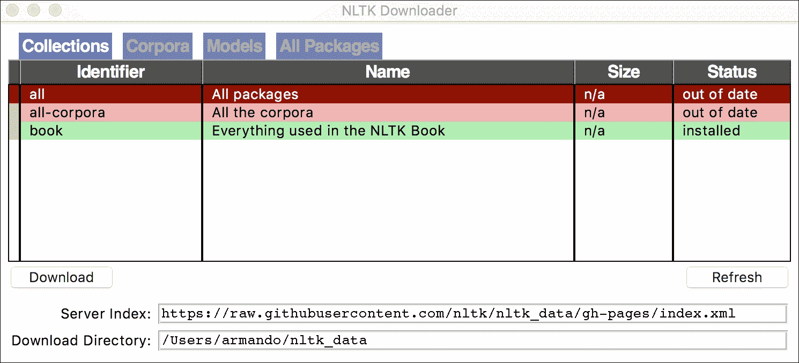
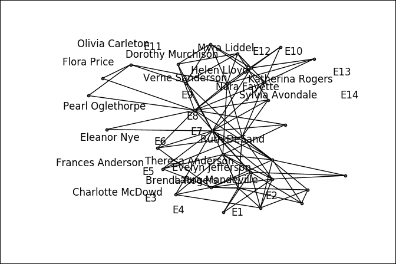

# 九、分析文本数据和社交媒体

在前面的章节中，我们重点分析了结构化数据，主要是表格格式的数据。除了结构化数据，明文是当今另一种主要的数据形式。文本分析包括词频分布分析、模式识别、标记、链接和关联分析、情感分析和可视化。Python 中用于文本分析的主要库之一是**自然语言工具包** ( **NLTK** )库。NLTK 附带了一个名为**语料库**的样本文本集合。scikit-learn 库还包含文本分析工具，我们将在本章中简要介绍。还将讲述一个网络分析的小例子。本章将讨论以下主题:

*   安装 NLTK
*   关于 NLTK
*   筛选出停用词、名称和数字
*   单词包模型
*   分析词频
*   朴素贝叶斯分类
*   情感分析
*   创建单词云
*   社交网络分析

# 安装 NLTK

让我们使用以下命令安装本章所需的库:

```py
$ pip3 install nltk  scikit-learn

```

# 关于 NLTK

NLTK 是一个 Python API，用于分析用自然语言(如英语)编写的文本。NLTK 创建于 2001 年，最初是作为一种教学工具。

虽然我们在前一节中安装了 NLTK，但是我们还没有完成；我们仍然需要下载 NLTK 语料库。下载量比较大(1.8 GB 左右)；然而，我们只需要下载一次。除非你确切知道你需要哪些语料库，否则最好下载所有可用的语料库。从 Python 外壳下载语料库，如下所示:

```py
$ python3
>>> import nltk 
>>> nltk.download()

```

应该会出现一个图形用户界面应用程序，您可以在其中指定目的地和要下载的文件。



如果您是 NLTK 的新手，选择默认选项并下载所有内容是最方便的。在这一章中，我们将需要单词、电影评论、名字和古腾堡语料库。鼓励读者遵循`ch-09.ipynb`文件中的章节。

# 过滤掉停止词、名称和数字

停用词是文本中信息价值非常低的常用词。去除停用词是文本分析中的一种常见做法。NLTK 拥有多种语言的 stopwords 语料库。加载英语单词语料库并打印一些单词:

```py
sw = set(nltk.corpus.stopwords.words('english')) 
print("Stop words:", list(sw)[:7]) 

```

打印以下常用单词:

```py
Stop words: ['between', 'who', 'such', 'ourselves', 'an', 'ain', 'ours'] 

```

请注意，这个语料库中的所有单词都是小写的。

NLTK 还有一个古腾堡语料库。古腾堡项目是一个数字图书图书馆，大部分是版权过期的图书，可以在互联网上免费获得(见[http://www.gutenberg.org/](http://www.gutenberg.org/))。

加载古腾堡语料库并打印它的一些文件名:

```py
gb = nltk.corpus.gutenberg 
print("Gutenberg files:\n", gb.fileids()[-5:]) 

```

一些印刷的标题可能是你所熟悉的:

```py
Gutenberg files:  ['milton-paradise.txt', 'shakespeare-caesar.txt', 'shakespeare-hamlet.txt', 'shakespeare-macbeth.txt', 'whitman-leaves.txt']
```

从`milton-paradise.txt`文件中提取前几个句子，我们稍后会过滤:

```py
text_sent = gb.sents("milton-paradise.txt")[:2] 
print("Unfiltered:", text_sent) 

```

打印以下句子:

```py
 Unfiltered [['[', 'Paradise', 'Lost', 'by', 'John', 'Milton', 
 '1667',  ']'], ['Book', 'I']]

```

现在，按如下方式过滤掉停止词:

```py
for sent in text_sent: 
    filtered = [w for w in sent if w.lower() not in sw] 
    print("Filtered:\n", filtered) 

```

对于第一句，我们得到以下输出:

```py
Filtered ['[', 'Paradise', 'Lost', 'John', 'Milton', '1667', ']']
```

如果我们将此与前面的片段进行比较，我们注意到单词`by`已经被过滤掉了，因为它是在 stopwords 语料库中找到的。有时候，我们也想去掉数字和名字。我们可以根据**词性** ( **POS** )标签删除单词。在该标记方案中，数字对应于**基数** ( **CD** )标记。名称对应**专有名词单数** ( **NNP** )标签。标记是一个基于启发式的不精确的过程。这是一个值得整本书讨论的大话题。用`pos_tag()`功能标记过滤后的文本:

```py
tagged = nltk.pos_tag(filtered) 
print("Tagged:\n", tagged) 

```

对于我们的文本，我们得到以下标签:

```py
Tagged [('[', 'NN'), ('Paradise', 'NNP'), ('Lost', 'NNP'), ('John', 'NNP'), ('Milton', 'NNP'), ('1667', 'CD'), (']', 'CD')]

```

`pos_tag()`函数返回元组列表，其中每个元组中的第二个元素是标签。如您所见，有些单词被标记为 NNP，尽管它们可能不应该被标记。这里的启发是，如果单词的第一个字符是大写的，则将单词标记为 NNP。如果我们把所有的单词都设为小写，我们会得到不同的结果。这是留给读者的练习。用 NNP 和 CD 标签很容易删除列表中的单词，如以下代码所述:

```py
words= [] 
    for word in tagged: 
        if word[1] != 'NNP' and word[1] != 'CD': 
           words.append(word[0])  

    print(words) 

```

请看一下本书代码包中的`ch-09.ipynb` 文件:

```py
import nltk

sw = set(nltk.corpus.stopwords.words('english'))
print(“Stop words:", list(sw)[:7])

gb = nltk.corpus.gutenberg
print(“Gutenberg files:\n", gb.fileids()[-5:])

text_sent = gb.sents("milton-paradise.txt")[:2]
print(“Unfiltered:", text_sent)

for sent in text_sent:
    filtered = [w for w in sent if w.lower() not in sw]
    print("Filtered:\n", filtered)
    tagged = nltk.pos_tag(filtered)
    print("Tagged:\n", tagged)

    words= []
    for word in tagged:
        if word[1] != 'NNP' and word[1] != 'CD':
           words.append(word[0]) 

    print(“Words:\n",words)
```

# 单词包模型

在**单词包模型**中，我们从文档中创建一个包含文档中单词的包。在这个模型中，我们不关心词序。对于文档中的每个单词，我们都会计算出现的次数。通过这些字数统计，我们可以进行统计分析，例如，识别电子邮件中的垃圾邮件。

如果我们有一组文档，我们可以将语料库中每个唯一的单词视为一个特征；这里，*特征*表示参数或变量。使用所有的字数，我们可以为每个文档建立一个特征向量；*向量*在这里是数学意义上使用的。如果语料库中有一个词，但文档中没有，则该特征的值为`0`。令人惊讶的是，NLTK 目前没有一个方便的工具来创建特征向量。然而，机器学习 Python 库 scikit-learn 确实有一个我们可以使用的`CountVectorizer`类。在下一章[第 10 章](10.html "Chapter 10. Predictive Analytics and Machine Learning")、*预测性分析和机器学习*中，我们将用 scikit-learn 做更多的事情。

从 NLTK 古腾堡语料库中加载两个文本文档:

```py
hamlet = gb.raw("shakespeare-hamlet.txt") 
macbeth = gb.raw("shakespeare-macbeth.txt") 

```

通过省略英文停止词来创建特征向量:

```py
cv = sk.feature_extraction.text.CountVectorizer(stop_words='english') 
print("Feature vector:\n", cv.fit_transform([hamlet, macbeth]).toarray())  

```

这是两个文档的特征向量:

```py
Feature vector:   
   [[ 1  0  1 ..., 14  0  1]   
    [ 0  1  0 ...,  1  1  0]] 

```

打印我们发现的一小部分功能(独特的词语):

```py
print("Features:\n", cv.get_feature_names()[:5]) 

```

这些功能按字母顺序排列:

```py
Features: 
  ['1599',  '1603',  'abhominably',  'abhorred',  'abide']

```

请看一下本书代码包中的`ch-09.ipynb` 文件:

```py
import nltk
import sklearn as sk

hamlet = gb.raw("shakespeare-hamlet.txt")
macbeth = gb.raw("shakespeare-macbeth.txt")

cv = sk.feature_extraction.text.CountVectorizer(stop_words='english')

print(“Feature vector:\n”, cv.fit_transform([hamlet, macbeth]).toarray())
print("Features:\n", cv.get_feature_names()[:5])
```

# 分析词频

NLTK `FreqDist`类封装了一个单词字典，并对给定的单词列表进行计数。载入威廉·莎士比亚的《凯撒大帝》古腾堡文本。让我们过滤掉停用词和标点符号:

```py
punctuation = set(string.punctuation) 
filtered = [w.lower() for w in words if w.lower() not in sw and w.lower() not in punctuation] 

```

创建一个`FreqDist`对象，并以最高频率打印相关的键和值:

```py
fd = nltk.FreqDist(filtered) 
print("Words", fd.keys()[:5]) 
print("Counts", fd.values()[:5]) 

```

键和值打印如下:

```py
Words ['d', 'caesar', 'brutus', 'bru', 'haue']
Counts [215, 190, 161, 153, 148]

```

当然，这个列表中的第一个单词不是英语单词，所以我们可能需要添加单词最少有两个字符的启发。NLTK `FreqDist`类允许类似字典的访问，但是它也有方便的方法。获取出现频率最高的单词和相关计数:

```py
print("Max", fd.max()) 
print("Count", fd['d']) 

```

以下结果不应该令人惊讶:

```py
Max d
Count 215
```

到目前为止，分析集中在单个单词上，但是我们可以将分析扩展到单词对和三元组。这些也被称为二元模型和三元模型。我们可以通过`bigrams()`和`trigrams()`功能找到它们。重复分析，但这次是针对二元模型:

```py
fd = nltk.FreqDist(nltk.bigrams(filtered)) 
print("Bigrams", fd.keys()[:5]) 
print("Counts", fd.values()[:5]) 
print("Bigram Max", fd.max()) 
print("Bigram count", fd[('let', 'vs')]) 

```

应打印以下输出:

```py
Bigrams [('let', 'vs'), ('wee', 'l'), ('mark', 'antony'), ('marke', 'antony'), ('st', 'thou')]
    Counts [16, 15, 13, 12, 12]
    Bigram Max ('let', 'vs')
    Bigram count 16

```

查看本书代码包中的`ch-09.ipynb`文件:

```py
import nltk 
import string 

gb = nltk.corpus.gutenberg 
words = gb.words("shakespeare-caesar.txt") 

sw = set(nltk.corpus.stopwords.words('english')) 
punctuation = set(string.punctuation) 
filtered = [w.lower() for w in words if w.lower() not in sw and w.lower() not in punctuation] 
fd = nltk.FreqDist(filtered) 
print("Words", fd.keys()[:5]) 
print("Counts", fd.values()[:5]) 
print("Max", fd.max()) 
print("Count", fd['d']) 

fd = nltk.FreqDist(nltk.bigrams(filtered)) 
print("Bigrams", fd.keys()[:5]) 
print("Counts", fd.values()[:5]) 
print("Bigram Max", fd.max()) 
print("Bigram count", fd[('let', 'vs')]) 

```

# 朴素贝叶斯分类

分类算法是一种机器学习算法，用于确定给定项目的类别(类别或类型)。例如，我们可以尝试根据一些特征来确定电影的类型。在这种情况下，流派就是要预测的类。在下一章[第 10 章](10.html "Chapter 10. Predictive Analytics and Machine Learning")、*预测性分析和机器学习*中，我们将继续概述机器学习。同时，我们将讨论一种流行的算法，称为**朴素贝叶斯分类**，它经常用于分析文本文档。

朴素贝叶斯分类是一种基于概率论和统计学中贝叶斯定理的概率算法。贝叶斯定理阐述了如何根据新的证据来降低事件的概率。例如，假设我们有一个袋子，里面装着巧克力块和其他我们看不见的东西。我们将绘制一块黑巧克力的概率称为 P(D)。我们将把画一块巧克力的概率表示为 P(C)。当然，总概率总是 1，所以 P(D)和 P(C)最多只能是 1。贝叶斯定理指出，后验概率与先验概率乘以似然性成正比:

`P(D|C)`在前面的符号中是指给定的`C`事件的概率`D`。当我们没有画任何项目时，`P(D) = 0.5`因为我们还没有任何信息。要实际应用这个公式，我们需要知道`P(C|D)`和`P(C)`，或者我们必须间接确定它们。

朴素贝叶斯分类被称为**朴素**，因为它对特征之间的独立性做了简化假设。实际上，结果通常都很好，所以这个假设在一定程度上是合理的。最近发现这个假设有理论上的原因。然而，由于机器学习是一个快速发展的领域，所以已经发明了具有(稍微)更好性能的算法。

让我们试着把单词分类为停用词或标点符号。作为一个特点，我们将使用单词长度，因为停止词和标点符号往往很短。

该设置引导我们定义以下功能:

```py
def word_features(word): 
   return {'len': len(word)} 

def isStopword(word): 
   return word in sw or word in punctuation 

```

根据古腾堡语`shakespeare-caesar.txt`中的单词是否是停止词来标记它们:

```py
labeled_words = ([(word.lower(), isStopword(word.lower())) for word in words]) 
random.seed(42) 
random.shuffle(labeled_words) 
print(labeled_words[:5]) 

```

5 个带标签的单词将显示如下:

```py
    [('was', True), ('greeke', False), ('cause', False), ('but', True), ('house', False)]

```

对于每个单词，确定其长度:

```py
featuresets = [(word_features(n), word) for (n, word) in labeled_words] 

```

在前面的章节中，我们提到了过拟合，并研究了如何通过拥有一个训练和一个测试数据集来避免交叉验证。我们将在 90%的单词上训练一个朴素贝叶斯分类器，并测试剩下的 10%。创建训练和测试集，并训练数据:

```py
cutoff = int(.9 * len(featuresets)) 
train_set, test_set = featuresets[:cutoff], featuresets[cutoff:] 
classifier = nltk.NaiveBayesClassifier.train(train_set) 

```

我们现在可以检查分类器如何标记集合中的单词:

```py
classifier = nltk.NaiveBayesClassifier.train(train_set) 
print("'behold' class", classifier.classify(word_features('behold'))) 
print("'the' class", classifier.classify(word_features('the'))) 

```

幸运的是，这些词被恰当地分类了:

```py
'behold' class False
'the' class True
```

按照以下步骤确定测试集的分类器精度:

```py
print("Accuracy", nltk.classify.accuracy(classifier, test_set)) 

```

这个分类器的准确率高达 85%左右。打印信息最丰富的功能概述:

```py
print(classifier.show_most_informative_features(5)) 

```

概述显示了对分类过程最有用的单词长度:


代码在本书代码包的`ch-09.ipynb`文件中:

```py
import nltk 
import string 
import random 

sw = set(nltk.corpus.stopwords.words('english')) 
punctuation = set(string.punctuation) 

def word_features(word): 
   return {'len': len(word)} 

def isStopword(word): 
    return word in sw or word in punctuation 
gb = nltk.corpus.gutenberg 
words = gb.words("shakespeare-caesar.txt") 

labeled_words = ([(word.lower(), isStopword(word.lower())) for word in words]) 
random.seed(42) 
random.shuffle(labeled_words) 
print(labeled_words[:5]) 

featuresets = [(word_features(n), word) for (n, word) in labeled_words] 
cutoff = int(.9 * len(featuresets)) 
train_set, test_set = featuresets[:cutoff], featuresets[cutoff:] 
classifier = nltk.NaiveBayesClassifier.train(train_set) 
print("'behold' class", classifier.classify(word_features('behold'))) 
print("'the' class", classifier.classify(word_features('the'))) 

print("Accuracy", nltk.classify.accuracy(classifier, test_set)) 
print(classifier.show_most_informative_features(5)) 

```

# 情绪分析

**意见挖掘**或**情绪分析**是一个热门的新研究领域，致力于自动评估在社交媒体、产品评论网站或其他论坛上表达的意见。通常，我们想知道一个观点是积极的、中立的还是消极的。这当然是分类的一种形式，如前一节所见。因此，我们可以应用任意数量的分类算法。另一种方法是半自动地(通过一些手动编辑)编写一个带有相关数字情感评分的单词列表(单词“好”可以有 5 分，“坏”可以有-5 分)。如果我们有这样一个列表，我们可以查找文本文档中的所有单词，例如，总结所有找到的情感分数。班级的数量可以超过三个，就像五星评级计划一样。

我们将把朴素贝叶斯分类应用于 NLTK 电影评论语料库，目标是将电影评论分类为正面或负面。首先，我们将加载语料库并过滤掉停用词和标点符号。这些步骤将被省略，因为我们以前执行过它们。您可以考虑更复杂的过滤方案，但请记住，过度过滤可能会损害准确性。使用`categories()`方法标记电影评论文档:

```py
labeled_docs = [(list(movie_reviews.words(fid)), cat) 
        for cat in movie_reviews.categories() 
        for fid in movie_reviews.fileids(cat)] 

```

完整的语料库有成千上万个我们可以用作特征的独特单词。然而，使用所有这些单词可能效率低下。选择最常用单词的前 5%:

```py
words = FreqDist(filtered) 
N = int(.05 * len(words.keys())) 
word_features = words.keys()[:N] 

```

对于每个文档，我们可以使用多种方法提取特征，包括以下方法:

*   检查给定的文档是否有单词
*   确定给定文档中一个单词的出现次数
*   标准化字数，使最大标准化字数小于或等于 1
*   取计数的对数加 1(避免取零的对数)
*   将所有前面的点合并成一个指标

俗话说*条条大路通罗马*。当然，有些路更安全，会让你更快到达罗马。定义以下函数，该函数使用原始字数作为度量:

```py
def doc_features(doc): 
    doc_words = FreqDist(w for w in doc if not isStopWord(w)) 
    features = {} 
    for word in word_features: 
        features['count (%s)' % word] = (doc_words.get(word, 0)) 
    return features 

```

我们现在可以像前面的例子一样训练我们的分类器了。达到了 78%的准确率，这是相当不错的，接近情绪分析可能达到的水平。研究发现，即使是人类也不总是对给定文档的情感达成一致(参见[http://mashable.com/2010/04/19/sentiment-analysis/](http://mashable.com/2010/04/19/sentiment-analysis/))，因此，使用情感分析软件，我们不可能拥有 100%的完美准确性。

信息最丰富的功能如下所示:


如果我们仔细阅读这个列表，我们会发现明显的积极词汇，如“精彩”和“杰出”。“糟糕”、“愚蠢”和“无聊”是明显的负面词汇。分析剩下的特征会很有趣。这是留给读者的练习。参考本书代码包中的`sentiment.py`文件:

```py
import random 
from nltk.corpus import movie_reviews 
from nltk.corpus import stopwords 
from nltk import FreqDist 
from nltk import NaiveBayesClassifier 
from nltk.classify import accuracy 
import string 

labeled_docs = [(list(movie_reviews.words(fid)), cat) 
        for cat in movie_reviews.categories() 
        for fid in movie_reviews.fileids(cat)] 
random.seed(42) 
random.shuffle(labeled_docs) 

review_words = movie_reviews.words() 
print("# Review Words", len(review_words)) 

sw = set(stopwords.words('english')) 
punctuation = set(string.punctuation) 

def isStopWord(word): 
    return word in sw or word in punctuation 

filtered = [w.lower() for w in review_words if not isStopWord(w.lower())] 
print("# After filter", len(filtered)) 
words = FreqDist(filtered) 
N = int(.05 * len(words.keys())) 
word_features = words.keys()[:N] 

def doc_features(doc): 
    doc_words = FreqDist(w for w in doc if not isStopWord(w)) 
    features = {} 
    for word in word_features: 
        features['count (%s)' % word] = (doc_words.get(word, 0)) 
    return features 

featuresets = [(doc_features(d), c) for (d,c) in labeled_docs] 
train_set, test_set = featuresets[200:], featuresets[:200] 
classifier = NaiveBayesClassifier.train(train_set) 
print("Accuracy", accuracy(classifier, test_set)) 

print(classifier.show_most_informative_features()) 

```

# 创造字云

你可能之前看过 **Wordle** 或者其他软件制作的字云。如果没有，你很快就会在本章中看到它们。几个 Python 库可以创建单词云；然而，这些库似乎还不能击败 Wordle 所产生的质量。我们可以通过位于[http://www.wordle.net/advanced](http://www.wordle.net/advanced)的 Wordle 网页创建一个单词云。Wordle 需要以下格式的单词和权重列表:

```py
Word1 : weight 
Word2 : weight 

```

修改上例中的代码以打印单词列表。作为一个指标，我们将使用词频并选择最高的百分比。我们不需要任何新的东西。最终代码在本书代码包的`ch-09.ipynb`文件中:

```py
from nltk.corpus import movie_reviews 
from nltk.corpus import stopwords 
from nltk import FreqDist 
import string 

sw = set(stopwords.words('english')) 
punctuation = set(string.punctuation) 

def isStopWord(word): 
    return word in sw or word in punctuation 
review_words = movie_reviews.words() 
filtered = [w.lower() for w in review_words if not isStopWord(w.lower())] 

words = FreqDist(filtered) 
N = int(.01 * len(words.keys())) 
tags = words.keys()[:N] 

for tag in tags: 
    print(tag, ':', words[tag]) 

```

将输出复制并粘贴到 Wordle 网页中，生成以下单词云:


如果我们分析云这个词，我们可能会发现结果远没有达到我们的目的，所以我们可能想尝试更好的东西。例如，我们可以尝试做以下事情:

*   **过滤更多**:我们可以去掉包含数字字符和名字的单词。NLTK 有一个`names`语料库我们可以使用。此外，在整个语料库中只出现一次的单词很好忽略，因为它们可能没有增加足够的信息价值。
*   **使用更好的度量标准**:短语术语**频率-逆文档频率** ( **tf-idf** )似乎是一个不错的选择。

tf-idf 度量可以为我们的语料库中的单词提供排名权重。它的值与某个单词在特定文档中出现的次数(对应于术语频率)成正比。然而，它也与语料库中的文档数量成反比(对应于文档频率的倒数)，即单词出现的位置。tf-idf 值是术语频率和反向文档频率的乘积。如果我们需要自己实现 tf-idf，我们还必须考虑对数缩放。幸运的是，我们不必关心实现细节，因为 scikit-learn 有一个高效实现的`TfidfVectorizer`类。这个类产生一个稀疏的 SciPy 矩阵。这是一个术语文档矩阵，其中包含可用单词和文档的每个组合的 tf-idf 值。因此，对于一个包含 2000 个文档和 25000 个独特单词的语料库，我们得到一个 2,000 x 25,000 的矩阵。很多矩阵值将为零，这就是稀疏性派上用场的地方。通过对每个单词的所有 tf-idf 值求和，可以找到最终的排名权重。

您可以使用`isalpha()`方法和`names`语料库来改进过滤:

```py
all_names = set([name.lower() for name in names.words()]) 

def isStopWord(word): 
    return (word in sw or word in punctuation) or not word.isalpha() or word in all_names 

```

我们将再次创建一个 NLTK `FreqDist`，这样我们就可以忽略只出现一次的单词。`TfidfVectorizer`类需要一个代表语料库中每个文档的字符串列表。

按如下方式创建列表:

```py
for fid in movie_reviews.fileids(): 
    texts.append(" ".join([w.lower() for w in movie_reviews.words(fid) if not isStopWord(w.lower()) and words[w.lower()] > 1])) 

```

创建`vectorizer`；为了安全起见，让它忽略 stopwords:

```py
vectorizer = TfidfVectorizer(stop_words='english') 

```

创建稀疏术语文档矩阵:

```py
matrix = vectorizer.fit_transform(texts) 

```

将每个单词的`tf-idf`值相加，并将其存储在 NumPy 数组中:

```py
sums = np.array(matrix.sum(axis=0)).ravel() 

```

现在，用单词等级权重创建Pandas数据框并排序:

```py
ranks = [] 

for word, val in itertools.izip(vectorizer.get_feature_names(), sums): 
    ranks.append((word, val)) 

    df = pd.DataFrame(ranks, columns=["term", "tfidf"]) 
    df = df.sort(['tfidf']) 
    print(df.head()) 

```

最低等级值打印如下，可考虑用于过滤:

```py
    term    tfidf
    8742            greys  0.03035
    2793      cannibalize  0.03035
    2408          briefer  0.03035
    19977  superintendent  0.03035
    14022           ology  0.03035

```

现在的问题是打印排名靠前的单词并将其呈现给 Wordle，以便创建以下云:


不幸的是，您必须自己运行代码才能看到与前一个单词 cloud 的颜色差异。tf-idf 度量允许更多的变化，而不仅仅是词频，因此我们得到了更多变化的颜色。此外，云中的单词似乎更相关。参考本书代码包中的`ch-09.ipynb`文件:

```py
from nltk.corpus import movie_reviews 
from nltk.corpus import stopwords 
from nltk.corpus import names 
from nltk import FreqDist 
from sklearn.feature_extraction.text import TfidfVectorizer 
import itertools 
import pandas as pd 
import numpy as np 
import string 

sw = set(stopwords.words('english')) 
punctuation = set(string.punctuation) 
all_names = set([name.lower() for name in names.words()]) 

def isStopWord(word): 
    return (word in sw or word in punctuation) or not word.isalpha() or word in all_names 

review_words = movie_reviews.words() 
filtered = [w.lower() for w in review_words if not isStopWord(w.lower())] 

words = FreqDist(filtered) 

texts = [] 

for fid in movie_reviews.fileids(): 
    texts.append(" ".join([w.lower() for w in movie_reviews.words(fid) if not isStopWord(w.lower()) and words[w.lower()] > 1])) 

vectorizer = TfidfVectorizer(stop_words='english') 
matrix = vectorizer.fit_transform(texts) 
sums = np.array(matrix.sum(axis=0)).ravel() 

ranks = [] 

for word, val in itertools.izip(vectorizer.get_feature_names(), sums): 
    ranks.append((word, val)) 

df = pd.DataFrame(ranks, columns=["term", "tfidf"]) 
df = df.sort(['tfidf']) 
print(df.head()) 

N = int(.01 * len(df)) 
df = df.tail(N) 

for term, tfidf in itertools.izip(df["term"].values, df["tfidf"].values): 
    print(term, ":", tfidf) 

```

# 社交网络分析

社交网络分析使用网络理论研究社会关系。节点代表网络中的参与者。节点之间的线表示关系。形式上，这被称为图形。由于本书的限制，我们将只快速查看流行的网络 Python 库附带的简单图表。matplotlib 将有助于图形的可视化。

使用以下命令安装网络:

```py
$ pip3 install networkx

```

网络的导入惯例如下:

```py
import networkx as nx 

```

NetworkX 提供了许多示例图，如下所示:

```py
print([s for s in dir(nx) if s.endswith('graph')]) 

```

加载戴维斯南方女性图表，并绘制连接度直方图:

```py
G = nx.davis_southern_women_graph() 
plt.figure(1) 
plt.hist(nx.degree(G).values()) 

```

生成的直方图如下所示:


用节点标签绘制图表，如下所示:

```py
plt.figure(2) 
pos = nx.spring_layout(G) 
nx.draw(G, node_size=9) 
nx.draw_networkx_labels(G, pos) 
plt.show() 

```

我们得到以下图表:



这是一个简短的例子，但它应该足以让你尝试什么是可能的。我们可以使用网络来探索、可视化和分析社交媒体网络，如推特、脸书和领英。主题甚至不一定是社交网络——它可以是任何类似于网络 x 可以理解的图形的东西。

# 总结

这是关于文本分析的一章。我们了解到，在文本分析中，最好的做法是去掉停止词。

在单词包模型中，我们使用一个文档来创建一个包含在同一文档中找到的单词的包。我们学习了如何使用所有的字数为每个文档建立一个特征向量。

分类算法是一种机器学习算法，涉及确定给定项目的类别。朴素贝叶斯分类是一种基于概率论和统计学中贝叶斯定理的概率算法。贝叶斯定理指出，后验概率与先验概率乘以可能性成正比。

下一章将更详细地描述机器学习。机器学习是一个很有前途的研究领域。有一天，它甚至可能完全取代人类的劳动。我们将以天气数据为例，探索如何使用 Python 机器学习包 scikit-learn。