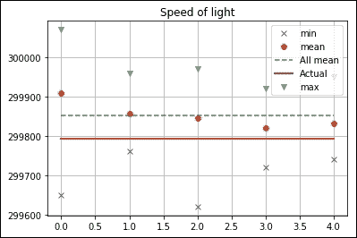
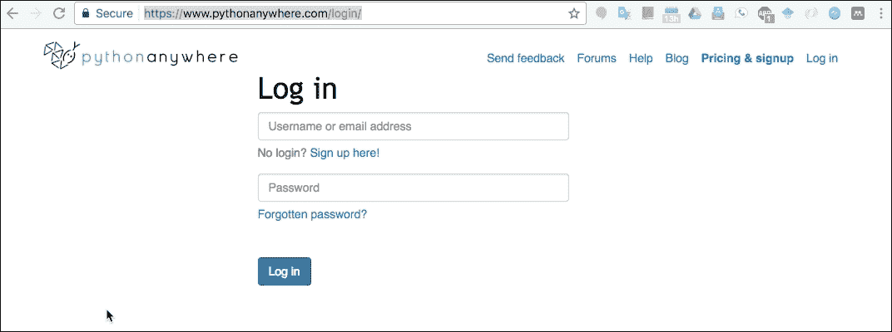
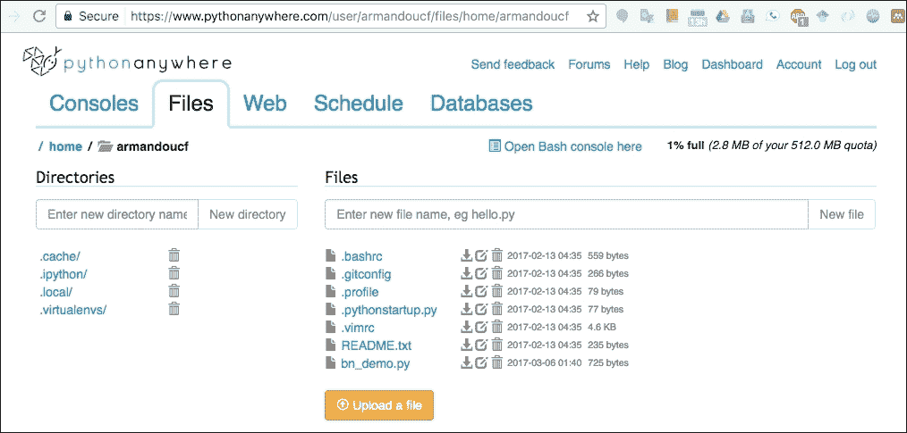

# 第十一章。Python 生态系统和云计算之外的环境

在 Python 生态系统之外，诸如 R、C、Java 和 Fortran 等编程语言相当流行。在本章中，我们将深入研究与这些环境交换信息的细节。

云计算旨在通过互联网提供计算能力。这意味着我们不需要在本地拥有很多强大的硬件。取而代之的是，我们根据当前的需求，按需付费。我们还将讨论如何在云中获取 Python 代码。在快节奏的世界里，这是一个快速发展的行业。我们在这里有很多选择。**亚马逊网络服务** ( **AWS** )故意不在本书中讨论，因为其他书籍，如*用 Python 构建机器学习系统*、*威利·里歇特和路易斯·佩德罗·科埃略*、*帕克特出版*都非常详细地涵盖了这个话题。

[http://datasciencetoolbox.org/](http://datasciencetoolbox.org/)提供的数据科学工具箱，是一个基于 Linux 的数据分析虚拟环境，可以在本地运行，也可以在 AWS 上运行。数据科学工具箱网站上给出的说明非常清楚，应该可以帮助您建立一个预装了大量 Python 包的环境。

本章将涉及的主题如下:

*   用 Matlab/Octave 交换信息
*   安装`rpy2`包装
*   与 R 接口
*   将 NumPy 数组发送到 Java
*   集成 SWIG 和 NumPy
*   集成 Boost 和 Python
*   通过`f2py`使用 Fortran 代码
*   PythonAnywhere 云

# 用 Matlab/Octave 交换信息

**Matlab** 及其开源替代软件 **Octave** 是流行的数值程序和编程语言。Octave 和 Matlab 的语法与 Python 非常相似。事实上，你可以找到比较它们语法的网站(例如，参见[http://wiki.scipy.org/NumPy_for_Matlab_Users](http://wiki.scipy.org/NumPy_for_Matlab_Users))。

### 注

从[http://www.gnu.org/software/octave/download.html](http://www.gnu.org/software/octave/download.html)下载 Octave。

撰写本文时使用的 Octave 版本是 4.2.0。`scipy.io.savemat()`函数将数组保存在符合 Octave 和 Matlab 格式的文件中。该函数接受文件名和带有数组名称的字典，并将值作为参数。参考本书代码包中的`ch-11.ipynb`文件:

```py
import statsmodels.api as sm 
from scipy.io import savemat 

data_loader = sm.datasets.sunspots.load_pandas() 
df = data_loader.data 
savemat("sunspots", {"sunspots": df.values}) 

```

前面的代码将太阳黑子数据存储在一个名为`sunspots.mat`的文件中。扩展名会自动添加。启动八度**图形用户界面** ( **图形用户界面**)或命令行界面。加载我们创建的文件并查看数据，如下所示:

```py
    octave:1> load sunspots.mat
    octave:2> sunspots
    sunspots =
       1.7000e+03   5.0000e+00
       1.7010e+03   1.1000e+01
       1.7020e+03   1.6000e+01

```

# 安装 rpy2 包

**R 编程语言**在统计学家中很受欢迎。它是用 C 和 Fortran 编写的，可以在 GNU **通用公共许可证** ( **GPL** 下获得。r 支持建模、统计测试、时间序列分析、分类、可视化和聚类。**综合 R 档案网** ( **CRAN** )等资源库网站为各种任务提供数千个 R 包。

### 注

从[http://www.r-project.org/](http://www.r-project.org/)下载 R。

`rpy2`包方便了与 Python 中的 R 接口。用`pip`按照以下步骤安装`rpy2`:

```py
$ pip3 install rpy2

```

### 注

如果您已经安装了`rpy2`，请按照[http://rpy.sourceforge.net/rpy2/doc-dev/html/overview.html](http://rpy.sourceforge.net/rpy2/doc-dev/html/overview.html)上的说明进行操作，因为升级不是一个简单的过程。

# 与 R 接口

r 提供了一个包含样本数据集的`datasets`包。`morley`数据集有 1879 年光速测量的数据。光速是一个基本的物理常数，它的值目前已知非常精确。数据描述见。光速值可以在`scipy.constants`模块中找到。R 数据存储在具有三列的 R 数据帧中:

*   实验编号，从一到五
*   运行次数，每个实验运行 20 次，使测量总数达到 100
*   以千米每秒为单位的光速，减去 299，000

`rpy2.robjects.r()`函数在 Python 环境中执行 R 代码。按照以下方式加载数据:

```py
pandas2ri.activate() 
r.data('morley') 

```

Pandas库通过`pandas.rpy.common`模块的 R 接口被否决，因此建议读者使用`rpy2`对象模块。将数据加载到Pandas数据框中，如下所示:

```py
df = r['morley'] 

```

让我们用以下代码通过实验对数据进行分组，这将创建一个 5 乘 2 的 NumPy 数组:

```py
samples = dict(list(df.groupby('Expt'))) 
samples = np.array([samples[i]['Speed'].values for i in samples.keys()]) 

```

当我们有不同实验的数据时，知道这些实验的数据点是否来自同一个分布是很有趣的。 **Kruskal-Wallis 单向方差分析**(参考[http://en . Wikipedia . org/wiki/Kruskal % E2 % 80% 93 Wallis _ 单向方差分析 _of_variance](http://en.wikipedia.org/wiki/Kruskal%E2%80%93Wallis_one-way_analysis_of_variance) )是一种统计方法，分析样本时不需要对其分布做假设。这个测试的零假设是所有样本的中位数都相等。测试在`scipy.stats.kruskal()`功能中实现。按照以下步骤进行测试:

```py
print("Kruskal", kruskal(samples[0], samples[1], samples[2], samples[3], samples[4])) 

```

测试`statistic`和`pvalue`打印在下面一行:

```py
Kruskal KruskalResult(statistic=15.022124661246552,    pvalue=0.0046555484175328015)

```

我们可以拒绝零假设，但这并不能告诉我们哪个或哪些实验有偏离的中位数。进一步的分析留给读者去做。如果我们绘制每个实验的最小值、最大值和平均值，我们会得到下图:



查看本书代码包中的`ch-11.ipynb`文件:

```py
import rpy2.robjects as ro 
from rpy2.robjects import pandas2ri 
from rpy2.robjects import r 

from scipy.stats import kruskal 
import matplotlib.pyplot as plt 
import numpy as np 
from scipy.constants import c 

pandas2ri.activate() 
r.data('morley') 

df = r['morley'] 

df['Speed'] = df['Speed'] + 299000 

samples = dict(list(df.groupby('Expt'))) 
samples = np.array([samples[i]['Speed'].values for i in  
samples.keys()]) 
print("Kruskal", kruskal(samples[0], samples[1], samples[2], samples[3], samples[4])) 

plt.title('Speed of light') 
plt.plot(samples.min(axis=1), 'x', label='min') 
plt.plot(samples.mean(axis=1), 'o', label='mean') 
plt.plot(np.ones(5) * samples.mean(), '--', label='All mean') 
plt.plot(np.ones(5) * c/1000, lw=2, label='Actual') 
plt.plot(samples.max(axis=1), 'v', label='max') 
plt.grid(True) 
plt.legend() 
plt.show() 

```

# 向 Java 发送 NumPy 数组

和 Python 一样，Java 也是一种非常流行的编程语言。我们在[第 8 章](08.html "Chapter 8.  Working with Databases")、*中安装了 Java，作为使用 Cassandra 的先决条件。要运行 Java 代码，我们需要 **Java 运行时环境** ( **JRE** )。开发需要 **Java 开发工具包** ( **JDK** )。*

**Jython** 是用 Java 编写的 Python 的实现。Jython 代码可以使用任何 Java 类。但是，用 C 语言编写的 Python 模块不能在 Jython 中导入。这是一个问题，因为许多数值和数据分析 Python 库都有用 c 语言编写的模块。`JPype1`包提供了一个解决方案，可以从[http://pypi.python.org/pypi/JPype1](http://pypi.python.org/pypi/JPype1)或[http://github.com/originell/jpype](http://github.com/originell/jpype)下载。您可以使用以下命令安装`JPype1`:

```py
$ pip3 install JPype1 

```

用以下代码启动 **Java 虚拟机** ( **JVM** ):

```py
jpype.startJVM(jpype.getDefaultJVMPath()) 

```

用一些随机值创建一个 JPype 数组`JArray`:

```py
values = np.random.randn(7) 
java_array = jpype.JArray(jpype.JDouble, 1)(values.tolist()) 

```

按如下方式打印每个数组元素:

```py
for item in java_array: 
   jpype.java.lang.System.out.println(item) 

```

最后，我们应该关闭 JVM，如下所示:

```py
jpype.shutdownJVM() 

```

以下是本书代码包中`ch-11.ipynb`文件的代码列表:

```py
import jpype 
import numpy as np 
from numpy import random 
jpype.startJVM(jpype.getDefaultJVMPath()) 

random.seed(44) 
values = np.random.randn(7) 
java_array = jpype.JArray(jpype.JDouble, 1)(values.tolist()) 

for item in java_array: 
   jpype.java.lang.System.out.println(item) 

jpype.shutdownJVM() 

```

当您在 Jupyter 笔记本中执行上述代码时，您会在 Jupyter 控制台中获得以下输出:

```py
[W 18:23:45.918 NotebookApp] 404 GET /nbextensions/widgets/notebook/js/extension.js?v=20170305114358 (::1) 4.30ms referer=http://localhost:8888/notebooks/ch-12.ipynb
-0.7506147172558728
1.3163573247118194
1.2461400286434303
-1.6049157412585944
-1.468143678979905
-1.7150704579733684
1.8587836915125544
JVM activity report     :
classes loaded       : 32
JVM has been shutdown

```

# 集成 SWIG 和 NumPy

c 是 1970 年左右开发的一种广泛使用的编程语言。C 语言存在多种方言，C 语言影响了其他编程语言。c 不是面向对象的。这导致了 C++的产生，这是一种具有 C 特性的面向对象语言，因为 C 是 C++的子集。C 和 C++是编译语言。我们需要编译源代码来创建所谓的目标文件。之后，我们必须链接对象文件来创建动态共享库。

集成 C 和 Python 的好处是我们有很多选择。第一个选项是**简化包装器和接口生成器** ( **SWIG** )。SWIG 在开发过程中增加了一个额外的步骤，那就是在 Python 和 C(或 C++)之间生成胶水代码。从[http://www.swig.org/download.html](http://www.swig.org/download.html)下载 SWIG。在撰写本文时，最新的 SWIG 版本是 3.0.12。安装 SWIG 的前提是安装 **Perl 兼容正则表达式** ( **PCRE** )。PCRE 是一个 C 正则表达式库。从[http://www.pcre.org/](http://www.pcre.org/)下载 PCRE。撰写本文时的 PCRE 版本为 8.39。打开 PCRE 后，运行以下命令:

```py
$ ./configure
$ make
$ make install

```

前面片段中的最后一个命令需要`root`或`sudo`访问。我们可以用同样的命令安装 SWIG。我们从编写包含函数定义的头文件开始。编写一个头文件，定义以下函数:

```py
double sum_rain(int* rain, int len); 

```

我们将使用前面的函数对我们在上一章中分析的`rain`金额值求和。请参考本书代码包中的`sum_rain.h`文件。该功能在本书的代码包中的`sum_rain.cpp`文件中实现:

```py
double sum_rain(int* rain, int len) { 

  double sum = 0.; 

  for (int i = 0; i < len; i++){ 
    if(rain[i] == -1) { 
       sum += 0.025; 
    } else { 
      sum += 0.1 * rain[i]; 
    } 
  } 

  return sum; 
} 

```

定义以下 SWIG 接口文件(参考本书代码包中的`sum_rain.i`文件):

```py
%module sum_rain 

%{ 
  #define SWIG_FILE_WITH_INIT 
  #include "sum_rain.h" 
%} 

%include "/tmp/numpy.i" 

%init %{ 
  import_array(); 
%} 

%apply (int* IN_ARRAY1, int DIM1) {(int* rain, int len)}; 

%include "sum_rain.h" 

```

前面的代码依赖于`numpy.i`界面文件，可以在[https://github . com/numpy/numpy/blob/master/tools/swig/numpy . I](https://github.com/numpy/numpy/blob/master/tools/swig/numpy.i)找到。在这个例子中，文件被放在`/tmp`目录中，但是我们几乎可以把这个文件放在任何地方。使用以下命令生成 SWIG 粘合代码:

```py
$ swig -c++ -python sum_rain.i

```

上一步创建了一个`sum_rain_wrap.cxx`文件。如下编译`sum_rain.cpp`文件:

```py
$ g++ -O2 -fPIC -c sum_rain.cpp -I<Python headers dir>

```

在前面的命令中，我们需要指定实际的 Python C 头文件目录。我们可以通过以下命令找到它:

```py
$ python3-config --includes

```

我们也可以使用以下命令进行编译:

```py
$ g++ -O2 -fPIC -c sum_rain.cpp $(python3-config --includes)

```

该目录的位置将根据 Python 版本和操作系统而有所不同(类似于`/usr/include/python3.6`)。如下编译生成的 SWIG 包装文件:

```py
$ g++ -O2 -fPIC -c sum_rain_wrap.cxx $(python3-config --includes)  -I<numpy-dir>/core/include/

```

前面的命令取决于安装的 NumPy 的位置。从 Python 外壳中找到它，如下所示:

```py
$ python3
>>> import numpy as np
>>> np.__file__

```

屏幕上打印的字符串应该包含 Python 版本，`site-packages`，以`__init__.pyc`结尾。如果去掉最后一部分，我们应该有 NumPy 目录。或者，我们可以使用以下代码:

```py
>>> from imp import find_module
>>> find_module('numpy')

```

在我的计算机上，发出以下命令:

```py
$ g++ -O2 -fPIC -c sum_rain_wrap.cxx $(python3-config --includes) -I/usr/local/lib/python3.6/site-packages/numpy/core/include/

```

最后一步是链接通过编译创建的目标文件:

```py
$ g++ -lpython3.6 -dynamiclib sum_rain.o sum_rain_wrap.o -o _sum_rain.so -L /usr/local/Cellar/python3/3.6.0/Frameworks/Python.framework/Versions/3.6/lib

```

除非我们使用 Cygwin，否则前面的步骤在其他操作系统(如窗口)上的工作方式会有所不同。如果需要，建议您在 SWIG 用户邮件列表([http://www.swig.org/mail.html](http://www.swig.org/mail.html))或 StackOverflow 上寻求帮助。

用本书代码包中的`swig_demo.py`文件测试创建的库:

```py
from _sum_rain import * 
import numpy as np 

rain = np.load('rain.npy') 
print("Swig", sum_rain(rain)) 
rain = .1 * rain 
rain[rain < 0] = .025 
print("Numpy", rain.sum()) 

```

使用以下命令执行此文件:

```py
$ python3 swig_demo.py

```

如果一切顺利，并且我们没有混淆 Python 安装，将打印以下行:

```py
Swig 85291.554999999328
Numpy 85291.55

```

# 集成 Boost 和 Python

**Boost** 是一个可以和 Python 接口的 C++库。从[http://www.boost.org/users/download/](http://www.boost.org/users/download/)下载。撰写本文时的 Boost 版本是 1.63.0。最简单但也是最慢的安装方法包括以下命令:

```py
$ ./bootstrap.sh --prefix=/path/to/boost
$ ./b2 install

```

`prefix`参数指定安装目录。在本例中，我们将假设 Boost 安装在名为 Boost 的目录(如`~/Boost`)中用户的`home`目录下。在该目录中，将创建一个`lib`和`include`目录。对于 Unix 和 Linux，您应该运行以下命令:

```py
export LD_LIBRARY_PATH=$HOME/Boost/lib:${LD_LIBRARY_PATH}

```

在 Mac OS X 上，设置以下环境变量:

```py
export DYLD_LIBRARY_PATH=$HOME/Boost/lib 

```

在我们的例子中，我们将这个变量设置如下:

```py
export DYLD_LIBRARY_PATH=/usr/local/Cellar/boost/1.63.0/lib

```

重新定义本书代码包中`boost_rain.cpp`文件中给出的 rain 求和函数:

```py
#include <boost/python.hpp> 

double sum_rain(boost::python::list rain, int len) { 

  double sum = 0.; 

  for (int i = 0; i < len; i++){ 
    int val = boost::python::extract<int>(rain[i]); 
    if(val == -1) { 
       sum += 0.025; 
    } else { 
      sum += 0.1 * val; 
    } 
  } 

  return sum; 
} 

BOOST_PYTHON_MODULE(librain) { 
    using namespace boost::python; 

    def("sum_rain", sum_rain); 
} 

```

该函数接受 Python 列表和列表的大小。从 Python 中调用该函数，如本书代码包中的`rain_demo.py`文件所示:

```py
import numpy as np 
import librain 

rain_data = np.load('rain.npy') 
print("Boost", librain.sum_rain(rain_data.astype(int).tolist(), len(rain_data))) 
rain_data = .1 * rain_data 
rain_data[rain_data < 0] = .025 
print("Numpy", rain_data.sum()) 

```

我们将使用本书代码包中的`Makefile`文件来自动化开发过程:

```py
CC = g++ 
PYLIBPATH = $(shell python3-config --exec-prefix)/lib 
LIB = -L$(PYLIBPATH) $(shell python3-config --libs) -L/usr/local/Cellar/boost/1.63.0/lib -L/usr/local/Cellar/boost-python/1.63.0/lib -lboost_python3 
OPTS = $(shell python3-config --include) -O2 -I/usr/local/Cellar/boost/1.63.0/include 

default: librain.so 
  @python3 ./rain_demo.py 

librain.so: rain.o 
  $(CC) $(LIB)  -Wl,-rpath,$(PYLIBPATH) -shared $< -o $@ 

rain.o: boost_rain.cpp Makefile 
  $(CC) $(OPTS) -c $< -o $@ 

clean: 
  rm -rf *.so *.o 

.PHONY: default clean 

```

从命令行运行以下命令:

```py
$ make clean;make

```

结果如预期的一样:

```py
Boost 85291.54999999328
Numpy 85291.55 

```

# 通过 f2py 使用 Fortran 代码

**Fortran** (源自公式翻译)是一种成熟的编程语言，主要用于科学计算。它是在 20 世纪 50 年代开发的，出现了更新的版本，如 Fortran 77、Fortran 90、Fortran 95、Fortran 2003 和 Fortran 2008(参考[http://en.wikipedia.org/wiki/Fortran](http://en.wikipedia.org/wiki/Fortran))。每个版本都增加了特性和新的编程范例。这个例子我们需要一个 Fortran 编译器。`gfortran`编译器是 GNU Fortran 编译器，可以从[http://gcc.gnu.org/wiki/GFortranBinaries](http://gcc.gnu.org/wiki/GFortranBinaries)下载。

NumPy `f2py`模块作为 Fortran 和 Python 之间的接口。如果有一个 Fortran 编译器，我们可以使用这个模块从 Fortran 代码创建一个共享库。我们将编写一个 Fortran 子程序，用于对前面例子中给出的降雨量值进行求和。定义子例程，并将其存储在 Python 字符串中。之后，我们可以调用`f2py.compile()`函数，从 Fortran 代码中产生一个共享库。最终产品在本书代码包的`fort_src.py`文件中:

```py
from numpy import f2py 
fsource = ''' 
       subroutine sumarray(A, N) 
       REAL, DIMENSION(N) :: A 
       INTEGER :: N 
       RES = 0.1 * SUM(A, MASK = A .GT. 0) 
       RES2 = -0.025 * SUM(A, MASK = A .LT. 0) 
       print*, RES + RES2 
       end  
 ''' 
f2py.compile(fsource,modulename='fort_sum',verbose=0) 

```

使用以下命令执行文件以生成模块:

```py
$ python3 fort_src.py

```

调用本书代码包中`fort_demo.py`文件给出的子程序:

```py
import fort_sum 
import numpy as np 
rain = np.load('rain.npy') 
fort_sum.sumarray(rain, len(rain)) 
rain = .1 * rain 
rain[rain < 0] = .025 
print("Numpy", rain.sum()) 

```

使用以下命令执行文件以生成输出:

```py
$ python3 fort_demo.py

```

Fortran 和 NumPy 的结果符合预期(我们可以忽略 Fortran 子程序打印的最后两位数字):

```py
85291.5547
Numpy 85291.55

```

# PythonAnywhere 云

**Python 这里**是 Python 开发的云服务。该界面完全基于网络，模拟了 Bash、Python 和 IPython 控制台。Python 网络环境中预先安装的 Python 库列在[https://www.pythonanywhere.com/batteries_included/](https://www.pythonanywhere.com/batteries_included/)上。

软件版本可能会稍微落后于可用的最新稳定版本。在撰写本文时，从 PythonAnywhere Bash 控制台安装 Python 软件似乎有点问题，不建议这样做。

当您第一次访问网址[https://www.pythonanywhere.com/login/](https://www.pythonanywhere.com/login/)时，您将看到以下屏幕以登录到 PythonAnywhere 环境:



提交登录名和密码后，您将看到以下 web 应用程序屏幕:


建议您上传 Python 源文件，而不是使用 PythonAnywhere 环境，因为它的响应速度不如我们的本地环境。通过点击网络应用程序中的**文件**标签上传文件。从本章上传`bn_demo.py`文件:



要执行程序，点击`bn_demp.py`文件，然后点击屏幕右上角的**运行**按钮:


您将在控制台的代码列表下方看到输出:


# 总结

在这一章中，我们考察了 Python 的边界。在 Python 生态系统之外，诸如 R、C、Java 和 Fortran 等编程语言相当流行。我们查看了提供连接 Python 和外部代码的粘合剂的库，R 的`rpy2`，C 的【SWIG 和 Boost】，Java 的`JPype`，以及 Fortran 的`f2py`。云计算旨在通过互联网提供计算能力。本文还简要介绍了 Python 的一个专门的云计算服务。

下一章，[第 12 章](12.html "Chapter 12.  Performance Tuning, Profiling, and Concurrency")、*性能调优、性能分析和并发*，给出了提高性能的提示。通常，我们可以通过使用并行化或用 c 语言重写部分代码来优化代码，从而加快 Python 代码的速度。我们还将讨论几种分析工具和并发 API。