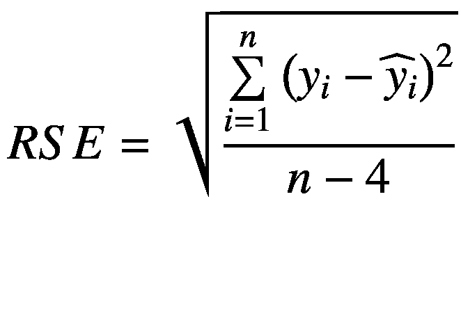
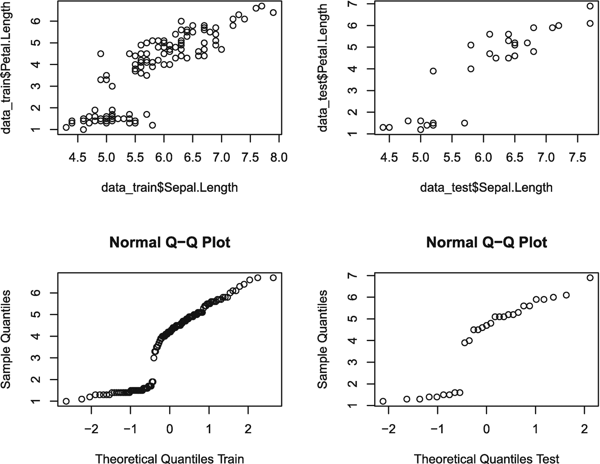
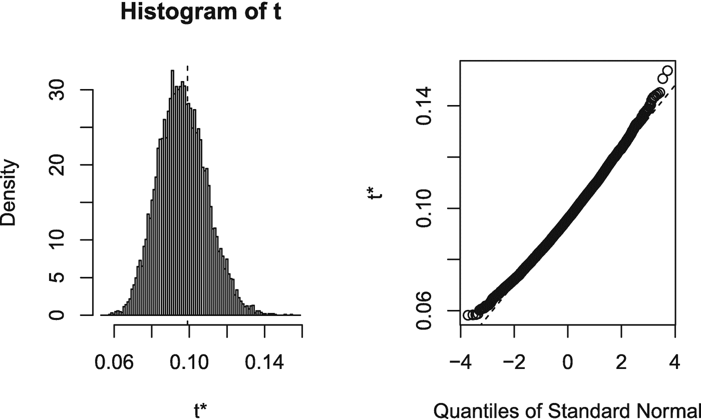
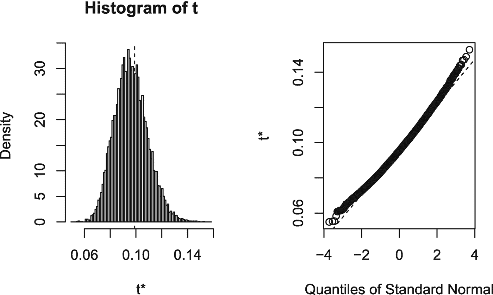

# 六、ML：简介

机器学习(ML)是一个相当无定形的，至少在作者看来，是计算机辅助统计的工具包。虽然我们的最终目标将是支持向量机、分类和回归树，以及使用一些最新`R`包的人工神经网络，但在它们的核心，机器学习只是各种味道的模式识别。

这一介绍性章节的两个焦点，理解样本结构和介绍并行处理，试图为机器学习奠定基础。每个工作流和项目都是不同的，因此我们的意图是深入第 [6](06.html) 章中的数据将会发生什么，一旦我们的脚湿了，就在下一章中后退一步，适当地清理并设置和减少我们的数据，最后在第三幕中进行一些真正的机器学习。

亲爱的读者，如果你熟悉训练/验证/测试数据集、引导和并行/多核处理，请随意跳到下一章。另一方面，如果你是一名受过更传统训练的统计学家，来自一位作者深情地回忆的舒适的查找表世界，那么准备好以一种与以前截然不同的方式思考数据。

在任何情况下，在这一章中，我们假装数据干净、小而整洁地来到我们面前——选择这个词是因为我们使用了`tibbles`和名为`tidyverse`的新 uberpackage 的其他元素，它组合了几个对数据管理有用的包[111]。也许在我们机器学习的探索中，它会更有用。现在，看一下设置和库调用，我们将介绍本章中使用的其他包。

```py
library(checkpoint)
checkpoint("2018-09-28", R.version = "3.5.1",
  project = book_directory,
  checkpointLocation = checkpoint_directory,
  scanForPackages = FALSE,
  scan.rnw.with.knitr = TRUE, use.knitr = TRUE)

library(knitr)
library(tidyverse)
library(rsample)
library(data.table)
library(boot)
library(parallel)
library(foreach)
library(doParallel)

options(width = 70, digits = 3)

```

像往常一样，我们使用几个包，并在这里简要讨论新增加的内容。`rsample`包[52]允许简单的重采样，而`boot`包为我们处理通用引导程序[26]。`parallel`包提供了在多个内核上并行运行计算的功能，从而缩短了得出结果的时间[76]。`foreach`包是众所周知的 for 循环的变体，它有助于并行化[63]。最后(目前)，`doParallel`包允许`foreach`实际使用并行化。

## 6.1 培训和验证数据

我们从`iris`样本和一个关于数据的词开始。iris 数据集有 150 个完美的观察值。在机器学习中，一个风险是机器对我们的样本数据学习得太好，然后在真实世界的测试中不太准确。这被称为过度训练或过度适应。换句话说，我们用来估计模型和现实生活之间可能的误差的标准可能太乐观，太小了。一种解决方案是将数据分成两部分。一个是训练片，展示给机器看。另一个是测试部分，作为储备，用于以后评估该模型对新数据或“野生”数据的处理效果。没有什么是不需要权衡或成本的，使用这种技术，挑战是一样的，提供的数据越多，机器应该做得越好。常见的比率包括 80/20、75/25 或 70/30，大部分数据在训练样本中，而较小的一组数据则用于测试。事实上，为了阻止甚至是人为的偏见，在进行探索性数据分析之前进行分割可能是推荐的。

这里值得花点时间来讨论一下这个理论框架。从技术上讲，如果我们遵循这个逻辑结论，有三个数据是有意义的。一组训练集是数据的主体，用于探索性数据分析和模型训练。第二部分，一个较小的集合，将用于验证模型，看看它做得有多好。由于我们可能会从几个模型中进行选择，此验证集(不用于训练模型)可用于在线性拟合和二次拟合之间或者在人工神经网络和随机森林之间做出决定。由于这种验证数据本质上仍将用于模型选择，它在技术上仍是拟合过程的一部分，因此不能真正给出新数据的真实性能。最后，第三部分将被保留到最后，只用于评估模型在面对真实世界的新数据时的误差。

这当然需要足够的数据来牺牲。对于我们在机器学习中的例子，我们并没有忽视这种关注。相反，我们是在本地假设下展示任何单一计算或技术背后的机制，即所研究的技术已经通过文献或一些其他过程被确定为最佳前进方式。未能保留最终的第三个测试集可能是机器学习技术在面对新数据时表现不佳的一个原因(当然，这不是唯一的原因)。

在我们的示例中，使用 80/20 分割可能是有意义的。我们使用基数为`R`的函数`set.seed(5)`来确定`rsample`重采样函数使用的随机数发生器。这允许感兴趣的读者精确复制值。使用的函数是`initial_split()`，它接受要分割的数据的参数以及要设置到训练集中的数据的比例。鉴于我们的具体情况，在`iris`的 150 行中，我们保留 29 行作为我们的测试集，保留 80%用于模型构建和训练。

```py
set.seed(5)
case_data <- initial_split(data = iris, prop = 0.8)
case_data

## <121/29/150>

```

这种重采样实际上是随机抽取数据——这很重要，因为如果数据以某种方式排序，它可能会过度影响模型，尤其是因为我们拆分了数据。我们没有选择在这个重采样分割中使用任何`strata`。如果这对数据很重要，那么这些层将根据给定的比例进行分割。从`case_data`对象中，我们通过`rsample`包中的相关函数调用来提取我们的训练和测试数据。此外，我们使用来自`tidyverse`的`glimpse()`来查看我们的训练数据集。

```py
data_train <- training(case_data)
data_test <- testing(case_data)
glimpse(data_train)

## Observations: 121
## Variables: 5
## $ Sepal.Length <dbl> 5.1, 4.9, 4.7, 4.6, 5.0, 5.4, 4.6, 5.0, 4.4,...
## $ Sepal.Width  <dbl> 3.5, 3.0, 3.2, 3.1, 3.6, 3.9, 3.4, 3.4, 2.9,...
## $ Petal.Length <dbl> 1.4, 1.4, 1.3, 1.5, 1.4, 1.7, 1.4, 1.5, 1.4,...
## $ Petal.Width  <dbl> 0.2, 0.2, 0.2, 0.2, 0.2, 0.4, 0.3, 0.2, 0.2,...
## $ Species      <fct> setosa, setosa, setosa, setosa, setosa, seto...

```

注意我们有四个类型为`double`的列，我们确实看到有一个用于`species`的因子列。经过进一步检查，这些竟是三种鸢尾花。

```py
unique(data_train$Species)

## [1] setosa     versicolor virginica
## Levels: setosa versicolor virginica

```

为了将重点放在 ML 和支持合理快速 ML 的计算机环境中使用样本的方式上，我们将一个简单的线性模型拟合到我们的数值数据中，以展示考虑样本数据结构的三种不同方式。目的是提供一个可操作的例子，作为理解这三种方法的一种透镜。

本文之前已经拟合过线性模型，因此我们只注意到该模型是线性拟合，其中数据集中可用的四个数字变量中的三个用于预测第四个变量`Petal.Length`。

```py
length.lm = lm(Petal.Length ~ Sepal.Length +
                 Sepal.Width + Petal.Width,
               data = data_train)
length.lm

##
## Call:
## lm(formula = Petal.Length ~ Sepal.Length + Sepal.Width + Petal.Width,
##     data = data_train)
##
## Coefficients:
##  (Intercept)  Sepal.Length   Sepal.Width   Petal.Width
##       -0.274         0.723        -0.630         1.466

summary(length.lm)

##
## Call:
## lm(formula = Petal.Length ~ Sepal.Length + Sepal.Width + Petal.Width,
##     data = data_train)
##
## Residuals:
##     Min      1Q  Median      3Q     Max
## -1.0349 -0.1699 -0.0061  0.1976  0.5751
##
## Coefficients:
##              Estimate Std. Error t value Pr(>|t|)
## (Intercept)   -0.2735     0.3091   -0.88     0.38
## Sepal.Length   0.7230     0.0609   11.87  < 2e-16 ***
## Sepal.Width   -0.6298     0.0715   -8.81  1.3e-14 ***
## Petal.Width    1.4661     0.0700   20.93  < 2e-16 ***
## ---
## Signif. codes:  0 '***' 0.001 '**' 0.01 '*' 0.05 '.' 0.1 '␣' 1
##
## Residual standard error: 0.299 on 117 degrees of freedom
## Multiple R-squared:  0.971,  Adjusted R-squared:  0.97
## F-statistic: 1.32e+03 on 3 and 117 DF,  p-value: <2e-16

```

剩余标准误差(RSE)为 0.299，RSE 可视为回归线的 y 高度与定型集中各点的实际 y 高度之间的一种平均值。接近零的值比远离零的值更可取(就告诉我们我们模型的一些功效而言)。形式上，方程[47]，这是一个真正伟大的文本背后的所有这些更深层次的理论，给出如下:



(6.1)

翻译成`R`，我们在这里展示代码:

```py
sqrt(
  sum(
    (fitted(length.lm)-data_train$Petal.Length)^2
  )/(nrow(data_train)-4)
)

## [1] 0.299

```

在这两种情况下，请注意除法部分的数据集大小减去了变量的数量(在我们的例子中是 4)。虽然免费为我们提供这个值有点儿`R`,但均方差(MSE)可能是一种更常见的测量拟合优度或质量的方法。这两个等式本质上是相同的，因为在本质上，它们都涉及由模型生成的 y 高度减去在给定成对输入值的数据中找到的 y 高度。由于`R`已经为我们存储了模型的这些残差，代码看起来有点不同，但是一个快速的实验会显示前面代码的第三行和后面的`mean()`中的参数是相同的。

```py
mse_train<- mean(length.lm$residuals^2)
mse_train

## [1] 0.0862

```

这两种度量都是以原始数据为单位的，并且这两种度量都有一个关键缺陷。它们是在训练数据上测量的，并且模型被专门训练为在这些相同的数据上表现良好。这是样本内精度测量的一个示例，它不太可能是我们的模型在野生或真实世界数据上表现如何的一个很好的估计器。不是从训练数据计算 MSE(或者实际上任何类型的拟合优度度量),同时拥有训练和测试数据的目的正是为了让我们能够根据训练中没有使用的数据来估计模型性能。我们很自然地转向我们的`data_test`。

如果我们在测试数据上测量相同类型的 y 值差异，我们会看到两种情况下的数字都更大。这给了我们一些证据，我们有一个模型犯了过度拟合。这也是一个很大的激励因素，说明考虑模型时不仅要考虑样本内数据，还要考虑样本外数据是多么重要。

```py
sqrt(
  sum(
    (predict(length.lm, data_test)-data_test$Petal.Length)^2
  )/(nrow(data_test)-2)
)

## [1] 0.41

mse_test <- mean((predict(length.lm, data_test) -
                  data_test$Petal.Length)^2)
mse_test

## [1] 0.156

```

这种训练与测试过程是关键。任何好的模型的目标都是具有小的残差。事实上，作为模型系数选择的一部分，训练数据的残差通常被最小化，因此，我们不是从训练样本内部的数据来看 MSE，而是从样本外部的数据来看测试数据 MSE。这可以帮助我们理解我们的模型可能如何执行。请记住，正如在开始时提到的，我们目前并不确定这个模型是好是坏。我们真的在使用我们的测试数据来理解我们的模型在部署后如何支持真实世界的使用。如果我们要根据测试数据修改我们的模型，同样，我们实际上需要保留三组数据。

记住，MSE 是原始数据单位的平方。因此，虽然测试数据的 MSE 高于训练数据——实际上几乎是两倍——但它仍然足够好，可以继续进行。有时，任何种类的可操作数据都比没有好，测试 MSE 较高的事实可能只是警告我们的用户在使用模型数据来通知决策时要小心。它还取决于所使用的数据类型。例如，大学入学趋势可能比健康结果更能容忍错误。在这些花数据的情况下，这些数据是以平方厘米为单位的，我们的测试数据表明我们可能会偏离大约半厘米，而训练数据声称可能只偏离四分之一厘米。

我们有一个模型，我们知道它在现实世界中的表现。然而，我们确实损失了 29 个数据点的价值。如果我们能够得到样本外的 MSE 估计值，并且仍然拥有全部 150 个数据点，那就太好了。损失的一部分不仅仅是我们的模型可能在多 20%的数据下做得更好。那就是特定的数据分割，虽然是随机的，但可能仍然有点极端，我们的意思是我们选择在小数据集上分割数据的位置，即使是随机的，也可能影响我们的最终结果。

仅在两个维度上考虑我们的测试与训练数据。在图的顶行，可以看到我们的输入仅仅是`Sepal.Length`与我们的输出`Petal.Length`在训练与测试中有一些不同的范围。Q-Q 图的第二行证实了这些样品在图 [6-1](#Fig1) 中看起来确实略有不同。

```py
par(mfrow=c(2,2))
plot(data_train$Sepal.Length, data_train$Petal.Length)
plot(data_test$Sepal.Length, data_test$Petal.Length)
qqnorm(data_train$Petal.Length,
       xlab = "Theoretical Quantiles Train")
qqnorm(data_test$Petal.Length,
       xlab = "Theoretical Quantiles Test")

```

即使是六位数的总结也显示测试数据与我们的样本数据略有不同:

```py
summary(data_train$Sepal.Length)

##    Min. 1st Qu.  Median    Mean 3rd Qu.    Max.
##     4.3     5.1     5.7     5.8     6.3     7.9

summary(data_test$Sepal.Length)

##    Min. 1st Qu.  Median    Mean 3rd Qu.    Max.
##    4.40    5.20    6.10    6.02    6.50    7.70

```

因此，虽然我们可能有比只看训练数据 MSE 更好的想法，我们的真实世界 MSE 可能是什么，但我们受`set.seed(5)`数据拉动的支配。我们这样做的两个风险是基于样本分割的潜在高方差，在其他条件相同的情况下，如果在 121 和 150 个观察值之间进行选择，我们预计基于 150 个观察值训练的模型会更好一些。

我们在这一部分的目标是激发对单独的训练和测试数据的需求。在这个过于简单的案例中，我们的测试数据可能会让我们对我们训练过的模型在现实世界中的表现有所了解。但是一般来说，我们会因为丢失数据而牺牲很多。我们如何做得更好，尤其是对于较小的样本？



图 6-1

一些数据的 2D 和 Q-Q 图

## 6.2 重采样和交叉验证

解决这个问题的方法是所谓的交叉验证。我们不是只做一次训练/测试分割，而是做多次。

有几种方法可以完成这个过程。与其将我们的数据分成两部分，不如让我们设想 5 部分，每部分包含我们的 iris 数据集的 30 个观察值。我们将前四个箱合并在一起以形成我们的训练集，同时保留箱 5 作为测试。将模型拟合到训练集，并计算测试集的 MSE。重复这个过程五次，接下来我们只保留 bin 4 作为我们的测试集，合并 1-3 和 5 作为我们的训练集，依此类推。我们依次从每个箱中获得五个不同的 MSE 值。如果我们平均这些，我们现在有所谓的交叉验证 MSE(有时称为 CV)。

虽然可能有一些软件包为我们做了这种计算，但偶尔让我们亲自动手看看到底发生了什么也是有帮助的。首先，我们将我们的虹膜样本随机放入一个变量中，我们称之为`crossData`，没有替换(这确保我们的箱不以任何方式排序)。我们通过`tidyverse`包中的`sample_n()`函数来实现。通过使用`%>%`管道操作符，我们不必将数据集作为函数的第一个参数。一旦我们的数据被打乱，我们就添加一个列，把它分成五个箱。选择 5 是因为它很小，能很好地分成 150，我们喜欢它。另外，调用一个`store`变量来保存 MSEs。

```py
crossData <- iris %>%
  sample_n(nrow(iris), replace = FALSE)
crossData <- add_column(crossData,
  Bin = cut(1:150, breaks = 5, labels = c(1:5)))
store <- tibble(Fold=1:5, MSE=NA_integer_)

```

现在我们使用一个 for 循环来遍历我们的五个 bin。我们这样做五次，因为我们有五个箱，每次我们都留出一个箱作为测试数据，如上所述。在交叉验证的说法中，折叠的数量是我们的 K 数，这被称为 K 折叠(或在我们的情况下为 5 折叠)。这个 for 循环的每一次传递都代表我们数据的一个“折叠”。我们系统地通过我们的数据来训练我们的线性模型，计算保留的测试箱上的 MSE，将该 MSE 存储在我们的`store`变量中，并移动到下一个折叠。

```py
for(i in 1:5){
  data_train<-crossData %>% filter(Bin != i)
  data_test<-crossData %>% filter(Bin == i)
  lengthFold.lm = lm(Petal.Length ~ Sepal.Length +
                      Sepal.Width + Petal.Width,
                     data = data_train)
  store[i,]$MSE <- mean((predict(lengthFold.lm, data_test) -
                           data_test$Petal.Length)^2)
}

```

现在我们得到了所有五次折叠的平均标准误差。请注意，这个 MSE 来自我们的折叠测试部分，因此这可能会给我们一个很好的想法，即我们可能会期望一个根据所有数据训练的模型在现实生活中对新输入的数据进行处理。

```py
mse_k <- mean(store$MSE)
mse_k

## [1] 0.109

```

在这种情况下，MSE 约为 0.109，这小于我们在前面章节中只有一组训练/测试数据时的估计值。

当进行 K 折叠和交叉验证时，我们使用的模型不是单个折叠模型，而是一个基于所有数据训练的模型，我们看到样本外估计值与样本内估计值的 MSEs 相当接近。因此，虽然我们的交叉验证 MSE 比我们的完整数据集 MSE 大一点，但它们彼此之间并不是不可能远离的，至少对于花瓣长度这样的东西来说不是太远。

```py
lengthFold.lm <- lm(Petal.Length ~ Sepal.Length +
                   Sepal.Width + Petal.Width,
                   data = iris)
lengthFold.lm

##
## Call:
## lm(formula = Petal.Length ~ Sepal.Length + Sepal.Width + Petal.Width,
##     data = iris)
##
## Coefficients:
##  (Intercept)  Sepal.Length   Sepal.Width   Petal.Width
##       -0.263         0.729        -0.646         1.447

mse_ALL <- mean(lengthFold.lm$residuals^2)
mse_ALL

## [1] 0.099

```

请注意，在存储的每个折叠的 MSE 值中(其中模型适合于其他箱，因此这是 for 循环每次迭代的真正样本外测试)，我们有一个从 0.075 到 0.18 的很大范围，这只是显示了单个测试/训练数据集的风险！这又回到了我们之前的警告，当将太多的数据集划分给测试数据集时，较小的数据集会有一点风险。

```py
store

## # A tibble: 5 x 2
##    Fold    MSE
##   <int>  <dbl>
## 1     1 0.180
## 2     2 0.109
## 3     3 0.0822
## 4     4 0.0746
## 5     5 0.101

```

现在，我们没有理由不能只做 4 次折叠，甚至 100 次折叠(进行一些代码编辑),因此一般称为 K-Fold，K 可以是从 1(没有数据分割)、2(我们的第一个例子是一个特殊的加权情况)到 n(这也是一个特殊情况，称为留一个交叉验证或 LOOCV)中选择的任何数字。最后一件要注意的事，好吧，注意到一段时间后就忘了，是关于我们的 for 循环。虽然我们是按顺序运行的，即 1、2、3、4、5，但我们没有理由必须这样运行。换句话说，迭代 2 不依赖于迭代 1。如果我们要拟合一个复杂的模型或者拟合更多的数据，我们的 for 循环每次运行都需要一些时间。尽管如此，只要我们得到 fold-MSEs 表，每次运行都是独立的。再次注意到这一点，现在马上忘记它。

k 倍似乎是一个体面的技术，它是。我们能够在一个完整的数据集上训练一个模型，但我们仍然对我们的模型在样本之外的数据上的表现有所了解。然而，虽然这对于我们正在使用的线性模型来说可能是很好的，但取决于我们真正部署的实际机器学习模型，K-Fold 模型和在完整数据集上使用的模型之间可能没有明显的联系。或者至少，我们可能不想处理这样一个事实，即我们在整个数据集上部署的模型很可能是基于与任何单个 K 倍模型相当不同的系数权重构建的。我们该如何解决这个问题？

还要注意，虽然 K-Fold 模型可以工作，但它确实比我们的简单训练/测试模型需要更多的计算能力。我们从只拟合一个模型到拟合六次模型。就工作量而言，这可能是一个相当大的增长。因此，当我们考虑允许我们的模型在整个数据集上训练并从完全训练的模型中获得我们的误差估计的方法时，要认识到每一种改进都取决于机器技术的提高。

## 6.3 引导

我们现在把注意力转向另一项技术，即自举。在我们刚刚使用的 K-Fold 或交叉验证技术中，虽然最终我们确实从样本外数据中获得了我们的“真实”MSE 估计，但每个模型都是使用不到一个完整的数据集样本构建的，这意味着每个模型可能都有点弱。因此，我们的误差估计虽然比 pass 好，但可能仍然比它需要的更强。

Bootstrap 用不同的方式解决这个问题。假设我们的样本，最初的`iris`样本是从鸢尾花群体中精心抽取的样本，我们可以假设，如果我们从`iris`重新取样，替换，并做很多很多次，我们应该会看到一个看起来非常接近群体的整体。

首先，我们编写一个函数，它是我们自举中感兴趣的统计量。我们之前已经知道 MSE 是什么了。注意我们每次都符合模型。我们的函数将获取一个数据集，计算线性模型，然后计算样本内 MSE 并返回该值。想必我们会在别处收集，事实上我们会！

```py
mse <- function(data, i) {
  lengthBoot.lm <- lm(Petal.Length ~ Sepal.Length +
                      Sepal.Width + Petal.Width,
                      data=data[i,])
  return(mean(lengthBoot.lm$residuals^2))
}

```

现在，使用来自`library(boot),`的函数`boot()`，我们运行引导程序。正在发生的是，这个函数通过替换，从我们的虹膜数据样本中进行重采样。事实上，它这样做了一万次。每次，重采样都被发送到我们的`mse()`函数，该模型的 MSE 返回值存储在`bootResults`中。

```py
bootResults <- boot(data=iris, statistic=mse, R=10000)
bootResults

##
## ORDINARY NONPARAMETRIC BOOTSTRAP
##
##
## Call:
## boot(data = iris, statistic = mse, R = 10000)
##
##
## Bootstrap Statistics :
##     original   bias    std. error
## t1*    0.099 -0.00263      0.0129

```

我们可以用数字和图形来查看结果。图 [6-2](#Fig2) 显示了所有这些样本内 MSE 的总体分布。



图 6-2

自举结果。

```py
plot(bootResults)

```

从这个分布中，我们看到 MSEs 的 95%置信区间(注意 0.95 也是默认值)在 0.08 和 0.13 之间。

```py
boot.ci(bootResults, conf = 0.95, type="bca")

## BOOTSTRAP CONFIDENCE INTERVAL CALCULATIONS
## Based on 10000 bootstrap replicates
##
## CALL :
## boot.ci(boot.out = bootResults, conf = 0.95, type = "bca")
##
## Intervals :
## Level       BCa
## 95%   ( 0.0794,  0.1343 )
## Calculations and Intervals on Original Scale

```

就像 K-Fold 方法一样，对于实际模型，我们将使用整个数据集`lengthFull.lm`的线性拟合来获得可变系数。这只是给我们一种感觉，我们可能期望现实世界的 MSE 生活在哪里。

我们可能认为这个置信区间有点太低，因为它是基于样本内均值标准误差的。人们可以想象对 bootstrap 的改进，其中使用重采样完成后剩余的数据点来计算样本外 bootstrap MSE。当然，这种估计可能有点过高，因为这些数据点是从训练中删除的。虽然每个启动的线性模型都是针对 150 个值进行训练的，但不可能提取所有 150 个原始值-事实上，这就是为什么会得到直方图中显示的正态分布。这种分布正是因为不是所有的值都被拉出来，所以 MSE 是变化的。使用剩余的数据值当然会让我们到达与 K 倍相同的地方，因为我们预计这种 bootstrap 技术的 MSE 可能会比真实世界的数据在完整模型上经历的稍大一些。尽管如此，通过多次进行 bootstrap，我们也许会对我们的模型如何工作有所了解。聪明的研究人员经常开发新技术，目前`.632 bootstrap`值得探索。然而，我们现在停留在我们的基本引导。这一介绍性章节是关于在执行机器学习时要考虑的三个简单结构。

K-Fold 和 bootstrap 的另一个有趣之处是它需要一些时间来运行。很可能该数据集的 K 倍太小，很难发现。然而，10，000 个引导可能确实变得引人注目。现在，时间不会太长，可能只有 6 秒钟，但我们确实抽取了 10，000 个大小为 150 的样本，总计 1，500，000 个点！

如果我们的原始数据有 1000 个点呢？还是一万？这很可能会降低我们使用 bootstrap 的能力。至少，在我们对如何使用电脑变得更聪明之前是这样。

## 6.4 并行处理和随机数

至少就计算环境而言，它有两个主要特征。它存在于内存中，而不是硬盘中。因此，任何关于拥有数百万或数十亿数据点与数百或数千数据点的讨论都需要考虑随机存取存储器的大小。尽管如此，由于现代图形贪婪，大多数计算机都有相当多的这种能力。另一个特性是，默认情况下，R 在单个处理器上工作。大多数现代计算机至少有两个。因为我们已经加载了`parallel`库，所以继续在您的系统上运行代码片段并比较结果:

```py
detectCores()

## [1] 12

detectCores(logical = TRUE)

## [1] 12

detectCores(logical = FALSE)

## [1] 6

```

我们写这篇文章的计算机有四个物理核心，每个都有两个逻辑“核心”现在，这不是一本关于计算机硬件的书，所以让我们忽略物理和逻辑内核的细微差别。事实上，根据您的操作系统和硬件系统，您可能无法区分这三者。在任何情况下，如果返回的数字大于 1，那么如果将更多的处理器放入工作池，bootstrapping 和 K-Fold 可以运行得更快。

还记得我们在 K-Fold 中说过，我们的 for 循环每次都是完全相同的操作，迭代 c 不依赖于要计算的迭代 a。自举也是一样。我们正在进行 10，000 次随机拉动，并将其输入到我们的函数`mse(),`中，如果我们正在做一个比简单线性拟合更复杂的模型，或者如果我们的数据变得更大，我们可能会发现自己需要等待相当长的时间。如果同样的过程是独立完成的，那么本节的方法可以很好地工作。如果这个过程不是独立的，那就超出了本文的范围(当然，尽管有方法来适应这个过程)。

现在，多核与集群和并行之间存在细微差别。如果您的数据生活在真正的大数据世界中，这些细微差别可能对您有意义。但是，我们冒险记忆也可能成为一个问题，这些也超出了本文的范围。然而，如果我们对 10，000 次重采样的 6 秒估计是正确的，并且我们得到了两个内核而不是一个，我们应该能够将执行时间减少一半。

这在实践中并不完全正确，因为启动和停止多核环境会产生一些开销。然而，回想一下，我们的分析只是一个简单的线性模型，然后是一个平均值。这些间接成本大多是固定的，因此如果模型拟合更奇特，并且引导花费一天或半天，那么将该过程削减大约一半开始变得有意义。而且，由于我们的系统有几个核心，我们实际上可以做得比一半更好！一个警告:无论你的系统中有多少个内核，至少留一个给系统使用——否则一切都会停滞不前，直到`R`完成。最有可能的是，你会听到风扇运转的声音——毕竟你要做一些计算工作了！

在下面的代码中，我们将只在 2 个内核上运行，因此我们将 10，000 次启动分为 5，000 次。为了简单起见，我们构建一个函数`runP()`来处理并行流程运行。接下来，我们使用`makeCluster()`函数创建`R`的两个并行副本，在其上运行我们的函数。我们的`R`副本需要与我们的机器拥有相同的环境，所以我们使用`clusterEvalQ()`函数来设置我们的`cl`集群，使其拥有我们需要的库结构。虽然我们使用`checkpoint()`来确保版本是正确的，但是`R`的每个副本只需要`boot`库。在这里吝啬可以节省开销时间，所以在传递信息时要明智。从那里，我们还使用`clusterExport()`从我们的全球环境中导出一些已经构建的函数。我们做的最后一点集群开销是设置我们的随机数流，以便我们的结果通过`clusterSetRNGStream()`与你的相匹配。

从这里开始，其余的大部分应该对引导很熟悉，所以我们花一点时间来剖析实际的并行调用——记住前面的步骤是开销。从 base `R`调用`apply()`函数对某种数组应用函数。函数`parLapply()`是相同的，除了第一个参数链接到我们刚刚建立的集群，第二个参数只是说我们将运行我们的函数两次，第三个当然是我们之前构建的 bootstrapping 5,000 runs 函数。`do.call()`函数也是一个基本函数，它只是在我们的并行函数上调用组合函数`c()`,以便将两个结果合并到一个引导对象中。这样做是为了让熟悉的`boot.ci()`像以前一样工作。当然，我们确实花了一些时间通过`stopCluster()`关闭我们的集群。

```py
## notice 10000/2 = 5000
runP <- function(...) boot(data=iris, statistic=mse, R=5000)

## makes a cluster with 2 cores as 10000/5000 = 2
cl<-makeCluster(2)

## passes along parts of the global environment
## to each node / part of the cluster
## again, base is a file path variable to our book's path
## set book_directory <- "C:/YourPathHere/"
clusterExport(cl, c("runP", "mse", "book_directory", "checkpoint_directory" ))

## creates the library and some environment on
## each of the parts of the cluster
clusterEvalQ(cl, {

library(checkpoint)
  checkpoint("2018-09-28", R.version = "3.5.1",
  project = book_directory,
  checkpointLocation = checkpoint_directory,
  scanForPackages = FALSE,
  scan.rnw.with.knitr = TRUE, use.knitr = TRUE)

    library(boot)
  })

## [[1]]
##  [1] "boot"          "checkpoint"    "RevoUtils"     "stats"
##  [5] "graphics"      "grDevices"     "utils"         "datasets"
##  [9] "RevoUtilsMath" "methods"       "base"
##
## [[2]]
##  [1] "boot"          "checkpoint"    "RevoUtils"     "stats"
##  [5] "graphics"      "grDevices"     "utils"         "datasets"
##  [9] "RevoUtilsMath" "methods"       "base"

## similar to set.seed() except for clusters
clusterSetRNGStream(cl, 5)

## uses the parLapply() function

which works on windows too
pBootResults <- do.call(c, parLapply(cl, seq_len(2), runP))

#stop the cluster
stopCluster(cl)

# view results
pBootResults

##
## ORDINARY NONPARAMETRIC BOOTSTRAP
##
##
## Call:
## boot(data = iris, statistic = mse, R = 5000)
##
##
## Bootstrap Statistics :
##     original   bias    std. error
## t1*    0.099 -0.00295      0.0128

## get 95% confidence interval of the MSEs
## (note 0.95 is the default)
boot.ci(pBootResults, conf = 0.95, type="bca")

## BOOTSTRAP CONFIDENCE INTERVAL CALCULATIONS
## Based on 10000 bootstrap replicates
##
## CALL :
## boot.ci(boot.out = pBootResults, conf = 0.95, type = "bca")
##
## Intervals :
## Level       BCa
## 95%   ( 0.0795,  0.1352 )
## Calculations and Intervals on Original Scale

```

就是这样。根据我们的计算，这还不到使用一个处理器所用时间的一半，但这没关系。请注意，这其中的大部分可以根据您所处的环境进行修改。由于我们有了更多的内核，我们可以增加激活的`R`实例的数量，并相应地减少`runP()`函数中的引导运行次数。或者，通过将`seq_len()`编辑为四个而不是两个，我们可以在两个内核上运行不止一个周期的`runP()`。在这种情况下，我们让引导函数运行四次，在每个 R 实例上运行两次，我们得到 20，000 次引导运行。因此，您可以看到，它基于可用的硬件和数据细微差别，非常可定制和灵活。图 [6-2](#Fig2) 中的结果与图 [6-3](#Fig3) 中的结果相似:

```py
plot(pBootResults)

```

不过，值得花点时间承认这两个数字略有不同——尽管幸运的是，您的机器在每种情况下都与我们的相符。原因在于随机数及其生成方式。要使研究具有可重复性，有助于`set.seed()`或`clusterSetRNGStream()`。这不仅有助于我们在各种机器上的输出与您的相匹配，还有助于我们今天的输出与明天的输出相匹配。随机数是从一个起点或种子生成的，这就是这两种技术的作用。然而，在集群的情况下，虽然我们希望在全局级别上有相同的种子，但对于每个处理器，我们确实希望有稍微不同的起点，以便我们真正获得 10，000 个唯一的重采样，而不是 5，000 个重复的副本。这是通过使用种子生成器的集群变体来实现的，它在幕后相当巧妙地处理这个过程，以便恰好出现可重复的随机性。尽管如此，这是一个不同于之前使用的随机性，所以数字会略有不同。



图 6-3

引导结果

在本节中，我们看到了如何为任何流程构建一个集群，并合并集群的结果。我们使用了我们的`boot()`函数(不可否认，现在它已经内置了一些并行功能)。虽然引导过程可以通过 for 循环手工编码，但我们选择使用一个包。这在`R`中经常是可能的，在`CRAN`上有许多包和库。这种不断更新和改进的生态系统是`checkpoint`包的原因之一。适用于一个版本库的代码可能在下个月或明年就不再适用了。对于任何处理不断变化的数据的人来说，这是机器学习的一个功能，其中真实世界的数据进来并需要分析，这是非常有用的，既可以将代码锁定在特定的时间点，以便它在未来继续工作，也可以偶尔重新访问代码并改进写作，以利用更新或更新的库。

### 为每一个

我们的最后一节是关于`foreach()`函数和同名的库。现在，虽然我们在前面介绍的 K-Fold `for()`函数的上下文中介绍了这一点，但这当然适用于任何循环，只要每个迭代都是独立的。然而，一般来说，在`R`中经常有对数据矢量化循环函数的方法，并且这些方法会比这个过程更快。此外，对于这种特定情况，由于创建集群的开销，这实际上并没有节省时间，因为我们在简单的线性模型上只处理了 150 位数据 5 次。我们的 K-Fold 在计算上比我们的 bootstrap 简单得多！

接下来的大部分代码都很熟悉。我们从建立集群的代码开始。这里唯一的新函数是`registerDoParallel()`，它将我们的`foreach()`函数连接到正确的框架。和以前一样，我们选择在两个内核上完成这项工作。因为我们不使用`boot`，我们不叫那个库。然而，我们确实调用了`tidyverse`库，因为我们在 tibbles 上使用了管道。

```py
cl <- makeCluster(2)
registerDoParallel(cl)

clusterExport(cl, c("book_directory", "checkpoint_directory"))

clusterEvalQ(cl, {
  library(checkpoint)
  checkpoint("2018-09-28", R.version = "3.5.1",
  project = book_directory,
  checkpointLocation = checkpoint_directory,
  scanForPackages = FALSE,
  scan.rnw.with.knitr = TRUE, use.knitr = TRUE)

  library("tidyverse")
  })

## [[1]]
##  [1] "forcats"       "stringr"       "dplyr"         "purrr"
##  [5] "readr"         "tidyr"         "tibble"        "ggplot2"
##  [9] "tidyverse"     "checkpoint"    "RevoUtils"     "stats"
## [13] "graphics"      "grDevices"     "utils"         "datasets"
## [17] "RevoUtilsMath" "methods"       "base"
##
## [[2]]
##  [1] "forcats"       "stringr"       "dplyr"         "purrr"
##  [5] "readr"         "tidyr"         "tibble"        "ggplot2"
##  [9] "tidyverse"     "checkpoint"    "RevoUtils"     "stats"
## [13] "graphics"      "grDevices"     "utils"         "datasets"
## [17] "RevoUtilsMath" "methods"       "base"

```

感兴趣的主要代码在这里。同样，这几乎正是我们第一次做 K 折叠时发生的事情，这就是重点。唯一的变化是`foreach()`函数和参数。我们再次通过折叠 1 到 5 运行我们的函数。我们确实使用了一个新的参数，`.combine`,并把它设置到我们的组合函数中，这个函数我们在`R`和之前的`do.call()`函数中很熟悉。然后，我们使用`%dopar%`通过我们在前面的设置代码中设置的注册后端来调用并行处理。这些包处理剩下的，将这五次运行发送到两个内核并合并结果。

```py
k <- foreach(i=1:5, .combine = c) %dopar% {
  data_train <- crossData %>% filter(Bin != i)
  data_test <- crossData %>% filter(Bin == i)
  lengthFold.lm <- lm(Petal.Length ~ Sepal.Length +
                      Sepal.Width + Petal.Width,
                      data = data_train)
  mean((predict(lengthFold.lm, data_test) -
          data_test$Petal.Length)^2)
}

```

请注意，由于要计算五次折叠，而只有两个处理器，所以有点不匹配。根据我们的循环，可以想象这些迭代中的一个或多个可能或多或少是计算密集型的。在这种情况下，当然不可能。尽管如此，还是有可能以这样一种方式建立并行处理，即将花费很长时间的交互首先发送到一个内核，而其余的发送到另一个内核。默认值是它们先入先出，按顺序运行。

```py
stopCluster(cl)
mse_Pk<-mean(k)
mse_Pk

## [1] 0.109

```

我们看到，之前 for 循环中的 MSE 0.109 与现在的 MSE 0.109 相匹配。当对相同的数据运行时，这两个过程是相同的。事实上，当第一次(甚至是最后一次)通过`foreach()`让代码运行得更快以确保没有犯愚蠢的错误时，这可能是明智的。如果我们的读者发现自己处于这样一种情景中，作者只能增加他们冰冷的安慰，即我们过去和现在都比期望的更频繁。

## 6.5 总结

这就完成了机器学习的设置。有了三种好的方法来训练数据，然后获得对现实世界性能的一些估计，我们现在有了思维导图来了解我们的数据将如何被格式化和使用。有了几个好的多核计算包和代码在手，我们就有了让我们的机器学习不需要太长时间的技术工具。

事实上，并行计算技术——尤其是`foreach()`——非常容易实现，可以节省大量时间。现在，有很多方法可以绕过 for 循环。矢量化计算就是其中之一。举一个个人的例子，一个作者每天处理相当大的数据(大约 200，000 行和 70 列)。从数据库中提取数据后，基本的数据转换至少需要半天时间。代码是几年前写的，场景最初对时间并不敏感。一般的用例是在周末运行。然而，操作发生了变化，代码开始需要更频繁地运行。在写这段文字的时候，你的作者决定清理代码。在一台小型的四核办公计算机上，通过对一些过程进行矢量化，对其他过程进行并行化，时间从半天缩短到不到 2 小时！

这也许是看待这一章的一个很好的方式。它确实让我们可以用机器学习做一些非常棒的事情。然而，这些技术可以混合搭配，让生活和数据变得更简单、更友好。就像一些工作的旧代码一样，只是现在有点太慢了，不方便，有可能通过一些非常小的改变获得一些非常重要的突破！

像往常一样，我们通过调用表 [6-1](#Tab1) 中的主要函数来结束。

表 6-1

本章中描述的关键功能列表及其功能摘要

<colgroup><col class="tcol1 align-left"> <col class="tcol2 align-left"></colgroup> 
| 

功能

 | 

它的作用

 |
| --- | --- |
| `boot()` | 从引导库并运行引导程序 |
| `boot.ci()` | 计算引导输出的置信区间 |
| `clusterEvalQ()` | 从并行库中设置要复制到每个集群实例的环境 |
| `clusterExport()` | 从全局环境中导出值，供每个集群环境使用 |
| `clusterSetRNGStream()` | 创建一个随机数种子，并适当地渗透到每个集群 |
| `detectCores()` | 确定 R 中有多少内核可用 |
| `do.call()` | 调用函数并通过列表传递参数的基本函数 |
| `filter()` | tidyverse 函数返回某些行 |
| `fitted()` | 从线性模型中提取拟合的 y 值 |
| `foreach()` | `for`的平行版本(大部分) |
| `glimpse()` | tidyverse 函数，水平显示列名，后跟前几个值 |
| `initial_split()` | 将数据分成训练和测试用例的 rsample 函数 |
| `lm()` | 基于提供的关系创建线性模型 |
| `makeCluster()` | 形成一个集群 |
| `parLapply()` | 除适用于并行计算之外的应用功能 |
| `predict()` | 显示线性模型的预测 y 值 |
| `registerDoParallel()` | 向并行集群注册`foreach()`函数的 doParallel 包操作符 |
| `seq_len()` | 创建一定长度的序列 |
| `set.seed()` | 为可重现的结果创建随机数种子 |
| `stopCluster()` | 停止由`makeCluster`创建的集群 |
| `testing()` | 提取测试数据的 rsample 函数 |
| `training()` | 提取列车数据的 rsample 函数 |
| `unique()` | 仅返回唯一值 |