# 8.ML:受监督

机器学习和分类。

在前一章中，数据被输入一个算法，然后该算法试图对常见类型的数据进行分组。虽然我们偶尔会保留标签，以便了解算法的执行情况，但在现实生活中，无监督的机器学习是一种探索性分析。有时称为预处理，它通常是一个初始阶段，包括数据的缩放和居中。

通常，目标不是简单的分组，而是使用当前数据预测未来的能力。机器学习的常见目标是训练具有良好预测能力的模型。什么是可接受的预测准确度水平将因应用而异。其中一位作者在一所社区大学工作，在那里，即使对学生的最终字母分数等事情的预测准确性水平很低，也可能允许更相关、更有针对性的干预发生(例如，关于辅导中心时间或分配给导师或教练的短信)。在那种情况下，假阳性的风险可能很小。相反，另一位作者研究健康结果数据，其中假阳性对患者整体健康带来更高水平的可能风险。

对于这一章，新的软件包包括`caret` [32]，其中包含了用于准备数据和模型开发的有用功能。`kernlab`包用于支持向量机【49】。结合`caret`，我们将使用`DALEX`【11】，这将有助于解释模型(并需要`spdep`【12】)。以类似的方式，`rattle` [119]允许额外的可视化。最后，我们还将包`RSNNS` [10]用于多层感知器模型——一种神经网络。

关于`caret`的一个注意事项是它不会自动安装特定分析方法所需的软件包。因此，当您逐步完成后面的分析时，预计需要安装一些包。为了减轻这种情况，我们在这里包括了包`ranger`【124】、`e1071`【62】、`gbm`【120】和`plyr`【110】。

```py
 library(checkpoint)
 checkpoint("2018-09-28", R.version = "3.5.1",
   project = book_directory,
   checkpointLocation = checkpoint_directory,
   scanForPackages = FALSE,
   scan.rnw.with.knitr = TRUE, use.knitr = TRUE)

library(ggplot2)
library(cowplot)
library(data.table)
library(readxl)
library(viridis)

library(RSNNS)
library(kernlab)
library(rpart)
library(rattle)
library(DALEX)
library(caret)
library(spdep)
library(ranger)
library(e1071)
library(gbm)
library(plyr)
set.seed(1234)

options(width = 70, digits = 2)

```

## 8.1 数据准备

对于监督学习的大多数应用，数据需要某种程度的准备。我们使用与上一章相同的初始步骤开始这个过程，读入我们的样本数据集，并将其转换为我们现在熟悉的布局。回想一下,`'`是标签上方波浪号键上的勾号。

```py
## Note: download Excel file  from publisher website first
dRaw <- read_excel("Gender_StatsData_worldbank.org_ccby40.xlsx")
dRaw <- as.data.table(dRaw) # convert data to data.table format.

dRaw[,'Indicator Name':= NULL]

## collapse columns into a super long dataset
## with Year as a new variable
data <- melt(dRaw, measure.vars = 3:20, variable.name = "Year", variable.factor = FALSE)

## cast the data wide again
## this time with separate variables by indicator code
## keeping a country and time (Year) variable
data <- dcast(data, CountryName + Year ~ IndicatorCode)
rm(dRaw) #remove unneeded variable

#rename columns with shortened, unique names
x<-colnames(data)
x<-gsub("[[:punct:]]", "", x)
(y <- abbreviate(x, minlength = 4, method = "both.sides"))

##   CountryName          Year   NYGDPPCAPCD   NYGNPPCAPCD   SEPRMUNERFE
##        "CntN"        "Year"        "NYGD"        "NYGN"        "SEPR"
##   SEPRMUNERMA   SESCHLIFEFE   SESCHLIFEMA     SPADOTFRT   SPDYNCDRTIN
##        "ERMA"        "SESC"        "FEMA"        "SPAD"        "SPDY"
## SPDYNLE00FEIN SPDYNLE00MAIN     SPPOPDPND
##        "FEIN"        "MAIN"        "SPPO"

names(data) <- y

#shorten regional names to abbreviations.
data$CntN<-abbreviate(data$CntN, minlength = 5, method = "left.kept")

```

我们再次简要描述表 [8-1](#Tab1) 中每列数据所代表的内容。

警告:虽然许多现代软件包将执行我们在本节中试图概括和可视化的所有或部分步骤，但它有助于理解某些预处理技术背后的价值。某些度量标准的使用取决于所选的模型和输入模型的基础数据。例如，树方法可以很好地处理字符或因子数据，而传统的线性回归需要数字输入。因此，即使在本章中，期望讨论的每个模型以完全相同的方式使用我们的固定数据集也是没有意义的。因此，当我们通过这些方法工作时，我们将保留`data`作为上一章工作数据集的持有者。我们将对其副本执行额外的处理，并在合理的情况下返回到`data`。

表 8-1

性别数据中的列列表

<colgroup><col class="tcol1 align-left"> <col class="tcol2 align-left"></colgroup> 
| 

变量(特征)

 | 

描述

 |
| --- | --- |
| `CountryName &#124; CntN` | 地理区域或国家集团的简称 |
| `Year &#124; Year` | 每个数据的来源年份 |
| `SP.ADO.TFRT &#124; SPAD` | 青少年生育率(每 1，000 名 15-19 岁女性的出生率) |
| `SP.POP.DPND &#124; SPPO` | 受抚养年龄比率(占工作年龄人口的百分比) |
| `SE.PRM.UNER.FE &#124; SEPR` | 失学儿童，小学，女性 |
| `SE.PRM.UNER.MA &#124; ERMA` | 失学儿童，小学，男性 |
| `SP.DYN.CDRT.IN &#124; SPDY` | 粗死亡率(每千人) |
| `SE.SCH.LIFE.FE &#124; SESC` | 预期受教育年限，女性 |
| `SE.SCH.LIFE.MA &#124; FEMA` | 预期受教育年限，男性 |
| `NY.GDP.PCAP.CD &#124; NYGD` | 人均国内生产总值(现值美元) |
| `NY.GNP.PCAP.CD &#124; NYGN` | 人均国民总收入，阿特拉斯法(现值美元) |
| `SP.DYN.LE00.FE.IN &#124; FEIN` | 女性出生时预期寿命(岁) |
| `SP.DYN.LE00.MA.IN &#124; MAIN` | 出生时预期寿命，男性(岁) |

### 一个热编码

我们看到在`CntN`(地区名称)列中有九种独特的分类数据类型。要将名义数据转换成适用于回归或计算的数据(换句话说就是数字)，基本的技术是从名义类别中创建一组新的列，如果一行不适合，则包含值`0`，如果一行适合，则包含值`1`。如果我们有九个值，我们可以创建九列，每列以`ArbWr`(阿拉伯世界)开始，以`S-SA`(撒哈拉以南非洲)结束。在这种情况下，每行将有一个`1`，其余的留在`0`。这有时被称为`one hot encoding`。或者，由于我们只有九个选项，我们可以只对前八个选项进行编码。如果前八个都是`0`，这仍然会向我们的模型发出第九个选项的信号。这种方法有时被称为`dummy coding`。实际上，这两个术语似乎可以互换使用。不同的型号可能偏好不同的布局。像往常一样，花一些时间从可接受的输入方面理解特定模型的需求。

```py
d <- copy(data)
sort(unique(d$CntN))

## [1] "ArbWr" "CEatB" "Er&CA" "ErpnU" "EsA&P" "LtA&C" "ME&NA" "NrthA"
## [9] "Sb-SA"

```

我们使用来自`caret`的`dummyVars`函数为我们执行一个热编码。这个函数接受一个常用的`R`公式的输入，这里我们要求它对整个数据集进行操作，而不是只对其中的一部分进行操作。该函数将忽略数字数据，但它将转换字符和因子数据。从`str`函数可以看出，我们的年份信息是一个字符类型。如果不加处理，年份也会被虚拟编码。在这种情况下，我们继续转换到数字，希望有一个体面的适合没有。不可否认，目前这仅仅是基于保持低的总列数的愿望。

```py
str(d)

## Classes 'data.table' and 'data.frame':      162 obs. of  13 variables:
##  $ CntN: chr  "ArbWr" "ArbWr" "ArbWr" "ArbWr" ...
##  $ Year: chr  "1997" "1998" "1999" "2000" ...
##  $ NYGD: num  2299 2170 2314 2589 2495 ...
##  $ NYGN: num  2310 2311 2288 2410 2496 ...
##  $ SEPR: num  6078141 5961001 5684714 5425963 5087547 ...
##  $ ERMA: num  4181176 4222039 4131775 3955257 3726838 ...
##  $ SESC: num  8.08 8.27 8.5 8.65 8.84 ...
##  $ FEMA: num  9.73 9.82 9.97 10.02 10.12 ...
##  $ SPAD: num  56.6 55.7 54.9 54.2 53.3 ...
##  $ SPDY: num  6.8 6.68 6.57 6.48 6.4 ...
##  $ FEIN: num  68.7 69 69.3 69.6 69.8 ...
##  $ MAIN: num  65 65.3 65.7 65.9 66.2 ...
##  $ SPPO: num  79.1 77.7 76.2 74.7 73.2 ...
##  - attr(*, ".internal.selfref")=<externalptr>

d[,Year:=as.numeric(Year)]

ddum <- dummyVars("~.", data = d)
d <- data.table(predict(ddum, newdata = d))
rm(ddum) #remove ddum as unneeded
str(d)

## Classes 'data.table' and 'data.frame':    162 obs. of  21 variables:

##  $ CntNArbWr: num  1 1 1 1 1 1 1 1 1 1 ...
##  $ CntNCEatB: num  0 0 0 0 0 0 0 0 0 0 ...
##  $ CntNEr&CA: num  0 0 0 0 0 0 0 0 0 0 ...
##  $ CntNErpnU: num  0 0 0 0 0 0 0 0 0 0 ...
##  $ CntNEsA&P: num  0 0 0 0 0 0 0 0 0 0 ...
##  $ CntNLtA&C: num  0 0 0 0 0 0 0 0 0 0 ...
##  $ CntNME&NA: num  0 0 0 0 0 0 0 0 0 0 ...
##  $ CntNNrthA: num  0 0 0 0 0 0 0 0 0 0 ...
##  $ CntNSb-SA: num  0 0 0 0 0 0 0 0 0 0 ...
##  $ Year     : num  1997 1998 1999 2000 2001 ...
##  $ NYGD     : num  2299 2170 2314 2589 2495 ...
##  $ NYGN     : num  2310 2311 2288 2410 2496 ...
##  $ SEPR     : num  6078141 5961001 5684714 5425963 5087547 ...
##  $ ERMA     : num  4181176 4222039 4131775 3955257 3726838 ...
##  $ SESC     : num  8.08 8.27 8.5 8.65 8.84 ...
##  $ FEMA     : num  9.73 9.82 9.97 10.02 10.12 ...
##  $ SPAD     : num  56.6 55.7 54.9 54.2 53.3 ...
##  $ SPDY     : num  6.8 6.68 6.57 6.48 6.4 ...
##  $ FEIN     : num  68.7 69 69.3 69.6 69.8 ...
##  $ MAIN     : num  65 65.3 65.7 65.9 66.2 ...
##  $ SPPO     : num  79.1 77.7 76.2 74.7 73.2 ...
##  - attr(*, ".internal.selfref")=<externalptr>

```

### 缩放和居中

准备工作的第二阶段是根据上一章提到的原因对我们的数据进行缩放和集中。简而言之，这些原因是为了防止可能具有较长射程的某些组件意外超重。我们不缩放前九列，它们是我们的虚拟编码列。我们将使用`cbind`重新添加这些列。

```py
dScaled<-scale(d[,-c(1:9)])
dScaled<-as.data.table(dScaled)
d <- cbind(d[,c(1:9)], dScaled)
rm(dScaled) #remove d2 as unneeded
str(d)

## Classes 'data.table' and 'data.frame':   162 obs. of  21 variables:
##  $ CntNArbWr: num  1 1 1 1 1 1 1 1 1 1 ...
##  $ CntNCEatB: num  0 0 0 0 0 0 0 0 0 0 ...
##  $ CntNEr&CA: num  0 0 0 0 0 0 0 0 0 0 ...
##  $ CntNErpnU: num  0 0 0 0 0 0 0 0 0 0 ...
##  $ CntNEsA&P: num  0 0 0 0 0 0 0 0 0 0 ...
##  $ CntNLtA&C: num  0 0 0 0 0 0 0 0 0 0 ...
##  $ CntNME&NA: num  0 0 0 0 0 0 0 0 0 0 ...
##  $ CntNNrthA: num  0 0 0 0 0 0 0 0 0 0 ...
##  $ CntNSb-SA: num  0 0 0 0 0 0 0 0 0 0 ...
##  $ Year     : num  -1.633 -1.441 -1.249 -1.057 -0.865 ...
##  $ NYGD     : num  -0.813 -0.822 -0.812 -0.792 -0.799 ...
##  $ NYGN     : num  -0.793 -0.793 -0.795 -0.786 -0.78 ...
##  $ SEPR     : num  0.327 0.309 0.266 0.225 0.172 ...
##  $ ERMA     : num  0.1565 0.1643 0.1471 0.1134 0.0699 ...
##  $ SESC     : num  -1.52 -1.46 -1.39 -1.34 -1.28 ...
##  $ FEMA     : num  -1.35 -1.31 -1.25 -1.22 -1.18 ...
##  $ SPAD     : num  0.37 0.344 0.319 0.295 0.269 ...
##  $ SPDY     : num  -0.66 -0.708 -0.749 -0.784 -0.815 ...
##  $ FEIN     : num  -0.744 -0.704 -0.668 -0.635 -0.603 ...
##  $ MAIN     : num  -0.622 -0.573 -0.527 -0.484 -0.444 ...
##  $ SPPO     : num  1.55 1.45 1.34 1.24 1.13 ...
##  - attr(*, ".internal.selfref")=<externalptr>

```

### 转换

这个缩放过程不会删除异常值。我们应该检查数据，看看是否存在显著的非正常行为，因为一些机器学习技术在正常数据上表现得更好。在这些情况下，执行其他变换(如对数缩放)可能会有所帮助。正如我们在图 [8-1](#Fig1) 中看到的，数据中存在一些异常值。

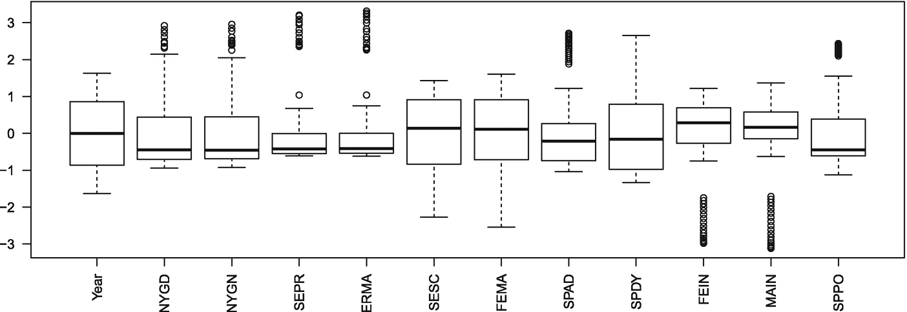

图 8-1

寻找重要的畸形数据

```py
boxplot(d[,-c(1:9)], las = 2)

```

在图 [8-2](#Fig2) 中更仔细地观察小学毕业的男性儿童，可以发现非正常行为的证据。直方图不是正态分布的传统钟形，Q-Q 图不像直线`y = x`。

```py
par(mfrow = c(1,2))
hist(d$ERMA, 100)
qqnorm(d$ERMA)

par(mfrow = c(1,1))

```

事实上，如果我们使用夏皮罗-维尔克正态性检验进行假设检验，我们看到 p 值是显著的，因此我们拒绝正态数据的零假设。

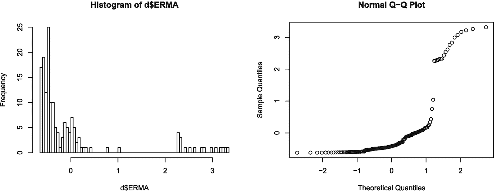

图 8-2

寻找重要的畸形数据

```py
shapiro.test(d$ERMA)

##
##      Shapiro-Wilk normality test
##
## data:  d$ERMA
## W = 0.6, p-value <2e-16

```

基于图 [8-2](#Fig2) 中的直方图和 Q-Q，转换数据可能是有意义的，也许使用对数转换。首先，我们观察到缩放和居中数据的范围自然包括零，这对于对数变换来说是一个挑战。原始的`data`显示这不是底层信息的问题。然而，夏皮罗-维尔克正态性检验表明，即使是对数变换仍然不利于符合正态分布。

```py
range(d$ERMA)

## [1] -0.62  3.32

range(data$ERMA)

## [1] 1.1e+05 2.1e+07

shapiro.test( log(data$ERMA) )

##
##      Shapiro-Wilk normality test
##
## data:  log(data$ERMA)
## W = 1, p-value = 3e-04

```

现在，从视觉上看，我们确实看到对数转换确实在一定程度上分隔了我们的数据，如图 [8-3](#Fig3) 所示。

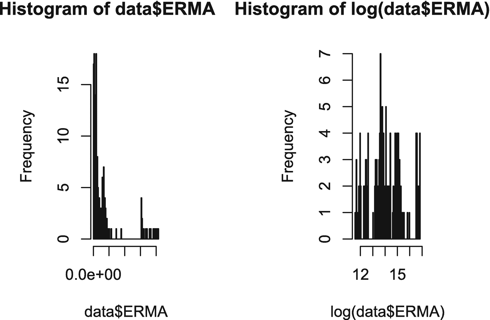

图 8-3

寻找重要的畸形数据

```py
par(mfrow = c(1,2))
hist(data$ERMA, 100)
hist( log (data$ERMA) , 100)

par(mfrow = c(1,1))

```

这个间距足以保证一个转换吗？一种确定方法是比较原始数据和转换数据与所需响应变量之间的相关性。我们的反应/输出变量将是`SPAD`，青春期生育率。我们创建一个数据集的副本，其中包括日志格式和原始格式的`ERMA`,并观察相关性。由于第一列中产生的相关性显示在未转换的列中相关性更强，所以我们最终选择不执行转换。

```py
d2 <- copy(data[,.(SPAD, ERMA)])
d2[, Log.ERMA := log(ERMA)]
cor(d2)

##          SPAD ERMA Log.ERMA
## SPAD     1.00 0.83     0.72
## ERMA     0.83 1.00     0.81
## Log.ERMA 0.72 0.81     1.00

rm(d2) #no longer needed

```

从技术上讲，应该检查每个考虑中的变量的正态性(同样，这只是因为我们的一些模型在使用正态预测时表现更好)。同样，一般来说，在应用特定模型时，理解最佳模型性能的预期输入是很重要的。首先，使用`lapply`，我们观察到所有的 p 值都是显著的。接下来，我们使用`sapply`对数据进行对数转换，并使用`colnames`添加后缀。最后，我们将原始数据相关性与`SPAD`和对数转换相关性进行比较和对比。在某些情况下，相关性稍好一些。在其他国家，情况并非如此。

```py
lapply(data[,-c(1:2)], shapiro.test)

## $NYGD
##
##     Shapiro-Wilk normality test
##
## data:  X[[i]]
## W = 0.8, p-value = 3e-13
##
##
## $NYGN
##
##     Shapiro-Wilk normality test
##
## data:  X[[i]]
## W = 0.8, p-value = 1e-13
##
##
## $SEPR
##
##     Shapiro-Wilk normality test
##
## data:  X[[i]]
## W = 0.6, p-value <2e-16
##
##
## $ERMA
##
##     Shapiro-Wilk normality test
##
## data:  X[[i]]
## W = 0.6, p-value <2e-16
##
##
## $SESC

##
##     Shapiro-Wilk normality test
##
## data:  X[[i]]
## W = 0.9, p-value = 7e-06
##
##
## $FEMA
##
##     Shapiro-Wilk normality test
##
## data:  X[[i]]
## W = 1, p-value = 5e-05
##
##
## $SPAD
##
##     Shapiro-Wilk normality test
##
## data:  X[[i]]
## W = 0.8, p-value = 5e-13
##
##
## $SPDY

##
##     Shapiro-Wilk normality test
##
## data:  X[[i]]
## W = 0.9, p-value = 6e-08
##
##
## $FEIN
##
##     Shapiro-Wilk normality test
##
## data:  X[[i]]
## W = 0.8, p-value = 1e-13
##
##
## $MAIN

##
##     Shapiro-Wilk normality test
##
## data:  X[[i]]
## W = 0.8, p-value = 9e-14
##
##
## $SPPO
##
##     Shapiro-Wilk normality test
##
## data:  X[[i]]
## W = 0.8, p-value = 6e-13

dlog <- copy(data)
dlog <- sapply(dlog[,-c(1:2)], log)
dlog<-as.data.table(dlog)
colnames(dlog) <- paste(colnames(dlog), "LOG", sep = ".")

dlog<-cbind(data, dlog)
View(cor(dlog[,-c(1:2)]))
rm(dlog) #remove as we will not use.

```

现在，我们在所有情况下都不进行对数转换。根据分析结果，根据所需的模型精度，甚至根据所选的具体模型，我们保留记录哪些变量在转换后具有更强相关性的权利。通常，各种级别的预处理成为模型调整过程的一部分。

### 培训与验证数据

我们到达预处理阶段，讨论训练和测试数据。回想一下引言章节，训练数据集的选择相当重要。对于任何单个模型，选择一个训练集和一个验证集(通常是 80/20 分割)是有意义的。这允许在训练集上创建模型，然后在验证集上获得一些“真实”世界的准确性(因此模型没有看到数据)。然而，在本章中，我们打算讨论几种可能的模型。如果我们选择这些模型中的一个，我们又一次(因为我们使用验证数据来选择“最佳”模型)冒了某种程度的过度拟合的风险。因此，在我们的模型用于现实生活之前，我们需要从训练和验证中保留最后一点测试数据，以用作我们最终的“真实”世界估计。这变得很复杂，因为 60/20/20 的分割现在只留给我们一半多一点的数据用于训练。

当然，交叉验证是避免留给训练的数据太少的一种方法。我们可以执行一个 80/20 的训练/测试分割，对我们的训练数据使用交叉验证，并节省我们自己对正式验证集的需求。这在计算上非常昂贵，尤其是在多个模型上(或者甚至是一个模型的多次迭代)。回想一下，最后，一旦选择了一个特定的模型，在现实世界中使用之前，正确的最后一步确实是对所有数据重新训练该模型——不再进行拆分。根据模型本身的计算强度，这可能要付出相当大的代价。

由于我们的数据集只有 162 个观察值，为了简单起见，我们将只进行标准的 80/20 分割。我们的目标是在我们的模型中使用交叉验证，这样保留的测试集可以在最后使用。

使用`set.seed(1234)`来允许再现性，我们引入一个新的函数来执行从`caret`包`createDataPartition`的分割。第一种形式允许函数了解我们的数据是如何分层的，第二种形式告诉我们分割的比率(在这个例子中是 80/20)。一旦`index`被填充，我们使用它来分离我们的训练和验证或测试数据。拆分完数据后，我们就为最后阶段的预处理做好了准备。

```py
set.seed(1234)
index <- createDataPartition(data$CntN, p = 0.8, list = FALSE)
trainData <- data[index, ]
validationData <- data[-index, ]

```

我们应该注意，从技术上讲，对于训练数据、测试数据和验证数据，缩放和居中应该分开进行。事实上，音阶和中心公式必须在火车上开发；否则，这些集合之间可能会有信息泄漏。然而，由于我们一直在重新设置我们的数据，并且我们打算在即将到来的部分再次缩放，我们希望我们的读者原谅我们的订购。

### 主成分分析

我们在上一章看到了主成分分析。降维的优点包括减少处理时间、减少过拟合和模型简化。如果您已经在无监督学习一章中安装了`pcaMethods`包，则不需要再次安装。如果您需要安装，请删除注释掉代码的井号，然后运行。无论哪种情况，第三行代码肯定都需要运行。

```py
#source("https://bioconductor.org/biocLite.R")
#biocLite("pcaMethods")
library(pcaMethods)

## Loading required package: Biobase

## Loading required package: BiocGenerics

##
## Attaching package: 'BiocGenerics'

## The following objects are masked from 'package:Matrix':
##
##     colMeans, colSums, rowMeans, rowSums, which

## The following objects are masked from 'package:parallel':
##
##     clusterApply, clusterApplyLB, clusterCall, clusterEvalQ,
##     clusterExport, clusterMap, parApply, parCapply, parLapply,
##     parLapplyLB, parRapply, parSapply, parSapplyLB

## The following objects are masked from 'package:stats':
##
##     IQR, mad, sd, var, xtabs

## The following objects are masked from 'package:base':
##
##     anyDuplicated, append, as.data.frame, basename, cbind,
##     colMeans, colnames, colSums, dirname, do.call, duplicated,
##     eval, evalq, Filter, Find, get, grep, grepl, intersect,
##     is.unsorted, lapply, lengths, Map, mapply, match, mget,
##     order, paste, pmax, pmax.int, pmin, pmin.int, Position,
##     rank, rbind, Reduce, rowMeans, rownames, rowSums, sapply,
##     setdiff, sort, table, tapply, union, unique, unsplit,
##     which, which.max, which.min

## Welcome to Bioconductor
##
##     Vignettes contain introductory material; view with
##     'browseVignettes()'. To cite Bioconductor, see
##     'citation("Biobase")', and for packages
##     'citation("pkgname")'.

##
## Attaching package: 'pcaMethods'

## The following object is masked from 'package:stats':
##
##     loadings

```

已经分割了我们的数据，我们为 PCA 准备数据。在这里，我们的选择一部分是由我们的数据决定的，一部分是由我们的最终模型决定的。例如，各种类型的森林和基于树的方法可能不存在字符或因子数据问题。另一方面，各种类型的回归将需要前面提到的虚拟编码。PCA 不是特别适合伪编码的数据。然而，如果大量数据碰巧是分类的，那么首先对所有分类预测器进行虚拟编码，然后尝试各种类型的降维，这可能是有意义的，其中 PCA(又名`svd`)只是一种方法。

另一方面，我们的数据只有一位完全分类的数据`—CntN`。如果我们的数据集有几个伪编码列，然后我们将其他 10 个变量减少到 3 或 4 个，我们仍然可以获得可观的降维。

一般来说，PCA 是应用于数据的最后预处理步骤。当然，在 PCA 之前，应该对数值数据进行缩放和居中。至于分类数据是否也应该经过主成分分析？为简洁起见，我们将展示如何手动排除分类数据。如果您的数据需要不同的或更细微的技术，我们希望我们展示了足够的过程，以便您可以根据自己的目的修改代码。

首先，记住我们的数据的已知结构，我们用`str`函数验证我们已经选择了我们的训练集的正确行。

默认情况下，`stats`库带有基类`R`，`prcomp`是该库中的一个函数。它对我们的训练数据执行维度计算。请记住，任何符合我们 PCA 训练数据的模型都需要提供新数据或验证数据，这些数据执行了相同的 PCA 过程。为此，在通过`summary(pc)`查看 PCA 的结果后，我们使用`predict`功能。第一种形式是我们的 PCA 分析，在本例中存储在`pc`中。第二个是新数据，在本例中是我们的`validationData`。当然，对于实际生产中使用的模型，新数据将是我们希望放入模型的新数据。

然而，从上一章我们知道，除了“基本的”PCA 之外，还可以做更多的工作。因此，我们还展示了使用`pcaMethods`库中的`pca`函数所需的步骤。该功能的细节在无监督机器学习一章中有解释。现在我们注意到这个过程的结果与`predict`完美地工作在一起，我们展示了两种方法的第一维的打印输出，以表明它们确实是相同的。

当然，`pca`的优势在于通过`method = " "`形式的便利，方法转换成`listPcaMethods()`列出的任何方法都很容易。

```py
#confirm structure
str(trainData[,c(3:8,10:13)])

## Classes 'data.table' and 'data.frame':      135 obs. of  10 variables:
##  $ NYGD: num  2299 2170 2314 2589 2495 ...
##  $ NYGN: num  2310 2311 2288 2410 2496 ...
##  $ SEPR: num  6078141 5961001 5684714 5425963 5087547 ...
##  $ ERMA: num  4181176 4222039 4131775 3955257 3726838 ...
##  $ SESC: num  8.08 8.27 8.5 8.65 8.84 ...
##  $ FEMA: num  9.73 9.82 9.97 10.02 10.12 ...
##  $ SPDY: num  6.8 6.68 6.57 6.48 6.4 ...
##  $ FEIN: num  68.7 69 69.3 69.6 69.8 ...
##  $ MAIN: num  65 65.3 65.7 65.9 66.2 ...
##  $ SPPO: num  79.1 77.7 76.2 74.7 73.2 ...
##  - attr(*, ".internal.selfref")=<externalptr>

#base R / traditional method
pc <- prcomp(trainData[,c(3:8,10:13)], center = TRUE, scale. = TRUE)

summary(pc)

## Importance of components:
##                          PC1   PC2    PC3    PC4     PC5     PC6
## Standard deviation     2.703 1.321 0.8175 0.4029 0.27986 0.16986
## Proportion of Variance 0.731 0.175 0.0668 0.0162 0.00783 0.00289
## Cumulative Proportion  0.731 0.905 0.9719 0.9881 0.99597 0.99886
##                            PC7     PC8     PC9    PC10
## Standard deviation     0.08417 0.04726 0.03535 0.02894
## Proportion of Variance 0.00071 0.00022 0.00012 0.00008
## Cumulative Proportion  0.99957 0.99979 0.99992 1.00000

pcValidationData1 <- predict(pc, newdata = validationData[,c(3:8,10:13)])

#scalable method using PcaMethods
pc<-pca(trainData[,c(1:8,10:13)], method = "svd",nPcs = 4, scale = "uv", center = TRUE)
pc

## svd calculated PCA
## Importance of component(s):
##                  PC1    PC2     PC3     PC4
## R2            0.7306 0.1745 0.06683 0.01623
## Cumulative R2 0.7306 0.9051 0.97191 0.98814
## 10   Variables
## 135  Samples
## 0    NAs ( 0 %)
## 4    Calculated component(s)
## Data was mean centered before running PCA
## Data was scaled before running PCA
## Scores structure:
## [1] 135   4
## Loadings structure:
## [1] 10  4

summary(pc)

## svd calculated PCA
## Importance of component(s):
##                  PC1    PC2     PC3     PC4
## R2            0.7306 0.1745 0.06683 0.01623
## Cumulative R2 0.7306 0.9051 0.97191 0.98814

pcValidationData2 <- predict(pc, newdata = validationData[,c(3:8,10:13)])

#demonstration of how to access transformed validation data
pcValidationData1[,1]

##  [1] -1.11 -0.87 -0.77  0.96  1.08  1.67 -1.52 -1.17 -0.82  0.37  1.06
## [12]  1.67  1.94  2.67  3.36  0.76  0.86  1.00 -1.14 -0.49  0.40  2.66
## [23]  3.72  3.80 -7.52 -5.80 -4.95

pcValidationData2$scores[,1]

##  [1] -1.11 -0.87 -0.77  0.96  1.08  1.67 -1.52 -1.17 -0.82  0.37  1.06
## [12]  1.67  1.94  2.67  3.36  0.76  0.86  1.00 -1.14 -0.49  0.40  2.66
## [23]  3.72  3.80 -7.52 -5.80 -4.95

```

转换完我们的数据后，现在使用`cbind`将一个热编码的`CntN`和我们的响应变量`SPAD`放入就很简单了。

在我们结束预处理数据这一节时，记住几个关键原则很重要。

如果使用单一模型，那么训练和验证分离(通常是 80/20)是合适的，除非使用交叉验证或引导。请记住，后两者的计算量可能很大。如果从一个以上的模型中进行选择，则需要一个训练集来训练各种模型，需要一个验证集来估计模型在未知数据上的性能，最后需要一个测试集来估计最终选择的模型在真实数据上的性能(否则，我们实际上在验证步骤中有第二阶段过度拟合)。交叉验证可以消除对验证集的需求，但在使用多个模型时，计算成本会更高。另一方面，使用 70/20/10 进行训练、验证和测试的成本可能很高。无论选择哪种方法，都应该首先进行，以防止不同组之间的信息泄漏。

如果您的数据有丢失的值，首先阅读专门讨论丢失数据的章节可能会有所收获。插补通常是数据布局正确后的第一步。

分类数据的热编码或虚拟编码是一种选择。一些模型只需要数字数据，其他模型可以用因子格式处理分类数据。正如每种类型的模型可能并不适合所有类型的数据一样，某些类型的数据也不适合某些模型。因此，要同时考虑数据和模型！对于某些模型来说，保持数据的分类和因子格式，可以为模型提供有效使用数据所需的信息，同时不会对数据产生任意的线性影响。相比之下，其他模型可能无法处理这些因素，因此除了虚拟代码之外可能别无选择。

一般来说，数字数据应该缩放和居中。事实上，删除方差为零或接近零的列也可能是明智的。具有接近零的方差的列可以被保留，并且稍后在预处理中经受 PCA。

除了基本的居中和缩放之外，它还有助于转换数据以获得适当的数据分布。虽然我们只讨论了对数变换，但是对于特定类型和特征的数据以及特定的模型来说，有许多可能的变换是有价值的。同样，如果一个特定模型的第一遍不够精确，更高级的数学可能是合适的。

## 8.2 监督学习模式

现在我们了解了一些预处理数据的方法，我们的下一个任务是满足一些模型。记住，监督学习仅仅意味着我们头脑中有一个特定的反应变量。对于各种类型的响应或预测变量，不同的模型可能更适合于更好地分析特定类型的数据。例如，如果我们有更多的分类变量，那么我们可能更喜欢基于分类的监督学习。另一方面，如果我们的数据主要是数字，我们可能会在回归方法中发现更多的价值。一些模型生活在两个世界中，或者可以适应这样做。而且，正如我们在预处理中已经看到的，数据本身可以变异，例如，通过虚拟编码从分类到数字。当然，这是一个很差的方法，只能以一种方式工作——直方图条可能是一个很好的例子，可以将连续的数字数据重新编码为分类数据。

在研究这些模型时，需要记住的是，具体应用需要什么样的精度。找到一个提供比机会更好的结果的模型是合理可行的。仅仅比机会好就足够了吗？有时间(人和机器)测试更多的模型吗？大多数模型都有调整参数、允许更多交叉验证的额外输入或惩罚额外的模型复杂性。花多少精力调优才算现实？

在下面的章节中，我们采取了一种平衡的方法。我们准备数据，使其与特定模型最佳交互，我们假设硬件水平合理，并选择使用合理的计算时间，我们讨论各种调整参数选项，但不必穷尽这些选项。对于任何特定的数据应用，在数据收集、预处理和最终模型调整上花费比在模型选择步骤上更多的时间是有意义的。有了这个想法，然后安全地储存在我们的脑海中，我们继续前进。

### 支持向量机

支持向量机(SVM)在概念上有点类似于 k 近邻，因为其思想是找到我们的数据分组。这是通过寻找通过识别关键数据点(支持向量)确定的边界曲线来实现的。支持向量是那些具有一些最大间隔(在一些度量下)的向量，并且在这些向量之间绘制边界曲线。由于边界划分可以是线性的、多项式的或更奇异的，因此有几种方法来执行基本的 SVM 算法。界定曲线类型的确定被称为 SVM 的核心。自然地，更复杂的边界核往往在计算上更困难。与其他一些包一样，`caret`包本身支持多种内核风格的几种变体，包括线性、指数、多项式和径向。我们将把这里的讨论限于线性和多项式。

让我们从一个简单的数据集开始——不是我们完整的正式数据集——来直观地理解支持向量机是如何工作的。我们使用青少年生育率和人均国民生产总值作为预测指标，我们的分类回答将是国名。我们重新利用我们熟知的图表 [8-4](#Fig4) 并注意到，对于任何一个国家分组，通常都有可能存在明显的线性分离。诚然，我们并不期待左下角出现奇迹。

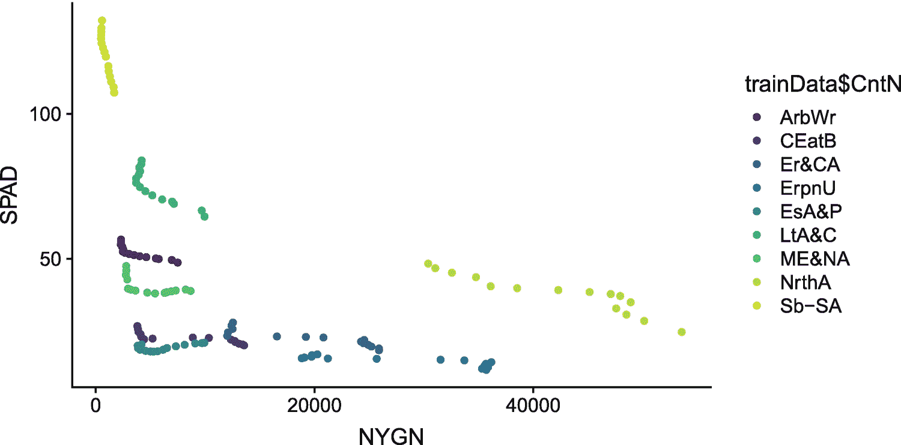

图 8-4

人均国民生产总值与青少年生育率

```py
svmDataTrain <- trainData[,.(SPAD, NYGN)]
svmDataValidate <- validationData[,.(SPAD, NYGN)]

p1 <- ggplot(data = svmDataTrain,
             aes(x = NYGN, y = SPAD))
  ## data poins colored by country
  p1 + geom_point(aes(colour = trainData$CntN)) +
    scale_colour_viridis(discrete = TRUE)

```

`caret`包由一个名为`train`的函数驱动。花点时间看看下面的代码布局。

第一种形式用于预测，第二种形式用于响应。在撰写本文时，第三种形式有超过 200 种可能的方法。在这种情况下，我们使用的是线性支持向量机，因此`svmLinear`。因为我们打算在原始数据上绘制我们的结果，所以现在我们选择保持`preProcess`为空。将来，它将采用`center, scale, and pca`等数值以及各种插补选项。正式参数`metric = "Accuracy"`表示我们希望我们的汇总输出让我们知道`CountryName`的训练区域与实际国家相比有多准确。同样，可以将 svm 看作是使用线性边界将数据分成不同的区域。我们想知道这条分界线多长时间划好一次。最后，`trainControl`功能用于控制模型的训练方式。在这种情况下，我们将使用交叉验证`cv`和`five`折叠。实际上有大量的数据包含在`svm`变量中。显示的打印输出只是一个小摘要。它确实提醒我们没有预处理，并且按照要求，告诉我们交叉验证的估计准确性。请记住，这种准确性是基于每个折叠的交叉验证过程。

```py
set.seed(12345)

  svm <- train(x = svmDataTrain,
             y = trainData$CntN,
             method = "svmLinear",
             preProcess = NULL,
             metric = "Accuracy",
             trControl = trainControl(method = "cv",
                                      number = 5,
                                      seeds = c(123, 234, 345, 456, 567, 678)
                                      )
             )
svm

## Support Vector Machines with Linear Kernel
##
## 135 samples
##   2 predictor
##   9 classes: 'ArbWr', 'CEatB', 'Er&CA', 'ErpnU', 'EsA&P', 'LtA&C', 'ME&NA', 'NrthA', 'Sb-SA'
##
## No pre-processing
## Resampling: Cross-Validated (5 fold)
## Summary of sample sizes: 108, 108, 108, 108, 108
## Resampling results:
##
##   Accuracy  Kappa
##   0.82      0.8
##
## Tuning parameter 'C' was held constant at a value of 1

```

接下来，我们稍微深入研究一下模型的准确性。因为我们实际上使用了交叉验证，这被认为是一个很好的估计。首先，我们使用有两个输入的`predict`函数。一个是包含我们模型的新`svm`。另一个是我们用来训练那个模型的训练数据。与一次只使用`108`元素的交叉验证折叠不同，我们使用所有的`135`值。接下来，我们发现这些预测的国家名称何时与在我们的`trainData`变量中找到的正确国家名称相同。这创建了布尔值`TRUE`和`FALSE`，它们分别等于`1`和`0,`。因此，这些事件中的`mean`将会给我们`true`发生频率的比率。请注意，尽管对`0.84`的不可见数据的估计是准确的，但在我们的训练数据上，我们实际上看到了`0.85`。这是我们所说的过度拟合的一部分。

```py
#predict the country name on our training data using our new model
predictOnTrain <- predict(svm, newdata = svmDataTrain)

mean( predictOnTrain == trainData$CntN)

## [1] 0.82

```

现在，使用我们提供的验证数据是不正确的。从技术上来说，我们必须把它保存到最后，而不是用它来通知我们的模型选择，然后在我们看到所有的模型之后才使用它来执行最后的验证步骤。然而，鉴于在第一个示例草图中展示了这个过程的样子，展示最后一步有一定的教学意义。我们执行与训练数据相同的计算(实际上，这个预测过程就是我们对真正新的真实世界数据所做的)。虽然交叉验证比实际训练数据可能显示的更保守，但它并不像它本来可能的那样保守。

同样，我们模型中完全看不见的数据上的`0.78`是模型过度拟合的一个例子。训练数据在某种程度上使我们的模型产生了偏差，在完全看不见的验证数据的情况下，它表现得不那么好。

```py
predictOnTest <- predict(svm, newdata = svmDataValidate)
mean(predictOnTest == validationData$CntN)

## [1] 0.81

```

使用与上一章相同的过程，我们绘制了看不见的验证数据，并将正确答案的结果与图 [8-5](#Fig5) 中的预测进行比较。我们的模型很难理解线性分离的确切位置，也正是不准确性显现的地方。

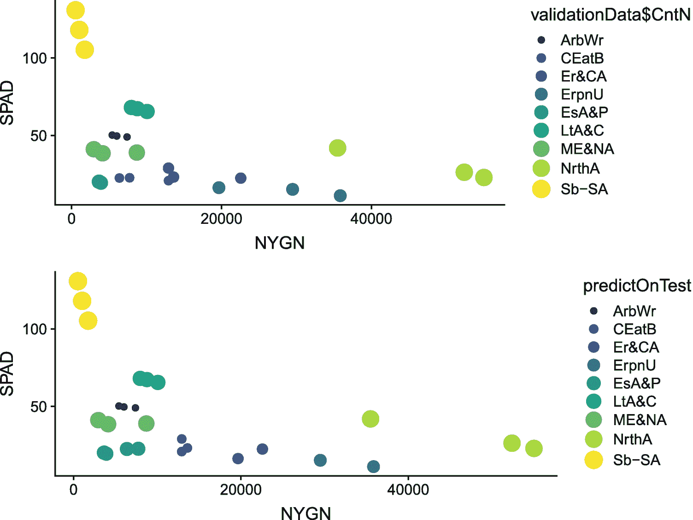

图 8-5

训练与测试预测

```py
p1 <- ggplot(data = validationData,
             aes(x = NYGN, y = SPAD))

plot_grid(
  ## data poins colored by country
  p1 + geom_point(aes(colour = validationData$CntN, size = validationData$CntN)) +
    scale_colour_viridis(discrete = TRUE),

  ## data poins colored by predicted country
  p1 + geom_point(aes(colour = predictOnTest, size = predictOnTest)) +
    scale_colour_viridis(discrete = TRUE),
ncol = 1

)

## Warning: Using size for a discrete variable is not advised.
## Warning: Using size for a discrete variable is not advised.

```

预计前面的代码会生成两个警告—也就是说，对于区域名称这样的离散变量，不建议使用这样的大小。这是一个合理的警告，在现实生活中，我们永远不会使用这样的技术(一个重要的原因是人类倾向于将大小本身解释为重要的，在这种情况下没有这样的意义)。我们在这里使用它只是为了帮助区分类别。

既然我们已经看到并理解了`caret`模型构建的整体布局，以及如何在最后使用验证数据来理解选择哪个模型，我们将验证数据安全地保存起来，直到最后才会再次使用，以了解我们最终选择的模型可能会如何执行。我们还花了一些时间来清理我们的环境。

```py
rm(p1)
rm(svm)
rm(svmDataTrain)
rm(svmDataValidate)
rm(pcValidationData1)
rm(pcValidationData2)
rm(predictOnTest)
rm(predictOnTrain)
rm(pc)
rm(d)

```

我们现在准备在我们的整个`trainData`布景上表演我们的 SVM 模型。我们留下的是我们原始的`data`的一个副本，我们用来将数据分成训练集和验证集的`index`，以及实际的训练集和验证集本身。

我们再次构建我们的模型训练数据减去我们的分类国家名称列。现在，我们将字符年份数据重新编码为数字，并为可再现性设置种子。除了包含更多的可变列之外，唯一的不同是设置了`preProcess = c("scale", "center", "pca")`。这默认为 PCA `thresh = 0.95`，如果需要，可以按照`?preProcess`中的说明进行调整。在这种情况下，我们使用默认值。我们看到估算模型的准确性有所提高。

```py
# set up training & validation data
svmDataTrain <- trainData[,-1]
svmDataTrain[,Year:=as.numeric(Year)]
svmDataValidation <- validationData[,-1]
svmDataValidation[,Year:=as.numeric(Year)]
#run linear SVM on the full data set
set.seed(12345)
svmLinear <- train(x = svmDataTrain,
             y = trainData$CntN,
             method = "svmLinear",
             preProcess = c("scale", "center", "pca"),
             metric = "Accuracy",
             trControl = trainControl(method = "cv",
                                      number = 5,
                                      seeds = c(123, 234, 345, 456, 567, 678)
                                      )
             )
svmLinear

## Support Vector Machines with Linear Kernel
##
## 135 samples
##  12 predictor
##   9 classes: 'ArbWr', 'CEatB', 'Er&CA', 'ErpnU', 'EsA&P', 'LtA&C', 'ME&NA', 'NrthA', 'Sb-SA'
##
## Pre-processing: scaled (12), centered (12), principal
##  component signal extraction (12)
## Resampling: Cross-Validated (5 fold)
## Summary of sample sizes: 108, 108, 108, 108, 108
## Resampling results:
##
##   Accuracy  Kappa
##   0.99      0.98
##
## Tuning parameter 'C' was held constant at a value of 1

```

在这一点上，描述线性 SVM 是如何工作的是很重要的。该算法是为二元分类而设计的。在这种情况下，对于多个结果，它以一个对其余的方式在数据中循环。所以这个线性模型实际上是画了一条直线，一次将一个群体与其他群体隔离开来。目标是在数据之间画一条线，使这条线尽可能远离分界线两侧的点。这有助于一个模型预测未来数据应该走向何方。通过调整参数`C`，我们控制需要多宽的余量(如果数据过于接近，可能会使生产线选择不同的路径)。更高的`C`值导致更高的训练精度和更小的裕度——存在过度拟合的风险。

当我们从线性变为多项式时，它允许直线变成多项式曲线。此外，默认情况下，该算法循环遍历几个`C`值。注意(在运行下面的代码之后),一般来说，对于每组固定的度数和比例，`C`的值越大，产生的精确度越高。代价是，随着`C`的增加，我们曲线的边缘缩小，这意味着我们的模型过度拟合数据的可能性增加。

接下来，我们只对我们的模型做一个改变，从线性模型到多项式模型。在`caret`中，这很容易通过切换到`method = "svmPoly"`来完成。虽然代码的变化很小，但计算工作量的变化更小。注意`svmPoly`是一个完全不同于线性版本的模型。虽然算法和数学超出了本文的范围，但是即使在线性程度级别，过程也是不同的。虽然这目前看起来不如我们的线性模型好，但如果是真的，那么`0.88`的准确性仍然可能相当好。

```py
#run polynomial SVM on the full data set

set.seed(12345)
svmPoly <- train(x = svmDataTrain,
             y = trainData$CntN,
             method = "svmPoly",
             preProcess = c("scale", "center", "pca"),
             metric = "Accuracy",
             trControl = trainControl(method = "cv",
                                      number = 5
                                      )
             )

svmPoly

## Support Vector Machines with Polynomial Kernel
##
## 135 samples
##  12 predictor
##   9 classes: 'ArbWr', 'CEatB', 'Er&CA', 'ErpnU', 'EsA&P', 'LtA&C', 'ME&NA', 'NrthA', 'Sb-SA'
##
## Pre-processing: scaled (12), centered (12), principal
##  component signal extraction (12) 

## Resampling: Cross-Validated (5 fold)
## Summary of sample sizes: 108, 108, 108, 108, 108
## Resampling results across tuning parameters:
## 

##   degree  scale  C     Accuracy  Kappa
##   1       0.001  0.25  0.76      0.73
##   1       0.001  0.50  0.76      0.73
##   1       0.001  1.00  0.76      0.73
##   1       0.010  0.25  0.76      0.73
##   1       0.010  0.50  0.76      0.73
##   1       0.010  1.00  0.76      0.73
##   1       0.100  0.25  0.76      0.73
##   1       0.100  0.50  0.78      0.75
##   1       0.100  1.00  0.81      0.79
##   2       0.001  0.25  0.76      0.73
##   2       0.001  0.50  0.76      0.73
##   2       0.001  1.00  0.76      0.73
##   2       0.010  0.25  0.76      0.72
##   2       0.010  0.50  0.76      0.72
##   2       0.010  1.00  0.76      0.72
##   2       0.100  0.25  0.79      0.76
##   2       0.100  0.50  0.81      0.79
##   2       0.100  1.00  0.87      0.85
##   3       0.001  0.25  0.76      0.73
##   3       0.001  0.50  0.76      0.73
##   3       0.001  1.00  0.76      0.73
##   3       0.010  0.25  0.76      0.72
##   3       0.010  0.50  0.76      0.72
##   3       0.010  1.00  0.76      0.72
##   3       0.100  0.25  0.80      0.78
##   3       0.100  0.50  0.86      0.84
##   3       0.100  1.00  0.90      0.88
## 

## Accuracy was used to select the optimal model using the
##  largest value.
## The final values used for the model were degree = 3, scale = 0.1
##  and C = 1.

```

请注意，这两个模型完全符合我们的完整训练集。因此，尽管多项式预测的估计精度较低，但这两个模型似乎都非常符合我们的数据。

```py
predictOnTrainL <- predict(svmLinear, newdata = svmDataTrain)
mean( predictOnTrainL == trainData$CntN)

## [1] 1

predictOnTrainP <- predict(svmPoly, newdata = svmDataTrain)
mean( predictOnTrainP == trainData$CntN)

## [1] 0.98

```

基于精度水平，如果在现实生活中面对这两个选项，我们会选择线性选项。在这个阶段，我们已经做出了选择，然后我们将只在我们选择的模型上运行最后一次验证数据。我们在下面的代码中做到了这一点，并取得了很好的结果。因此，我们变得相当确定，基于我们选择的数据，给定 2015 年对我们的其余数据点的新观察，我们将对我们正确排序到正确区域的能力相当有信心。当然，我们最好在未来跟踪我们模型的准确性。

```py
predictOnTestL <- predict(svmLinear, newdata = svmDataValidation)
mean(predictOnTestL == validationData$CntN)

## [1] 1

```

总的来说，我们的数据集似乎相当完整。换句话说，这些不同的地理区域在最近几年被收集的一组预测因子很好地描述了。考虑到图 [8-4](#Fig4) 中非常清晰的分组，这并不特别令人震惊。事实上，意识到 PCA 不会对这两个变量有特别大的改变。有很好的垂直和水平分隔。

这就结束了关于支持向量机的部分。在接下来的章节中，我们将继续使用`caret`的高度一致的结构来利用其他模型。随着我们对整体模型结构越来越熟悉，我们试图增加额外的技能。请记住，在现实生活中，后面介绍的技巧很可能会用到支持向量机。

### 分类和回归树

分类和回归树(CART)是为数字、连续预测值和分类响应变量而设计的。这非常符合我们的数据集。我们刷新 CART 的训练和验证数据，使用`set.seed`来获得再现性，并使用我们现在熟悉的`train`函数。我们添加了一个新的特性，`tuneLength = 10`，它控制复杂度的迭代次数。增加该值会增加模型的总计算时间；因此，对于较大的数据集，模型精度的提高需要与训练模型的时间进行权衡。

```py
cartDataTrain <- copy(trainData[,-1])
cartDataTrain[,Year:=as.numeric(Year)]
cartDataValidation <- copy(validationData[,-1])
cartDataValidation[,Year:=as.numeric(Year)]

set.seed(12345)

cartModel <- train(x = cartDataTrain,
             y = trainData$CntN,
             method = "rpart",
             preProcess = c("scale", "center", "pca"),
             metric = "Accuracy",
             tuneLength = 10,
             trControl = trainControl(method = "cv",
                                      number = 5
                                      )
             )

cartModel

## CART
##
## 135 samples
##  12 predictor
##   9 classes: 'ArbWr', 'CEatB', 'Er&CA', 'ErpnU', 'EsA&P', 'LtA&C', 'ME&NA', 'NrthA', 'Sb-SA'
##
## Pre-processing: scaled (12), centered (12), principal
##  component signal extraction (12)
## Resampling: Cross-Validated (5 fold)
## Summary of sample sizes: 108, 108, 108, 108, 108
## Resampling results across tuning parameters:
##
##   cp     Accuracy  Kappa
##   0.000  0.84      0.83
##   0.014  0.84      0.83
##   0.028  0.84      0.83
##   0.042  0.85      0.83
##   0.056  0.85      0.83
##   0.069  0.85      0.83
##   0.083  0.85      0.83
##   0.097  0.76      0.73
##   0.111  0.73      0.70
##   0.125  0.11      0.00
## 

## Accuracy was used to select the optimal model using the
##  largest value.
## The final value used for the model was cp = 0.083.

```

在精确度降低之前，模型最终根据精确度(如我们所要求的)选择最大的复杂性值(这是交叉验证的一个例子，帮助我们避免过度拟合模型)。

可使用通用绘图功能绘制`finalModel`，如图 [8-6](#Fig6) 所示。这棵树没有太多的层次。请注意，虽然我们的估计准确性可能相当高(因此我们可能希望我们的模型具有可靠的预测值)，但该模型对于理解为什么应该做出特定预测并不那么有用。因此，虽然通常树模型可能被认为是相当容易解释的，但使用主成分分析会降低我们理解为什么我们的模型可能是正确的能力。

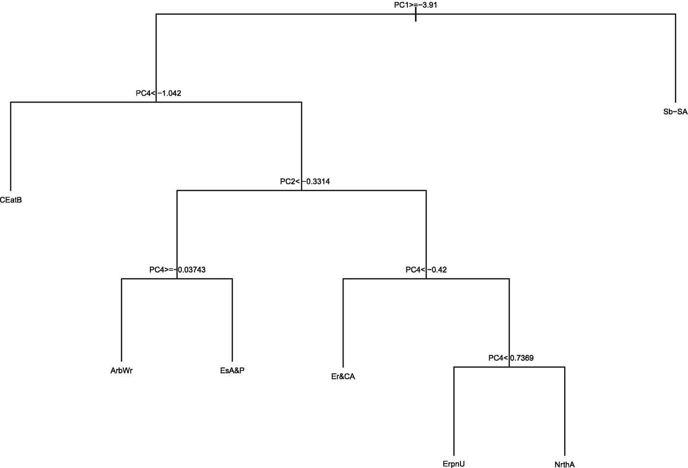

图 8-6

分类树形图

```py
plot(cartModel$finalModel)
text(cartModel$finalModel, cex = 0.5)

```

虽然通用的`plot`函数很有帮助，但是`fancyRpartPlot`通常看起来更整洁，尽管在这种情况下，很难找到合适的文本缩放级别，如图 [8-7](#Fig7) 所示。在任何情况下，重要的是要注意，虽然模型的准确性可以通过主成分分析来提高，但模型的可解释性变得更加复杂。开发一种方法来更好地解释将是有帮助的。


图 8-7

花式分类树形图

```py
fancyRpartPlot(cartModel$finalModel, cex = 0.4, main = "")

```

接下来，我们重复我们用于 SVM 的准确性度量。我们的最终模型在训练数据上是高度精确的，并且确实在完全看不见的数据上保持了这种精确度(嗯，几乎保持了)。同样，如果我们希望对模型在真实世界数据中的表现有一个真实的估计，当我们继续使用交叉验证时，正确的方法是等到本章的最后，通过交叉验证选择最准确的模型，然后最后只对选择的模型运行`predictOnTestT`。然而，作为一种教学方法，在完全看不见的数据上看到结果是有价值的，所以我们请求我们的读者继续原谅我们。

```py
predictOnTrainT <- predict(cartModel, newdata = cartDataTrain)
mean( predictOnTrainT == trainData$CntN)

## [1] 0.77

predictOnTestT <- predict(cartModel, newdata = cartDataValidation)
mean(predictOnTestT == validationData$CntN)

## [1] 0.67

```

`caret`包有一个我们还没有介绍的功能，叫做`confusionMatrix`。虽然这种情况下的输出很长，但是我们可以看到预测与验证参考的结果。一点滚动和良好的记忆显示，有一个阿拉伯世界的预测是不正确的，实际的数据值是东亚和太平洋。混淆矩阵会有所帮助，因为它显示了超出简单准确性的细节。它可以允许检测显示错误发生位置的模式。如果该模型旨在处理真实世界的数据，则可能需要收集额外的信息来支持这些数据之间的分类。此外，它还提供了一个置信区间。

```py
confusionMatrix(predictOnTestT, as.factor(validationData$CntN))

## Confusion Matrix and Statistics
##
##           Reference
## Prediction ArbWr CEatB Er&CA ErpnU EsA&P LtA&C ME&NA NrthA Sb-SA
##      ArbWr     3     0     0     0     2     3     3     0     0
##      CEatB     0     3     0     0     0     0     0     0     0
##      Er&CA     0     0     2     0     0     0     0     0     0
##      ErpnU     0     0     1     3     0     0     0     0     0
##      EsA&P     0     0     0     0     1     0     0     0     0
##      LtA&C     0     0     0     0     0     0     0     0     0
##      ME&NA     0     0     0     0     0     0     0     0     0
##      NrthA     0     0     0     0     0     0     0     3     0
##      Sb-SA     0     0     0     0     0     0     0     0     3
##
## Overall Statistics

##
##                Accuracy : 0.667
##                  95% CI : (0.46, 0.835)
##     No Information Rate : 0.111
##     P-Value [Acc > NIR] : 1.15e-11
##
##                   Kappa : 0.625
##  Mcnemar's Test P-Value : NA
##
## Statistics by Class:

##
##                      Class: ArbWr Class: CEatB Class: Er&CA
## Sensitivity                 1.000        1.000       0.6667
## Specificity                 0.667        1.000       1.0000
## Pos Pred Value              0.273        1.000       1.0000
## Neg Pred Value              1.000        1.000       0.9600
## Prevalence                  0.111        0.111       0.1111
## Detection Rate              0.111        0.111       0.0741
## Detection Prevalence        0.407        0.111       0.0741
## Balanced Accuracy           0.833        1.000       0.8333
##                      Class: ErpnU Class: EsA&P Class: LtA&C
## Sensitivity                 1.000        0.333        0.000
## Specificity                 0.958        1.000        1.000
## Pos Pred Value              0.750        1.000          NaN
## Neg Pred Value              1.000        0.923        0.889
## Prevalence                  0.111        0.111        0.111
## Detection Rate              0.111        0.037        0.000
## Detection Prevalence        0.148        0.037        0.000
## Balanced Accuracy           0.979        0.667        0.500
##                      Class: ME&NA Class: NrthA Class: Sb-SA
## Sensitivity                 0.000        1.000        1.000
## Specificity                 1.000        1.000        1.000
## Pos Pred Value                NaN        1.000        1.000
## Neg Pred Value              0.889        1.000        1.000
## Prevalence                  0.111        0.111        0.111
## Detection Rate              0.000        0.111        0.111
## Detection Prevalence        0.000        0.111        0.111
## Balanced Accuracy           0.500        1.000        1.000

```

如您所见，在这个数据集中，分类和回归树工作得相当好。虽然 PCA 方面可能会使对哪些输入值驱动哪些决策的完美理解变得复杂，但树通常可以简洁地用图表表示。此外，如果愿意，可以尝试不使用五氯苯甲醚。使用原始数据(尽管可能经过标准化和缩放)可能会产生一个足够准确且更容易解释的模型。另一方面，单棵树在某些情况下可能不够准确。和模型总是有取舍的。

### 随机森林

随机森林比树的概念前进了一步。回想上一节，意识到我们的树真的很擅长识别中欧。虽然它在阿拉伯世界犯了一些错误，但它在中欧(CEatB)表现良好。如果我们不是训练一棵树，而是训练很多棵树，会怎么样？当然，简单地循环 CART 算法会产生一个克隆森林，这里不需要这样做。相反，随机森林概念上的第一步是随机选取某些预测值列，并从该列子集中随机选取某些观察值。这创建了训练数据集的随机子集，并且这些子集的每一个都用于训练树。一旦树木长成森林，模型就可以进行预测了。回归预测或数值数据是每棵树预测响应值的平均值。对我们的分类或分类数据的预测将是机器学习式的民主，其中多数投票获胜(如果需要，还附带一个概率)。

我们从设置现在常用的数据集副本开始。`caret`的一个非常有用的特性仍然是`train`函数的标准化，它允许我们非常容易地在这些不同的模型之间工作。对于随机森林，我们使用`method = "ranger"`。模型变量`num.trees`被设置为控制我们森林的大小，我们从森林中只有 20 棵树开始。默认情况下，该模型在一些调整参数上运行一个小的网格搜索，稍后我们将对此进行更深入的讨论。在这种情况下，基于交叉验证选择的模型估计具有很高的准确性，只有 20 棵树。请注意，`finalModel`中包含了几个特定的变量，我们确认模型中只有 20 棵树。在这种情况下，初始阶段将创建 20 个随机子集，每个子集用于训练 20 棵树中的一棵树。

```py
rfDataTrain <- copy(trainData[,-1])
rfDataTrain[,Year:=as.numeric(Year)]
rfDataValidation <- copy(validationData[,-1])
rfDataValidation[,Year:=as.numeric(Year)]

set.seed(12345)

rfModel <- train(x = rfDataTrain,
             y = trainData$CntN,
             method = "ranger",
             preProcess = c("scale", "center", "pca"),
             metric = "Accuracy",
             num.trees = 20,
             trControl = trainControl(method = "cv",
                                      number = 5
                                      )
             )

rfModel

## Random Forest
##
## 135 samples
##  12 predictor
##   9 classes: 'ArbWr', 'CEatB', 'Er&CA', 'ErpnU', 'EsA&P', 'LtA&C', 'ME&NA', 'NrthA', 'Sb-SA'
##
## Pre-processing: scaled (12), centered (12), principal
##  component signal extraction (12)
## Resampling: Cross-Validated (5 fold)
## Summary of sample sizes: 108, 108, 108, 108, 108
## Resampling results across tuning parameters:
##
##   mtry  splitrule   Accuracy  Kappa
##   2     gini        0.93      0.92
##   2     extratrees  0.96      0.96
##   3     gini        0.93      0.92
##   3     extratrees  0.96      0.96
##   4     gini        0.93      0.92
##   4     extratrees  0.99      0.98
##
## Tuning parameter 'min.node.size' was held constant at a value of 1

## Accuracy was used to select the optimal model using the
##  largest value.
## The final values used for the model were mtry = 4, splitrule
##  = extratrees and min.node.size = 1.

rfModel$finalModel$num.trees

## [1] 20

```

自然地，我们运行我们现在通常的检查，看看最终的模型在我们的测试集和验证集上表现如何。基于`validationData`的比较，训练数据的保留部分的估计精度可能有点高。

```py
predictOnTrainR <- predict(rfModel, newdata = rfDataTrain)
mean( predictOnTrainR == trainData$CntN)

## [1] 1

predictOnTestR <- predict(rfModel, newdata = rfDataValidation)
mean(predictOnTestR == validationData$CntN)

## [1] 1

```

随机森林的计算复杂性在一定程度上是被训练的树的数量的特征——这确实也开始对未来的预测产生计算成本(虽然通常不是一个巨大的负担，但预测并不仅仅通过单棵树进行过滤)。我们接下来调整我们的代码来拥有`50`树。

```py
set.seed(12345)
rfModel <- train(x = rfDataTrain,
             y = trainData$CntN,
             method = "ranger",
             preProcess = c("scale", "center", "pca"),
             metric = "Accuracy",
             num.trees = 50,
             trControl = trainControl(method = "cv",
                                      number = 5
                                      )
             )
rfModel

## Random Forest
##
## 135 samples

##  12 predictor
##   9 classes: 'ArbWr', 'CEatB', 'Er&CA', 'ErpnU', 'EsA&P', 'LtA&C', 'ME&NA', 'NrthA', 'Sb-SA'
##
## Pre-processing: scaled (12), centered (12), principal
##  component signal extraction (12)
## Resampling: Cross-Validated (5 fold)
## Summary of sample sizes: 108, 108, 108, 108, 108
## Resampling results across tuning parameters:
##
##   mtry  splitrule   Accuracy  Kappa
##   2     gini        0.94      0.93
##   2     extratrees  0.99      0.99
##   3     gini        0.93      0.92
##   3     extratrees  0.98      0.97
##   4     gini        0.93      0.92
##   4     extratrees  0.98      0.97
##
## Tuning parameter 'min.node.size' was held constant at a value of 1

## Accuracy was used to select the optimal model using the
##  largest value

.
## The final values used for the model were mtry = 2, splitrule
##  = extratrees and min.node.size = 1.

rfModel$finalModel$num.trees

## [1] 50

```

这种增加的净效果是为我们的保留验证数据提供了一个完美的匹配。至于它是否经得起未来额外的真实世界测试，则是另一回事了。重要的是要认识到每个数据集都有各种各样的特征，这些特征使得数据集在不同的模型下表现不同。在这种情况下，就目前而言，模型给我们提供了高度准确的结果。如前所述，其中一位作者处理学生的成绩数据，在这种情况下，准确的分数预测会更加困难。

```py
predictOnTrainR <- predict(rfModel, newdata = rfDataTrain)
mean( predictOnTrainR == trainData$CntN)

## [1] 1

predictOnTestR <- predict(rfModel, newdata = rfDataValidation)
mean(predictOnTestR == validationData$CntN)

## [1] 1

```

提高给定模型准确性的一种方法是通过调整。对于随机森林，调整参数包括`num.trees`、`mtry`、`splitrule`和`min.node.size`。虽然已经注意到`num.trees`可以控制树的数量，但是其他的调整参数值得讨论。基于我们之前对 PCA 的探索，有理由假设我们的数据仍然有四个主要成分。在这种情况下，当在任何特定节点时，随机森林算法将随机选择这些预测值中的一些，然后决定这些选择的预测值中的哪一个将给出最大排序增益(回忆树分支到两个子节点中的一个)。`mtry`变量设置每次随机选择四个预测值中的多少个。因此，一到四是我们的范围，并成为调整我们的模型的一种方式。`splitrule`允许选择算法的各种细微差别。在我们的例子中，当我们使用模型对数据进行分类时，有意义的选项是`gini`和`extratrees`。由于`extratrees`是迄今为止最佳选择的具体方法，我们将坚持使用它来简化调整过程。最后，`min.node.size`决定在树停止生长之前允许多少行数据。对于分类数据，默认值为 1。然而，我们的数据有 9 个区域的 135 个观察值，这给了我们每个区域 15 个实例。因此，虽然大于 15 的最小尺寸不太理想，但尝试多个尺寸可能是有意义的。为了用这些变量调整模型，我们使用 base `R`中的`expand.grid`函数从我们选择的范围的所有可能组合中创建一个数据框。这被传递到正式的`tuneGride`和模型运行。

```py
set.seed(12345)

rfModel <- train(x = rfDataTrain,
             y = trainData$CntN,
             method = "ranger",
             preProcess = c("scale", "center", "pca"),
             metric = "Accuracy",
             num.trees = 20,
             trControl = trainControl(method = "cv",
                                      number = 5
                                      ),
             tuneGrid = expand.grid(mtry = c(1, 2, 3, 4),
                                    splitrule = "extratrees",
                                    min.node.size = c(1, 5, 10, 15))
             )

rfModel

## Random Forest
##
## 135 samples
##  12 predictor
##   9 classes: 'ArbWr', 'CEatB', 'Er&CA', 'ErpnU', 'EsA&P', 'LtA&C', 'ME&NA', 'NrthA', 'Sb-SA'
##
## Pre-processing: scaled (12), centered (12), principal
##  component signal extraction (12)
## Resampling: Cross-Validated (5 fold)
## Summary of sample sizes: 108, 108, 108, 108, 108
## Resampling results across tuning parameters:
##
##   mtry  min.node.size  Accuracy  Kappa
##   1      1             0.95      0.94
##   1      5             0.94      0.93
##   1     10             0.88      0.87
##   1     15             0.77      0.74
##   2      1             0.98      0.97
##   2      5             0.96      0.95
##   2     10             0.95      0.94
##   2     15             0.90      0.88
##   3      1             0.96      0.96
##   3      5             0.95      0.94
##   3     10             0.93      0.92
##   3     15             0.88      0.87
##   4      1             0.96      0.95
##   4      5             0.96      0.95
##   4     10             0.94      0.93
##   4     15             0.90      0.89
##
## Tuning parameter 'splitrule' was held constant at a value
##  of extratrees

## Accuracy was used to select the optimal model using the
##  largest value.
## The final values used for the model were mtry = 2, splitrule = 
##  extratrees and min.node.size = 1.

rfModel$finalModel$num.trees

## [1] 20

rfModel$finalModel$mtry

## [1] 2

rfModel$finalModel$splitrule

## [1] "extratrees"

rfModel$finalModel$min.node.size

## [1] 1

```

值得注意的是，在这些更广泛的选项上运行模型将模型在我们的系统上运行的时间增加了 1.9 倍。我们使用函数`system.time()`作为包含 20 棵树的原始运行的包装器，并使用`tuneGride`来确定时间成本。作为一般的工作流程，模型调优是最后一个步骤，一旦选择了特定的模型，就要进行调优，正是因为这个原因。

我们最后一次运行我们模型的验证，看到在 20 棵树的限制下，调整并没有增加我们验证数据的准确性。

```py
predictOnTrainR <- predict(rfModel, newdata = rfDataTrain)
mean( predictOnTrainR == trainData$CntN)

## [1] 1

predictOnTestR <- predict(rfModel, newdata = rfDataValidation)
mean(predictOnTestR == validationData$CntN)

## [1] 1

```

### 随机梯度推进

随机梯度推进是一种迭代创建树木“森林”的方法。这种方法和随机森林的区别在于迭代。在训练第一个模型之后，计算预测输出和已知训练数据输出之间的误差。然后，误差被用作预测值的附加响应变量，以努力降低误差水平。这个过程重复进行，减少了错误率。该技术非常有效，既不需要删除/填补缺失数据，也不需要缩放/居中/pca。收益往往伴随着权衡，在没有交叉验证的情况下运行时，模型几乎肯定会过度拟合。迭代性质和减少误差的目标在计算时间和存储需求方面也可能相对昂贵。

这一次，我们将使用回归而不是分类模型。为此，我们对国家的训练和验证数据进行虚拟编码，并再次选择将变量`Year`设置为一个数值。

```py
sgbDataTrain <- copy(trainData)
sgbDataTrain[,Year:=as.numeric(Year)]
sgbDataValidation <- copy(validationData)
sgbDataValidation[,Year:=as.numeric(Year)]

ddum <- dummyVars("˜.", data = sgbDataTrain)
sgbDataTrain <- data.table(predict(ddum, newdata = sgbDataTrain))
sgbDataValidation <- data.table(predict(ddum, newdata = sgbDataValidation))
rm(ddum)

```

这一次，我们的火车功能确实有些不同。因为我们正在执行回归，`caret`确实允许第一个形式是回归函数。在这种情况下，我们选择让`SPAD`作为因变量，所有其他变量都将是预测变量。由于第一个形式不再包含对数据集的提及，我们显式断言了在`train`函数的第二个形式参数中使用的数据。熟悉的缩放和居中已经完成，尽管我们现在放弃主成分分析。此外，由于这些是回归中的数字数据，我们设置`metric = "RMSE"`通过均方根误差检测最佳模型。我们继续使用交叉验证。这个模型将相当多的文本打印到屏幕上，显示许多迭代。通过设置`verbose = FALSE`，我们否定了这一点，尽管我们鼓励感兴趣的读者将设置改为`TRUE`。

`tuneGride`选项被设置为默认设置(因此不是严格要求的，尽管为了简洁起见我们在这里包括了它们)。`interaction.depth`的范围从 1 到 3，所以这些树的“高度”范围从单个节点到孙节点。`shrinkage`的值控制迭代的移动，较小的值允许更多的微调，但可能会花费模型更长的时间来找到一个“足够好”的位置。现在熟悉的是`n.trees`控制森林的最大尺寸，`n.minobsinnode`设置为同样熟悉的 10。一般来说，只有 150 棵树可能不够，价值超过 10，000 的树在野外很常见。

```py
set.seed(12345)
sgbModel <- train(SPAD ~.,
                  data = sgbDataTrain,
             method = "gbm",
             preProcess = c("scale", "center"),
             metric = "RMSE",
             trControl = trainControl(method = "cv",
                                      number = 5
                                      ),
             tuneGrid = expand.grid(interaction.depth = 1:3,
                                    shrinkage = 0.1,
                                    n.trees = c(50, 100, 150),
                                    n.minobsinnode = 10),
             verbose = FALSE
             )
sgbModel

## Stochastic Gradient Boosting
##
## 135 samples
##  20 predictor

##
## Pre-processing: scaled (20), centered (20)
## Resampling: Cross-Validated (5 fold)
## Summary of sample sizes: 108, 108, 108, 107, 109
## Resampling results across tuning parameters:
##
##   interaction.depth  n.trees  RMSE  Rsquared   MAE
##   1                   50      14.6  0.81      11.5
##   1                  100      12.3  0.86       9.8
##   1                  150      11.1  0.88       8.8
##   2                   50      10.4  0.91       8.3
##   2                  100       7.8  0.94       5.7
##   2                  150       7.0  0.95       5.0
##   3                   50       8.9  0.93       6.7
##   3                  100       6.8  0.95       4.9
##   3                  150       6.2  0.96       4.4
##
## Tuning parameter 'shrinkage' was held constant at a value of
##  0.1
## Tuning parameter 'n.minobsinnode' was held constant at a
##  value of 10
## RMSE was used to select the optimal model using the smallest value.
## The final values used for the model were n.trees =
##  150, interaction.depth = 3, shrinkage = 0.1 and n.minobsinnode = 10.

```

所选模型有 150 棵树，每个节点至少有 10 个观察值(与早期的分类选择形成对比，在早期的分类选择中，默认的最小观察值是 1)。这一模型的 RMSE 是每 1000 名 15-19 岁的妇女中有 5.9 个孩子。

在第一次尝试中避免 PCA 有助于理解是什么以某种程度的准确性和效率为代价驱动了模型。使用`summary`函数，我们可以看到最有影响力的预测值。影响最大的是`SPPO`，显示的是劳动年龄人口的百分比。紧随其后的是统计小学失学女童的`SEPR`，以及每千人死亡率的`SPDY`。在这种情况下，`summary`也会生成一个图形 [8-8](#Fig8) ，这显然不是最佳的。然而，数据打印输出是有用的，并且可视化是有帮助的。

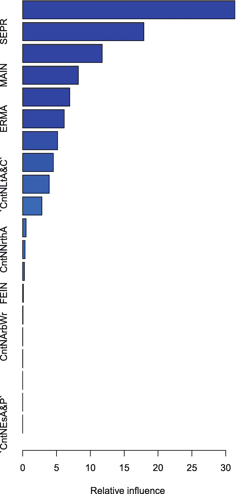

图 8-8

相对影响可视化

```py
summary(sgbModel)

##                     var rel.inf
## SPPO               SPPO  31.337
## SEPR               SEPR  17.903
## SPDY               SPDY  11.753
## MAIN               MAIN   8.223
## NYGN               NYGN   6.945
## ERMA               ERMA   6.127
## NYGD               NYGD   5.158
## SESC               SESC   4.519
## `CntNLtA&C` `CntNLtA&C`   3.912
## FEMA               FEMA   2.843
## Year               Year   0.504
## CntNNrthA     CntNNrthA   0.337
## CntNErpnU     CntNErpnU   0.250
## FEIN               FEIN   0.104
## `CntNME&NA` `CntNME&NA`   0.049
## CntNArbWr     CntNArbWr   0.018
## `CntNSb-SA` `CntNSb-SA`   0.016
## CntNCEatB     CntNCEatB   0.000
## `CntNEr&CA` `CntNEr&CA`   0.000
## `CntNEsA&P` `CntNEsA&P`   0.000

```

接下来，我们将注意力转向理解我们的模型的准确性。`residuals`函数用于计算训练模型对训练数据的 MSE(回想一下机器学习介绍章节中关于 MSE 的讨论)。我们将此与验证数据的预测值和实际值进行比较，发现模型很可能过度拟合。

```py
mean(stats::residuals(sgbModel)^2)

## [1] 3.6

mean((predict(sgbModel, sgbDataValidation) -
                  sgbDataValidation$SPAD)^2)

## [1] 15

```

这种方法的一个挑战是，任何特定模型本身的精确机制都非常复杂，很难理解是什么驱动了预测。软件包`DALEX`有一个名为`explain`的函数，它试图帮助理解模型的更多内容，以及预测器如何与响应进行交互。虽然这个软件包非常适用于比较测试数据上的各种模型，但语法可以通过训练和验证数据来学习。

`explain`函数采用模型作为第一个形式，一个标签来区分后面的图形(这里我们区分训练和验证)，一个指针指向我们的`data`，以及一个响应变量`SPAD`(青少年生育率)的断言。

```py
explainSGBt <- explain(sgbModel, label = "sgbt",
               data = sgbDataTrain,
               y = sgbDataTrain$SPAD)

explainSGBv <- explain(sgbModel, label = "sgbv",
               data = sgbDataValidation,
               y = sgbDataValidation$SPAD)

```

对于本文来说，`explain`对象本身并不特别重要。感兴趣的是能从他们身上找到的信息，函数`model_performance`是这些中的第一个。重用`cowplot`包中的`plot_grid`函数，绘制残差的分布和箱线图。图 8-9 中最左边的图表是残差绝对值的曲线图。记住正态分布残差的一般假设，然后想象绝对值变换将使正态分布看起来像两倍高度的半个分布，我们看到验证集看起来基本上仍然是正态的，尽管它比定型集更容易出错。第二张图显示了同样的事实，箱线图上的范围更大。

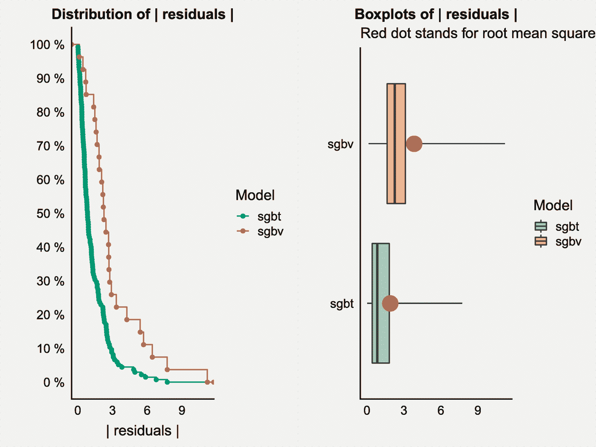

图 8-9

DALEX 残差可视化

```py
performanceSGBt <- model_performance(explainSGBt)
performanceSGBv <- model_performance(explainSGBv)

plot_grid(
  plot(performanceSGBt, performanceSGBv),
  plot(performanceSGBt, performanceSGBv, geom = "boxplot"),
  ncol = 2)

```

虽然我们已经看到了模型权重的相对影响，但是函数`variable_importance`计算了在没有来自各种变量的信息的情况下会出现的丢失损失。它对每个数据集都这样做，所以请注意，在图 [8-10](#Fig10) 中，训练数据的值不同于验证数据集的值。尽管如此，最顶端的关键变量确实与相对影响变量匹配(尽管顺序不同)。

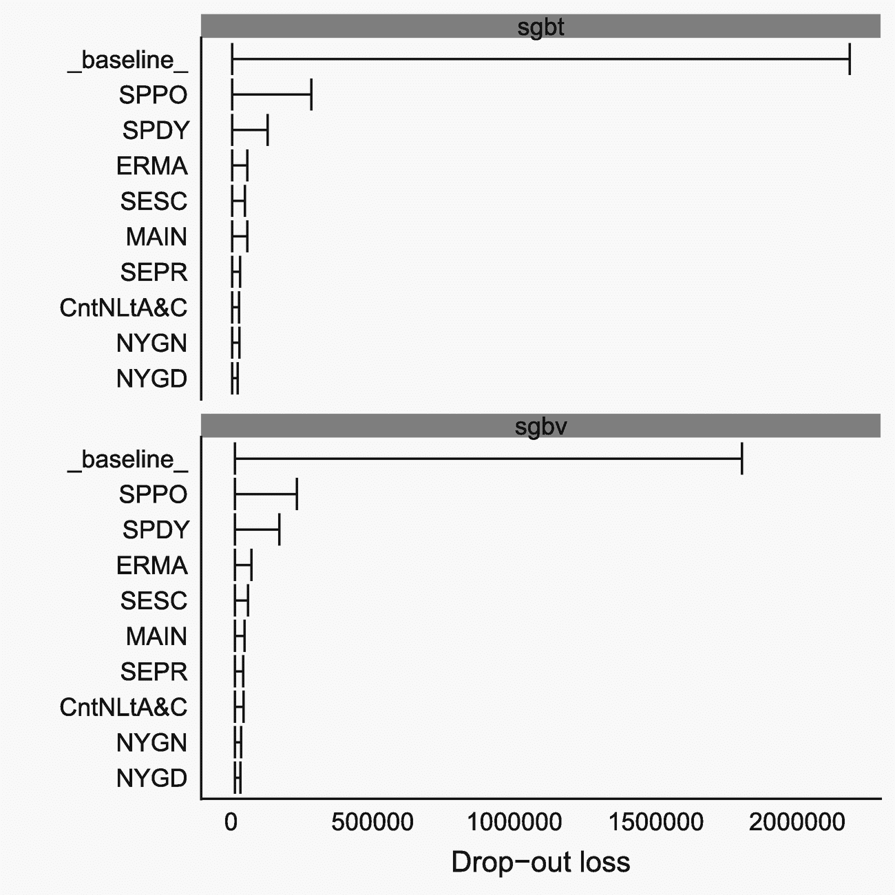

图 8-10

DALEX 辍学损失

```py
importanceSGBt <- variable_importance(explainSGBt)
importanceSGBv <- variable_importance(explainSGBv)
plot(importanceSGBt, importanceSGBv)

```

我们讨论的最后一个`DALEX`函数是`variable_response`函数，它接受一个单变量的附加形式参数。在这种情况下，我们选择部分相关图类型，并在图 [8-11](#Fig11) 中看到结果图。小学(`SEPR`)以外的女童人数与模型结果相对照。该图的价值在于，尽管模型本身可能不容易理解(不像简单的回归方程)，但青少年生育率和小学出勤率之间的关系是可以探究的。

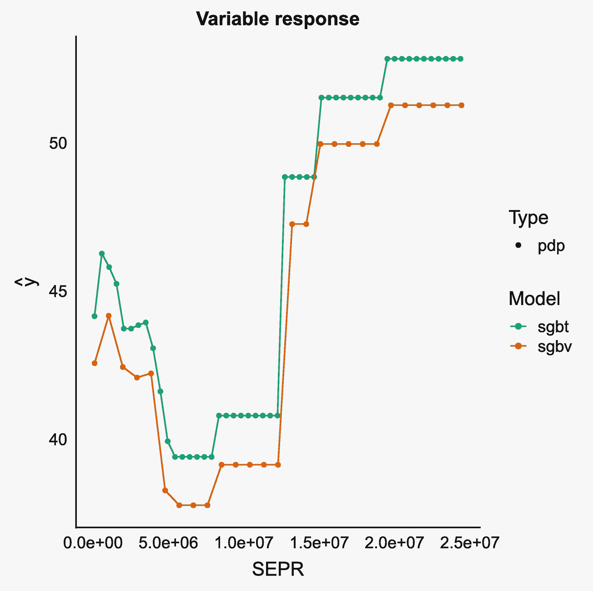

图 8-11

DALEX 小学缺课计数与少女怀孕。

```py
responseSGBprmt <- variable_response(explainSGBt, variable = "SEPR", type = "pdp")
responseSGBprmv <- variable_response(explainSGBv, variable = "SEPR", type = "pdp")
plot(responseSGBprmt, responseSGBprmv)

```

我们使用相同的设置运行代码，只是这次每 1000 人的死亡率(`SPDY`)如图 [8-12](#Fig12) 所示。这里，关系比较复杂。这也许说明了为什么这种类型的模型可能非常适合处理与预测值有复杂关系的数据。它还显示了为什么这个模型有过度拟合的风险。


图 8-12

DALEX 每 1，000 人死亡率与少女怀孕

```py
responseSGBdynt <- variable_response(explainSGBt, variable = "SPDY", type = "pdp")
responseSGBdynv <- variable_response(explainSGBv, variable = "SPDY", type = "pdp")
plot(responseSGBdynt, responseSGBdynv)

```

下一步是什么？嗯，这个模型并没有显示出很高的精确度。扩展调整网格以允许更多的树、更深的树和其他可变模式，从而为算法提供更宽的搜索网格以获得最佳模型。我们把这样的扩展留给感兴趣的读者，因为结构已经构建好了，然后继续下一个模型。

### 多层感知器

多层感知器(MLP)是一种前馈人工神经网络。这实际上并不完全是最新和最伟大的深度学习或神经网络算法。尽管如此，这是一种人们倾向于从学习开始的神经网络类型。在它的核心，神经网络只是一个由算法优化的线性代数矩阵乘法。净效应是，不是每个预测变量有一个权重的标准回归方程，而是有一个相当大的权重数组。

神经网络的一个关键特征是使用多个方程(因此是矩阵)，而不是试图用单个方程来创建预测值。实际上，预测器的每一部分都将被单独处理、加权并映射到可能的输出。此外，在输入和输出之间可能有几层方程式，而不是使用单一的方程式。这些被恰当地命名为“隐藏层”，虽然它们可以给模型带来很大的灵活性，但大多数多层感知器作为一个模型很难理解。他们的可取之处是他们经常做出相当准确的预测。

事实上，经典的例子是通过图像视觉识别数字或字符。我们的例子要简单得多，可能不太适合这种方法(事实上不是)。这并不以任何方式否定该方法在其他情况下的功效。和以前一样，我们使用虚拟变量创建最后一轮训练和验证数据。

```py
mlpDataTrain <- copy(trainData)
mlpDataTrain[,Year:=as.numeric(Year)]
mlpDataValidation <- copy(validationData)
mlpDataValidation[,Year:=as.numeric(Year)]

ddum <- dummyVars("˜.", data = mlpDataTrain)
mlpDataTrain <- data.table(predict(ddum, newdata = mlpDataTrain))
mlpDataValidation <- data.table(predict(ddum, newdata = mlpDataValidation))
rm(ddum)

```

模型和种子保持不变。这一次，使用了代表多层感知器的`method = "mlpML"`。尽管我们不使用主成分分析，但我们会继续扩展和集中我们的数据。第一次运行是通过默认方法完成的，该方法将第二层和第三层清空。这使得第一个隐藏层将被运行，并且默认情况下，模型在第一个层中模拟一些不同数量的节点。由于这本书的创建方式，警告被打印出来(事实上这通常是一个有用的特性)。对于这种模型，会发出许多警告，在这种情况下，这些警告仅显示超出本文范围的模型细微差别。函数`supressWarnings`用于其同名的结果。

```py
set.seed(12345)
suppressWarnings(
  mlpModel <- train(
    SPAD ~ .,
    data = mlpDataTrain,
    method = "mlpML",
    preProcess = c("scale", "center"),
    metric = "RMSE",
    trControl = trainControl(method = "cv",
                             number = 5)
  )
)
mlpModel

## Multi-Layer Perceptron, with multiple layers
##
## 135 samples
##  20 predictor

##
## Pre-processing: scaled (20), centered (20)
## Resampling: Cross-Validated (5 fold)
## Summary of sample sizes: 108, 108, 108, 107, 109
## Resampling results across tuning parameters:
##
##   layer1  RMSE  Rsquared  MAE
##   1       36    0.31      29
##   3       25    0.49      19
##   5       17    0.76      13
##
## Tuning parameter 'layer2' was held constant at a value of 0
##
## Tuning parameter 'layer3' was held constant at a value of 0
## RMSE was used to select the optimal model using the smallest value.

## The final values used for the model were layer1 = 5, layer2 = 0
##  and layer3 = 0.

```

从输出中可以看出，默认情况下，单个隐藏层被调整为五个节点。`summary`函数提供了更多的细节，显示了 20 个输入列、5 个隐藏节点和 1 个输出节点的激活函数权重和偏差。这也显示了我们网络的整体布局，20-5-1 布局。

```py
summary(mlpModel)

## SNNS network definition file V1.4-3D
## generated at Fri Nov 02 19:23:07 2018
##
## network name : RSNNS_untitled
## source files :
## no. of units : 26
## no. of connections : 105
## no. of unit types : 0
## no. of site types : 0
##
##
## learning function : Std_Backpropagation
## update function   : Topological_Order
##
##
## unit default section :

##
## act      | bias     | st | subnet | layer | act func     | out func
## ---------|----------|----|--------|-------|--------------|-------------
##  0.00000 |  0.00000 | i  |      0 |     1 | Act_Logistic | Out_Identity
## ---------|----------|----|--------|-------|--------------|-------------
##
##
## unit definition section :

##
## no. | typeName | unitName          | act      | bias     | st | position | act func     | out func | sites
## ----|----------|-------------------|----------|----------|----|----------|--------------|----------|-------
##   1 |          | Input_CntNArbWr   | -0.35224 |  0.25864 | i  |  1, 0, 0 | Act_Identity |          |
##   2 |          | Input_CntNCEatB   | -0.35224 | -0.07158 | i  |  2, 0, 0 | Act_Identity |          |
##   3 |          | Input_`CntNEr&CA` | -0.35224 |  0.17340 | i  |  3, 0, 0 | Act_Identity |          |
##   4 |          | Input_CntNErpnU   | -0.35224 |  0.09913 | i  |  4, 0, 0 | Act_Identity |          |
##   5 |          | Input_`CntNEsA&P` | -0.35224 |  0.02550 | i  |  5, 0, 0 | Act_Identity |          |
##   6 |          | Input_`CntNLtA&C` | -0.35224 | -0.07856 | i  |  6, 0, 0 | Act_Identity |          |
##   7 |          | Input_`CntNME&NA` | -0.35224 |  0.10749 | i  |  7, 0, 0 | Act_Identity |          |
##   8 |          | Input_CntNNrthA   | -0.35224 | -0.17845 | i  |  8, 0, 0 | Act_Identity |          |
##   9 |          | Input_`CntNSb-SA` |  2.81793 |  0.20316 | i  |  9, 0, 0 | Act_Identity |          | 

##  10 |          | Input_Year        |  1.51162 |  0.09500 | i  | 10, 0, 0 | Act_Identity |          |
##  11 |          | Input_NYGD        | -0.84754 | -0.12790 | i  | 11, 0, 0 | Act_Identity |          |
##  12 |          | Input_NYGN        | -0.83754 | -0.26720 | i  | 12, 0, 0 | Act_Identity |          |
##  13 |          | Input_SEPR        |  2.37160 |  0.23106 | i  | 13, 0, 0 | Act_Identity |          |
##  14 |          | Input_ERMA        |  2.28315 | -0.13108 | i  | 14, 0, 0 | Act_Identity |          |
##  15 |          | Input_SESC        | -1.27208 | -0.13525 | i  | 15, 0, 0 | Act_Identity |          |
##  16 |          | Input_FEMA        | -1.28836 |  0.21397 | i  | 16, 0, 0 | Act_Identity |          |
##  17 |          | Input_SPDY        |  0.55710 |  0.19976 | i  | 17, 0, 0 | Act_Identity |          |
##  18 |          | Input_FEIN        | -1.80461 | -0.15568 | i  | 18, 0, 0 | Act_Identity |          |
##  19 |          | Input_MAIN        | -1.77002 |  0.29051 | i  | 19, 0, 0 | Act_Identity |          |
##  20 |          | Input_SPPO        |  2.09958 | -0.29660 | i  | 20, 0, 0 | Act_Identity |          |
##  21 |          | Hidden_2_1        |  1.00000 | 16.57569 | h  |  1, 2, 0 |              |          |
##  22 |          | Hidden_2_2        |  1.00000 | -42.96722| h  |  2, 2, 0 |              |          |
##  23 |          | Hidden_2_3        |  0.00000 | -49.55274| h  |  3, 2, 0 |              |          |
##  24 |          | Hidden_2_4        |  1.00000 | 39.86870 | h  |  4, 2, 0 |              |          |
##  25 |          | Hidden_2_5        |  1.00000 | 21.29272 | h  |  5, 2, 0 |              |          |
##  26 |          | Output_1          | 66.31960 |-1069.78821| o |  1, 4, 0 | Act_Identity |          |
## ----|----------|-------------------|----------|----------|----|----------|--------------|----------|-------
##
##
## connection definition section :
##
## target | site | source:weight

## -------|------|---------------------------------------------------------
##     21 |      | 20:48.96251, 19:-47.13240, 18:-46.89282, 17:29.71989, 16:-31.71886, 15:-30.48963, 14:58.16447, 13:58.57929, 12:-15.94363,
##                 11:-15.49402, 10:21.26738,  9:66.89728,  8:-5.93687,  7:-24.55808,  6:-8.02125,  5:-5.53956,  4:-5.59685,  3:-5.55265,
##                  2:-5.77468,  1:-5.90555
##     22 |      | 20:19.36864, 19:-36.07077, 18:-30.54533, 17:30.76214, 16:-19.48156, 15:-10.87526, 14:40.41421, 13:38.18938, 12: 4.44169,
##                 11: 0.46633, 10:46.79949,  9:49.01194,  8:15.15641,  7:-81.96992,  6:14.43461,  5:-6.70102,  4:-40.07672,  3:12.00658,
##                  2: 7.56544,  1:31.19720
##     23 |      | 20:-12.19030, 19: 2.85565, 18:31.55284, 17:84.06341, 16:77.33264, 15:103.85283, 14:-12.62139, 13:-9.16594, 12:81.62211,

##                 11:81.21730, 10:-194.05856,  9:49.49640,  8:115.78496,  7:-4.44688,  6:179.36331,  5:-26.62095,  4:35.70350,  3:-54.66271,
##                  2:33.46564,  1:-328.59045
##     24 |      | 20:22.24673, 19:-17.17476, 18:-17.65513, 17:-30.85148, 16:-20.34034, 15:-17.87234, 14:19.58477, 13:16.31513, 12:-25.13864,
##                 11:-24.56263, 10:-14.12056,  9:11.75429,  8:-14.03880,  7:-0.54804,  6:62.57944,  5:14.06488,  4:-13.82649,  3:-14.21823,
##                  2:-31.15477,  1:-13.92656
##     25 |      | 20:35.84281, 19:-31.83327, 18:-33.52740, 17: 7.88547, 16:-23.72048, 15:-24.41236, 14:36.01567, 13:37.40243, 12:-16.33773,
##                 11:-15.88420, 10:19.37509,  9:42.81319,  8:-7.29130,  7:10.05342,  6:-4.69724,  5:-11.28413,  4:-7.28304,  3:-7.42553,
##                  2:-7.40186,  1:-7.59370
##     26 |      | 25: 5.30307, 24:31.84159, 23:30.69779, 22:36.21242, 21:-7.03748

## -------|------|--------------------------------------------------------

```

正如对相对简单的数据集使用过于复杂的方法所暗示的那样，该模型的表现并不那么好。它在验证数据上的表现甚至更差。注意，由于`residuals`函数被一个必需的包屏蔽了，我们明确地要求`residuals`的基础`R`版本。

```py
mean(stats::residuals(mlpModel)ˆ2)

## [1] 462

mean((predict(mlpModel, mlpDataValidation) -
                  mlpDataValidation$SPAD)ˆ2)

## [1] 407

```

同样，这种方法的一个挑战是任何特定模型本身的精确机制都足够复杂，以至于很难理解是什么驱动了预测。我们再次使用包`DALEX`恰当命名的`explain`函数来显示预测器如何与响应交互。

回想一下，`explain`函数语法将模型用作第一种形式，一个用于区分后面图形的标签(这里我们区分训练和验证)，一个指向我们的`data`的指针，以及一个我们的响应变量`SPAD`的断言。

```py
explainMLPt <- explain(mlpModel, label = "mlpt",
               data = mlpDataTrain,
               y = mlpDataTrain$SPAD)

explainMLPv <- explain(mlpModel, label = "mlpv",
               data = mlpDataValidation,
               y = mlpDataValidation$SPAD)

```

还是像以前一样，`explain`物体本身并不特别有趣。感兴趣的是能从他们身上找到的信息，函数`model_performance`是这些中的第一个。重用`cowplot`包中的`plot_grid`函数，绘制残差的分布和箱线图。图 8-13 中最左边的图表是残差绝对值的曲线图。记住正态分布残差的一般假设，然后想象绝对值变换将使正态分布看起来像两倍高度的半个分布，我们看到验证集看起来基本上仍然是正态的，尽管它比定型集更容易出错。我们还看到前面章节中的`gbm`方法不容易出错。第二张图表继续显示同样的事实，箱线图上的范围更大。在这两种情况下，图表也显示了过度训练的永久风险。模型数据看不到的验证数据具有更大的残差。

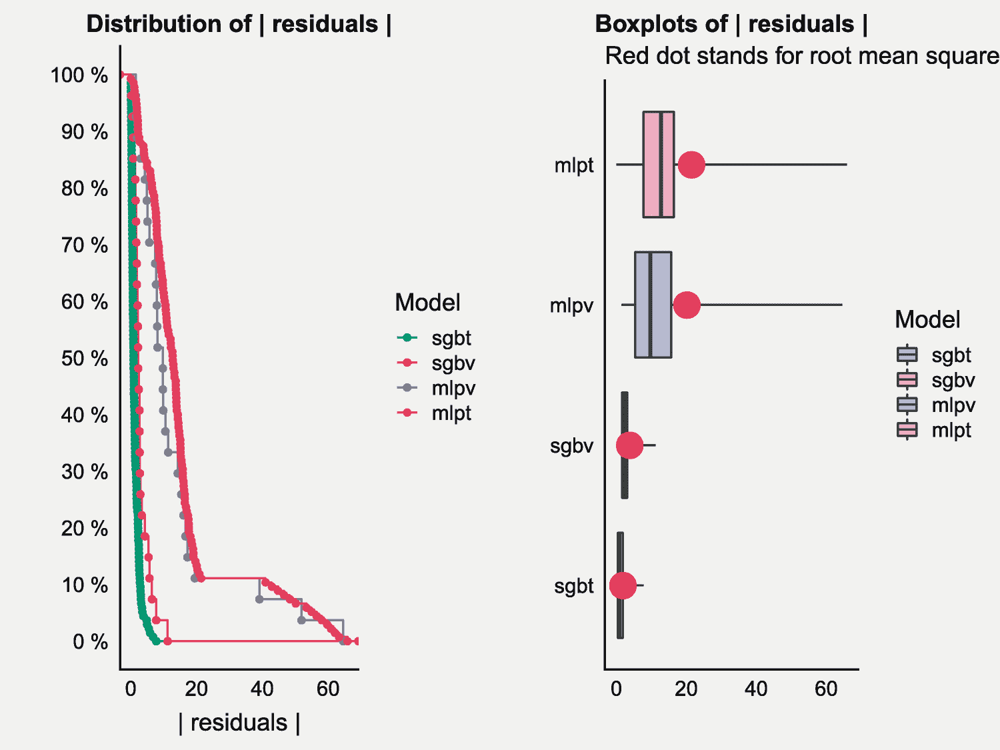

图 8-13

对比 SGB 和 MLP 方法的模型性能

```py
performanceMLPt <- model_performance(explainMLPt)
performanceMLPv <- model_performance(explainMLPv)

plot_grid(
plot(performanceMLPt, performanceMLPv, performanceSGBt, performanceSGBv),
plot(performanceMLPt, performanceMLPv, performanceSGBt, performanceSGBv, geom = "boxplot"),
ncol = 2
)

```

我们使用`variable_importance`函数来计算在没有各种变量信息的情况下的辍学损失。有趣的是，在这些图中——以及之前的`gbm`模型中的图——哪些变量是最关键的。回想一下退学后损失最大的变量，如图 [8-14](#Fig14) 所示。这表明我们的多层感知器模型这些相同的数据非常不同。在这种情况下，这似乎是一个弱点。然而，从其他数据来看，这种差异很可能是一种优势。

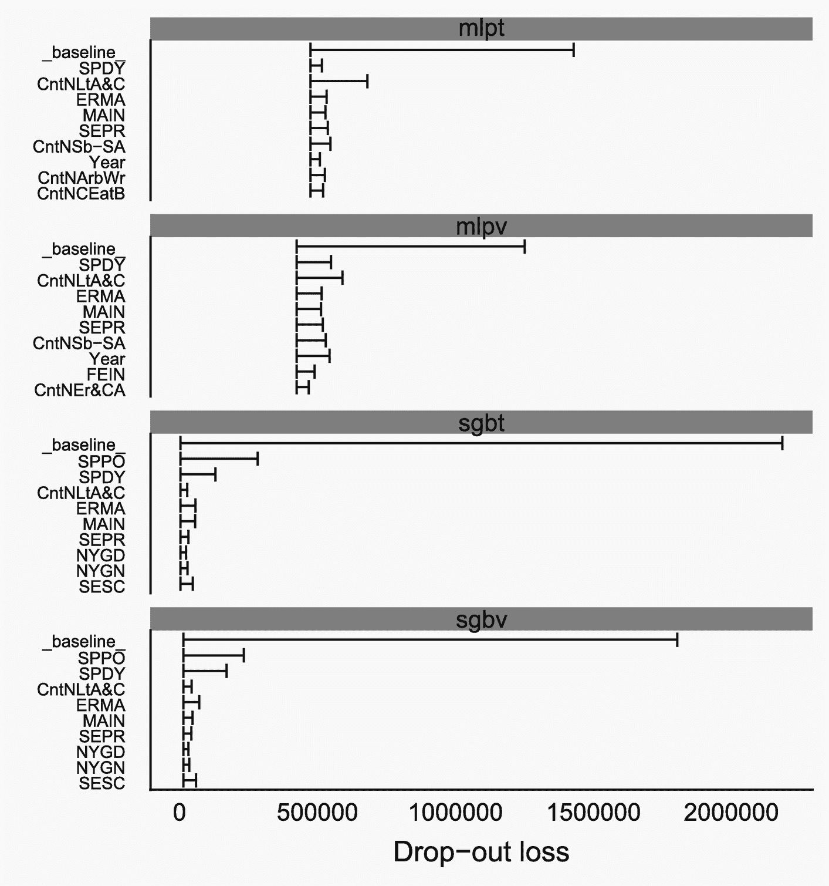

图 8-14

确定主要变量

```py
importanceMLPt <- variable_importance(explainMLPt)
importanceMLPv <- variable_importance(explainMLPv)
plot(importanceMLPt, importanceMLPv, importanceSGBt, importanceSGBv)

```

如前所述，我们以`DALEX`函数`variable_response`结束，它接受一个单变量的附加形式参数。在这种情况下，我们选择部分相关图类型，并在图 [8-15](#Fig15) 中看到结果图。小学以外的女生人数与模型结果相对照。该图的价值仍然在于，尽管模型本身可能不容易理解(不像简单的回归方程)，但青少年生育率和小学出勤率之间的关系是可以探索的。


图 8-15

了解小学入学率对少女怀孕的影响

```py
responseMLPprmt <- variable_response(explainMLPt, variable = "SEPR", type = "pdp")
responseMLPprmv <- variable_response(explainMLPv, variable = "SEPR", type = "pdp")

plot(responseMLPprmt, responseMLPprmv, responseSGBprmt, responseSGBprmv)

```

我们使用如图 [8-16](#Fig16) 所示的每 1000 人死亡率来结束我们的`DALEX`探索。在这里，两种模式之间的对比更加鲜明。这再次证明了潜在的方法是完全不同的，因此`mlpML`可能适用于早期方法未能实现有效预测的其他数据。

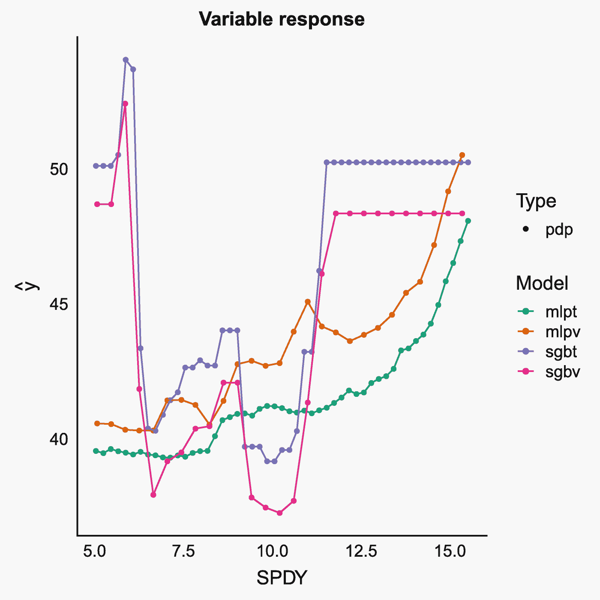

图 8-16

DALEX 每 1，000 人死亡率与少女怀孕

```py
responseMLPdynt <- variable_response(explainMLPt, variable = "SPDY", type = "pdp")
responseMLPdynv <- variable_response(explainMLPv, variable = "SPDY", type = "pdp")
plot(responseMLPdynt, responseMLPdynv, responseSGBdynt, responseSGBdynv)

```

在结束本节之前，我们考虑一下我们的模型是否调得不够好。由于其复杂性，多层感知器往往有许多调整参数。对于`caret`，尤其是`mlpML`，调整参数是隐藏层的数量，以及每个隐藏层中的节点数量。使用我们现在熟悉的`tuneGride`形式和`expand.grid`函数，我们让模型探索一千多个选项，以确定一个最佳模型。对于现实生活中的应用程序，感知器方法被认为是可能的最佳模型，拥有数百个节点并不罕见。这就产生了数以万计的变量，每个变量都被模型依次优化。这是对计算资源的重大投资，在这种情况下，将不会有回报。

```py
set.seed(12345)

suppressWarnings(
  mlpModelb <- train(
    SPAD ~ .,
    data = mlpDataTrain,
    method = "mlpML",
    preProcess = c("scale", "center"),
    metric = "RMSE",
    verbose = FALSE,
    trControl = trainControl(method = "cv",
                             number = 5),
    tuneGrid = expand.grid(
      layer1 = 0:10,
      layer2 = 0:10,
      layer3 = 0:10
    )
  )
)
mlpModelb

## Multi-Layer Perceptron, with multiple layers
##
## 135 samples
##  20 predictor

##
## Pre-processing: scaled (20), centered (20)
## Resampling: Cross-Validated (5 fold)
## Summary of sample sizes: 108, 108, 108, 107, 109
## Resampling results across tuning parameters:
## 

##   layer1  layer2  layer3  RMSE  Rsquared  MAE
##    0       0       0       NaN      NaN      NaN
##    0       0       1        41  1.4e-01     30.4
##    0       0       2        36  3.0e-01     27.1
##    0       0       3        26  4.9e-01     17.5
##    0       0       4        18  7.4e-01     14.6
##    0       0       5        18  7.9e-01     14.2
##    0       0       6        16  7.7e-01     11.9
##    0       0       7        14  8.3e-01     10.7
##    0       0       8        16  8.0e-01     12.0
##    0       0       9        15  8.1e-01      9.8
##    0       0      10        11  8.8e-01      8.9
##    0       1       0        37  2.6e-01     29.9
##    0       1       1        33  3.0e-01     25.1
##    0       1       2        36  4.0e-01     28.5
##    0       1       3        38  3.2e-01     28.7
##    0       1       4        35  6.7e-02     24.7
##    0       1       5        33  2.3e-01     24.4
##    0       1       6        35  1.4e-01     26.1
##    0       1       7        34  2.0e-01     28.5
##    0       1       8        56  3.0e-01     50.3
##    0       1       9        41  3.7e-01     36.8
##    0       1      10        41  1.3e-01     32.9
##    0       2       0        28  3.5e-01     18.8
##    0       2       1        42  2.5e-01     32.2
##    0       2       2        40  1.7e-01     33.7
##    0       2       3        36  4.5e-01     27.7
##    0       2       4        34  2.5e-01     24.6
##    0       2       5        34  4.1e-01     28.1
##    0       2       6        32  3.0e-01     23.2
##    0       2       7        35  3.8e-01     27.6
##    0       2       8        39  2.6e-01     29.9
##    0       2       9        40  2.3e-01     31.9
##    0       2      10       249  3.3e-01    243.2
##    0       3       0        24  5.8e-01     19.1
##    0       3       1        40  2.3e-01     30.7
##    0       3       2        40  3.9e-04     33.2
##    0       3       3        38  2.7e-01     30.7
##    0       3       4        35  4.4e-01     26.2
##    0       3       5        36  8.9e-02     30.0
##    0       3       6        32  4.3e-01     21.5
##    0       3       7        32  2.1e-01     25.8
##    0       3       8        46  2.3e-01     37.9
##    0       3       9        30  3.0e-01     21.6
##    0       3      10        48  3.3e-01     42.4
##    0       4       0        22  5.7e-01     17.2
##    0       4       1        51  2.9e-01     42.1
##    0       4       2        38  2.3e-01     30.9
##    0       4       3        35  5.0e-02     27.3
##    0       4       4        36  2.2e-01     24.4
##    0       4       5        35  2.1e-01     29.9

##    0       4       6        31  2.6e-01     23.2
##    0       4       7        38  2.2e-01     28.8
##    0       4       8        31  4.1e-01     23.2
##    0       4       9        33  2.8e-01     27.1
##    0       4      10        35  3.1e-01     27.5
##    0       5       0        24  5.6e-01     16.5
##    0       5       1        37  3.7e-01     29.4
##    0       5       2        32  2.8e-02     25.2
##    0       5       3        34  2.6e-01     25.3
##    0       5       4        31  2.3e-01     22.6
##    0       5       5        40  2.0e-01     31.4
##    0       5       6        33  8.7e-02     25.3
##    0       5       7        30  2.7e-01     22.3
##    0       5       8        35  1.9e-01     25.3
##    0       5       9        28  3.3e-01     21.1
##    0       5      10        34  3.9e-01     27.1
##    0       6       0        18  7.4e-01     14.7
##    0       6       1        34      NaN     24.0
##    0       6       2        37  1.3e-01     26.5
##    0       6       3        32  3.9e-01     22.3
##    0       6       4        35  2.5e-01     24.4
##    0       6       5        33  2.1e-01     26.0
##    0       6       6        52  1.9e-01     42.8
##    0       6       7        30  2.7e-01     23.8
##    0       6       8        36  3.3e-01     27.8
##    0       6       9        54  1.5e-01     45.9
##    0       6      10        30  2.8e-01     23.7
##    0       7       0        22  7.0e-01     17.0
##    0       7       1        38  4.4e-02     30.6
##    0       7       2        42  1.5e-01     35.7
##    0       7       3        35  1.2e-01     24.6
##    0       7       4        33  2.4e-01     25.3
##    0       7       5        39  1.5e-01     32.4
##    0       7       6        32  1.7e-01     24.4
##    0       7       7        32  2.7e-01     26.3
##    0       7       8        41  1.3e-01     33.6
##    0       7       9        33  1.4e-01     25.6
##    0       7      10        31  2.5e-01     22.1
##    0       8       0        15  8.3e-01     11.9
##    0       8       1        34      NaN     25.8
##    0       8       2        33  6.2e-02     25.1

##    0       8       3        30  3.2e-01     22.5
##    0       8       4        43  1.8e-01     37.1
##    0       8       5        39  3.3e-01     31.3
##    0       8       6        34  1.1e-01     26.0
##    0       8       7        34  1.3e-01     24.7
##    0       8       8        45  1.2e-01     38.6
##    0       8       9        32  3.1e-01     23.3
##    0       8      10        50  4.4e-01     42.3
##    0       9       0        15  8.4e-01     11.9
##    0       9       1        34      NaN     24.7
##    0       9       2        34  1.6e-01     26.6
##    0       9       3        34  5.2e-01     25.5
##    0       9       4        43  2.4e-01     33.8
##    0       9       5        44  2.2e-01     37.4
##    0       9       6        37  3.6e-01     30.3
##    0       9       7        39  2.8e-01     27.3
##    0       9       8        35  1.3e-01     27.1
##    0       9       9        31  2.9e-01     22.3
##    0       9      10        51  2.2e-01     41.2
##    0      10       0        19  7.6e-01     15.1
##    0      10       1        44      NaN     35.5
##    0      10       2        33      NaN     26.3
##    0      10       3        37  4.8e-01     29.8
##    0      10       4        33  9.2e-02     24.2
##    0      10       5        35  1.4e-01     25.9
##    0      10       6        35  1.7e-01     27.7
##    0      10       7        32  1.6e-01     23.0
##    0      10       8        67  5.1e-02     62.2
##    0      10       9        31  1.6e-01     23.7
##    0      10      10        32  3.1e-01     25.1
##    1       0       0        39  4.1e-01     31.2
##    1       0       1        37  5.3e-01     29.1
##    1       0       2        40  3.5e-01     31.7
##    1       0       3        34  7.9e-02     24.5
##    1       0       4        36  3.8e-01     24.6
##    1       0       5        33  3.8e-01     24.7
##    1       0       6        35  3.4e-01     27.3
##    1       0       7        37  2.3e-01     27.4

##    1       0       8        30  3.8e-01     21.4
##    1       0       9        38  2.7e-01     30.3
##    1       0      10        40  2.8e-01     32.9
##    1       1       0        37  2.2e-01     29.0
##    1       1       1        42  7.3e-01     32.5
##    1       1       2        38  6.4e-01     31.6
##    1       1       3        33      NaN     25.0
##    1       1       4        36  4.5e-01     24.4
##    1       1       5        32  7.1e-01     26.1
##    1       1       6        34  2.7e-01     25.7
##    1       1       7        39  3.2e-01     31.9
##    1       1       8        37  5.4e-01     30.0
##    1       1       9        37  2.5e-01     28.4
##    1       1      10        35  9.0e-02     27.5
##    1       2       0        40  4.8e-01     34.1
##    1       2       1        34      NaN     25.7
##    1       2       2        33  5.0e-01     24.8
##    1       2       3        36  5.1e-01     26.6
##    1       2       4        40  4.6e-01     32.0
##    1       2       5        33  5.1e-01     23.7
##    1       2       6        41  5.5e-01     33.0
##    1       2       7        32  4.7e-01     23.3
##    1       2       8        33  3.5e-01     25.2
##    1       2       9        38  4.5e-01     29.5
##    1       2      10        39  4.5e-01     30.5
##    1       3       0        32  4.1e-01     24.1
##    1       3       1        34      NaN     26.3
##    1       3       2        34  2.8e-01     27.0
##    1       3       3        41      NaN     31.2
##    1       3       4        33  6.5e-01     23.4
##    1       3       5        31  5.4e-01     23.4
##    1       3       6        41  6.8e-01     33.8
##    1       3       7        44  5.0e-01     32.6
##    1       3       8        57  4.2e-01     47.5
##    1       3       9        41  4.7e-01     34.1
##    1       3      10        42  2.8e-01     32.6
##    1       4       0        38  4.3e-01     28.8
##  [ reached getOption("max.print") -- omitted 1165 rows ]
##
## RMSE was used to select the optimal model using the smallest value.

## The final values used for the model were layer1 = 0, layer2 = 0
##  and layer3 = 10.

mean(stats::residuals(mlpModelb)^2)

## [1] 668

mean((predict(mlpModelb, mlpDataValidation) -
                  mlpDataValidation$SPAD)^2)

## [1] 552

summary(mlpModelb)

## SNNS network definition file V1.4-3D
## generated at Fri Nov 02 19:34:18 2018
##
## network name : RSNNS_untitled
## source files :
## no. of units : 31

## no. of connections : 210
## no. of unit types : 0
## no. of site types : 0
##
##
## learning function : Std_Backpropagation
## update function   : Topological_Order
##
##
## unit default section :
##
## act      | bias     | st | subnet | layer | act func     | out func
## ---------|----------|----|--------|-------|--------------|-------------
##  0.00000 |  0.00000 | i  |      0 |     1 | Act_Logistic | Out_Identity
## ---------|----------|----|--------|-------|--------------|-------------
##
##
## unit definition section :

##
## no. | typeName | unitName          | act      | bias     | st | position | act func     | out func | sites
## ----|----------|-------------------|----------|----------|----|----------|--------------|----------|-------
##   1 |          | Input_CntNArbWr   | -0.35224 |  0.27237 | i  |  1, 0, 0 | Act_Identity |          |
##   2 |          | Input_CntNCEatB   | -0.35224 |  0.12640 | i  |  2, 0, 0 | Act_Identity |          |
##   3 |          | Input_`CntNEr&CA` | -0.35224 |  0.14994 | i  |  3, 0, 0 | Act_Identity |          |
##   4 |          | Input_CntNErpnU   | -0.35224 |  0.05916 | i  |  4, 0, 0 | Act_Identity |          |
##   5 |          | Input_`CntNEsA&P` | -0.35224 | -0.03508 | i  |  5, 0, 0 | Act_Identity |          |
##   6 |          | Input_`CntNLtA&C` | -0.35224 |  0.20488 | i  |  6, 0, 0 | Act_Identity |          |
##   7 |          | Input_`CntNME&NA` | -0.35224 | -0.18422 | i  |  7, 0, 0 | Act_Identity |          |
##   8 |          | Input_CntNNrthA   | -0.35224 | -0.24506 | i  |  8, 0, 0 | Act_Identity |          |
##   9 |          | Input_`CntNSb-SA` |  2.81793 | -0.11938 | i  |  9, 0, 0 | Act_Identity |          |
##  10 |          | Input_Year        |  1.70822 |  0.19864 | i  | 10, 0, 0 | Act_Identity |          |
##  11 |          | Input_NYGD        | -0.84501 |  0.20640 | i  | 11, 0, 0 | Act_Identity |          |
##  12 |          | Input_NYGN        | -0.83288 |  0.20374 | i  | 12, 0, 0 | Act_Identity |          |
##  13 |          | Input_SEPR        |  2.38957 |  0.21969 | i  | 13, 0, 0 | Act_Identity |          |
##  14 |          | Input_ERMA        |  2.33470 | -0.14782 | i  | 14, 0, 0 | Act_Identity |          |
##  15 |          | Input_SESC        | -1.32473 | -0.08605 | i  | 15, 0, 0 | Act_Identity |          |
##  16 |          | Input_FEMA        | -1.37682 |  0.28955 | i  | 16, 0, 0 | Act_Identity |          |
##  17 |          | Input_SPDY        |  0.44706 |  0.01856 | i  | 17, 0, 0 | Act_Identity |          |
##  18 |          | Input_FEIN        | -1.72852 | -0.10129 | i  | 18, 0, 0 | Act_Identity |          |
##  19 |          | Input_MAIN        | -1.69223 | -0.26429 | i  | 19, 0, 0 | Act_Identity |          |
##  20 |          | Input_SPPO        |  2.06062 | -0.17451 | i  | 20, 0, 0 | Act_Identity |          | 

##  21 |          | Hidden_2_1        |  1.00000 | -8.20578 | h  |  1, 2, 0 |              |          |
##  22 |          | Hidden_2_2        |  0.00000 | -61.29456| h  |  2, 2, 0 |              |          |
##  23 |          | Hidden_2_3        |  1.00000 | -4.93293 | h  |  3, 2, 0 |              |          |
##  24 |          | Hidden_2_4        |  0.00000 | -1.26154 | h  |  4, 2, 0 |              |          |
##  25 |          | Hidden_2_5        |  1.00000 | -136.45082| h |  5, 2, 0 |              |          |
##  26 |          | Hidden_2_6        |  1.00000 | -3.98742 | h  |  6, 2, 0 |              |          |
##  27 |          | Hidden_2_7        |  1.00000 | -38.50706| h  |  7, 2, 0 |              |          |
##  28 |          | Hidden_2_8        |  1.00000 | -59.23545| h  |  8, 2, 0 |              |          |
##  29 |          | Hidden_2_9        |  1.00000 | -13.07257| h  |  9, 2, 0 |              |          |
##  30 |          | Hidden_2_10       |  0.00000 | -3.80823 | h  | 10, 2, 0 |              |          |
##  31 |          | Output_1          | 80.51889 | 165.28026| o  |  1, 4, 0 | Act_Identity |          |
## ----|----------|-------------------|----------|----------|----|----------|--------------|----------|-------
## 

##
## connection definition section :
##
## target | site | source:weight
## -------|------|--------------------------------------------------------
##     21 |      | 20:14.99080, 19:-4.37922, 18:-5.64107, 17:-14.21278, 16:-7.40044, 15:-6.96982, 14: 2.04649, 13: 3.28454, 12:-1.09398,

##                 11:-1.05998, 10:-10.35237,  9: 3.07458,  8: 2.81771,  7: 7.14501,  6:22.43020,  5:-17.89252,  4: 2.94234,  3:-3.41989,
##                 2:-20.86507,  1: 2.99437
##     22 |      | 20:-42.11395, 19:46.16928, 18:46.41003, 17: 5.73816, 16:50.23483, 15:47.74510, 14:-48.54859, 13:-49.08794, 12:49.66853,
##                 11:51.15318, 10:-5.34949,  9:-55.80005,  8:25.68831,  7:-2.84146,  6:-12.38087,  5:-27.17203,  4:23.60743,  3:24.90088,
##                 2: 1.37566,  1:22.42043
##     23 |      | 20: 3.55224, 19:-3.82663, 18:-2.81083, 17:-8.62280, 16:-6.84271, 15:-6.68200, 14: 2.13178, 13: 1.19267, 12:-12.25461,
##                 11:-12.00026, 10: 7.13982,  9:-0.63003,  8:-19.36786,  7: 1.56885,  6:18.87510,  5: 1.15033,  4: 1.62183,  3: 1.71615,
##                 2:-6.58669,  1: 1.57223
##     24 |      | 20:-3.03815, 19: 2.09218, 18: 5.45140, 17: 8.87992, 16: 8.22070, 15:10.87528, 14:-0.88254, 13:-2.19428, 12: 8.49697,
##                 11: 8.60248, 10:-5.41809,  9: 0.47726,  8:10.84176,  7:-27.30257,  6:14.88415,  5:-4.98278,  4: 0.67941,  3: 1.06026,

##                 2: 5.48360,  1:-0.97088
##     25 |      | 0:115.12606, 19:-66.18334, 18:-81.21451, 17:59.74724, 16:-65.24387, 15:-91.23738, 14:48.93630, 13:63.63233, 12:17.89186,
##                 11:13.69802, 10:-49.68809,  9:48.28717,  8:-4.37396,  7:36.57324,  6:-239.25703,  5:-116.16022,  4:45.37873,  3:47.11736,
##                 2:-11.51299,  1:193.68028
##     26 |      | 20: 1.62858, 19:-6.50968, 18:-10.44102, 17:-22.89452, 16:-21.50499, 15:-24.28332, 14:12.23182, 13: 8.47606, 12:-39.59196,
##                 11:-38.13202, 10:14.99837,  9: 1.17484,  8:-42.70610,  7: 0.45940,  6:19.33571,  5:48.32096,  4: 2.15939,  3: 1.45809,
##                 2:-34.17036,  1: 4.24288
##     27 |      | 20:24.32948, 19:-21.69843, 18:-29.03406, 17:-39.08598, 16:-39.70897, 15:-33.39420, 14:22.44779, 13:21.58632, 12:-34.10506,
##                 11:-30.81281, 10: 8.56867,  9:13.75277,  8:15.13938,  7: 4.94741,  6:29.65086,  5:20.66949,  4:-30.40738,  3:-89.47778,

##                 2: 7.78840,  1:27.43818
##     28 |      | 20:74.58337, 19:-73.31054, 18:-54.84992, 17:38.25743, 16:-26.25908, 15:-6.00562, 14:51.08411, 13:57.09294, 12:-2.95093,
##                 11: 5.12013, 10:-112.35419,  9:81.15020,  8:53.54121,  7:63.02877,  6:169.16539,  5:-121.10607,  4:-34.08242,  3:-29.48601,
##                 2:-13.01993,  1:-169.10889
##     29 |      | 20:29.63905, 19:-10.05235, 18:-26.69251, 17:-51.13666, 16:-14.93525, 15:-15.09192, 14:20.62878, 13:20.32225, 12:-9.60404,
##                 11:-9.00413, 10:72.53555,  9:19.84532,  8: 7.09636,  7:60.42725,  6:35.26074,  5:-6.58941,  4: 4.21469,  3:-123.86588,
##                 2:-1.78124,  1: 5.16048
##     30 |      | 20:-1.49977, 19: 0.78230, 18: 3.44946, 17: 9.52544, 16: 5.21607, 15: 7.46949, 14: 2.12706, 13: 0.74737, 12: 7.23410,
##                 11: 7.26661, 10:-4.33287,  9: 1.54910,  8: 7.26920,  7:-28.82655,  6:10.88533,  5: 1.27544,  4: 1.88801,  3: 1.09380,
##                 2: 3.79257,  1: 1.51486
##     31 |      | 30: 9.60220, 29:-8.94521, 28:33.58144, 27: 1.55787, 26: 8.52473, 25:45.79420, 24:-4.24323, 23:-18.14175, 22: 5.18716,
##                 21:18.14762
## -------|------|--------------------------------------------------------

```

不仅没有回报，使用几个多达十个节点的隐藏层的大胆尝试产生了一个最佳估计模型，该模型只包括一个只有八个节点的层。尽管在这种情况下感觉令人失望，但神经网络领域是机器学习的一个迷人和不断增长的领域。

多层感知器的介绍到此结束。它还总结了我们的监督机器学习方法的介绍。虽然在这一章中，我们只探讨了少数几个模型，我们已经探讨了几种不同的模型类型。最重要的是，通过使用`caret`，而不是每次练习一个新的结构，你有能力轻松地尝试几十个可能的模型。请记住，每种模型类型都倾向于拥有最适合的特定类型的数据，并且在处理或不处理分类或数字数据的能力方面可能有不同的标准。此外，一些模型对主成分分析有要求或限制。最后，记住模型可能如何处理缺失数据是很重要的。有些方法需要完整的数据，在这种情况下，关于缺失数据的章节可能会有所帮助。其他方法对缺失数据更稳健。

最后，我们委婉地提醒我们的读者，在确定哪种方法是最佳的之后，正确的最后一步是根据所有可用的数据对模型进行最后一次训练——尤其是在可用数据不多的情况下。对于模型调整，使用交叉验证来阻止过度拟合仍然是有帮助的。

## 8.3 总结

本章介绍并探索了作为多个模型的公共接口的`caret`包。通过这种权宜之计，检查最佳模型拟合的多种算法变得更加简单。此外，还研究了为建模做准备的数据预处理方法。最后，虽然没有明确编码，但是讨论了将原始数据分为训练集、验证集和测试集的原则。特别关注的概念是，所有模型都根据训练数据进行训练，使用验证数据选择最终的最佳模型，并通过原始的、未使用的测试数据对最终模型的真实性能进行评估。本章使用的功能汇总在表 [8-2](#Tab2) 中。

表 8-2

本章中描述的关键功能列表及其功能摘要

<colgroup><col class="tcol1 align-left"> <col class="tcol2 align-left"></colgroup> 
| 

功能

 | 

它的作用

 |
| --- | --- |
| `boxplot()` | 生成箱线图，允许目视检查异常值和其他畸形数据。 |
| `cbind()` | 通过列将数据绑定在一起。 |
| `colnames()` | 列出数据集中列标题的名称。 |
| `confusionMatrix()` | 显示分类预测的实际输出与预测输出的实例。 |
| `copy()` | 创建数据的完整副本，而不是使用指针。这可以防止对副本的编辑级联到原始数据集。它确实能加倍记忆。 |
| `cor()` | 计算相关性。 |
| `createDataPartition()` | Caret 软件包功能，创建注意数据分段的训练/测试数据。在这种情况下，这一点很重要，因为数据是区域性的。 |
| `dummyVars()` | 一个热点编码回归分类数据。 |
| `expand.grid()` | 使用所有可能组合的所有输入来创建数据框。 |
| `explain()` | 在使用其他 DALEX 方法之前需要 DALEX 函数。 |
| `fancyRpartPlot()` | 更丰富多彩的树形图以及额外的有用数据。 |
| `gbm` | 插入符号的梯度增强机器形式。 |
| `hist()` | 绘制直方图。 |
| `lapply()` | 列表应用功能。 |
| `mlpML` | 多层感知器(多层)形式插入符号。 |
| `model_performance()` | 创建可绘制剩余对象的 DALEX 函数。 |
| `par()` | 可用于通过 R 的默认图形包设置图形参数(如用于绘制图形的列或行)。 |
| `pca()` | pcaMethods 软件包的主成分分析。 |
| `plot_grid()` | Cowplot 函数用于设置绘制多个图形的列和行—与 base R 的图形包函数 par()形成对比。 |
| `prcomp()` | 主成分分析从基地 R 统计软件包。 |
| `predict()` | 给定一个模型，从给定的输入预测输出。 |
| `qqnorm()` | 绘制 Q-Q 图。 |
| `ranger` | 插入符号的随机森林形式。 |
| `rpart` | 脱字符号的分类和回归树形式。 |
| `sapply()` | 简化应用功能。 |
| `scale()` | 基数 R 函数缩放和居中数据。 |
| `shapiro.test()` | 计算夏皮罗-威尔基的常态标准。 |
| `stats::residuals()` | 根据模型计算残差(base R stats 包版本)。 |
| `summary()` | 尽可能提供给定输入的摘要。 |
| `svmLinear` | 插入符号的支持向量机(线性)形式。 |
| `svmPoly` | 插入符号的支持向量机(多项式)形式。 |
| `train()` | 通过给定的训练数据训练指定模型的插入符号函数。 |
| `trainControl()` | 为所提供的培训方法提供输入的形式(和功能)(例如，交叉验证和折叠次数)。 |
| `variable_importance()` | 计算压差损失的 DALEX 函数。 |
| `variable_response()` | 计算部分相关性的 DALEX 函数。 |
| `View()` | 在新的查看窗口中打开数据框/表进行交互式查看。 |