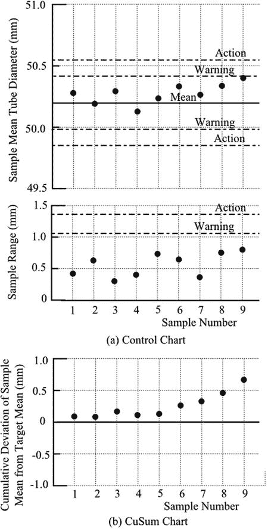
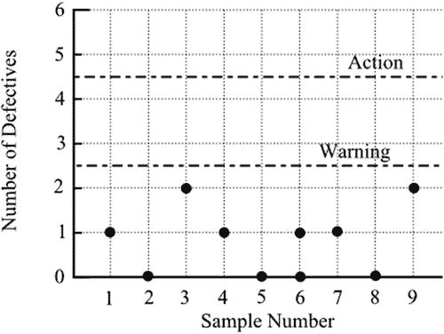

# 20.控制图

Navigating around the Factory

质量控制程序用于生产过程，以确保产品持续符合适当的规格。通常，对产品进行定期取样；控制图，有时也称为休哈特图，用于记录结果，以便预测生产过程中问题的出现。

使用两种类型的图表，具体选择取决于如何检查产品。如果通过数值测量来检查，则该过程称为变量抽样。如果通过观察满意或不满意的特征来检查，该过程被称为属性抽样。

## 变量抽样

大多数按规格生产的产品都有特定的尺寸要求。例如，假设一家工厂生产内径为 50 毫米的钢管，可接受的公差为 1.0 毫米。因此，直径小于 49 毫米或大于 51 毫米的钢管是有缺陷的，不可接受的。开始时，对大样本管子的测量将确定制造程序生产平均直径为 50.2 mm 的管子，这完全在公差范围内。样本也将提供标准偏差的测量，比如说 0.25 毫米。平均尺寸和最大允许尺寸之差为 0.8 毫米，即 3.2 个标准偏差。从正态分布表中，我们发现平均值两边的 3.2 个标准偏差将包括除 1 以外的所有 1000 个观察值。公司可能会接受约 1/1000 的拒绝率是可以接受的。降低废品率会增加成本，以确保生产过程能提供更稳定的产品。当然，根据产品的类型和成本，其他公司可能会满足于非常不同的拒绝率。

在生产过程中，将定期取样，并将结果记录在控制图上。样本必然是小的，也许由五个项目组成。图 [20-1(a)](#Fig1) 显示了控制图的典型布局。纵轴上是以 mm 为单位的刻度，50.2 mm 的既定平均值显示为水平线。沿着水平轴是指示取样时间或日期的刻度。绘制了每个样品的平均值，并且可以容易地理解其与 50.2 mm 的目标值的关系。

图 20-1。

Control charts for sampling by variable

50.2 mm 线的两边是另外两条水平线。内部的一对是警告极限，外部的一对是动作极限。如果样本均值向一个警告极限移动，公司将被预先警告制造过程中的一些错误，并可以发起额外的采样或过程调查。样本意味着达到行动限制将表明一个严重的问题。我们将很快看到警告和动作限制是如何确定的。

不仅要确保平均值不变，而且可变性不增加也很重要。在图表的下半部分是另外一组水平线，以应对可变性。同样，我们有目标线、警告线和行动线。目标线可以设置为标准偏差的值，但是因为标准偏差的计算需要一定程度的技巧，所以通常使用范围来代替。每个样本的范围可以很容易地识别和绘制。一系列值的范围与标准偏差有关，尽管这是一种不太精确的可变性度量。

警告限值通常设定为，假设样品仍然代表原始产品，则达到限值的概率约为 1/40。行动限制通常设定为相应的几率约为 1/1000。极限值的计算因两个因素而变得复杂。第一，样本小，所以需要 t 分布而不是正态分布。第二，因为正在使用范围，所以必须从标准偏差到范围进行转换，并且转换因子随着样本中项目的数量而变化。为了避免这些困难，公布了控制图表，给出了不同样本量的 A 和 D 值，用于以下表达式:

<colgroup><col> <col></colgroup> 
| 平均值:动作上限 | =平均值+ A A x 平均值范围 |
| 平均值:动作下限 | =平均值–AAx 平均范围 |
| 平均值:警告上限 | =平均值+ A W x 平均范围 |
| 平均值:警告下限 | =平均值–AWx 平均范围 |
| 范围:动作极限 | = D A x 平均范围 |
| 范围:警告限值 | = D W x 平均范围 |

A 的列表值确定了限值，使得样本平均值的六个标准偏差(平均值每侧三个)位于行动限值之间，四个标准偏差(平均值每侧两个)位于警告限值之间。D 值适当地对应。

在上面的例子中，表达式产生下列值，这些值包含在图 [20-1(a)](#Fig1) 中:

<colgroup><col> <col> <col></colgroup> 
| 平均值:动作上限 | = 50.2 + 0.594 x 2.326 x 0.25 | = 50.55 |
| 平均值:动作下限 | = 50.2–0.594 x 2.326 x 0.25 | = 49.85 |
| 平均值:警告上限 | = 50.2 + 0.377 x 2.326 x 0.25 | = 50.42 |
| 平均值:警告下限 | = 50.2–0.377 x 2.326 x 0.25 | = 49.98 |
| 范围:动作极限 | = 2.34 x 2.326 x 0.25 | = 1.36 |
| 范围:警告限值 | = 1.81 x 2.326 x 0.25 | = 1.05 |

对于样本量为 5 的情况，因子 2.326 提供了 0.25 的标准偏差到平均范围值的转换。

值得注意的是，公差在控制图的建立中不起任何作用。假设生产过程不会发生任何变化，公差以及初始大样本的平均值和标准偏差决定了可能产生的不可接受项目的比例。控制图的目的是指出生产过程中的变化，如果不注意，可能会导致不可接受项目的增加。控制图提供了过程的统计控制，独立于关于可容忍的不可接受项目数量的决策。

有时会使用另一种形式的图表，即累计和图。样本平均值和目标平均值之间的差值被累加，一个样本一个样本地累加，并绘制成累积图，如图 [20-1(b)](#Fig1) 所示。梯度的变化，无论是增加还是减少，都表明偏离了正常情况。该图表的一个优点是平均值的微小变化比控制图显示得更清楚。

## 按属性取样

有些产品要么是令人满意的，要么是不令人满意的，不能用缺陷的尺度来分级。例如，灯泡要么点亮，要么拒绝点亮。从我们之前所说的，这种情况将被认为是二项式的。

与上一节讨论的变量抽样相比，定期抽样现在必须涉及更大的样本。很明显，小样本很可能不会定期显示不可接受的项目，也不会提供任何有用的信息。虽然样本必须更大，但检查项目可能会更容易和更快:检查灯泡比测量管子的直径更直接。

假设，在灯泡方面，公司接受 100 个灯泡中有 1 个有缺陷；假设定期采样涉及 50 个灯泡。图 [20-2](#Fig2) 所示的控制图记录了样品中的不良灯泡数量。

图 20-2。

Control chart for sampling by attribute

平均来说，每个样品中会有 0.5 个有缺陷的灯泡。我们需要知道样本中有 0、1、2、3……个有缺陷灯泡的概率，以便设定警告限值和行动限值。从二项式分布的表格中，我们得到了样本量为 50，平均缺陷水平为 1%的下列值。

<colgroup><col> <col> <col></colgroup> 
| 零缺陷概率 | = 0.6050 | =    60.50% |
| 1 个缺陷的概率 | = 0.3056 | =    30.56% |
| 2 有缺陷的概率 | = 0.0756 | =      7.56% |
| 3 有缺陷的概率 | = 0.0122 | =      1.22% |
| 4 有缺陷的概率 | = 0.0015 | =      0.15% |
| 5 或更多缺陷的概率 | = 0.0001 | =      0.01% |
| 总数 | = 1.000 | =       100% |

如果警告限值设定为有 1/20 的机会达到限值，而实际上制造过程没有变化，我们要求它对应于 5%的概率。这出现在 2 到 3 个有缺陷的灯泡之间，因此限值将设置在这些值之间。类似地，对于行动限制，千分之一的概率对应于 0.1%，因此限制将被设置在 4 到 5 个有缺陷的灯泡之间。这些限制包含在图 [20-2](#Fig2) 中。