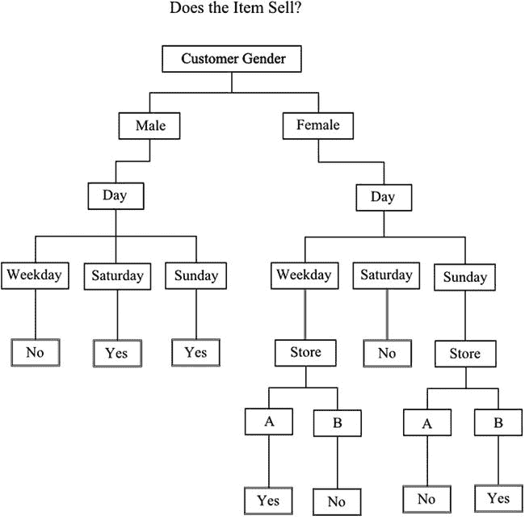
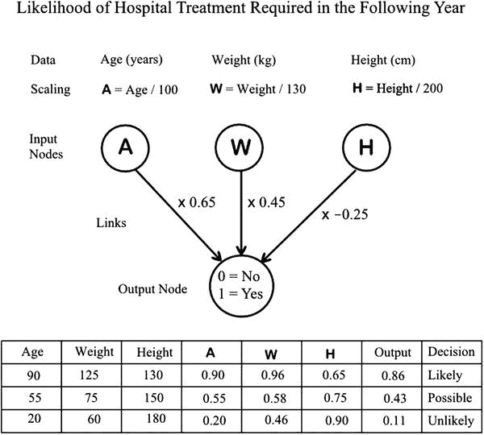

# 23.预测分析

It’s Only Arithmetic!

为可能的关系询问数据的第一步是选择有限数量的数据，称为训练数据，将从该数据开发模型。该模型是一种理想化的关系，涉及许多变量，这是通过对训练数据的初始检查或通过实际观察提出的。许多不同种类的模型正在使用中，它们来自不同的学科。预测分析本质上是一个统计过程，因为获得的结果并不精确，而是用概率来表示。因此，置信限方面的可靠性水平是一个特征。我们在前面几章中讨论过的各种统计方法在建立模型时都是有用的。此外，来自机器学习、人工智能和神经网络研究的技术也在使用中。开发新的和改进的模型是一个活跃的研究领域。以下各节旨在说明所使用的模型种类及其工作方式。

## 简单的规则

规则是一个“如果…那么…”的陈述，它可能包含几个或几个变量。例如，我们可以有一个规则，如果一个抵押贷款的申请人是一个年龄在 30 到 40 岁之间的自雇管道工，那么他将有 90%的把握不会拖欠付款。当变量是描述性的时，规则更合适，尽管数字变量可以通过在定义的限制内分组值来处理，如引用的例子。

1R(一个规则)规则从多个可能性中选择一个变量，其基础是哪个变量给出最少数量的错误。为了说明这种方法，我们将使用以下数据，这些数据显示了某一特定商品是否畅销。我们有 12 位顾客的数据，男性和女性，在一周的不同日子，在两个不同的商店。这是一个非常小的样本，但可以用来说明程序:

<colgroup><col> <col> <col> <col></colgroup> 
| 性别 | 一天 | 商店 | 卖 |
| --- | --- | --- | --- |
| 男性的 | 星期六 | A | 是 |
| 男性的 | 在星期日 | A | 是 |
| 男性的 | 星期六 | B | 是 |
| 男性的 | 工作日 | B | 不 |
| 男性的 | 在星期日 | A | 是 |
| 男性的 | 星期六 | B | 是 |
| 女性的 | 工作日 | A | 是 |
| 女性的 | 星期六 | A | 不 |
| 女性的 | 在星期日 | B | 是 |
| 女性的 | 星期六 | A | 不 |
| 女性的 | 在星期日 | A | 不 |
| 女性的 | 工作日 | B | 不 |

对于每个变量，我们注意到多数结果:

<colgroup><col> <col> <col> <col></colgroup> 
| 性别 | 男性的 | 六分之五 | 是 |
|   | 女性的 | 六分之四 | 不 |
|   | 总数 | 12 个中的 9 个 |   |
| 一天 | 工作日 | 三分之二 | 不 |
|   | 星期六 | 五分之三 | 是 |
|   | 在星期日 | 四分之三 | 是 |
|   | 总数 | 12 个中的 8 个 |   |
| 商店 | A | 七分之四 | 是 |
|   | B | 五分之三 | 是 |
|   | 总数 | 12 个中的 7 个 |   |

采用性别作为该规则的变量，因为总成功次数(12 次中有 9 次)是三次中最高的。因此，规则是，如果顾客是男性，商品就会卖出，但如果顾客是女性，商品就不会卖出。

通过使用简单的统计数据，该方法可以扩展到从相同的数据中产生几个规则，以便可以看到所有变量的影响(Frank，2009)。同样的数据在这里有不同的表述:

<colgroup><col> <col> <col> <col></colgroup> 
|   |   | 是 | 不 |
| 性别 | 男性的 | five | one |
|   | 女性的 | Two | four |
| 一天 | 工作日 | one | Two |
|   | 坐 | three | Two |
|   | 太阳 | three | one |
| 商店 | A | four | three |
|   | B | three | Two |
| 总数 |   | seven | five |

我们现在用概率来表示是和否的数字。因此，下面的 5/7 是发生销售时顾客是男性的概率。“总计”列中列出的分数是整个数据中获得销售或未获得销售的概率:

<colgroup><col> <col> <col> <col></colgroup> 
|   |   | 是 | 不 |
| 性别 | 男性的 | 5/7 | 1/5 |
|   | 女性的 | 2/7 | 4/5 |
| 一天 | 工作日 | 1/7 | 2/5 |
|   | 坐 | 3/7 | 2/5 |
|   | 太阳 | 3/7 | 1/5 |
| 商店 | A | 4/7 | 3/5 |
|   | B | 3/7 | 2/5 |
| 总数 |   | 7/12 | 5/12 |

这些概率允许我们通过使用第 3 章中介绍的乘法规则(and 规则)为变量级别的各种组合提供一个规则。例如，如果我们在工作日有一个男性在商店 A，销售的相对概率是

5/7 x 1/7 x 4/7 x 7/12 = 0.034

不出售的相对概率是

1/5 x 2/5 x 3/5 x 5/12 = 0.020。

请注意，在这种形式下，这些并不是真实的概率，因为两者并不等于 1，但它们的比例是正确的，因此我们可以将这些值归一化为

<colgroup><col> <col></colgroup> 
| 销售的可能性 | = 0.034/(0.034+0.020) = 0.63 |
| 不销售的概率 | = 0.020/(0.034+0.020) = 0.37 |

因此，尽管证据不足，总的来说还是会有出售的。

再举一个例子，在商店 B 的一个星期六的女性导致下面的计算:

<colgroup><col> <col></colgroup> 
| 销售的相对概率 | = 2/7 x 3/7 x 3/7 x 7/12 = 0.031 |
| 不销售的相对概率 | = 4/5 x 2/5 x 2/5 x 5/12 = 0.545 |

<colgroup><col> <col></colgroup> 
| 销售的可能性 | = 0.031/(0.031+0.545)   = 0.05 |
| 不销售的概率 | = 0.545/(0.031+0.545)   = 0.95 |

与前一条规则相比，这条规则的可信度更高。

该方法为我们提供了 12 条规则，每条规则对应三个变量水平的 12 种组合。有些规则会比其他规则更可靠。如果碰巧数据包含相互矛盾的条目，并且这很可能发生在一个相当大的样本中，那么所导出的规则中的不确定性将会更大。

这个简单的技术有一个更严重的问题。从第 3 章可以回忆起，对于在“与”规则中相乘的概率，变量必须是独立的。很可能数据库中的许多变量不是独立的。在上面的例子中，工作日的购物者很可能主要是女性。变量之间的相关性会使结果产生偏差。通过将销售给女性顾客的概率乘以销售在工作日的概率，我们可以增加女性顾客的影响。

很明显，一组数据可以产生大量的规则；也正因为如此，存在过度拟合的危险。我们之前讨论了与非线性回归相关的过拟合，我们看到，总是可以获得一个方程，该方程产生一条穿过图上每一点的曲线。这样的方程式没有实际用途。类似地，我们可以以一组规则结束，这些规则完美地描述了训练数据中表示的每种情况。但是该组规则将仅仅是训练数据的替代表示，并且将不会实现任何东西。

规则的有用性取决于两个特征:准确性和覆盖范围。正如我们在上面看到的，准确性可以表示为规则给出正确结果的概率。覆盖率表示规则在数据库中的相对出现次数。在上面呈现的数据中，只有四分之一的数据涉及工作日期间的购买，因此涉及此类购买的规则的覆盖率仅为 25%。具有高准确度和高覆盖率的规则显然是可取的，但是如果每次出现都非常有利可图，低覆盖率规则可能非常有用。

更复杂的方法可用于确定规则。一个共同的特点是，它们以自下而上的程序运作。比如说，数据根据一个变量的水平分成两组。以类似方式基于第二变量的分割给出了四组。

PRISM 是一个商业上可用的系统，它通过反复测试和修改正在构建的规则来建立规则。 [1](#Fn1) 它从一个简单的“如果 A 那么 Z”规则开始，根据正确的预测比例选择 A。通过以类似的方式选择 B 来获得改进，给出“如果 A 和 B，则 z。”该过程继续，引入 C、D、E 等。直到规则完善。由此产生的规则数不胜数，有些还会相互矛盾。必须解决含糊不清的问题，可能的办法是根据覆盖范围进行选择。

## 决策树

决策树是一种众所周知的结构，因其易于理解而广受欢迎。图 [23-1](#Fig1) 显示了根据我们在上一节中使用的数据构建的树。在树的每一个阶段，数据都根据一个标准进行分离，换句话说，就是回答一个问题。目的是在每个阶段提出正确的问题，以便适当地分离数据，从而做出有用的预测。

因此，关键问题是在每个阶段选择最佳的提问方式。分类回归树(CART)是一种常用的方法，它检查所有可能的问题并选择最佳的。最好的是减少数据混乱的那个；由于这个原因，人们使用了熵这个术语，它是无序度的一种度量。实际上构建了一个复杂的树，但是在每个阶段重复验证和避免过度拟合会产生一个有效的结构。

另一种方法是卡方自动相互作用检测器(CHAID)。顾名思义，卡方检验([第 7 章](07.html))用于决定要问哪些问题来形成树中的分裂。建立了列联表，你会记得，数据必须是描述性的。连续的数字数据可以按类别分组以便处理。与 CART 生成的树不同，这些树可以采用多种拆分方式，这导致了更广泛的排列并简化了解释。

决策树生成规则，但是这些规则与我们在上一节中看到的方法所获得的规则有所不同。决策树自上而下地工作，在每一层寻找可能的最佳分割。对于每个记录，将有一个规则来覆盖它，并且只有一个规则。在图 [23-1](#Fig1) 所示的例子中，从上到下走每一条路线都会重复用于构建树的记录。当然，这是一种过度拟合的情况，为了用少量的数据来说明这个原理，这种情况是合理的。

图 23-1。

A simple decision tree

## 联合

数据库中的每条记录都显示了指定值或级别的变量之间的关联。如果我们回头看看我们用来说明规则发展的示例数据中的第一条记录，我们可以看到这是如何应用的。我们有“如果男性和星期六和商店 A，那么是。”因此，我们在记录中有四个变量之间的关联。事实上，我们可以分解这些关联，以规则的形式给出更多的关联:

*   如果是男性，那么周六
*   如果周六，那么男性
*   如果男性和周六，则存储一个
*   如果男性和周六，则存储 A 和 yes
*   等等

总共有 50 条规则可以根据这一单个记录中揭示的关联来陈述。这是一个非常大的数字；但是，当然，许多规则不太可能有实际用途。因为可以生成如此多的规则，所以有必要有一个基本原理来剔除那些不太可能有用的规则，并选择那些有效的规则。

选择是基于准确性和覆盖面。准确性将显示规则给出正确答案的可能性，而覆盖率将表明规则可能应用的频率。

我们可以使用前一个示例中的 12 条记录的完整列表来展示如何应用该过程。数据中包含的级别数如下:

*   可能的双组分组的数量-例如，“男性，星期六”-是 30。
*   可能的三组分组的数量——例如，“男性，星期六，A”——是 44。
*   可能的四个组成部分的组的数量是 24，例如，“男性，星期六，A，是”。

<colgroup><col> <col> <col> <col></colgroup> 
| 性别 | 一天 | 商店 | 卖 |
| 2 个级别 | 3 个级别 | 2 个级别 | 2 个级别 |

请注意，这些数字并不是显而易见的:它们来自变量水平的可能组合的总和。

我们可以通过考虑覆盖范围来减少兴趣组的数量。Male 和 Saturday 出现在 12 个记录中的 3 个，所以覆盖率是 3/12，或 25%。类似地，通过将记录与完整的组合集进行比较，可以获得以下值:

<colgroup><col> <col> <col> <col></colgroup> 
| 新闻报道 | 2 个组件 | 3 个组件 | 4 个组件 |
| --- | --- | --- | --- |
| Zero | Zero | Twelve | Fifteen |
| one | six | Nineteen | six |
| Two | Twelve | Ten | three |
| three | nine | three | Zero |
| four | Two | Zero | Zero |
| five | one | Zero | Zero |
| 总数 | Thirty | forty-four | Twenty-four |

在这个阶段，我们可能会决定只考虑那些覆盖率为 4 或 5 的组，并在准确性的基础上对它们做出进一步的判断。所选的三组都是双组分的，所以每组给我们两个可能的规则。这些措施如下:

<colgroup><col> <col> <col></colgroup> 
| 覆盖率 5。 | 男性，是的 |
| 规则:“如果是男性，那么是” | 准确度 5/6 = 83% |
| 规则:“如果是，那么男性” | 准确度 5/7 = 71% |
| 覆盖率 4。 | 女性，A 店 |
| 规则:“如果是女性，则存储 A” | 准确度 4/6 = 67% |
| 规则:“如果储存一个则女” | 准确度 4/7 = 57% |
| 覆盖率 4。 | 商店 A，是的 |
| 规则:“如果存储 A，则是” | 准确度 4/7 = 57% |
| 规则:“如果是，则存储一个” | 准确度 4/7 = 57% |

请注意，如果我们一直在考虑具有更多组件的组，那么每个组将会有许多可能的规则，因为组的成员可以在 if-then 语句的任何一侧组合。我们提到，四个组成部分中的一个就可以产生 50 个可能的规则。

值得指出的是，在最大覆盖范围内具有最高准确性的规则——即，如果客户是男性，则商品销售——是我们在讨论简单规则时使用 1R 规则发现的规则。

即使在数据很少的情况下，手工处理群体的覆盖范围和规则的准确性也是非常费力的——但对于计算机程序来说，这当然是一项简单的任务。

## 使聚集

聚类是以这样一种方式对数据进行分组，即每组中变量的水平比其他组中相应变量的水平更相似。例如，可以根据所供应货物的类型、地点或所供应货物的价值对供应商进行分组。病人可以根据他们不同的症状进行分组。如果任何一个变量用于分组，其他变量不太可能显示相同的分组。目的是确定哪个变量或变量组合给出了最佳的总体分组。

因此，分组的方式并不是一开始就决定的。分组技术固定分组，这种情况称为无监督学习。这个过程没有预先设定的模式，当分组完成时，确定最佳结果的逻辑可能并不明显。然而，必须决定需要多少组。很明显，如果没有数量上的限制，最佳的安排将是大量的组，每个组有一个成员。这是一种过度拟合的情况，不会起到任何有用的作用。

分组是根据一个记录与另一个记录的接近程度进行的。接近度被认为是记录之间的距离。如果我们最初考虑两个变量，x 和 y，一个二维图将允许绘制每个记录，并且这些点可能在某些区域显示聚类——比如小 x 和大 y。每对点之间的距离将是连接两点的直线的长度，这将是关联的度量。对于三个变量，我们可以画一个三维图，所需的度量也是连接点的长度。虽然我们不能画出三维以外的东西，但在数学上没有任何问题，因为我们有无限的维度来容纳所有的变量，并计算各点之间的距离。当组内距离最小而组间距离最大时，分组是最佳的。当然，变量有不同的单位(美元、周、米等。)，并且必须定义一个等价关系以允许计算距离。等值可以基于每个变量的范围。

迭代程序中的许多变化都朝着最佳分组的方向努力。最初可以随机选择的组中心根据所得的计算距离进行修改。一些系统从最初定义的组数开始工作，并允许随后改变数量。其他系统产生组的层次结构，或者从粗略的分组开始并将其分解，或者从单独的记录开始并逐渐减少组的数量。尽管我们在讨论中提到了最佳分组，但是应该注意，没有系统能够保证完美的唯一解决方案。

与聚类密切相关的是最近邻技术。多维空间中的邻近概念再次被使用；但是，我们的目标不是试图通过分组来使数据合理化，而是在记录之间建立相似性以提供预测。因此，与聚类不同，这是一种监督学习的形式。

## 神经网络

神经网络如此命名是因为它与大脑中的神经元网络相似。这种类比可以扩展到神经网络能够以大脑学习的方式进行学习，尽管这种类比不应该太过分。假设神经网络是一个可以简单地输入数据的黑匣子是不正确的，它将学习处理这些数据，然后输出答案。然而，神经网络是从人工智能学科中产生的，其目的是模仿大脑的工作。

相似性在神经网络的示意性布局中是显而易见的。它由通过链路连接的节点组成，以便数据从输入节点移动到输出节点。图 [23-2](#Fig2) 示意性地显示了一个简单的布置来说明原理。

图 23-2。

A simple neural network illustrating the principle

在输入节点和输出节点之间可能有一层节点，这些节点被称为隐藏节点。每个变量都有一个输入节点，输入数据通常被缩放为 0 到 1 之间的值。到下一个节点的链接将在传递该值之前对其执行乘法运算。乘法实际上是一个加权因子。下一个节点将从其他输入节点接受几个值。然后，添加的值将被传递到输出节点。要使用的节点的数量必须在一开始就决定，并且链路的数量可能数以万计。输出数据是数字，必须转换回所需的变量值或级别。

来自训练数据的记录一次输入一个，输出与所需值进行比较。该误差导致链路权重的修改，大误差产生大变化，小误差产生小变化。随着过程的继续，链路权重被修改，并且系统接近可接受的输出，但不过度拟合。因为过度配合会带来问题，特别是当很难看到加工是如何进行的时候。事实上，除了算法设法得到正确的答案之外，没有任何逻辑方法可以描述这个过程。由于理解输出的处理和所需转换的复杂性，已经有了包装神经网络程序以适合特定应用的举措。

图 [23-2](#Fig2) 的简单排列只有三个输入节点，接受我们希望评估的受试者的年龄、体重和身高，以确定下一年是否需要住院治疗。每个输入变量(在合理的范围内)都被缩放到 0 到 1 之间的值。输出为 0 表示否，输出为 1 表示是。显示了一组可能的链路加权值。可以看出，三组示例输入数据的输出位于 0 和 1 之间，并且可以解释为需要医院治疗的概率。

## 全体

由于有许多不同的方法和模型可供选择，很难一开始就知道哪一个可能是给定数据集的最佳选择。然而，已经发现组合两个或更多不同的模型可以给出比任何单个模型更好的预测。实际上，投票程序正在进行。

这些组合的模型被称为系综。关于合奏的一个显著发现是，他们似乎没有遭受过度学习(Siegel，2013: 148-149)。当分析变得复杂到如此全面地描述数据以至于结果对数据的细节特征敏感时，过度学习或过度拟合(如我之前所描述的)就会出现。西格尔将合奏的这一有利特性比作群体行为。一群人猜测并平均结果，通常会比大多数人更接近正确答案。沃森，这台 IBM 电脑在美国电视智力竞赛节目《危险边缘》中击败了两名专家选手！在 2011 年，被编程为由数百个模型组成的整体。

MANHOLE CONTROL

纽约市有超过 94，000 英里的地下电缆。检修孔为电缆提供了入口，周期性故障会导致检修孔起火、爆炸和检修孔冒烟。有大量的数据与 19 世纪 80 年代以前的事件和检查有关。这些记录已经被服务于纽约市的电力公司联合爱迪生公司收集和保存。

为了从根本上更新公司的检查和维修计划，决定使用过去的记录来确定最有可能发生严重事故的检修孔和风险最小的检修孔。这将提高系统的可靠性和公共安全。

由哥伦比亚大学的科学家和联合爱迪生公司的工程师组成的团队承担了处理可用数据的任务。原始数据多种多样，包括过去事件的记录、工程师处理事件的记录、检查记录、检查井位置和电缆数据。由于收集信息的时间太长，记录方式不一致，甚至在确定地点和部件方面也不一致。

对原始数据进行处理，以提供每个检查井十年期间的准确事件历史和潜在的 120 年电缆历史。结合检查结果，通过机器学习算法处理数据，以产生旨在预测单个检修孔故障的预测模型。

使用训练数据对模型进行了测试。数据来自三个区:曼哈顿、布鲁克林和布朗克斯。对 2009 年的预测来自早期的数据，并与实际的检查井爆炸和火灾进行了比较。预测发生严重事件的前 10%的检修孔包含 44%的发生严重事件的检修孔，前 20%的检修孔包含 55%的发生严重事件的检修孔。

这项工作被认为具有重要价值，为电网检查和维修提供了更好的程序，可以改善公共安全和能源可靠性。该项目展示了使用所有可用数据的价值，无论这些数据有多混杂和混乱——大数据，而不仅仅是选择。该项目还展示了收集数据用于未来预测的价值，而不仅仅是作为历史记录。

Footnotes [1](#Fn1_source)

PRISM 是“统计建模编程”( [`http://sato-www.cs.titech.ac.jp/prism/`](http://sato-www.cs.titech.ac.jp/prism/) )的缩写——与美国国家安全局的互联网服务器监控计划无关。