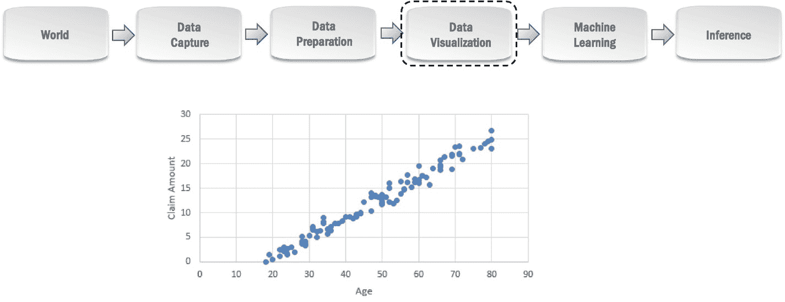
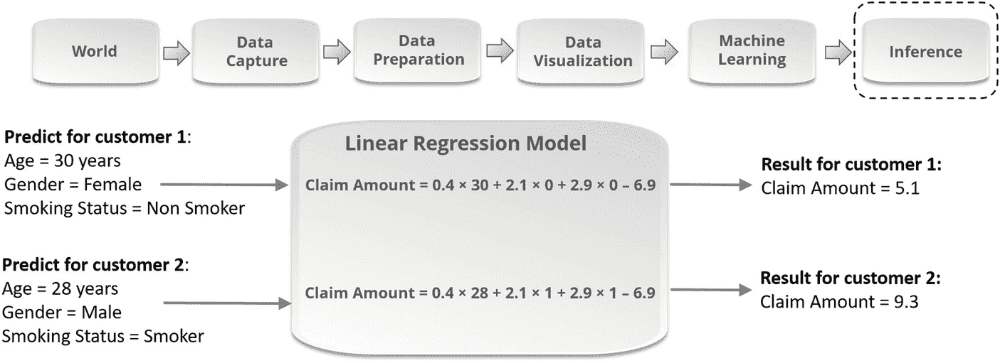

# 5.回归

一个*回归*问题需要你根据一些观察到的属性的值来推断/预测对应于一个新观察到的量。我们在第 [1](01.html) 章中简单讨论过的问题，目的是根据一个人的经验来预测他的工资，根据温度、压力等来预测降雨量。，都是*回归*问题的例子。

假设您是一家提供健康保险的保险公司，想要优化保险费以实现利润最大化。虽然你可能想提供一个负担得起的保费，以吸引客户，你会收取更高的保费，为客户谁可能索赔高数额，以减少您的损失。您可以建立模型来预测客户可能索赔的金额，并将其作为决定该客户最终保费的因素之一。这是一个回归问题，因为我们想要预测数量*索赔金额*。让我们来看看您可以在数据科学过程的不同步骤中针对此问题使用的可能技术。

## 数据捕捉

您将从查看过去用户的存储策略记录及其索赔详细信息开始。让我们看看影响客户索赔金额的因素。老年人更有可能需要医疗护理，因此可能会要求更高的金额。身体质量指数较高的人可以要求更高的金额，因为他们患心脏病的风险更高。同样，吸烟者可能会要求更高的金额，因为它对健康有不良影响。还有许多其他因素，如性别、职业等。一个人索赔的金额取决于此。你可以找出所有相关的细节(*年龄，吸烟状况*等)。)作为我们模型的*特征*，以及*索赔金额*，这是我们从策略记录中的*目标*到另一个位置，以便在数据科学流程的后续步骤中轻松访问。为简单起见，我们将只关注*年龄、吸烟状况、*和*性别*作为特征。注意，这里的目标变量就像所有的*回归*问题一样，是连续值。我们假设每个客户只有一份年度保单，并且*索赔金额*是该客户在相应年度索赔的总金额。从策略记录中提取的数据的快照如图 [5-1](#Fig1) 所示。这里的每一行对应一个用户及其策略。 [1](#Fn1)

图 5-1

从保单记录中提取的数据

## 数据准备

由于这是一个回归问题，你将需要在后面的机器学习步骤中选择一个*回归*机器学习算法。通常情况下，假设您决定在最初的实验中使用*线性回归*算法。线性回归试图创建一个线性方程，解释如何根据要素值计算目标变量的值。第 [1](01.html) 章的例子中，机器学习步骤得出的等式“薪水(K) = 8 ×经验(年)+ 40”是线性回归的一个例子。很明显，这样的等式只对*数字*特征有效，也就是说，特征的值是数字。在我们捕获的数据中，*年龄*是一个数字特征，但是我们也有类似*性别*的特征，它们是*分类的*，也就是说，它们包含类别或类(例如，男性/女性)。

因此，作为准备数据的一部分，我们需要将我们的分类特征(*性别*、*吸烟状态*)转换成数字特征。这些特性中的每一个都只有两个可能的值，因此您可以轻松地将一个值编码为 *0* ，将另一个值编码为 *1* 。因此，对于性别，您可以将*男性*编码为 *1* ，将*女性*编码为 *0* 。对于吸烟状态，您可以将*吸烟者*编码为 *1* ，将*不吸烟者*编码为 *0* 。图 [5-2](#Fig2) 显示了编码后准备好的数据的部分快照。

图 5-2

具有编码分类特征的准备数据

## 数据可视化

现在让我们探索我们的目标变量及其与特征的关系。由于这是一个回归问题，目标变量包含连续值，因此，我们设计了在这种情况下有用的可视化。让我们把注意力集中在可视化目标*索赔金额*与*年龄*的关系上。您可以生成一个散点图，将每个客户/保单显示为一个标记，其 x 坐标基于客户的*年龄*，y 坐标基于他们的*索赔金额*。你可以通过限制一次只调查一部分顾客来简化调查——让我们看看女性和不吸烟的顾客。如果你看图 [5-3](#Fig3) ，你会注意到索赔金额与年龄成线性关系。假设您注意到其他人群(男性吸烟者、男性不吸烟者等)的索赔金额与年龄呈线性关系。)也是。这使得这个场景适合尝试线性回归算法，该算法可以计算出这种线性关系。所以现在你有一个令人信服的理由在机器学习步骤中使用线性回归。

图 5-3

可视化索赔金额和年龄之间的关系

## 机器学习

由于我们的*目标*变量包含连续值，我们将在这一步使用*回归*机器学习算法之一。*回归*机器学习算法从过去的观察值中学习，预测对应于新观察值的量。我们已经讨论了在这种情况下使用线性回归算法构建预测模型的各种原因。

*线性回归*算法基于准备好的数据构建一个*线性回归*模型，如前所述，该模型是一个线性方程，解释了如何从特征值计算目标变量值。图 [5-4](#Fig4) 显示了线性回归算法为该问题建立的线性方程。根据这个等式，我们可以知道索赔额随着年龄的增加而增加 0.4K。我们还可以看出，男性(性别= 1)的索赔金额比女性高 2.1K。吸烟者(吸烟状态=1)倾向于比不吸烟者多索赔 2.9K。这个模型现在能够根据新客户的年龄、性别和吸烟状况来预测他们的索赔金额。

图 5-4

由机器学习步骤创建的线性回归模型

## 推理

我们刚刚创建的线性回归模型可以部署并用于预测新客户的索赔金额。该模型将简单地使用该等式，使用年龄、性别和吸烟状况来计算索赔金额。图 [5-5](#Fig5) 显示了部署的线性回归模型如何使用两个新客户的等式计算索赔金额。该模型预测，第二个吸烟的男性顾客可能会比第一个顾客要求更高的金额，尽管他是年轻的顾客。所以你会建议向第二个顾客收取更高的保险费。

图 5-5

推断时用线性方程预测索赔额

## 结论

在这一章中，我们介绍了回归问题，并作为例子详细讨论了一个具体问题。我们讨论了这个问题的数据科学过程，给出了可以用于这类问题的技术的概述。如前所述，每个新问题都需要您决定最适合解决它的技术。

<aside aria-label="Footnotes" class="FootnoteSection" epub:type="footnotes">Footnotes [1](#Fn1_source)

以美元计算的索赔金额。

 </aside>