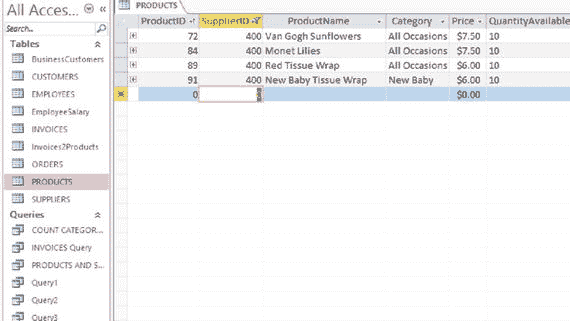
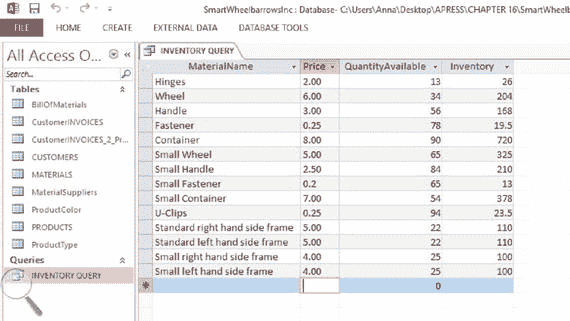
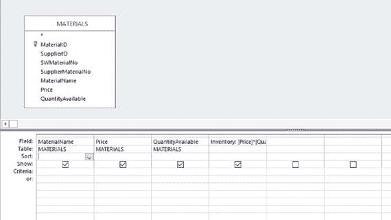
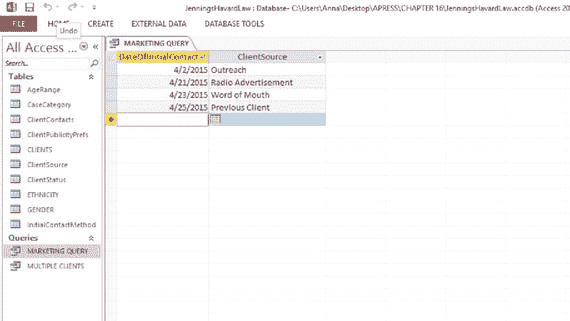
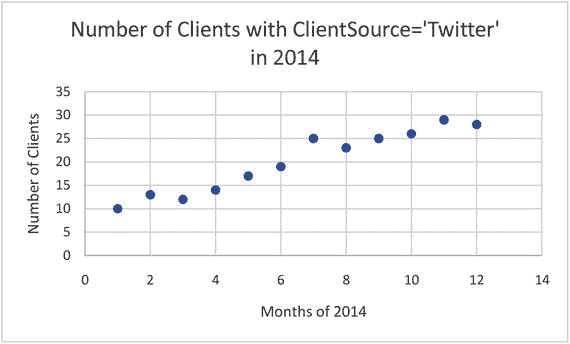
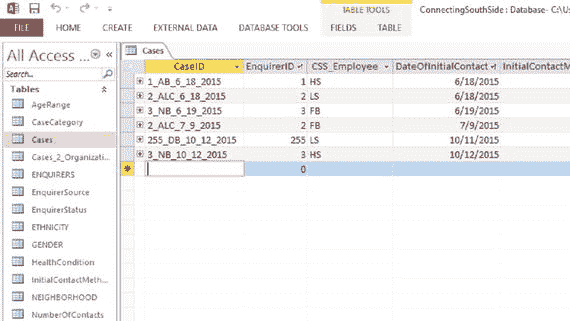
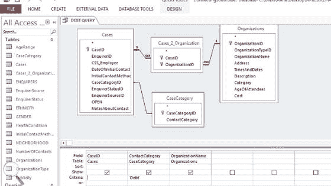
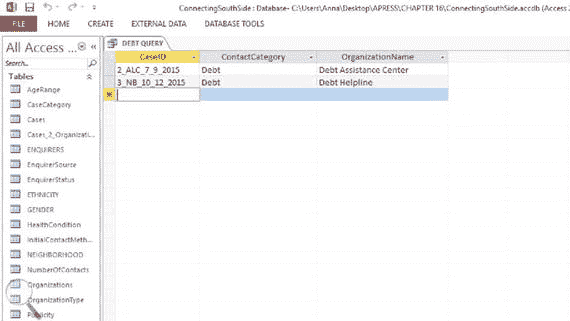
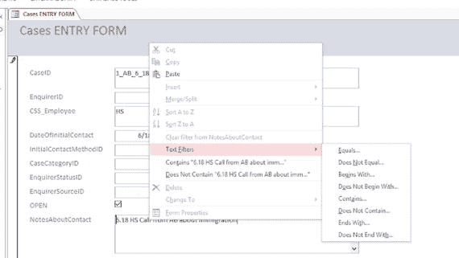

# 16.根据外部要求采取行动

到目前为止，数据库都是根据业务目标设计的。但是，如果一个请求来自一个外部来源，并以他人的目标为焦点，会发生什么呢？如何从数据库中提取适当的数据？

最后一章着眼于根据报告的结果和业务策略的变化对数据库进行永久性的修改。本章考虑在不进行永久更改的情况下回答查询。回应外部请求需要尽可能创造性地使用你熟悉的工具，包括:

*   搜索
*   过滤
*   询问

您还需要能够识别何时无法用现有数据回答查询。例如，假设一个法律监管机构要求 Jennings-Havard 律师事务所提供他们有多少英国白人客户和欧洲白人客户的详细信息。他们的数据库包含关于客户种族的数据，如图 [16-1](#Fig1) 所示。

图 16-1。

Ethnicity table from the Jennings-Havard Law Offices database

可以看出，白色类别没有细分为子类别，因此无法从图 [16-1](#Fig1) 的表格中推断出所需的数据。可以进行猜测，特别是关于男性客户和未婚女性客户(他们有自己的姓)，但不准确性会很高。这样的要求是不可能回答的。

另一方面，您可能预期会定期发出外部请求，因此您的数据库应该相应地进行调整。在这种情况下，你需要重温第 15 章中概述的技术。

以下部分提供了向 Cards for Everyone Inc .和第 2 章–[第 4 章](04.html)案例研究中的每个小企业提出的外部请求的示例，并展示了如何回应这些请求。

## 人人贺卡公司。

顾客可以联系 Cards for Everyone Inc .询问各种问题。例如，购买了莫奈百合卡的客户可能想了解同一产品系列中的其他产品。从业务数据库中提取这些数据的一种方法是:

*   找出莫奈百合的供应商。
*   筛选同一供应商的所有产品。

产品表再次如图 [16-2](#Fig2) 所示。从表中可以看出，莫奈百合花卡的供应商是 SupplierID=400。

The Products table of the Cards for Everyone Inc. database . Notice from the table that the supplier of the Monet Lilies card is SupplierID=400.Note

可能需要搜索或过滤来从大型表中找到这些信息。例如，可以对包含 Monet 或百合的行的 ProductName 列应用筛选器。

要查找其他产品(包括莫奈百合)，过滤 SupplierID=400。该过滤器返回如图 [16-3](#Fig3) 所示的四种产品。

图 16-3。

Filtering the Products table of the Cards for Everyone Inc. database on SupplierID=400

然后，您可以告诉客户 SupplierID=400 销售的其他三种产品。

Note

为了回答这个请求，不需要知道供应商的实际名称。

来自客户的许多信息请求遵循类似的模式，并且可以使用查询来回答。另外三个例子是:

例 1:一位客户对你所有的空白卡片感兴趣。要生成列表，请转到“产品”表，然后按照下列步骤操作:

*   释放任何现有的过滤器。
*   ProductType = 'Card '上的筛选器。
*   按类别筛选=“所有场合”。

例 2:一位客户对你所有低于 4 美元的产品感兴趣。要生成列表，请转到“产品”表，然后按照下列步骤操作:

*   释放任何现有的过滤器。
*   根据“低于”4 筛选价格列。

示例 3:一位客户对您销售的包装纸系列感兴趣。要生成列表，请转到“产品”表，然后按照下列步骤操作:

*   释放任何现有的过滤器。
*   筛选等于“包装纸”的 ProductType 列。

一般来说，如果客户联系 Cards for Everyone Inc .并反复提出相同的请求，将数据库链接到客户可以自己运行查询的网站是有意义的。这种功能经常在网上购物网站上使用。在 Cards for Everyone Inc .的案例中，最初的网站是由一个承包商建立的。该承包商还可以将数据库链接到网站，并纳入查询。

## 智能手推车公司。

智能手推车公司正在寻找新的投资。一个潜在的投资者要求各种效率比率来衡量企业如何有效地使用其资产和管理其程序。

例如，存货周转率显示了一个企业在给定时间内将存货(在这里是材料库存)转化为销售额的效率。其计算方法如下:

存货周转率=销货成本/存货

在哪里

*   商品销售成本是指在给定时间内销售商品的成本
*   库存指的是在一段时间结束时的库存水平，或者是整个时间段内的平均水平

出于会计核算的目的，企业通常会记录销货成本。在本例中，我们将考虑如何计算库存:

库存=总和(价格×可用数量)

对于库存的每一项材料。低比率意味着销售不佳和库存过剩。高库存水平代表零回报率的投资。这可以表明企业管理应该更有效率。此外，如果价格开始下跌，企业可能会陷入财务困境。高比率意味着强劲的销售或者无效的购买。

有时，非常高的库存比率会导致销售损失，因为没有足够的库存来满足需求。将库存周转率与行业基准进行比较，以确定一家公司是否成功地管理了其库存，这一点始终非常重要。

对于 Smart 独轮车公司去年的情况，假设销售成本为 4，362 美元。图 [16-4](#Fig4) 显示了计算 Smart 独轮车公司当前库存所需的查询设计，结果如图 [16-5](#Fig5) 所示。引入了一个新的列“库存”,它是价格和可用数量列相乘的结果。

图 16-5。

The output from the query in Figure [16-4](#Fig4)

图 16-4。

Query for finding the inventory on the Smart Wheelbarrows Inc. database

要查找给定时间段的总库存，只需对库存列求和。您可以创建一个查询来执行此计算。

Note

在第 7 章的[中，智能手推车公司的数据库设计中，手推车所用油漆的详细信息存储在一个单独的表中。为了保持示例简单，这里不包括这些细节。](07.html)

当对库存列求和时，本期的总库存为 727 美元。存货周转率为 4362/727 = 6。

## 詹宁斯-哈佛律师事务所

Jennings-Havard 律师事务所希望在广告方面投入更多资金，一位潜在的广告客户问他们社交媒体对他们有多大帮助。为了找到答案，他们设置了一个查询来返回每个联系人的日期及其来源，如图 [16-6](#Fig6) 所示。其输出如图 [16-7](#Fig7) 所示。

图 16-7。

The Result of running the query in Figure [16-6](#Fig6)

图 16-6。

Query to find DateOfInitialContact and ClientSource for Jennings-Havard Law Offices

在这个例子中，没有人通过社交媒体发现 Jennings-Havard 律师事务所。随着更多的客户和社交媒体的使用，他们可以使用数据分析来考虑一段时间内的趋势。第 13 章描述了一些他们可以使用的方法。散点图是一种方法；图 [16-8](#Fig8) 显示了 2014 年期间每月通过 Twitter 了解公司的客户散点图示例。

图 16-8。

The number of clients per month with ClientStatus=‘Twitter’

从图 [16-8](#Fig8) 可以看出，通过 Twitter 了解简宁斯-哈佛律师事务所的客户数量正在上升。

## 连接南侧

连接南区希望能够使用其数据库来回答来自其拨款专员的意外问题。下面是两个例子。

例 1:有债务问题的“连接南区路标”询问者可以使用哪些服务？这个问题可以分两步回答:

*   确定打电话询问债务问题的人。
*   找到他们提到的组织。

图 [16-9](#Fig9) 显示了来自[第 7 章](07.html)的案例表，增加了一行，这样两个客户就有了债务问题。

图 16-9。

Cases Table from Connecting South Side

查询如图 [16-10](#Fig10) 所示。从 CaseCategory = 'Debt '的 cases 表中选择所有案例，并显示每个案例在 organizations 表中对应的组织。

图 16-10。

Query to output all organizations for cases with ContactCategory=‘Debt’

运行图 [16-10](#Fig10) 中查询的输出如图 [16-11](#Fig11) 所示。

图 16-11。

The output from running the query in Figure [16-10](#Fig10)

例 2:有多少病例与糖尿病有关？

这可以通过在 Cases 表中筛选单词“糖尿病”的 NotesAboutContact 列来回答。图 [16-12](#Fig12) 显示了一个简单的表单，用于将数据输入到案例表中。已对 NotesAboutContact 框应用了筛选器。如果“包含”选项与“糖尿病”一起使用，将出现此框中提到糖尿病的所有病例。

图 16-12。

Input form for the cases table of the Connecting South Side database with a query applied to the NotesAboutContact column

## 摘要

本章演示了数据库的灵活性。当您遇到外部数据请求时，您可以将数据库用作回答问题的有用工具。有时将这样的查询永久地合并到数据库中是有意义的。其他时候是不可能回答数据请求的，因为无论你尝试什么样的查询和搜索，都无法推断出想要的数据。