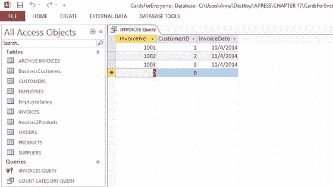
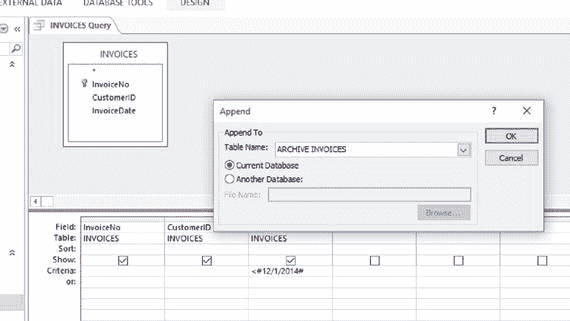
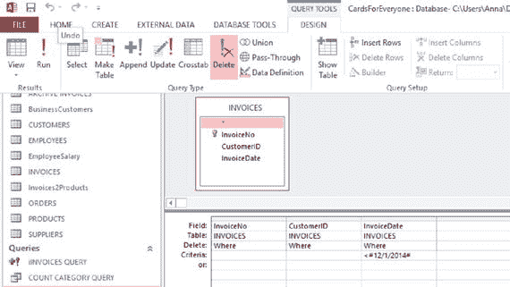
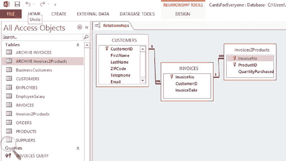
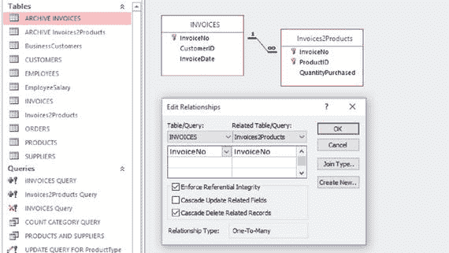
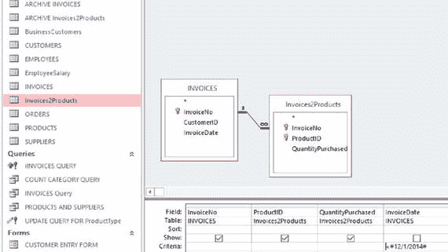
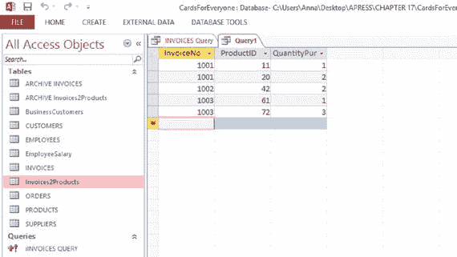

# 17.存档您的数据库

[第 16 章](16.html)讲述了如何满足外部的信息请求，这通常需要存储大量的历史数据，随着企业的扩张，这些数据的数量会越来越大。此外，诸如 2002 年美国萨班斯-奥克斯利法案等法规要求上市公司、会计师、律师和其他人在审计后将业务记录存储五年，将财务数据存储七年。这进一步增加了存储历史数据的负担。

无论增加多少硬件或对应用程序进行多少微调，在计算机系统上存储越来越多的数据都会导致性能下降。因此，企业需要一种有效的方法来管理这种增长。

数据归档是指将非活动数据与正在使用的数据分开，并将非活动数据存储一段时间的过程。数据库归档侧重于归档存储在数据库中的数据。数据库存档的主要目标是保持对非活动数据的访问，以防以后需要满足特定的业务政策或政府法规，同时优化活动数据库的性能。如果不再需要存档的数据，可以将其销毁。正如在第 8 章中所讨论的，数据保护法通常规定数据的保存时间不应超过需要的时间。

数据归档将在您的数据库操作已经成为常规操作并且您的数据已经被清理之后进行。该程序可能会定期执行。当您开始使用数据库时，您的归档过程可能非常简单—也许您正在当前数据库中的活动表和非活动表之间移动数据，或者从当前数据库向专门为归档目的而设置的数据库移动数据。然而，随着你的业务增长，你可能需要寻找更复杂的方法。

## 数据库存档和数据库备份的区别

数据库备份旨在提供在出现重大问题时完全恢复当前数据库的全部或主要部分的能力。相比之下，数据库归档侧重于提供对少量数据(如表中的单行数据)的访问，以响应特定的数据请求。

备份是不断变化的活动数据库的辅助拷贝，因此往往是短期的，并定期被覆盖。这可能使它们不适合提供数据来响应业务政策和政府法规。此外，从备份中检索特定数据既耗时又昂贵，尤其是在存储介质(如磁带)不在现场的情况下。与典型的备份不同，归档必须能够经受时间的考验，鉴于技术不断变化的本质，这可能是一项挑战。

## 确定哪些数据应该归档

并非所有数据都同样重要。例如，如上所述，一些企业需要将其财务记录存档至少七年，以符合政府法规，但其他数据，如不再使用的供应商联系人，就不那么重要了。根据这些要求，企业可以创建数据保留策略，指定保留和归档各种类型数据的标准。这些归档策略必须考虑相关业务的数据访问模式。

来自第 2 章–4[中案例研究的以下示例说明了归档策略是如何演变的。](02.html)

### 智能手推车公司。

假设智能手推车公司对其客户的购买习惯和自己的材料购买模式进行了大量的数据分析。该分析用于制定如下数据保留策略:

*   人们发现，一年多没有买东西的顾客很少再从这家商店买东西。有鉴于此，制定了一项政策决定，将最后一张发票已过期一年以上的客户的所有联系信息和发票存档，并保存五年。
*   在为组件找到新的供应商后，企业很少重用该供应商。但是，如果任何组件有问题，可能需要联系以前的供应商。这意味着他们的联系方式和他们所提供产品的数据必须存档并无限期保存。

### 詹宁斯-哈佛法律事务所有限公司。

Jennings-Havard 律师事务所案件的数据保留政策侧重于是否已立遗嘱，如下所示:

*   没有遗嘱的案件在结案后六个月归档，保存五年。
*   有关遗嘱的案件在结案后六个月归档，并保存至遗嘱主体死亡，如果死亡发生在五年内，则保存五年。

### 连接南侧

数据保留政策基于查询者和连接南方的工作人员的行为模式

*   分析显示，一年后没有返回连接南区的询问者不太可能再次这样做。有鉴于此，所有已结案一年或更长时间的案件将被归档，直至赠款到期。
*   分析还表明，一年或更长时间没有被连接南侧使用的组织不太可能被再次使用。因此，符合这些标准的所有组织的详细信息将被存档，直到授权到期。当授权到期时，如果新的授权取代了它，则归档的组织被审计:具有不同焦点的授权可能意味着一些归档的组织变得相关。

## 实际问题

首先，您可能会以小规模的方式存档您的数据，例如，在闪存或硬盘驱动器上。但是，随着久而久之和您需要归档的数据量的增长，您将需要更多地考虑您所使用的存储介质。归档文件可能会存储很长时间，因此请选择一种介质类型，只要您的保留策略允许，它就可以保存很长时间。

同样，您的归档策略以及用于归档数据的存储机制无疑会随着时间的推移而改变。因此，明智的做法是每年至少查看一次您的档案，看看是否有任何内容需要迁移到不同的存储介质。

对于拥有大量数据的企业来说，磁带通常被认为是归档数据的好方法，因为它寿命长、成本低，尤其是与硬盘驱动器相比。对于其他企业，云归档是一个可行的解决方案。云在[第十八章](18.html)中有所涉及。

## 使用 MS Access 为 Everyone 公司的卡片存档表的例子。

以下示例提供了存档数据的基本工具，这些工具在数据库的早期阶段特别有用。您可以创建表来存档现有数据库或单独数据库中的数据。该示例使用使用 MS Access 2013 的当前数据库中的表。

假设经理 Pat 想要将所有 2014 年 12 月之前的 Everyone Inc .的信用卡发票存档到一个名为 Archived Invoices 的特殊存档表中。以下过程会将所需数据从发票移至已存档的发票:

Back up your database.   Design a query that will select the required rows and columns from the Invoices table, as shown in Figure [17-1](#Fig1). Here you are backing up all the columns of the Invoices table and all the rows with InvoiceDate earlier than December 2014\. Notice the criteria of the InvoiceDate column, which indicates that only invoices before December 2014 are selected.

图 17-1。

Query to select all rows from the Invoices table of the Cards for Everyone Inc. database with an InvoiceDate earlier than December 2014   Note

图 [17-1](#Fig1) 中的查询有很大的灵活性。例如，您可以选择日期在 2014 年 11 月的所有行、2014 年的所有行等等。

如果您愿意，可以对 InvoiceDate 列使用过滤器。

简单的查询在本书的附录中有详细介绍。

Run the query (using !) and check that it returns the rows that you are expecting. Figure [17-2](#Fig2) shows the output after running the query in Figure [17-1](#Fig1).

图 17-2。

Output from running the query in Figure [17-1](#Fig1)   If the output from the query is correct, you need to choose a destination table in which to archive the data. Here we are choosing a table called Archived Invoices, which has the same columns and data types as the Invoices table and resides in the same Cards for Everyone Inc. database.   Select the Append (Add) Query from the toolbar of the Design tab above the Query Design View. This will give you the options shown in Figure [17-3](#Fig3). You can see that you are given the choice of selecting destination tables either within your existing database or from another database.

图 17-3。

Append query design for the Invoices table for Cards for Everyone Inc.   Run the Append query just as you would any other query (using !).   Check the results of the Append query by opening the Archived Invoices table. You should find that the results in Figure [17-2](#Fig2) have been appended to the Archived Invoices table.   If all the rows that you are expecting have been appended to the Archived Invoices table, you can delete them from the Invoices table by running a Delete query. Such a query has the effect of selecting the rows from the table specified and removing them permanently. A Delete query is designed in the same way as an ordinary query, only with the Delete query option selected, as shown in Figure [17-4](#Fig4).

图 17-4。

A Delete query to remove invoices with InvoiceDate before December 2014 from the Invoices table  

这个例子没有考虑表之间的任何关系，当您试图避免留下没有任何“父”的行时，这一点尤其重要

例如，图 [17-5](#Fig5) 显示 Invoices 表链接到另外两个表 Customers 和 Products2Invoices 表。

*   如果客户没有相应的发票，这并不构成问题，因为客户将来可能会回来订购更多的产品。合理的做法是将他们的详细信息保存在 Customer 表中，以防发生这种情况。
*   Entries of the Invoices2Products table show which products have been bought for each invoice: an example of a populated Invoices2Products table is shown in Figure [17-6](#Fig6). If an entry of the Invoices2Products table is left with no link to an invoice, it is “orphaned.” It serves no purpose and will never be used again, as it refers to a deleted invoice. If rows from the Invoices table are deleted, the rows with matching InvoiceNo in the Invoices2Products table will have broken links.

    

    图 17-6。

    Populated Invoices2Products table in the Cards for Everyone Inc. database

图 17-5。

The relationships between the Invoices table and adjacent tables in the Cards for Everyone Inc. database

解决“孤立”行问题的最简单方法是在从发票表中删除行时使用级联删除。这不仅会删除发票表中的行，还会删除具有相同发票号的其他表中与之链接的所有行。

要使用这个工具，您需要编辑表之间的关系，以便应用级联删除功能。

Note

编辑关系包含在本书的附录中。

图 [17-7](#Fig7) 显示了在创建或编辑发票和发票 2 产品之间的关系时使用的级联删除功能。

图 17-7。

The Cascade Delete function as part of the relationship between two tables

或者，您可能希望存档 Invoices2Products 表中与 Invoices 表中已存档的行相对应的行。这是通过使用一个连接查询实现的(在第 10 章中介绍)。

如果您选择与已存档的发票行相对应的发票 2 产品行(即，与 2014 年 12 月之前开具的发票相对应的行)，这些行可以添加到已存档的发票 2 产品表中。图 [17-8](#Fig8) 显示了发票和 Invoices2Products 之间的连接查询，该查询从 Invoices 表中选择 InvoiceNo，并从 Invoices2Products 表中选择相应的 ProductID 和 QuantityPurchased。

图 17-8。

Join query between the Invoices and Products2Invoices tables on the Cards for Everyone Inc. database

图 [17-9](#Fig9) 显示了运行图 [17-8](#Fig8) 中查询的结果。然后可以使用前面描述的方法将这些数据添加到 invoices 2 产品的档案中。

图 17-9。

The output from running the query in Figure [17-8](#Fig8)

## 摘要

数据和数据库归档是业务运营的重要组成部分。它建立在满足外部请求的讨论之上，并涉及存储非活动数据，以便在需要时可以有效地访问这些数据。大量未使用的数据可能会降低当前系统的速度，因此将它们分开很重要。