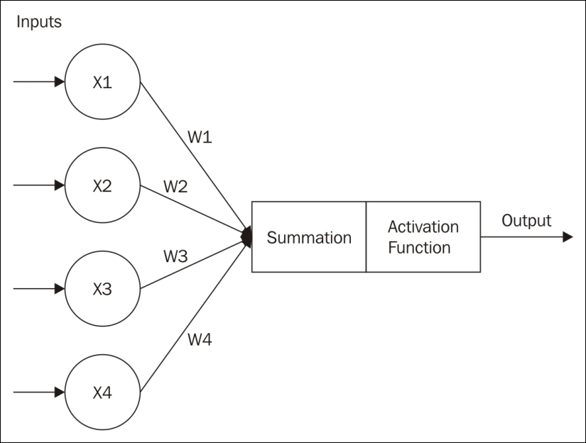
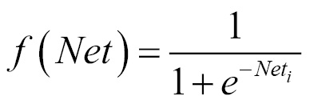
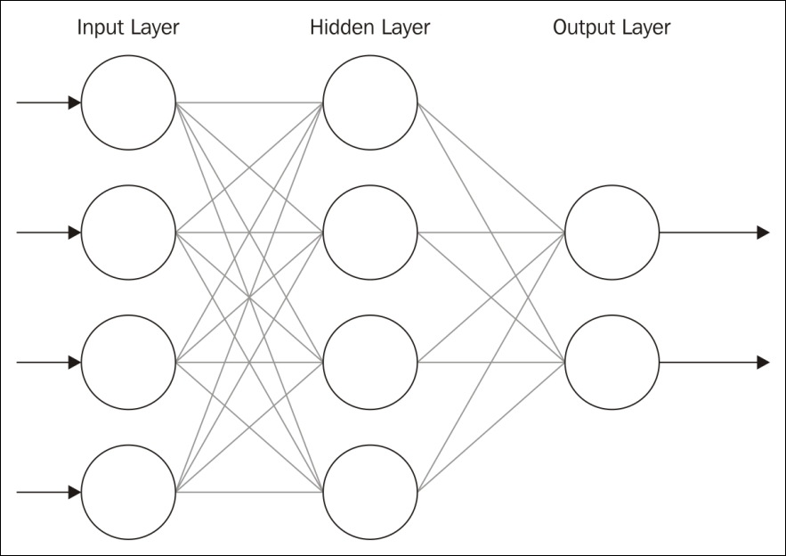
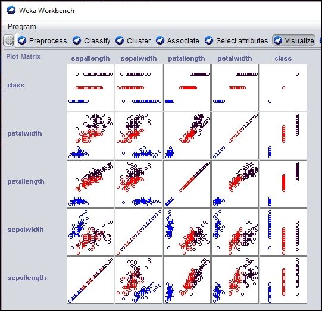

# 第七章。神经网络

虽然神经网络已经存在了很多年，但由于改进的算法和更强大的机器，它们变得越来越受欢迎。一些公司正在构建明确模仿神经网络的硬件系统([https://www.wired.com/2016/05/google-tpu-custom-chips/](https://www.wired.com/2016/05/google-tpu-custom-chips/))。使用这种多功能技术来解决数据科学问题的时候到了。

在这一章中，我们将探索神经网络背后的思想和概念，然后演示它们的使用。具体来说，我们将:

*   定义并举例说明神经网络
*   描述他们是如何被训练的
*   检查各种神经网络架构
*   Discuss and demonstrate several different neural networks, including:

    *   一个简单的 Java 例子
    *   一个**多层感知器** ( **MLP** )网络
    *   **k-最近邻** ( **k-NN** )算法等

我们称之为神经网络的**人工神经网络** ( **安**)的想法源于大脑中发现的神经元。一个**神经元**是一个有**树突**将其连接到输入源和其他神经元的细胞。它通过**树突**从多个来源接收刺激。根据源，分配给源的权重，神经元被激活，并且**发射**信号沿着树突到达另一个神经元。可以训练一组神经元，它们将对一组特定的输入信号做出反应。

人工神经元是具有一个或多个输入和单个输出的节点。每个输入都有一个与之关联的权重。通过加权输入，我们可以放大或缩小输入。

### 注意

人工神经元被交替称为**感知器**。

这在下图中有所描述，其中权重被相加，然后被发送到决定**输出的**激活函数**。**



神经元以及最终神经元集合以两种模式之一运行:

*   **训练模式** -神经元被训练为在接收到某组输入时触发
*   **测试模式** -向神经元提供输入，神经元根据训练对一组已知的输入做出响应

数据集通常分为两部分。更大的部分用于训练模型。第二部分用于验证模型。

神经元的输出由加权输入的总和决定。一个神经元是否放电是由一个**激活函数**决定的。有几种不同类型的激活功能，包括:

*   **阶跃函数** -使用加权输入的总和计算该线性函数，如下所示:


*f(Net)* 表示一个函数的输出。如果*网*输入大于激活阈值，则为 *1* 。当这种情况发生时，神经元就会放电。否则它返回 *0* 并且不触发。该值是基于所有树突输入计算的。

*   **Sigmoid** -这是一个非线性函数，计算如下:



随着神经元被训练，每个输入的权重可以被调整。

与阶跃函数相比，sigmoid 函数是非线性的。这更好地匹配了一些问题域。我们将找到多层神经网络中使用的 sigmoid 函数。

# 训练一个神经网络

有三种基本的培训方法:

*   **监督学习** -通过监督学习，用匹配输入集和输出值的数据训练模型
*   **无监督学习** -在无监督学习中，数据不包含结果，但是模型被期望自己确定关系
*   **强化学习** -类似于监督学习，但是对好的结果提供奖励

这些数据集包含的信息不同。监督和强化学习包含一组输入的正确输出。无监督学习不包含正确的结果。

神经网络通过将输入输入到网络中并使用激活函数将结果与预期结果进行比较来进行学习(至少使用监督学习)。如果它们匹配，那么网络已经被正确训练。如果它们不匹配，则网络被修改。

当我们修改权重时，我们需要小心不要改变太大。如果变化太大，那么结果可能变化太大，我们可能会错过期望的输出。如果变化太少，那么训练模型将花费太长时间。有些时候，我们可能不想改变一些权重。

一个**偏置**单元是一个具有恒定输出的神经元。它总是一个，有时被称为假节点。这个神经元类似于一个偏移量，对于大多数网络的正常运行至关重要。你可以将偏差神经元比作斜率截距形式的线性函数的*y*-截距。正如调整*y*-截距值会改变线的位置，但不会改变形状/斜率一样，偏置神经元可以在不调整网络形状或功能的情况下改变输出值。您可以调整输出以适应问题的特殊需要。

## 神经网络架构入门

神经网络通常使用一系列神经元层来创建。通常有一个**输入层**，一个或多个中间层(**隐藏层**，以及一个**输出层**。

以下是前馈网络的描述:



节点和层的数量会有所不同。前馈网络将信息向前传递。也有信息反向传递的反馈网络。需要多个隐藏层来处理大多数分析所需的更复杂的处理。

在本章中，我们将讨论与不同类型的神经网络相关的几种架构和算法。由于需要解释的复杂性和长度，我们将只提供对几个关键网络类型的深入分析。具体来说，我们将演示一个简单的神经网络、MLPs 和**自组织映射** ( **SOMs** )。

但是，我们将提供许多不同选项的概述。适用于任何特定模型的神经网络和算法实现的类型将取决于所解决的问题。


# 了解静态神经网络

静态神经网络是经过训练或学习阶段，然后在使用时不会改变的人工神经网络。它们不同于动态神经网络，动态神经网络不断学习，并且在初始训练期之后可能经历结构变化。当模型的结果相对容易重现或更容易预测时，静态神经网络非常有用。我们一会儿将看动态神经网络，但是我们将从创建我们自己的基本静态神经网络开始。

## 一个基本的 Java 例子

在我们研究可用于构建神经网络的各种库和工具之前，我们将使用标准 Java 库实现我们自己的基本神经网络。下一个例子是改编自杰夫·希顿([http://www.informit.com/articles/article.aspx?p=30596](http://www.informit.com/articles/article.aspx?p=30596))的作品。我们将构建一个前馈反向传播神经网络，并训练它识别 XOR 运算符模式。以下是 XOR 的基本真值表:

| **X** | **Y** | **结果** |
| `0` | `0` | `0` |
| `0` | `1` | `1` |
| `1` | `0` | `1` |
| `1` | `1` | `0` |

该网络只需要对应于 *X* 和 *Y* 输入和结果的两个输入神经元和一个输出神经元。模型所需的输入和输出神经元的数量取决于手头的问题。隐藏神经元的数量通常是输入和输出神经元数量的总和，但随着训练的进行，确切的数量可能需要改变。

接下来，我们将演示如何创建和训练网络。我们首先给网络提供一个输入，然后观察输出。将输出与预期输出进行比较，然后调整称为`weightChanges`的权重矩阵。这种调整确保了随后的输出将更接近预期的输出。重复这个过程，直到我们对网络能够产生足够接近预期输出的结果感到满意。在本例中，我们将输入和输出表示为双精度数组，其中每个输入或输出神经元都是数组的一个元素。

### 注意

输入和输出有时被称为**模式**。

首先，我们将创建一个`SampleNeuralNetwork`类来实现网络。首先将下面列出的变量添加到该类中。我们将在本节的后面讨论和演示它们的用途。我们的类包含以下实例变量:

```
   double errors; 

   int inputNeurons; 

   int outputNeurons; 

   int hiddenNeurons; 

   int totalNeurons; 

   int weights; 

   double learningRate; 

   double outputResults[]; 

   double resultsMatrix[]; 

   double lastErrors[]; 

   double changes[]; 

   double thresholds[]; 

   double weightChanges[]; 

   double allThresholds[]; 

   double threshChanges[]; 

   double momentum; 

   double errorChanges[]; 
```

接下来，让我们看看我们的构造函数。我们有四个参数，代表我们网络的输入数量、隐藏层中神经元的数量、输出神经元的数量以及我们希望学习发生的速率和动量。`learningRate`是指定训练过程中体重和偏差变化幅度的参数。`momentum`参数指定应该添加先前权重的多少部分来创建新的权重。防止在**局部最小值**或**鞍点**处收敛是有用的。高动量会加快系统的收敛速度，但如果动量太高，会导致系统不稳定。动量和学习率都应该是在`0`和`1`之间的值:

```
public SampleNeuralNetwork(int inputCount, 

         int hiddenCount, 

         int outputCount, 

         double learnRate, 

         double momentum) { 

   ...

} 

```

在我们的构造函数中，我们初始化所有私有的实例变量。注意`totalNeurons`被设置为所有输入、输出和隐藏神经元的总和。这个总和然后被用来设置其他几个变量。还要注意的是，`weights`变量是通过找出输入和隐藏神经元的数量的乘积、隐藏神经元和输出的乘积，并将这两个乘积相加而计算出来的。然后用它来创建新的长度权重数组:

```
     learningRate = learnRate; 

     momentum = momentum; 

     inputNeurons = inputCount; 

     hiddenNeurons = hiddenCount; 

     outputNeurons = outputCount; 

     totalNeurons = inputCount + hiddenCount + outputCount; 

     weights = (inputCount * hiddenCount)  

        + (hiddenCount * outputCount); 

     outputResults    = new double[totalNeurons]; 

     resultsMatrix   = new double[weights]; 

     weightChanges = new double[weights]; 

     thresholds = new double[totalNeurons]; 

     errorChanges = new double[totalNeurons]; 

     lastErrors    = new double[totalNeurons]; 

     allThresholds = new double[totalNeurons]; 

     changes = new double[weights]; 

     threshChanges = new double[totalNeurons]; 

     reset(); 

```

注意，我们在构造函数的末尾调用了`reset`方法。这种方法重置网络，用随机权重矩阵开始训练。它将阈值和结果矩阵初始化为随机值。它还确保用于跟踪变化的所有矩阵被设置回零。使用随机值可确保获得不同的结果:

```
public void reset() { 

   int loc; 

   for (loc = 0; loc < totalNeurons; loc++) { 

         thresholds[loc] = 0.5 - (Math.random()); 

         threshChanges[loc] = 0; 

         allThresholds[loc] = 0; 

   } 

   for (loc = 0; loc < resultsMatrix.length; loc++) { 

         resultsMatrix[loc] = 0.5 - (Math.random()); 

         weightChanges[loc] = 0; 

         changes[loc] = 0; 

   } 

} 

```

我们还需要一个叫做`calcThreshold`的方法。**阈值**值指定了在神经元触发之前，该值与实际激活阈值的接近程度。例如，一个神经元可能具有激活阈值`1`。阈值指定诸如`0.999`之类的数字是否算作`1`。该方法将在后续方法中用于计算单个值的阈值:

```
public double threshold(double sum) { 

   return 1.0 / (1 + Math.exp(-1.0 * sum)); 

} 

```

接下来，我们将添加一个方法，使用一组给定的输入来计算输出。我们的输入参数和方法返回的数据都是由`double`值组成的数组。首先，我们需要在循环中使用两个位置变量，`loc`和`pos`。我们还想根据输入和隐藏神经元的数量来跟踪我们在数组中的位置。隐藏神经元的索引将在输入神经元之后开始，因此它的位置与输入神经元的数量相同。我们输出神经元的位置是我们输入神经元和隐藏神经元的总和。我们还需要初始化我们的`outputResults`数组:

```
public double[] calcOutput(double input[]) { 

   int loc, pos; 

   final int hiddenIndex = inputNeurons; 

   final int outIndex = inputNeurons + hiddenNeurons; 

   for (loc = 0; loc < inputNeurons; loc++) { 

         outputResults[loc] = input[loc]; 

   } 

... 

} 

```

然后，我们根据网络第一层的输入神经元计算输出。注意我们在本节中使用了`threshold`方法。在我们将总和放入`outputResults`数组之前，我们需要利用`threshold`方法:

```
   int rLoc = 0; 

   for (loc = hiddenIndex; loc < outIndex; loc++) { 

         double sum = thresholds[loc]; 

         for (pos = 0; pos < inputNeurons; pos++) { 

               sum += outputResults[pos] * resultsMatrix[rLoc++]; 

         } 

         outputResults[loc] = threshold(sum); 

   } 

```

现在我们考虑我们隐藏的神经元。请注意，这个过程与上一节类似，但是我们计算的是隐藏层的输出，而不是输入层的输出。最后，我们返回我们的结果。这个结果是一个双精度数组，包含每个输出神经元的值。在我们的例子中，只有一个输出神经元:

```

   double result[] = new double[outputNeurons]; 

   for (loc = outIndex; loc < totalNeurons; loc++) { 

         double sum = thresholds[loc]; 

         for (pos = hiddenIndex; pos < outIndex; pos++) { 

               sum += outputResults[pos] * resultsMatrix[rLoc++]; 

         } 

         outputResults[loc] = threshold(sum); 

         result[loc-outIndex] = outputResults[loc]; 

   } 

   return result; 

```

给定我们的 XOR 表，输出很可能与预期的输出不匹配。为了解决这个问题，我们使用误差计算方法来调整网络的权重，以产生更好的输出。我们将讨论的第一种方法是`calcError`方法。每当`calcOutput`方法返回一组输出时，就会调用这个方法。它不返回数据，而是修改包含权重和阈值的数组。该方法采用表示每个输出神经元的理想值的双精度数组。请注意，我们像在`calcOutput`方法中一样开始，并设置了在整个方法中使用的索引。然后，我们清除任何现有的隐藏层错误:

```
public void calcError(double ideal[]) { 

   int loc, pos; 

   final int hiddenIndex = inputNeurons; 

   final int outputIndex = inputNeurons + hiddenNeurons; 

      for (loc = inputNeurons; loc < totalNeurons; loc++) { 

            lastErrors[loc] = 0; 

      } 

```

接下来，我们计算预期产量和实际产量之间的差异。这使我们能够确定如何调整重量，以便进一步训练。为此，我们遍历包含预期输出`ideal`和实际输出`outputResults`的数组。我们还在本节中调整我们的误差和误差变化:

```

      for (loc = outputIndex; loc < totalNeurons; loc++) { 

         lastErrors[loc] = ideal[loc - outputIndex] -  

            outputResults[loc]; 

         errors += lastErrors[loc] * lastErrors[loc]; 

         errorChanges[loc] = lastErrors[loc] * outputResults[loc]

            *(1 - outputResults[loc]); 

     } 

     int locx = inputNeurons * hiddenNeurons; 

     for (loc = outputIndex; loc < totalNeurons; loc++) { 

           for (pos = hiddenIndex; pos < outputIndex; pos++) { 

                 changes[locx] += errorChanges[loc] *

                       outputResults[pos]; 

                 lastErrors[pos] += resultsMatrix[locx] *

                       errorChanges[loc]; 

                 locx++; 

           } 

           allThresholds[loc] += errorChanges[loc]; 

      } 

```

接下来，我们计算并存储每个神经元的误差变化。我们使用`lastErrors`数组来修改`errorChanges`数组，它包含总误差:

```
for (loc = hiddenIndex; loc < outputIndex; loc++) { 

      errorChanges[loc] = lastErrors[loc] *outputResults[loc] 

            * (1 - outputResults[loc]); 

}
```

我们还通过修改`allThresholds`数组来微调我们的系统。监控误差和阈值的变化很重要，这样网络可以提高其产生正确输出的能力:

```

   locx = 0;  

   for (loc = hiddenIndex; loc < outputIndex; loc++) { 

         for (pos = 0; pos < hiddenIndex; pos++) { 

               changes[locx] += errorChanges[loc] *  

                     outputResults[pos]; 

               lastErrors[pos] += resultsMatrix[locx] *  

                     errorChanges[loc]; 

               locx++; 

         } 

         allThresholds[loc] += errorChanges[loc]; 

   } 

} 

```

我们还有另一种计算网络误差的方法。`getError`方法计算我们整个训练数据集的均方根。这使我们能够确定数据的平均错误率:

```
public double getError(int len) { 

   double err = Math.sqrt(errors / (len * outputNeurons)); 

   errors = 0; 

   return err; 

} 

```

既然我们可以初始化我们的网络，计算输出，并计算误差，我们准备好训练我们的网络。我们通过使用`train`方法来实现这一点。该方法首先根据前一方法中计算的误差调整权重，然后调整阈值:

```
public void train() { 

   int loc; 

   for (loc = 0; loc < resultsMatrix.length; loc++) { 

      weightChanges[loc] = (learningRate * changes[loc]) +  

         (momentum * weightChanges[loc]); 

      resultsMatrix[loc] += weightChanges[loc]; 

      changes[loc] = 0; 

   } 

   for (loc = inputNeurons; loc < totalNeurons; loc++) { 

      threshChanges[loc] = learningRate * allThresholds[loc] +  

         (momentum * threshChanges[loc]); 

      thresholds[loc] += threshChanges[loc]; 

      allThresholds[loc] = 0; 

   } 

} 

```

最后，我们可以创建一个新类来测试我们的神经网络。在另一个类的`main`方法中，添加以下代码来表示 XOR 问题:

```
double xorIN[][] ={ 

               {0.0,0.0}, 

               {1.0,0.0}, 

               {0.0,1.0}, 

               {1.0,1.0}}; 

double xorEXPECTED[][] = { {0.0},{1.0},{1.0},{0.0}}; 

```

接下来，我们要创建新的`SampleNeuralNetwork`对象。在下面的例子中，我们有两个输入神经元、三个隐藏神经元、一个输出神经元(XOR 结果)、一个学习速率`0.7`和一个动量`0.9`。隐藏神经元的数量通常最好通过反复试验来确定。在后续执行中，考虑调整此构造函数中的值，并检查结果的差异:

```
SampleNeuralNetwork network = new  

                SampleNeuralNetwork(2,3,1,0.7,0.9); 

```

### 注意

学习率和动量通常应该在零和一之间。

然后，我们反复调用我们的`calcOutput`、`calcError`和`train`方法，按这个顺序。这允许我们测试我们的输出，计算错误率，调整我们的网络权重，然后再试一次。我们的网络应该显示越来越准确的结果:

```

for (int runCnt=0;runCnt<10000;runCnt++) { 

   for (int loc=0;loc<xorIN.length;loc++) { 

         network.calcOutput(xorIN[loc]); 

         network.calcError(xorEXPECTED[loc]); 

         network.train(); 

   } 

   System.out.println("Trial #" + runCnt + ",Error:" +  

               network.getError(xorIN.length)); 

} 

```

执行应用程序，注意错误率随着循环的每次迭代而变化。可接受的错误率将取决于特定的网络及其目的。下面是前面代码的一些输出示例。为简洁起见，我们包括了第一个和最后一个培训输出。请注意，错误率最初高于 50%，但在最后一次运行时降至接近 1%。

```
Trial #0,Error:0.5338334002845255
Trial #1,Error:0.5233475199946769
Trial #2,Error:0.5229843653785426
Trial #3,Error:0.5226263062497853
Trial #4,Error:0.5226916275713371
...
Trial #994,Error:0.014457034704806316
Trial #995,Error:0.01444865096401158
Trial #996,Error:0.01444028142777395
Trial #997,Error:0.014431926056394229
Trial #998,Error:0.01442358481032747
Trial #999,Error:0.014415257650182488

```

在这个例子中，我们使用了一个小规模的问题，我们能够相当快地训练我们的网络。在更大规模的问题中，我们将从一组训练数据开始，然后使用额外的数据集进行进一步分析。因为在这个场景中我们实际上只有四个输入，所以我们不会用任何额外的数据来测试它。

此示例演示了神经网络的一些内部工作方式，包括如何计算误差和输出的详细信息。通过探索一个相对简单的问题，我们能够检查神经网络的机制。然而，在接下来的例子中，我们将使用对我们隐藏这些细节的工具，但是允许我们进行稳健的分析。

# 了解动态神经网络

动态神经网络不同于静态网络，因为它们在训练阶段之后继续学习。它们可以独立于外部修改对其结构进行调整。一种**前馈神经网络(FNN)** 是最早也是最简单的动态神经网络之一。这种网络，顾名思义，只是向前反馈信息，不形成任何循环。这种类型的网络为后来动态人工神经网络的许多工作奠定了基础。在这一节中，我们将深入展示两种类型的动态网络，MLP 网络和 SOMs。

## 多层感知器网络

MLP 网络是具有多层的 FNN。该网络使用具有反向传播的监督学习，其中反馈被发送到早期层以帮助学习过程。一些神经元使用模拟生物神经元的非线性激活函数。一层的每个节点都完全连接到下一层。

我们将使用一个名为`dermatology.arff`的数据集，可以从[http://repository.seasr.org/Datasets/UCI/arff/](http://repository.seasr.org/Datasets/UCI/arff/)下载。该数据集包含 366 个用于诊断红斑-鳞状疾病的实例。它使用 34 个属性将疾病分为五个不同的类别。以下是一个示例实例:

```
2,2,0,3,0,0,0,0,1,0,0,0,0,0,0,3,2,0,0,0,0,0,0,0,0,0,0,3,0,0,0,1,0,55,2
```

最后一个字段表示疾病类别。这个数据集被分成两个文件:`dermatologyTrainingSet.arff`和`dermatologyTestingSet.arff`。训练集使用原始集的前 80% (292 个实例)，并以第 456 行结束。测试集是最后的 20% (74 个实例)，从原始集的第 457 行开始(第 457-530 行)。

### 建立模型

在我们做出任何预测之前，有必要根据一组有代表性的数据来训练模型。我们将使用 Weka 类`MultilayerPerceptron`进行训练，并最终进行预测。首先，我们为文件名的训练和测试声明字符串，并为它们声明相应的`FileReader`实例。创建实例，并将最后一个字段指定为用于分类的字段:

```
String trainingFileName = "dermatologyTrainingSet.arff"; 
String testingFileName = "dermatologyTestingSet.arff"; 

try (FileReader trainingReader = new FileReader(trainingFileName); 
        FileReader testingReader =  
            new FileReader(testingFileName)) { 
    Instances trainingInstances = new Instances(trainingReader); 
    trainingInstances.setClassIndex( 
        trainingInstances.numAttributes() - 1); 
    Instances testingInstances = new Instances(testingReader); 
    testingInstances.setClassIndex( 
        testingInstances.numAttributes() - 1); 
    ... 
} catch (Exception ex) { 
    // Handle exceptions 
} 

```

然后创建了一个`MultilayerPerceptron`类的实例:

```
MultilayerPerceptron mlp = new MultilayerPerceptron(); 

```

我们可以设置几个模型参数，如下所示:

| **参数** | **方法** | **描述** |
| 学习率 | `setLearningRate` | 影响训练速度 |
| 动力 | `setMomentum` | 影响训练速度 |
| 训练时间 | `setTrainingTime` | 用于训练模型的训练时期数 |
| 隐藏层 | `setHiddenLayers` | 要使用的隐藏层和感知器的数量 |

如前所述，学习率会影响模型的训练速度。较大的值可以提高训练速度。如果学习率太小，那么训练时间可能会太长。如果学习率太大，那么模型可能会移过局部最小值并变得发散。也就是说，如果增量太大，我们可能会跳过一个有意义的值。你可以把它想象成一个图，在图中沿着 Y 轴的一个小的下降被忽略了，因为我们增加了太多的 T2 X T3 值。

动量也通过有效地增加学习率来影响训练速度。除了学习率之外，它还用于增加搜索最优值的动力。在局部最小值的情况下，动量有助于在寻求全局最小值的过程中摆脱最小值。

当模型学习时，它迭代地执行操作。术语**历元**用于指代迭代次数。希望每个历元遇到的总误差将减少到进一步的历元不再有用的程度。避免太多的纪元是理想的。

神经网络将有一个或多个隐藏层。每一层都有特定数量的感知器。`setHiddenLayers`方法使用一个字符串指定层和感知器的数量。例如， *3，5* 将指定两个隐藏层，每层分别有三个和五个感知器。

对于本例，我们将使用以下值:

```
mlp.setLearningRate(0.1); 
mlp.setMomentum(0.2); 
mlp.setTrainingTime(2000); 
mlp.setHiddenLayers("3"); 

```

`buildClassifier`方法使用训练数据建立模型:

```
mlp.buildClassifier(trainingInstances); 

```

### 评估模型

下一步是评估模型。`Evaluation`类用于此目的。它的构造器将训练集作为输入，`evaluateModel`方法执行实际的评估。下面的代码使用测试数据集说明了这一点:

```
Evaluation evaluation = new Evaluation(trainingInstances); 
evaluation.evaluateModel(mlp, testingInstances); 

```

显示评估结果的一种简单方法是使用`toSummaryString`方法:

```
System.out.println(evaluation.toSummaryString()); 

```

这将显示以下输出:

```
Correctly Classified Instances 73 98.6486 %
Incorrectly Classified Instances 1 1.3514 %
Kappa statistic 0.9824
Mean absolute error 0.0177
Root mean squared error 0.076 
Relative absolute error 6.6173 %
Root relative squared error 20.7173 %
Coverage of cases (0.95 level) 98.6486 %
Mean rel. region size (0.95 level) 18.018 %
Total Number of Instances 74

```

通常，有必要试验这些参数以获得最佳结果。以下是改变感知器数量的结果:


### 预测其他值

一旦我们训练了一个模型，我们就可以用它来评估其他数据。在之前的测试数据集中，有一个实例失败了。在下面的代码序列中，标识了该实例，并显示了预测结果和实际结果。

测试数据集的每个实例都被用作`classifyInstance`方法的输入。这种方法试图预测正确的结果。将此结果与实例中包含实际值的最后一个字段进行比较。对于不匹配，显示预测值和实际值:

```
for (int i = 0; i < testingInstances.numInstances(); i++) { 
    double result = mlp.classifyInstance( 
        testingInstances.instance(i)); 
    if (result != testingInstances 
            .instance(i) 
            .value(testingInstances.numAttributes() - 1)) { 
        out.println("Classify result: " + result 
                + " Correct: " + testingInstances.instance(i) 
                .value(testingInstances.numAttributes() - 1)); 
        ... 
    } 
} 

```

对于测试集，我们得到以下输出:

```
Classify result: 1.0 Correct: 3.0

```

我们可以使用`MultilayerPerceptron` class' `distributionForInstance`方法得到预测正确的可能性。将下面的代码放到前面的循环中。它将捕获不正确的实例，这比基于数据集使用的 34 个属性实例化一个实例更容易。`distributionForInstance`方法接受这个实例并返回一个双精度的双元素数组。第一个元素是结果为正的概率，第二个元素是结果为负的概率:

```
Instance incorrectInstance = testingInstances.instance(i); 
incorrectInstance.setDataset(trainingInstances); 
double[] distribution = mlp.distributionForInstance(incorrectInstance); 
out.println("Probability of being positive: " + distribution[0]); 
out.println("Probability of being negative: " + distribution[1]); 
```

该实例的输出如下:

```
Probability of being positive: 0.00350515156929017
Probability of being negative: 0.9683660500711128

```

这可以为预测的可靠性提供更定量的感觉。

### 保存和检索模型

我们还可以保存和检索模型以备后用。要保存模型，构建模型，然后使用`SerializationHelper`类的静态方法`write`，如下面的代码片段所示。第一个参数是保存模型的文件的名称:

```
SerializationHelper.write("mlpModel", mlp); 

```

要检索模型，使用相应的`read`方法，如下所示:

```
mlp = (MultilayerPerceptron)SerializationHelper.read("mlpModel"); 

```

接下来，我们将学习如何使用另一种有用的神经网络方法，SOMs。

## 学习矢量量化

**学习矢量量化**(**)是另一种特殊类型的动态 ANN。SOMs 是 LVQ 网络的副产品，我们一会儿会讨论它。这种类型的网络实现了一种竞争类型的算法，其中获胜的神经元获得权重。这些类型的网络用于许多不同的应用中，并且被认为比其他一些人工神经网络更自然和直观。特别地，LVQ 对于基于文本的数据的分类是有效的。**

**基本算法首先设置神经元的数量、每个神经元的权重、神经元的学习速度以及输入向量列表。在这种情况下，向量类似于物理学中的向量，表示提供给输入层神经元的值。当训练网络时，使用向量作为输入，选择获胜神经元，并更新获胜神经元的权重。这个模型是迭代的，将继续运行，直到找到一个解决方案。**

## **自组织地图**

**SOMs 是一种获取多维数据并将其减少到一个或两个维度的技术。这种压缩技术叫做**矢量量化**。该技术通常包含一个可视化组件，使人们能够更好地了解数据是如何分类的。SOM 在没有监督的情况下学习。**

**SOM 有利于发现聚类，这不要与分类混淆。对于分类，我们感兴趣的是在预定义的类别中找到最适合数据实例的。对于聚类，我们感兴趣的是对类别未知的实例进行分组。**

**SOM 使用神经元网格，通常是二维阵列或六边形网格，代表分配了权重的神经元。输入源连接到这些神经元中的每一个。然后，该技术通过几次迭代来调整分配给每个晶格成员的权重，直到找到最佳拟合。完成后，格网成员将会对输入数据集进行分类。可以查看 SOM 结果来识别类别并将新输入映射到所识别的类别之一。**

### **使用 SOM**

**我们将使用 Weka 来演示 SOM。但是，它不随标准 Weka 一起安装。相反，我们需要从 https://sourceforge.net/projects/wekaclassalgos/files/[下载一套 Weka 分类算法，从 http://www.cis.hut.fi/research/som_pak/](https://sourceforge.net/projects/wekaclassalgos/files/)[下载实际的 SOM 类。分类算法包括对 LVQ 的支持。关于分类算法的更多细节可以在 http://wekaclassalgos.sourceforge.net/](http://www.cis.hut.fi/research/som_pak/)[找到。](http://wekaclassalgos.sourceforge.net/)**

**要使用名为`SelfOrganizingMap`的 SOM 类，源代码需要在您的项目中。这个类的 Javadoc 可以在 http://jsalatas.ictpro.gr/weka/doc/SelfOrganizingMap/ T2 找到。**

**我们从创建一个`SelfOrganizingMap`类的实例开始。接下来是读入数据并创建一个`Instances`对象来保存数据的代码。在这个例子中，我们将使用`iris.arff`文件，它可以在 Weka 数据目录中找到。请注意，一旦创建了`Instances`对象，我们不会像之前的 Weka 示例那样指定类索引，因为 SOM 使用无监督学习:**

```
SelfOrganizingMap som = new SelfOrganizingMap(); 
String trainingFileName = "iris.arff"; 
try (FileReader trainingReader =  
        new FileReader(trainingFileName)) { 
    Instances trainingInstances = new Instances(trainingReader); 
    ... 
} catch (IOException ex) { 
    // Handle exceptions 
} catch (Exception ex) {
    // Handle exceptions
}
```

**`buildClusterer`方法将使用训练数据集执行 SOM 算法:**

```
 som.buildClusterer(trainingInstances); 
```

### **显示 SOM 结果**

**我们现在可以显示操作的结果如下:**

```
 out.println(som.toString()); 
```

**`iris`数据集使用五个属性:`sepallength`、`sepalwidth`、`petallength`、`petalwidth`和`class`。前四个属性是数字，第五个属性有三个可能的值:`Iris-setosa`、`Iris-versicolor`和`Iris-virginica`。下面的简短输出的第一部分标识了四个集群以及每个集群中的实例数量。接下来是每个属性的统计数据:**

```
**Self Organized Map**
**==================**
**Number of clusters: 4**
**Cluster**
**Attribute 0 1 2 3**
**(50) (42) (29) (29)**
**==============================================**
**sepallength**
**value 5.0036 6.2365 5.5823 6.9513**
**min 4.3 5.6 4.9 6.2**
**max 5.8 7 6.3 7.9**
**mean 5.006 6.25 5.5828 6.9586**
**std. dev. 0.3525 0.3536 0.3675 0.5046**
**...**
**class**
**value 0 1.5048 1.0787 2**
**min 0 1 1 2**
**max 0 2 2 2**
**mean 0 1.4524 1.069 2**
**std. dev. 0 0.5038 0.2579 0** 
```

**这些统计数据可以提供对数据集的深入了解。如果我们想确定在一个集群中找到了哪个数据集实例，我们可以使用`getClusterInstances`方法返回按集群对实例进行分组的数组。如下所示，此方法用于按集群列出实例:**

```
Instances[] clusters = som.getClusterInstances(); 
int index = 0; 
for (Instances instances : clusters) { 
    out.println("-------Custer " + index); 
    for (Instance instance : instances) { 
        out.println(instance); 
    } 
    out.println(); 
    index++; 
} 
```

**正如我们在这个序列的简短输出中看到的，不同的`iris`类被分组到不同的集群中:**

```
**-------Custer 0**
**5.1,3.5,1.4,0.2,Iris-setosa**
**4.9,3,1.4,0.2,Iris-setosa**
**4.7,3.2,1.3,0.2,Iris-setosa**
**4.6,3.1,1.5,0.2,Iris-setosa**
**...**
**5.3,3.7,1.5,0.2,Iris-setosa**
**5,3.3,1.4,0.2,Iris-setosa**
**-------Custer 1**
**7,3.2,4.7,1.4,Iris-versicolor**
**6.4,3.2,4.5,1.5,Iris-versicolor**
**6.9,3.1,4.9,1.5,Iris-versicolor**
**...**
**6.5,3,5.2,2,Iris-virginica**
**5.9,3,5.1,1.8,Iris-virginica** 
**-------Custer 2**
**5.5,2.3,4,1.3,Iris-versicolor**
**5.7,2.8,4.5,1.3,Iris-versicolor**
**4.9,2.4,3.3,1,Iris-versicolor**
**...**
**4.9,2.5,4.5,1.7,Iris-virginica**
**6,2.2,5,1.5,Iris-virginica** 
**-------Custer 3**
**6.3,3.3,6,2.5,Iris-virginica**
**7.1,3,5.9,2.1,Iris-virginica**
**6.5,3,5.8,2.2,Iris-virginica**
**...** 
```

**可以使用 Weka GUI 界面直观地显示聚类结果。在下面的截图中，我们使用了 **Weka 工作台**来分析和可视化 SOM 分析的结果:**

****

**可以选择、定制和分析图表的单个部分，如下所示:**

****

**然而，在使用`SOM`类之前，必须使用`WekaPackageManager`将`SOM`包添加到 Weka 中。这个过程在[https://WEKA . wikispaces . com/How+do+I+use+the+package+manager % 3F](https://weka.wikispaces.com/How+do+I+use+the+package+manager%3F)讨论。**

**如果需要将一个新实例映射到一个集群，可以使用`distributionForInstance`方法，如*预测其他值*一节所示。**

**<title>Additional network architectures and algorithms</title><link rel="stylesheet" href="../Styles/style0001.css" type="text/css">

# 其他网络架构和算法

我们已经讨论了一些最常见和最实用的神经网络。在这一点上，我们还想考虑一些专门的神经网络及其在各个研究领域的应用。这些类型的网络并不完全适合一个特定的类别，但可能仍然是令人感兴趣的。

## k-最近邻算法

实现 k-NN 算法的人工神经网络类似于 MLP 网络，但是与赢家通吃策略相比，它显著减少了时间。这种类型的网络在设置初始权重后不需要训练算法，并且其神经元之间的连接较少。我们选择不提供这个算法实现的例子，因为它在 Weka 中的使用非常类似于 MLP 的例子。

这种类型的网络最适合分类任务。因为它利用了懒惰学习技术，将所有计算保留到信息被分类之后，所以它被认为是最简单的模型之一。在这个模型中，神经元根据它们与邻居的距离进行加权。邻居的分类是已知的，因此不需要特定的训练。

## 即时训练的网络

**瞬时训练的神经网络** ( **ITNNs** )是前馈神经网络。它们很特别，因为它们为每一组独特的训练数据添加了一个新的隐藏神经元。这种类型的网络的主要优点是能够对其他问题进行归纳。

ITNNs 在短期学习情况下特别有用。特别是，这种类型的网络对于具有大型数据集的 web 搜索和其他模式识别功能非常有用。这些网络适用于时间序列预测和其他深度学习目的。

## 脉冲神经网络

一个**脉冲神经网络** ( **SNN** )是一个更复杂的人工神经网络，因为它不仅考虑了神经元和信息传播，还考虑了每个事件的时间。在这些网络中，不是每个神经元在每次信息传播时都会触发，而是只有当特定神经元的**膜电位**达到特定阈值时才会触发。膜电位是指神经元的激活水平，非常类似于生物神经元的放电方式。

由于紧密模仿生物神经网络，SNNs 特别适合于生物学研究和应用。它们被用来模拟动物和昆虫的神经系统，并用于预测各种刺激的结果。这些网络有能力创建具有重要细节的非常复杂的模型，但是牺牲时间来实现这个目标。

## 级联神经网络

**级联神经网络**(**CNN**)是一种专门的监督学习算法。在这种类型中，网络最初非常小且简单。随着网络的学习，它逐渐增加新的隐藏单元。一旦添加了节点，其输入权重是恒定的，不能更改或移除。

这种类型的神经网络因其快速的学习速度和动态构建自身的能力而受到称赞。这种网络的用户不必担心拓扑设计。此外，这些网络不需要误差信息的反向传播来进行调整。

## 全息联想记忆

**全息联想记忆** ( **哈姆**)是一种特殊类型的复杂神经网络。这是一种与人类自然记忆和视觉分析相关的特殊类型的网络。这种网络对于模式识别和联想记忆任务特别有用，并且可以应用于光学计算。

哈姆试图密切模仿人类的视觉化和模式识别。在这个网络中，不需要迭代就可以学习刺激-反应模式，也不需要误差的反向传播。与本章中讨论的其他网络不同，HAM 不表现出相同类型的连接行为。相反，刺激-反应模式可以存储在单个神经元中。

## 反向传播和神经网络

反向传播算法是另一种用于训练神经网络的监督学习技术。顾名思义，这种算法计算出计算出的输出误差，然后反向改变每个神经元的权重。反向传播主要用于 MLP 网络。需要注意的是，在使用反向传播之前，必须先进行正向传播。

在其最基本的形式中，该算法包括四个步骤:

1.  对给定的一组输入执行前向传播。
2.  计算每个输出的误差值。
3.  根据每个节点的计算误差更改权重。
4.  再次执行正向传播。

当输出与预期输出匹配时，该算法完成。


# 总结

在这一章中，我们已经提供了人工神经网络的广泛概述，以及几个具体实施的详细检查。我们首先讨论了神经网络的基本属性、训练算法和神经网络结构。

接下来，我们提供了一个使用 Java 实现 XOR 问题的简单静态神经网络的例子。此示例详细解释了用于构建和训练网络的代码，包括训练过程中权重调整背后的一些数学计算。然后，我们讨论了动态神经网络，并提供了两个深入的例子，MLP 和 SOM 网络。他们使用 Weka 工具来创建和训练网络。

最后，我们以对其他网络架构和算法的讨论结束了本章。我们选择了一些比较流行的网络来总结和探索每种类型最有用的情况。我们还在这一节中讨论了反向传播。

在下一章中，我们将在这个介绍的基础上展开，并看看神经网络的深度学习。**