# 八、使用 DeepLearning4J 的深度学习

在前一章中，我们介绍了**极限梯度增强**(**XGBoost**)——一个实现梯度增强机器算法的库。这个库为许多监督机器学习问题提供了最先进的性能。然而，XGBoost 只有在数据已经结构化并且有很好的手工特性时才会大放异彩。

功能工程过程通常非常复杂，需要付出大量努力，尤其是在涉及图像、声音或视频等非结构化信息时。这是深度学习算法通常优于其他算法的领域，包括 XGBoost 他们不需要手工制作的特性，并且能够自己学习数据的结构。

在这一章中，我们将研究 Java 的深度学习库——deep learning 4j。这个库允许我们轻松地指定能够处理图像等非结构化数据的复杂神经网络架构。特别是，我们将研究卷积神经网络——一种非常适合图像的特殊神经网络。

本章将涵盖以下内容:

*   DeepLearning4J 背后的引擎
*   用于手写数字识别的简单神经网络
*   用于数字识别的具有卷积层的深度网络
*   一种用于对带有狗和猫的图像进行分类的模型

本章结束时，你将学习如何运行 DeepLearning4J，将其应用于图像识别问题，并使用 AWS 和 GPU 加速。


# 神经网络和深度学习 4J

神经网络通常是在结构化数据集上提供合理性能的良好模型，但它们不一定比其他模型更好。然而，在处理非结构化数据时，它们通常是最好的。

在本章中，我们将研究一个用于设计深度神经网络的 Java 库，名为 DeepLearning4j。但在我们这样做之前，我们首先将研究它的后端-*ND4J，它完成所有的数字计算和繁重的工作。*


# 用于 Java 的 ND4J - N 维数组

DeepLearning4j 依赖 ND4J 来执行线性代数运算，如矩阵乘法。以前，我们讨论过很多这样的库，例如，Apache Commons Math 或 Matrix Toolkit Java。为什么我们还需要另一个线性代数库？

这有两个原因。首先，这些库通常只处理向量和矩阵，但对于深度学习，我们需要张量。一个**张量**是向量和矩阵向多维的推广；我们可以把向量看成一维张量，把矩阵看成二维张量。对于深度学习来说，这很重要，因为我们有图像，图像是三维的；它们不仅有高度和宽度，还有多个通道。

ND4J 还有一个相当重要的原因是它的 GPU 支持；所有的运算都可以在图形处理器上执行，图形处理器被设计成并行处理大量复杂的线性代数运算，这对于加速神经网络的训练非常有帮助。

因此，在进入 DeepLearning4j 之前，让我们快速浏览一下 ND4J 的一些基础知识，即使知道深度神经网络是如何实现的细节并不重要，但它对于其他目的也是有用的。

像往常一样，我们首先需要包含对`pom`文件的依赖:

```
<dependency>
  <groupId>org.nd4j</groupId>
  <artifactId>nd4j-native-platform</artifactId>
  <version>0.7.1</version>
</dependency>

```

这将根据您的平台下载 Linux、MacOS 或 Windows 的 CPU 版本。请注意，对于 Linux，您可能需要安装 OpenBLAS。这通常非常容易，例如，对于 Ubuntu Linux，您可以通过执行以下命令来安装它:

```
sudo apt-get install libopenblas-dev

```

在将这个库包含到`pom`文件并安装了依赖项之后，我们就可以开始使用它了。

ND4J 的接口很大程度上受 NumPy 的启发，NumPy 是 Python 的一个数值库。如果你已经知道 NumPy，你会很快认出 ND4J 中的熟悉之处。

让我们从创建 ND4J 阵列开始。假设，我们想要创建一个用 1(或 0)填充的`5 x 10`数组。这很简单，为此，我们可以使用`Nd4j`类中的*1*和*0*实用程序方法:

```
INDArray ones = Nd4j.ones(5, 10);
INDArray zeros = Nd4j.zeros(5, 10);

```

如果我们已经有了一个 doubles 数组，那么将它们包装成`Nd4j`就很容易了:

```
Random rnd = new Random(10);
double[] doubles = rnd.doubles(100).toArray();
INDArray arr1d = Nd4j.create(doubles);

```

创建数组时，我们可以指定结果形状。假设我们想把这个有`100`个元素的数组放到一个`10 x 10`矩阵中。我们需要做的就是在创建数组时指定形状:

```
INDArray arr2d = Nd4j.create(doubles, new int[] { 10, 10 });

```

或者，我们可以在创建数组后对其进行整形:

```
INDArray reshaped = arr1d.reshape(10, 10);

```

任何维度的任何数组都可以用`reshape`方法重新整形为一维数组:

```
INDArray reshaped1d = reshaped.reshape(1, -1);

```

注意，我们这里用的是`-1`；这样我们要求 ND4J 自动推断元素的正确数量。

如果我们有一个双精度的二维 Java 数组，那么有一个特殊的语法将它们包装到 ND4J 中:

```
double[][] doubles = new double[3][];
doubles[0] = rnd.doubles(5).toArray();
doubles[1] = rnd.doubles(5).toArray();
doubles[2] = rnd.doubles(5).toArray();
INDArray arr2d = Nd4j.create(doubles);

```

同样，我们可以从 doubles 创建一个三维 ND4J 数组:

```
double[] doubles = rnd.doubles(3 * 5 * 5).toArray();
INDArray arr3d = Nd4j.create(doubles, new int[] { 3, 5, 5 });

```

到目前为止，我们使用 Java 的`Random`类来生成随机数，但是我们可以使用 ND4J 的方法:

```
int seed = 0;
INDArray rand = Nd4j.rand(new int[] { 5, 5 }, seed);

```

此外，我们还可以指定一个分布，从中抽取值:

```
double mean = 0.5;
double std = 0.2;
INDArray rand = Nd4j.rand(new int[] { 3, 5, 5 }, new NormalDistribution(mean, std));

```

正如我们前面提到的，三维张量对于表示图像很有用。通常，一个图像是一个三维数组，其中维数是`channels * height * width`的个数，值的范围通常是从 0 到 255。

让我们用三个通道生成一个类似图像的大小为`2 * 5`的数组:

```
double[] picArray = rnd.doubles(3 * 2 * 5).map(d -> Math.round(d * 255)).toArray();
INDArray pic = Nd4j.create(picArray).reshape(3, 2, 5);

```

如果我们打印这个数组，我们将看到如下所示的内容:

```
[[[51.00, 230.00, 225.00, 146.00, 244.00],
  [64.00, 147.00, 25.00, 12.00, 230.00]],
[[145.00, 160.00, 57.00, 202.00, 143.00],
  [170.00, 91.00, 181.00, 94.00, 92.00]],
[[193.00, 43.00, 248.00, 211.00, 27.00],
  [68.00, 139.00, 115.00, 44.00, 97.00]]]

```

这里，输出首先按通道分组，内部我们分别有每个通道的像素值信息。要获得一个特定的频道，我们可以使用`get`方法:

```
for (int i = 0; i < 3; i++) {
    INDArray channel = pic.get(NDArrayIndex.point(i));
    System.out.println(channel);
}

```

或者，如果我们对列从 2 ^第到 3 ^第的第 0 ^个通道的所有行感兴趣，我们可以使用`get`方法以这种方式访问数组的这个特定部分:

```
INDArray slice = pic.get(NDArrayIndex.point(0), NDArrayIndex.all(), NDArrayIndex.interval(2, 4));
System.out.println(slice);

```

以下是输出:

```
[[225.00, 146.00],
 [25.00, 12.00]]

```

这个库有更多的东西，比如点积、矩阵乘法等等。这个功能与我们已经详细介绍过的类似库非常相似，所以我们在这里不再重复。

现在，让我们从神经网络开始！


# 深度学习中的神经网络

在学习了 ND4J 的一些基础知识后，我们现在准备开始使用 DeepLearning4j，并用它创建神经网络。

你可能已经知道，神经网络是我们将单个神经元分层堆叠的模型。在预测阶段，每个神经元获得一些输入，对其进行处理，并将结果转发给下一层。我们从接收原始数据的输入层开始，逐渐将值向前推至输出层，输出层将包含给定输入的模型预测。

具有一个隐藏层的神经网络可能如下所示:

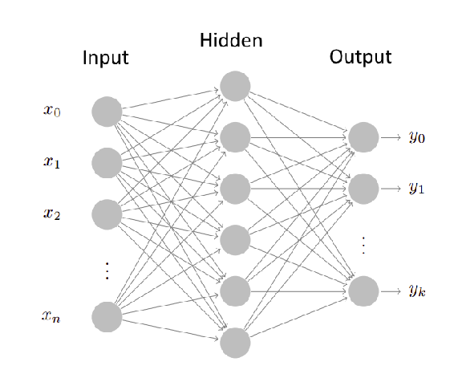

DeepLearning4J 让我们可以轻松设计这样的网络。如果我们采用上图中的网络，并尝试用 DeepLearning4j 实现它，我们可能会得到如下结果:

```
DenseLayer input = new DenseLayer.Builder().nIn(n).nOut(6).build();
nnet.layer(0, input);
OutputLayer output = new OutputLayer.Builder().nIn(6).nOut(k).build();
nnet.layer(1, output);

```

如你所见，阅读和理解并不难。所以，让我们使用它；为此，我们首先需要指定它对`pom.xml`文件的依赖性:

```
<dependency>
  <groupId>org.deeplearning4j</groupId>
  <artifactId>deeplearning4j-core</artifactId>
  <version>0.7.1</version>
</dependency>

```

注意，DeepLearning4j 和 ND4J 的版本必须相同。

为了便于说明，我们将使用 MNIST 数据集；该数据集包含从 0 到 9 的手写数字图像，目标是预测图像中给出的数字:

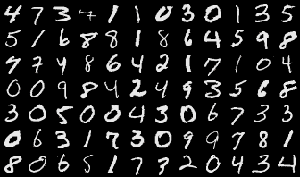

这个数据集非常有名。创建一个识别数字的模型通常可以作为神经网络和深度学习的 *Hello World* 。

本章从一个只有一个内层的简单网络开始。由于所有图像都是`28 * 28`像素，输入层应该有`28 * 28`个神经元(图片是灰度的，所以只有一个通道)。为了能够将图片输入到网络中，我们首先需要*将*展开成一个一维数组:


我们已经知道，使用 ND4J，这是非常容易做到的；我们只是调用`reshape(1, -1)`。然而，我们不需要这样做；DeepLearning4J 会自动处理，为我们重塑输入。

接下来，我们创建一个内层，我们可以从 1000 个神经元开始。既然有 10 个数字，那么输出层的神经元数应该等于 10。

现在，让我们在 DeepLearning4J 中实现这个网络。由于 MNIST 是一个非常受欢迎的数据集，库已经为它提供了一个方便的加载器，所以我们需要做的就是使用下面的代码:

```
int batchSize = 128;
int seed = 1;
DataSetIterator mnistTrain = new MnistDataSetIterator(batchSize, true, seed);
DataSetIterator mnistTest = new MnistDataSetIterator(batchSize, false, seed);

```

对于训练部分，有 50000 个标记的例子，有 10000 个测试的例子。为了迭代它们，我们使用 DeepLearning4j 的抽象- `DataSetIterator`。它在这里做的是获取整个数据集，洗牌，然后将它分成 128 张图片的批次。

我们准备批次的原因是神经网络通常使用**随机梯度下降** ( **SGD** )进行训练，并且训练是分批进行的；我们取一批，在上面训练一个模型，更新权重，然后取下一批。取一个批次并在其上训练一个模型被称为**迭代**，迭代所有可用的训练批次被称为**时期**。

获得数据后，我们可以指定网络的训练配置:

```
NeuralNetConfiguration.Builder config = new NeuralNetConfiguration.Builder();
config.seed(seed);
config.optimizationAlgo(OptimizationAlgorithm.STOCHASTIC_GRADIENT_DESCENT);
config.learningRate(0.005);
config.regularization(true).l2(0.0001);

```

在这段代码中，我们说我们希望使用 SGD 进行训练，学习率为`0.005`，L2 正则化为`0.0001`。SGD 是一个合理的默认值，你应该坚持使用它。

学习率是最重要的训练配置参数。如果我们把它设置得太高，那么训练过程将会发散，如果它太小，在收敛之前将会花费很多时间。为了选择最佳的学习速率，我们通常为诸如 0.1、0.01、0.001，...，0.000001，看看神经网络什么时候停止发散。

我们在这里使用的另一个东西是 L2 正则化。L1 和 L2 正则化的工作方式与逻辑回归等线性模型完全相同——它们通过减小权重来避免过度拟合，而 L1 则确保了解的稀疏性。

然而，有专门针对神经网络的正则化策略——dropout 和 dropconnect，它们在每次训练迭代中使网络的随机部分静音。我们可以在配置中为整个网络指定它们:

```
config.dropOut(0.1);

```

但是更好的方法是在每一层指定它们——我们将在后面看到如何做。

一旦我们完成了训练配置，我们就可以继续指定网络的架构，也就是说，比如它的层和每层中神经元的数量。

为此我们得到了一个`ListBuilder`类的对象:

```
ListBuilder architecture = config.list();

```

现在，让我们添加第一层:

```
DenseLayer.Builder innerLayer = new DenseLayer.Builder();
innerLayer.nIn(28 * 28);
innerLayer.nOut(1000);
innerLayer.activation("tanh");
innerLayer.weightInit(WeightInit.UNIFORM);
architecture.layer(0, innerLayer.build());

```

正如我们之前讨论的，输入层中神经元的数量应该等于图像的大小，即 28 乘以 28。由于内层有 1000 个神经元，所以这一层的输出是 1000 个。

此外，我们在这里指定激活函数和权重初始化策略。

激活函数是应用于每个神经元输出的非线性变换。可以有几种激活功能:

| **激活** | **Plot** |
| 线性:无激活 | 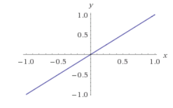 |
| 乙状结肠:`[0, 1]`范围 | 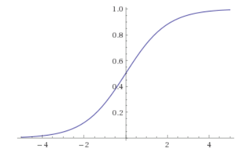 |
| tanh: `[-1, 1]`范围 | 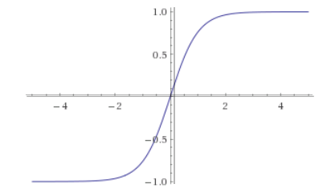 |
| 备注:t0]范围 | 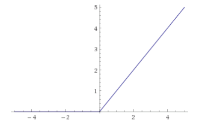 |
| leaky 指出:`[-infinity, infinity]` |  |

对于这个例子，我们使用了`tanh`，这是深度学习之前的浅层网络的默认选项。然而，对于深层网络，ReLU 激活通常应该是优选的，因为它们解决了消失梯度问题。

**Vanishing gradient** is a problem that occurs during the training of neural networks. For training, we calculate the gradient--the direction which we need to follow, and update the weights based on that. This problem occurs when we use `sigmoid` or `tanh` activations in deep networks--the first layers (processed last during optimization) have a very small gradient and do not get updated at all. 

不过 ReLU 有时候也会有一个问题，叫做**死 ReLU** ，可以使用 LeakyReLU 等其他激活函数解决。

如果 ReLU 函数的输入为负，那么输出正好为零，这意味着在许多情况下神经元没有被激活。此外，在训练导数时，在这种情况下，is 为零，因此跟随梯度可能永远不会更新权重。这就是所谓的**死亡问题，许多神经元从未被激活并死亡。这个问题可以使用 LeakyReLU 激活来解决，它不是总是输出负值的零，而是输出非常小的东西，所以仍然可以计算梯度。**

我们在这里指定的另一件事是权重初始化。通常，在我们训练一个网络之前，我们需要初始化参数，一些初始化比另一些更好，但是，通常，这是特定于情况的，并且通常我们需要尝试几种方法，然后选择一种特定的方法。

| **权重初始化方法** | **评论** |
| `WeightInit.ZERO` | 在这里，所有的权重都被设置为零。不建议这样做。 |
| `WeightInit.UNIFORM` | 这里，权重被设置为`[-a, a]`范围内的统一值，其中`a`取决于神经元的数量。 |
| `WeightInit.XAVIER` | 这是有方差的高斯分布，它取决于神经元的数量。如果有疑问，请使用此初始化。 |
| `WeightInit.RELU` | 这是比`XAVIER`中方差更高的高斯分布。它有助于解决垂死的 ReLU 问题。 |
| `WeightInit.DISTRIBUTION` | 这允许您指定将从中对权重进行采样的任何分布。在这种情况下，分布是这样设置的:`layer.setDist(new NormalDistribution(0, 0.01));`。 |
| 其他人 | 还有其他权重初始化策略，参见`WeightInit`类的 JavaDocs。 |

`UNIFORM`和`XAVIER`方法通常是很好的起点；先试试它们，看看它们是否能产生好的结果。如果没有，那就尝试实验，选择一些其他的方法。

如果你遇到了将死的 ReLU 问题，那么最好使用`WeightInit.RELU`初始化方法。否则，使用`WeightInit.XAVIER`。

接下来，我们指定输出层:

```
architecture.layer(1, outputLayer.build());

```

对于输出层，我们需要指定`loss`函数——训练时我们希望用网络优化的函数。有多种选择，但最常见的如下:

*   `LossFunction.NEGATIVELOGLIKELIHOOD`，也就是`LogLoss`。用这个来分类。
*   `LossFunction.MSE`，即均方误差。用它来回归。

你可能已经注意到，这里我们使用了一个不同的激活函数- softmax，我们以前没有涉及过这个激活。这是将`sigmoid`函数推广到多个类。如果我们有一个二元分类问题，并且我们只想预测一个值，属于正类的概率，那么我们使用一个`sigmoid`。但是如果我们的问题是多类的，或者我们为二分类问题输出两个值，那么我们需要使用 softmax。如果我们解决回归问题，那么我们使用线性激活函数。

| **输出激活** | **何时使用** |
| `sigmoid` | 二元分类 |
| `softmax` | 多类分类 |
| `linear` | 回归 |

现在，当我们建立了体系结构后，我们就可以从中构建网络了:

```
MultiLayerNetwork nn = new MultiLayerNetwork(architecture.build());
nn.init();

```

监控训练进度并将分数视为模型训练通常是有用的，为此我们可以使用`ScoreIterationListener`——它订阅模型，并在每次迭代后输出新的训练分数:

```
nn.setListeners(new ScoreIterationListener(1));

```

现在我们准备训练网络:

```
int numEpochs = 10;
for (int i = 0; i < numEpochs; i++) {
    nn.fit(mnistTrain);
}

```

在这里，我们对网络进行 10 个时期的训练，也就是说，我们对整个训练数据集迭代 10 次，如果你记得的话，每个时期由许多 128 大小的批次组成。

一旦训练完成，我们就可以在测试中评估模型的性能。为此，我们创建一个特殊的类型为`Evaluation`的对象，然后我们迭代测试集的批次，并将模型应用于每一批次。每次我们这样做的时候，我们都会更新`Evaluation`对象，它跟踪整体性能。

一旦训练完成，我们就可以评估模型的性能。为此，我们创建一个类型为`Evaluation`的特殊对象，然后迭代验证数据集，并将模型应用于每一批。结果由`Evaluation`类记录，最后我们可以看到结果:

```
while (mnistTest.hasNext()) {
    DataSet next = mnistTest.next();
    INDArray output = nn.output(next.getFeatures());
    eval.eval(next.getLabels(), output);
}

System.out.println(eval.stats());

```

如果我们运行它 10 个时期，它将产生这个:

```
Accuracy:        0.9
Precision:       0.8989
Recall:          0.8985
F1 Score:        0.8987

```

因此，性能并不令人印象深刻，为了提高性能，我们可以修改架构，例如，添加另一个内层:

```
DenseLayer.Builder innerLayer1 = new DenseLayer.Builder();
innerLayer1.nIn(numrow * numcol);
innerLayer1.nOut(1000);
innerLayer1.activation("tanh");
innerLayer1.dropOut(0.5);
innerLayer1.weightInit(WeightInit.UNIFORM);
architecture.layer(0, innerLayer1.build());

DenseLayer.Builder innerLayer2 = new DenseLayer.Builder();
innerLayer2.nIn(1000);
innerLayer2.nOut(2000);
innerLayer2.activation("tanh");
innerLayer2.dropOut(0.5);
innerLayer2.weightInit(WeightInit.UNIFORM);
architecture.layer(1, innerLayer2.build());

LossFunction loss = LossFunction.NEGATIVELOGLIKELIHOOD;
OutputLayer.Builder outputLayer = new OutputLayer.Builder(loss);
outputLayer.nIn(2000);
outputLayer.nOut(10);
outputLayer.activation("softmax");
outputLayer.weightInit(WeightInit.UNIFORM);
architecture.layer(2, outputLayer.build());

```

正如你所看到的，这里我们在第一层和输出层之间添加了一个额外的层，带有`2000`神经元。我们还为每个图层添加了 dropout，以实现正则化。

通过这种设置，我们可以获得稍好的精度:

```
Accuracy:        0.9124
Precision:       0.9116
Recall:          0.9112
F1 Score:        0.9114

```

当然，改善只是边缘性的，网络还远远没有调好。为了改善它，我们可以使用 ReLU 激活，内斯特罗夫的动量 0.9 左右的更新程序，以及 XAVIER 的权重初始化。这应该给出高于 95%的准确度。事实上，在来自官方 DeepLearning4j 知识库的示例中，您可以找到一个非常好的网络；寻找名为`MLPMnistSingleLayerExample.java`的类。

在我们的例子中，我们使用经典的神经网络；它们相当浅(也就是说，它们没有很多层)，并且所有层都是完全连接的。虽然对于小规模的问题，这可能已经足够好了，但通常最好使用卷积神经网络来执行图像识别任务，这些网络考虑到了图像结构，可以实现更好的性能。


# 卷积神经网络

正如我们已经多次提到的，神经网络可以自己完成特征工程部分，这对于图像尤其有用。现在我们将最终看到这一点。为此，我们将使用卷积神经网络，它们是一种特殊的神经网络，使用特殊的卷积层。它们非常适合图像处理。

在通常的神经网络中，各层是完全连接的，这意味着一层的每个神经元都连接到前一层的所有神经元。对于 MNIST 的数字图像来说，这没什么大不了的，但是对于更大的图像来说，这就成问题了。想象一下，我们需要处理大小为`300 x 300`的图像；在这种情况下，输入层将有 90，000 个神经元。那么，如果下一层也有 9 万个神经元，那么这两层之间就会有`90000 x 90000`连接，这显然是很多的。

然而，在图像中，每个像素只有一小部分是重要的。因此，前面的问题可以通过只考虑每个像素的小邻域来解决，这正是卷积层所做的；在里面，他们保存了一套小尺寸的过滤器。然后，我们在图像上滑动一个窗口，并计算窗口中的内容与每个过滤器的相似性:

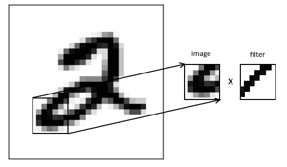

过滤器是这些卷积层中的神经元，它们是在训练阶段学习的，与通常的全连接情况类似。

当我们在图像上滑动窗口时，我们计算内容与过滤器的相似性，这是它们之间的点积。对于每个窗口，我们将结果写入输出。当所考虑的区域与过滤器相似时，我们说过滤器被激活。显然，如果相似，点积将倾向于产生更高的值。

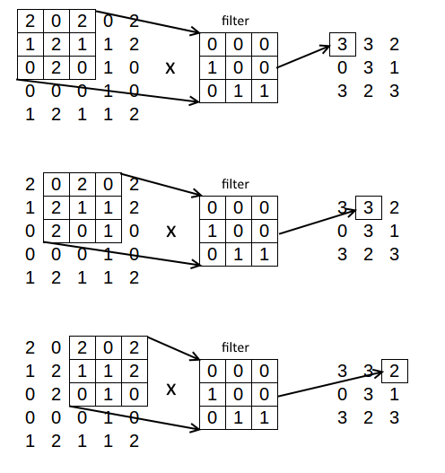

由于图像通常有多个通道，我们实际上处理的是维度的体积(或 3D 张量):通道数、高度、宽度和宽度。当图像通过卷积层时，每个滤波器被依次应用，作为输出，我们有维度体积**滤波器数量**乘以**高度**乘以**宽度**。当我们将这样的层堆叠在彼此之上时，我们得到一系列的体积:


除了卷积层之外，另一种层类型对于卷积网络也很重要，即下采样层或汇集层。这一层的目的是降低输入的维数，通常每边降低 2 倍，所以总共降低 4 倍。通常，我们使用最大池，在缩减采样时保持最大值:


我们这样做的原因是为了减少我们网络的参数数量，这使得训练速度大大加快。

当这样的层获得体积时，它仅改变高度和宽度，而不改变过滤器的数量。通常，我们将池层放在卷积层之后，并且通常组织架构，使两个卷积层之后跟随一个池层:


然后，在某种程度上，在我们添加了足够的卷积层之后，我们切换到全连接层，这与我们在常见网络中的层类型相同。最后，我们有了输出层，就像之前一样。

让我们继续 MNIST 的例子，但这次让我们训练一个卷积神经网络来识别数字。对于这个任务，有一个著名的架构叫做 LeNet(由 Yann LeCun 研究员创建)，让我们来实现它。我们将基于他们的资源库中可用的官方 DeepLearning4j 示例来给出我们的示例。

该架构如下所示:

*   `5 x 5`带 20 个滤波器的卷积层
*   最大池化
*   `5 x 5`带 50 个滤波器的卷积层
*   最大池化
*   具有 500 个神经元的完全连接的层
*   使用 softmax 输出图层

所以这个网络有六层。

像以前一样，首先，我们指定网络的训练配置:

```
NeuralNetConfiguration.Builder config = new NeuralNetConfiguration.Builder();
config.seed(seed);
config.regularization(true).l2(0.0005);
config.learningRate(0.01);
config.weightInit(WeightInit.XAVIER);
config.optimizationAlgo(OptimizationAlgorithm.STOCHASTIC_GRADIENT_DESCENT);
config.updater(Updater.NESTEROVS).momentum(0.9);

```

这里几乎没有什么新东西，除了`Updater`；我们使用内斯特罗夫的更新，动量设置为`0.9`。这样做的目的是加快收敛。

现在我们可以创建架构了:

```
ListBuilder architect = config.list();

```

首先，卷积层:

```
ConvolutionLayer cnn1 = new ConvolutionLayer.Builder(5, 5)
        .name("cnn1")
        .nIn(nChannels)
        .stride(1, 1)
        .nOut(20)
        .activation("identity")
        .build();
architect.layer(0, cnn1);

```

这里，在构建器的构造函数中，我们指定了过滤器的维数，即`5 x 5`。然后将`nIn`参数设置为输入图像的通道数，对于 MNIST 为 1，它们都是灰度图像。`nOut`参数指定了该图层的滤镜数量。stride 参数指定了我们在图像上滑动窗口的步骤，通常设置为`1`。最后，该层不使用任何激活。

架构中的下一层是池层:

```
SubsamplingLayer pool1 = new SubsamplingLayer.Builder(PoolingType.MAX)
        .name("pool1")
        .kernelSize(2, 2)
        .stride(2, 2)
        .build();
architect.layer(1, pool1);

```

当我们创建这一层时，我们首先指定我们想要缩减采样的方式，我们使用`MAX`，因为我们对最大池感兴趣。还有其他选项，如`AVG`平均值和`SUM`，但它们在实践中并不常用。

这一层有两个参数——`kernelSize`参数，它是我们在图片上滑动的窗口的大小，以及 stride 参数，它是我们在滑动窗口时采取的步骤。通常，这些值被设置为`2`。

然后，我们添加下一个卷积层和一个池层:

```
ConvolutionLayer cnn2 = new ConvolutionLayer.Builder(5, 5)
        .name("cnn2")
        .stride(1, 1)
        .nOut(50)
        .activation("identity")
        .build();
architect.layer(2, cnn2);
SubsamplingLayer pool2 = new SubsamplingLayer.Builder(PoolingType.MAX)
        .name("pool2")
        .kernelSize(2, 2)
        .stride(2, 2)
        .build();
architect.layer(3, pool2);

```

最后，我们创建全连接层和输出层:

```
DenseLayer dense1 = new DenseLayer.Builder()
        .name("dense1")
        .activation("relu")
        .nOut(500)
        .build();
architect.layer(4, dense1);
OutputLayer output = new OutputLayer.Builder(LossFunction.NEGATIVELOGLIKELIHOOD)
        .name("output")
        .nOut(outputNum)
        .activation("softmax")
        .build();
architect.layer(5, output);

```

对于最后两层，对我们来说没有什么新的，我们不使用任何新的参数。

最后，在训练之前，我们需要告诉优化器输入是一幅图片，这是通过指定输入类型来完成的:

```
architect.setInputType(InputType.convolutionalFlat(height, width, nChannels));

```

有了这个，我们就可以开始训练了:

```
for (int i = 0; i < nEpochs; i++) {
    model.fit(mnistTrain);
    Evaluation eval = new Evaluation(outputNum);

    while (mnistTest.hasNext()) {
        DataSet ds = mnistTest.next();
        INDArray out = model.output(ds.getFeatureMatrix(), false);
        eval.eval(ds.getLabels(), out);
    }

    System.out.println(eval.stats());
    mnistTest.reset();
}

```

对于这种架构，网络在一个历元之后可以达到的准确度是 97%，这明显好于我们之前的尝试。但训练它 10 个纪元后，准确率达到 99%。


# 猫和狗的深度学习

虽然 MNIST 是一个非常好的教育数据集，但它非常小。我们来看一个不同的图像识别问题:给定一张图片，我们想预测图片上是猫还是狗。

为此，我们将使用 kaggle 上一场比赛中的猫狗图片数据集，该数据集可以从[https://www.kaggle.com/c/dogs-vs-cats](https://www.kaggle.com/c/dogs-vs-cats)下载。

我们先从读取数据开始。


# 读取数据

对于狗对猫的比赛，有两个数据集；训练，用 25000 张狗和猫的图片，各占 50%，测试。出于本章的目的，我们只需要下载训练数据集。下载完成后，在某个地方解压。

文件名如下所示:

| `dog.9993.jpg`
`dog.9994.jpg`
 | `cat.10000.jpg`
`cat.10001.jpg`
 |
|  |  |

标签(`dog`或`cat`)被编码到文件名中。

如您所知，我们通常做的第一件事是将数据分成训练集和验证集。因为我们这里所有的都是文件的集合，所以我们只是得到所有的文件名，然后把它们分成两部分——训练和验证。

为此，我们可以使用这个简单的脚本:

```
File trainDir = new File(root,  "train");
double valFrac = 0.2;
long seed = 1;

Iterator<File> files = FileUtils.iterateFiles(trainDir, new String[] { "jpg" }, false);
List<File> all = Lists.newArrayList(files);
Random random = new Random(seed);
Collections.shuffle(all, random);

int trainSize = (int) (all.size() * (1 - valFrac));
List<File> train = all.subList(0, trainSize);
copyTo(train, new File(root, "train_cv"));

List<File> val = all.subList(trainSize, all.size());
copyTo(val, new File(root, "val_cv"));

```

在代码中，我们使用 Apache Commons IO 中的`FileUtils.iterateFiles`方法迭代训练目录中的所有`.jpg`文件。然后我们把所有这些文件放到一个列表里，洗牌，把它们分成 80%和 20%的部分。

`copyTo`方法只是将文件复制到指定的目录中:

```
private static void copyTo(List<File> pics, File dir) {
    for (File pic : pics) {
        FileUtils.copyFileToDirectory(pic, dir);
    }
}

```

在这里，`FileUtils.copyFileToDirectory`方法也来自 Apache Commons IO。

为了使用这些数据来训练网络，我们需要做很多事情。它们如下:

*   获取每张图片的路径
*   获取标签(文件名中的`dog`或`cat`)
*   调整输入的大小，使每张图片都具有相同的大小
*   对图像应用一些标准化
*   从中创建`DataSetIterator`

获取每个图片的路径很容易，我们已经知道如何做，我们可以像以前一样在 Commons IO 中使用相同的方法。但是现在我们需要为每个文件获取`URI`，因为 DeepLearning4j 数据集迭代器期望的是文件的`URI`，而不是文件本身。为此，我们创建了一个助手方法:

```
private static List<URI> readImages(File dir) {
    Iterator<File> files = FileUtils.iterateFiles(dir, 
                                 new String[] { "jpg" }, false);
    List<URI> all = new ArrayList<>();

    while (files.hasNext()) {
        File next = files.next();
        all.add(next.toURI());
    }

    return all;
}

```

从文件名中获取类名(`dog`或`cat`)是通过实现`PathLabelGenerator`接口来完成的:

```
private static class FileNamePartLabelGenerator implements PathLabelGenerator {

    @Override
    public Writable getLabelForPath(String path) {
        File file = new File(path);
        String name = file.getName();
        String[] split = name.split(Pattern.quote("."));
        return new Text(split[0]);
    }

    @Override
    public Writable getLabelForPath(URI uri) {
        return getLabelForPath(new File(uri).toString());
    }
}

```

在里面，我们只是用`.`分割文件名，然后取结果的第一个元素。

最后，我们创建一个方法，它接受一个列表`URI`并创建一个`DataSetIterator`:

```
private static DataSetIterator datasetIterator(List<URI> uris) 
                     throws IOException {
    CollectionInputSplit train = new CollectionInputSplit(uris);
    PathLabelGenerator labelMaker = new FileNamePartLabelGenerator();

    ImageRecordReader trainRecordReader = new ImageRecordReader(HEIGHT, WIDTH, CHANNELS, labelMaker);
    trainRecordReader.initialize(train);

    return new RecordReaderDataSetIterator(trainRecordReader, BATCH_SIZE, 1, NUM_CLASSES);
}

```

该方法使用一些常量，我们用以下值对其进行初始化:

```
HEIGHT = 128;
WIDTH = 128;
CHANNELS = 3;
BATCH_SIZE = 30;
NUM_CLASSES = 2;

```

`ImageRecordReader`将使用`HEIGHT`和`WIDTH`参数将图像调整到指定的形式，如果是灰度，它将人为地为其创建 RGB 通道。`BATCH_SIZE`指定了在训练过程中我们将一次考虑多少张图像。

在线性模型中，规范化起着重要的作用，有助于模型更快地收敛。对于神经网络也是如此，所以我们需要对图像进行归一化。为此，我们可以使用一个特殊的内置类`ImagePreProcessingScaler`。`DataSetIterator`可以有一个预处理器，所以我们把这个定标器放在那里:

```
DataSetIterator dataSet = datasetIterator(valUris);
ImagePreProcessingScaler preprocessor = new ImagePreProcessingScaler(0, 1);
dataSet.setPreProcessor(preprocessor);

```

这样，数据准备工作就完成了，我们可以继续创建模型。


# 创建模型

对于模型的架构，我们将使用 VGG 网络的变体。这个架构取自论坛的一个公开可用的脚本([https://www . ka ggle . com/jeffd 23/dogs-vs-cats-redux-kernels-edition/catdognet-keras-conv net-starter](https://www.kaggle.com/jeffd23/dogs-vs-cats-redux-kernels-edition/catdognet-keras-convnet-starter))，这里我们将把这个例子改编成 DeepLearning4j。

VGG 是在 2014 年 image net 挑战赛中获得第二名的模型，它仅使用 3 x 3 和 2 x 2 卷积滤波器。

使用现有的架构总是一个好主意，因为它可以解决很多时间——自己想出一个好的架构是一项具有挑战性的任务。

我们将使用的架构如下:

*   两层`3 x 3`卷积与 32 个滤波器
*   最大池化
*   两层`3 x 3`卷积与 64 个滤波器
*   最大池化
*   两层`3 x 3`卷积用 128 个滤波器
*   最大池化
*   具有 512 个神经元的全连接层
*   一个有 256 个神经元的全连接层
*   激活 softmax 的输出层

对于我们的例子，我们将对所有卷积和全连接层使用 ReLU 激活。为了避免垂死的 ReLU 问题，我们将使用`WeightInit.RELU`权重初始化方案。在我们的实验中，不使用它，网络倾向于产生相同的结果，不管它接收什么输入。

首先，我们从配置开始:

```
NeuralNetConfiguration.Builder config = new NeuralNetConfiguration.Builder();
config.seed(SEED);
config.weightInit(WeightInit.RELU);
config.optimizationAlgo(OptimizationAlgorithm.STOCHASTIC_GRADIENT_DESCENT);
config.learningRate(0.001);
config.updater(Updater.RMSPROP);
config.rmsDecay(0.99);

```

有些参数现在应该已经很熟悉了，但是这里有两个新东西——`RMSPROP`更新器和`rmsDecay`参数。使用它们可以让我们在训练时自适应地改变学习速度。开始时，学习率较大，我们向最小值迈出较大的步伐，但当我们训练并接近最小值时，它会降低学习率，我们迈出较小的步伐。

通过尝试不同的值如 0.1、0.001 和 0.0001 并观察网络何时停止发散来选择学习率。这很容易发现，因为当发散时，训练误差变化很大，然后开始输出无穷大或`NaN`。

现在我们指定架构。

首先，我们创建卷积层和池层:

```
int l = 0;
ListBuilder network = config.list();

ConvolutionLayer cnn1 = new ConvolutionLayer.Builder(3, 3)
        .name("cnn1")
        .stride(1, 1)
        .nIn(3).nOut(32)
        .activation("relu").build();
network.layer(l++, cnn1);

ConvolutionLayer cnn2 = new ConvolutionLayer.Builder(3, 3)
        .name("cnn2")
        .stride(1, 1)
        .nIn(32).nOut(32)
        .activation("relu").build();
network.layer(l++, cnn2);

SubsamplingLayer pool1 = new SubsamplingLayer.Builder(PoolingType.MAX)
        .kernelSize(2, 2)
        .stride(2, 2) 
        .name("pool1").build();
network.layer(l++, pool1);

ConvolutionLayer cnn3 = new ConvolutionLayer.Builder(3, 3)
        .name("cnn3")
        .stride(1, 1)
        .nIn(32).nOut(64)
        .activation("relu").build();
network.layer(l++, cnn3);

ConvolutionLayer cnn4 = new ConvolutionLayer.Builder(3, 3)
        .name("cnn4")
        .stride(1, 1)
        .nIn(64).nOut(64)
        .activation("relu").build();
network.layer(l++, cnn4);

SubsamplingLayer pool2 = new SubsamplingLayer.Builder(PoolingType.MAX)
        .kernelSize(2, 2)
        .stride(2, 2)
        .name("pool2").build();
network.layer(l++, pool2);

ConvolutionLayer cnn5 = new ConvolutionLayer.Builder(3, 3)
        .name("cnn5")
        .stride(1, 1)
        .nIn(64).nOut(128)
        .activation("relu").build();
network.layer(l++, cnn5);

ConvolutionLayer cnn6 = new ConvolutionLayer.Builder(3, 3)
        .name("cnn6")
        .stride(1, 1)
        .nIn(128).nOut(128)
        .activation("relu").build();
network.layer(l++, cnn6);

SubsamplingLayer pool3 = new SubsamplingLayer.Builder(PoolingType.MAX)
        .kernelSize(2, 2)
        .stride(2, 2)
        .name("pool3").build();
network.layer(l++, pool3);

```

这里对我们来说应该没有什么新鲜的。然后我们创建完全连接的层和输出:

```
DenseLayer dense1 = new DenseLayer.Builder()
        .name("ffn1")
        .nOut(512).build();
network.layer(l++, dense1);

DenseLayer dense2 = new DenseLayer.Builder()
        .name("ffn2")
        .nOut(256).build();
network.layer(l++, dense2);

OutputLayer output = new OutputLayer.Builder(LossFunction.NEGATIVELOGLIKELIHOOD)
        .name("output")
        .nOut(2)
        .activation("softmax").build();
network.layer(l++, output);

```

最后，如前所述，我们指定输入大小:

```
network.setInputType(InputType.convolutionalFlat(HEIGHT, WIDTH, CHANNELS));

```

现在，我们从该架构创建模型，并指定用于列车监控目的的分数监听器:

```
MultiLayerNetwork model = new MultiLayerNetwork(network.build())
ScoreIterationListener scoreListener = new ScoreIterationListener(1);
model.setListeners(scoreListener);

```

至于训练，发生的方式与我们之前所做的完全相同——我们训练模型几个时期:

```
List<URI> trainUris = readImages(new File(root, "train_cv"));
DataSetIterator trainSet = datasetIterator(trainUris);
trainSet.setPreProcessor(preprocessor);

for (int epoch = 0; epoch < 10; epoch++) {
    model.fit(trainSet);
}

ModelSerializer.writeModel(model, new File("model.zip"), true);

```

最后，我们还将模型保存到一个 ZIP 存档中，其中有三个文件——模型的系数，配置(参数和架构)在一个`.json`文件中，以及更新器的配置——以防我们希望在未来继续训练模型(最后一个参数`true`告诉我们保存它，使用`false`我们不能继续训练)。

然而，这里的性能监控非常原始，我们只观察训练错误，根本不观察验证错误。接下来，我们将了解更多性能监控选项。


# 监控性能

我们之前为监视所做的是添加监听器，它在每次迭代后输出模型的训练分数:

```
MultiLayerNetwork model = new MultiLayerNetwork(network.build())
ScoreIterationListener scoreListener = new ScoreIterationListener(1);
model.setListeners(scoreListener);

```

这将使您对模型的性能有所了解，但仅限于训练数据，但我们通常需要更多的数据——至少了解验证集的性能对于了解我们是否开始过度拟合是有用的。

那么，让我们来看看验证数据集:

```
DataSetIterator valSet = datasetIterator(valUris);
valSet.setPreProcessor(preprocessor);

```

为了训练，以前我们只是将数据集迭代器传递给 fit 函数。我们可以通过获取所有训练数据，在每个时期之前对其进行洗牌，并将其分成多个部分来改进这一过程，每个部分等于 20 个批次。在每个块上的训练完成后，我们可以迭代验证集，并查看模型的当前验证性能。

在代码中，它看起来像这样:

```
for (int epoch = 0; epoch < 20000; epoch++) {
    ArrayList<URI> uris = new ArrayList<>(trainUris);
    Collections.shuffle(uris);
    List<List<URI>> partitions = Lists.partition(uris, BATCH_SIZE * 20);

    for (List<URI> set : partitions) {
        DataSetIterator trainSet = datasetIterator(set);
        trainSet.setPreProcessor(preprocessor);
        model.fit(trainSet);
        showTrainPredictions(trainSet, model);
        showLogloss(model, valSet, epoch);
    }

    saveModel(model, epoch);
}

```

所以在这里，我们将`URI`进行洗牌，并将其划分为 20 个批次的列表。对于分区，我们使用 Google Guava 的`Lists.partition`方法。从每个这样的分区，我们创建一个数据集迭代器，并使用它来训练模型，然后，在每个块之后，我们查看验证分数，以确保网络不会过度拟合。

此外，查看网络对其刚刚接受训练的数据的预测是有帮助的，尤其是检查网络是否正在学习任何东西。我们在`showTrainPredictions`方法内部做这件事。如果不同的输入有不同的预测，那么这是一个好现象。此外，您可能希望了解预测与实际标签的接近程度。

此外，我们在每个时期结束时保存模型，以防出错，我们可以训练流程。如果您注意到了，我们将历元的数量设置为一个很高的数字，因此在某些时候我们可以停止训练(例如，当我们从日志中看到我们开始过度拟合时)，并只采用最后一个好的模型。

让我们看看这些方法是如何实现的:

```
private static void showTrainPredictions(DataSetIterator trainSet, 
            MultiLayerNetwork model) {
    trainSet.reset();
    DataSet ds = trainSet.next();
    INDArray pred = model.output(ds.getFeatureMatrix(), false);
    pred = pred.get(NDArrayIndex.all(), NDArrayIndex.point(0));
    System.out.println("train pred: " + pred);
}

```

`showLogLoss`方法很简单，但是由于迭代器的原因有点冗长。它执行以下操作:

*   检查认证数据集中的所有批次
*   记录每批的预测和真实标签
*   将所有预测放在一个双数组中，并对实际标签进行同样的操作
*   使用我们在[第 4 章](24f23333-1326-47d1-9cb2-9ab9c53f82e8.xhtml)、*监督学习-分类和回归*中编写的代码计算测井曲线损失。

为了简洁起见，我们在这里省略了确切的代码，但是欢迎您查看代码包。

保存模型很简单，我们已经知道如何做了。这里我们只是在文件名中添加了一些关于纪元编号的额外信息:

```
private static void saveModel(MultiLayerNetwork model, int epoch) throws IOException {
    File locationToSave = new File("models", "cats_dogs_" + epoch + ".zip");
    boolean saveUpdater = true;
    ModelSerializer.writeModel(model, locationToSave, saveUpdater);
}

```

现在，当我们有大量信息要监控时，从日志中理解所有信息变得相当困难。为了让我们的生活更轻松，DeepLearning4j 附带了一个特殊的图形仪表盘来进行监控。

这是仪表板的外观:

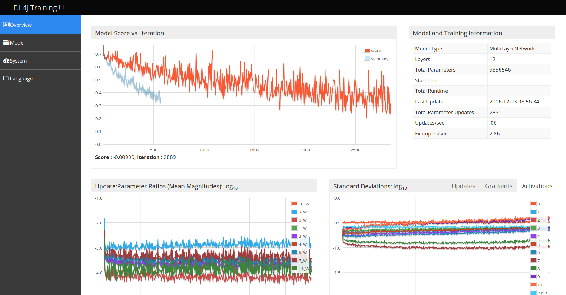

让我们将它添加到代码中。首先，我们需要向我们的`pom`添加一个额外的依赖项:

```
<dependency>
  <groupId>org.deeplearning4j</groupId>
  <artifactId>deeplearning4j-ui_2.10</artifactId>
  <version>0.7.1</version>
</dependency>

```

它是用 Scala 写的，这也是为什么结尾有`_2.10`后缀的原因，它告诉我们这个版本是用 Scala 2.10 写的。因为我们在 Java 中使用它，所以这对我们来说无关紧要，所以我们可以选择任何我们想要的版本。

接下来，我们可以创建 UI 服务器的实例，并为网络创建一个特殊的侦听器，它将订阅网络的更新:

```
UIServer uiServer = UIServer.getInstance();
StatsStorage statsStorage = new InMemoryStatsStorage();
uiServer.attach(statsStorage);
StatsListener statsListener = new StatsListener(statsStorage);

```

我们以与使用`ScoreIterationListener`相同的方式使用它，我们通过`setListeners`方法将它添加到模型中:

```
MultiLayerNetwork model = createNetwork();
ScoreIterationListener scoreListener = new ScoreIterationListener(1);
model.setListeners(scoreListener, statsListener);

```

有了这些改变，当我们运行代码的时候，它就启动了 UI 服务器，我们打开浏览器去`http://localhost:9000`就能看到；这将显示前面代码中的仪表板。

这些图表很有用。最有用的是显示每次迭代的模型得分的图表。这是训练分数，与我们在`ScoreIterationListener`的日志中看到的分数相同，看起来像这样:

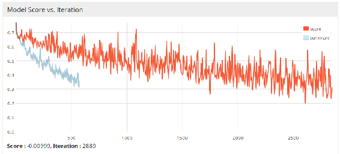

根据这个图表，我们可以了解模型在训练过程中的行为——训练过程是否稳定，或者模型是否在学习任何东西。理想情况下，我们应该看到如前面截图所示的下降趋势。如果分数没有下降，那么可能是网络配置有问题，比如学习率太小，不好好初始化权重或者正则化太多。如果分数有提高，那么最有可能的问题就是学习率过大。

其他图表也允许监控训练过程。“参数比率”图表以对数标度显示了每次迭代之间的参数变化(即，-3.0 对应于 0.001 次迭代之间的变化)。如果你看到变化太低，例如低于-6.0，那么，很可能，网络没有学到任何东西。

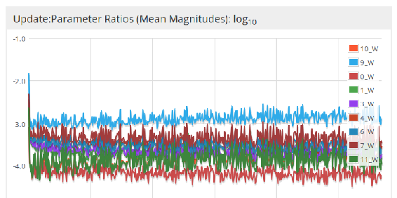

最后，有一个图表显示了所有激活的标准偏差。我们可能需要这样做的原因是为了检测所谓的*消失*和*爆发*激活:

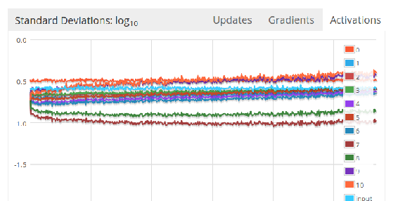

**消失激活**问题与**消失渐变**问题相关。对于一些激活，输入结果的变化几乎没有输出的变化，梯度几乎为零，所以神经元没有更新，所以它的激活*消失*。爆炸式激活则相反，激活分数不断增长，直至达到无穷大。

在此界面中，我们还可以在 Models 选项卡上看到完整的网络。这是我们模型的一部分:

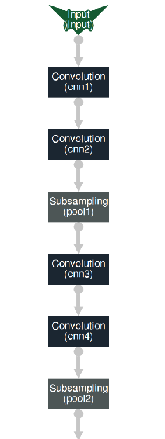

如果我们单击每个单独的层，我们可以看到该特定层的一些图表。

使用这些工具，我们可以密切监控模型的性能，并在发现异常情况时调整训练过程和参数。


# 数据扩充

对于这个问题，我们只有 25000 个训练样本。对于深度学习模型来说，这个数据量通常不足以捕捉所有细节。无论我们的网络有多复杂，我们花了多少时间来调整它，在某些时候 25，000 个例子都不足以进一步提高性能。

通常，获取更多数据非常昂贵，或者根本不可能。但是我们能做的是从我们已经拥有的数据中产生更多的数据，这被称为**数据扩充**。通常，我们通过执行以下一些转换来生成新数据:

*   旋转图像
*   翻转图像
*   随机裁剪图像
*   切换颜色通道(例如，更改红色和蓝色通道)
*   更改颜色饱和度、对比度和亮度
*   添加噪声

在这一章中，我们将会看到前三种变换——旋转、翻转和裁剪。为此，我们将使用`Scalr` -一个用于图像操作的库。让我们将它添加到`pom`文件中:

```
<dependency>
  <groupId>org.imgscalr</groupId>
  <artifactId>imgscalr-lib</artifactId>
  <version>4.2</version>
</dependency>

```

它非常简单，只是扩展了标准的 Java API，就像 Apache Commons Lang 所做的一样——通过围绕标准功能提供有用的实用方法。

对于旋转和翻转，我们只需使用`Scalr.rotate`方法:

```
File image = new File("cat.10000.jpg");
BufferedImage src = ImageIO.read(image);
Rotation rotation = Rotation.CW_90;
BufferedImage rotated = Scalr.rotate(src, rotation);
File outputFile = new File("cat.10000_cw_90.jpg");
ImageIO.write(rotated, "jpg", outputFile);

```

如你所见，这很容易使用，也很直观。我们需要做的就是传递一个`BufferedImage`和期望的`Rotation`。`Rotation`是一个具有以下值的枚举:

*   `Rotation.CW_90`:顺时针旋转 90 度
*   `Rotation.CW_180`:顺时针旋转 180 度
*   `Rotation.CW_270`:顺时针旋转 270 度
*   这包括水平翻转图像
*   这包括垂直翻转图像

裁剪也不难，它是通过`Scalr.crop`方法完成的，该方法接受四个参数——裁剪开始的位置(`x`和`y`坐标)和裁剪的大小(高度和宽度)。对于我们的问题，我们可以做的是在图像的左上角随机选择一个坐标，然后随机选择作物的高度和宽度。我们可以这样做:

```
int width = src.getWidth();
int x = rnd.nextInt(width / 2);
int w = (int) ((0.7 + rnd.nextDouble() / 2) * width / 2);

int height = src.getHeight();
int y = rnd.nextInt(height / 2);
int h = (int) ((0.7 + rnd.nextDouble() / 2) * height / 2);

if (x + w > width) {
    w = width - x;
}

if (y + h > height) {
    h = height - y;
}

BufferedImage crop = Scalr.crop(src, x, y, w, h);

```

这里，我们首先随机选择`x`和`y`坐标，然后选择宽度和高度。在代码中，我们选择重量和高度，使它们至少占图像的 35%——但可以达到图像的 60%。当然，您可以随意使用这些参数，将它们更改为更有意义的值。

然后，我们还检查我们是否没有克服图像边界，也就是说，作物总是停留在图像内；最后我们调用`crop`方法。或者，我们也可以在最后旋转或翻转裁剪后的图像。

因此，对于所有文件，它可能看起来像这样:

```
for (File f : all) {
    BufferedImage src = ImageIO.read(f);
    for (Rotation rotation : Rotation.values()) {
        BufferedImage rotated = Scalr.rotate(src, rotation);
        String rotatedFile = f.getName() + "_" + rotation.name() + ".jpg";
        File outputFile = new File(outputDir, rotatedFile);
        ImageIO.write(rotated, "jpg", outputFile);

        int width = src.getWidth();
        int x = rnd.nextInt(width / 2);
        int w = (int) ((0.7 + rnd.nextDouble() / 2) * width / 2);

        int height = src.getHeight();
        int y = rnd.nextInt(height / 2);
        int h = (int) ((0.7 + rnd.nextDouble() / 2) * height / 2);

        if (x + w > width) {
            w = width - x;
        }

        if (y + h > height) {
            h = height - y;
        }

        BufferedImage crop = Scalr.crop(src, x, y, w, h);
        rotated = Scalr.rotate(crop, rotation);

        String cropppedFile = f.getName() + "_" + x + "_" + w + "_" +
                    y + "_" + h + "_" + rotation.name() + ".jpg";

        outputFile = new File(outputDir, cropppedFile);
        ImageIO.write(rotated, "jpg", outputFile);
    }
}

```

在这段代码中，我们迭代了所有的训练文件，然后我们将所有的旋转应用到图像本身，并从该图像中随机裁剪。这段代码应该从每个源图像生成 10 个新图像。例如，对于下面的一只猫的图像，将生成如下 10 个图像:

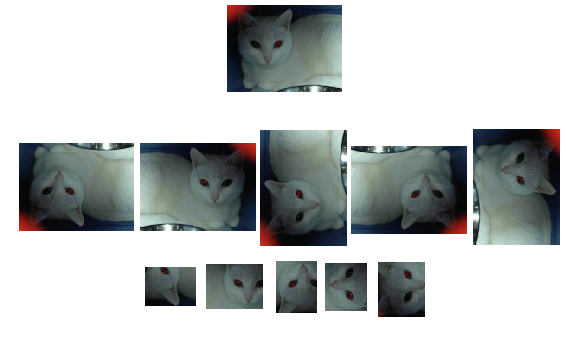

我们只是简单地列出了可能的增强，如果你还记得的话，最后一个是*添加随机噪声*。这通常很容易实现，因此这里有一些关于您可以做什么的想法:

*   用 0 或一些随机值替换一些像素值
*   从所有值中加上或减去同一个小数字
*   生成一些具有小方差的高斯噪声，并将其添加到所有通道中
*   仅将噪声添加到图像的一部分
*   反转图像的一部分
*   向图像中添加某种随机颜色的填充正方形；颜色可以有 alpha 通道(也就是说，它可以有点透明)，也可以没有
*   对图像应用强 JPG 编码

这样，您就可以虚拟地生成无限数量的数据样本来进行训练。当然，您可能不需要这么多样本，但通过使用这些技术，您可以扩充任何影像数据集，并显著提高基于此数据训练的模型的性能。


# 在 GPU 上运行 DeepLearning4J

正如我们之前提到的，DeepLearning4j 依赖 ND4J 进行数值计算。ND4J 是一个接口，有多种可能的实现。到目前为止，我们使用的是基于 OpenBLAS 的版本，但还有其他版本。我们还提到，ND4J 可以利用一个**图形处理单元** ( **GPU** )，对于矩阵乘法等神经网络中使用的典型线性代数运算，它比 CPU 快得多。要使用它，我们需要获得 CUDA ND4J 后端。

CUDA 是一个用于在 NVidia 的 GPU 上执行计算的接口，它支持广泛的图形卡。在内部，ND4J 使用 CUDA 在 GPU 上运行数值计算。

如果你以前通过 BLAS 在 CPU 上执行过所有的代码，你一定注意到它有多慢。将 ND4J 后端切换到 CUDA 应该会将性能提高几个数量级。

这是通过在`pom`文件中包含以下依赖项来实现的:

```
<dependency>
  <groupId>org.nd4j</groupId>
  <artifactId>nd4j-cuda-7.5</artifactId>
  <version>0.7.1</version>
</dependency>

```

这种依赖性假设您已经安装了 CUDA 7.5。

对于 CUDA 8.0，你应该把 7.5 换成 8.0:ND4J 支持 CUDA 7.5 和 CUDA 8.0。

如果您已经有一个安装了所有驱动程序的 GPU，只需添加这种依赖关系就足以使用 GPU 来训练网络，当您这样做时，您将看到性能的大幅提升。

更重要的是，您可以使用 UI 仪表板来监控 GPU 内存使用情况，如果您发现它很低，您可以尝试更好地利用它，例如，通过增加批处理大小。您可以在**系统**选项卡上找到该图表:

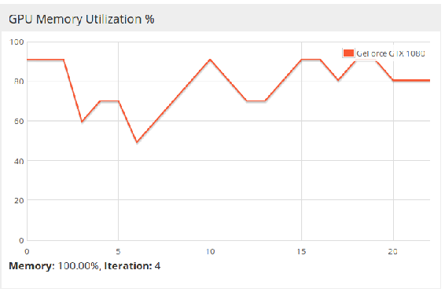

如果你没有图形处理器，但不想等待你的 CPU 处理数据，你可以很容易地租一台图形处理器计算机。有些云提供商，比如亚马逊 AWS，可以让你立即获得一台带有 GPU 的服务器，哪怕只是几个小时。

如果你从未在亚马逊 AWS 上租用过服务器，我们已经准备了简单的说明，告诉你如何在那里开始培训。

在租用服务器之前，让我们先准备好我们需要的一切；代码和数据。

对于数据，我们只需将所有文件(包括扩充的文件)放入一个归档文件中:

```
zip -r all-data.zip  train_cv/  val_cv/

```

然后，我们需要构建代码，这样我们就有了所有的`.jar`文件，并且它们之间存在依赖关系。这是通过 Maven 的插件`maven-dependency-plugin`完成的。我们之前已经在第三章、*探索性数据分析*中使用过这个插件，所以我们将省略需要添加到我们的`pom.xml`文件中的 XML 配置。

现在我们使用 Maven 来编译我们的代码，并将其放入一个`.jar`文件中:

```
mvn package

```

在我们的例子中，项目名为`chapter-08-dl4j`，所以用 Maven 执行包目标会在`target`文件夹中创建一个`chapter-08-dl4j-0.0.1-SNAPSHOT.jar`文件。但是因为我们也使用了依赖插件，它创建了一个`libs`文件夹，在那里你可以找到所有的依赖。让我们把一切都放入一个`.zip`文件中:

```
zip -r code.zip chapter-08-dl4j-0.0.1-SNAPSHOT.jar libs/

```

执行准备步骤后，我们将有两个 ZIP 文件，`all-data.zip`和`code.zip`。

现在，当我们准备好程序和数据后，我们可以去[aws.amazon.com](http://aws.amazon.com)登录控制台，或者创建一个帐户(如果你还没有)。进入后，选择 EC2，这将带您进入 EC2 仪表板。接下来，您可以选择您感兴趣的地区。你可以选择地理位置相近的或者最便宜的。通常，北弗吉尼亚和美国西俄勒冈相对于其他地方来说是相当便宜的。

然后，找到**启动实例**按钮并点击它。

如果您只在几个小时内需要一台 GPU 计算机，您可以选择创建一个 spot 实例——它们比通常的实例便宜，但它们的价格是动态的，在某些时候，如果有人愿意为您正在使用的实例支付更多费用，这样的实例可能会消亡。在启动它的时候，你可以设置一个价格阈值，如果你在那里选择了$1 这样的东西，那么这个实例应该会持续很长时间。

创建实例时，可以使用现有的 AMI，它是预安装了某些软件的系统的映像。这里最好的选择是寻找 CUDA，它会给你官方的 NVidia CUDA 7.5 映像，但你可以自由选择你想要的任何其他映像。

注意，有些阿美族不是免费的，选择时要慎重。此外，选择您可以信任的 AMI 提供者，因为有时可能会有恶意图像，它们会将计算资源用于您的任务之外的其他事情。如果有疑问，请使用 NVidia 官方图像，或者自己从头创建一个图像。

一旦选择了图像，就可以选择实例类型。对于我们的目的来说，`g2.2.xlarge`实例已经足够了，但是如果您愿意，还有更大更强大的实例。

接下来，你需要选择存储类型；我们不需要任何东西，可以跳过这一步。但是接下来很重要，我们在这里设置安全规则。由于 UI 仪表板运行在端口 9，000 上，我们需要打开它，这样就可以从外部访问它。然后我们可以添加一个定制的 TCP 规则，并在那里写入`9000`。

在这一步之后，我们就完成了，可以在查看详细信息之前启动实例了。

接下来，它会要求您为实例指定 ssh 的密钥对(`.pem`)，如果您没有密钥对，可以创建并下载一个新的密钥对。让我们创建一个名为`dl4j`的密钥对，并将其保存到主文件夹中。

现在，实例已经启动，可以使用了。要访问它，请转到仪表板并找到该实例的公共 DNS，这是您可以用来从您的机器访问服务器的名称。让我们将它放入一个环境变量中:

```
EC2_HOST=ec2-54-205-18-41.compute-1.amazonaws.com

```

从现在开始，我们将假设您在 Linux 上使用 bash shell，但是它应该可以在 MacOS 或 Windows 上与 cygwin 或 MinGW 一起很好地工作。

现在，我们可以上传之前构建的`.jar`文件和数据。为此，我们将使用`sftp`。使用`pem`文件连接`sftp`客户端是这样完成的:

```
sftp -o IdentityFile=~/dl4j.pem ec2-user@$EC2_HOST

```

请注意，您应该位于包含数据和程序档案的文件夹中。然后，您可以通过执行以下命令来上传它们:

```
put code.zip
put all-data.zip

```

数据已经上传，所以现在我们可以对实例应用`ssh`来运行程序:

```
ssh -i "~/dl4j.pem" ec2-user@$EC2_HOST

```

我们要做的第一件事是打开档案:

```
unzip code.zip
unzip all-data.zip

```

如果由于某种原因，您的主文件夹中没有剩余的可用空间，运行`df -h`命令来查看是否有剩余空间。必须有其他具有可用空间的磁盘，您可以在其中存储数据。

到目前为止，我们已经打开了所有的文件，并准备好执行代码。但如果你用的是英伟达的 CUDA 7.5 AMI，它只有 Java 7 支持。因为我们使用 Java 8 编写代码，所以我们需要安装 Java 8:

```
sudo yum install java-1.8.0-openjdk.x86_64

```

当我们离开 ssh 会话时，我们不希望执行停止，所以最好在那里创建`screen`(如果您愿意，也可以使用`tmux`):

```
screen -R dl4j

```

现在我们在那里运行代码:

```
java8 -cp chapter-08-dl4j.jar:libs/* chapter08.catsdogs.VggCatDog ~/data

```

一旦你看到模型开始训练，你可以通过按下 *Ctrl* + *A* 然后按下 d 来分离屏幕。现在你可以关闭终端并使用 UI 来观看训练过程。为此，只需将`EC2_HOST:9000`放到浏览器中，其中`EC2_HOST`是实例的公共 DNS。

就是这样，现在你只需要等待一段时间，直到你的模型收敛。

一路上可能会有一些问题。

如果它说找不到`openblas`二进制文件，那么你有几个选择。您可以从`libs`文件夹中删除`dl4j-native`jar，或者安装 openblas。第一个选项可能更好，因为我们不需要使用 CPU。

您可能遇到的另一个问题是缺少 NVCC 可执行文件，这是 dj4j 的 CUDA 7.5 库所需要的。解决这个问题很简单，您只需要将 CUDA 二进制文件的路径添加到 path 变量中:

```
PATH=/usr/local/cuda-7.5/bin:$PATH

```


# 摘要

在这一章中，我们看了如何在 Java 应用程序中使用深度学习，学习了 DeepLearning4j 库的基础知识，然后尝试将其应用于一个图像识别问题，我们希望将图像分类为狗和猫。

在下一章，我们将介绍 Apache Spark——一个用于在机器集群上分发数据科学算法的库。